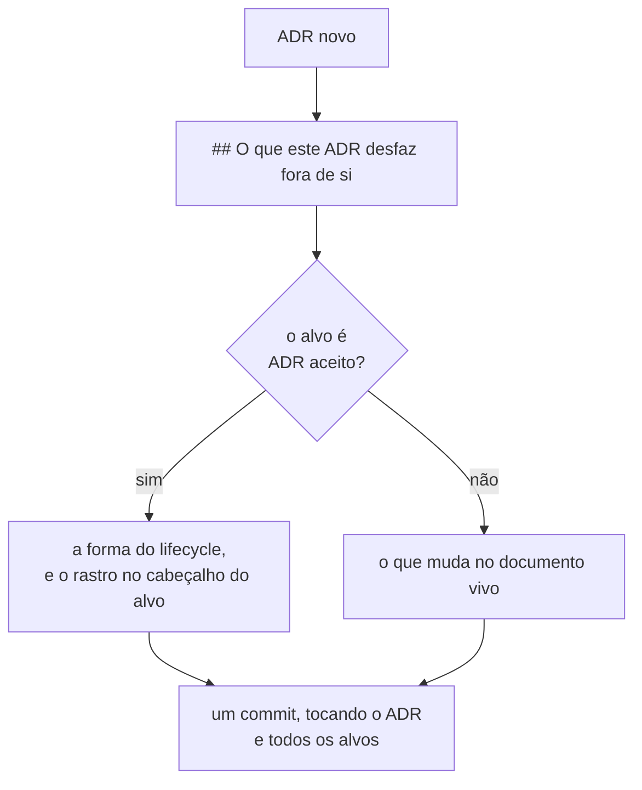

# Ciclo de vida de ADR

Use esta referência somente quando a mudança exigir um ADR.

## Antes de criar

- **Escreva o ADR depois de a pessoa tomar a decisão, e crie-o já com estado `Aceito`.**
  Regra adotada em 2026-08-04. O ADR registra escolha feita, e não escolha em debate.
- **Escrever ADR não é obrigatório.** Avalie primeiro se a escolha atende aos quatro
  critérios. Se não atender, o destino é um artefato de `docs/features/`, e nenhum ADR.
- **O debate acontece na fila de decisões, antes do documento.** Toda objeção e
  alternativa descartada vai para a linha da fila, no mesmo turno em que aparece.
- Escreva um ADR somente para alternativa plausível, impacto durável, restrição futura
  ou trade-off relevante.
- Escreva um ADR por vez. Não crie rascunhos antecipados ou em lote.
- Atribua o próximo número da série corrente ao criar o ADR. Use
  `NNNN-titulo-em-kebab-case.md`.
- Cite a série antiga como `arquivo/NNNN`. Nunca edite arquivo histórico.

## Enquanto estiver proposto

O estado `Proposto` continua disponível e deixou de ser o caminho padrão em 2026-08-04.
Use-o somente quando a pessoa pedir um ADR em debate, e não um registro de escolha feita.

- Use `references/adr.md` sem remover seções obrigatórias.
- Registre toda objeção, alternativa descartada ou pendência em `## Questões em aberto`
  no mesmo turno em que surgir.
- Use `aberto` ou `aberto (crítico)` para questão bloqueadora. Use `encaminhado` quando
  outra decisão identificada for responsável. Use `resolvida` somente com a origem da
  resolução.
- Mantenha `## Decisão` com o que foi escolhido. Registre o motivo em `## Justificativa`.
- Declare trade-off explícito, alternativa legítima descartada e sinal observável que
  encerra a validade da decisão.

## Aceite

- Nunca aceite por omissão. Exija aprovação explícita da pessoa responsável.
- Aceite somente sem questões `aberto` ou `aberto (crítico)`.
- Antes de remover `## Questões em aberto`, transporte cada questão `encaminhado`,
  inteira, para um arquivo próprio em `docs/questions/`, e acrescente a linha dela ao
  índice de `docs/questions/README.md`, no mesmo commit. **NÃO DEVE inventar a
  gramática do identificador nem copiá-la para cá:** o dono dela é
  `docs/questions/README.md`, seção "Identificador", e ele também é quem atribui o
  próximo número.
- Mova a decisão fechada para `## Decisão` ou `## Consequências` e então remova a seção de
  questões em aberto.

## Depois de aceito

**A imutabilidade do corpo foi revogada em 2026-08-07.** Um ADR aceito PODE receber
**patch** — a quinta forma. Corpo continua sendo tudo a partir da primeira seção `##`, e
um ADR aceito continua não sendo **apagado**.

**A divisão é a sexta forma, decidida em 2026-08-11.**

| Forma        | Quando ela se aplica                                                          |
|--------------|-------------------------------------------------------------------------------|
| substituição | uma decisão nova contradiz a antiga; a antiga vira `Substituído por ADR-NNNN` |
| subsunção    | a regra antiga continua correta no caso original, e o novo a generaliza       |
| emenda       | uma regra do ADR aceito muda sem que a decisão inteira caia                   |
| adendo       | o ADR cita um documento que vai deixar de existir; a seção nova entra no fim  |
| patch        | o corpo tem citação quebrada, caminho errado ou erro material a consertar     |
| divisão      | o ADR aceito carregava mais de uma decisão, e cede parte do corpo a um novo   |

- Substituição, subsunção, emenda, adendo e divisão exigem um **ADR novo** que as
  carregue. O patch não: ele é manutenção do próprio arquivo, e não decisão nova.
- **Patch NÃO DEVE alterar a decisão nem o argumento que a sustentava.** Se o texto novo
  muda o que foi decidido, não é patch — é emenda, substituição ou divisão, e exige ADR
  novo.
- **Nenhum patch sem a linha dele** em `## Patches aplicados`, no mesmo commit. Um corpo
  editado sem registro é exatamente o que a imutabilidade existia para impedir.
- Uma citação por número de linha para documento editável é **defeito a patchar**, e não
  motivo para congelar o alvo. Converta-a em âncora GFM e registre o patch.
- A regra completa de cada uma está em `docs/adr/README.md`, seções "A emenda e o adendo,
  decididos em 2026-08-05", "A revogação da imutabilidade, decidida em 2026-08-07" e
  "A divisão de um ADR aceito, decidida em 2026-08-11". Aplique-a a partir de lá; esta
  tabela é roteador, e não a norma.
- O ADR substituído ou subsumido permanece com o corpo intocado pelo ADR que o alterou. O
  **dividido** é a exceção: ele perde as subseções que cedeu, e nada do que saiu deixa de
  vigorar — passa a valer a partir do ADR novo. A divisão NÃO DEVE gerar linha em
  `## Patches aplicados`, e DEVE gerar `Última atualização` e
  `Alterado por: [ADR-NNNN](NNNN-titulo.md) — divisão`, nomeando **cada subseção** que
  saiu.

### A seção `## Patches aplicados`, obrigatória desde 2026-08-07

Todo ADR a carrega, e ela é sempre a **última** seção do arquivo — depois até de um
`## Adendo`. Um ADR sem patch nenhum a carrega com "Nenhum patch aplicado.", para que a
ausência de patch seja afirmada, e não inferida do silêncio.

- Cada patch é uma linha com **data**, **seção do corpo**, **o que mudou** e **por quê**.
- Uma linha registrada NÃO DEVE ser removida, nem quando um patch posterior mexer no
  mesmo trecho.
- Um patch move `Última atualização` no cabeçalho, e **não** move `Alterado por`: aquele
  campo nomeia o ADR que alterou este, e patch não é ADR.
- Uma **errata** de cabeçalho que descrevia o defeito permanece onde está, como registro
  do período em que ele não tinha conserto. O patch conserta o corpo; ele não apaga a
  história de o defeito ter existido.

O formato está em `references/adr.md`, no fim do template.

### O rastro de alterações, obrigatório desde 2026-08-04

Todo ADR alterado por outro ADR — substituição, subsunção, emenda, adendo ou divisão —
recebe dois campos no **cabeçalho**, logo depois de `Aceito em:`. **Patch não entra
aqui:** ele move só `Última atualização`, e se registra em `## Patches aplicados`.

```markdown
- **Última atualização:** AAAA-MM-DD
- **Alterado por:** [ADR-NNNN](NNNN-titulo.md) — substituição | subsunção | emenda |
  adendo | divisão; qual regra, com a seção de origem.
```

- Escreva os dois campos **no mesmo commit** em que o ADR novo nasce.
- `Última atualização` é quando o rastro entrou. `Data` é quando a decisão foi tomada, e
  nunca muda.
- Acumule linhas em `Alterado por` quando houver mais de uma alteração. Nunca remova a
  linha antiga.
- Nomeie **qual regra** e **de qual seção**. Uma referência sem a regra não resolve o
  problema que o campo existe para resolver.

O detalhamento e a justificativa estão em `docs/adr/README.md`, seção "O rastro de
alterações, emendado em 2026-08-04".

### O cabeçalho é livro-razão, e decidido em 2026-08-12

**O cabeçalho de um ADR NÃO DEVE carregar argumento.** Ele registra alteração
**sofrida** — título, `Estado`, `Data`, `Etapa`, `Relacionado`, `Última atualização`,
`Alterado por` —, e cresce por evento de manutenção, nunca por raciocínio escrito.

Todo texto que **sustenta** uma escolha, **descarta** uma alternativa, ou **explica** por
que duas medições não batem vive no **corpo**, e é medido pelo teto de prosa.

**Por que a regra existe.** O cabeçalho é descontado da contagem desde 2026-08-10, e o
motivo escrito era que ele é livro-razão, como `## Patches aplicados`. A justificativa
continua correta; o que mudou foi o que passou a caber embaixo dela. O cabeçalho do
ADR-0014 foi de **693 para 7.856 caracteres** — mais de vinte vezes as "trezentas letras"
que sustentavam o desconto —, e o que entrou ali argumentava: qual forma do lifecycle
cobria uma entrada, por que o alvo de uma emenda trocou em vez de somar, e por que dois
comandos de medição não batem. **A régua mede o corpo, não vê o cabeçalho, e o argumento
migrou para onde ela não olha.**

Ao escrever ou alterar um ADR, o teste é este: se a linha do cabeçalho pode ser
respondida com "o quê" e "quando", ela é livro-razão; se ela responde "por quê", ela
pertence ao corpo.

A escolha está em `docs/adr/fila-de-decisoes.md`, no fecho de `E-66`. Ela vale para todo
ADR daqui em diante; a aplicação retroativa ao ADR-0014 depende de `E-64`, porque mover
argumento para o corpo de um ADR **aceito** não cabe em nenhuma das seis formas sem
forçar.

## O que o ADR desfaz fora de si, obrigatório desde 2026-08-10

O rastro da seção anterior aponta **para trás**: ele fica no ADR alterado e nomeia quem o
alterou. Ele não resolve o caso do documento que não é ADR e não tem cabeçalho para
receber campo nenhum — a matriz de integrações, um Feature Card, um índice, o
`AGENTS.md`. Uma decisão que os desatualiza sem tocá-los deixa o repositório afirmando
duas coisas contraditórias, e quem ler a versão caída não tem como saber que ela caiu.

Todo ADR carrega, por isso, a seção `## O que este ADR desfaz fora de si`, logo antes de
`## Patches aplicados`. Ela lista cada arquivo que a decisão torna desatualizado fora do
próprio corpo, e **o commit do ADR toca esses arquivos**.

- A seção é obrigatória mesmo quando não há nada a listar. Escreva
  `Nenhum — esta decisão não desatualiza documento algum fora deste arquivo.`, para que a
  ausência seja afirmada e não inferida do silêncio.
- Quando a linha for um **ADR aceito**, nomeie a forma do lifecycle que o alcança —
  emenda, subsunção, adendo ou patch — e diga onde ela foi registrada. A forma é o que
  autoriza a edição; sem ela, a linha descreve uma alteração que ninguém permitiu.
- Quando a linha for um documento vivo, diga **o que** muda nele, e não apenas que ele
  muda. "A matriz fica desatualizada" não diz a quem lê o commit qual linha conferir.
- **A seção não substitui o rastro.** Um ADR aceito listado aqui continua recebendo
  `Última atualização` e `Alterado por` no cabeçalho, no mesmo commit.



A decisão é a `E-41` da fila, de 2026-08-10.
