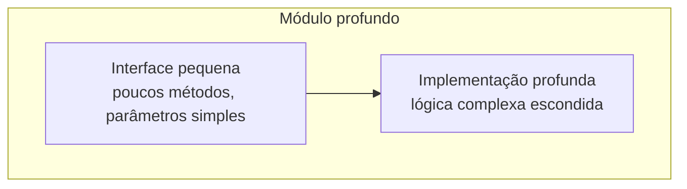
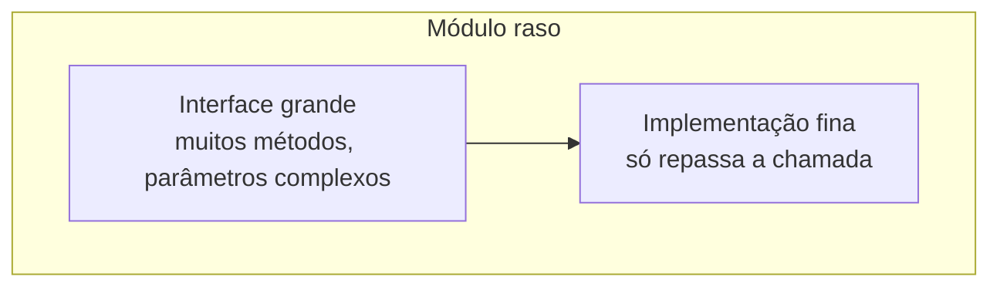

# Design de código-fonte

Desenhe **módulos profundos**: muito comportamento atrás de uma interface pequena,
colocado num seam limpo, testável através dessa interface. Use esta linguagem e estes
princípios sempre que código estiver sendo desenhado ou reestruturado. O objetivo é
alavancagem para quem chama, localidade para quem mantém, e testabilidade para todos.

## Glossário

Use estes termos exatamente — não substitua por "componente", "serviço", "API" ou
"fronteira". Linguagem consistente é o ponto inteiro deste vocabulário.

**Módulo** — qualquer coisa com uma interface e uma implementação. Deliberadamente
agnóstico de escala: uma função, uma classe, um pacote ou uma fatia que atravessa
camadas. _Evite_: unidade, componente, serviço.

**Interface** — tudo que quem chama precisa saber para usar o módulo corretamente: a
assinatura de tipos, mas também invariantes, restrições de ordem, modos de erro,
configuração exigida e características de desempenho. _Evite_: API, assinatura (estreito
demais — os dois se referem só à superfície de tipos).

**Implementação** — o que está dentro de um módulo, o corpo de código dele. Distinta de
**Adaptador**: uma coisa pode ser um adaptador pequeno com implementação grande (um
repositório Postgres) ou um adaptador grande com implementação pequena (um fake em
memória). Use "adaptador" quando o seam for o assunto; "implementação" no resto.

**Profundidade** — alavancagem na interface: a quantidade de comportamento que quem
chama (ou um teste) consegue exercitar por unidade de interface que precisa aprender. Um
módulo é **profundo** quando muito comportamento fica atrás de uma interface pequena, e
**raso** quando a interface é quase tão complexa quanto a implementação.

**Seam** _(Michael Feathers)_ — um lugar onde é possível alterar comportamento sem
editar naquele lugar; o *endereço* onde a interface de um módulo vive. Onde colocar o
seam é uma decisão de design própria, distinta do que fica atrás dele. _Evite_:
fronteira (sobrecarregado pelo bounded context do DDD).

**Adaptador** — algo concreto que satisfaz uma interface num seam. Descreve *papel* (que
encaixe ele preenche), não substância (o que tem por dentro).

**Alavancagem** — o que quem chama ganha com a profundidade: mais capacidade por unidade
de interface aprendida. Uma implementação se paga em N pontos de chamada e M testes.

**Localidade** — o que quem mantém ganha com a profundidade: mudança, bug, conhecimento
e verificação se concentram num lugar só, em vez de se espalhar entre quem chama. Corrija
uma vez, corrigido em todo lugar.

## Profundo contra raso

**Módulo profundo** = interface pequena + muita implementação:



**Módulo raso** = interface grande + pouca implementação (evite):



Ao desenhar uma interface, pergunte:

- Dá para reduzir o número de métodos?
- Dá para simplificar os parâmetros?
- Dá para esconder mais complexidade por dentro?

## Princípios

- **Profundidade é propriedade da interface, não da implementação.** Um módulo profundo
  pode ser composto internamente por partes pequenas, mockáveis e substituíveis — elas
  simplesmente não fazem parte da interface. Um módulo pode ter **seams internos**
  (privados à implementação, usados pelos próprios testes dele) além do **seam externo**
  na interface.
- **O teste da deleção.** Imagine apagar o módulo. Se a complexidade some, ele era só um
  repasse. Se a complexidade reaparece em N pontos de chamada, ele estava ganhando o
  próprio sustento.
- **A interface é a superfície de teste.** Quem chama e os testes atravessam o mesmo
  seam. Se você quer testar *além* da interface, o módulo provavelmente tem o formato
  errado.
- **Um adaptador é um seam hipotético. Dois adaptadores é um seam real.** Não introduza
  um seam a menos que algo realmente varie através dele.

## Desenhando para testabilidade

Boas interfaces tornam o teste natural:

1. **Aceite dependências, não as crie.**

   ```typescript
   // Testável
   function processOrder(order, paymentGateway) {}

   // Difícil de testar
   function processOrder(order) {
     const gateway = new StripeGateway();
   }
   ```

2. **Retorne resultados, não produza efeitos colaterais.**

   ```typescript
   // Testável
   function calculateDiscount(cart): Discount {}

   // Difícil de testar
   function applyDiscount(cart): void {
     cart.total -= discount;
   }
   ```

3. **Superfície pequena.** Menos métodos = menos testes necessários. Menos parâmetros =
   configuração de teste mais simples.

## Relações

- Um **Módulo** tem exatamente uma **Interface** (a superfície apresentada a quem chama
  e aos testes).
- **Profundidade** é propriedade de um **Módulo**, medida contra a **Interface** dele.
- Um **Seam** é onde a **Interface** de um **Módulo** vive.
- Um **Adaptador** ocupa um **Seam** e satisfaz a **Interface**.
- **Profundidade** produz **Alavancagem** para quem chama e **Localidade** para quem
  mantém.

## Enquadramentos rejeitados

- **Profundidade como razão entre linhas de implementação e linhas de interface**
  (Ousterhout): recompensa inflar a implementação. Usamos profundidade como alavancagem,
  em vez disso.
- **"Interface" como a palavra-chave `interface` do TypeScript ou os métodos públicos de
  uma classe**: estreito demais — aqui interface inclui todo fato que quem chama precisa
  saber.
- **"Fronteira"**: sobrecarregado pelo bounded context do DDD. Diga **seam** ou
  **interface**.

## Aprofundando

- **Aprofundar um cluster dado suas dependências** — veja
  [references/deepening.md](references/deepening.md): categorias de dependência,
  disciplina de seam e teste por substituição, não por camada.
- **Explorar interfaces alternativas** — veja
  [references/design-it-twice.md](references/design-it-twice.md): suba sub-agentes em
  paralelo para desenhar a interface de várias formas radicalmente diferentes, depois
  compare por profundidade, localidade e posição do seam.
