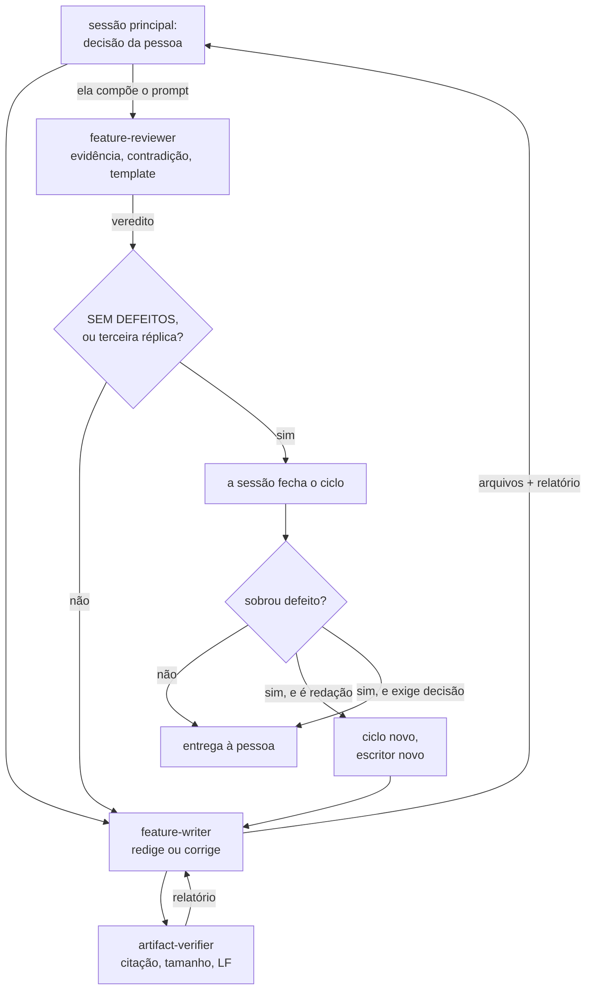

> **AVISO DE PROCESSO REVOGADO.** O modo de trabalho vigente deste repositório é
> **implementação primeiro**, e está em [`AGENTS.md`](../../../AGENTS.md) — ele prevalece
> sobre tudo o que esta página descreve. O ciclo abaixo **NÃO DEVE ser iniciado por
> iniciativa própria**: ele só roda quando a pessoa o pedir pelo nome, nesta sessão, em
> palavras. Pendência de definição vai para o `docs/backlog.md`, em uma linha, e não
> vira documento.

> **`docs/` FOI REFATORADA, e a estrutura agora é fechada.** Cinco pastas —
> `architecture/`, `adr/`, `features/`, `contracts/` e `diagrams/` — mais `README.md`,
> `roadmap.md`, `dicionario-de-dados.md` e `backlog.md`. Nenhum caminho novo é inventado,
> e vários arquivos que esta página cita já não existem: `specification-process.md`,
> `fila-de-decisoes.md`, `plano-do-laboratorio.md`, `CONTEXT.md`, `questions/` e
> `audits/`. O índice da pasta é `docs/README.md`.

# Planeje a funcionalidade

Use este fluxo antes de propor tarefas de implementação. Aplique-o também quando
o pedido atualizar uma capacidade existente.

Não crie arquivos de modelo em docs. Use os modelos versionados em references/.

## Leia antes de escrever

Leia, nesta ordem:

1. AGENTS.md na raiz.
2. docs/specification-process.md.
3. docs/features/README.md.
4. docs/contracts/README.md e docs/architecture/integrations.md.
5. O plano, os cards, os contratos e o código relacionados ao pedido.

Use código, configuração e testes como evidência. Cite cada fato existente por
caminho e âncora GFM — `arquivo.md#slug-do-título`. Cite por número de linha só
quando o alvo não tiver título que a alcance, dentro de um bloco Mermaid por
exemplo. A política é a da raiz, em
[`AGENTS.md`](../../../AGENTS.md#ao-trabalhar-aqui), e o verificador é
`scripts/check_citations.py`. Escreva Pergunta em aberto quando a evidência não
existir. Nunca transforme uma hipótese em fato.

Cite só as três famílias citáveis como fonte: `docs/adr/`, `docs/features/**` e
`docs/architecture/**`. Nenhum documento cita como fonte um documento instável,
aquele que sofre alteração recorrente — a fila de decisões é o exemplo, porque é
podada por processo. Quando a informação não estiver em nenhuma das três
famílias, traga-a inteira para dentro do próprio texto em vez de apontar para
fora. O racional é da raiz, em
[`AGENTS.md`](../../../AGENTS.md#ao-trabalhar-aqui); não o repita aqui.

Registre cada objeção, alternativa descartada ou pendência no Example Mapping no
mesmo turno em que surgir. Quando for ADR, use a skill adr (.claude/skills/adr/).

## Use o template obrigatório

Leia o template antes de criar ou atualizar o artefato. Mantenha todas as seções
obrigatórias. Escreva Não se aplica — <motivo> quando uma seção não se aplicar.
Não remova uma seção para caber no limite; divida a capacidade ou o documento.

| Artefato              | Template                                                    |
|-----------------------|-------------------------------------------------------------|
| Feature Card          | references/feature-card.md                                  |
| Example Mapping       | references/example-mapping.md                               |
| BDD                   | references/behavior.feature                                 |
| Matriz de integrações | references/integrations.md                                  |
| OpenAPI               | references/openapi.yaml                                     |
| AsyncAPI              | references/asyncapi.yaml                                    |
| JSON Schema           | references/json-schema.json                                 |
| Desenho completo      | references/implementation-plan.md                           |
| ADR                   | delegado à skill adr — .claude/skills/adr/references/adr.md |

Todos os templates necessários ficam na pasta desta skill, exceto o ADR, que vive na
skill adr.

## Classifique a mudança

1. Trate comportamento observável como Feature Card.
2. Trate alternativa durável, restrição futura e trade-off como ADR.
3. Trate interface entre processos como contrato.
4. Trate mudança local e reversível como tarefa, sem ADR.

Não escreva um ADR por reflexo. **Não repita aqui a regra de alteração de ADR
aceito, e não a enuncie como proibição absoluta:** seis formas o alteram, e o dono
delas é
[`docs/adr/README.md`](../../../docs/adr/README.md#a-revogação-da-imutabilidade-decidida-em-2026-08-07),
com a sexta em
[A divisão de um ADR aceito](../../../docs/adr/README.md#a-divisão-de-um-adr-aceito-decidida-em-2026-08-11)
e o roteador em [`adr-lifecycle.md`](../adr/references/adr-lifecycle.md). Quando
uma decisão bloquear o escopo, registre a pergunta e use AskUserQuestion antes de
escolher por conta própria.

Quando a mudança exigir ADR, acione a skill adr antes de criar, aceitar, alterar ou
patchar uma decisão.

## A redação roda em sub-agente, e passa por revisão

**Delegue a redação dos artefatos a um sub-agente, e não os escreva na sessão
principal.** A sessão principal conduz a decisão com a pessoa e obtém a escolha
explícita; o par de agentes recebe a escolha já feita. O dono da regra é
[`specification-process.md`](../../../docs/specification-process.md#redação-e-revisão-independente-de-especificação).

- **`feature-writer`** (`.claude/agents/feature-writer.md`) redige e corrige. Ele escreve
  o Feature Card, o Example Mapping e o BDD, e escreve o ADR **só quando o prompt o
  nomear**.
- **`artifact-verifier`** (`.claude/agents/artifact-verifier.md`) roda os verificadores
  mecânicos sobre o que o escritor entregou e devolve a saída literal. Ele não tem Write
  nem Edit, e roda em modelo menor: o trabalho dele é reproduzível e não exige julgamento.
- **`feature-reviewer`** (`.claude/agents/feature-reviewer.md`) revisa e devolve uma lista
  numerada de defeitos. Ele não tem Write nem Edit, de propósito.

**O escritor aciona o verificador; a sessão principal aciona o revisor.** O elo
escritor → verificador é mecânico e automático: terminada a redação, o escritor chama o
verificador, que mede e devolve o relatório **a ele**. Acionar o verificador por fora
duplica uma etapa que já vai acontecer.

**O revisor é acionado pela sessão, e nunca pelo escritor ou pelo verificador.** É a
garantia da independência dele: **o prompt de quem revisa não pode ser composto por quem
está sob revisão.** O bloco que enquadra o que conta como decidido e quais alternativas
foram descartadas viria do escritor — e um revisor que o recebe pela mão da parte revisada
herda os pontos cegos dela. A sessão tem a decisão da pessoa em primeira mão, e é ela que
compõe.

**O verificador entra entre os dois, e não é opcional.** Isso separa o que a máquina
decide — alvo inexistente, âncora sem título, prosa acima do orçamento, CRLF — do que
exige leitura: se a citação sustenta a afirmação. **Nem o escritor nem o revisor rodam
esses scripts**, e o relatório do verificador entra no prompt do revisor como fato já
medido, para que ele não gaste a rodada remedindo.

**A réplica é condicional, e não etapa.** Um `SEM DEFEITOS` encerra o ciclo com zero
réplicas; cada lista de defeitos gera uma réplica, e um ciclo tem no máximo três. Uma
reprovação do verificador conta como defeito e entra na mesma lista. Na terceira sem
convergir, o escritor devolve os pontos em aberto.

**O teto de três encerra o ciclo, e não o trabalho.** Decidido em 2026-08-10. A sessão
principal abre um **ciclo novo**, com escritor novo, sobre o que sobrou — passando o que
já foi tentado, para que o ciclo seguinte não repita o caminho que não convergiu.
**Nenhum defeito é abandonado por esgotamento de réplica.** À pessoa vai só o defeito que
exige uma decisão que ninguém tomou: aí um ciclo novo não resolve nada, porque nenhum
escritor pode decidir.

**A réplica volta ao mesmo escritor**, com o contexto da redação inteiro — um escritor
novo a cada rodada releria tudo e perderia o motivo de cada escolha. Quem conta as
réplicas é a sessão, e ela informa o `N` no prompt de cada agente.

## Os limites não estão nesta skill

**Esta skill não declara limite nenhum, e nenhum número pode voltar para cá** — o
script recusa a skill se um reaparecer. Quem declara é
[`scripts/check_artifact_limits.py`](scripts/check_artifact_limits.py): ele conhece o
limite de cada artefato por nome e por caminho, sabe quais são isentos, e mede prosa
— diagrama, bloco de código e tabela não entram na contagem de nenhum `.md`. Rode-o
em vez de estimar; um número estimado não é evidência de limite.

O racional fica em
[`specification-process.md`](../../../docs/specification-process.md#feature-card--o-padrão);
a decisão que muda um limite entra na
[fila](../../../docs/fila-de-decisoes.md#o-que-esta-fila-enfileira) e depois no
script, nunca aqui.

## Gere os artefatos

### Feature Card

Crie ou atualize docs/features/<slug>/feature-card.md para cada capacidade. Um
card cobre uma capacidade, não uma classe, rota ou tarefa. Divida a capacidade
quando o verificador acusar excesso; o corte sai da prosa, nunca da evidência.

### Example Mapping

Crie ou atualize docs/features/<slug>/example-mapping.md. Inclua casos de fronteira,
falha, repetição, concorrência, idempotência e consistência quando forem relevantes.

Não converta uma regra em debate para Gherkin.

### BDD

Crie ou atualize docs/features/<slug>/behavior.feature depois de estabilizar as
regras. Use Gherkin em português e inclua # language: pt. Descreva somente o
comportamento externo. Um cenário não cita classe, tabela ou coluna.

Para cada regra, escreva no máximo o fluxo principal, uma falha relevante e um
caso de borda que mude o resultado. Marque cenários sem teste como @teste-ausente.

O behavior.feature não recebe o desconto de tabela: em Gherkin a tabela Exemplos: é
o cenário, e não ilustração dele. O verificador já sabe disso.

### APIs, eventos e integrações

Atualize docs/architecture/integrations.md quando a mudança confirmar uma
fronteira. Mantenha a matriz com origem, destino, tipo, operação ou tópico,
finalidade, estado, contrato, autenticação, confiabilidade e evidência.

A matriz é uma só, e o que separa as fronteiras é a coluna Estado:
implementado, decidido/não implementado, hipótese ou bloqueado. Uma divisão
binária entre fato e hipótese faz uma decisão aceita parecer especulação.

Divida a matriz por fronteira antes de o verificador acusar excesso.

Crie ou atualize um contrato somente quando a interface existir no código ou for
entregue na mesma mudança:

- Use OpenAPI para API HTTP.
- Use AsyncAPI para mensageria e eventos.
- Use JSON Schema para payload que atravesse fronteira sem contrato maior.

Para eventos, declare tipo, produtor, consumidores conhecidos, canal, esquema,
versão, correlação, idempotência, ordenação, retry, DLQ e entrega somente quando
houver evidência ou decisão. Diferencie comando de evento de domínio.

Não crie diretório vazio, contrato de intenção ou campo preenchido por analogia.
Não repita em Markdown o que o contrato formal já define.

### Esquema de banco

Documente a forma das tabelas em docs/architecture/schemas/. Não a documente
no feature card, que descreve comportamento externo, nem no ADR, cujo corpo só
muda por emenda, adendo ou patch — o esquema muda antes disso.

Use erDiagram do Mermaid. Não escreva DDL, nem executável nem ilustrativo. Um
bloco SQL ao lado do diagrama cria um segundo lugar onde a forma da tabela vive,
e os dois divergem.

Desenhe um erDiagram por schema. Não desenhe dois schemas no mesmo canvas: a
linha de relacionamento entre eles renderiza a chave estrangeira que a fronteira
de schema proíbe. A ausência de linha é a decisão.

Escreva abaixo de cada diagrama a prosa das ausências. O erDiagram não expressa
ordem de coluna na chave composta, índice, ausência de DEFAULT, ausência de
trigger nem ausência de chave estrangeira. Cada uma é decisão, e some se ficar
só no desenho.

Equalize o diagrama com as migrações Flyway no mesmo commit. O verificador é
scripts/check_schema_sync.py, e ele compara nome de tabela. Uma divergência
deliberada entra na baseline dele, declarada.

### Artefatos excepcionais

Crie um documento de desenho completo somente para alto risco, vários processos ou
mudança de contrato com consumidor conhecido. Use
docs/features/<slug>/implementation-plan.md.

Crie ADR somente quando os critérios do repositório forem atendidos. Use a skill adr,
que contém references/adr.md e references/adr-lifecycle.md.

Qualquer outro Markdown persistente criado por este fluxo cai no limite genérico do
verificador. Um índice atualizado não é um artefato novo; acrescente apenas o link e
uma frase de contexto.

## Escreva com os princípios de ASD-STE100

Escreva em português do Brasil. Aplique os princípios de linguagem controlada do
ASD-STE100; não alegue conformidade literal, pois a especificação controla inglês.

- Use uma frase para uma ideia e voz ativa.
- Use verbo preciso. Diga quem faz a ação e qual resultado ocorre.
- Coloque a condição antes da ação que ela controla.
- Use no máximo 20 palavras por frase e três frases por parágrafo.
- Use um termo técnico por conceito. Defina sigla na primeira ocorrência.
- Evite sinônimos para o mesmo conceito, abreviação sem definição, jargão, metáfora,
  advérbio vago e qualificadores sem medida.
- Prefira listas para sequências e tabelas para regras combinatórias.
- Use DEVE, NÃO DEVE, DEVERIA e PODE apenas para requisito normativo.
- Declare número, limite, unidade, ator e condição quando eles mudarem o resultado.

## Valide antes de encerrar

1. Confirme que o card não duplica o contrato ou o ADR.
2. Confirme que toda pergunta em aberto aparece no Example Mapping.
3. Confirme que cada cenário BDD vem de exemplo estabilizado.
4. Confirme links relativos, evidências e atualização dos índices necessários.
5. Execute o verificador para todo artefato criado ou editado:

~~~powershell
python "${CLAUDE_SKILL_DIR}/scripts/check_artifact_limits.py" --root . --file <arquivo> [--file <arquivo> ...]
~~~

Resolva toda violação antes de apresentar o plano. Se um limite impedir clareza,
divida o artefato. NÃO DEVE aumentar um limite por conta própria: mudá-lo é decisão,
e ela entra na
[fila](../../../docs/fila-de-decisoes.md#o-que-esta-fila-enfileira) antes de o
script mudar.

## Entregue o planejamento

Apresente, nesta ordem:

1. Capacidade e resultado esperado.
2. Evidências encontradas e perguntas em aberto.
3. Artefatos criados ou atualizados.
4. Contratos e fronteiras afetados.
5. Tarefas de implementação em ordem de dependência.
6. Riscos, testes e validações.

Não inicie a implementação sem aprovação explícita, salvo se o usuário pedir
planejamento e implementação no mesmo pedido.
