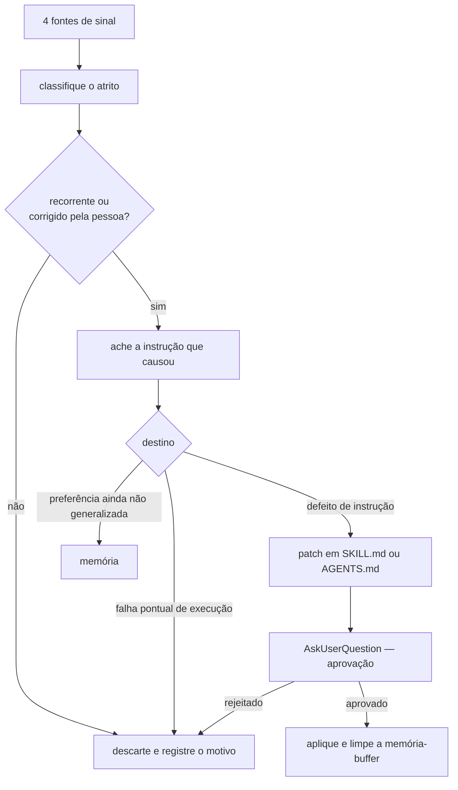

# Retroalimente o workflow

Esta skill fecha um ciclo. As outras skills produzem artefatos; esta observa como elas
falharam e corrige a instrução que causou a falha. Ela NÃO DEVE editar skill sem
aprovação explícita da pessoa.

O alvo é a causa raiz. Uma correção que vive só na memória é paliativo: a instrução
errada permanece na fonte e volta a agir na sessão seguinte.

## Colete o sinal nas quatro fontes

Colete antes de interpretar. Cada achado leva evidência com caminho e linha, ou com
identificador de sessão e trecho citado. Um achado sem evidência é descartado.

1. **Sessão atual.** Retrabalho, ferramenta que falhou, ordem que você inverteu e
   correção explícita do usuário.
2. **Transcritos históricos.** Rode o varredor da seção "Execute o varredor". Ele mede
   recorrência entre sessões, que a sessão atual não enxerga.
3. **Memórias.** Leia `MEMORY.md` e cada arquivo de `memory/`. Pergunte de cada uma:
   esta memória ainda precisa existir, ou já virou regra dentro de uma skill?
4. **Diff dos artefatos.** Compare o que a skill mandou produzir com o que foi
   commitado em `docs/`. Onde o artefato final divergiu do template, o template errou.

Leia `references/taxonomia-de-atrito.md` antes de classificar. Ele define os seis tipos
de atrito e o que conta como evidência de cada um.

## Aplique o limiar de recorrência

Um atrito só vira proposta de mudança quando atender a uma destas condições:

- ocorreu em duas sessões independentes, ou duas vezes na mesma sessão por causas
  distintas; ou
- o usuário o corrigiu de forma explícita, mesmo uma única vez.

Um erro isolado, sem correção da pessoa, é ruído. NÃO DEVE virar regra. Registre-o na
entrega como descartado, com o motivo — um segundo caso no futuro o promove.

## Escolha o destino

Nem todo atrito é defeito de skill. Três destinos, e um deles é não fazer nada.

| Tipo de atrito                                   | Destino                          |
|--------------------------------------------------|----------------------------------|
| A instrução mandou fazer errado                  | patch na skill que instruiu      |
| A instrução era omissa e a lacuna teve custo     | patch na skill que deveria cobrir|
| A regra atravessa skills                         | patch no `AGENTS.md`             |
| Preferência da pessoa ainda não generalizada     | memória em `memory/`             |
| Falha de execução sem padrão                     | nenhum — descarte com motivo     |
| Decisão arquitetural do laboratório              | fila de `docs/adr/README.md`     |

Uma dúvida entre dois destinos vira pergunta ao usuário, nunca escolha silenciosa.

## Respeite o orçamento de cada skill

Uma skill que só cresce perde utilidade: cada regra nova dilui as anteriores no
contexto. Os tetos, medidos em caracteres e sem contar a quebra final:

| Arquivo                       | Limite |
|-------------------------------|--------|
| `SKILL.md`                    | 7.000  |
| cada `references/*.md`        | 5.000  |
| `AGENTS.md`                   | 14.000 |

Quando um patch ultrapassar o teto, NÃO DEVE aumentar o limite. Funda duas regras,
mova o detalhe para `references/`, ou apague a regra que a nova torna obsoleta. Cada
patch que adiciona texto DEVE nomear o que sai, ou justificar por que nada sai.

## Redija o patch

Use `references/patch-de-skill.md`. Cada patch traz o arquivo alvo, o trecho antes, o
trecho depois, a evidência que o motivou e o efeito no orçamento. Um patch cobre uma
regra. NÃO DEVE agrupar mudanças independentes em um patch só.

Escreva a regra como instrução acionável, e não como conselho. "Leia o arquivo antes
de editar" é acionável. "Tenha cuidado ao editar" não é.

Siga as convenções de escrita do `AGENTS.md`: português, 88 colunas, RFC 2119 em caixa
alta e um conceito com um nome só.

## Peça aprovação

Apresente os patches com `AskUserQuestion`, um grupo por skill alvo. Enuncie o que o
texto passa a exigir, em afirmação; não pergunte "aprovar ou rejeitar" sem dizer o que
muda na prática. NÃO DEVE aplicar patch sem resposta explícita.

## Feche o ciclo na memória

Este passo é obrigatório e costuma ser esquecido. A memória é buffer, não arquivo
permanente: quando uma lição vira regra dentro de uma skill, a memória que a guardava
DEVE ser apagada ou reescrita para apontar a skill. Sem isso, a mesma lição existe em
dois lugares e as duas divergem.

Ao apagar uma memória, remova também a linha correspondente em `MEMORY.md`.

Uma preferência que ainda não virou regra permanece na memória, sem duplicata.

## Execute o varredor

O varredor lê os transcritos da sessão em `~/.claude/projects/<slug>/*.jsonl` e conta
sinais mecânicos: erro de ferramenta, edição repetida do mesmo arquivo, prompt curto do
usuário logo após resposta longa, e compactação de contexto.

~~~powershell
python "${CLAUDE_SKILL_DIR}/scripts/scan_transcripts.py" --root . --days 30
~~~

A saída é indício, e não conclusão. Um erro de ferramenta pode ser acidente; dois no
mesmo ponto do fluxo apontam a instrução. Leia o trecho citado antes de propor o patch.

## Entregue a retrospectiva

Apresente, nesta ordem:

1. Sinais coletados por fonte, com evidência.
2. Atritos que passaram no limiar, e os descartados com o motivo.
3. Patches propostos, por skill alvo, com efeito no orçamento.
4. Memórias a apagar, a reescrever e a manter.
5. O que ficou como pergunta em aberto.

Prefira registrar uma questão em aberto a inventar uma regra para fechar uma lacuna.

## O que é local e o que é genérico

O específico deste laboratório está isolado em três pontos: a tabela de destinos, que
cita `docs/adr/README.md`; a tabela de orçamento; e as convenções de escrita. O restante
do fluxo não depende deste repositório, e sobrevive à promoção para
`~/.claude/skills/`.
