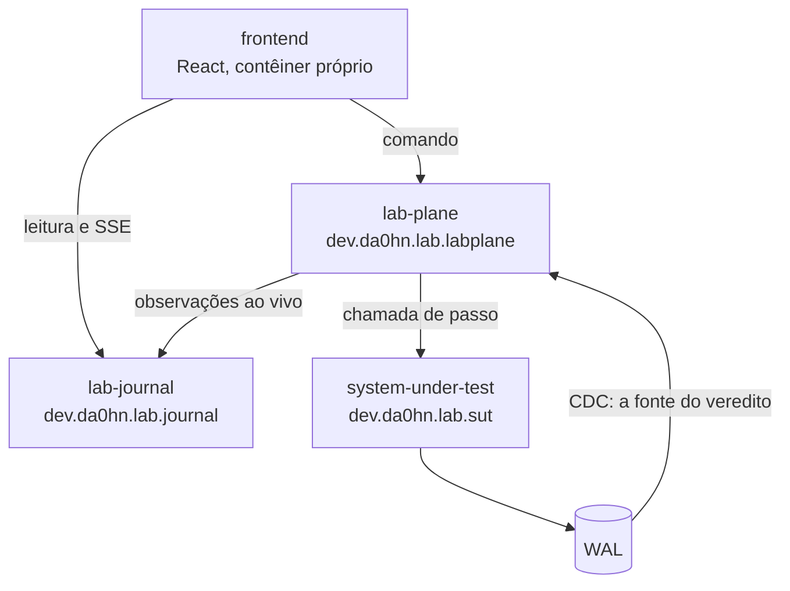

# AGENTS.md

Guia para agentes de código ao trabalhar neste repositório.

## O esqueleto existe desde 2026-08-06, e ele não implementa nada

O grupo I do Lote E fechou, e o primeiro código do repositório entrou. **Ele compila,
empacota e sobe — e não tem uma única regra de negócio dentro.** Nenhum dos 42 fenômenos
é reproduzível hoje.

| Comando                           | O que ele faz                                    |
|-----------------------------------|--------------------------------------------------|
| `mvn verify`                      | compila e sobe cada serviço contra PostgreSQL 18 |
| `docker compose up --build`       | os quatro serviços e o banco, localmente         |
| `npm --prefix frontend run build` | constrói a interface                             |

A stack é Java 25, Spring Boot 4.1, PostgreSQL 18, Maven e Docker. **O broker foi
antecipado em 2026-08-06, e ainda não existe na árvore.** Ele deixou de esperar a etapa 5
e passou a ser o transporte entre o conector de CDC e o Lab Plane, por decisão explícita
de estudo — a regra de que uma tecnologia só entra quando um experimento não puder ser
executado sem ela **não foi satisfeita nesse caso, e sim dispensada**. O registro está na
linha `E-12` de [`docs/adr/fila-de-decisoes.md`](docs/adr/fila-de-decisoes.md).

### Os quatro serviços, e a regra que os separa



**Um serviço jamais acessa o schema de outro.** É a decisão `E-18`, e ela é a razão de o
oráculo ler o WAL por replicação lógica em vez de fazer `SELECT` nas tabelas do sistema
medido. O `shared` é biblioteca e não vira imagem; a direção proibida do ADR-0008 é erro
de compilação, porque o `system-under-test` não declara dependência do `lab-plane`.

**A região `dev.da0hn.lab.application` tem uma folha por executável.** Um pacote único
ali seria dividido entre três artefatos, então cada bootstrap vive em
`application.labplane`, `application.journal` e `application.sut`, com
`scanBasePackages` declarado.

### O que ainda não existe, e por quê

- **Nenhuma tabela.** As três migrações `V1` criam apenas o schema de cada serviço, e
  existem porque sem nenhuma migração o Flyway não roda — e sem ele rodar, a fronteira
  de `E-18` fica declarada em configuração e ausente do banco, com o health check verde.
  As tabelas dependem do grupo II do Lote E (`E-8` a `E-13`).
- **Nenhum consumidor de CDC.** O `compose.yaml` já sobe o PostgreSQL com
  `wal_level=logical` e o papel do `lab-plane` já tem `REPLICATION`; o consumo entra com
  o oráculo.
- **Nenhum `deploy/`.** A linha `E-3` foi adiada por escolha explícita, e o
  `ComparisonError` que o ArgoCD reporta continua. O workflow publica imagem no GHCR com
  tag igual ao SHA, e nada a consome ainda.
- **Nenhuma guarda executável.** As três regras estruturais abaixo continuam texto —
  [`Q-0002-1`](docs/questions/Q-0002-1.md), e as decisões `D-ARQ-07` a `D-ARQ-09`.

## O que este projeto é

Uma plataforma experimental para reproduzir, observar e comparar problemas conhecidos de
sistemas distribuídos. Não é uma aplicação de negócio: não existe pedido, pagamento,
cliente ou estoque. O escopo cobre 42 fenômenos, de lost update a cascading failure.

O documento que define tudo é
[`docs/plano-do-laboratorio.md`](docs/plano-do-laboratorio.md). Leia-o antes de propor
qualquer coisa.

## Como o planejamento funciona aqui

**Use automaticamente a skill `/feature-planning` antes de planejar, refinar, estimar
ou propor a implementação de uma funcionalidade ou atualização.** A skill cria e valida
os artefatos de especificação deste repositório.

**Desde 2026-08-01 o ADR deixou de ser a forma principal de documentação.** Use Feature
Card e Example Mapping para comportamento. Use ADR para decisão arquitetural durável.

**Desde 2026-08-04 o ADR deixou de ser obrigatório, e
nasce `Aceito`.** O que se enfileira
é decisão, e não ADR. Uma decisão entra na fila com o problema, as alternativas e as
objeções; sai quando a pessoa escolhe; e só então o artefato é escolhido — ADR quando a
escolha atender aos quatro critérios de `docs/adr/README.md`, artefato de
`docs/features/` quando não atender. O debate acontece na linha da fila, antes de
existir documento, porque um ADR que nasce `Aceito` não pode mais ser editado.

A skill é a fonte operacional para classificação, templates, limites, contratos,
validações e ciclo de vida dos ADRs. O processo e a justificativa da mudança ficam em
[`docs/specification-process.md`](docs/specification-process.md).

O índice das capacidades está em [`docs/features/README.md`](docs/features/README.md).
O registro histórico dos ADRs fica em [`docs/adr/README.md`](docs/adr/README.md).

## Convenções gerais de escrita

- Linhas são quebradas em aproximadamente 88 colunas.
- Todo fluxo apresentado vai **também** como diagrama Mermaid, junto do parágrafo que o
  descreve. `sequenceDiagram` para ordem no tempo, `flowchart` para topologia e hierarquia.
  Excalidraw só para o que o Mermaid não expressa, exportado como `.excalidraw.svg`.
- Sem emojis. Sem linguagem de marketing.
- Um link Markdown longo PODE ultrapassar 88 colunas — quebrá-lo no meio o inutiliza.

## Arquitetura conceitual

Ler só um documento não basta; estas cinco ideias atravessam todo o projeto.

**Uma operação é uma sequência de
passos.** Barreiras determinísticas, fault injection em
pontos nomeados e a timeline são a mesma exigência: existe uma fronteira observável e
controlável entre passos consecutivos. O runtime executa os passos e, em cada fronteira,
consulta o escalonador, consulta o injetor de falha e emite uma observação. O que é
sintético é apenas o agendamento — o SQL, a transação e o isolamento são reais. É a decisão
do **ADR-0001**, `Aceito`, especificada em
[`docs/features/observacao-passo-a-passo/`](docs/features/observacao-passo-a-passo/feature-card.md).

**Dois
planos.** O system under test é o sistema medido; o Lab Plane é o instrumento que o
mede. Confundir os dois invalida qualquer conclusão — um bug no instrumento vira um
falso resultado de consistência. **Desde
o [ADR-0008](docs/adr/0008-os-dois-planos-em-processos-separados.md),
os dois rodam em processos separados a partir do dia
zero**, e a fronteira entre eles é a
rede. Isso não dispensa a separação por teste executável: a fronteira de processo impede
a chamada, e não o acoplamento de desenho. O runtime chama a operação; a operação nunca
chama o runtime.

**Cinco grupos, classificados pela causa.** Intercalação, Entrega, Escrita parcial,
Saturação, Posse no tempo. A classificação é pela fonte de não determinismo, não pela
tecnologia, porque é a causa que determina o que a plataforma precisa saber controlar.

**O veredito tem três
formatos.** Booleano (a invariante foi violada?) para os grupos A, B,
C e E.
**Curva** para o grupo D — backpressure não tem estado errado, tem uma fila crescendo
e um limiar que alguém precisa declarar. E **taxa com limite de
confiança**, acrescentada
pelo ADR-0004: um número mais uma incerteza, que não é caso particular de nenhum dos
outros dois. Como os três convivem é decisão em aberto na fila.

**O grupo de controle é
obrigatório.** A estratégia `NONE` não é um estado provisório: se
`NONE` não violar a invariante, o experimento não tem carga suficiente e o resultado das
outras estratégias não significa nada. O ADR-0004 tornou isso a primeira linha da
classificação do veredito zero.

## Regra pedagógica

> Nunca introduza primeiro a solução. Introduza primeiro o problema.

Para estudar Outbox, não comece implementando Outbox. Construa o experimento em que o
commit e a publicação são operações independentes, provoque a falha entre elas, observe
a inconsistência — e só então introduza o Outbox e rode o mesmo experimento.

```
PROBLEMA → CAUSA → SOLUÇÃO → TRADE-OFF
```

Vale para os 42 fenômenos, sem exceção. É por isso que `version` não está no esquema.

## Regras estruturais que valem sempre

- **Nenhuma tecnologia entra por estar
  disponível.** Cada uma entra quando um experimento
  não puder ser executado sem ela. Antes de propor Valkey ou OpenTelemetry, diga qual
  limitação concreta da stack atual ela resolve. **A regra foi dispensada uma vez**, para
  o broker, em 2026-08-06 — uma dispensa registrada não é precedente: a próxima também
  precisa ser explícita.
- **Nenhuma aleatoriedade não semeada.** `Math.random()`, `java.util.Random` e
  `ThreadLocalRandom` são proibidos fora do componente de aleatoriedade semeada. Uma
  chamada esquecida quebra a reprodutibilidade em silêncio, meses depois.
- **O tempo é injetável.** `Instant.now()`, `LocalDateTime.now()` e
  `System.currentTimeMillis()` só em adaptador de relógio. Sem isso, expiração de lease
  e clock skew ficam impossíveis de testar.
- **Nenhuma sincronização de JVM no sistema sob
  teste.** `synchronized`, `ReentrantLock` e
  `AtomicInteger` mascaram exatamente os fenômenos do grupo A. A exceção é a estratégia
  `JVM_LOCK`, que existe **como
  experimento** para provar que ela falha com duas instâncias.
- **Cada worker tem sua própria
  conexão.** Se o pool serializar dois workers, o experimento
  produz um falso negativo silencioso.
- **O caderno de laboratório não vive no
  Git.** Desde as decisões `E-14` e `E-17`, de
  2026-08-06, a definição de experimento e o resultado vivem no banco do `lab-journal`,
  e a pessoa os declara pelo frontend. Nem `experiments/` nem `docs/experiments/` são
  criados. A tensão entre arquivo versionado e Experiment Designer fechou pelo segundo,
  e o custo está nomeado na fila: um resultado deixa de aparecer em diff, de ser revisado
  em PR e de sobreviver a um banco recriado.

**As regras de aleatoriedade e de relógio alcançam pelo papel do valor, e não pelo plano
que o produz.** Decidido em 2026-08-06. Elas valem sobre todo valor que entra em veredito,
em escalonamento ou em identidade derivada da semente — no sistema medido ou no Lab Plane,
indiferentemente. Um `Math.random()` no escalonador quebra a reprodutibilidade tão
completamente quanto um no domínio, e uma regra qualificada por plano deixaria de alcançá-lo.
O discriminador de execução não entra em nenhum dos três papéis: ele é rótulo de partição,
e duas execuções idênticas com discriminadores diferentes produzem o mesmo veredito e a
mesma intercalação.

As três primeiras são hoje **texto, não regra executável**.
[`Q-0002-1`](docs/questions/Q-0002-1.md) registra isso, e a guarda pertence à decisão de
arquitetura mínima.

## Estado atual

### Especificação

Quatro capacidades estão especificadas e **nenhuma implementada**. O índice completo,
com o que cada uma cobre, está em [`docs/features/README.md`](docs/features/README.md).

**O E4 não tem card, de
propósito.** O veredito em formato curva não tem forma decidida, e
um card agora seria majoritariamente pergunta em aberto. O motivo está registrado no índice.

**Nenhum contrato
existe.** Nenhuma interface existe para contratar — `docs/contracts/README.md`
lista os quatro gatilhos que criam cada um.

### Decisões

**Os ADRs da série corrente aceitos até agora, e o que cada um fixou, estão no índice
de**
[`docs/adr/README.md`](docs/adr/README.md). Nenhum ADR aceito pode ser editado; para
mudar uma decisão, um ADR novo o substitui. Nenhum ADR está `Proposto` hoje.

Três consequências, fixadas pelos ADRs 0001 e 0002, mudam o que se pode propor daqui em
diante:

- **O oráculo exato
  é `perdidas = commits − (value_final − value_inicial)`**, onde `commits`
  conta passagens pela fronteira `AFTER_COMMIT`, por tentativa. Não é `sucessos` —
  contar retornos de operação cancela perda real contra falha injetada depois do commit.
- **Toda execução medida exige calibração antes**, com uma estratégia sem perda, em que
  `commits` DEVE igualar `value_final − value_inicial`. Qual é essa estratégia ainda não
  foi decidido.
- **`version` não existe no esquema.** Quem a acrescenta é o ADR de estratégias de
  concorrência, junto da política que a lê. O esboço ilustrativo do ADR-0001 lê uma
  coluna que o esquema não tem — o esboço não é normativo.

As questões encaminhadas vivem em [`docs/questions/`](docs/questions/README.md), um
arquivo por questão, com identificador `Q-NNNN-K`. **Cite-as por esse identificador**,
nunca por "a questão K do ADR-NNNN". Cada uma tem destino nomeado na fila; uma resolvida
mantém o enunciado e ganha `resolvida por ADR-NNNN`, de propósito.

As perguntas levantadas durante o Example Mapping vivem nos próprios `example-mapping.md`, e
**não** foram transportadas para a fila de ADRs.

### Pendências de processo

**As cinco pendências de processo fecharam em 2026-08-05, no Lote B.**

- **A fila é uma só, e vive em
  [`docs/adr/fila-de-decisoes.md`](docs/adr/fila-de-decisoes.md).** As duas origens
  viraram lápide. A de `docs/adr/arquivo/proposta-2026-08-03/decisoes-pendentes.md` guarda o texto
  congelado, porque aquele arquivo é append-only: nove citações por número de linha,
  vindas dos ADRs 0008 e 0009, apontam para ele.
- **A poda não acontece antes da decisão.** Podar hoje as linhas que são comportamento
  disfarçado de arquitetura seria escolher o artefato antes da decisão, que é o oposto
  da regra de 2026-08-04. A poda acontece uma linha por vez, quando a pessoa escolhe.
- **Aprova-se a regra, e não o card.** A tabela de regras de um Feature Card carrega a
  coluna `Aprovada por`, e uma regra `pendente` NÃO DEVE virar cenário Gherkin. As 48
  regras das quatro capacidades estão `pendente` hoje.
- **Um card NÃO PODE contradizer um ADR aceito.** A contradição é decisão arquitetural
  nova: ela entra na fila no mesmo turno em que é vista, e gera ADR.
- **`D-ARQ-02` e `D-DOM-11` foram classificadas**, e continuam abertas.

O processo está em
[`docs/specification-process.md`](docs/specification-process.md#quem-aprova-o-que-decidido-em-2026-08-05).

**Pendência nova, aberta ao aplicar a coluna de aprovação:** o card de detecção de
atualização perdida tem 761 palavras contra o limite de 700, e já o violava antes.
Dividir, subir o limite ou cortar prosa é decisão, e ela não foi tomada.

### Árvore

A árvore tem `docs/`, os quatro módulos do reactor, `frontend/`, `local/` e os dois
workflows. O esqueleto herdado das decisões arquivadas foi apagado nos commits `83fcfc9`
e `e1c88ae`, e o que existe hoje **não** é aquele — ele nasceu do grupo I do Lote E, em
2026-08-06.

**O `deploy/` continua sem existir, e o `Application` do homelab continua em
`ComparisonError`.** A linha `E-3`, que decide a forma dele, foi adiada por escolha
explícita na mesma data. Enquanto ela não fechar, o workflow publica imagens que nada
consome.

## Este repositório é entregue no homelab

O laboratório é a primeira carga de trabalho da Camada 8 do repositório
[`homelab-infrastructure`](https://github.com/da0hn/homelab-infrastructure), e a
exigência é que um serviço **nasça já
entregando**: pipeline e CI/CD no mesmo commit que cria o módulo,
nunca retrofitados. O contrato está na **ADR 0017 daquele repositório**, que está
**Aceita** — leia-a antes de propor qualquer coisa sobre build, empacotamento ou deploy.

O essencial dela: GitHub Actions exclusivamente, em runner hospedado; imagem no GHCR com
`GITHUB_TOKEN` efêmero e tag = SHA do commit, nunca `latest`; manifests Kustomize em
`deploy/`
**deste** repositório, bumpados pelo workflow da `master`; ArgoCD por polling (~3 min); nenhum Secret aqui — eles ficam cifrados com SOPS/KSOPS no homelab e são
referenciados por nome.

A matriz completa de integrações, separando fato de hipótese, está em
[`docs/architecture/integrations.md`](docs/architecture/integrations.md). Três cuidados
que valem sempre:

- **A ADR 0017 é de 2026-07-26 e o replanejamento daqui é de
  2026-07-28.** Ela descreve o
  laboratório como "monorepo de microsserviços JVM" — a arquitetura
  **arquivada**. Ela também
  escolhe **Gradle** e
  **Toxiproxy**, que nunca foram debatidos aqui. Não absorva nada disso
  em silêncio: o inventário está em `docs/plano-do-laboratorio.md`, seção 12.
- **Kubernetes é destino de entrega, não objeto de estudo.** Nenhum dos 42 fenômenos é
  reproduzido por um recurso do cluster.
- **O orquestrador reage ao que o experimento
  faz.** Um experimento que mata o processo de
  propósito (etapa 6) roda sob um `Deployment` que o reinicia, com `selfHeal: true`. Isso é
  a confusão system under test / Lab Plane um nível abaixo, e não tem solução decidida.

## Ao trabalhar aqui

- Questione decisões quando fizer sentido, e explique trade-offs. O usuário pediu
  explicitamente mentoria arquitetural, não geração de código.
- Ao surgir uma decisão relevante: apresente o problema, apresente as alternativas, explique
  os trade-offs, recomende uma — e espere que a decisão seja consciente. Não decida em
  silêncio, e não projete a solução final antecipadamente.
- **Prefira registrar uma questão em aberto a inventar uma decisão para fechar uma
  lacuna.**
  No processo deste repositório, a primeira vale mais que a segunda.
- **Não invente integração, contrato ou
  regra.** Toda afirmação relevante leva evidência com
  caminho de arquivo e **âncora nomeada** — `<arquivo>.md#<slug-do-título>`, no slug do
  GitHub Flavored Markdown. É a decisão `C-1`, de 2026-08-05: número de linha envelhece
  em silêncio na primeira edição do alvo, e uma citação envelhecida aponta para outro
  texto sem avisar ninguém. Cite por linha só quando o alvo não tiver título que a
  alcance — dentro de um bloco Mermaid, por exemplo. O que não puder ser confirmado é
  `Pergunta em aberto`, nunca fato. O verificador é `scripts/check_citations.py`, e ele
  roda no workflow `docs`.
- A LLM gera perguntas, contraexemplos e lacunas. **Regra de negócio e decisão são
  aprovadas
  por pessoa, explicitamente.**
- Ao mexer em arquivos, faça `git add` apenas dos arquivos relacionados e gere um único
  commit em Conventional Commits (skill `commit`).
