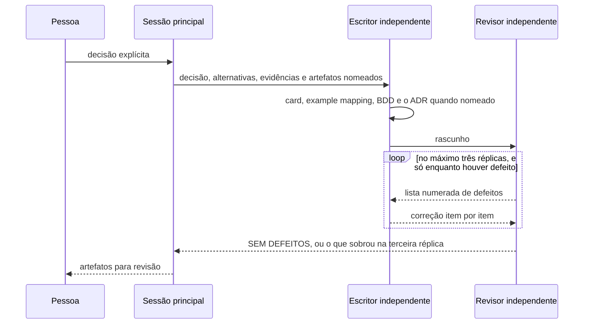

# AGENTS.md

Guia para agentes de código ao trabalhar neste repositório.

## O esqueleto existe desde 2026-08-06, e ele não implementa nada

**Há um esqueleto executável, e nenhum fenômeno ou capacidade está implementado.** Essa
frase é o estado, e ela não é atualizada por commit: a árvore prova o que existe, e os
índices são donos das quantidades. Não escreva aqui inventário de módulo, contagem de
ADR, de questão ou de regra, nem lista do que falta.

| Comando                           | O que ele faz                                          |
|-----------------------------------|--------------------------------------------------------|
| `mvn verify`                      | compila e sobe cada serviço contra PostgreSQL efêmero  |
| `docker compose up --build`       | sobe o banco e os serviços do `compose.yaml`           |
| `npm --prefix frontend run build` | constrói a interface                                   |

A stack, as versões e os serviços que sobem estão declarados em `pom.xml`,
`compose.yaml` e `frontend/package.json`. Leia-os de lá — um número copiado para cá
envelhece sem avisar ninguém.

O que existe, o que foi decidido e ainda não foi construído, e o que continua aberto
vive na [matriz de integrações](docs/architecture/integrations.md#matriz) e na
[fila de decisões](docs/adr/fila-de-decisoes.md#o-que-esta-fila-enfileira).

### Os quatro serviços, e a regra que os separa

**A contagem no título deste heading não vale mais**, e o próprio ADR que a revogou está
em
[ADR-0011](docs/adr/0011-a-topologia-de-servicos-e-o-caderno-de-laboratorio-fora-do-git.md#cinco-serviços-e-o-quatro-do-agentsmd-deixa-de-valer).
O título permanece porque aquele ADR é aceito e cita esta âncora.
A topologia vigente é da [matriz](docs/architecture/integrations.md#matriz), que separa
o implementado do decidido e ainda ausente.

O que fica aqui é a regra, e não o desenho.

**Um serviço jamais acessa o schema de outro, sem exceção.** É o
[ADR-0010](docs/adr/0010-a-fronteira-de-schema-e-o-cdc-como-fonte-do-veredito.md#decisão).
Dele decorre que o oráculo NÃO DEVE fazer `SELECT` no schema do sistema medido: ele lê o
WAL por replicação lógica, e o transporte entre o WAL e o oráculo é o do
[ADR-0012](docs/adr/0012-o-broker-no-caminho-do-veredito-e-a-dispensa-que-ele-exigiu.md#decisão).
Nenhum `SELECT` cruzado é solução atual, em documento nenhum deste repositório.

**O WAL alcança os dois oráculos, e o critério que o permite é a proveniência.** Este
parágrafo dizia que a decisão de CDC alcançava o contador e não todo oráculo; a decisão do
[ADR-0013](docs/adr/0013-a-proveniencia-da-fonte-como-criterio-da-proibicao-do-oraculo.md#decisão),
de 2026-08-09, tirou essa frase de efeito. A proibição do ADR-0002 alcança fonte
**produzida pelo instrumento**, e o WAL não é uma delas: o oráculo do predicado obtém
`Σ amount` somando os eventos de `INSERT` de lá. O que a mesma decisão **não** dispensa é a
guarda — somar exige completude do stream, e o oráculo **DEVE** conferir a contiguidade de
LSN antes da soma, sob pena de falso negativo silencioso, em [feature card de proteção
inerte](docs/features/deteccao-de-protecao-inerte/feature-card.md#atores-e-gatilho).

**Cada executável tem a sua própria folha de bootstrap em `dev.da0hn.lab.application`.**
Um pacote único ali seria dividido entre artefatos distintos. A região de pacote do
sistema medido é decisão do
[ADR-0009](docs/adr/0009-a-classificacao-do-dual-write-e-a-regiao-de-pacote.md#decisão).

### O que ainda não existe, e por quê

O inventário do que falta não vive aqui; ele é da
[matriz](docs/architecture/integrations.md#matriz) e da
[fila](docs/adr/fila-de-decisoes.md#o-que-esta-fila-enfileira). Duas ausências, porém,
são guardrail e não snapshot:

- **O `REPLICATION` pertence ao papel do conector de CDC, nunca ao `lab-plane`.** Pôr a
  credencial de WAL no processo que produz o veredito quebra a fronteira do ADR-0010 um
  nível abaixo, e é exatamente por isso que o conector roda em processo próprio, pelo
  [ADR-0012](docs/adr/0012-o-broker-no-caminho-do-veredito-e-a-dispensa-que-ele-exigiu.md#decisão).
- **As regras estruturais de aleatoriedade, de relógio e de sincronização são texto, e
  não guarda executável.** [`Q-0002-1`](docs/questions/Q-0002-1.md) registra a lacuna, e
  a guarda pertence à decisão de arquitetura mínima.

## O que este projeto é

Uma plataforma experimental para reproduzir, observar e comparar problemas conhecidos de
sistemas distribuídos. Não é uma aplicação de negócio: não existe pedido, pagamento,
cliente ou estoque. O escopo cobre os **itens do briefing** — chame-os assim, e não
"fenômenos", porque o próprio plano reconhece duplicata e capacidade do instrumento
entre eles, em
[taxonomia refinada](docs/plano-do-laboratorio.md#3-taxonomia-refinada).

**O plano não decide nada.** Ele é a análise que define quais decisões precisam ser
tomadas e em que ordem, como diz o
[índice de ADRs](docs/adr/README.md#índice). Tratá-lo como arquitetura vigente faz
hipótese antiga prevalecer sobre ADR aceito.

**Este arquivo não roteia consulta documental.** O roteador é um só, e é
[`docs/README.md`](docs/README.md#precedência-de-consulta). **Não reponha aqui uma segunda
tabela de navegação** — três mapas concorrentes já viraram um. O que fica neste arquivo é
guardrail: a regra que o agente precisa antes de saber o que procurar, e que nenhum índice
carrega.

## Como o planejamento funciona aqui

**Use automaticamente a skill `/feature-planning` antes de planejar, refinar, estimar
ou propor a implementação de uma funcionalidade ou atualização.** A skill cria e valida
os artefatos de especificação deste repositório.

**Desde 2026-08-01 o ADR deixou de ser a forma principal de documentação.** Use Feature
Card e Example Mapping para comportamento. Use ADR para decisão arquitetural durável.

**Desde 2026-08-04 o ADR deixou de ser obrigatório, e
nasce `Aceito`.** O que se enfileira
é decisão, e não ADR. Uma decisão entra na fila com o problema, as alternativas e as
objeções; sai quando a pessoa escolhe; e só então o artefato é escolhido — ADR quando a
escolha atender aos [critérios do
índice](docs/adr/README.md#uma-decisão-merece-adr-quando), artefato de `docs/features/`
quando não atender. O debate acontece na linha da fila, antes de existir documento,
porque um ADR nasce `Aceito` e a partir daí só muda pelas formas que o
[lifecycle](docs/adr/README.md#a-emenda-e-o-adendo-decididos-em-2026-08-05) permite.

A skill é a fonte operacional para classificação, templates, limites, contratos,
validações e ciclo de vida dos ADRs. O processo e a justificativa da mudança ficam em
[`docs/specification-process.md`](docs/specification-process.md).

O índice das capacidades está em [`docs/features/README.md`](docs/features/README.md).
O registro histórico dos ADRs fica em [`docs/adr/README.md`](docs/adr/README.md).

**Não existe catálogo de skills versionado, e não crie um.** A lista de skills
disponíveis é recurso efêmero do ambiente que executa o agente, e quem a apresenta é o
harness, não o repositório. Um catálogo em Markdown seria inventário de algo que este
repositório não controla: ele divergiria na primeira skill instalada, removida ou
renomeada fora daqui, e ninguém saberia. Uma skill citada por nome numa instrução
continua valendo; o que não vale é a lista.

### Redação e revisão independente de especificação

Depois que a pessoa decidir, a sessão principal continua dona da decisão e delega a
redação a um agente escritor. Um agente revisor independente confere os artefatos antes
de eles voltarem para a pessoa. A regra é agnóstica de ferramenta, modelo e provedor.

**O par escreve especificação, e o ADR é um dos artefatos que ela PODE gerar.** Até
2026-08-10 o par era específico de ADR, e isso invertia a ordem do processo: o artefato
padrão é o Feature Card, e o ADR nasce só quando a escolha atende aos
[quatro critérios](docs/adr/README.md#uma-decisão-merece-adr-quando). O escritor escreve
os artefatos que o prompt nomeia; ele NÃO DEVE criar um ADR que o prompt não nomeou, nem
omitir um que ele nomeou. Quando os quatro critérios discordarem do que o prompt pediu,
ele entrega o que foi pedido e **relata a divergência** — quem a resolve é a pessoa.

O escritor recebe a decisão tomada, alternativas descartadas e seus motivos, evidências
com caminho e âncora GFM, e o estado inicial exigido pelo processo. Ele NÃO DEVE escolher
alternativa, inventar evidência ou fechar lacuna. O revisor NÃO DEVE editar artefato
nenhum: ele devolve uma lista numerada de defeitos para o escritor corrigir.

**A réplica é condicional, e não etapa do fluxo.** O revisor roda uma vez sobre o que o
escritor entregou. Se ele responder `SEM DEFEITOS`, o ciclo termina ali, com zero
réplicas. Cada lista de defeitos gera uma réplica ao **mesmo** escritor, com a lista
preservada, e um ciclo tem no máximo três.

**O teto de três encerra o ciclo, e não o trabalho.** Decidido em 2026-08-10. Se a
terceira réplica não convergir, a sessão principal abre um **ciclo novo**, com escritor
novo, passando o que sobrou e o histórico do que já foi tentado. O teto existe porque um
quarto laço no mesmo contexto costuma repetir a mesma correção com outras palavras — e
não porque o defeito deixe de importar. **Nenhum defeito é abandonado por esgotamento de
réplica.** O que continua indo à pessoa é o defeito que exige uma decisão que ninguém
tomou: aí o ciclo novo não resolve nada, porque nenhum escritor pode decidir.



O ciclo de vida de ADR aceito, incluindo emenda, subsunção e adendo, continua no
[`docs/adr/README.md`](docs/adr/README.md#a-emenda-e-o-adendo-decididos-em-2026-08-05).

## Convenções gerais de escrita

- Linhas são quebradas em aproximadamente 88 colunas.
- Todo fluxo apresentado vai **também** como diagrama Mermaid, junto do parágrafo que o
  descreve. `sequenceDiagram` para ordem no tempo, `flowchart` para topologia e hierarquia.
  Excalidraw só para o que o Mermaid não expressa, exportado como `.excalidraw.svg`.
- Sem emojis. Sem linguagem de marketing.
- Um link Markdown longo PODE ultrapassar 88 colunas — quebrá-lo no meio o inutiliza.

## Arquitetura conceitual

Ler só um documento não basta; estas ideias atravessam todo o projeto.

**Uma operação é uma sequência de
passos.** Barreiras determinísticas, fault injection em
pontos nomeados e a timeline são a mesma exigência: existe uma fronteira observável e
controlável entre passos consecutivos. O runtime executa os passos e, em cada fronteira,
consulta o escalonador, consulta o injetor de falha e emite uma observação. O que é
sintético é apenas o agendamento — o SQL, a transação e o isolamento são reais. É a decisão
do **ADR-0001**, `Aceito`, especificada em
[`docs/features/observacao-passo-a-passo/`](docs/features/observacao-passo-a-passo/feature-card.md).

**Dois
planos.** O system under test é o sistema medido; o Lab Plane é o instrumento que o
mede. Confundir os dois invalida qualquer conclusão — um bug no instrumento vira um
falso resultado de consistência. **Desde
o [ADR-0008](docs/adr/0008-os-dois-planos-em-processos-separados.md),
os dois rodam em processos separados a partir do dia
zero**, e a fronteira entre eles é a
rede. Isso não dispensa a separação por teste executável: a fronteira de processo impede
a chamada, e não o acoplamento de desenho. O runtime chama a operação; a operação nunca
chama o runtime.

**Os grupos são classificados pela causa**, e não pela tecnologia: é a fonte de não
determinismo que determina o que a plataforma precisa saber controlar. A lista dos
grupos é do plano, em
[taxonomia refinada](docs/plano-do-laboratorio.md#3-taxonomia-refinada).

**O formato do veredito é decidido por oráculo, e a composição global não foi
decidida.** O oráculo exato do contador produz um número de operações perdidas
([ADR-0002](docs/adr/0002-o-dominio-minimo-e-os-dois-oraculos.md#o-oráculo-exato)) e o
oráculo do predicado produz um booleano
([ADR-0002](docs/adr/0002-o-dominio-minimo-e-os-dois-oraculos.md#o-oráculo-do-predicado)).
O
[ADR-0004](docs/adr/0004-o-estatuto-da-barreira-e-o-diagnostico-da-nao-ocorrencia.md#o-veredito-de-uma-execução-medida-é-uma-taxa)
acrescentou a taxa com limite de confiança, que não é caso particular de nenhum dos
dois. Como esses formatos convivem num relatório único continua **decisão aberta**, e o
E4 não tem card exatamente por isso, em
[capacidade conhecida e não
especificada](docs/features/README.md#capacidade-conhecida-e-não-especificada). Não
conte formatos e não trate a lista como fechada.

**O grupo de controle é
obrigatório.** A estratégia `NONE` não é um estado provisório: se
`NONE` não violar a invariante, o experimento não tem carga suficiente e o resultado das
outras estratégias não significa nada. O
[ADR-0004](docs/adr/0004-o-estatuto-da-barreira-e-o-diagnostico-da-nao-ocorrencia.md#o-zero-é-classificado-e-a-classificação-tem-quatro-valores)
tornou isso a primeira linha da classificação do veredito zero.

## Regra pedagógica

> Nunca introduza primeiro a solução. Introduza primeiro o problema.

Para estudar Outbox, não comece implementando Outbox. Construa o experimento em que o
commit e a publicação são operações independentes, provoque a falha entre elas, observe
a inconsistência — e só então introduza o Outbox e rode o mesmo experimento.

```
PROBLEMA → CAUSA → SOLUÇÃO → TRADE-OFF
```

Vale para todo item do briefing, sem exceção. É por isso que `version` não está no
esquema.

## Regras estruturais que valem sempre

- **Nenhuma tecnologia entra por estar
  disponível.** Cada uma entra quando um experimento
  não puder ser executado sem ela. Antes de propor Valkey ou OpenTelemetry, diga qual
  limitação concreta da stack atual ela resolve. **A regra foi dispensada uma vez**, para
  o broker, pelo
  [ADR-0012](docs/adr/0012-o-broker-no-caminho-do-veredito-e-a-dispensa-que-ele-exigiu.md#decisão)
  — uma dispensa registrada não é precedente: a próxima também precisa ser explícita.
- **Nenhuma aleatoriedade não semeada.** `Math.random()`, `java.util.Random` e
  `ThreadLocalRandom` são proibidos fora do componente de aleatoriedade semeada. Uma
  chamada esquecida quebra a reprodutibilidade em silêncio, meses depois.
- **O tempo é injetável.** `Instant.now()`, `LocalDateTime.now()` e
  `System.currentTimeMillis()` só em adaptador de relógio. Sem isso, expiração de lease
  e clock skew ficam impossíveis de testar.
- **Nenhuma sincronização de JVM no sistema sob
  teste.** `synchronized`, `ReentrantLock` e
  `AtomicInteger` mascaram exatamente os fenômenos do grupo A. A exceção é a estratégia
  `JVM_LOCK`, que existe **como
  experimento** para provar que ela falha com duas instâncias.
- **Cada worker tem sua própria
  conexão.** Se o pool serializar dois workers, o experimento
  produz um falso negativo silencioso.
- **O caderno de laboratório não vive no
  Git.** A definição de experimento e o resultado
  vivem no banco do `lab-journal`, e a pessoa os declara pelo frontend. Nem
  `experiments/` nem `docs/experiments/` são criados. É o
  [ADR-0011](docs/adr/0011-a-topologia-de-servicos-e-o-caderno-de-laboratorio-fora-do-git.md#o-caderno-de-laboratório-sai-do-git),
  e o custo está nomeado nele: um resultado deixa de aparecer em diff, de ser revisado
  em PR e de sobreviver a um banco recriado.

**As regras de aleatoriedade e de relógio alcançam pelo papel do valor, e não pelo plano
que o produz.** Decidido em 2026-08-06. Elas valem sobre todo valor que entra em veredito,
em escalonamento ou em identidade derivada da semente — no sistema medido ou no Lab Plane,
indiferentemente. Um `Math.random()` no escalonador quebra a reprodutibilidade tão
completamente quanto um no domínio, e uma regra qualificada por plano deixaria de alcançá-lo.
O discriminador de execução não entra em nenhum dos três papéis: ele é rótulo de partição,
e duas execuções idênticas com discriminadores diferentes produzem o mesmo veredito e a
mesma intercalação.

As três primeiras são hoje **texto, não regra executável**.
[`Q-0002-1`](docs/questions/Q-0002-1.md) registra isso, e a guarda pertence à decisão de
arquitetura mínima.

## Estado atual

### Especificação

**Nenhuma capacidade especificada está implementada.** Quais existem, o que cada uma
cobre e o que ainda não tem card estão em
[`docs/features/README.md`](docs/features/README.md#índice) — ele é o dono da lista, e
esta seção não a repete.

Nenhuma interface existe para contratar, e por isso nenhum contrato formal existe. Os
gatilhos que criam cada um estão em
[`docs/contracts/README.md`](docs/contracts/README.md).

### Decisões

**Os ADRs aceitos e o que cada um fixou estão no índice de**
[`docs/adr/README.md`](docs/adr/README.md#índice). Ele é o dono do inventário e do
estado de cada um. O corpo de um ADR aceito não é editado livremente. Quais alterações
são permitidas — e nenhuma fora delas é — está no
[lifecycle](docs/adr/README.md#a-emenda-e-o-adendo-decididos-em-2026-08-05) e na
[revogação da imutabilidade](docs/adr/README.md#a-revogação-da-imutabilidade-decidida-em-2026-08-07).
Não enumere as formas aqui: o índice é o dono da lista, e uma segunda cópia dela já
divergiu uma vez.

Três consequências, fixadas pelos ADRs 0001 e 0002, mudam o que se pode propor daqui em
diante:

- **O oráculo exato
  é `perdidas = commits − (value_final − value_inicial)`**, onde `commits`
  conta passagens pela fronteira `AFTER_COMMIT`, por tentativa. Não é `sucessos` —
  contar retornos de operação cancela perda real contra falha injetada depois do commit.
  Está em
  [ADR-0002](docs/adr/0002-o-dominio-minimo-e-os-dois-oraculos.md#o-oráculo-exato).
- **Toda execução medida exige calibração antes**, com uma estratégia sem perda, em que
  `commits` DEVE igualar `value_final − value_inicial` — em
  [ADR-0002](docs/adr/0002-o-dominio-minimo-e-os-dois-oraculos.md#a-calibração-do-denominador).
  Qual é essa estratégia ainda não foi decidido.
- **`version` não existe no esquema.** Quem a acrescenta é o ADR de estratégias de
  concorrência, junto da política que a lê. O esboço ilustrativo do ADR-0001 lê uma
  coluna que o esquema não tem — o esboço não é normativo.

As questões encaminhadas vivem em [`docs/questions/`](docs/questions/README.md), um
arquivo por questão. **Use e cite o identificador definido no
[índice de questões](docs/questions/README.md#índice)**, cuja gramática é do
[próprio índice](docs/questions/README.md#identificador) — não a redeclare aqui, e nunca
cite por "a questão K do ADR-NNNN". Uma questão resolvida mantém o enunciado e ganha a
referência do ADR que a resolveu, de propósito.

As perguntas levantadas durante o Example Mapping vivem nos próprios `example-mapping.md`, e
**não** foram transportadas para a fila de ADRs.

### Pendências de processo

O processo é dono do seu próprio estado, em
[`docs/specification-process.md`](docs/specification-process.md#quem-aprova-o-que-decidido-em-2026-08-05).
Quatro regras dele valem em toda edição, e por isso ficam aqui:

- **A fila é uma só, e vive em
  [`docs/adr/fila-de-decisoes.md`](docs/adr/fila-de-decisoes.md#o-que-esta-fila-enfileira).**
  As origens anteriores viraram lápide, e a de
  `docs/adr/arquivo/proposta-2026-08-03/decisoes-pendentes.md` guarda o texto congelado
  porque ADRs aceitos citam aquele arquivo por número de linha.
- **A poda não acontece antes da decisão.** Podar hoje as linhas que são comportamento
  disfarçado de arquitetura seria escolher o artefato antes da decisão, que é o oposto
  da regra de 2026-08-04. A poda acontece uma linha por vez, quando a pessoa escolhe.
- **Aprova-se a regra, e não o card.** A tabela de regras de um Feature Card carrega a
  coluna `Aprovada por`, e uma regra `pendente` NÃO DEVE virar cenário Gherkin.
- **Um card NÃO PODE contradizer um ADR aceito.** A contradição é decisão arquitetural
  nova: ela entra na fila no mesmo turno em que é vista, e gera ADR.

Os limites de tamanho de artefato não são declarados aqui. O número vive no processo, e
quem o aplica é `.claude/skills/feature-planning/scripts/check_artifact_limits.py` —
rode o script em vez de citar um valor de memória.

### Árvore

A árvore é a prova do que existe; não há snapshot dela neste arquivo, de propósito. Rode
`git ls-files` para o que está versionado, e leia a
[matriz](docs/architecture/integrations.md#matriz) para o estado de cada fronteira. O
esqueleto herdado das decisões arquivadas foi apagado nos commits `83fcfc9` e `e1c88ae`,
e o que existe hoje **não** é aquele.

## Este repositório é entregue no homelab

O laboratório é entregue como carga de trabalho do repositório
[`homelab-infrastructure`](https://github.com/da0hn/homelab-infrastructure), e a
exigência é que um serviço **nasça já entregando**. **O contrato de entrega vive lá**,
na ADR 0017 daquele repositório — leia-a antes de propor qualquer coisa sobre build,
empacotamento ou deploy. Não o resuma aqui.

Três guardrails operacionais, e nada além deles:

- **A tag da imagem é o SHA do commit, nunca `latest`.**
- **Nenhum Secret vive neste repositório.** Eles ficam cifrados no homelab e são
  referenciados por nome.
- **`deploy/` não existe hoje**, e a decisão sobre a forma dele está aberta na
  [fila de decisões](docs/adr/fila-de-decisoes.md#o-que-esta-fila-enfileira).

**Uma lacuna, e ela é uma só: o pipeline está parcialmente implementado, bloqueado pela
decisão de `deploy/`.** Ele publica imagem e não faz o bump de um `deploy/` que não
existe, e o `Application` do ArgoCD segue em `ComparisonError`. **Não o chame de
completo.**

O estado de cada fronteira de entrega é da
[matriz de integrações](docs/architecture/integrations.md#matriz). Três cuidados que não
são estado, e por isso ficam:

- **Kubernetes é destino de entrega, não objeto de estudo.** Nenhum item do briefing é
  reproduzido por um recurso do cluster.
- **A ADR 0017 daquele repositório é anterior ao replanejamento daqui**, descreve a
  arquitetura **arquivada** e escolhe ferramentas que nunca foram debatidas neste
  repositório. Não absorva nada dela em silêncio; o inventário está em
  [plano, seção 12](docs/plano-do-laboratorio.md#12-o-acoplamento-com-o-homelab-infrastructure).
- **O orquestrador reage ao que o experimento
  faz.** Um experimento que mata o processo de
  propósito roda sob um `Deployment` que o reinicia, com `selfHeal: true`. Isso é a
  confusão system under test / Lab Plane um nível abaixo, e **não tem solução
  decidida**.

## Ao trabalhar aqui

- Questione decisões quando fizer sentido, e explique trade-offs. O usuário pediu
  explicitamente mentoria arquitetural, não geração de código.
- Ao surgir uma decisão relevante: apresente o problema, apresente as alternativas, explique
  os trade-offs, recomende uma — e espere que a decisão seja consciente. Não decida em
  silêncio, e não projete a solução final antecipadamente.
- **Prefira registrar uma questão em aberto a inventar uma decisão para fechar uma
  lacuna.**
  No processo deste repositório, a primeira vale mais que a segunda.
- **Não invente integração, contrato ou
  regra.** Toda afirmação relevante leva evidência com
  caminho de arquivo e **âncora nomeada** — `<arquivo>.md#<slug-do-título>`, no slug do
  GitHub Flavored Markdown. É a decisão `C-1`, de 2026-08-05: número de linha envelhece
  em silêncio na primeira edição do alvo, e uma citação envelhecida aponta para outro
  texto sem avisar ninguém. Cite por linha só quando o alvo não tiver título que a
  alcance — dentro de um bloco Mermaid, por exemplo. O que não puder ser confirmado é
  `Pergunta em aberto`, nunca fato. O verificador é `scripts/check_citations.py`, e ele
  roda no workflow `docs`.
- **Um ADR aceito não é imutável por decreto, e também não é editável à vontade.** As
  alterações permitidas são as do
  [lifecycle](docs/adr/README.md#a-emenda-e-o-adendo-decididos-em-2026-08-05) e as da
  [revogação da imutabilidade](docs/adr/README.md#a-revogação-da-imutabilidade-decidida-em-2026-08-07).
  Fora delas, o corpo permanece byte a byte.
- **Não repita aqui estado que outro documento é dono de manter.** Contagem, inventário
  e topologia envelhecem em silêncio; escreva o guardrail e o link.
- A LLM gera perguntas, contraexemplos e lacunas. **Regra de negócio e decisão são
  aprovadas
  por pessoa, explicitamente.**
- Ao mexer em arquivos, faça `git add` apenas dos arquivos relacionados e gere um único
  commit em Conventional Commits (skill `commit`).
