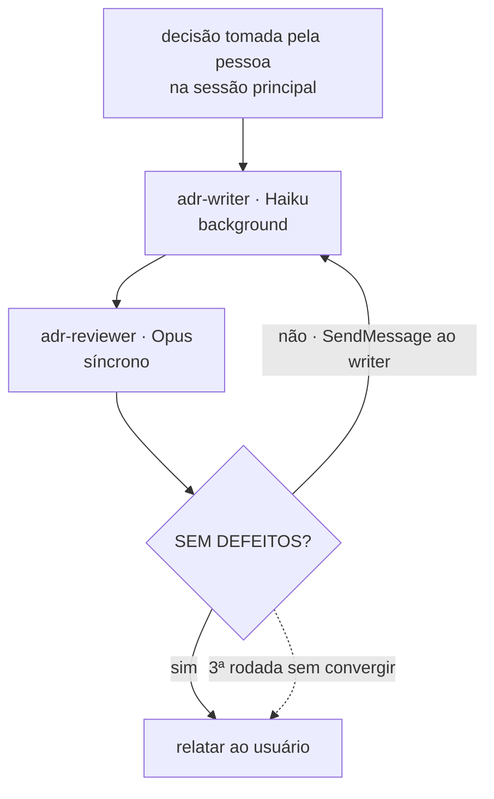

@AGENTS.md

## Sobre este arquivo

As instruções deste repositório vivem em [`AGENTS.md`](AGENTS.md), importado na primeira
linha. Edite lá, nunca aqui.

Este arquivo existe porque o Claude Code lê `CLAUDE.md` e não `AGENTS.md`
([documentação](https://code.claude.com/docs/en/memory)). O import `@AGENTS.md` é o
mecanismo que a própria documentação prescreve para repositórios que mantêm uma fonte
única compartilhada com outros agentes. Um symlink teria o mesmo efeito, mas exige
Administrador ou Modo de Desenvolvedor no Windows.

Acrescente abaixo apenas o que for específico do Claude Code — skills, hooks, comandos.
Qualquer instrução que valha para qualquer agente pertence ao `AGENTS.md`.

## Escrita de ADR roda em sub-agente

**Toda escrita de ADR é delegada a um sub-agente, em background.** Regra do usuário,
adotada em 2026-08-04.

A sessão principal continua responsável por conduzir a decisão: apresentar o problema, as
alternativas e os trade-offs, e obter a escolha explícita. O sub-agente recebe a escolha
já feita e redige o arquivo.

O que o sub-agente DEVE receber no prompt: a decisão tomada, as alternativas descartadas
com o motivo técnico de cada uma, as evidências com caminho e linha, e o estado inicial
`Aceito`. O que ele NÃO DEVE fazer: escolher entre alternativas, inventar evidência, ou
fechar lacuna por conta própria — uma lacuna vira linha em
[`docs/architecture/decisoes-pendentes.md`](docs/architecture/decisoes-pendentes.md), e
nunca uma decisão silenciosa.

### Os dois agentes registrados, e o loop entre eles

Desde 2026-08-04 a delegação tem endereço. **NÃO use um `general-purpose` genérico para
escrever ADR.**

| Agente                                                   | Modelo | Papel                                    |
|----------------------------------------------------------|--------|------------------------------------------|
| [`adr-writer`](.claude/agents/adr-writer.md)             | Haiku  | redige e corrige o arquivo               |
| [`adr-reviewer`](.claude/agents/adr-reviewer.md)         | Opus   | acha defeitos e devolve lista numerada   |

O revisor nasce **sem `Write` e sem `Edit`**, de propósito. Um revisor que pode corrigir
corrige, e o defeito nunca volta para quem escreveu — o loop deixa de existir.

A sequência que a sessão principal executa:

1. `Agent` com `subagent_type: "adr-writer"` e `run_in_background: true`.
2. `Agent` com `subagent_type: "adr-reviewer"` e `run_in_background: false` —
   **síncrono**, porque sem o veredito não há o que mandar de volta ao escritor.
3. Se a resposta não for `SEM DEFEITOS`, `SendMessage` ao **id do `adr-writer`
   original**, com a lista de defeitos verbatim. `SendMessage` preserva o contexto dele;
   um `Agent` novo partiria do zero. Volte ao passo 2.
4. **No máximo três rodadas.** Um revisor Opus e um escritor Haiku podem discordar
   indefinidamente sobre um ponto de julgamento, e isso precisa parar em decisão humana,
   não em loop. Na terceira, relate ao usuário o que sobrou.

**Custo a medir, não a presumir.** O que os ADRs daqui exigem não é prosa, é disciplina
de citação — `arquivo:linha` conferido, padding de tabela em caracteres, 88 colunas, e a
regra dura de que o que não se confirma vira `Pergunta em aberto`. É o pior caso para um
modelo pequeno. O revisor Opus existe para cobrir isso, mas o custo real aparece em
rodadas de correção. Meça no próximo ADR antes de assumir que o par sai mais barato que
Opus escrevendo direto.
