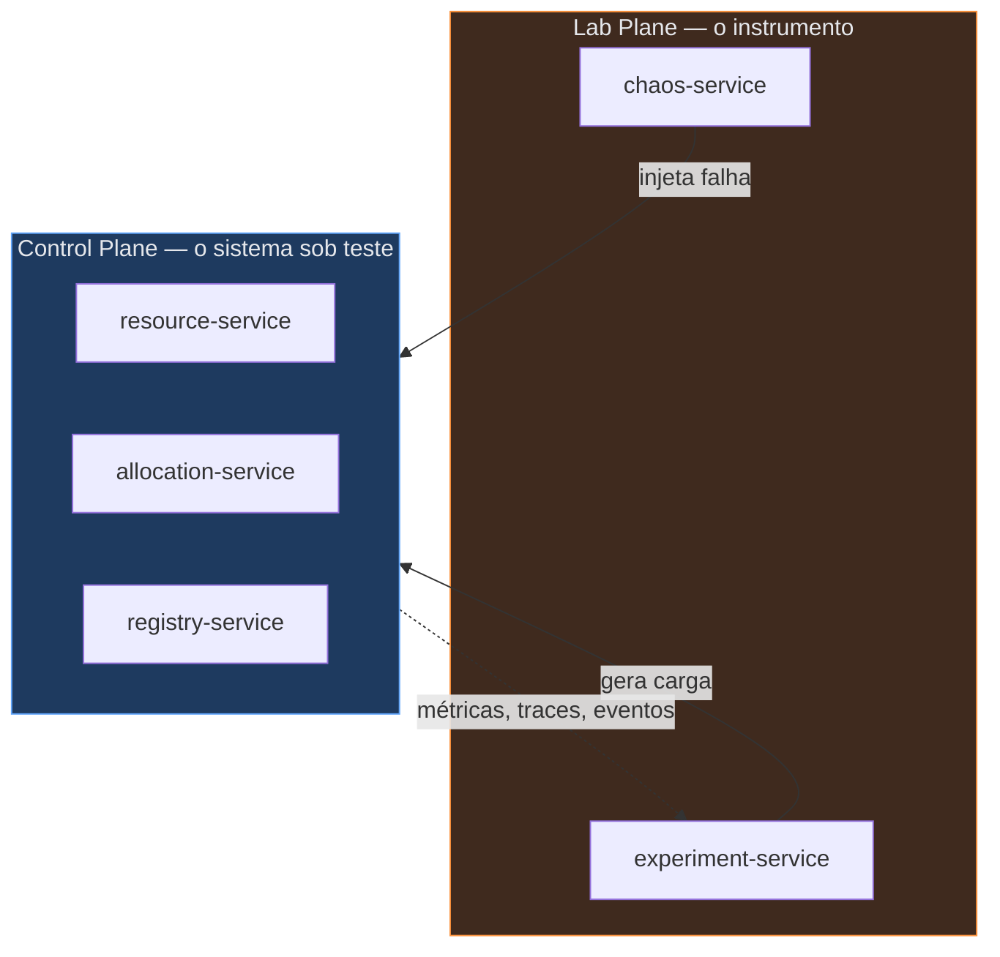

# Distributed Consistency Lab

Um laboratório para estudar **consistência em sistemas distribuídos**.

Isto não é uma aplicação de negócio. É um instrumento de medida. O domínio existe
apenas para que uma invariante possa ser violada de formas diferentes, sob condições
controladas, e para que cada violação seja observável, reproduzível e explicável.

## A invariante

O laboratório inteiro gira em torno de uma única regra ([ADR-0001](docs/adr/0001-dominio-generico-com-invariante-unica.md)):

```
Para todo Resource:
    Σ(alocações ativas) ≤ capacidade
    capacidade disponível ≥ 0
```

Nenhuma outra regra de negócio existe. Toda complexidade do repositório é
infraestrutura de consistência, não regra de domínio.

### O veredito tem dois eixos

O [ADR-0002](docs/adr/0002-quatro-origens-de-escrita.md) separou o que antes era uma
pergunta binária:

| Eixo | Pergunta | Asserção | Pode ser violado? |
|---|---|---|---|
| **Safety** | O sistema **aceitou** uma escrita que quebrou a invariante? | `safety.violations == 0` | nunca |
| **Liveness** | Depois de quebrada por fato externo, o sistema **converge**? | `convergence.seconds < N` | é o objeto da medida |

A distinção existe porque um relato legítimo do mundo real — a capacidade de um nó
encolheu — pode violar a invariante sem nenhuma concorrência. Rejeitar um comando é
legítimo; rejeitar um fato observado não é.

## As quatro origens de escrita

Quatro atores escrevem no mesmo estado, com semânticas diferentes. Cada um produz uma
família de falha própria ([ADR-0002](docs/adr/0002-quatro-origens-de-escrita.md)):

| Origem | Transporte | Semântica | Falha característica |
|---|---|---|---|
| **Operator** | REST síncrono, com `Idempotency-Key` | comando imperativo do usuário | `lost update` clássico |
| **Agent** | evento assíncrono (heartbeat) | relato de fato observado no passado | fato fora de ordem; violação retroativa |
| **Reconciler** | job periódico | leitura ampla, depois escrita | `write skew` |
| **Lease Expiry** | disparo por relógio | o tempo como escritor | corrida entre expirar e renovar |

## Os dois planos

O repositório separa **o sistema sob teste** do **instrumento que o mede**. Confundir
os dois invalida qualquer conclusão: um bug no instrumento vira um falso resultado de
consistência.



A regra 6 do [ADR-0006](docs/adr/0006-hexagonal-com-archunit.md) impõe a separação com
um teste ArchUnit: **o Control Plane nunca importa o Lab Plane**. A seta de volta é
observação, não dependência.

## Estrutura do repositório

```
distributed-consistency-lab/
├── docs/
│   ├── adr/                          decisões de arquitetura — leia daqui primeiro
│   ├── diagrams/                     diagramas Mermaid mantidos junto ao código
│   └── experiments/                  relatórios de execução, um por rodada
├── experiments/                      definições de experimento em JSON (ADR-0004)
├── services/
│   ├── resource-service/             Control Plane — capacidade e invariante
│   ├── allocation-service/           Control Plane — alocações e saga
│   ├── registry-service/             Control Plane — agentes e heartbeat
│   ├── chaos-service/                Lab Plane — injeção de falha semeada
│   └── experiment-service/           Lab Plane — carga, asserções, relatório
├── shared/
│   └── lab-messaging-contract/       envelope de evento e correlação — só técnico
├── frontend/                         visualização da árvore causal (Etapa 7)
├── platform/                         ambiente local
│   ├── compose/                      profiles do Docker Compose (ADR-0010)
│   ├── postgres/init/                schemas e usuários, um por serviço
│   ├── rabbitmq/                     exchanges, filas, DLQ
│   └── observability/                prometheus, grafana, loki, tempo, otel-collector
├── deploy/                           homelab (Etapa 10)
│   ├── helm/
│   ├── argocd/
│   └── manifests/
├── infra/tofu/                       OpenTofu — provisionamento
└── tools/                            scripts de apoio
```

Duas distinções importantes na tabela acima:

- **`experiments/` guarda as definições; `docs/experiments/` guarda os resultados.**
  A definição é a entrada versionada e reexecutável. O relatório é a saída, com a
  semente, as métricas e o veredito. Os dois entram no Git — juntos, o histórico do
  repositório vira um caderno de laboratório.
- **`shared/` nunca contém domínio.** Só o envelope de evento, correlação, tipos de
  erro de transporte e a fonte de aleatoriedade semeada. Entidade, invariante ou DTO
  de serviço em `shared/` transformaria o laboratório num monólito distribuído
  ([ADR-0005](docs/adr/0005-monorepo-com-reactor-unico.md), Alternativa C).

### Dentro de um serviço

Cada serviço segue as quatro camadas do
[ADR-0006](docs/adr/0006-hexagonal-com-archunit.md), com dependência em uma direção só:

```
api            → controllers, DTOs de entrada e saída, tradução HTTP
application    → casos de uso, orquestração, transação
domain         → agregados, invariante, portas (interfaces)
infrastructure → adaptadores: JPA, mensageria, HTTP externo, relógio
```

O `domain` não aponta para ninguém. Ele não importa Spring, JPA nem Jackson. A
invariante é testável com um `new` e um `assert`, em milissegundos, sem contexto de
aplicação e sem banco.

## Stack

| Camada | Escolha |
|---|---|
| Linguagem | Java 21 |
| Framework | Spring Boot 3.x; Spring Modulith apenas para verificação de módulos |
| Build | Maven, reactor único |
| Persistência | PostgreSQL — um schema por serviço, sem acesso cruzado |
| Mensageria | RabbitMQ nas etapas iniciais, Kafka depois |
| Observabilidade | OpenTelemetry, Prometheus, Grafana, Loki, Tempo |
| Testes | JUnit 5, Testcontainers, contract tests, ArchUnit |
| Empacotamento | Docker, Kubernetes, Helm, ArgoCD |
| Infraestrutura | Terraform / OpenTofu |
| Frontend | React, TypeScript, Vite, Tailwind, React Flow ou D3, WebSocket ou SSE |

## Roadmap

As etapas abaixo são as que os ADRs já ancoram. A numeração intermediária ainda não
foi fixada — ela é decidida quando o ADR correspondente for escrito.

| Etapa | Tema | ADRs |
|---|---|---|
| 0 | Domínio, origens de escrita, monorepo, plataforma local | 0001, 0002, 0005, 0010 |
| 1 | Estratégias de concorrência e guardas de arquitetura | 0003, 0006 |
| 2 | Transactional Outbox e relay | 0007 |
| 3 | Inbox, deduplicação, ordenação, DLQ | 0007, 0003 (Grupo 2) |
| 4 | Experimentos reproduzíveis com semente | 0004 |
| 5 | Motor de workflow, saga, lease expiry, múltiplas réplicas | 0008, 0009 |
| 7 | Frontend da árvore causal | — |
| 10 | Deploy no homelab | — |

## Estado atual

**Nada foi implementado.** O repositório contém apenas ADRs e este esqueleto.

Isso é deliberado. A decisão vem antes do código, e cada decisão é debatida uma a uma.
Um ADR escrito depois da implementação não é uma decisão — é uma justificativa.

O estado do debate está em [`docs/adr/README.md`](docs/adr/README.md), na tabela
**"Onde o debate parou"**.

> **Aviso.** Esta estrutura deriva dos ADRs 0005 e 0006, que ainda estão `Proposto`.
> Ela é provisória até que os dois sejam aceitos. Nenhum `pom.xml` foi criado, e o
> pacote raiz Java ainda não foi escolhido — essa decisão acompanha o parent POM.

## Como este repositório é lido

Comece pelos ADRs, na ordem numérica. Cada um responde a três perguntas: qual era o
problema, o que foi decidido, e **o que foi descartado e por quê**. A seção
*Alternativas consideradas* costuma valer mais que a seção *Decisão* — ela guarda o
raciocínio que o código sozinho nunca mostra.

O processo de debate, incluindo a regra de que nenhuma objeção pode existir apenas na
conversa, está documentado em [`docs/adr/README.md`](docs/adr/README.md).
