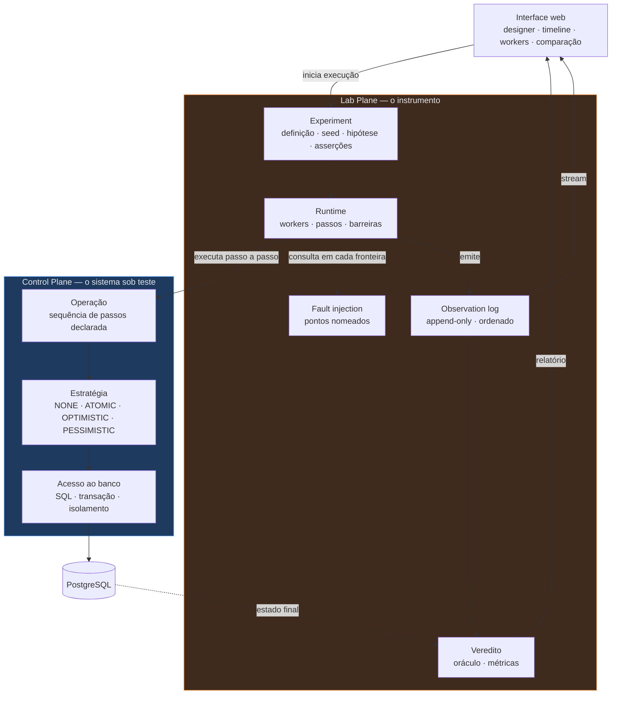

# Distributed Systems Experiment Lab

Uma plataforma experimental para **reproduzir, observar e comparar** problemas
conhecidos de sistemas distribuídos.

Isto não é uma aplicação de negócio. Não existe pedido, pagamento, cliente ou estoque. O
laboratório é um instrumento de medida: um engenheiro configura um experimento, executa,
injeta condições adversas e observa em tempo real como o sistema reage.

> Execute 100 operações concorrentes sobre o mesmo recurso com optimistic locking,
> 5 workers, latência aleatória entre 50 e 500 ms e 10% de duplicação de mensagens.

No fim, o laboratório precisa **explicar objetivamente** o que aconteceu.

## O princípio que orienta tudo

> Nunca introduza primeiro a solução. Introduza primeiro o problema.

Para estudar Transactional Outbox, o laboratório **não** começa implementando Outbox.
Ele constrói um experimento em que o commit no banco e a publicação da mensagem são duas
operações independentes, provoca a falha entre elas, observa a inconsistência — e só
então introduz o Outbox e roda o mesmo experimento de novo.

```
PROBLEMA → CAUSA → SOLUÇÃO → TRADE-OFF
```

Isso vale para os 42 fenômenos do escopo, sem exceção.

## A abstração central: uma operação é uma sequência de passos

Três exigências do laboratório convergem para o mesmo mecanismo:

| Exigência                          | O que ela precisa                                         |
|------------------------------------|-----------------------------------------------------------|
| Barreiras determinísticas          | pausar o Worker-1 **entre** READ e WRITE                  |
| Fault injection em pontos nomeados | falhar em `AFTER_COMMIT`, `BEFORE_PUBLISH`, `BEFORE_ACK`… |
| Timeline                           | um registro por passo, com worker, recurso e versão       |

Nenhuma delas é atendível se uma operação for um método Java comum. Por isso uma
operação é declarada como uma **sequência de passos**, executada pelo runtime do
laboratório. Em cada fronteira entre dois passos o runtime consulta o escalonador,
consulta o injetor de falha e emite uma observação.

```
operação increment:
  READ     → SELECT value, version FROM resource WHERE id = ?
  COMPUTE  → value + 1
  WRITE    → UPDATE resource SET value = ?, version = version + 1 WHERE ...
  COMMIT
```

O que é sintético é apenas o **agendamento**. O nível de isolamento, o lock de linha e o
`40001` de serialização vêm do PostgreSQL real. O runtime não simula o banco — ele
decide *quando* cada transação dá o próximo passo.

Detalhes e a objeção honesta a essa escolha estão em
[`docs/plano-do-laboratorio.md`](docs/plano-do-laboratorio.md), seção 2.

## Os cinco grupos de fenômenos

Os 42 cenários são classificados pela **fonte de não determinismo que produz a
anomalia** — não pela tecnologia envolvida. A causa determina o que a plataforma precisa
saber controlar para reproduzir o fenômeno.

| Grupo                   | Fonte da anomalia                                           | O que a plataforma controla                     | Veredito                |
|-------------------------|-------------------------------------------------------------|-------------------------------------------------|-------------------------|
| **A — Intercalação**    | dois fluxos tocam o mesmo estado no mesmo banco             | barreiras entre passos; nível de isolamento     | booleano                |
| **B — Entrega**         | o canal não garante uma vez, em ordem, no prazo             | interceptação do canal com semente              | booleano                |
| **C — Escrita parcial** | uma mudança atravessa dois sistemas que não commitam juntos | falha em ponto nomeado; amostragem no tempo     | booleano + convergência |
| **D — Saturação**       | nada está incorreto; o sistema não dá conta                 | taxa, latência artificial, profundidade de fila | **curva**               |
| **E — Posse no tempo**  | quem tem o direito de escrever, e até quando                | relógio injetável; mais de um processo          | booleano                |

O grupo D é o que quebra o modelo de veredito do resto: backpressure não tem estado
errado, tem uma fila de 40 mil mensagens e alguém que precisa decidir se isso é falha.
Os dois formatos de veredito existem desde o desenho por causa disso.

## Os dois planos

O repositório separa **o sistema sob teste** do **instrumento que o mede**. Confundir os
dois invalida qualquer conclusão: um bug no instrumento vira um falso resultado de
consistência.



A seta que **não** existe é a mais importante: nenhuma caixa do Control Plane aponta
para dentro do Lab Plane. O runtime chama a operação; a operação nunca chama o runtime.
É o que permite injeção de falha dentro do processo sem contaminar o sistema medido.

Nas primeiras etapas os dois planos vivem na **mesma JVM**. A separação precisa ser
imposta por teste executável, justamente por isso.

## O MVP — cinco experimentos, um processo, um banco

Todos no grupo A. Nenhum exige broker, segundo processo ou serviço adicional.

| #  | Experimento                   | O que ele prova                                                    |
|----|-------------------------------|--------------------------------------------------------------------|
| E1 | `lost-update-none`            | o laboratório **detecta**. É o grupo de controle: precisa falhar   |
| E2 | `lost-update-deterministic`   | o laboratório **constrói**. Exatamente uma perda, em toda execução |
| E3 | `lost-update-strategies`      | a estratégia é um dado, não uma branch. Quatro comparadas          |
| E4 | `optimistic-under-contention` | o primeiro resultado que é **curva**, não veredito                 |
| E5 | `write-skew-inert-protection` | a proteção pode estar presente e **não proteger nada**             |

O E5 é o resultado que mais justifica o laboratório existir: sob um modelo de
verificação derivado, inserir uma alocação não incrementa a `version` do recurso. A
anotação está lá, nenhuma exceção é lançada, e a invariante quebra em silêncio. Nenhum
teste de unidade o detecta.

**E1 é obrigado a falhar.** Se ele não falhar, a carga é insuficiente e nenhum resultado
dos outros quatro significa nada. É a regra que separa um laboratório de uma
demonstração.

## Roadmap

Doze etapas. Cada uma responde uma pergunta concreta e introduz **exatamente uma**
dificuldade nova. Nenhuma etapa tem infraestrutura como entregável.

| #  | Pergunta                                                                | Grupo       |
|----|-------------------------------------------------------------------------|-------------|
| 1  | Como demonstrar visualmente um lost update, e **provar** que aconteceu? | A           |
| 2  | Qual estratégia corrige, e a que custo?                                 | A           |
| 3  | Por que a proteção pode estar presente e inerte?                        | A           |
| 4  | O que quebra quando o worker deixa de ser uma thread?                   | A→E         |
| 5  | O que muda quando a operação vira uma mensagem?                         | B           |
| 6  | O que acontece se o processo morre entre o commit e o publish?          | C           |
| 7  | Como garantir que o efeito lógico aconteça uma vez só?                  | C           |
| 8  | Para onde vai a mensagem que nunca dá certo?                            | B/D         |
| 9  | Como medir o que o usuário viu, e não o que ficou gravado?              | C           |
| 10 | Quando um sistema correto deixa de servir?                              | D           |
| 11 | Quem tem o direito de escrever, e até quando?                           | E           |
| 12 | Como transformar um bug de concorrência num teste repetível?            | transversal |

As etapas 1 a 3 são o MVP. **A etapa 4 não tem data:** ela acontece quando o experimento
de lock de JVM ficar vermelho com duas instâncias. Se ele nunca for escrito, a etapa 4
nunca chega — e isso é informação, não atraso.

## Stack

| Camada                   | Escolha                 | Quando entra                         |
|--------------------------|-------------------------|--------------------------------------|
| Linguagem                | Java 25                 | etapa 1                              |
| Framework                | Spring Boot 4.x         | etapa 1                              |
| Persistência             | PostgreSQL              | etapa 1                              |
| Frontend                 | interface web unificada | etapa 1                              |
| Empacotamento            | Docker                  | etapa 1                              |
| Mensageria               | RabbitMQ                | etapa 5                              |
| Cache e lock distribuído | Valkey                  | etapa 11, **se** provado necessário  |
| Observabilidade externa  | OpenTelemetry e afins   | quando a timeline própria não bastar |
| CI/CD                    | GitHub Actions e GHCR   | dia zero do primeiro módulo          |
| Orquestração             | Kubernetes (K3s)        | dia zero — **destino de entrega**    |

Nenhuma tecnologia entra por estar disponível. Cada uma entra quando um experimento não
puder ser executado sem ela. Kafka não está no escopo.

O Kubernetes é a exceção aparente, e a distinção importa: ele **hospeda** o laboratório,
mas não entra em nenhum experimento. Nenhum dos 42 fenômenos é reproduzido por um
recurso do cluster.

## Entrega

O laboratório roda no homelab descrito em
[`homelab-infrastructure`](https://github.com/da0hn/homelab-infrastructure), como
primeira carga de trabalho da Camada 8. O contrato de entrega está fixado na ADR 0017
daquele repositório:

- CI/CD **exclusivamente** no GitHub Actions, em runner hospedado — Testcontainers exige
  um daemon Docker que o CI interno do homelab não expõe, e este repositório é público,
  o que torna inaceitável dar acesso ao daemon do nó a um autor de PR.
- Imagem no GHCR, autenticada por `GITHUB_TOKEN` efêmero. Tag = SHA do commit, nunca
  `latest`.
- Manifests Kustomize em `deploy/`, **neste** repositório. O workflow da `master` faz
  `kustomize edit set image` e commita; o ArgoCD do homelab puxa por polling (~3 min).
- Nenhum Secret vive aqui. Eles ficam cifrados com SOPS/KSOPS no homelab e são
  referenciados por nome.

A conciliação entre esse contrato e o plano deste repositório — inclusive o que colide —
está em
[`docs/plano-do-laboratorio.md`](docs/plano-do-laboratorio.md), seção 12.

O PostgreSQL não é só armazenamento — ele é **ferramenta do laboratório**. Níveis de
isolamento, locks, constraints e deadlocks são objeto de estudo, não detalhe de
infraestrutura.

## Estado atual

**Nada foi implementado.** Não existe `pom.xml`, classe Java ou `docker-compose.yml`.

| Item                   | Estado                                                     |
|------------------------|------------------------------------------------------------|
| Plano do laboratório   | [escrito](docs/plano-do-laboratorio.md), não é decisão     |
| ADRs da série corrente | **nenhum escrito**                                         |
| Primeira série de ADRs | [arquivada](docs/adr/arquivo/README.md), nenhum foi aceito |
| Código                 | nenhum                                                     |

O repositório teve uma primeira série de 13 ADRs, construída sobre outra pergunta
central: *quanto custa proteger uma invariante de capacidade sob concorrência?* Nenhum
foi aceito. Todos foram arquivados em [`docs/adr/arquivo/`](docs/adr/arquivo/README.md)
e continuam lá pelas seções de alternativas descartadas, que não caducaram junto com as
decisões.

> **Aviso sobre a entrega.** O homelab já tem um `Application` do ArgoCD apontando para
> o diretório `deploy/` deste repositório, com `prune: true` e `selfHeal: true`. Esse
> diretório **não existe** — o esqueleto herdado das decisões arquivadas foi apagado
> antes de o novo ser decidido. O cluster reporta `ComparisonError` para este app hoje.
> É ruidoso e isolado do resto da árvore, e o conserto acompanha o ADR de arquitetura
> mínima e entrega.

## Como este repositório é lido

1. [`docs/plano-do-laboratorio.md`](docs/plano-do-laboratorio.md) — taxonomia,
   dependências pedagógicas, roadmap, MVP, arquitetura mínima e decisões adiadas.
2. [`docs/adr/README.md`](docs/adr/README.md) — o processo de decisão e a fila do que
   precisa ser decidido, em ordem.
3. [`docs/adr/arquivo/README.md`](docs/adr/arquivo/README.md) — por que a primeira série
   foi arquivada e o que sobreviveu dela.

A decisão vem antes do código. Um ADR escrito depois da implementação não é uma
decisão — é uma justificativa.
