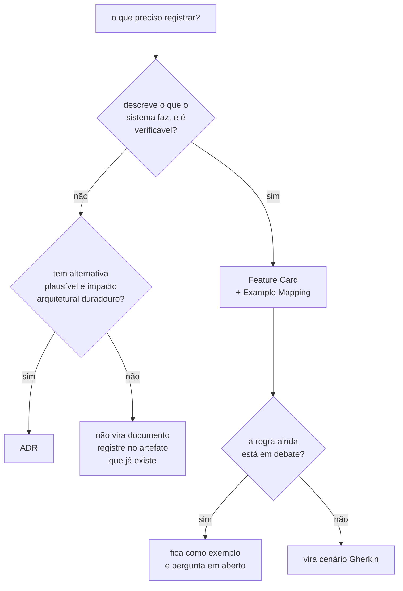

# AGENTS.md — trabalhando dentro de `docs/`

Instruções operacionais para editar esta pasta. O contexto do projeto está no
[`AGENTS.md` da raiz](../AGENTS.md); o mapa da pasta está em [`README.md`](README.md).

## A regra que vale antes de qualquer outra

> **Nada que importa pode existir apenas na conversa.**

O contexto é limpo entre sessões. Toda objeção, alternativa descartada ou pendência é
escrita no arquivo **no mesmo turno em que é
levantada**, antes de responder ou perguntar
qualquer coisa. Uma objeção que fica só no chat desaparece no próximo compact, em silêncio.

O destino depende do artefato: `## Questões em aberto` do ADR, ou a seção de perguntas
em aberto do `example-mapping.md`.

## O que nunca é editado

| Alvo                           | Por quê                                                                                |
|--------------------------------|----------------------------------------------------------------------------------------|
| `adr/arquivo/**`               | registra o que se pensava naquela data; editar apaga a evidência                       |
| o **corpo** de um ADR `Aceito` | para mudar a decisão, escreva um ADR novo e marque o antigo `Substituído por ADR-NNNN` |

Corpo é tudo a partir da primeira seção `##`. Um ADR `Proposto` **pode** ser editado.
Hoje **nenhum** ADR da série corrente está nesse estado: os oito estão `Aceito`, e o
corpo de nenhum deles pode ser editado.

**O cabeçalho de um ADR aceito é editável num caso só, desde 2026-08-04.** Quando um ADR
posterior o substitui ou subsome uma regra dele, o ADR alterado recebe `Última
atualização` e `Alterado por`, no mesmo commit em que o ADR novo nasce. A regra completa
está em [`adr/README.md`](adr/README.md), seção "O rastro de alterações, emendado em
2026-08-04". Nenhuma outra edição de ADR aceito é permitida.

## Qual artefato criar



O teste que separa os dois primeiros:

| Pergunta                                                | Sim → ADR | Sim → Feature Card |
|---------------------------------------------------------|-----------|--------------------|
| Existe alternativa que alguém defenderia com argumento? | sim       | —                  |
| A escolha restringe o que se pode construir depois?     | sim       | —                  |
| A frase descreve o que o sistema faz, e é verificável?  | —         | sim                |
| Um teste poderia falhar por causa dela?                 | —         | sim                |

Uma regra que caiba nas duas colunas indica um ADR carregando comportamento: escreva o
ADR com o porquê, o card com o quê, e faça o card citar o ADR por arquivo e linha.

## Feature Card

Caminho: `features/<slug>/feature-card.md`. Slug em kebab-case, nomeando a capacidade.

Seções obrigatórias, nesta ordem: problema e resultado esperado; atores e gatilho;
escopo; fora de escopo; regras de negócio; integrações e contratos afetados; riscos e
decisões pendentes; critérios de pronto; links.

- **Máximo 700 palavras.** Um card acima disso cobre mais de uma capacidade — divida. O
  corte sai da prosa e dos diagramas, **nunca da
  evidência**. Um diagrama grande vai para
  o `example-mapping.md`, que não tem limite.

  `wc -w` sozinho **superestima**: ele conta os `|` das tabelas como palavras, e um card
  com duas tabelas infla cerca de 10%. Meça assim:

  ```bash
  sed -E 's/\|/ /g' feature-card.md | grep -vE '^[ -]+$' | tr -s ' ' '\n' \
    | grep -vE '^-*$' | grep -c .
  ```
- **Um card cobre uma capacidade**, nunca um endpoint, uma classe ou uma tarefa técnica.
- **Um card por oráculo, não por experimento.** É o oráculo que define o comportamento
  observável. E1 e E3 partilham o oráculo exato e vivem num card só.
- **Toda regra leva evidência** com arquivo e linha, numa coluna própria da tabela.
- Um diagrama que não couber no limite de palavras vai para o `example-mapping.md`, que
  não tem limite. O card faz link.
- Ao criar um card, acrescente a linha correspondente em [`features/README.md`](features/README.md)
  e em [`README.md`](README.md), seção `## Estado da especificação`.

## Example Mapping

Caminho: `features/<slug>/example-mapping.md`.

Quatro blocos obrigatórios — história, regras, exemplos concretos, perguntas em aberto —
e um quinto para o que foi **adiado de propósito**, com o gatilho que o retoma.

- Os exemplos existem para revelar o que a regra não disse: fronteira, erro, autorização,
  repetição, concorrência, idempotência e consistência. Um exemplo que apenas reafirma a
  regra em outras palavras não acrescenta nada.
- Use **contraexemplo** para registrar o que a regra deixa passar. É onde as lacunas do
  repositório ficam visíveis.
- Feche com uma seção **"O que não virou cenário, e por quê"**. Ela impede que uma regra
  omitida do Gherkin pareça esquecimento.

## BDD

Caminho: `features/<slug>/behavior.feature`.

- Cabeçalho `# language: pt`, e um comentário dizendo de onde as regras vêm.
- **Comportamento externo e observável.** Nome de classe, de tabela e de coluna não
  aparecem num cenário; o veredito, a contagem e a recusa aparecem.
- Poucos cenários. Por regra: o fluxo principal, uma falha relevante, e um caso de borda
  quando ele mudar o resultado.
- **Só exemplo estabilizado vira cenário.** Regra em debate fica no Example Mapping.
  Escrever Gherkin sobre regra em debate congela a versão errada dela.
- Todo cenário leva a tag `@teste-ausente` enquanto não houver teste que o verifique.
  Quando o teste existir, troque a tag pelo identificador dele.
- **Nenhuma dependência de BDD entra no projeto por causa disso.**

## Contratos

Caminho: `contracts/openapi/` e `contracts/asyncapi/`.

- **Um contrato é criado quando a interface
  existir**, nunca antes. Hoje nenhuma existe, e
  por isso os dois diretórios **não** foram criados.
- **Não crie diretório
  vazio.** Uma pasta `openapi/` sem conteúdo afirma que existem APIs
  a documentar. O repositório já pagou por esse erro com o `services/` de pastas com
  nome de dono, apagado em `83fcfc9`.
- O que estiver formalizado num contrato **NÃO DEVE** ser repetido em Markdown.
- Ao criar o primeiro, atualize [`contracts/README.md`](contracts/README.md), que hoje
  lista os gatilhos de cada um.

## Integrações

Caminho: `architecture/integrations.md`.

- A matriz separa **fato** de
  **hipótese**. Fato é verificável hoje, na árvore versionada
  ou num repositório externo nomeado. Hipótese é descrita em documento de planejamento e
  nada a implementa.
- **Nunca promova hipótese a fato sem evidência
  nova.** Hoje há uma integração real, e ela
  está quebrada: o ArgoCD do homelab aponta para um `deploy/` que não existe.
- Perguntas de integração recebem identificador `Q-INT-N`.

## ADR

Caminho: `adr/NNNN-titulo-em-kebab-case.md`. Para planejar um ADR no Claude Code, use
a skill `adr`. Ela contém o template e o ciclo de vida, e é acionada tanto por
`feature-planning` quanto por `domain-modeling`. O [`adr/README.md`](adr/README.md)
mantém as convenções, o índice e o histórico da série.

## Glossário de domínio

Caminho: `CONTEXT.md`, criado de forma preguiçosa quando o primeiro termo se
cristalizar. Para manter o glossário no Claude Code, use a skill `domain-modeling`. Ela
desafia termo ambíguo, cruza a linguagem com o código e atualiza o arquivo no mesmo
turno em que um termo é resolvido — nunca em lote. O formato está em
`.claude/skills/domain-modeling/references/context-format.md`.

## Convenções de escrita

As convenções gerais estão no [`AGENTS.md` da raiz](../AGENTS.md), seção `## Convenções
de escrita, válidas em todo documento`, e a lista de palavras proibidas em
[`adr/README.md`](adr/README.md). Elas valem aqui sem alteração.

Dois pontos que só aparecem nesta pasta:

- **Todo fluxo descrito em prosa vai também como diagrama
  Mermaid**, junto do parágrafo que
  o descreve. `sequenceDiagram` para ordem no tempo, `flowchart` para topologia e
  hierarquia. Excalidraw só para o que o Mermaid não expressa, exportado como
  `.excalidraw.svg` em [`diagrams/`](diagrams/).
- **Um diagrama que não acrescenta nada à prosa fica de
  fora.** Repetir a mesma informação
  em duas formas não é redundância útil quando as duas dizem exatamente o mesmo.

## Antes de encerrar uma edição

- Toda afirmação relevante tem evidência com caminho e linha. O que não pôde ser
  confirmado está como `Pergunta em aberto`, não como fato.
- Os links relativos resolvem. Um link entre níveis de diretório erra com facilidade —
  `docs/architecture/integrations.md` apontando para `../README.md` resolve para
  `docs/README.md`, e não para a raiz.
- O card está dentro de 700 palavras.
- A capacidade nova aparece nos dois índices: [`features/README.md`](features/README.md) e
  [`README.md`](README.md).
- `git add` apenas dos arquivos relacionados, e um único commit em Conventional Commits (skill `commit`).
