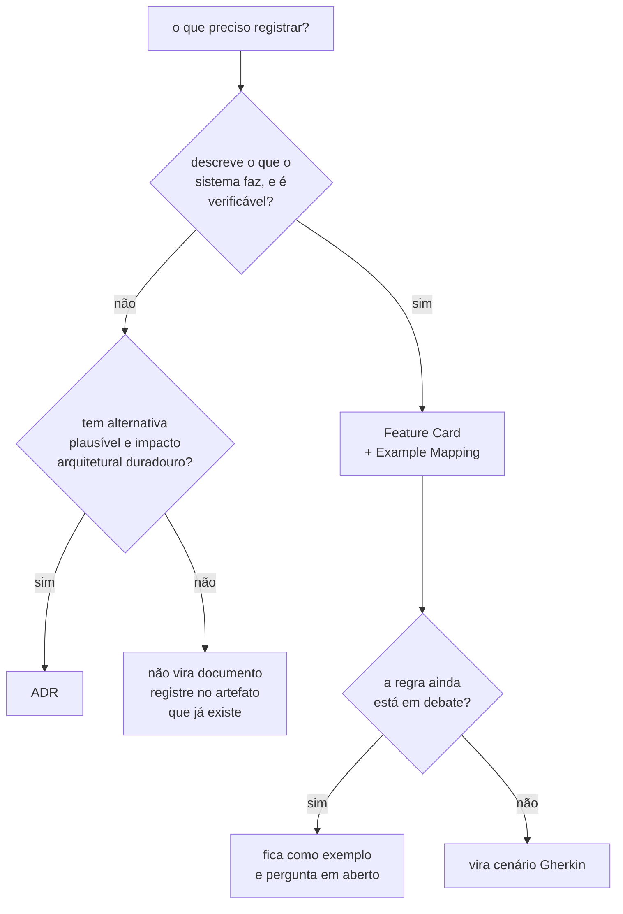

# AGENTS.md — trabalhando dentro de `docs/`

Instruções operacionais para editar esta pasta. O contexto do projeto está no
[`AGENTS.md` da raiz](../AGENTS.md); o mapa da pasta está em [`README.md`](README.md).

**Este arquivo não reexplica processo, lifecycle nem limite.** Cada regra abaixo é
acionável e aponta para o documento dono: o processo vive em
[`specification-process.md`](specification-process.md#a-decisão-vem-antes-do-artefato),
as formas de alterar um ADR aceito em
[`adr/README.md`](adr/README.md#a-revogação-da-imutabilidade-decidida-em-2026-08-07), e o
enforcement de limite no `check_artifact_limits.py`.

## A regra que vale antes de qualquer outra

> **Nada que importa pode existir apenas na conversa.**

O contexto é limpo entre sessões. Toda objeção, alternativa descartada ou pendência é
escrita no arquivo **no mesmo turno em que é
levantada**, antes de responder ou perguntar
qualquer coisa. Uma objeção que fica só no chat desaparece no próximo compact, em silêncio.

O destino depende do artefato: `## Questões em aberto` do ADR, ou a seção de perguntas
em aberto do `example-mapping.md`.

## `features/` é fonte de verdade, junto dos ADRs

Decidido em 2026-08-06. Um card não é resumo nem índice: **ele carrega tudo o que uma
consulta precisa**, e quem o lê não deveria ter de abrir o ADR para saber o que o sistema
faz. Por isso uma decisão arquitetural que mude comportamento entrega **ADR e card no
mesmo commit**.

A divisão de trabalho não muda: o ADR diz **por que** e o card diz **o quê**. O que muda é
que a segunda metade deixou de ser opcional.

## O que nunca é editado

| Alvo                                | Por quê                                                                          |
|-------------------------------------|----------------------------------------------------------------------------------|
| `adr/arquivo/**`                    | registra o que se pensava naquela data; editar apaga a evidência                 |
| a **decisão** de um ADR `Aceito`    | para mudá-la, escreva um ADR novo e marque o antigo `Substituído por ADR-NNNN`   |
| uma linha de `## Patches aplicados` | ela é o rastro que substituiu a proibição; removê-la apaga o que o rastro provava |

**A imutabilidade do corpo foi revogada em 2026-08-07.** O corpo — tudo a partir da
primeira seção `##` — PODE receber **patch**, que conserta citação, caminho ou erro
material e NÃO DEVE alterar a decisão nem o argumento que a sustentava. Nenhum patch
existe sem a linha dele em `## Patches aplicados`, no mesmo commit.

Seis formas alteram um ADR aceito — substituição, subsunção, emenda, adendo, divisão e
patch —, cada uma com gatilho e limite próprios, e nenhuma outra é permitida. A regra
completa está em
[`adr/README.md`](adr/README.md#a-revogação-da-imutabilidade-decidida-em-2026-08-07) e em
[A divisão de um ADR aceito](adr/README.md#a-divisão-de-um-adr-aceito-decidida-em-2026-08-11).
Não a reproduza aqui nem em outro documento: aplique-a a partir de lá.

Um ADR `Proposto` **pode** ser editado livremente; o estado de cada um está no
[índice de ADRs](adr/README.md#índice), que é o dono dele.

## Qual artefato criar



O teste que separa os dois primeiros é uma tabela de quatro perguntas, e o dono dela é
[`specification-process.md`](specification-process.md#adr--só-decisão-arquitetural-durável).
Uma regra que caiba nas duas colunas indica um ADR carregando comportamento: escreva o
ADR com o porquê, o card com o quê, e faça o card citar o ADR por caminho e âncora.

## Feature Card

Caminho: `features/<slug>/feature-card.md`. Slug em kebab-case, nomeando a capacidade.

Seções obrigatórias, nesta ordem: problema e resultado esperado; atores e gatilho;
escopo; fora de escopo; regras de negócio; integrações e contratos afetados; riscos e
decisões pendentes; critérios de pronto; links.

- **Máximo 5.500 caracteres de prosa.** Diagrama, bloco de código e tabela **não**
  entram na contagem, e a isenção vale para todo artefato `.md` com limite. Um card
  acima do limite cobre mais de uma capacidade — divida. O corte sai da prosa, **nunca
  da evidência**. A troca de unidade foi decidida em 2026-08-06, e o racional está em
  [`specification-process.md`](specification-process.md#feature-card--o-padrão).
- **Quem conta é o script, e ele é o único medidor:**

  ```bash
  python .claude/skills/feature-planning/scripts/check_artifact_limits.py \
    --root . --file docs/features/<slug>/feature-card.md
  ```

  Ele imprime a contagem de prosa e, entre parênteses, o tamanho bruto. **Nenhuma
  medição montada à mão vale** — nem `wc`, nem contagem de palavras, nem tamanho bruto
  do arquivo. Um número que não saiu do script não é evidência de limite.
- **Um card cobre uma capacidade**, nunca um endpoint, uma classe ou uma tarefa técnica.
- **Um card por oráculo, não por experimento.** É o oráculo que define o comportamento
  observável. E1 e E3 partilham o oráculo exato e vivem num card só.
- **Toda regra leva evidência com caminho e âncora GFM**, numa coluna própria da tabela:
  o caminho do arquivo mais o slug do título, no formato do GitHub Flavored Markdown.
  Cite por número de linha só quando o alvo não tiver título que a alcance, dentro de um
  bloco Mermaid por exemplo. É a decisão `C-1`, na
  [política de citação da raiz](../AGENTS.md#ao-trabalhar-aqui), e o verificador é
  `scripts/check_citations.py`.
- **Toda regra leva quem a aprovou**, numa segunda coluna própria, ao lado da evidência.
  Aprova-se a **regra**, e não o card: ela nasce `pendente` e só uma pessoa a tira desse
  estado. O card **NÃO DEVE** ganhar estado nem ato de aprovação — ele é o continente, e
  muda a cada exemplo novo. A regra está em
  [`specification-process.md`](specification-process.md#quem-aprova-o-que-decidido-em-2026-08-05).
- **Uma regra `pendente` NÃO DEVE virar cenário Gherkin.** Escrever Gherkin sobre regra
  não aprovada congela a versão errada dela, pelo mesmo motivo que vale para regra em
  debate.
- **Um card NÃO PODE contradizer um ADR aceito.** A contradição **é** decisão
  arquitetural nova: ela entra na [fila de decisões](adr/fila-de-decisoes.md) no mesmo
  turno em que é vista, e o card é alinhado ao que o ADR que sair dela disser.
- Um diagrama pesado demais para o card vai para o `example-mapping.md`, e o card faz
  link. O ganho é foco, e não orçamento: o card carrega o que uma consulta precisa, e o
  Example Mapping carrega o que uma discussão precisa.
- Ao criar um card, acrescente a linha correspondente em
  [`features/README.md`](features/README.md), que é o índice dono da lista — e **não** em
  [`README.md`](README.md), que é roteador e não carrega inventário.

## Example Mapping

Caminho: `features/<slug>/example-mapping.md`. **Não tem limite de tamanho** — ele
cresce por exemplo acrescentado, e acrescentar exemplo é o trabalho dele. A ausência de
teto foi decidida em 2026-08-06, e o verificador o isenta por nome — o racional está em
[`specification-process.md`](specification-process.md#example-mapping--onde-as-dúvidas-ficam-visíveis).

Quatro blocos obrigatórios — história, regras, exemplos concretos, perguntas em aberto —
e um quinto para o que foi **adiado de propósito**, com o gatilho que o retoma.

- Os exemplos existem para revelar o que a regra não disse: fronteira, erro, autorização,
  repetição, concorrência, idempotência e consistência. Um exemplo que apenas reafirma a
  regra em outras palavras não acrescenta nada.
- Use **contraexemplo** para registrar o que a regra deixa passar. É onde as lacunas do
  repositório ficam visíveis.
- Feche com uma seção **"O que não virou cenário, e por quê"**. Ela impede que uma regra
  omitida do Gherkin pareça esquecimento.

## BDD

Caminho: `features/<slug>/behavior.feature`.

- Cabeçalho `# language: pt`, e um comentário dizendo de onde as regras vêm.
- **Comportamento externo e observável.** Nome de classe, de tabela e de coluna não
  aparecem num cenário; o veredito, a contagem e a recusa aparecem.
- Poucos cenários. Por regra: o fluxo principal, uma falha relevante, e um caso de borda
  quando ele mudar o resultado.
- **Só exemplo estabilizado vira cenário.** Regra em debate fica no Example Mapping.
  Escrever Gherkin sobre regra em debate congela a versão errada dela.
- **Um `.feature` cujas regras ainda estejam `pendente` fica marcado como inativo, e não
  é especificação viva.** Ele permanece na árvore, mas não sustenta teste, código nem
  citação de comportamento; o estado das regras de cada capacidade está em
  [`features/README.md`](features/README.md#índice).
- Todo cenário leva a tag `@teste-ausente` enquanto não houver teste que o verifique.
  Quando o teste existir, troque a tag pelo identificador dele.
- **Nenhuma dependência de BDD entra no projeto por causa disso.**

## Contratos

Caminho: `contracts/openapi/` e `contracts/asyncapi/`.

- **Um contrato é criado quando a interface
  existir**, nunca antes. O inventário e os
  gatilhos de cada um vivem em [`contracts/README.md`](contracts/README.md); não
  replique aqui o estado deles.
- **Não crie diretório
  vazio.** Uma pasta `openapi/` sem conteúdo afirma que existem APIs
  a documentar, e o repositório já pagou por esse erro uma vez.
- O que estiver formalizado num contrato **NÃO DEVE** ser repetido em Markdown.
- Ao criar o primeiro, atualize [`contracts/README.md`](contracts/README.md).

## Integrações

Caminho: `architecture/integrations.md`.

- **A matriz é a dona do estado e da topologia das fronteiras.** Não replique aqui, nem
  em card ou ADR, o que existe, o que foi decidido e o que continua hipótese: o estado
  envelhece em silêncio na cópia.
- **Nunca promova hipótese a fato sem evidência
  nova.** Evidência é caminho e âncora GFM
  na árvore versionada, ou num repositório externo nomeado.
- Uma pergunta de integração recebe o identificador definido em
  [`questions/README.md`](questions/README.md#identificador), que é o dono do formato.

## ADR

Caminho: `adr/NNNN-titulo-em-kebab-case.md`. Para planejar um ADR no Claude Code, use
a skill `adr`. Ela contém o template e o ciclo de vida, e é acionada tanto por
`feature-planning` quanto por `domain-modeling`. O [`adr/README.md`](adr/README.md)
mantém as convenções, o índice e o histórico da série.

## Glossário de domínio

Caminho: [`CONTEXT.md`](CONTEXT.md), que **já existe**. Para mantê-lo no Claude Code, use
a skill `domain-modeling`. Ela desafia termo ambíguo, cruza a linguagem com o código e
atualiza o arquivo no mesmo turno em que um termo é resolvido — nunca em lote. O formato
está em `.claude/skills/domain-modeling/references/context-format.md`, e o papel do
artefato em
[`specification-process.md`](specification-process.md#glossário-de-domínio--contextmd).

Ele é o **glossário canônico do vocabulário vigente**, e cada entrada carrega quatro
coisas: termo, definição breve, status ou sinônimos, e link de origem.

**O que não entra nele**, mesmo quando fala de vocabulário:

| Conteúdo                                | Onde vive                                       |
|-----------------------------------------|-------------------------------------------------|
| alternativa de nome, com o descartado   | [fila de decisões](adr/fila-de-decisoes.md)     |
| decisão proposta e seu racional         | fila, e ADR quando a decisão for arquitetural   |
| pergunta em aberto sobre um termo       | [`questions/`](questions/README.md)             |
| backlog e ata de rodada                 | fila de decisões                                |

Um termo resolvido chega ao glossário **já decidido**, com o link para onde a decisão
foi tomada. O glossário não é um segundo repositório de decisões.

## Convenções de escrita

As convenções gerais estão no [`AGENTS.md` da raiz](../AGENTS.md), e a lista de palavras
proibidas em [`adr/README.md`](adr/README.md#convenções). Elas valem aqui sem alteração.

Dois pontos que só aparecem nesta pasta:

- **Todo fluxo descrito em prosa vai também como diagrama
  Mermaid**, junto do parágrafo que
  o descreve. `sequenceDiagram` para ordem no tempo, `flowchart` para topologia e
  hierarquia. Excalidraw só para o que o Mermaid não expressa, exportado como
  `.excalidraw.svg` em [`diagrams/`](diagrams/).
- **Um diagrama que não acrescenta nada à prosa fica de
  fora.** Repetir a mesma informação
  em duas formas não é redundância útil quando as duas dizem exatamente o mesmo.

## Antes de reduzir um documento

**Rode a consulta reversa antes de apagar um heading, e nunca depois:**

```bash
python scripts/check_citations.py --root . --quem-cita docs/CONTEXT.md
```

Ela responde quem cita cada heading do alvo, e marca as duas origens que exigem cuidado
próprio: `adr/arquivo/**`, que nunca é editado e por isso torna a citação inconsertável,
e a âncora interna `[texto]` seguida de `(#slug)`, que o verificador **não** acusa. Nada
é gravado na árvore — a resposta é recalculada a cada execução, e por isso não existe
derivado a envelhecer. Decidido em 2026-08-08, na
[fila](adr/fila-de-decisoes.md#o-que-apura-a-âncora-citada-antes-de-uma-redução).

Onde a consulta apontar citação, o heading permanece com lápide, pela regra do
[lifecycle](adr/README.md#a-revogação-da-imutabilidade-decidida-em-2026-08-07). O
verificador é a rede embaixo da consulta, e não substitui: ele acusa a âncora externa
quebrada na execução **seguinte** à remoção, quando o estrago já está no commit.

## Antes de encerrar uma edição

- Toda afirmação relevante tem evidência com **caminho e âncora GFM**; número de linha
  só quando o alvo não tiver título que a alcance. O que não pôde ser confirmado está
  como `Pergunta em aberto`, não como fato.
- Os links relativos resolvem. Um link entre níveis de diretório erra com facilidade —
  `docs/architecture/integrations.md` apontando para `../README.md` resolve para
  `docs/README.md`, e não para a raiz.
- O verificador de citações passa:

  ```bash
  python scripts/check_citations.py --root . --baseline scripts/citations-baseline.txt
  ```

- `check_artifact_limits.py` passa nos artefatos alterados. Ele é o único medidor.
- A capacidade nova aparece no índice que é dono da lista,
  [`features/README.md`](features/README.md), e em nenhum outro.
- `git add` apenas dos arquivos relacionados, e um único commit em Conventional Commits (skill `commit`).
