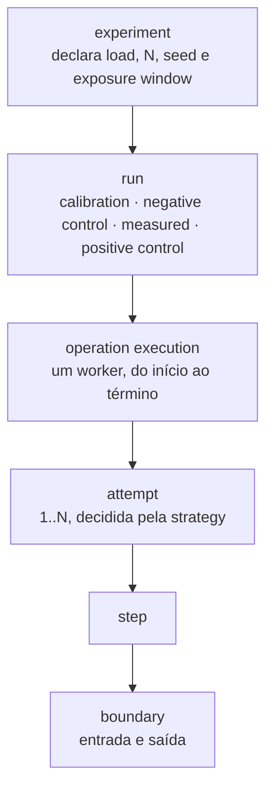
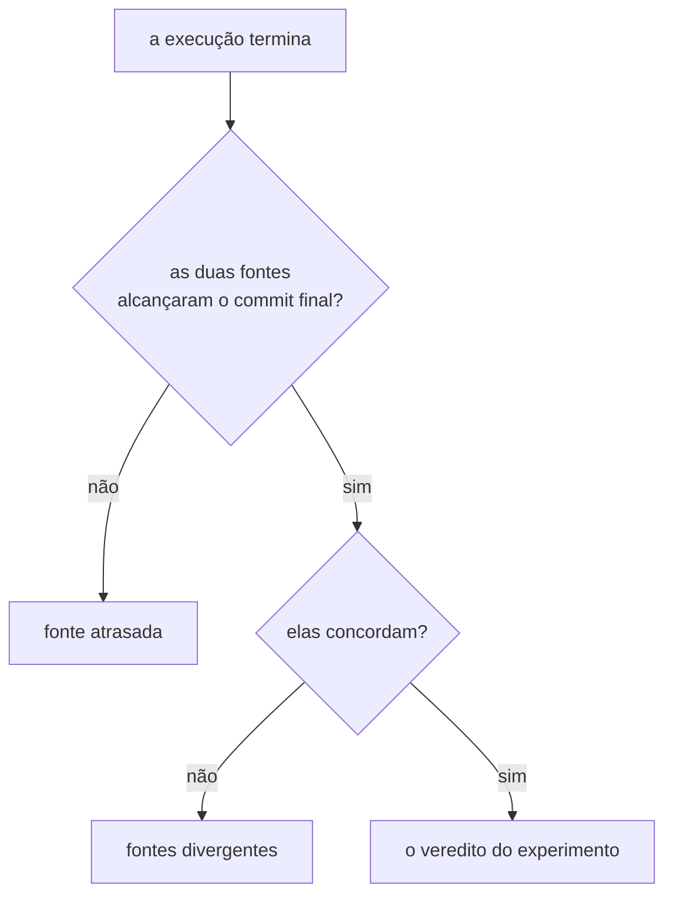

# Laboratório de consistência distribuída — glossário de domínio

O vocabulário de um único contexto: um instrumento que reproduz, observa e compara
fenômenos de sistemas distribuídos. Não há domínio de negócio aqui, por decisão.

- **Estado:** Proposta — as decisões de vocabulário `D-DOM-NN` vivem na
  [fila de decisões](adr/fila-de-decisoes.md#o-que-esta-fila-enfileira), e não aqui
- **Data:** 2026-08-03; termos convertidos para inglês e as quatro decisões de
  vocabulário tomadas em 2026-08-04
- **Escopo:** consolidar a linguagem ubíqua do laboratório, marcando o que vem de ADR
  aceito e o que nasce nesta proposta.
- **Depende de:** [`ADR-0001`](adr/0001-o-passo-como-unidade-de-execucao.md),
  [`ADR-0002`](adr/0002-o-dominio-minimo-e-os-dois-oraculos.md),
  [`ADR-0003`](adr/0003-a-linguagem-do-agendamento.md),
  [`ADR-0004`](adr/0004-o-estatuto-da-barreira-e-o-diagnostico-da-nao-ocorrencia.md),
  [`ADR-0005`](adr/0005-a-forma-do-escalonador.md),
  [`ADR-0006`](adr/0006-a-forma-da-estrategia-de-concorrencia.md),
  [`ADR-0007`](adr/0007-o-log-de-observacoes-forma-ordem-e-onde-vive.md) — todos
  `Aceito`.

## O idioma deste glossário

**Os termos são em inglês; as explicações, em português.** Regra adotada em 2026-08-04
junto da decisão `D-ARQ-06` de
[`adr/arquivo/proposta-2026-08-03/decisoes-pendentes.md`](adr/arquivo/proposta-2026-08-03/decisoes-pendentes.md): todo
identificador de código deste laboratório — pacote, classe, método, constante — é
escrito em inglês. Este glossário nomeia o que vira código, e por isso o nome do termo é
o nome que o código usa.

O corpus existente é português. Os sete ADRs aceitos, o plano do laboratório e os quatro
Feature Cards nomeiam os mesmos conceitos com palavras portuguesas, e **nenhuma citação
por linha muda**: a evidência de cada entrada continua apontando para o texto português
que estabeleceu o conceito. A tabela de de/para é a ponte entre os dois.

Os rótulos de estado — `estabelecido`, `proposto`, `aposentado` — continuam em
português. Eles descrevem o processo deste repositório e nunca viram identificador.

## Como ler cada entrada

Cada termo traz um estado, uma definição de uma ou duas frases, e a evidência com
arquivo e linha. `_Evite_` lista as palavras **inglesas** que este glossário recusa para
o mesmo conceito. `_Não é_` aparece só onde existe risco concreto de confusão.

O nome português de cada termo aparece **uma vez só**, na tabela de de/para. Ele não é
repetido dentro da entrada, para que os dois lugares não possam divergir.

| Estado         | Significado                                                     |
|----------------|-----------------------------------------------------------------|
| `estabelecido` | vem de ADR aceito, de Feature Card ou do plano do laboratório   |
| `proposto`     | nasce nesta proposta e exige aprovação humana antes de valer    |
| `aposentado`   | existiu em ADR aceito e foi retirado da linguagem por outro ADR |

Nenhuma entrada `proposto` renomeia uma entrada `estabelecido`. Onde uma proposta
recorta um termo aceito, a entrada nomeia a decisão `D-DOM-NN` que a sustenta.

## De/para — português para inglês

A coluna da esquerda é a palavra que os sete ADRs aceitos, o plano e os Feature Cards
usam. A da direita é o termo deste glossário, e o nome que o código usa.

Dez termos já nasceram em inglês e não aparecem aqui: `Lab Plane`, `worker`, `runtime`,
`Resource`, `Allocation`, `increment`, `allocate`, `commits`, `timeline` e `N`.

`Control Plane` também nasceu em inglês, e foi **aposentado** por `D-DOM-02` em
2026-08-04. O par português dele, `sistema sob teste`, aponta hoje para `system under
test`, e é a primeira linha da tabela abaixo.

| Português                    | Inglês                  |
|------------------------------|-------------------------|
| `sistema sob teste`          | `system under test`     |
| `operação`                   | `operation`             |
| `definição de operação`      | `operation definition`  |
| `passo`                      | `step`                  |
| `rótulo`                     | `label`                 |
| `tipo de passo`              | `step type`             |
| `corpo opaco`                | `opaque body`           |
| `fronteira`                  | `boundary`              |
| `endereço de fronteira`      | `boundary address`      |
| `seletor de tentativa`       | `attempt selector`      |
| `tentativa`                  | `attempt`               |
| `execução de operação`       | `operation execution`   |
| `escopo de execução`         | `execution scope`       |
| `escopo transacional`        | `transactional scope`   |
| `resolução alta`             | `high resolution`       |
| `resolução baixa`            | `low resolution`        |
| `escalonador`                | `scheduler`             |
| `evento`                     | `event`                 |
| `chegada`                    | `arrival`               |
| `travessia`                  | `crossing`              |
| `papel`                      | `role`                  |
| `carga`                      | `load`                  |
| `agendamento`                | `schedule`              |
| `restrição de precedência`   | `precedence constraint` |
| `encontro`                   | `meeting`               |
| `término`                    | `termination`           |
| `desistência`                | `withdrawal`            |
| `barreira`                   | `barrier`               |
| `injetor de falha`           | `fault injector`        |
| `ponto nomeado`              | `named point`           |
| `verdade materializada`      | `materialized truth`    |
| `verdade derivada`           | `derived truth`         |
| `estratégia de concorrência` | `concurrency strategy`  |
| `rótulo de estratégia`       | `strategy label`        |
| `chave de contenção`         | `contention key`        |
| `semente`                    | `seed`                  |
| `oráculo`                    | `oracle`                |
| `oráculo exato`              | `exact oracle`          |
| `oráculo do predicado`       | `predicate oracle`      |
| `sucessos`                   | `successes`             |
| `violações`                  | `violations`            |
| `tentativa lançada`          | `launched attempt`      |
| `taxa de violação`           | `violation rate`        |
| `taxa de aborto`             | `abort rate`            |
| `limite superior a 95%`      | `95% upper bound`       |
| `janela de exposição`        | `exposure window`       |
| `coincidência`               | `coincidence`           |
| `exposição oferecida`        | `offered exposure`      |
| `exposição sobrevivente`     | `surviving exposure`    |
| `calibração`                 | `calibration`           |
| `execução medida`            | `measured run`          |
| `execução de controle`       | `control run`           |
| `controle negativo`          | `negative control`      |
| `controle positivo`          | `positive control`      |
| `veredito`                   | `verdict`               |
| `classificação do zero`      | `zero classification`   |
| `protegido`                  | `protected`             |
| `inválido`                   | `invalid`               |
| `janela mal declarada`       | `misdeclared window`    |
| `exposição insuficiente`     | `insufficient exposure` |
| `agendamento não cumprido`   | `unfulfilled schedule`  |
| `observação`                 | `observation`           |
| `log de observações`         | `observation log`       |
| `fatos brutos`               | `raw facts`             |
| `restrito`                   | `constrained`           |
| `instante de parede`         | `wall-clock instant`    |
| `traço de SQL`               | `SQL trace`             |
| `prova de equivalência`      | `equivalence proof`     |
| `cláusula de honestidade`    | `honesty clause`        |
| `experimento`                | `experiment`            |
| `fenômeno`                   | `phenomenon`            |
| `grupo A a E`                | `group A to E`          |
| `etapa`                      | `stage`                 |
| `domínio medido`             | `measured domain`       |
| `runtime de execução`        | `execution runtime`     |
| `escalonamento`              | `scheduling`            |
| `registro de observações`    | `observation record`    |
| `diagnóstico`                | `diagnosis`             |
| `definição de experimento`   | `experiment definition` |
| `invariante observada`       | `observed invariant`    |

## O que a conversão muda

**Três linhas `_Evite_` se invertem.** Elas existiam só porque o termo era português e a
palavra inglesa era o anglicismo que o glossário recusava. Com o termo em inglês, a
palavra recusada vira o nome:

| Entrada             | Recusava antes | Agora                                           |
|---------------------|----------------|-------------------------------------------------|
| `boundary`          | `boundary`     | é o termo; `seam` continua para bounded context |
| `seed`              | `seed`         | é o termo                                       |
| `system under test` | `SUT`          | `SUT` continua recusado, por ser sigla          |

**Duas escolhas não são forçadas pela tradução**: `load` para `carga` e `meeting` para
`encontro`. Nos dois casos a palavra inglesa mais óbvia — `workload` e `rendezvous` — já
estava na linha `_Evite_` da entrada portuguesa, e a recusa ficou. Qual nome inglês fica
é pergunta encaminhada a [`questions/`](questions/README.md#índice).

**Uma colisão de nomes se dissolve.** Das sete palavras ambíguas, `execução` deixa de
colidir, porque o inglês tem `run` e `execution` como palavras distintas. Cinco
sobrevivem inalteradas — `control`, `barrier`, `strategy`, `verdict` e `attempt` — e uma
já estava resolvida: `run` nomeia o experimento, e `operation execution`, o worker.

## Linguagem

### Os dois planos

**system under test** — `estabelecido`, e o nome do plano medido desde `D-DOM-02`
O plano que é medido: as operações, as estratégias e o acesso ao banco. Um bug do
instrumento não pode virar um resultado de consistência sobre ele.
_Evite_: SUT, por ser sigla sem expansão; `Control Plane`, aposentado; application,
backend.
_Evidência_: `docs/plano-do-laboratorio.md:550-555`;
`docs/adr/0001-o-passo-como-unidade-de-execucao.md:78-79`;
`docs/adr/0002-o-dominio-minimo-e-os-dois-oraculos.md:344-349`

**Lab Plane** — `estabelecido`
O instrumento que mede o system under test: runtime, escalonador, injetor de falha, log
de observações e oráculo. O nome **não** acompanhou a renomeação de `D-DOM-02`, porque
ele nunca carregou a palavra ambígua.
_Evite_: test framework, harness, platform.
_Evidência_: `docs/plano-do-laboratorio.md:542-548`

**Control Plane** — `aposentado` por `D-DOM-02`, em 2026-08-04
Foi o nome do plano medido. A palavra `control` colidia com `control run`, que é
artefato do Lab Plane: um leitor que encontrasse "o controle violou" precisava de
contexto externo para saber de qual dos dois se falava. A palavra PODE aparecer em
citação de ADR aceito, do plano ou do briefing, e NÃO DEVE nomear o plano em documento
novo. _Use_: system under test.
_Evidência_: `docs/plano-do-laboratorio.md:550-555`, aposentado pela seção `D-DOM-02`
deste arquivo

### A execução de uma operação

**operation** — `estabelecido`
Uma sequência ordenada e finita de passos nomeados, executada pelo runtime.
_Evite_: flow, workflow, use case, transaction.
_Evidência_: `docs/adr/0001-o-passo-como-unidade-de-execucao.md:93-95`

**operation definition** — `estabelecido`
A fábrica sem estado mutável que monta a sequência de passos, entregue pelo Control
Plane e chamada uma vez por tentativa. _Evite_: operation instance, operation bean.
_Evidência_: `docs/adr/0001-o-passo-como-unidade-de-execucao.md:118-124`

**step** — `estabelecido`
Uma unidade nomeada de trabalho do sistema sob teste, cujo corpo o runtime executa sem
inspecionar. _Evite_: stage, phase, action. _Não
é_: um statement SQL. Um passo emite zero, um ou vários.
_Evidência_: `docs/adr/0001-o-passo-como-unidade-de-execucao.md:25`

**label** — `estabelecido`
O nome de um passo, único dentro da operação, e a parte estável do endereço de uma
fronteira. _Evite_: step name, step id, key.
_Evidência_: `docs/adr/0001-o-passo-como-unidade-de-execucao.md:110`

**step type** — `estabelecido`
Um valor de conjunto fechado que o runtime entende: `READ`, `COMPUTE`, `WRITE`, e
adiante `PUBLISH`, `CONSUME`, `ACK`. _Evite_: category, nature, kind.
_Evidência_: `docs/adr/0001-o-passo-como-unidade-de-execucao.md:111-113`

**opaque body** — `estabelecido`
O código Java de um passo, que emite SQL real e que o runtime não gera, interpreta nem
analisa. _Evite_: payload, lambda, callback.
_Evidência_: `docs/adr/0001-o-passo-como-unidade-de-execucao.md:113-116`

**boundary** — `estabelecido`
O instante da execução em que o controle está com o runtime, e não com o corpo do
passo. Cada passo tem duas: a de entrada e a de saída.
_Evite_: hook, interception point. _Não
é_: a fronteira de um bounded context. Este documento diz `seam` para aquilo.
_Evidência_: `docs/adr/0001-o-passo-como-unidade-de-execucao.md:27-29`

**boundary address** — `estabelecido`
A tripla (rótulo do passo, entrada|saída, seletor de tentativa) que identifica uma
fronteira antes de qualquer execução. _Evite_: barrier point, coordinate.
_Evidência_: `docs/adr/0001-o-passo-como-unidade-de-execucao.md:176-180`

**attempt selector** — `estabelecido`
O componente do endereço que diz em qual tentativa a fronteira vale. Não tem valor
padrão. _Evidência_: `docs/adr/0001-o-passo-como-unidade-de-execucao.md:186-188`

**attempt** — `estabelecido`
Uma passagem completa pela sequência de passos. Uma execução de operação produz uma ou
mais. _Evite_: round, iteration, retry.
_Evidência_: `docs/adr/0001-o-passo-como-unidade-de-execucao.md:26`

**operation execution** — `estabelecido`
A invocação de uma operação por um worker, do começo até o término. Ela contém as
tentativas. _Evite_: call, request, job.
_Evidência_: `docs/adr/0001-o-passo-como-unidade-de-execucao.md:152-154`

**execution scope** — `estabelecido`
O lugar onde vive o estado intermediário entre dois passos de uma tentativa. Carrega a
identidade do worker e o número da tentativa.
_Evite_: context, session, operation state.
_Evidência_: `docs/adr/0001-o-passo-como-unidade-de-execucao.md:120-124,131-133`

**transactional scope** — `estabelecido`
A sub-sequência contígua de passos que roda dentro do callback do
`TransactionTemplate`. O commit é o retorno do callback.
_Evite_: operation transaction, unit of work.
_Evidência_: `docs/adr/0001-o-passo-como-unidade-de-execucao.md:256-263`

**worker** — `estabelecido`
O executor de execuções de operação dentro de uma execução, com conexão própria ao
banco. _Evite_: thread, actor, client. _Não
é_: um processo. Se ele deixa de ser thread é pergunta da etapa 4.
_Evidência_: `docs/plano-do-laboratorio.md:579-582`;
`docs/adr/0003-a-linguagem-do-agendamento.md:144-147`

**high resolution** — `estabelecido`
A forma da operação como sequência de passos com escopo por `TransactionTemplate`, com
todas as fronteiras internas.
_Evidência_: `docs/adr/0001-o-passo-como-unidade-de-execucao.md:272-275`

**low resolution** — `estabelecido`
A forma da operação como método `@Transactional`, que para o runtime é uma sequência de
um passo só, sem fronteira interna. _Evite_: legacy mode, naive mode.
_Evidência_: `docs/adr/0001-o-passo-como-unidade-de-execucao.md:275-276`

### O agendamento e o escalonador

**scheduler** — `estabelecido`
O componente do Lab Plane que decide, em cada fronteira, se o worker que chegou ali
prossegue ou espera. _Evite_: coordinator, orchestrator, controller. _Não
é_: o escalonador do sistema operacional, que decide qual thread ganha CPU.
_Evidência_: `docs/adr/0001-o-passo-como-unidade-de-execucao.md:33-35,42-45`

**event** — `estabelecido`
Um instante endereçável da execução sobre o qual o agendamento fala. Uma fronteira
produz dois por worker. _Não
é_: um evento de mensageria, nem um registro do log de observações.
_Evidência_: `docs/adr/0003-a-linguagem-do-agendamento.md:32-33`

**arrival** — `estabelecido`
O instante em que o worker alcança a fronteira e devolve o controle ao runtime.
_Evidência_: `docs/adr/0003-a-linguagem-do-agendamento.md:34-35`

**crossing** — `estabelecido`
O instante em que o escalonador libera aquele worker daquela fronteira.
_Evite_: release, passage. _Evidência_: `docs/adr/0003-a-linguagem-do-agendamento.md:36`

**role** — `estabelecido`
Um nome com uma cardinalidade, declarado junto da carga. Todo worker pertence a um
papel, e o agendamento cita papéis, nunca índices de worker.
_Evite_: group, worker type, `W1`.
_Evidência_: `docs/adr/0003-a-linguagem-do-agendamento.md:37-38,144-147`

**load** — `estabelecido`
A declaração de papéis de uma execução, e a soma das cardinalidades é o número de
workers. _Evite_: workload, scenario, profile.
_Evidência_: `docs/adr/0003-a-linguagem-do-agendamento.md:39`

**schedule** — `estabelecido`
O conjunto de restrições de precedência de uma execução. O conjunto vazio é uma
execução sem agendamento. _Evite_: script, playbook, execution plan.
_Evidência_: `docs/adr/0003-a-linguagem-do-agendamento.md:40,123-126`

**precedence constraint** — `estabelecido`
A unidade do agendamento, na forma `A antes de B`, onde `A` e `B` são eventos.
_Evidência_: `docs/adr/0003-a-linguagem-do-agendamento.md:123-126`

**meeting** — `estabelecido`, com nome inglês em revisão
A forma curta que declara que todos os workers de um ou mais papéis esperam uns pelos
outros numa fronteira. Expande em restrições de precedência.
_Evite_: rendezvous, sync point, barrier.
_Evidência_: `docs/adr/0003-a-linguagem-do-agendamento.md:41,198-204`

**termination** — `estabelecido`
O instante em que um worker para de tentar uma execução de operação: por commit final,
por resposta negativa da estratégia, ou por falha que ela não recupera.
_Evite_: end, completion, finish.
_Evidência_: `docs/adr/0005-a-forma-do-escalonador.md:25-27`

**withdrawal** — `estabelecido`
O efeito do término de um worker sobre uma restrição pendente cujo antecedente é uma
chegada dele que não vai mais ocorrer. _Evite_: cancellation, timeout, abandonment.
_Evidência_: `docs/adr/0005-a-forma-do-escalonador.md:28-29,85-90`

**barrier** — `aposentado` por `D-DOM-03`, em 2026-08-04
Foi "a instrução `pare nesta fronteira`" no ADR-0001. O ADR-0003 retirou o estatuto de
termo próprio: o que existe é a restrição de precedência, e a parada é o efeito dela.
A palavra PODE aparecer em citação de ADR aceito, do plano ou do briefing, e NÃO DEVE
aparecer como termo em documento novo.
_Use_: precedence constraint, meeting, positive control run.
_Evidência_: `docs/adr/0001-o-passo-como-unidade-de-execucao.md:36`, retirado em
`docs/adr/0003-a-linguagem-do-agendamento.md:43-45`

**fault injector** — `estabelecido`
O componente do Lab Plane que decide se uma falha declarada dispara naquela fronteira.
O runtime o consulta depois do escalonador, nesta ordem.
_Evidência_: `docs/adr/0001-o-passo-como-unidade-de-execucao.md:37-38,196-199`

**named point** — `estabelecido`
A convenção de nomes dos doze pontos do briefing — `BEFORE_READ` a `AFTER_ACK` — sobre
a parte (rótulo, entrada|saída) de um endereço de fronteira.
_Evidência_: `docs/adr/0001-o-passo-como-unidade-de-execucao.md:59-64,181-185`

### O domínio medido

**Resource** — `estabelecido`
A entidade que carrega `id`, `value` e `capacity`. Nenhum nome de negócio, e nenhuma
outra coluna no MVP. _Evite_: counter, account, inventory, balance.
_Evidência_: `docs/adr/0002-o-dominio-minimo-e-os-dois-oraculos.md:88-93`

**Allocation** — `estabelecido`
A entidade que carrega `id`, `resource_id` e `amount`. Uma alocação criada nunca é
liberada, e a tabela é apenas acrescida. _Evite_: reservation, order, item.
_Evidência_: `docs/adr/0002-o-dominio-minimo-e-os-dois-oraculos.md:91`, sem estado em
`:437-440`

**materialized truth** — `estabelecido`
O número que responde à pergunta do experimento e ocupa uma coluna. É `Resource.value`,
lido com um `SELECT` de uma linha.
_Evidência_: `docs/adr/0002-o-dominio-minimo-e-os-dois-oraculos.md:20-22,98`

**derived truth** — `estabelecido`
O número que responde à pergunta do experimento e não ocupa coluna nenhuma. É a soma
dos `amount` das alocações de um recurso, e `capacity` é o limite dela.
_Evite_: computed aggregate, projection.
_Evidência_: `docs/adr/0002-o-dominio-minimo-e-os-dois-oraculos.md:23-25,98-100`

**increment** — `estabelecido`
A operação que lê o recurso, calcula `value + 1` e grava. É a operação dos experimentos
E1, E3 e E4. _Evidência_: `docs/adr/0002-o-dominio-minimo-e-os-dois-oraculos.md:118-119`

**allocate** — `estabelecido`
A operação que lê a soma das alocações, compara com `capacity` e insere uma alocação
quando couber. É a operação do E5.
_Evidência_: `docs/adr/0002-o-dominio-minimo-e-os-dois-oraculos.md:120-121`

**concurrency strategy** — `estabelecido`, com dois sentidos
No system under test, a composição de passos de `increment`, com SQL diferente por
estratégia. Os valores são `NONE`, `ATOMIC_UPDATE`, `OPTIMISTIC`, `PESSIMISTIC` e
`JVM_LOCK`. _Evite_: policy, mode, concurrency algorithm.
_Evidência_: `docs/adr/0006-a-forma-da-estrategia-de-concorrencia.md:30-36`;
`docs/plano-do-laboratorio.md:428-429`

**strategy label** — `estabelecido` por `D-DOM-04`, em 2026-08-04
O nome que o Lab Plane trata como dado opaco de configuração, e que seleciona qual
implementação roda no sistema medido. Nenhum componente do Lab Plane ramifica por ele.
_Não é_: `strategy`, que é a composição de passos. Receber um no lugar do outro é o
defeito que a separação dos nomes existe para tornar visível.
_Evidência_: `docs/adr/0006-a-forma-da-estrategia-de-concorrencia.md:51-54`

**contention key** — `estabelecido`
Um fato opaco que o passo reporta e que diz qual alvo aquela tentativa disputa. Duas
janelas sobrepostas com chaves diferentes não formam coincidência.
_Evite_: partition key, resource id, lock key. _Evidência_:
`docs/adr/0004-o-estatuto-da-barreira-e-o-diagnostico-da-nao-ocorrencia.md:192-204`

**seed** — `estabelecido`
A entrada declarada que fixa toda aleatoriedade e a identidade das entidades. Duas
execuções da mesma semente produzem os mesmos identificadores.
_Evite_: reproduction key.
_Evidência_: `docs/adr/0002-o-dominio-minimo-e-os-dois-oraculos.md:128-130`;
`docs/plano-do-laboratorio.md:594-596`

### A medida e o veredito

**oracle** — `estabelecido`
O procedimento do Lab Plane que compara o estado final do banco com o resultado que o
experimento declarou esperar. Ele lê o banco, e não o log de observações.
_Evite_: checker, assert, validator.
_Evidência_: `docs/adr/0002-o-dominio-minimo-e-os-dois-oraculos.md:26-27,214-217`

**exact oracle** — `estabelecido`
O oráculo do contador, que produz `perdidas = commits − (value_final − value_inicial)`.
_Evite_: counter oracle, numeric oracle.
_Evidência_: `docs/adr/0002-o-dominio-minimo-e-os-dois-oraculos.md:135-141`

**predicate oracle** — `estabelecido`
O oráculo da capacidade, que avalia `Σ amount ≤ capacity` com um `SELECT sum` emitido
depois do fim da execução. O veredito é booleano e carrega os dois números.
_Evidência_: `docs/adr/0002-o-dominio-minimo-e-os-dois-oraculos.md:186-190`

**commits** — `estabelecido`
O número de passagens pela fronteira `AFTER_COMMIT`, contadas por tentativa. É o
denominador do oráculo exato. _Não é_: o número de operações que reportaram sucesso.
_Evidência_: `docs/adr/0002-o-dominio-minimo-e-os-dois-oraculos.md:141-148`

**successes** — `estabelecido`
O número de execuções de operação que reportaram sucesso ao Lab Plane. A diferença
`commits − successes` mede o dual write.
_Evidência_: `docs/adr/0002-o-dominio-minimo-e-os-dois-oraculos.md:171-173`

**violations** — `estabelecido`
A saída do oráculo numa execução: a contagem de perdas, no oráculo exato, ou o booleano
do predicado. _Evidência_:
`docs/adr/0004-o-estatuto-da-barreira-e-o-diagnostico-da-nao-ocorrencia.md:111`

**launched attempt** — `estabelecido`
Uma tentativa que o runtime iniciou. Ela termina em commit ou em aborto, e apenas a
primeira saída conta como `commits`. _Evidência_:
`docs/adr/0004-o-estatuto-da-barreira-e-o-diagnostico-da-nao-ocorrencia.md:22-23`

**`N`** — `estabelecido`, com leitura em disputa
O número de tentativas lançadas que a execução medida declara antes de começar. O que
`N` conta é pergunta aberta: `attempt` no sentido do ADR-0001 inclui os retries, e o
número de retries é resultado, não entrada. _Evidência_:
`docs/adr/0004-o-estatuto-da-barreira-e-o-diagnostico-da-nao-ocorrencia.md:107-109`;
`docs/adr/0004-o-estatuto-da-barreira-e-o-diagnostico-da-nao-ocorrencia.md:125-128`;
[`Q-0003-8`](questions/Q-0003-8.md)

**violation rate** — `estabelecido`
`violations / commits`. O relatório exibe as três contagens, e não apenas a razão.
_Evidência_:
`docs/adr/0004-o-estatuto-da-barreira-e-o-diagnostico-da-nao-ocorrencia.md:112-113`

**abort rate** — `estabelecido`
`(N − commits) / N`. É onde aparece o custo de uma estratégia que protege descartando
trabalho. _Evidência_:
`docs/adr/0004-o-estatuto-da-barreira-e-o-diagnostico-da-nao-ocorrencia.md:115-117`

**95% upper bound** — `estabelecido`
O número que o relatório declara quando `violations = 0`, em torno de `3 / commits`.
Calculado sobre `commits`, e nunca sobre `N`. _Evidência_:
`docs/adr/0004-o-estatuto-da-barreira-e-o-diagnostico-da-nao-ocorrencia.md:119-122`

**exposure window** — `estabelecido`
O intervalo, dentro de uma tentativa, em que a anomalia é possível. O experimento a
declara como um par ordenado de fronteiras, `(F_abre, F_fecha)`.
_Evite_: critical window, critical section, race window. _Evidência_:
`docs/adr/0004-o-estatuto-da-barreira-e-o-diagnostico-da-nao-ocorrencia.md:24-26`;
`docs/adr/0004-o-estatuto-da-barreira-e-o-diagnostico-da-nao-ocorrencia.md:130-140`

**coincidence** — `estabelecido`
Um par de tentativas cujas janelas de exposição se sobrepõem no tempo sobre a mesma
chave de contenção. _Não
é_: sobreposição temporal. Chaves diferentes não formam coincidência. _Evidência_:
`docs/adr/0004-o-estatuto-da-barreira-e-o-diagnostico-da-nao-ocorrencia.md:27-28`;
`docs/adr/0004-o-estatuto-da-barreira-e-o-diagnostico-da-nao-ocorrencia.md:192-204`

**offered exposure** — `estabelecido`
A contagem de coincidências do controle negativo: o que a carga oferece quando nenhuma
estratégia interfere. _Evidência_:
`docs/adr/0004-o-estatuto-da-barreira-e-o-diagnostico-da-nao-ocorrencia.md:167-171`

**surviving exposure** — `estabelecido`
A contagem de coincidências da execução medida: o que sobra depois que a estratégia
agiu. _Evidência_:
`docs/adr/0004-o-estatuto-da-barreira-e-o-diagnostico-da-nao-ocorrencia.md:167-171`

**calibration** — `estabelecido`
A execução que precede toda execução medida, com uma estratégia sem perda, em que
`commits` iguala `value_final − value_inicial`. A estratégia é `ATOMIC_UPDATE`.
_Evite_: warm-up, baseline. _Não
é_: o controle negativo. A calibração verifica o instrumento; o controle negativo
mede a exposição que a carga oferece.
_Evidência_: `docs/adr/0002-o-dominio-minimo-e-os-dois-oraculos.md:178-184`;
`docs/adr/0006-a-forma-da-estrategia-de-concorrencia.md:77-81`

**measured run** — `estabelecido`
A execução cujo resultado o experimento reporta. Ela roda sem agendamento. _Evidência_:
`docs/adr/0004-o-estatuto-da-barreira-e-o-diagnostico-da-nao-ocorrencia.md:21,100-102`

**control run** — `estabelecido`
Uma execução que não é reportada como resultado, e que existe para interpretar o
resultado de uma execução medida. _Evidência_:
`docs/adr/0004-o-estatuto-da-barreira-e-o-diagnostico-da-nao-ocorrencia.md:29-30`

**negative control** — `estabelecido`
A execução de controle com a estratégia `NONE`, sobre a mesma carga da execução medida.
Ela viola por definição, e a contagem de coincidências dela é a exposição oferecida.
_Evidência_:
`docs/adr/0004-o-estatuto-da-barreira-e-o-diagnostico-da-nao-ocorrencia.md:167-171`;
`docs/adr/0003-a-linguagem-do-agendamento.md:155-160`

**positive control** — `estabelecido`
A execução de controle com agendamento, que declara a própria carga e prova se a
anomalia é alcançável naquela operação, estratégia e nível de isolamento. _Evidência_:
`docs/adr/0004-o-estatuto-da-barreira-e-o-diagnostico-da-nao-ocorrencia.md:247-252`;
`docs/adr/0003-a-linguagem-do-agendamento.md:181-196`

**verdict** — `estabelecido`
O que uma execução afirma. Cada formato decidido tem entrada própria neste glossário:
`violation rate`, `zero classification` e o booleano do `predicate oracle`. Quantos
formatos o termo reúne, e como eles se combinam, é decisão aberta em
[`features/README.md`](features/README.md#capacidade-conhecida-e-não-especificada). _Evidência_:
`docs/adr/0004-o-estatuto-da-barreira-e-o-diagnostico-da-nao-ocorrencia.md:105-122`;
`docs/adr/0004-o-estatuto-da-barreira-e-o-diagnostico-da-nao-ocorrencia.md:206-218`;
`docs/adr/0002-o-dominio-minimo-e-os-dois-oraculos.md:186-190`

**zero classification** — `estabelecido`
O procedimento que atribui um rótulo a uma execução medida com `violations = 0`,
avaliando condições numa ordem normativa. _Evidência_:
`docs/adr/0004-o-estatuto-da-barreira-e-o-diagnostico-da-nao-ocorrencia.md:206-218`

**protected** — `estabelecido`
O único rótulo da classificação do zero que sustenta a comparação entre estratégias.
_Evidência_:
`docs/adr/0004-o-estatuto-da-barreira-e-o-diagnostico-da-nao-ocorrencia.md:212-221`

**invalid** — `estabelecido`
O rótulo do zero cuja bateria tem controle negativo que não viola: a carga não quebra
nada. _Evidência_:
`docs/adr/0004-o-estatuto-da-barreira-e-o-diagnostico-da-nao-ocorrencia.md:213`

**misdeclared window** — `estabelecido`
O rótulo do zero cujo controle negativo viola e conta zero coincidências: o par
`(F_abre, F_fecha)` não delimita a janela em que a anomalia acontece. _Evidência_:
`docs/adr/0004-o-estatuto-da-barreira-e-o-diagnostico-da-nao-ocorrencia.md:214,222-228`

**insufficient exposure** — `estabelecido`
O rótulo do zero com coincidências maiores que zero e controle positivo que viola: a
anomalia é alcançável, e a carga não a alcançou. _Evidência_:
`docs/adr/0004-o-estatuto-da-barreira-e-o-diagnostico-da-nao-ocorrencia.md:216`

**unfulfilled schedule** — `estabelecido`
O sexto rótulo, para a execução de controle que não termina o próprio agendamento por
desistência. Não é `insufficient exposure`.
_Evidência_: `docs/adr/0005-a-forma-do-escalonador.md:96-107`

### O registro

**observation** — `estabelecido`
Um fato que o runtime emite no instante em que o evento ocorre, carregando o número da
tentativa. _Evite_: log, trace, metric, span.
_Evidência_: `docs/adr/0001-o-passo-como-unidade-de-execucao.md:245-254`

**observation log** — `estabelecido`
A sequência apensável de eventos, uma por execução, em memória, populada pelo runtime.
_Evite_: history, event store, audit. _Não
é_: fonte para o oráculo. Os dois oráculos leem o banco.
_Evidência_: `docs/adr/0007-o-log-de-observacoes-forma-ordem-e-onde-vive.md:85-88`;
`docs/adr/0002-o-dominio-minimo-e-os-dois-oraculos.md:214-217`

**raw facts** — `estabelecido`
O payload opaco que um passo devolve ao runtime, presente só nos eventos de resultado
de passo. O runtime o registra sem interpretar. _Evite_: attributes, metadata, tags.
_Evidência_: `docs/adr/0007-o-log-de-observacoes-forma-ordem-e-onde-vive.md:60-61`;
`docs/adr/0001-o-passo-como-unidade-de-execucao.md:249-251`

**constrained** — `estabelecido`
O booleano de um evento de bloqueio ou liberação: verdadeiro quando o escalonador tinha
restrição pendente para aquela fronteira. _Não
é_: sinônimo de `precedence constraint`. `constrained` é a marca no registro; a
restrição é a declaração no agendamento.
_Evidência_: `docs/adr/0007-o-log-de-observacoes-forma-ordem-e-onde-vive.md:63-65`

**wall-clock instant** — `estabelecido`
O metadado de exibição de um evento. Fora dos pares restritos, a timeline não é prova
de precedência.
_Evidência_: `docs/adr/0007-o-log-de-observacoes-forma-ordem-e-onde-vive.md:60,78-83`

**timeline** — `estabelecido`
A projeção direta do log de observações. _Evite_: chart, execution diagram.
_Evidência_: `docs/adr/0007-o-log-de-observacoes-forma-ordem-e-onde-vive.md:19-20`

**SQL trace** — `estabelecido`
A sequência ordenada dos statements que uma tentativa enviou ao banco, cada um com a
lista ordenada dos valores ligados a ele. _Evite_: query log, statement log.
_Evidência_: `docs/adr/0002-o-dominio-minimo-e-os-dois-oraculos.md:28-29,248-264`

**equivalence proof** — `estabelecido`
O teste executável que compara os traços de SQL das duas resoluções da mesma operação,
numa execução sem concorrência sobre o mesmo estado inicial.
_Evidência_: `docs/adr/0001-o-passo-como-unidade-de-execucao.md:288-300`

**honesty clause** — `estabelecido`
A regra de que toda anomalia reproduzida com barreiras aparece também sem elas. O
ADR-0004 a subsume: a anomalia reportada é sempre produzida sem agendamento.
_Evidência_: `docs/adr/0001-o-passo-como-unidade-de-execucao.md:280-286`, subsumida em
`docs/adr/0004-o-estatuto-da-barreira-e-o-diagnostico-da-nao-ocorrencia.md:345-351`

### O catálogo

**experiment** — `estabelecido` como palavra, `sem dono` como conceito
A unidade que declara carga, `N`, semente, janela de exposição, operação, estratégia e
nível de isolamento, e que reúne as quatro execuções. A forma dele é decisão em aberto
na fila. _Evite_: test, scenario, suite.
_Evidência_: `docs/plano-do-laboratorio.md:372-380`;
`docs/adr/README.md:204`

**phenomenon** — `estabelecido`
Um dos 42 comportamentos conhecidos de sistemas distribuídos que o laboratório existe
para reproduzir, observar e comparar. _Evite_: bug, failure, case.
_Evidência_: `docs/plano-do-laboratorio.md:26-27`

**group A to E** — `estabelecido`
A classificação dos fenômenos pela fonte de não determinismo: Intercalação, Entrega,
Escrita parcial, Saturação, Posse no tempo. _Evite_: level, category, layer.
_Evidência_: `docs/plano-do-laboratorio.md:169-175`

**stage** — `estabelecido`
Uma das doze posições do roadmap, cada uma respondendo uma pergunta e introduzindo uma
dificuldade nova. _Não é_: sinônimo de `step`. Um conceito, um nome.
_Evidência_: `docs/plano-do-laboratorio.md:339-352`

### Os contextos propostos

Os seis contextos que nasciam aqui — `D-DOM-07` a `D-DOM-12` — não são vocabulário
vigente: sem decisão, eles pertencem à
[fila de decisões](adr/fila-de-decisoes.md#o-que-esta-fila-enfileira), e o desenho deles
continua em [`modelo-de-dominio.md`](adr/arquivo/proposta-2026-08-03/modelo-de-dominio.md).

A entrada abaixo fica porque é termo, e não contexto.

**observed invariant** — `proposto` (`D-DOM-08`)
Uma regra que o laboratório verifica e que o sistema sob teste não impõe.
`Σ amount ≤ capacity` é a primeira delas: o E5 existe porque ela quebra sem que
nenhuma exceção seja lançada. _Não é_: invariante de agregado, que é imposta na escrita.
_Evidência_: `docs/adr/0002-o-dominio-minimo-e-os-dois-oraculos.md:186-190,556-574`;
`docs/plano-do-laboratorio.md:462-466`

## Termos ambíguos e a desambiguação proposta

Sete palavras deste corpus nomeiam mais de uma coisa. As colisões não são erro de
escrita: elas nasceram de ADRs aceitos em datas diferentes, e nenhuma delas pode ser
resolvida editando um ADR.

**A conversão para o inglês dissolve uma das sete.** `execution` e `run` são palavras
distintas, e cada nível fica com a sua. As outras seis atravessam a tradução intactas,
porque a colisão está no conceito e não na língua.

| Palavra       | Sentido 1                             | Sentido 2                              | Estado                    |
|---------------|---------------------------------------|----------------------------------------|---------------------------|
| `execution`   | `operation execution` (ADR-0001)      | `run` de experimento (ADR-0003 a 0005) | resolvida (`D-DOM-01`)    |
| `control`     | `Control Plane`, o sistema sob teste  | `control run`, do Lab Plane            | resolvida (`D-DOM-02`)    |
| `barrier`     | a instrução do ADR-0001               | o `positive control` do ADR-0004       | resolvida (`D-DOM-03`)    |
| `strategy`    | composição de passos no Control Plane | rótulo opaco no Lab Plane              | resolvida (`D-DOM-04`)    |
| `verdict`     | formatos distintos, composição aberta | —                                      | aberta (`D-DOM-05`)       |
| `attempt`     | passagem pela sequência (ADR-0001)    | `launched attempt`, o `N` do ADR-0004  | aberta (`D-DOM-06`)       |
| `constrained` | o booleano do evento (ADR-0007)       | a `precedence constraint` (ADR-0003)   | resolvida neste glossário |

Cinco das sete estão resolvidas desde 2026-08-04, e duas continuam abertas na fila. A
coluna `Sentido 1` de `control` e de `strategy` guarda o nome antigo de propósito: é
assim que os ADRs aceitos escrevem, e eles não mudam. Quantos formatos `verdict` reúne,
e como eles se combinam, é decisão que este glossário não toma:
[`features/README.md`](features/README.md#capacidade-conhecida-e-não-especificada)
registra a composição como não decidida. A hierarquia que separa os dois sentidos de
`execution`:

## As seis decisões de vocabulário

`D-DOM-01` a `D-DOM-06` são decisões, e não vocabulário: o enunciado, as alternativas, a
recomendação e a escolha de cada uma pertencem à fila —
[Bloco 4](adr/fila-de-decisoes.md#bloco-4--vocabulário-decidível-a-qualquer-momento-e-barato)
para as quatro fechadas em 2026-08-04, e
[Bloco 3](adr/fila-de-decisoes.md#bloco-3--pertencem-a-um-adr-já-enfileirado-e-a-recomendação-é-não-decidir-agora)
para as duas abertas. O que cada escolha fixou já está escrito no estado dos termos
acima, e as seis lápides abaixo dizem apenas isso.

### D-DOM-01 — Se `run` e `execution` nomeiam níveis diferentes

Fechada em 2026-08-04: `run` nomeia o nível do experimento, e `operation execution` o do
worker. O debate está na
[fila, Bloco 4](adr/fila-de-decisoes.md#bloco-4--vocabulário-decidível-a-qualquer-momento-e-barato).

### D-DOM-02 — Como separar `Control Plane` de `control run`

Fechada em 2026-08-04, contra a recomendação: o plano medido passa a se chamar `system
under test`, e `Control Plane` está `aposentado`. O debate, o inventário das 95
ocorrências e a pergunta aberta sobre os nomes de pacote estão na
[fila, Bloco 4](adr/fila-de-decisoes.md#bloco-4--vocabulário-decidível-a-qualquer-momento-e-barato).

### D-DOM-03 — Se `barrier` continua na linguagem

Fechada em 2026-08-04: `barrier` está `aposentado`, e a palavra PODE aparecer em citação
histórica. O debate, e a pendência de separar citação de termo vivo nos arquivos
editáveis que ainda a usam, estão na
[fila, Bloco 4](adr/fila-de-decisoes.md#bloco-4--vocabulário-decidível-a-qualquer-momento-e-barato).

### D-DOM-04 — Como nomear os dois sentidos de `strategy`

Fechada em 2026-08-04: `strategy` nomeia a composição de passos do sistema medido, e
`strategy label` o dado opaco de configuração do Lab Plane. O debate está na
[fila, Bloco 4](adr/fila-de-decisoes.md#bloco-4--vocabulário-decidível-a-qualquer-momento-e-barato).

### D-DOM-05 — Se `verdict` vira quatro termos

**Aberta.** Nenhuma alternativa foi escolhida, e este glossário não escolhe: enquanto a
composição dos formatos não for decidida, `verdict` é um termo só. A linha está na
[fila, Bloco 3](adr/fila-de-decisoes.md#bloco-3--pertencem-a-um-adr-já-enfileirado-e-a-recomendação-é-não-decidir-agora).

### D-DOM-06 — O que `N` conta

**Aberta.** A entrada `N` acima carrega a leitura em disputa, e a questão é
[`Q-0003-8`](questions/Q-0003-8.md). A linha está na
[fila, Bloco 3](adr/fila-de-decisoes.md#bloco-3--pertencem-a-um-adr-já-enfileirado-e-a-recomendação-é-não-decidir-agora).

## Perguntas em aberto

O glossário não mantém backlog. As oito pendências que viviam aqui, `P1` a `P8`,
pertencem a [`questions/`](questions/README.md#índice), que é o dono delas; duas já têm
arquivo, [`Q-0003-8`](questions/Q-0003-8.md) e [`Q-0004-3`](questions/Q-0004-3.md).

## Os dois rótulos do instrumento, decididos em 2026-08-05

Entram pela decisão `A3`. Os dois falam do **instrumento**, e nenhum é veredito sobre o
system under test — confundir isso transforma falha de medição em resultado de
consistência.

**fontes divergentes** — `estabelecido` desde `O14`, em 2026-08-05
As duas fontes de observação alcançaram o commit final e **discordam**. O nome
descreve o fato observado, sem interpretar de que lado está o defeito.
_Evite_: divergent sources, mismatch, inconsistência de leitura.

**fonte atrasada** — `estabelecido` desde `A3`, em 2026-08-05
Uma das fontes **não alcançou** o ponto declarado no tempo declarado. O caso
concreto é o consumidor de CDC que não chega ao commit final antes do limite de espera.
_Evite_: `CDC não alcançou`, por amarrar o vocabulário a uma tecnologia — se a segunda
fonte deixar de ser CDC, o rótulo mente; `espera do observador esgotada`, longo demais
para um rótulo que aparece ao lado de `protegido` e `violado`; `observação incompleta`,
por não dizer o que falhou nem por quê.

**Os dois formam um par legível, e é por isso que são dois.** Uma fonte diverge; a outra
não chega. Um rótulo só esconderia qual componente falhou.

Os dois entram na tabela de classificação do ADR-0004 por **subsunção**, pelo caminho
que o ADR-0005 usou para acrescentar o sexto valor: o ADR-0004 permanece `Aceito`, os
cinco valores dele continuam válidos para o caso que enxergavam, e os rótulos novos
cobrem o caso que nenhum previa.

## A sigla `SUT` no código, decidida em 2026-08-05

Entra pela decisão `A5`. **A proibição de `SUT` na entrada `system under test` vale para
prosa, e NÃO DEVE alcançar identificador de código.** O pacote `dev.da0hn.lab.sut` fica
de pé.

**A regra, enunciada.** Em prosa, escreva `system under test` por extenso. Em nome de
pacote, classe, variável ou coluna, `sut` é permitido e preferido — a sigla é padrão na
literatura de teste, e o nome por extenso não cabe num segmento de pacote.

A justificativa da separação e as alternativas descartadas pertencem à
[fila de decisões](adr/fila-de-decisoes.md#o-que-esta-fila-enfileira), na linha `A5` de
2026-08-05.

**A entrada `system under test` não foi editada, e isso é deliberado.** Ela está nas
linhas que o ADR-0009 cita por número, e deslocá-las quebraria quatro citações dentro de
um ADR aceito. Esta seção é o lugar onde a exceção vive.
