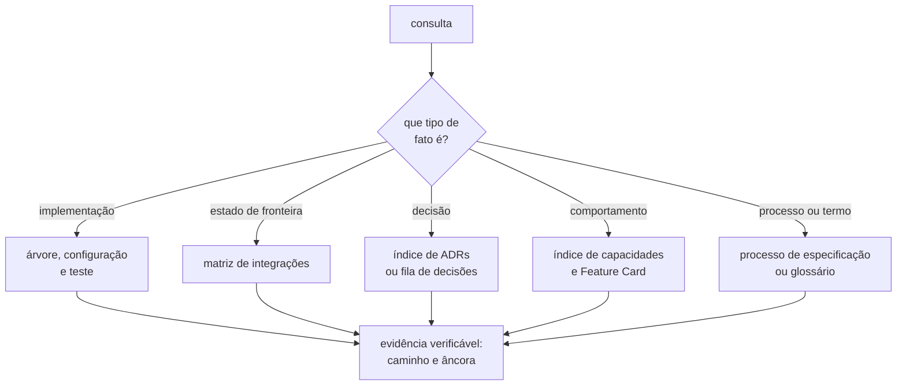

# Documentação

**Este arquivo é o roteador documental do repositório.** Ele responde a uma pergunta só:
qual documento é dono do fato que você procura, e em que âncora.

Ele **NÃO DEVE** conter estado, inventário, contagem, racional nem afirmação sobre o que
está implementado. Cada um desses tem um dono nomeado abaixo, e uma segunda cópia
envelhece em silêncio.

**O roteamento documental vive num arquivo só, e é este.** Ele já existiu em três lugares
— aqui, no [`README.md`](../README.md) da raiz e no [`AGENTS.md`](../AGENTS.md) —, e três
mapas divergem sem que ninguém perceba, porque cada um envelhece por conta própria.

Os guardrails que valem antes de qualquer consulta estão no
[`AGENTS.md` da raiz](../AGENTS.md#ao-trabalhar-aqui). As regras de quem **edita** esta
pasta estão no [`AGENTS.md` daqui](AGENTS.md).

## Precedência de consulta

Uma consulta alcança o documento dono em no máximo dois saltos: esta tabela, e o índice
que ela nomeia. A terceira coluna diz o que aquele documento **não** prova.

| Você procura por                      | Documento dono                                                                                    | Limite da inferência                                           |
|---------------------------------------|---------------------------------------------------------------------------------------------------|----------------------------------------------------------------|
| o que existe e executa                | a árvore versionada, `pom.xml`, `compose.yaml`, `frontend/package.json` e os testes               | configuração prova presença, e não funcionamento               |
| o estado de uma fronteira de processo | [matriz de integrações](architecture/integrations.md#matriz)                                      | abra a evidência primária citada antes de concluir             |
| a forma de tabela dos dois schemas    | [schemas/](architecture/schemas/README.md#os-dois-esquemas-e-a-fronteira-que-eles-não-atravessam) | não cobre `lab_journal`; forma decidida não é migração escrita |
| a decisão arquitetural vigente        | [índice de ADRs](adr/README.md#índice)                                                            | plano e auditoria não substituem decisão aceita                |
| a decisão ainda aberta                | [fila de decisões](fila-de-decisoes.md#o-que-esta-fila-enfileira)                                 | não feche a lacuna por inferência                              |
| o comportamento de uma capacidade     | [índice de capacidades](features/README.md#índice)                                                | regra `pendente` não é comportamento aprovado                  |
| se algo merece ADR                    | [critérios do índice](adr/README.md#uma-decisão-merece-adr-quando)                                | o artefato é escolhido depois da decisão, nunca antes          |
| como alterar um ADR aceito            | [revogação da imutabilidade](adr/README.md#a-revogação-da-imutabilidade-decidida-em-2026-08-07)   | nenhuma forma além das listadas lá é permitida                 |
| como citar a série antiga             | [duas séries](adr/README.md#duas-séries-e-como-citá-las)                                          | sem o prefixo `arquivo/` a referência é ambígua                |
| processo, artefato e aprovação        | [processo de especificação](specification-process.md#a-decisão-vem-antes-do-artefato)             | skill não altera o lifecycle                                   |
| o vocabulário vigente                 | [glossário de domínio](CONTEXT.md#linguagem)                                                      | termo em disputa não é vocabulário vigente                     |
| uma questão encaminhada               | [índice de questões](questions/README.md#índice)                                                  | `Q-INT-*` tem outro dono, e é a matriz                         |
| uma pergunta de integração            | [perguntas da matriz](architecture/integrations.md#perguntas-em-aberto)                           | ela **NÃO DEVE** entrar no índice de questões                  |
| um contrato formal entre processos    | [contratos](contracts/README.md#estado-nenhum-contrato-existe)                                    | um contrato nasce com a interface, nunca antes dela            |
| taxonomia, pedagogia e roadmap        | [plano do laboratório](plano-do-laboratorio.md#3-taxonomia-refinada)                              | o plano não decide nada; ele define o que precisa ser decidido |
| o limite de tamanho de um artefato    | `.claude/skills/feature-planning/scripts/check_artifact_limits.py`                                | nenhum número citado de memória vale; rode o script            |
| um desenho de schema ainda em debate  | [propostas de modelo de dados](propostas/modelo-de-dados/README.md#índice)                        | proposta não é decisão, e assumir não é decidir                |

## O que vive em cada caminho

| Caminho                    | O que vive ali                                     |
|----------------------------|----------------------------------------------------|
| `plano-do-laboratorio.md`  | a análise que origina as decisões; não decide nada |
| `specification-process.md` | o processo: papel, gatilho e aprovação de artefato |
| `CONTEXT.md`               | glossário canônico do vocabulário vigente          |
| `features/`                | comportamento de cada capacidade especificada      |
| `contracts/`               | contrato formal entre processos, quando existir    |
| `architecture/`            | a matriz das fronteiras e a forma dos schemas      |
| `adr/`                     | as decisões arquiteturais duráveis, e a fila       |
| `questions/`               | uma questão encaminhada por arquivo                |
| `audits/`                  | auditoria datada; recomendação, e nunca decisão    |
| `adr/arquivo/`             | a primeira série, preservada e nunca editada       |
| `diagrams/`                | o que o Mermaid não expressa, em `.excalidraw.svg` |

**Uma auditoria não vale como decisão.** Ela levanta achado e propõe plano; o que dela
vira regra passa pelo [processo](specification-process.md#a-decisão-vem-antes-do-artefato)
como qualquer outra decisão, e uma pergunta que ela abre não tem regra de transporte
decidida — o caso está em
[origem nova](questions/README.md#origem-nova-e-o-que-ainda-não-tem-regra).

## O que este arquivo deixou de responder

Cada linha abaixo já foi prosa daqui, e saiu porque tem dono. Consultar o dono é o
primeiro salto, e não o segundo.

| Fato que já viveu aqui                        | Dono atual                                                                                                     |
|-----------------------------------------------|----------------------------------------------------------------------------------------------------------------|
| o que está implementado                       | a árvore, e a [matriz](architecture/integrations.md#matriz)                                                    |
| quais capacidades existem, e o estado         | [índice de capacidades](features/README.md#índice)                                                             |
| onde cada tipo de pergunta em aberto vive     | [índice de questões](questions/README.md#de-onde-uma-questão-vem)                                              |
| as duas séries de ADR, e como citá-las        | [`adr/README.md`](adr/README.md#duas-séries-e-como-citá-las)                                                   |
| por que o ADR deixou de ser a forma principal | [processo](specification-process.md#a-decisão-vem-antes-do-artefato)                                           |
| as convenções de escrita                      | [`AGENTS.md` da raiz](../AGENTS.md#convenções-gerais-de-escrita) e [`adr/README.md`](adr/README.md#convenções) |
