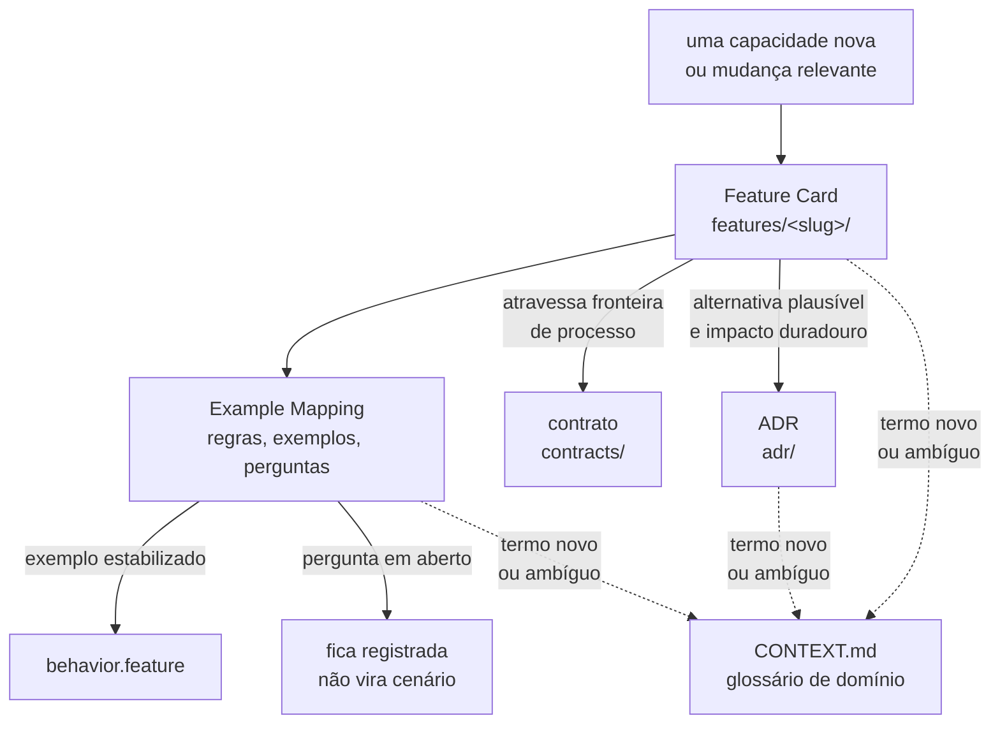

# Documentação

Mapa da pasta `docs/`. Tudo que existe neste repositório vive aqui — não há código.

## Em que ordem ler

1. [`plano-do-laboratorio.md`](plano-do-laboratorio.md) — taxonomia dos 42 fenômenos,
   dependências pedagógicas, roadmap de doze etapas, MVP, arquitetura mínima e decisões
   adiadas. **Ele não decide nada**: é a análise que define quais decisões precisam ser
   tomadas e em que ordem.
2. [`specification-process.md`](specification-process.md) — como uma funcionalidade é
   especificada, e qual artefato responde a quê.
3. [`features/README.md`](features/README.md) — as capacidades, em Feature Card, Example
   Mapping e Gherkin.
4. [`architecture/integrations.md`](architecture/integrations.md) — o que atravessa uma
   fronteira de processo, separando fato de hipótese.
5. [`adr/README.md`](adr/README.md) — o processo de decisão e a fila do que precisa ser
   decidido.
6. [`questions/README.md`](questions/README.md) — as questões encaminhadas de um ADR
   para outro, uma por arquivo, com status `pendente` ou `resolvida por ADR-NNNN`.
7. [`adr/arquivo/README.md`](adr/arquivo/README.md) — por que a primeira série foi
   arquivada e o que sobreviveu dela.

## O que vive em cada diretório

| Caminho                    | Conteúdo                                     | Estado                                         |
|----------------------------|----------------------------------------------|------------------------------------------------|
| `plano-do-laboratorio.md`  | a análise que origina as decisões            | escrito, 13 seções                             |
| `specification-process.md` | o processo de especificação                  | adotado em 2026-08-01                          |
| `CONTEXT.md`               | glossário de domínio, linguagem ubíqua       | **não existe** — nenhum termo em disputa ainda |
| `features/`                | Feature Cards, Example Mappings e `.feature` | quatro capacidades                             |
| `contracts/`               | OpenAPI, AsyncAPI, JSON Schema               | **vazio** — nenhuma interface existe           |
| `architecture/`            | a matriz de integrações                      | uma integração real, e ela está quebrada       |
| `adr/`                     | série corrente de ADRs                       | quatro, todos `Aceito`: 0001 a 0004            |
| `questions/`               | questões encaminhadas de um ADR para outro   | dezoito, um arquivo por questão                |
| `adr/arquivo/`             | primeira série, arquivada                    | treze, nenhum aceito, **nunca editados**       |
| `diagrams/`                | Excalidraw exportado como `.excalidraw.svg`  | vazio                                          |

## Como o planejamento funciona

Desde 2026-08-01 o ADR deixou de ser a forma principal de documentação:

> **O ADR guarda o porquê da escolha. O Feature Card guarda o quê do comportamento.**

O motivo está medido em [`specification-process.md`](specification-process.md): os ADRs
passaram a carregar decisão arquitetural, regra de negócio e tabela de decisão no mesmo
arquivo, e só a primeira é decisão.

## Estado da especificação

Quatro capacidades especificadas, **nenhuma implementada**:

| Capacidade                                                                                    | Cobre                                                 | Origem   |
|-----------------------------------------------------------------------------------------------|-------------------------------------------------------|----------|
| [`observacao-passo-a-passo`](features/observacao-passo-a-passo/feature-card.md)               | passos, fronteiras, log, prova de equivalência        | ADR-0001 |
| [`execucao-de-experimento`](features/execucao-de-experimento/feature-card.md)                 | o ciclo de quatro execuções e a classificação do zero | ADR-0004 |
| [`deteccao-de-atualizacao-perdida`](features/deteccao-de-atualizacao-perdida/feature-card.md) | E1 e E3, o oráculo exato do contador                  | ADR-0002 |
| [`deteccao-de-protecao-inerte`](features/deteccao-de-protecao-inerte/feature-card.md)         | E5, o oráculo do predicado de capacidade              | ADR-0002 |

O **E4** é capacidade conhecida **sem** card: o veredito em formato curva não tem forma
decidida, e um card agora seria majoritariamente pergunta em aberto.

Os `.feature` são especificação viva. Cada cenário está marcado `@teste-ausente`, porque
não há código para testá-lo.

## Onde as perguntas em aberto vivem

Elas estão em três lugares, e a distinção importa:

| Lugar                                    | O que guarda                                                                |
|------------------------------------------|-----------------------------------------------------------------------------|
| `questions/`, um arquivo por `Q-NNNN-K`  | questões transportadas de um ADR aceito para outro, já identificado na fila |
| `adr/NNNN-*.md`, `## Questões em aberto` | questões vivas de um ADR ainda `Proposto`                                   |
| `features/<slug>/example-mapping.md`     | perguntas levantadas no refinamento da capacidade                           |

**Cite uma questão encaminhada pelo identificador `Q-NNNN-K`**, nunca por "a questão K do
ADR-NNNN" — aquela seção deixa de existir quando o ADR é aceito.

## Duas séries de ADR

A numeração foi reiniciada em 2026-07-28. Um mesmo número existe nas duas séries.

| Forma de citar | Onde vive                               | O que é                   |
|----------------|-----------------------------------------|---------------------------|
| `ADR-0001`     | [`adr/`](adr/README.md)                 | série corrente            |
| `arquivo/0001` | [`adr/arquivo/`](adr/arquivo/README.md) | primeira série, arquivada |

**Use sempre o prefixo `arquivo/` ao citar a série antiga.** Sem ele a referência é
ambígua.

## Convenções de escrita

Valem em todo documento desta pasta: português do Brasil com acentuação correta, voz
ativa, uma ideia por frase, linhas quebradas em ~88 colunas, requisito normativo em RFC
2119 traduzida (`DEVE`, `NÃO DEVE`, `DEVERIA`, `PODE`), sem emojis e sem linguagem de
marketing. A lista de palavras proibidas está em [`adr/README.md`](adr/README.md).

Todo fluxo descrito em prosa vai **também** como diagrama Mermaid, junto do parágrafo que
o descreve.

As instruções operacionais para quem edita aqui estão em [`AGENTS.md`](AGENTS.md).
