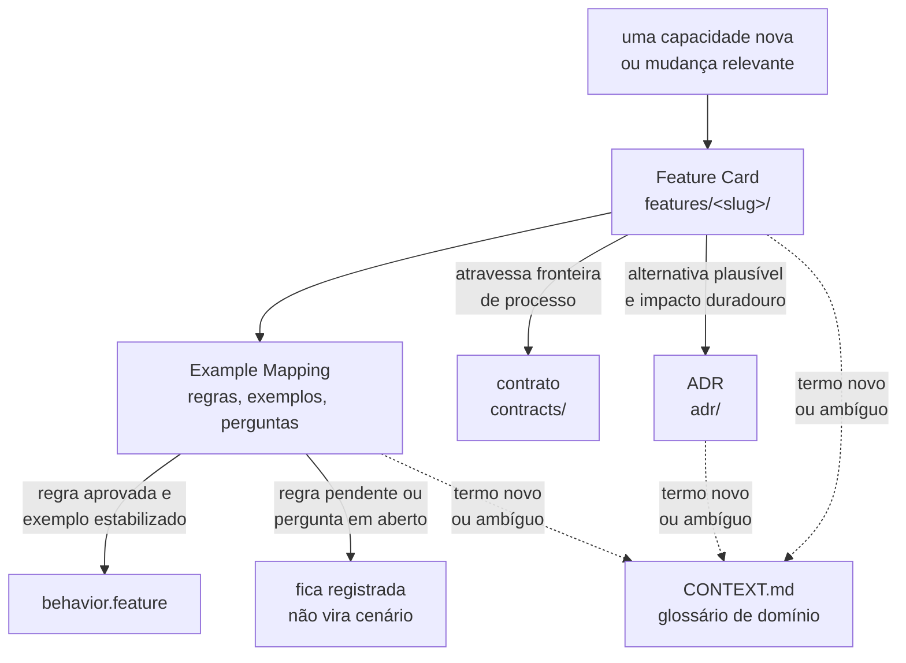

# Documentação

Mapa da pasta `docs/`. O repositório tem um esqueleto executável — `pom.xml` na raiz,
quatro módulos Maven, `compose.yaml`, `frontend/`, `local/` e dois workflows em
`.github/workflows/` — e **nenhum fenômeno ou capacidade implementado**. A árvore
versionada prova o que existe; esta pasta guarda o que foi decidido e o que segue
aberto.

## Em que ordem ler

1. [`plano-do-laboratorio.md`](plano-do-laboratorio.md) — a taxonomia dos itens do
   briefing, as dependências pedagógicas, o roadmap, o MVP e as decisões adiadas.
   **Ele não decide nada**: é a análise que define quais decisões precisam ser tomadas e
   em que ordem.
2. [`specification-process.md`](specification-process.md) — como uma funcionalidade é
   especificada, e qual artefato responde a quê.
3. [`CONTEXT.md`](CONTEXT.md) — o glossário canônico: qual termo vale, e o que ele
   significa aqui.
4. [`features/README.md`](features/README.md) — as capacidades, em Feature Card e
   Example Mapping.
5. [`architecture/integrations.md`](architecture/integrations.md) — o que atravessa uma
   fronteira de processo, e em que estado cada travessia está.
6. [`adr/README.md`](adr/README.md) — o processo de decisão e a fila do que precisa ser
   decidido.
7. [`questions/README.md`](questions/README.md) — as questões encaminhadas de um ADR
   para outro, uma por arquivo.
8. [`adr/arquivo/README.md`](adr/arquivo/README.md) — por que a primeira série foi
   arquivada e o que sobreviveu dela.

## O que vive em cada diretório

| Caminho                    | O que vive ali                                     |
|----------------------------|----------------------------------------------------|
| `plano-do-laboratorio.md`  | a análise que origina as decisões; não decide nada |
| `specification-process.md` | o processo: papel, gatilho e aprovação de artefato |
| `CONTEXT.md`               | glossário canônico do vocabulário vigente          |
| `features/`                | comportamento de cada capacidade especificada      |
| `contracts/`               | contrato formal entre processos, quando existir    |
| `architecture/`            | a matriz das fronteiras de processo e seu estado   |
| `adr/`                     | as decisões arquiteturais duráveis, e a fila       |
| `questions/`               | uma questão encaminhada por arquivo                |
| `adr/arquivo/`             | a primeira série, preservada e nunca editada       |
| `diagrams/`                | o que o Mermaid não expressa, em `.excalidraw.svg` |

**Esta página não conta nada.** Quantidade e estado envelhecem em silêncio quando são
copiados, e cada um tem um índice dono: as capacidades em
[`features/README.md`](features/README.md#índice), os ADRs em
[`adr/README.md`](adr/README.md#índice), as questões em
[`questions/README.md`](questions/README.md#índice), os contratos e seus gatilhos em
[`contracts/README.md`](contracts/README.md), e o estado de cada fronteira de processo
em [`architecture/integrations.md`](architecture/integrations.md#matriz).

## Como o planejamento funciona

Desde 2026-08-01 o ADR deixou de ser a forma principal de documentação:

> **O ADR guarda o porquê da escolha. O Feature Card guarda o quê do comportamento.**

O motivo está medido em [`specification-process.md`](specification-process.md): os ADRs
passaram a carregar decisão arquitetural, regra de negócio e tabela de decisão no mesmo
arquivo, e só a primeira é decisão.

## Estado da especificação

As capacidades já especificadas, o que cada uma cobre e o ADR que a originou estão em
[`features/README.md`](features/README.md#índice), que também registra qual capacidade é
conhecida e **não** tem card. **Nenhuma delas está implementada.**

**Os `.feature` que existem não são especificação viva.** Enquanto nenhuma regra tiver a
coluna `Aprovada por` preenchida, eles não descrevem comportamento aprovado: o
[processo](specification-process.md#quem-aprova-o-que-decidido-em-2026-08-05) proíbe
Gherkin sobre regra pendente, e aprova-se a regra, nunca o card. Os arquivos permanecem
na árvore como **inativos** — não são apagados nem migrados —, e nenhum deles vira teste
antes de uma pessoa aprovar a regra que o sustenta.

## Onde as perguntas em aberto vivem

Elas estão em três lugares, e a distinção importa:

| Lugar                                    | O que guarda                                       |
|------------------------------------------|----------------------------------------------------|
| `questions/`, um arquivo por questão     | questões transportadas de um ADR aceito para outro |
| `adr/NNNN-*.md`, `## Questões em aberto` | questões vivas de um ADR ainda `Proposto`          |
| `features/<slug>/example-mapping.md`     | perguntas levantadas no refinamento da capacidade  |

**Use e cite o identificador definido no
[índice de questões](questions/README.md#identificador)**, nunca "a questão K do
ADR-NNNN" — aquela seção deixa de existir quando o ADR é aceito. O índice é o dono da
regra: ele define o formato das questões novas e mantém o legado congelado ao lado dele.

## Duas séries de ADR

A numeração foi reiniciada em 2026-07-28. Um mesmo número existe nas duas séries.

| Forma de citar | Onde vive                               | O que é                   |
|----------------|-----------------------------------------|---------------------------|
| `ADR-0001`     | [`adr/`](adr/README.md)                 | série corrente            |
| `arquivo/0001` | [`adr/arquivo/`](adr/arquivo/README.md) | primeira série, arquivada |

**Use sempre o prefixo `arquivo/` ao citar a série antiga.** Sem ele a referência é
ambígua.

## Convenções de escrita

Valem em todo documento desta pasta: português do Brasil com acentuação correta, voz
ativa, uma ideia por frase, linhas quebradas em ~88 colunas, requisito normativo em RFC
2119 traduzida (`DEVE`, `NÃO DEVE`, `DEVERIA`, `PODE`), sem emojis e sem linguagem de
marketing. A lista de palavras proibidas está em [`adr/README.md`](adr/README.md).

Todo fluxo descrito em prosa vai **também** como diagrama Mermaid, junto do parágrafo que
o descreve.

As instruções operacionais para quem edita aqui estão em [`AGENTS.md`](AGENTS.md).
