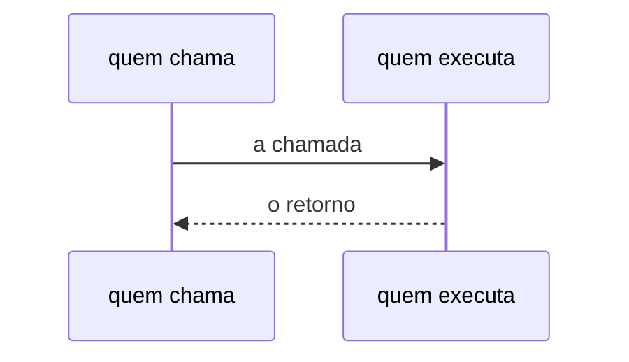

# ADR-0000: Título curto no imperativo

- **Estado:** Proposto
- **Data:** AAAA-MM-DD
- **Etapa do roadmap:** N
- **Relacionado:** ADR-NNNN, ADR-NNNN

## Contexto

Descreva a situação. Use fatos, não opiniões. Diga o que já existe e o que restringe a
decisão. Não descreva a solução aqui.

## Problema

Diga qual pergunta precisa de resposta. Se o problema tiver forças em conflito, liste as
forças. Uma força por linha.

## Decisão

Diga o que foi decidido. Use voz ativa e presente. Exemplo: "O laboratório usa X."
Não use "vamos usar" nem "seria bom usar".

Esta seção carrega apenas o **quê**. Não coloque aqui o porquê, o histórico nem a
comparação com alternativas — cada um tem sua própria seção.

Para requisito normativo, use as palavras-chave da RFC 2119 traduzidas, em caixa alta:
`DEVE`, `NÃO DEVE`, `DEVERIA`, `NÃO DEVERIA`, `PODE`. A caixa alta separa o requisito da
prosa. Use-as só para requisito real, nunca como ênfase.

`DEVE` e `DEVERIA` não são sinônimos. `DEVE` marca o que a plataforma rejeita ou impede;
`DEVERIA` marca a recomendação que alguém PODE contrariar com motivo. Se a diferença
entre as duas não estiver clara na frase, reescreva a frase.

Todo fluxo descrito aqui vai também como diagrama Mermaid, num bloco `mermaid` junto do
parágrafo que o descreve. Use `sequenceDiagram` para troca de chamadas e ordem no tempo,
e `flowchart` para topologia e hierarquia.

## Justificativa

Diga por que esta decisão foi tomada. Amarre cada motivo a uma força, a uma restrição ou
a um fato que apareceu no Contexto e no Problema.

Um parágrafo por motivo, começando por **Por que ...**. Um motivo que não se ligue a
nada do Contexto é preferência, não justificativa.

## Consequências

### Positivas

- O que fica mais fácil.

### Negativas

- O que fica mais difícil. Toda decisão tem custo. Se você não achar o custo, você não
  entendeu a decisão.

### Neutras

- O que muda sem ser melhor nem pior.

## Trade-offs

Uma linha por par, no formato: o benefício **X** foi aceito em troca do custo **Y**.

Cada par liga uma Positiva a uma Negativa da seção anterior. Uma lista de vantagens e
uma lista de desvantagens não substituem o par — elas dizem o que aconteceu, e o par diz
o que foi trocado pelo quê. Um ADR sem trade-off explícito é propaganda.

## Alternativas consideradas

### Alternativa A

Descreva a alternativa. Diga por que ela foi descartada. O motivo precisa ser técnico,
não estético.

Se a alternativa tiver um argumento legítimo a favor, reconheça-o antes de mostrar por
que ela perde. Não construa espantalhos.

### Alternativa B

Idem.

## Quando esta decisão deixa de valer

Descreva o sinal que indica que a decisão precisa ser revista. Se você não conseguir
descrever o sinal, a decisão é permanente — e isso é raro.

## Questões em aberto

Sempre a última seção. Começa por uma tabela-resumo, seguida de uma subseção por
questão, com o argumento inteiro.

| # | Questão             | Status                                              |
|---|---------------------|-----------------------------------------------------|
| 1 | resumo em uma linha | aberto (crítico) / aberto / encaminhado / resolvida |

O critério do status: `aberto (crítico)` marca a questão que produz resultado falso sem
que nenhum teste falhe; `encaminhado` marca a questão que pertence a outro ADR já
identificado; `resolvida` marca a questão fechada durante o debate por algo que não é
decisão deste ADR — convenção de processo, por exemplo — e a subseção dela DEVE nomear
onde a resolução está; `aberto` marca o restante.

Apenas `aberto` e `aberto (crítico)` bloqueiam a aceitação. O que acontece com cada
status no ato da aceitação está em [`README.md`](README.md), seção
`## Processo de debate`.

### 1. Título da questão

O argumento completo. Uma lacuna vira questão aqui — nunca um fato plausível no corpo do
documento.
