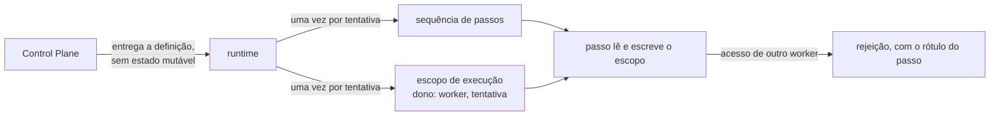
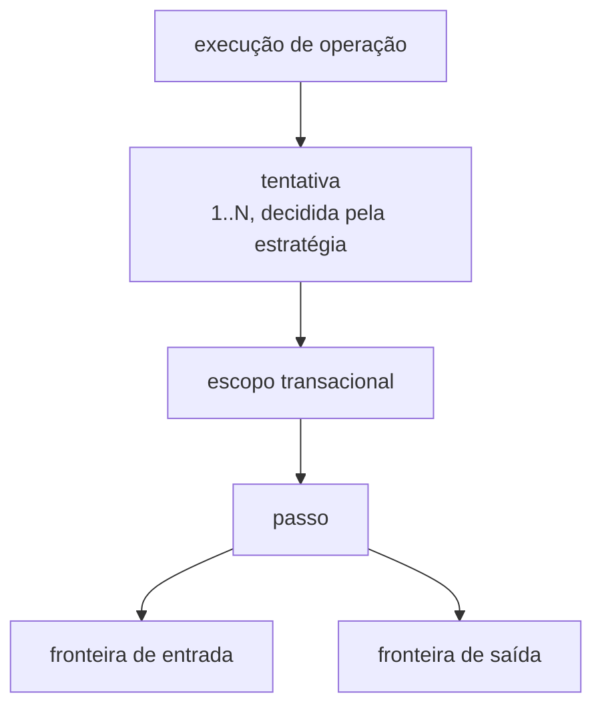
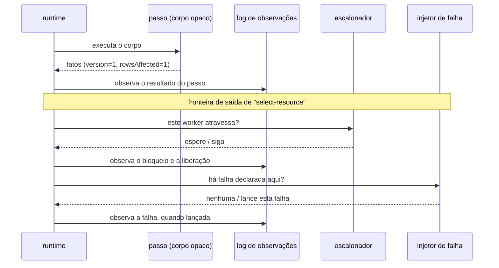
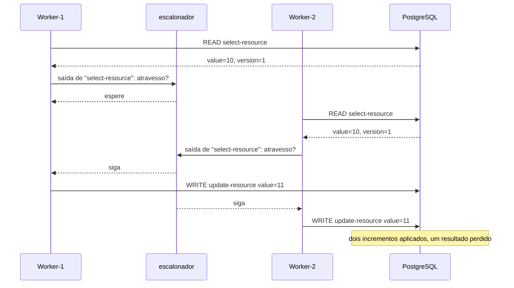
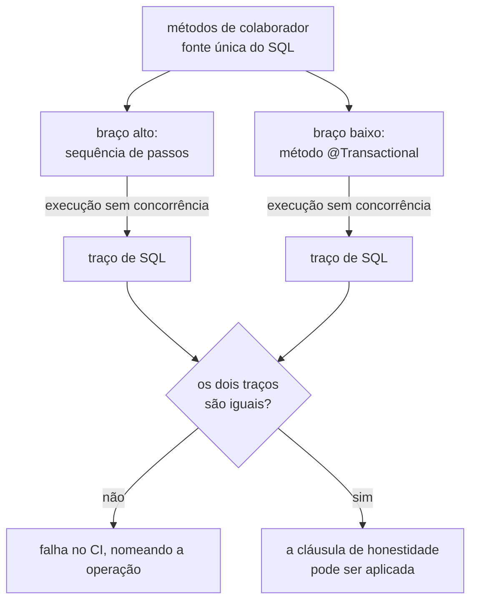

# ADR-0001: O passo como unidade de execução, observação e injeção de falha

- **Estado:** Aceito
- **Data:** 2026-07-28
- **Aceito em:** 2026-07-29
- **Etapa do roadmap:** 1
- **Relacionado:** primeiro ADR aceito da série corrente. Substitui em intenção o
  impasse do `arquivo/0012`. Referencia a regra 6 do `arquivo/0006`. Deixa uma ponta
  para cinco decisões da fila: o domínio mínimo, a linguagem do agendamento, a forma do
  escalonador, as estratégias de concorrência e o log de observações.
- **Questões encaminhadas:** [`Q-0001-1`](../questions/Q-0001-1.md) a
  [`Q-0001-4`](../questions/Q-0001-4.md), em
  [`README.md`](README.md#questões-encaminhadas). A quinta questão do debate foi
  resolvida em 2026-07-29 pela emenda à convenção de aceitação, nas seções `## Processo
  de debate` e `## Questões encaminhadas` daquele arquivo.

## Vocabulário

Este documento cria três termos e pressupõe outros três. Os seis aparecem no restante do
texto sem nova definição.

Termos que este ADR define:

- **passo** — uma unidade nomeada de trabalho do sistema sob teste. O corpo é opaco ao
  runtime.
- **tentativa** — uma passagem completa pela sequência de passos. Uma execução de
  operação produz uma ou mais tentativas.
- **fronteira** — o instante da execução em que o controle está com o runtime, e não com
  o corpo do passo. Cada passo tem duas: a de entrada e a de saída.

Termos que este ADR pressupõe, e não decide:

- **escalonador** — o componente do Lab Plane que decide, em cada fronteira, se o worker
  que chegou ali prossegue ou espera.
- **barreira** — a instrução "pare nesta fronteira", declarada pelo experimento.
- **injetor de falha** — o componente do Lab Plane que decide se uma falha declarada
  dispara naquela fronteira.

A fronteira é o lugar, a barreira é a instrução, e o escalonador decide quando a
instrução é levantada.

Neste documento, "escalonador" sem qualificação é sempre o do laboratório. O escalonador
do sistema operacional aparece qualificado por extenso, e decide outra coisa: qual
thread ganha CPU.

## Contexto

O repositório não tem código. O [plano do laboratório](../plano-do-laboratorio.md), na
seção 2, identifica esta como a primeira decisão da fila. Toda decisão seguinte herda a
forma escolhida aqui: o formato da timeline, os pontos de injeção de falha, o mecanismo
de barreira e a viabilidade do replay determinístico.

Três exigências do briefing incidem sobre o mesmo lugar.

**Barreiras determinísticas (cenário 25).** O experimento E2 do MVP precisa produzir a
intercalação `W1.READ → W2.READ → W1.WRITE → W2.WRITE` em toda execução. Para pausar o
W1 entre a leitura e a escrita, alguém precisa deter o controle entre as duas.

**Injeção de falha em ponto nomeado.** O briefing lista doze pontos: `BEFORE_READ`,
`AFTER_READ`, `BEFORE_WRITE`, `AFTER_WRITE`, `BEFORE_COMMIT`, `AFTER_COMMIT`,
`BEFORE_PUBLISH`, `AFTER_PUBLISH`, `BEFORE_CONSUME`, `AFTER_CONSUME`, `BEFORE_ACK`,
`AFTER_ACK`. A definição de um experimento precisa referenciar esses pontos antes de
qualquer execução.

**A timeline.** O briefing quer ver `12:01:00.100 Worker-1 READ resource=42 version=1`.
Isso é um registro por passo, com o instante em que o passo terminou.

Duas restrições limitam as respostas possíveis. A regra 6 do `arquivo/0006` proíbe o
Control Plane de importar o Lab Plane. O MVP inteiro roda numa JVM só. Sem fronteira
física entre os dois planos, apenas uma regra executável verifica essa separação.

## Problema

Um método Java executa do começo ao fim sem devolver o controle. Entre a linha que lê e
a linha que grava não existe nada — nenhum lugar onde pausar, falhar ou registrar.

A pergunta é: **qual é a forma de uma operação, tal que exista uma fronteira observável
e controlável entre dois passos consecutivos, sem que o sistema sob teste passe a conter
o instrumento que o mede?**

As forças em conflito:

- Fidelidade. Quanto mais a operação se parecer com o código que um engenheiro
  escreveria, mais o resultado significa alguma coisa.
- Controle. Quanto mais fronteiras o runtime dominar, mais determinística é a
  reprodução.
- Separação. Um bug do instrumento não pode virar um resultado de consistência.
- Inspecionabilidade. A UI e a definição versionada do experimento precisam nomear um
  ponto de barreira **antes** de executar a operação uma primeira vez.

## Decisão

Uma operação é uma **sequência ordenada e finita de passos nomeados**. O runtime do
laboratório constrói a sequência a cada execução e executa os passos. O runtime chama o
passo. O passo NÃO DEVE chamar o runtime.

O esboço abaixo é ilustrativo. Ele fixa a forma, não a API:

```
operação increment(resourceId):
  escopo transacional {
    READ     rótulo "select-resource"  → SELECT value, version FROM resource WHERE id = ?
    COMPUTE  rótulo "increment"        → value + 1
    WRITE    rótulo "update-resource"  → UPDATE resource SET value = ?, version = version + 1 ...
  }
```

Cada passo carrega três coisas:

- um **rótulo**, único dentro da operação;
- um **tipo**, de um conjunto fechado que o runtime entende: `READ`, `COMPUTE`,
  `WRITE`, e adiante `PUBLISH`, `CONSUME`, `ACK`;
- um **corpo opaco**, que o runtime executa sem inspecionar.

O corpo é código Java comum. Ele executa SQL real, numa transação real, num PostgreSQL
real. O runtime NÃO DEVE gerar, interpretar ou analisar o SQL.

### A definição de operação é uma fábrica, e o runtime é dono do ciclo de vida

O Control Plane NÃO DEVE entregar ao runtime uma instância de operação. Ele entrega uma
**definição**, cujo único trabalho é montar a sequência de passos. O runtime chama a
definição uma vez por tentativa, e cria ele mesmo o escopo de execução daquela
tentativa. O estado intermediário entre passos vive nesse escopo, e em nenhum outro
lugar.

Três camadas protegem essa construção, e cada uma age num momento diferente:

1. **A forma.** Uma definição de operação NÃO DEVE guardar estado mutável. O escopo de
   execução é criado pelo runtime, nunca pela definição.
2. **A análise estática.** Um teste executável DEVE rejeitar campo não final, campo de
   tipo mutável e `static` mutável nas classes de definição de operação.
3. **A posse em execução.** Todo escopo de execução carrega a identidade do worker e o
   número da tentativa. O runtime DEVE rejeitar o acesso vindo de outro worker, e a
   rejeição DEVE nomear o passo em que ocorreu.



A camada 1 existe para que a camada 2 tenha o que exigir. Sem ela, estado mutável na
definição é legítimo, e nenhuma regra pode proibi-lo sem proibir o que é normal. A
camada 3 pega em execução o que as duas primeiras não enxergam na estrutura, e é a única
que aponta o passo culpado.

### A tentativa é a unidade de sequência

A sequência de passos é a **tentativa**, não a operação. Uma execução de operação produz
uma ou mais tentativas. Ao fim de uma tentativa malsucedida, o runtime pergunta se há
outra. A estratégia de concorrência responde, e ela tem ADR próprio na fila. O runtime
recebe apenas "sim" ou "não".

A hierarquia completa:



### A fronteira

Cada passo é cercado por duas fronteiras endereçáveis: a de entrada e a de saída. O
endereço canônico de uma fronteira é a tripla **(rótulo do passo, entrada|saída, seletor
de tentativa)**.

Os doze pontos do briefing são a convenção de nomenclatura da parte (rótulo,
entrada|saída), válida quando o tipo é único na operação. `BEFORE_READ` é a fronteira de
entrada do único passo de tipo `READ`. Quando o tipo aparece mais de uma vez, a
plataforma DEVE rejeitar o nome abreviado, em vez de escolher um dos passos.

O seletor de tentativa NÃO DEVE ter valor padrão. A plataforma DEVE rejeitar uma
definição que diga apenas `AFTER_READ`, em qualquer operação que possa tentar mais de
uma vez.

A plataforma DEVE recusar um endereço de fronteira que não resolva para nenhum passo da
operação. Um rótulo renomeado faz o experimento antigo parar de executar, e a parada é
ruidosa por decisão. O que a resolução de endereço NÃO cobre é a mudança do corpo de um
passo com o rótulo intacto: ali o replay executa e mede outra operação em silêncio. Ver
[`Q-0001-1`](../questions/Q-0001-1.md).

Em cada fronteira o runtime faz duas coisas, **nesta ordem**:

1. consulta o escalonador, e bloqueia a thread do worker se houver barreira;
2. consulta o injetor de falha, e falha se houver falha declarada ali.



O E2 do MVP é este mecanismo aplicado a dois workers. O escalonador segura o W1 na
fronteira de saída da leitura até que o W2 leia o mesmo valor:



### A observação

A observação não é o terceiro ato da fronteira. O runtime a emite **no instante em que
cada evento ocorre**:

- o runtime observa o resultado de um passo quando o passo termina, antes de consultar a
  fronteira de saída;
- o runtime observa o bloqueio e a liberação numa barreira quando eles acontecem;
- o runtime observa a falha injetada quando a lança.

O passo reporta um conjunto de fatos (`version=1`, `rowsAffected=0`). O runtime registra
os fatos sem interpretá-los. Toda observação DEVE carregar o número da tentativa.

### A transação é demarcada através do Spring, não no lugar dele

O runtime abre o escopo transacional com `TransactionTemplate`. Os passos daquele escopo
rodam dentro do callback. Um escopo envolve uma sub-sequência contígua de passos de uma
tentativa.

`COMMIT` não é um passo que o runtime executa. `COMMIT` é o retorno do callback.
`BEFORE_COMMIT` é a última fronteira dentro do escopo. `AFTER_COMMIT` é a primeira
fronteira depois dele.

### A resolução é um eixo do experimento

`@Transactional` continua possível. Para o runtime, uma operação com demarcação
declarativa é uma sequência de **um passo só**: corpo opaco, nenhuma fronteira interna,
nenhuma barreira interna.

| Resolução | Forma                                                 | Fronteiras internas | Serve para                                       |
|-----------|-------------------------------------------------------|---------------------|--------------------------------------------------|
| alta      | sequência de passos, escopo por `TransactionTemplate` | todas               | E2, E5, injeção em ponto nomeado, timeline fina  |
| baixa     | método `@Transactional`                               | nenhuma             | E1, carga alta, o lado sem barreiras da cláusula |

O experimento escolhe a resolução. A plataforma não escolhe.

### A cláusula de honestidade

Toda anomalia reproduzida com barreiras DEVE aparecer **também** sem barreiras, sob
carga alta. Uma anomalia que apareça só com barreiras indica que o runtime fabricou o
fenômeno, e o experimento não vale.

A cláusula é obrigatória para todo experimento do laboratório. O E1 e o E2 do MVP a
exercitam primeiro.

### A equivalência entre as duas resoluções é provada por teste

A cláusula compara dois braços escritos em separado. A comparação só significa alguma
coisa se os dois braços forem a mesma operação. Duas regras sustentam isso.

Primeira: os corpos dos passos e o corpo do método `@Transactional` da mesma operação
DEVEM chamar os mesmos métodos de colaborador. A diferença entre as duas resoluções fica
na composição, e não no conteúdo de cada passo.

Segunda: um teste executável DEVE provar que as duas resoluções emitem o mesmo traço de
SQL, numa execução sem concorrência sobre o mesmo estado inicial. Enquanto esse teste
não existir para uma operação, a cláusula de honestidade NÃO DEVE ser considerada
satisfeita para ela.



A primeira regra reduz a superfície de divergência ao ponto de composição. A segunda
detecta o que sobra dela. A ordem entre as duas importa: sem a primeira, cada traço
divergente exigiria comparar dois corpos de SQL escritos à mão para descobrir qual dos
dois está errado.

O critério de igualdade entre dois traços não é decidido aqui. Ver
[`Q-0001-3`](../questions/Q-0001-3.md).

### O que este ADR não decide

**A linguagem do agendamento.** A decisão fixa que existe uma fronteira consultável e
como o experimento a endereça. A decisão não fixa como uma barreira é declarada — se
`W1.READ → W2.READ → W1.WRITE → W2.WRITE` é uma lista ordenada de endereços, uma máquina
de estados, ou outra coisa. É ADR próprio, já na fila, e ele depende deste.

**A forma do escalonador.** A decisão fixa que o runtime consulta o escalonador em cada
fronteira, e fixa a ordem dessa consulta. A decisão não fixa como o escalonador decide,
que estado ele guarda, nem como um worker que morreu o notifica. É ADR próprio, já na
fila, e [`Q-0001-4`](../questions/Q-0001-4.md) é a primeira entrada dele.

**Quando há outra tentativa.** O runtime pergunta; a estratégia responde. A política
pertence ao ADR de estratégias de concorrência.

**O critério de igualdade entre dois traços de SQL.** A decisão fixa que a prova de
equivalência existe e o que ela compara. A decisão não fixa a normalização: parâmetro
ligado como valor ou como marcador, ordem entre leituras independentes, e o conjunto de
entradas amostradas. Pertence ao ADR do domínio mínimo, já na fila.

Este documento registra as quatro ausências para que ninguém as leia como omissão.

## Justificativa

**Por que a sequência de passos.** As três exigências do Contexto pedem a mesma coisa:
uma fronteira observável e controlável entre dois passos consecutivos. Um método Java
linear não tem essa fronteira. A sequência de passos cria uma fronteira por construção,
e uma só, que serve à barreira, ao ponto de falha e à linha da timeline.

**Por que o corpo do passo é opaco.** O laboratório estuda SQL real sob concorrência
real. Um runtime que interpretasse o SQL passaria a ser o objeto de estudo. A opacidade
mantém o objeto de estudo do lado do sistema sob teste.

**Por que a definição de operação é uma fábrica.** A captura de estado compartilhado por
um passo não tem nome verificável: "este lambda alcança estado vivo além da tentativa"
não é uma consulta que uma ferramenta de análise saiba fazer. Entregar uma fábrica em
vez de uma instância move o estado mutável para dentro do runtime. O que sobra na
definição é campo de classe — que tem nome, e que uma regra executável sabe procurar. A
forma não detecta a falha; ela troca uma falha sem nome por uma falha com nome.

**Por que a posse do escopo é verificada em execução, e não só na estrutura.** A análise
estática vê a definição, e não vê por onde o corpo do passo alcança um objeto. A
verificação de posse não precisa enxergar o caminho: ela pergunta apenas se quem tocou o
escopo é o dono dele. É a única das três camadas que dá um endereço — o rótulo do passo
onde o acesso indevido ocorreu — em vez de um número plausível num relatório.

**Por que o traço de SQL, e não o estado final.** Comparar o estado final das duas
resoluções custa menos e não exige interceptador nenhum. A comparação de estado é cega
para a diferença que mais importa: um braço com `SELECT ... FOR UPDATE` e outro sem
produzem o mesmo estado final numa execução sem concorrência. Sob concorrência os dois
são experimentos diferentes, e é sob concorrência que a cláusula é aplicada. O traço
enxerga a cláusula de bloqueio porque ela está no texto do statement. Comparar traços
não é interpretar SQL: é igualdade de texto normalizado, e o runtime continua sem
entender o que executa. A alternativa D não volta pela porta dos fundos por esse
caminho.

**Por que os dois braços continuam escritos à mão.** Derivar o braço baixo do braço alto
fecharia a divergência por construção. Ele manteria o runtime dentro dos dois braços, e
um bug do runtime passaria a aparecer nos dois. A cláusula deixaria de medir o
instrumento e passaria a medir apenas o escalonador. O braço escrito à mão é também o
artefato pedagógico: sem ele, o laboratório perde o código que um engenheiro escreveria.

**Por que a tentativa, e não a operação, é a unidade de sequência.** A estratégia
`OPTIMISTIC` está no E3 e portanto no MVP: ela lê, calcula, grava e **repete** ao
conflitar. Uma sequência ordenada e finita não tem laço. Colocar o laço dentro do
runtime daria ao runtime estrutura de controle. O argumento que derruba a alternativa
D — o interpretador vira uma linguagem de programação pior que Java — passaria a valer
contra a própria decisão.

O ganho não para em evitar o laço. O número de tentativas vira um dado observável do
log. É a métrica que o E3 e o E4 precisam: retries por operação crescendo mais rápido
que linearmente sob contenção.

**Por que o seletor de tentativa não tem valor padrão.** As duas leituras plausíveis
medem coisas diferentes. Uma barreira que dispare em toda tentativa transforma um laço
de retry em impasse, com um agendamento escrito para uma passagem só. Uma falha injetada
apenas na primeira tentativa testa recuperação; injetada em todas, testa esgotamento. Um
padrão silencioso produziria experimentos que medem outra coisa sem avisar ninguém.

**Por que o escalonador é consultado antes do injetor.** Se a injeção viesse primeiro, o
worker morreria sem chegar à barreira. O escalonador esperaria para sempre por um worker
que já não existe. Injetar depois de liberar mantém a falha dentro da ordem declarada.

**Por que a observação sai no instante do evento.** A timeline exige isso. Se a
observação do `READ` saísse depois de a barreira liberar, a timeline mostraria o `READ`
do W1 acontecendo depois do `READ` do W2. O instrumento mentiria sobre a ordem que ele
mesmo impôs.

**Por que o `TransactionTemplate`, e não uma transação aberta pelo runtime.** O
`PlatformTransactionManager`, a propagação, o nível de isolamento configurado, os
recursos ligados à thread e as regras de rollback continuam valendo. O laboratório não
reimplementa nenhum deles, e o `SQLSTATE 40001` continua chegando pelo caminho do
Spring.

**Por que `COMMIT` não é um passo.** O commit é o retorno do callback, e tratá-lo assim
é mais fiel que um passo `COMMIT` explícito. Isso dá sentido exato à etapa 6: o commit
aconteceu, o callback retornou, e a falha injetada logo em seguida produz o dual write
sem publicação.

**Por que `@Transactional` sobrevive como eixo, e não como concessão.** O modelo não
precisa de uma segunda classe de operação — ele degenera para um passo só. A operação
declarativa não importa nada do Lab Plane: o runtime a chama como caixa-preta, e a regra
6 do `arquivo/0006` continua verde.

**Por que o eixo de resolução fortalece a cláusula de honestidade.** "A mesma anomalia
sem barreiras" significava apenas "a mesma sequência de passos com o escalonador
desligado". Com o eixo, a frase passa a poder significar "o mesmo fenômeno no código que
um engenheiro escreveria". A cláusula responde à força de fidelidade com uma execução,
não com um argumento escrito.

## Consequências

### Positivas

- As três exigências do briefing viram a mesma exigência, atendida uma vez. A barreira,
  o ponto de falha e a linha da timeline ocupam o mesmo lugar do código.
- O impasse do `arquivo/0012` deixa de existir. Aquele ADR escolhia entre interceptar
  dentro do processo (fiel, mas contamina), no broker (isolado, mas entra na medida de
  latência) ou na rede (puro, mas não produz duplicata semântica). Com o runtime
  dirigindo, a direção da dependência se inverte: a injeção fica dentro do processo, que
  é o modo fiel, e a regra 6 continua verde.
- `AFTER_COMMIT` fica exato. Como o commit é o retorno do callback do
  `TransactionTemplate`, existe um instante inequívoco em que a transação já terminou e
  nada mais aconteceu. É a fronteira de que a etapa 6 depende.
- A operação é inspecionável antes de executar. A UI lista os pontos de barreira de um
  experimento sem rodá-lo, e a definição versionada os referencia.
- Um experimento antigo que referencie um rótulo renomeado para de executar, em vez de
  resolver para outro passo. A quebra por renomeação é ruidosa.
- A timeline dispensa instrumentação adicional. Ela é a projeção direta do log de
  observações, que já existe porque a fronteira existe.
- Os doze pontos nomeados do briefing não custam código próprio. Não há doze ganchos
  para manter; há um mecanismo e uma convenção de nomes.
- O número de tentativas vira dado de primeira classe do log, sem nada a mais. A métrica
  central do E3 e do E4 é subproduto de a tentativa ser a unidade.
- A falha mais grave do instrumento — fabricar a anomalia que ele deveria medir — ganha
  guarda em três momentos distintos: ao escrever o código, no CI e em execução. Ela
  deixa de depender de alguém desconfiar de um número plausível num relatório.
- A cláusula de honestidade ganha pré-condição verificável. Antes de comparar dois
  vereditos, o laboratório prova no CI que os dois vieram da mesma operação. Sem essa
  prova a cláusula comparava dois experimentos e passava do mesmo jeito.

### Negativas

- **Três artefatos por operação em vez de um.** O eixo de resolução compra a resposta de
  fidelidade ao preço de escrever o experimento duas vezes, e a prova de equivalência é
  o terceiro artefato. Uma operação nova entra no laboratório mais cara.
- **O teste de equivalência fica acoplado ao SQL gerado.** Uma troca de versão da camada
  de persistência PODE alterar o texto do statement sem que a operação tenha mudado, e
  reprovar um par correto. A quebra é barulhenta, e não silenciosa — é o motivo de o
  acoplamento ser aceitável.
- **A prova de equivalência é por amostragem.** O teste cobre as entradas que ele
  executa. Uma divergência que só apareça fora delas continua invisível, e o conjunto
  amostrado ainda não foi definido. Ver [`Q-0001-3`](../questions/Q-0001-3.md).
- **O estado intermediário sai das variáveis locais.** O `value + 1` calculado no
  `COMPUTE` precisa chegar ao `WRITE` por um escopo de execução explícito. Esse escopo é
  mais verboso e mais fácil de errar que uma variável local — e o erro tem a forma de
  [`Q-0001-2`](../questions/Q-0001-2.md).
- **A operação em alta resolução não é o código que um engenheiro escreveria.** A regra
  pedagógica do repositório quer mostrar o problema no código real. A sequência de
  passos é uma tradução, e o leitor precisa fazer o mapeamento de volta. A forma de
  baixa resolução reduz o problema, sem eliminá-lo.
- O endereço da fronteira ganhou um terceiro componente obrigatório. Definições de
  experimento ficam mais verbosas, e declarar a tentativa incomoda em operações que
  nunca tentam duas vezes.
- **Renomear o rótulo de um passo invalida toda definição de experimento versionada que
  o referencie.** O rename deixa de ser uma edição local do código da operação.
- Duas fronteiras por passo em vez de uma. O endereçamento fica mais explícito, e dobra
  o número de endereços que um experimento pode referenciar. Parte deles não tem uso.
- **A verificação de posse entra no caminho quente.** Toda leitura e escrita do escopo
  paga uma comparação de identidade, e o grupo D mede latência sob saturação. Quanto
  isso custa só se sabe medindo.
- **A definição de operação perde estado próprio.** Nada de campo mutável, nada de valor
  pré-computado guardado entre execuções. Tudo que o passo precisa vem do escopo da
  tentativa ou de colaborador imutável, e toda operação ganha uma indireção de
  construção que uma instância direta não teria.
- **Uma rota de compartilhamento continua sem guarda.** As três camadas protegem o
  escopo entre passos, e não protegem o estado alcançado por colaborador injetado. Ver
  [`Q-0001-2`](../questions/Q-0001-2.md).
- O runtime vira código crítico do laboratório. Um bug nele contamina todos os
  experimentos ao mesmo tempo. A cláusula de honestidade cobre parte desses bugs, e não
  cobre a fabricação de anomalia dentro do escopo — para essa, as três camadas acima e o
  controle positivo de [`Q-0001-2`](../questions/Q-0001-2.md) são a defesa.

### Neutras

- O número de threads passa a ser função do número de workers, e o pool de conexões
  precisa ser maior que ele. O plano já exigia isso (seção 8); a decisão apenas torna a
  exigência estrutural.
- Todos os passos de uma tentativa rodam na mesma thread, dedicada ao worker. A
  transação e a conexão ficam ligadas a essa thread do início ao fim do escopo, e a
  barreira bloqueia essa thread com os locks de linha segurados. Esse bloqueio é
  desejado: é assim que contenção pessimista e deadlock são produzidos.
- Se essas threads são de plataforma ou virtuais é decisão da arquitetura mínima, não
  desta.

## Trade-offs

- O benefício **fronteira endereçável antes da primeira execução** foi aceito em troca
  do custo **a operação em alta resolução deixa de ser o código que um engenheiro
  escreveria**.
- O benefício **resposta executável à força de fidelidade** foi aceito em troca do custo
  **duas formas da mesma operação para escrever e manter**.
- O benefício **a divergência entre as duas resoluções falha no CI, e não em silêncio
  dentro de um veredito** foi aceito em troca do custo **o teste de equivalência fica
  acoplado ao SQL gerado, e quebra quando a camada de persistência muda de versão**.
- O benefício **a forma de baixa resolução continua sendo o código que um engenheiro
  escreveria, e a cláusula continua medindo o runtime** foi aceito em troca do custo
  **os dois braços permanecem escritos à mão, e nenhuma construção impede a divergência
  antes do teste**.
- O benefício **o experimento declara em qual tentativa a barreira dispara** foi aceito
  em troca do custo **todo endereço de fronteira fica mais verboso, inclusive nas
  operações que nunca tentam duas vezes**.
- O benefício **um rótulo renomeado quebra o experimento antigo de forma ruidosa, em vez
  de resolver para outro passo** foi aceito em troca do custo **renomear um passo
  invalida toda definição de experimento versionada que o referencie**.
- O benefício **infraestrutura transacional do Spring preservada sem reimplementação**
  foi aceito em troca do custo **`BEGIN` e `COMMIT` não são passos endereçáveis**.
- O benefício **o runtime enxerga o estado entre dois passos** foi aceito em troca do
  custo **o estado intermediário sai das variáveis locais para um escopo explícito**.
- O benefício **a captura de estado compartilhado vira propriedade nomeável e
  verificável no CI** foi aceito em troca do custo **a definição de operação perde
  estado próprio, e toda operação ganha uma indireção de construção**.
- O benefício **o acesso indevido ao escopo falha na hora, nomeando o passo** foi aceito
  em troca do custo **toda leitura e escrita de escopo paga uma verificação de posse,
  exatamente no caminho que o grupo D mede**.

## Alternativas consideradas

### Alternativa A — método Java linear, sem passos

A operação é um método `@Transactional` comum. As anomalias aparecem por concorrência
real, sob carga alta.

**Descartada como forma única.** Nenhuma alternativa tem fidelidade maior: o código é
literalmente o código de produção, não há interpretador para depurar, e não resta dúvida
sobre o que está sendo medido. O argumento a favor é legítimo, e o eixo de resolução
desta decisão o incorpora — a alternativa A sobrevive como o modo de baixa resolução.

A alternativa A perde como forma única porque não existe fronteira. Sem fronteira não há
barreira, não há ponto de falha nomeado e não há timeline por passo. O laboratório
voltaria a depender da sorte do escalonador do sistema operacional. O E2 — o experimento
que prova que a plataforma *constrói* a anomalia, e não apenas a *detecta* — seria
impossível. O cenário 25, marcado como "particularmente importante" no briefing, é
exatamente a proibição desta alternativa como forma única.

### Alternativa B — barreiras e ganchos inline no código do sistema sob teste

A operação continua um método linear, e o autor insere `barreira.espera("AFTER_READ")`
entre a leitura e a escrita.

**Descartada.** A alternativa B exige menos código que a decisão escolhida, e tem duas
vantagens reais sobre ela: as variáveis locais continuam funcionando, e a transação
continua demarcada onde um engenheiro a demarcaria.

Existe ainda um contra-argumento honesto contra a objeção óbvia. Se `barreira` fosse uma
porta declarada no Control Plane e implementada no Lab Plane, a regra 6 não seria
violada na forma. O argumento procede, e não basta: a regra 6 existe para que o sistema
sob teste não saiba que está sendo medido, e declarar a porta é o sistema sob teste
falando a linguagem do instrumento.

O motivo decisivo é outro, e é prático. Um método linear com ganchos só revela seus
pontos de pausa **executando**. O runtime não tem a lista de passos antes de rodar a
operação uma primeira vez. O Experiment Designer da UI não consegue oferecer os pontos
de barreira, e a definição versionada do experimento não consegue referenciá-los sem que
alguém os transcreva à mão do código — uma lista manual que apodrece, exatamente como a
questão 1 do `arquivo/0006` já previa em outro contexto.

### Alternativa C — instrumentação por aspecto ou bytecode

Um aspecto envolve os métodos do sistema sob teste e insere as fronteiras sem tocar no
código.

**Descartada.** A alternativa C entrega o que a alternativa B não entrega — contaminação
visual zero — e mantém `@Transactional` funcionando.

A granularidade é o problema. Um aspecto intercepta chamadas de método, e
`READ → COMPUTE → WRITE` dentro de um método não tem chamada nenhuma. Fragmentar em
métodos privados não resolve: a auto-invocação não passa pelo proxy do Spring.
Fragmentar em beans separados resolve, e nesse ponto a decomposição por passo já
aconteceu — só que implícita, sem nome estável e sem ordem declarada. Seria a decisão
escolhida, com todos os custos dela e nenhum dos benefícios de inspecionabilidade.

### Alternativa D — passos como dado puro, em DSL ou JSON

A operação inteira é declarada num arquivo, com o SQL de cada passo escrito ali. O
runtime interpreta.

**Descartada.** O ganho é concreto e vale nomear: inspecionabilidade máxima, replay
trivial, o experimento inteiro cabe num arquivo versionado, e a UI monta operações sem
compilar nada.

A alternativa D perde por dois motivos. O primeiro é técnico: qualquer passo com
lógica — o predicado do E5, a política de retry do `OPTIMISTIC` — exige estender a DSL,
e uma DSL estendida sob pressão vira uma linguagem de programação pior que Java. O
segundo é pedagógico e mais grave: a regra do repositório é mostrar o problema no código
que um engenheiro escreveria. Um JSON não é esse código, e o leitor perderia a única
coisa que o laboratório tem para ensinar.

### Alternativa E — continuações, com o passo cedendo o controle

O corpo da operação continua linear e cede o controle ao runtime em pontos marcados.

**Descartada.** A alternativa E preservaria o código linear e a demarcação de transação.
É também a única alternativa que atacaria [`Q-0001-2`](../questions/Q-0001-2.md) e
[`Q-0001-3`](../questions/Q-0001-3.md) de frente.

A API de continuação delimitada da JVM é interna (`jdk.internal.vm.Continuation`) e
exige `--add-exports` para ser usada. Um laboratório cuja fundação depende de API
interna troca um problema conhecido por um imprevisível. E o ponto de cessão ainda
precisaria ser marcado no código do sistema sob teste — ou seja, a contaminação da
alternativa B permanece, com um mecanismo de bloqueio mais caro. Com uma thread por
worker, bloquear custa uma chamada; a continuação não compra nada que a thread já não
dê.

### Alternativa F — o runtime abre e fecha a transação por conta própria

O runtime pega a conexão do pool, chama `setAutoCommit(false)`, executa os passos e
chama `commit()`, sem passar pelo Spring.

**Descartada.** A alternativa F é o caminho mais direto para ter `BEGIN` e `COMMIT` como
passos explícitos e endereçáveis, e elimina qualquer dúvida sobre quem controla a
transação.

A alternativa F perde porque reimplementa o que já existe. Propagação, nível de
isolamento, recursos ligados à thread, tradução de exceção e regras de rollback
passariam a ser código do laboratório — código que precisaria estar correto para que
qualquer resultado significasse alguma coisa, e que ninguém pediu para estudar. Há um
custo pior: a operação declarada deixaria de rodar sob a mesma infraestrutura
transacional da operação `@Transactional`, e o eixo de resolução perderia o sentido. As
duas resoluções precisam commitar do mesmo jeito para que a comparação entre elas prove
alguma coisa.

## Quando esta decisão deixa de valer

Reveja esta decisão quando o corpo de um passo precisar chamar o runtime para funcionar.
O sinal concreto: um passo que não consiga executar sem consultar o escalonador, o
injetor ou o log de observações no meio do próprio corpo. Esse sinal significaria que a
fronteira entre passos não é fina o bastante para o fenômeno em estudo, e que a unidade
de execução precisa ser menor que o passo.

Reveja a verificação de posse do escopo quando ela aparecer no perfil de um experimento
do grupo D como custo mensurável ao lado do trabalho do passo. O sinal é comparativo, e
não absoluto: a mesma curva de saturação medida com a verificação ligada e desligada
separando-se além do ruído da medição.

Reveja a prova de equivalência por traço de SQL quando o traço deixar de distinguir os
dois braços. O sinal é um teste de equivalência verde para um par que uma execução
concorrente mostra divergente — dois caminhos de bloqueio diferentes emitindo o mesmo
texto de statement, por exemplo. Nesse ponto o traço parou de ser evidência.

Reveja também se a cláusula de honestidade falhar em qualquer experimento — se uma
anomalia aparecer em alta resolução e nunca em baixa, sob carga alta. Essa falha não
indica um experimento ruim; indica o runtime fabricando o fenômeno, e a forma da
operação passa a ser a suspeita principal.

## Patches aplicados

Nenhum patch aplicado.

O regime de patch está em [`README.md`](README.md#a-revogação-da-imutabilidade-decidida-em-2026-08-07).
Um patch conserta citação, caminho ou erro material; ele NÃO DEVE alterar a decisão nem o
argumento que a sustentava.
