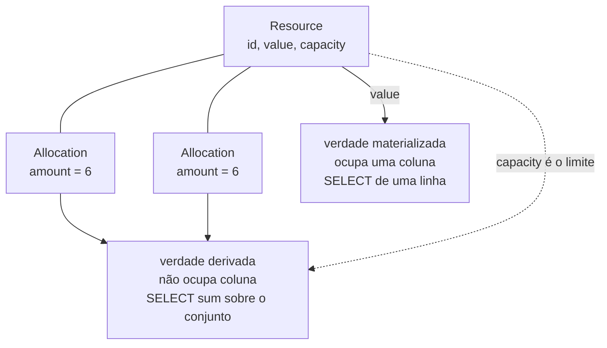
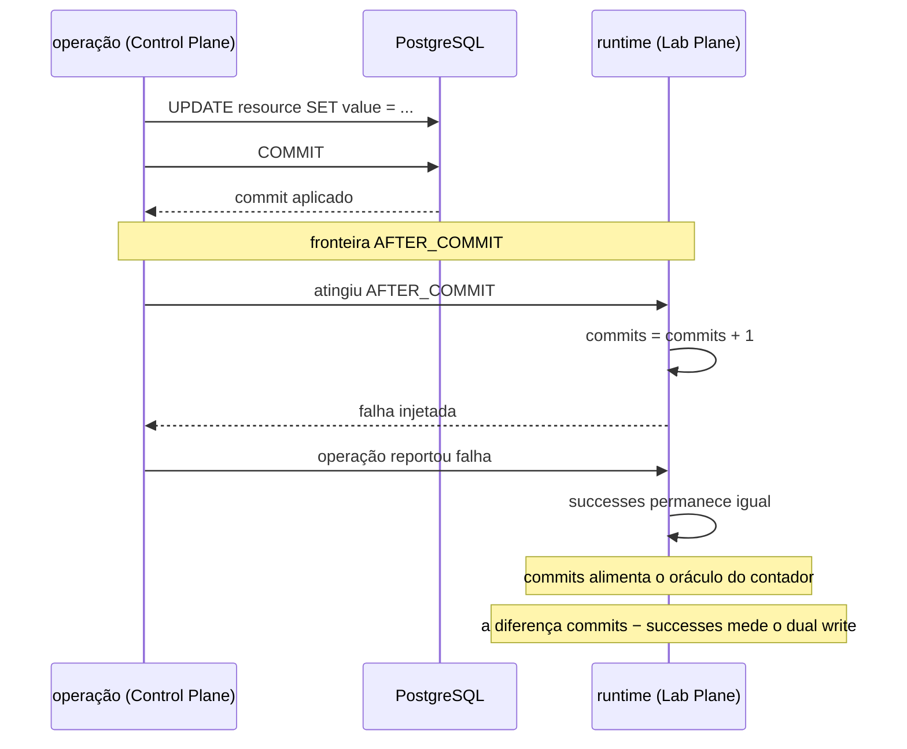
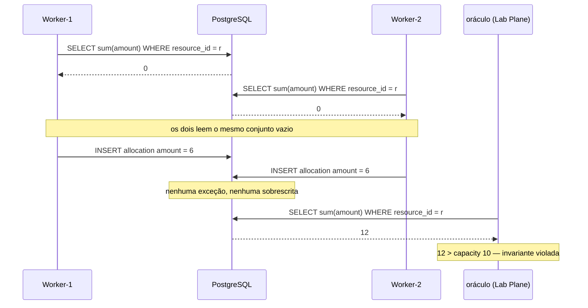
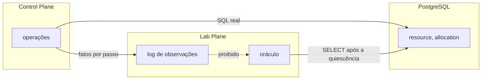
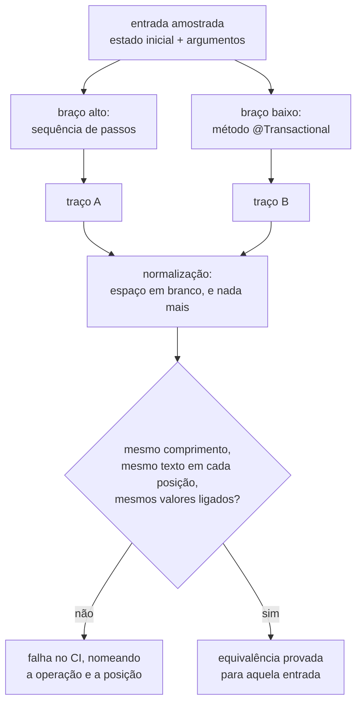

# ADR-0002: O domínio mínimo: contador com oráculo exato e predicado de capacidade

- **Estado:** Aceito
- **Data:** 2026-07-29
- **Etapa do roadmap:** 1 e 3
- **Relacionado:** depende do ADR-0001, que fixou a forma da operação. Reformula o
  `arquivo/0001`, que modelava apenas a invariante de capacidade. Deixa ponta para as
  estratégias de concorrência, para o log de observações e para os dois formatos de
  veredito.
- **Questão que este ADR fecha:** [`Q-0001-3`](../questions/Q-0001-3.md), transportada
  do ADR-0001 e listada na seção `## Questões encaminhadas` de [`README.md`](README.md).
- **Questões que este ADR encaminha:** [`Q-0002-1`](../questions/Q-0002-1.md) a
  [`Q-0002-4`](../questions/Q-0002-4.md), na mesma seção.

- **Última atualização:** 2026-08-12, por patch — ver `## Patches aplicados`
- **Alterado por:** [ADR-0009](0009-a-classificacao-do-dual-write-e-a-regiao-de-pacote.md)
  — emenda; a classificação do dual write como "o fenômeno do grupo B que a etapa 6
  estuda" ([seção "O oráculo exato"](#o-oráculo-exato)) passa a grupo C, escrita parcial.
- **Alterado por:**
  [ADR-0010](0010-a-fronteira-de-schema-e-o-cdc-como-fonte-do-veredito.md) — emenda; a
  regra de que `value_initial` e `value_final` são "lidos do banco"
  ([seção "O oráculo exato"](#o-oráculo-exato)) e o `SELECT` cruzado de schema, nas seções
  "O oráculo lê o banco, e NÃO DEVE ler o log de observações" e "O oráculo do predicado",
  deixam de valer.
  `value_initial` passa a vir do `INSERT` do estado inicial, e `value_final` do último
  evento de `resource.value` no WAL, por replicação lógica; a fonte do oráculo de
  capacidade fica sem decisão, registrada como pergunta em aberto.
- **Alterado por:**
  [ADR-0013](0013-a-proveniencia-da-fonte-como-criterio-da-proibicao-do-oraculo.md) —
  subsunção; o alcance da proibição da seção "O oráculo lê o banco, e NÃO DEVE ler o log
  de observações" passa a ser critério de proveniência.
- **Alterado por:**
  [ADR-0015](0015-a-chave-o-discriminador-de-execucao-e-as-colunas-de-tempo.md) —
  emenda; a regra de que "nenhuma outra coluna entra no MVP" ([seção "Decisão"](#decisão))
  e a contagem "duas tabelas e cinco colunas" ([seção "Positivas"](#positivas)) passam a
  admitir `partition_id`, `created_at` e `updated_at` como colunas adicionais nas duas
  tabelas do domínio medido. A existência delas é do ADR-0015, e a forma é de
  [`schemas/sut.md`](../architecture/schemas/sut.md#o-schema-do-sistema-medido-sut).
  `execution_id` não entra nesta emenda: é o **nome** que o instrumento usa para o
  discriminador, e não coluna que este ADR fixe: a do `lab_plane` segue sem forma.

## Vocabulário

Este documento cria quatro termos. Os quatro aparecem no restante do texto sem nova
definição.

- **verdade materializada** — o número que responde à pergunta do experimento e ocupa
  uma coluna. Lê-se com um `SELECT` de uma linha.
- **verdade derivada** — o número que responde à pergunta do experimento e não ocupa
  coluna nenhuma. Calcula-se sobre um conjunto de linhas, e muda quando uma linha entra
  no conjunto.
- **oráculo** — o procedimento do Lab Plane que compara o estado final do banco com o
  resultado que o experimento declarou esperar.
- **traço de SQL** — a sequência ordenada dos statements que uma tentativa enviou ao
  banco, cada um com a lista ordenada dos valores ligados a ele.

Os termos **passo**, **tentativa**, **fronteira** e **resolução** vêm do ADR-0001.

## Contexto

O ADR-0001 fixou a forma de uma operação e parou ali. Ele mostra `SELECT value, version
FROM resource WHERE id = ?` num esboço marcado como ilustrativo, e não decide que tabela
é essa, quem escreve nela, nem como alguém sabe que o resultado está errado.

O plano do laboratório, na seção 10, registra que o `arquivo/0001` precisa de
reformulação. Aquele documento modelava uma invariante de capacidade — `Σ alocações ≤
capacidade` — e o escopo novo pede também um contador com resultado exato. O plano
recomenda que o mesmo recurso carregue os dois, e a recomendação não é decisão.

Cinco experimentos do MVP incidem sobre este domínio. Os quatro primeiros medem
atualizações perdidas sobre um contador. O quinto produz write skew sobre uma soma, e o
plano o chama do resultado mais valioso que o laboratório pode produzir.

Três restrições limitam as respostas possíveis.

**O runtime não entende SQL.** O ADR-0001 decidiu que o corpo do passo é opaco e que o
runtime NÃO DEVE gerar, interpretar ou analisar o SQL. Nenhum mecanismo desta decisão
pode exigir um analisador de SQL.

**Nenhuma aleatoriedade não semeada, e o tempo é injetável.** As duas regras vêm do
`arquivo/0004` e da regra 8 do `arquivo/0006`, e o plano as marca como sobreviventes
inteiras.

**A prova de equivalência já existe e está sem critério.** O ADR-0001 exige um teste que
compare o traço de SQL das duas resoluções da mesma operação, e declara que a cláusula
de honestidade não vale enquanto esse teste não existir. O critério de igualdade entre
dois traços foi encaminhado para cá como [`Q-0001-3`](../questions/Q-0001-3.md).

## Problema

Duas perguntas precisam de resposta, e a segunda só faz sentido depois da primeira.

**O que o laboratório mede?** O modelo de dados, as operações que escrevem nele, e o
procedimento que decide se o resultado está errado.

**Quando dois traços de SQL são o mesmo traço?** É
[`Q-0001-3`](../questions/Q-0001-3.md), e ela chega aqui porque o critério depende de
quais valores atravessam a fronteira do banco — que é o que o domínio define.

As forças em conflito:

- Exatidão. Um oráculo que responda "errado" sem dizer quanto perde a métrica de que E3
  e E4 dependem.
- Cobertura. Uma contagem sobre uma coluna não produz write skew, e um predicado sobre
  um conjunto não produz contagem exata.
- Independência. O oráculo mede o sistema sob teste. Se ele medir o instrumento, um bug
  do runtime vira um resultado de consistência.
- Determinismo. A comparação de traços só é possível sobre valores que não variam entre
  duas execuções da mesma entrada.
- Antecipação. Uma coluna que só serve a uma decisão futura é uma decisão futura tomada
  aqui, em silêncio.

## Decisão

O domínio do laboratório tem **duas entidades e nenhum nome de negócio**.

- `Resource` carrega `id`, `value` e `capacity`.
- `Allocation` carrega `id`, `resource_id` e `amount`.

Nenhuma outra coluna entra no MVP.

O esquema NÃO DEVE carregar uma coluna `version`. Quem a acrescenta é o ADR de
estratégias de concorrência, no mesmo commit em que decidir a política que a lê.

`value` é a verdade materializada. `Σ amount` das linhas de `Allocation` de um recurso é
a verdade derivada, e `capacity` é o limite dela. As duas verdades vivem no mesmo
recurso.



Duas operações escrevem nesse modelo:

- `increment(resourceId)` — lê o recurso, calcula `value + 1`, grava. É a operação de E1
  a E4.
- `allocate(resourceId, amount)` — lê a soma das alocações do recurso, compara com
  `capacity`, insere uma alocação quando couber. É a operação de E5.

### A identidade das entidades é atribuída pela aplicação

O identificador de `Resource` e de `Allocation` DEVE ser gerado no código do sistema sob
teste, a partir da semente do experimento. O esquema NÃO DEVE usar `SERIAL`, `IDENTITY`,
`nextval` nem valor padrão gerado pelo banco para coluna de identidade.

O identificador DEVE ser função da semente, e NÃO DEVE ser função do instante da
execução. Duas execuções da mesma semente produzem os mesmos identificadores. Esta
restrição vincula quem decidir como o banco volta ao ponto de partida entre duas
execuções — questão encaminhada à definição de Experiment como
[`Q-0002-4`](../questions/Q-0002-4.md).

### O oráculo exato

O oráculo do contador produz uma contagem, e não um veredito booleano:

```
lost_operations = commits − (value_final − value_initial)
```

`commits` é o número de passagens pela fronteira `AFTER_COMMIT`, contadas por tentativa.
`value_initial` e `value_final` são lidos do banco, antes de o primeiro worker começar e
depois de o último terminar.

O denominador DEVE ser `commits`. Ele NÃO DEVE ser o número de operações submetidas nem
o número de operações que reportaram sucesso. Uma operação que esgotou as tentativas não
chegou a `AFTER_COMMIT` e não entra na contagem. Uma operação que commitou e reportou
falha chegou, e entra.

A contagem é por tentativa porque uma operação que repete a tentativa depois de commitar
incrementa duas vezes. Contar por operação esconderia o segundo incremento.



O `successes` continua contado, e muda de oráculo. Ele conta as execuções de operação que
reportaram sucesso ao Lab Plane, e a diferença `commits − successes` mede o dual write —
o fenômeno do grupo B que a etapa 6 estuda. Cada número mede um fenômeno.

### A calibração do denominador

Toda execução DEVE ser precedida por uma execução de calibração com uma estratégia que
não perca incremento nenhum. Nessa execução, `commits` DEVE ser exatamente igual a
`value_final − value_initial`.

Quando os dois números divergirem, o defeito é do instrumento, e nenhum resultado
daquela execução vale. A plataforma DEVE recusar o relatório.

### O oráculo do predicado

O oráculo da capacidade avalia `Σ amount ≤ capacity` para cada recurso, com um `SELECT
sum` emitido pelo Lab Plane depois do fim da execução. O veredito é booleano, e a
violação carrega os dois números: a soma obtida e a capacidade declarada.

O E5 é este oráculo aplicado a duas alocações que não se sobrescrevem:



O desenho mostra por que travar a linha do recurso não ajudaria: no instante das duas
leituras, a linha que quebra a invariante ainda não existe.

### O oráculo lê o banco, e NÃO DEVE ler o log de observações

Os dois oráculos consultam o PostgreSQL. Nenhum dos dois deriva o estado final do log de
observações do runtime.



O `commits` do oráculo exato é a única entrada que vem do lado do Lab Plane. Ele não é
observação de um evento do sistema sob teste: é o registro de que o runtime alcançou uma
fronteira que ele mesmo executa. A calibração acima é o que impede essa entrada de virar
a alternativa E por outro caminho.

### O critério de igualdade entre dois traços de SQL

Esta subseção fecha [`Q-0001-3`](../questions/Q-0001-3.md).

Um traço é a sequência ordenada dos statements que uma tentativa enviou ao banco. Cada
entrada tem o texto do statement e a lista ordenada dos valores ligados a ele.

Dois traços são **iguais** quando têm o mesmo comprimento e, em cada posição, o texto
normalizado é idêntico e a lista de valores ligados é idêntica.

A normalização do texto colapsa sequências de espaço em branco num espaço, e remove
espaço no início e no fim. **Ela não faz mais nada.** Não muda a caixa, não reordena
cláusula, não remove comentário e não reconhece equivalência semântica entre dois
textos.

Os valores ligados são comparados **como valores**, na ordem dos índices dos parâmetros.
O marcador `?` NÃO DEVE substituir o valor na comparação.

A ordem entre statements é comparada como **sequência**, e não como conjunto. Dois
traços com os mesmos statements em ordem diferente são diferentes.

O conjunto de entradas amostradas é declarado por operação, e DEVE conter uma entrada
para cada ramo do predicado da operação, mais um estado inicial diferente de zero. Para
`allocate`, os ramos são três: a alocação cabe, a alocação atinge a capacidade exata, e
a alocação excede.



### O que este ADR não decide

**Que colunas cada estratégia de concorrência acrescenta.** O `OPTIMISTIC` precisa de
`version`, e o `ATOMIC_UPDATE` não precisa de coluna nenhuma. A migração que acrescenta
a coluna pertence ao ADR que decidir a política.

**O nível de isolamento de cada experimento.** O E5 exige a comparação entre `READ
COMMITTED`, `REPEATABLE READ` e `SERIALIZABLE`. O isolamento é parâmetro da definição de
experimento, e tem ADR próprio na fila.

**Quem estabelece o estado inicial, e como o banco volta ao ponto de partida entre duas
execuções.** O oráculo lê `value_initial`; ele não o cria. A restrição de que o
identificador seja função da semente vale para qualquer resposta. Ver
[`Q-0002-4`](../questions/Q-0002-4.md).

**Qual estratégia serve de calibração.** A calibração exige uma estratégia que não perca
incremento nenhum. Qual é ela pertence ao ADR de estratégias de concorrência.

**O formato de curva do grupo D.** Os dois oráculos aqui produzem contagem e booleano
sobre um estado final. A curva de E4 é outra coisa, e tem ADR próprio.

## Justificativa

**Por que duas verdades no mesmo recurso.** A verificação materializada contra derivada
é a origem de E5, e o contraste só é visível quando as duas descrevem o mesmo recurso.
Um recurso com `value` e `capacity` na mesma linha permite executar, mais adiante, o
experimento em que materializar o conflito resolve o write skew — a solução clássica,
que exige uma linha compartilhada para travar. Separar os dois modelos em entidades
distintas tornaria esse experimento impossível de escrever sem criar a ligação depois.

**Por que a contagem, e não um predicado, para o contador.** O E2 exige **exatamente
uma** atualização perdida em toda execução. Isso é uma afirmação sobre a magnitude. Um
oráculo booleano responde "a invariante foi violada" tanto para uma perda quanto para
217, e o experimento que prova que a plataforma constrói a anomalia deixaria de ser
distinguível do que prova que ela detecta.

**Por que o denominador não é o número de operações submetidas.** O `OPTIMISTIC` do E3 e
o E4 esgotam tentativas por construção — é o fenômeno que E4 mede. Um denominador fixo
transformaria cada esgotamento em uma atualização perdida contada, e a curva de E4
mostraria perda crescente onde há apenas retry crescente.

**Por que o denominador é `commits`, e não o número de operações que reportaram
sucesso.** Um escalar não separa dois efeitos de sinais opostos. A atualização perdida
faz o banco aplicar menos do que a aplicação acredita, e o commit seguido de falha
injetada faz o banco aplicar mais. Com `successes` no denominador, os dois se cancelam, e
uma execução com o mesmo número de perdas e de injeções publica zero sobre um banco
inconsistente. A `AFTER_COMMIT` é a fronteira que o ADR-0001 criou para produzir esse
caso na etapa 6, de modo que o cancelamento não é raro: é o desenho do experimento.

Contar passagens pela fronteira desfaz o cancelamento porque o denominador passa a medir
o que o banco recebeu, e não o que a aplicação acredita. O que a aplicação acredita
continua sendo medido, em `successes`, e a distância entre os dois números vira a medida
do dual write. Cada fenômeno ganha o seu número em vez de dividir um.

**Por que a passagem pela fronteira é aceitável como entrada do Lab Plane, e a
observação de `WRITE` da alternativa E não é.** As duas parecem a mesma dependência, e
não são. Observar um `WRITE` é o instrumento registrando um evento que o sistema sob
teste produziu — o instrumento PODE perdê-lo, e o veredito cai junto. Contar passagens
por `AFTER_COMMIT` numa execução com injeção é o instrumento registrando a própria ação:
a injeção existe porque o runtime a executou naquela fronteira, e um registro perdido
leva junto a injeção que ele registrava. A calibração fecha o resto da lacuna, porque
uma contagem sistematicamente errada aparece na execução em que os dois números DEVEM
coincidir.

**Por que o oráculo lê o banco, e não o log.** A separação Control Plane / Lab Plane
existe para que um bug do instrumento não vire um resultado de consistência. Um oráculo
alimentado pelo log mede o runtime contra o próprio runtime: se o runtime deixar de
observar um `WRITE`, o valor esperado cai junto com o valor obtido, e o veredito fica
verde. O banco é o sistema sob teste, e é o único lugar onde a resposta é independente
do instrumento.

**Por que a normalização do traço para no espaço em branco.** Qualquer normalização
adicional — reordenar cláusula, ignorar alias, reconhecer que dois textos significam a
mesma consulta — exige um analisador de SQL. O ADR-0001 decidiu que o laboratório NÃO
DEVE analisar SQL, e a proibição não abre exceção para o Lab Plane sem abrir para o
runtime. A borda estrita de [`Q-0001-3`](../questions/Q-0001-3.md) não foi escolhida
entre duas opções: é a única que sobrevive a uma decisão já aceita.

**Por que os valores ligados são comparados como valores.** Três regras removem as
fontes de não determinismo dos valores que atravessam a fronteira do banco: o relógio é
injetável, a aleatoriedade é semeada, e esta decisão retira do banco a geração de
identidade. Com as três, dois braços corretos da mesma operação, sobre o mesmo estado
inicial e a mesma entrada, ligam os mesmos valores.

O ganho é específico. [`Q-0001-1`](../questions/Q-0001-1.md) aponta que o digest do
traço é cego para o passo `COMPUTE`, porque trocar `value + 1` por `value + 2` não
altera o texto de statement nenhum quando o parâmetro entra como marcador. Comparando
valores, a troca altera o valor ligado do `UPDATE`, e a prova de equivalência a enxerga.
Isso não fecha [`Q-0001-1`](../questions/Q-0001-1.md), que pertence ao log de
observações — reduz um dos limites que ela registra.

**Por que a ordem entre statements é comparada como sequência.** O ADR-0001 decidiu que
uma tentativa é uma sequência **ordenada** de passos, e que a diferença entre as duas
resoluções fica na composição. A ordem é justamente onde a composição diverge. Comparar
conjunto aceitaria dois braços que leem na ordem trocada, e a ordem de leitura muda
quais intercalações são possíveis sob concorrência — que é o que a cláusula de
honestidade compara.

**Por que a identidade é atribuída pela aplicação.** Uma chave vinda de `nextval` avança
entre as duas execuções do teste de equivalência, e reprovaria um par correto pelo valor
ligado do `INSERT`. Além disso, o replay determinístico da etapa 12 precisa que a mesma
semente produza os mesmos identificadores. A alternativa seria excluir identificadores
da comparação, e uma exceção nomeada no critério é uma porta por onde outras entram.

**Por que a amostragem inclui a borda do predicado.** O `allocate` muda de ramo
exatamente onde `Σ + amount == capacity`. Um conjunto amostrado que só contenha o caso
que cabe e o que não cabe deixa o ramo da igualdade sem execução — e é nele que a
diferença entre `<` e `<=` vive.

**Por que `version` não entra no esquema.** A coluna é a solução para a atualização
perdida, e a regra pedagógica do repositório exige o problema antes da solução. Um
esquema que já a carrega retira a decisão de quem escreve o E3: o `OPTIMISTIC` deixa de
ser escolhido e vira a continuação natural do modelo, enquanto o `ATOMIC_UPDATE`, que
não precisa de coluna nenhuma, passa a parecer o desvio. A alternativa de mantê-la como
dado sem política não sustenta o rótulo de neutra, porque a coluna muda o texto do
statement de leitura e portanto entra no critério de igualdade de traço desta decisão.

O esboço do ADR-0001 lê `SELECT value, version FROM resource`, e ele está marcado como
ilustrativo no próprio ADR-0001. Um esboço ilustrativo não é requisito normativo, de
modo que retirar a coluna não edita um ADR aceito.

## Consequências

### Positivas

- Os cinco experimentos do MVP ficam escrevíveis sobre duas tabelas e cinco colunas.
  Nenhuma decisão de modelagem de negócio precede o primeiro experimento.
- O oráculo exato dá magnitude, e a magnitude é a métrica de E3 e de E4. "217 perdidas"
  aponta a carga; "violado" não aponta nada.
- O oráculo do contador continua exato quando a etapa 6 injeta falha depois do commit. O
  incremento que ficou no banco aparece no denominador, e a perda real não é abatida por
  ele.
- A etapa 6 ganha um oráculo que nenhum ADR havia previsto. A diferença
  `commits − successes` conta os dual writes diretamente, sem instrumentação nova.
- O instrumento passa a ter uma verificação própria. A execução de calibração falha
  quando a contagem de passagens estiver errada, em vez de deixar o erro entrar no
  relatório.
- O `OPTIMISTIC` continua sendo uma decisão a tomar, e não a continuação de um esquema
  que já traz a coluna que ele usa.
- A prova de equivalência do ADR-0001 passa a ser executável. Antes desta decisão,
  nenhuma operação podia satisfazer a cláusula de honestidade, porque o critério de
  igualdade não existia.
- A comparação por valor ligado enxerga a mudança no corpo do passo `COMPUTE`, que a
  comparação por marcador não enxergaria.
- O critério de igualdade não exige nenhuma dependência nova. Ele é comparação de texto
  e de valores, e o interceptador de statements já é exigido pelo ADR-0001.
- O experimento que materializa o conflito para resolver write skew fica possível sem
  mudar o modelo, porque `capacity` já vive numa linha que pode ser travada.

### Negativas

- **O modelo não é o código que um engenheiro escreveria.** `Resource` e `Allocation`
  não existem em sistema nenhum. A regra pedagógica do repositório quer o problema no
  código real, e o leitor precisa mapear o contador de volta para o saldo, o estoque ou
  o contador de curtidas que ele conhece.
- **`Allocation` não tem estado.** Uma alocação criada nunca é liberada, e a tabela é
  apenas acrescida. O cenário em que uma liberação concorre com uma alocação exige uma
  coluna nova e uma migração.
- **O oráculo exato depende de o Lab Plane contar passagens por `AFTER_COMMIT`.** É a
  única entrada do veredito que não vem do banco, e uma contagem errada ali produz uma
  perda que não houve. A calibração detecta o erro sistemático, e não detecta o erro que
  só aparece sob injeção de falha.
- **Toda execução passa a custar duas.** A calibração roda antes, com outra estratégia,
  e o tempo de uma bateria de experimentos dobra.
- **A calibração depende de uma estratégia que este ADR não pode nomear.** Ela exige uma
  estratégia sem perda, e a lista de estratégias é decisão de outro ADR. Até lá, a
  calibração é um requisito sem procedimento.
- **O ADR-0001 mostra um `SELECT` de uma coluna que não existe.** O esboço ilustrativo
  dele lê `version`, e o esquema desta decisão não a tem. O ADR-0001 é aceito e não pode
  ser corrigido; quem ler os dois na ordem encontra a divergência.
- **A comparação por valor amarra o teste ao estado inicial.** Trocar o `value` inicial
  de uma entrada amostrada muda todos os valores ligados daquele traço. A entrada
  amostrada vira parte do contrato do teste, e não um detalhe da fixture.
- **A normalização mínima reprova pares corretos.** Um `UPDATE` reescrito com a mesma
  semântica e texto diferente falha no CI. A quebra é ruidosa e o diagnóstico é a
  comparação de dois textos — é o custo que a proibição de analisar SQL impõe.
- **A geração de identidade sai do banco.** Nenhuma coluna `SERIAL` no esquema, e todo
  `INSERT` passa a carregar a chave. Uma inserção manual em `psql` durante depuração
  deixa de funcionar sem que alguém escolha um identificador.
- **O veredito descreve o estado final quiescente.** Uma violação que exista durante a
  execução e desapareça antes do fim é invisível para os dois oráculos. Ver
  [`Q-0002-3`](../questions/Q-0002-3.md).
- **O E3 exige uma migração de esquema antes de rodar.** O `OPTIMISTIC` precisa de
  `version`, e a coluna não existe. A migração vem junto do ADR de estratégias.

### Neutras

- A timeline do briefing mostra `Worker-1 READ resource=42 version=1`. O exemplo passa a
  descrever um estado do laboratório que ainda não existe.
- O `SELECT sum` do oráculo roda numa transação própria do Lab Plane, depois da
  execução. O nível de isolamento dessa transação não afeta o resultado sobre um banco
  quiescente.
- O modelo comporta mais de um recurso por experimento. Nenhum experimento do MVP usa
  mais de um, e a contenção de E1 a E4 depende de todos os workers dividirem o mesmo.

## Trade-offs

- O benefício **magnitude exata da anomalia, e não apenas a presença dela** foi aceito
  em troca do custo **o veredito passa a depender de uma contagem mantida pelo Lab
  Plane, fora do banco**.
- O benefício **o contador continua exato quando a etapa 6 injeta falha depois do
  commit** foi aceito em troca do custo **o denominador deixa de sair do resultado da
  operação e passa a sair de uma fronteira do runtime**.
- O benefício **o instrumento tem uma verificação que o reprova antes de o resultado
  entrar no relatório** foi aceito em troca do custo **toda execução exige uma execução
  de calibração antes, e a bateria de experimentos dobra de duração**.
- O benefício **as duas verdades convivem no mesmo recurso, e o contraste entre
  materializada e derivada fica executável** foi aceito em troca do custo **o esquema
  carrega colunas que nenhum experimento isolado usa por inteiro**.
- O benefício **`OPTIMISTIC` continua sendo uma decisão, e não a continuação natural do
  esquema** foi aceito em troca do custo **o E3 não roda sem uma migração de esquema, e
  o esboço ilustrativo do ADR-0001 lê uma coluna que não existe**.
- O benefício **o oráculo é independente do runtime** foi aceito em troca do custo
  **cada execução paga uma consulta extra ao banco depois da quiescência, e o veredito
  só existe quando a execução termina**.
- O benefício **a prova de equivalência enxerga a mudança de corpo do passo `COMPUTE`**
  foi aceito em troca do custo **o teste fica amarrado ao estado inicial de cada entrada
  amostrada**.
- O benefício **nenhum analisador de SQL entra no laboratório** foi aceito em troca do
  custo **dois statements semanticamente iguais e textualmente diferentes reprovam a
  prova de equivalência**.
- O benefício **o mesmo experimento reexecutado produz os mesmos identificadores** foi
  aceito em troca do custo **a geração de identidade sai do banco, e toda inserção passa
  a declarar a chave**.
- O benefício **o modelo não carrega vocabulário de negócio que ninguém pediu para
  estudar** foi aceito em troca do custo **o leitor precisa mapear `Resource.value` de
  volta para o problema que ele reconhece**.

## Alternativas consideradas

### Alternativa A — duas entidades independentes, uma por oráculo

Um agregado `Counter` serve E1 a E4, e um agregado `Reservation` com capacidade própria
serve E5. Cada um carrega apenas as colunas que usa.

**Descartada.** O argumento a favor é legítimo: nenhuma coluna inútil, e cada
experimento lê um modelo que fala só da sua anomalia. A separação também impediria que
uma mudança motivada por E5 quebrasse E1.

A alternativa A perde porque separa o que E5 precisa contrastar. A lição de E5 é que uma
verdade derivada não tem linha para travar — e essa lição é vazia se não houver, no
mesmo recurso, uma verdade materializada que **tem**. Pior: o experimento que resolve
write skew materializando o conflito exige exatamente uma linha compartilhada entre as
alocações. Com duas entidades independentes, esse experimento só seria escrevível depois
de ligar as duas, e a ligação seria o modelo desta decisão, criado tarde.

### Alternativa B — um domínio de negócio realista

O modelo tem pedido, item, estoque e pagamento. As anomalias aparecem sobre entidades
que um engenheiro reconhece.

**Descartada.** A fidelidade pedagógica é real, e o repositório valoriza mostrar o
problema no código que um engenheiro escreveria — o ADR-0001 chegou a descartar a
alternativa D por esse motivo.

A alternativa B perde no oráculo. "O estoque ficou certo?" depende de regras de
negócio — reserva, cancelamento, backorder — que ninguém pediu para estudar, e cada
regra vira uma fonte de dúvida sobre se o resultado veio da concorrência ou do domínio.
O plano registra que a suspeita precisa cair sobre o sistema, nunca sobre a medida. Um
oráculo que exija interpretar regra de negócio inverte isso. O repositório já declarou
que não existe pedido, pagamento, cliente ou estoque no escopo.

### Alternativa C — oráculo booleano único, para os dois modelos

O veredito é sempre "a invariante foi violada, sim ou não". O contador vira o predicado
`value == esperado`.

**Descartada.** Um formato só de veredito reduz a arquitetura, e o plano já prevê um
segundo formato para o grupo D — sustentar três formatos é mais caro que dois.

A alternativa C perde porque apaga a informação que separa E1 de E2. E2 exige exatamente
uma atualização perdida em toda execução; com veredito booleano, uma execução que
perdesse cinco passaria igual. E4 mede retries por operação contra número de workers, e
a curva precisa de números, não de vereditos. O booleano é o formato certo para a
capacidade, e insuficiente para o contador.

### Alternativa D — a verificação vive no banco

Uma `CHECK` com subconsulta, uma constraint deferida ou uma trigger `AFTER INSERT`
recusa a alocação que exceda a capacidade. O banco passa a ser o oráculo.

**Descartada.** O ganho é concreto: nenhuma consulta de verificação no Lab Plane, e a
violação apareceria no instante em que ocorresse, e não apenas no fim.

A alternativa D perde por confundir observar com impedir. O laboratório existe para
mostrar a anomalia acontecendo; uma constraint que a recusa produz um experimento em que
nada dá errado, e a lição de E5 — a invariante quebra **sem nenhuma exceção lançada** —
desaparece. Há um segundo motivo, e ele é mais interessante: uma trigger que soma as
alocações roda dentro da mesma transação e sob o mesmo isolamento, e portanto sofre o
mesmo write skew. Ela não veria a linha da transação concorrente, e deixaria passar
exatamente o caso que deveria pegar. Isso é um experimento que o laboratório deveria
executar mais adiante, e não é um oráculo.

### Alternativa E — o oráculo derivado do log de observações

O valor esperado sai da contagem de passos `WRITE` bem-sucedidos observados pelo
runtime, e o valor obtido sai do último `WRITE` registrado. Nenhuma consulta ao banco
depois da execução.

**Descartada.** A alternativa E liga o veredito à timeline sem custo extra, e daria a
violação já resolvida no instante em que a última observação sai.

Ela perde porque o oráculo passaria a medir o instrumento com o instrumento. Um runtime
que perdesse uma observação de `WRITE` reduziria o esperado e o obtido ao mesmo tempo, e
o veredito ficaria verde sobre um banco inconsistente. É a falha que a separação Control
Plane / Lab Plane existe para impedir, aplicada ao lugar onde ela custa mais caro: o
número que o relatório publica.

### Alternativa F — comparar marcadores de parâmetro, e não valores ligados

O traço registra `UPDATE resource SET value = ? WHERE id = ?`, e a comparação ignora os
valores.

**Descartada.** A alternativa F tem o argumento que
[`Q-0001-3`](../questions/Q-0001-3.md) registra: comparar valores torna o teste
dependente do dado de entrada, e uma entrada trocada quebra o teste sem que a operação
tenha mudado.

Ela perde porque o marcador apaga o passo `COMPUTE`. Num laboratório de contadores, o
`COMPUTE` é a lógica: `value + 1` contra `value + 2` é a diferença entre um braço
correto e um braço errado, e os dois emitem o mesmo texto de statement. A dependência do
dado de entrada é o custo dessa cobertura, e ela é gerenciável porque a entrada
amostrada é declarada e versionada junto do teste.

### Alternativa G — recusar a combinação de oráculo exato com falha depois do commit

O denominador continua sendo `successes`, e a plataforma rejeita qualquer experimento que
declare uma falha em `AFTER_COMMIT` junto do oráculo exato. A combinação que produz o
cancelamento deixa de ser expressável.

**Descartada.** O argumento a favor é o mais forte entre os descartados: a regra é
verificável na definição do experimento, antes de qualquer execução, e não acrescenta
entrada nenhuma vinda do Lab Plane. Ela também falha alto, que é o comportamento correto
para uma medida que não vale.

Ela perde porque remove o oráculo do experimento que mais precisa dele. A etapa 6 existe
para medir o que acontece quando o commit e a publicação se separam, e o número de
incrementos que sobrevivem a essa separação é o resultado. A alternativa G entrega uma
plataforma que recusa o experimento em vez de medi-lo, e a recusa não é temporária: o
dual write é um dos cinco grupos do escopo, não um caso de borda.

### Alternativa H — manter `successes` no denominador e publicar dois números

A fórmula não muda. O relatório acrescenta `commits sem sucesso reportado` ao lado de
`lost_operations`, e quem lê corrige um pelo outro.

**Descartada.** A alternativa H custa menos que a decisão: nenhuma calibração, nenhuma
mudança no que o oráculo consome, e nenhum efeito fica escondido do leitor atento.

Ela perde porque a correção fica com quem lê. `lost_operations` continua sendo um número
enviesado, publicado com o nome do fenômeno que ele deixou de medir, e a soma que o
conserta é uma operação que o leitor precisa saber que existe. Um relatório cuja
primeira linha está errada até que alguém a some com a terceira é pior que um relatório
com uma linha a mais. A decisão tomada publica os dois números também — a diferença é
que o primeiro deles já está certo.

### Alternativa I — manter `version` no esquema, declarada sem política

A coluna entra agora, e o ADR declara que nenhum experimento do MVP a lê. O ADR de
estratégias apenas passa a usá-la, sem migração.

**Descartada.** O ganho é real e não é apenas de conveniência: o esboço do ADR-0001 e a
timeline do briefing ficam consistentes com o esquema, e o E3 roda sem alterar tabela.

Ela perde por dois motivos. O rótulo de neutra não se sustenta, porque a coluna muda o
texto do `SELECT` de leitura e portanto entra no critério de igualdade de traço desta
decisão — ela não é dado inerte à espera de política. E a presença dela decide o E3 em
silêncio: com a coluna no lugar, `OPTIMISTIC` vira a continuação natural do modelo e
`ATOMIC_UPDATE` vira o desvio, quando os dois deveriam chegar ao E3 empatados. A regra
pedagógica do repositório pede o problema antes da solução, e `version` é a solução.

## Quando esta decisão deixa de valer

Reveja o modelo quando um fenômeno do roadmap exigir que uma verdade seja
simultaneamente materializada e derivada — o mesmo número mantido numa coluna **e**
calculado sobre um conjunto, com a divergência entre os dois sendo o objeto do
experimento. Esse é o contorno de cache invalidation e de read model defasado, nas
etapas 8 e 9. O sinal concreto: um experimento que precise afirmar que `value` e
`Σ amount` deveriam ser o mesmo número.

Reveja o critério de igualdade de traço quando a prova de equivalência de uma operação
correta reprovar por diferença de texto duas vezes em experimentos distintos, sem que
nenhuma das duas tenha revelado um defeito. A normalização mínima estaria cobrando mais
do que entrega, e o custo passaria a recair sobre quem escreve operações.

Reveja o oráculo exato quando um experimento do roadmap precisar de um veredito antes do
fim da execução. O sinal é um fenômeno cuja violação é transitória por natureza — o
estado errado existe durante uma janela e some depois. Ver
[`Q-0002-3`](../questions/Q-0002-3.md).

Reveja a calibração do denominador quando a execução de calibração passar a reprovar por
motivo que não seja defeito do runtime. O sinal é uma estratégia declarada sem perda que
produza `commits` diferente de `value_final − value_initial` por causa do banco, e não
do instrumento — um `UPDATE` que o PostgreSQL descarte depois de o commit retornar, por
exemplo. A calibração estaria acusando o instrumento por um comportamento do sistema sob
teste.


## Patches aplicados

O regime de patch está em [`README.md`](README.md#a-revogação-da-imutabilidade-decidida-em-2026-08-07).
Um patch conserta citação, caminho ou erro material; ele NÃO DEVE alterar a decisão nem o
argumento que a sustentava.

| Data       | Seção do corpo                                                                                                                                                                                                        | O que mudou                                                                                                                                                                                                                                                                                                                                                                           | Por quê                                                                                                                                                                                                                                                                                                                                                                                                                                                                                                                                                                   |
|------------|-----------------------------------------------------------------------------------------------------------------------------------------------------------------------------------------------------------------------|---------------------------------------------------------------------------------------------------------------------------------------------------------------------------------------------------------------------------------------------------------------------------------------------------------------------------------------------------------------------------------------|---------------------------------------------------------------------------------------------------------------------------------------------------------------------------------------------------------------------------------------------------------------------------------------------------------------------------------------------------------------------------------------------------------------------------------------------------------------------------------------------------------------------------------------------------------------------------|
| 2026-08-11 | Cabeçalho, entrada `Alterado por: ADR-0010`                                                                                                                                                                           | a citação por linha `:156-157`, ao lado de "seção 'O oráculo exato'", virou âncora `#o-oráculo-exato`                                                                                                                                                                                                                                                                                 | o mesmo commit que emenda este ADR pelo ADR-0015 acrescentou **dez** linhas de cabeçalho acima de `## Contexto`, deslocando o corpo inteiro (`## Vocabulário` saiu de `:32` para `:42`). A citação **já era imprecisa antes deste commit**: `:156-157` eram a cerca de código e a fórmula `perdidas = commits − (value_final − value_inicial)`, e a regra citada entre aspas, "lidos do banco", estava em `:161`. O deslocamento somou a isso levar `:156-157` para dentro de "A identidade das entidades…", noutra seção — e a âncora conserta as duas coisas de uma vez |
| 2026-08-11 | Cabeçalho, entrada `Alterado por: ADR-0009`                                                                                                                                                                           | a citação por linha `:175`, ao lado de "seção 'O oráculo exato'", virou âncora `#o-oráculo-exato`                                                                                                                                                                                                                                                                                     | o mesmo defeito da linha acima, e medido do mesmo jeito: `:175` é hoje `participant DB as PostgreSQL`, dentro do `sequenceDiagram` do oráculo do contador, e a frase citada entre aspas vive em `:202`. A seção já estava nomeada ao lado do número, e a âncora dispensa o número                                                                                                                                                                                                                                                                                         |
| 2026-08-12 | Cabeçalho, entrada `Alterado por: ADR-0015`                                                                                                                                                                           | o ponteiro à forma do schema medido apontava para o arquivo `esquemas.md`, com a âncora `#o-schema-do-sistema-medido-sut`; passa a `../architecture/schemas/sut.md`, com a mesma âncora, e o texto do link acompanha o nome novo                                                                                                                                                      | o fecho de [`E-78`](../fila-de-decisoes.md#e-78--o-esquemasmd-vira-pasta-com-um-arquivo-por-serviço) trocou o arquivo por uma pasta com um arquivo por serviço, **sem lápide**: o caminho antigo deixou de existir, e a âncora deixaria de resolver                                                                                                                                                                                                                                                                                                                       |
| 2026-08-14 | `## Decisão`, `## Justificativa`, `## Consequências`, `## Alternativas consideradas`, `## Quando esta decisão deixa de valer` e o cabeçalho; o título `### Alternativa H` acompanha, e nenhuma âncora dele era citada | os identificadores da fórmula do oráculo exato passam a ser grafados em inglês, sem que nenhum número, relação ou argumento mude: `perdidas` vira `lost_operations`, `value_inicial` vira `value_initial` e `sucessos` vira `successes`; `value_final` já se grafava assim. As palavras "atualizações perdidas" e "operações perdidas", que são prosa e não identificador, permanecem | decidido pela pessoa em 2026-08-14, para que a grafia case com as propostas de modelo de dados e com a regra de que todo identificador deste laboratório é escrito em inglês, de `D-ARQ-06`. A grafia portuguesa sobrevive em `adr/arquivo/`, que nunca é editado, e por isso a uniformidade não é alcançável. **A alteração excede o limite ordinário do patch**, que NÃO DEVE alcançar `## Decisão`, a justificativa, a alternativa descartada nem a consequência — ela foi autorizada explicitamente, e fica registrada aqui em vez de ficar sem rastro                |
