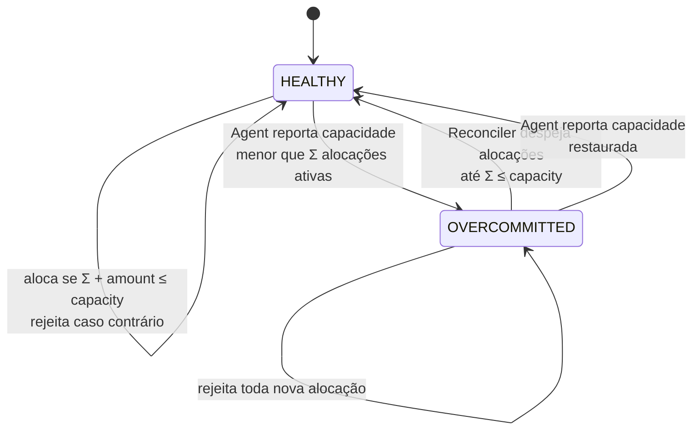

# ADR-0002: Quatro origens de escrita com semânticas distintas

- **Estado:** Proposto
- **Data:** 2026-07-26
- **Etapa do roadmap:** 0
- **Relacionado:** ADR-0001, ADR-0003, ADR-0004

## Contexto

O ADR-0001 define uma invariante única sobre a capacidade de um `Resource`. O
laboratório precisa violar essa invariante de propósito, de formas diferentes, para
comparar estratégias de proteção.

"Várias origens escrevendo ao mesmo tempo" é vago. Duas origens que escrevem do mesmo
jeito produzem o mesmo bug. Elas não aumentam o valor do laboratório.

## Problema

Cada mecanismo de proteção falha por um motivo diferente. Um laboratório que só
produz `lost update` conclui cedo demais que optimistic lock resolve tudo.

A pergunta é: quais origens de escrita, com quais semânticas, produzem **falhas
distintas** da mesma invariante?

## Decisão

O laboratório tem **quatro origens de escrita**. Cada origem tem uma semântica
própria e quebra a invariante de um jeito diferente.

| Origem | Transporte | Semântica | Falha característica |
|---|---|---|---|
| **Operator** | REST síncrono, com `Idempotency-Key` | comando imperativo do usuário | `lost update` clássico |
| **Agent** | evento assíncrono (heartbeat) | relato de fato observado no passado | fato fora de ordem; **violação retroativa** |
| **Reconciler** | job periódico | leitura ampla, depois escrita | `write skew` |
| **Lease Expiry** | disparo por relógio | o tempo como escritor | corrida entre expirar e renovar |

### Detalhamento

**Operator.** Um humano ou um script pede uma alocação. A chamada é síncrona. O
cliente espera a resposta. O `Idempotency-Key` protege contra retentativa do próprio
cliente. Dois operators concorrentes sobre o mesmo recurso produzem `lost update`.
Optimistic lock resolve este caso.

**Agent.** Um agente reporta a **capacidade total** de um nó: *"eu tenho 16
unidades"*. Isso é um fato sobre o hardware, não sobre as alocações.

O Agent nunca escreve capacidade *livre*. Capacidade livre é consequência das
alocações, e o ADR-0001 já define quem a determina em cada `capacityModel`. Se o Agent
a sobrescrevesse, existiriam duas fontes de verdade para o mesmo valor, sem regra de
precedência.

A rede pode reordenar mensagens. Um relato antigo de `32` que chega depois de um
relato recente de `16` restaura capacidade que não existe mais.

**Optimistic lock não protege este caso.** A versão do agregado avança normalmente. A
escrita é válida do ponto de vista do banco. O problema não é escrita concorrente: é
um fato velho aplicado sobre um estado novo. A proteção correta é comparar o
*timestamp lógico do fato*, não a versão do agregado (`SEQUENCE_GUARD`, ver ADR-0003).

**Reconciler.** Um job lê o conjunto de alocações, calcula a soma e ajusta o recurso.
A leitura e a escrita não são atômicas. Entre elas, outra origem insere uma alocação
nova. O reconciler grava uma soma que já está errada. Este é o `write skew` clássico:
nenhuma linha lida foi modificada, mas a **condição** que justificou a escrita deixou
de valer.

O Reconciler tem **dois papéis**, e apenas o primeiro depende do `capacityModel`:

1. corrigir *drift* entre `available` e a soma real — só existe em `MATERIALIZED`;
2. resolver sobrecomprometimento — existe nos dois modelos (ver abaixo).

**Lease Expiry.** Alocações têm TTL. Um processo expira alocações vencidas. Ao mesmo
tempo, o dono da alocação a renova. As duas operações competem. Além disso, os
relógios das máquinas divergem. Não existe um "agora" global. Uma alocação pode estar
viva para um processo e morta para outro.

### A capacidade pode encolher

O relato do Agent é um fato sobre o mundo real. Ele pode reduzir a capacidade abaixo
do que já está alocado:

```
capacity: 32 → 16     (relato legítimo do Agent; um disco falhou)
Σ alocações: 24       (nada mudou aqui)
────────────────────
24 > 16               invariante violada
```

A invariante quebra **sem nenhuma concorrência**. Não há corrida, não há lost update,
não há write skew. Existe apenas um fato verdadeiro que torna o passado inválido.
Nenhuma estratégia do ADR-0003 resolve isto, porque não há nada a serializar.

**Decisão: o laboratório aceita o relato e entra em sobrecomprometimento.** O
`Resource` ganha um estado explícito.



Duas regras fecham o comportamento:

- **Em `OVERCOMMITTED`, nenhuma alocação nova é aceita.** A invariante continua sendo
  pré-condição de escrita. O estado registra um passado inválido; ele não autoriza
  piorá-lo.
- **Nenhuma alocação é revertida no momento do relato.** O relato do Agent é uma
  escrita rápida no caminho de mensagem. Decidir *quais* alocações despejar é uma
  política, e política é trabalho do Reconciler, fora do caminho crítico.

Este é o modelo do Kubernetes. Ele não rejeita um kubelet que reporta menos memória e
não faz rollback de pods. O nó fica sobrecomprometido e o kubelet **despeja** pods por
QoS class até a invariante voltar a valer. Rejeitar o relato seria trocar uma violação
temporária por uma **mentira sobre o mundo real**, que é pior: o hardware tem 16
unidades e o banco insistiria que tem 32.

### O veredito tem dois eixos

Se a invariante pode ser violada legitimamente, um veredito único deixa de distinguir
dois eventos sem nada em comum: uma violação **esperada**, causada por redução de
capacidade, e um **bug de concorrência**, que é o que o laboratório existe para medir.

A invariante do ADR-0001 passa a ser lida de duas formas ao mesmo tempo:

| Eixo | Pergunta | Asserção | Pode ser violado? |
|---|---|---|---|
| **Safety** | O sistema **aceitou** uma escrita que quebrou a invariante? | `safety.violations == 0` | nunca |
| **Liveness** | Depois de quebrada por fato externo, o sistema **converge**? | `convergence.seconds < N` | é o objeto da medida |

Safety é *"nada ruim acontece"*. Liveness é *"algo bom acaba acontecendo"*. Cada
origem responde pelo eixo que lhe cabe:

| Origem | Safety | Liveness |
|---|---|---|
| Operator | sim | — |
| Reconciler | sim | sim — é o agente da convergência |
| Agent | sim, quanto a fatos fora de ordem | sim |
| Lease Expiry | sim | sim |

**Esta decisão altera o ADR-0004.** Ele ainda declara um veredito binário
(`invariant.violations == 0`) e precisa ser corrigido antes de ser aceito.

### Ordem de implementação

Quatro caminhos de escrita na Etapa 1 é escopo demais. Cada origem entra na etapa em
que seu contexto já existe:

| Etapa | Origem | Motivo |
|---|---|---|
| 1 | Operator | só precisa de REST e banco |
| 2–3 | Agent | precisa de mensageria e do Inbox (ADR-0007) |
| 3 | Reconciler | precisa de carga concorrente para ter o que reconciliar |
| 5 | Lease Expiry | precisa de relógio injetável e de múltiplas réplicas |

## Consequências

### Positivas

- Quatro modos de falha distintos garantem que nenhuma estratégia única "vença"
  todos os experimentos. Isso força a comparação real.
- O caso do Agent é o mais valioso do laboratório, por dois motivos independentes.
  Ele mostra o limite do optimistic lock, que é o mecanismo que a maioria dos times
  considera suficiente. E ele produz a **única violação que nenhuma estratégia de
  concorrência resolve**, o que separa consistência de exclusão mútua.
- O Reconciler ganha propósito nos dois `capacityModel`. Isso remove a restrição
  declarada no ADR-0001, que o limitava a experimentos com `MATERIALIZED`.
- `SEQUENCE_GUARD` (ADR-0003) ganha um cenário nítido: um relato antigo de capacidade
  maior chegando depois de um recente.
- O caso do Lease Expiry introduz relógio como fonte de inconsistência. Esse tema é
  difícil de estudar sem um cenário concreto.

### Negativas

- Quatro origens significam quatro caminhos de escrita para manter, testar e
  observar. A ordem de implementação incremental mitiga, mas o custo total não muda.
- O Reconciler e o Lease Expiry são processos de fundo. Eles tornam os testes menos
  determinísticos. Isso exige controle explícito de tempo nos experimentos (relógio
  injetável, ver ADR-0006, regra 8).
- **O eixo de liveness introduz tempo nas asserções.** Tempo é a variável mais difícil
  de tornar reprodutível. Um limiar `convergence.seconds < N` mal calibrado produz
  falha intermitente, que é o pior resultado possível num instrumento de medida.
- O estado `OVERCOMMITTED` é mais uma regra de negócio. O ADR-0001 declara que
  nenhuma regra é adicionada sem ADR novo — este é o ADR novo, e o custo é real: a
  máquina de estados precisa ser respeitada por toda origem de escrita.

### Neutras

- As quatro origens escrevem no mesmo agregado. Elas não exigem serviços separados.
  A separação é de *caso de uso*, não de deploy.

### Dívida declarada

A origem **Lease Expiry** exige um campo `expires_at` em `allocation`. O ADR-0001 modela
`allocation { id, resource_id, amount, status }` sem esse campo.

O campo **não** é adicionado agora. Ele ficaria sem uso por quatro etapas. Quando a
Etapa 5 chegar, um ADR novo adiciona `expires_at` e marca o ADR-0001 como `Substituído`
— ou, se o ADR-0001 ainda estiver `Proposto` nessa altura, o campo entra nele
diretamente, já que a convenção do `README.md` só proíbe editar um ADR **aceito**.

Até lá, a origem Lease Expiry está **decidida mas não implementável**. Esta é uma
dívida consciente, registrada aqui para não ser descoberta como surpresa.

## Alternativas consideradas

### Alternativa A — uma única origem com N threads

Apenas o Operator, executado com alta concorrência.

**Descartada.** Produz somente `lost update`. Um único experimento responde a
pergunta, e a resposta é "use optimistic lock". O laboratório pararia aí.

### Alternativa B — origens com transporte diferente mas semântica igual

Por exemplo, um caminho REST e um caminho por mensagem, ambos com comandos
imperativos.

**Descartada.** O transporte muda a latência e a possibilidade de duplicação, mas o
bug continua sendo o mesmo `lost update`. O ganho não justifica o segundo caminho.

### Alternativa C — o Agent reporta capacidade livre

O relato do Agent seria *"tenho 8 unidades livres"*, escrevendo direto em `available`.

**Descartada.** Cria duas fontes de verdade para o mesmo valor: o relato do Agent e a
soma das alocações. Nenhuma regra de precedência é óbvia, e sem ela o comportamento é
indefinido. Além disso, no modelo `DERIVED` o campo nem é fonte de verdade — o relato
não teria onde ser aplicado.

### Alternativa D — rejeitar o relato que violaria a invariante

O Agent reporta capacidade total, mas um relato que reduza a capacidade abaixo do que
já está alocado é rejeitado, e o valor antigo é mantido.

**Descartada.** Preservaria o veredito binário do ADR-0004 e evitaria o estado
`OVERCOMMITTED`, o que é uma economia real de complexidade.

O custo é inaceitável para o objetivo do laboratório: o sistema passaria a mentir
sobre o mundo real. O nó tem 16 unidades e o banco afirmaria que tem 32. Alocações
seriam aceitas contra capacidade inexistente, e a falha apareceria depois, no nó, sem
nenhum registro no sistema de que uma decisão errada foi tomada.

Rejeitar um comando é legítimo. Rejeitar um **fato observado** não é.

### Alternativa E — adicionar uma quinta origem (importação em lote)

Um caminho de carga em massa, com transação longa.

**Adiada.** A transação longa introduz um tema legítimo (bloqueio prolongado,
inanição de escritores curtos). Mas ela sobrepõe o caso do Reconciler. Pode ser
adicionada depois, com ADR próprio, se o laboratório quiser estudar contenção de
lock em vez de correção.

## Quando esta decisão deixa de valer

Reveja esta decisão se uma quinta origem for necessária para produzir um modo de
falha que as quatro atuais não produzem. O critério é o modo de falha, não a
funcionalidade.

Reveja o estado `OVERCOMMITTED` se nenhum experimento medir convergência. Um estado
que só é registrado e nunca é o objeto de uma asserção é complexidade sem retorno.
