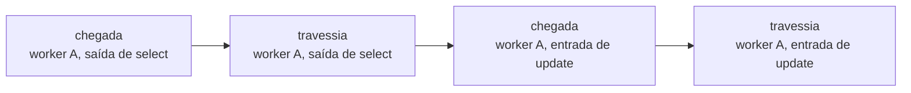
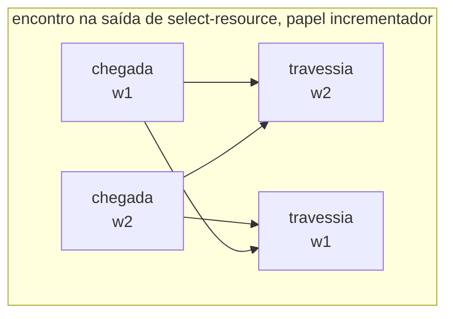
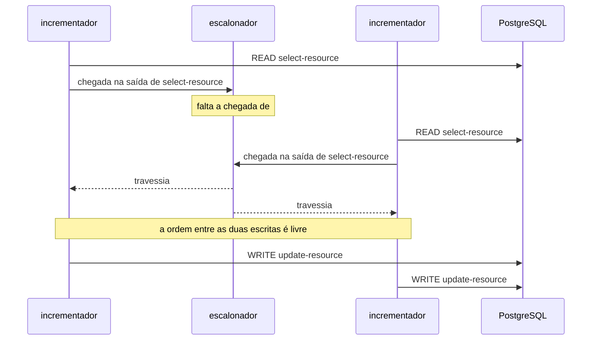

# ADR-0003: A linguagem do agendamento — como uma barreira é declarada

- **Estado:** Proposto
- **Data:** 2026-07-31
- **Etapa do roadmap:** 1
- **Relacionado:** depende do ADR-0001, que fixou o endereço da fronteira e registrou
  esta ausência na seção `## O que este ADR não decide`. Precede a forma do escalonador,
  que consome o que for decidido aqui.

## Vocabulário

Este documento pressupõe três termos do ADR-0001 e não os redefine: **passo**,
**fronteira** e **tentativa**. O endereço canônico de uma fronteira é a tripla (rótulo do
passo, entrada|saída, seletor de tentativa).

Termos que este ADR define:

- **evento** — um instante endereçável da execução, sobre o qual o agendamento fala. Uma
  fronteira produz dois eventos por worker: a **chegada** e a **travessia**.
- **chegada** — o instante em que o worker alcança a fronteira e devolve o controle ao
  runtime.
- **travessia** — o instante em que o escalonador libera aquele worker daquela fronteira.
- **papel** — um nome declarado pelo experimento, com uma cardinalidade. Todo worker
  pertence a um papel.
- **agendamento** — o conjunto de restrições de precedência de um experimento.
- **encontro** — a forma curta que declara que todos os workers de um ou mais papéis
  esperam uns pelos outros numa fronteira.

O ADR-0001 pressupôs **barreira** como "a instrução `pare nesta fronteira`". Neste
documento, a barreira deixa de ser um termo próprio: o que existe é a restrição de
precedência, e a parada é o efeito dela sobre um worker que chegou cedo demais.

## Contexto

O ADR-0001 fixou que o runtime consulta o escalonador em cada fronteira, e fixou como uma
fronteira é endereçada. Ele parou ali, e registrou a parada:

> A decisão não fixa como uma barreira é declarada — se
> `W1.READ → W2.READ → W1.WRITE → W2.WRITE` é uma lista ordenada de endereços, uma
> máquina de estados, ou outra coisa.

Sem essa forma, o E2 não é declarável. O E2 é o experimento que prova que a plataforma
**constrói** a anomalia, e a seção 7 do plano marca a aresta `25 → 1` como pré-requisito:
sem barreiras, o experimento produz "às vezes perde", que é a frase que o engenheiro já
dizia antes de abrir o laboratório.

**Dois experimentos do MVP usam barreira, e apenas dois.** O E1, o E3 e o E4 rodam sob
carga, sem agendamento declarado. O E2 usa dois workers e a ordem
`W1.READ → W2.READ → W1.WRITE → W2.WRITE`. O E5 usa dois workers, cada um lendo a soma
das alocações antes de qualquer inserção. Os dois pedem a mesma estrutura: **todos os
participantes atravessam uma fronteira de leitura antes que qualquer um alcance a
escrita.**

Quatro restrições vêm de decisões já tomadas.

**O agendamento é inspecionável antes da primeira execução.** O ADR-0001 descartou a
alternativa B — ganchos inline no código — por este motivo, e não por contaminação: um
método linear só revela seus pontos de pausa executando, e a definição versionada do
experimento não consegue referenciá-los. Uma linguagem de agendamento que só se conheça
em execução reintroduz o defeito pela outra ponta.

**O agendamento é desligável.** A cláusula de honestidade exige que toda anomalia
produzida com barreiras apareça também sem elas, sob carga alta. O mesmo experimento roda
nas duas condições, e a diferença entre elas DEVE ser o agendamento e nada mais.

**Uma DSL que cresce sob pressão foi descartada uma vez.** O ADR-0001 recusou a
alternativa D — a operação inteira como dado interpretado — porque qualquer passo com
lógica exigiria estender a DSL até ela virar uma linguagem de programação pior que Java.
O agendamento é um dado muito menor que a operação, e o argumento não se transporta
inteiro. Ele transporta o sinal de alerta.

**O seletor de tentativa não tem valor padrão.** Todo endereço de fronteira citado por um
agendamento nomeia em qual tentativa ele vale. O ADR-0001 exige a plataforma rejeitar
`AFTER_READ` sem seletor em operação que possa tentar mais de uma vez.

## Problema

**Qual é a forma de declarar um agendamento, tal que o E2 e o E5 sejam declaráveis, o
agendamento seja legível antes de executar, e um agendamento impossível seja recusado em
vez de travar a execução?**

As forças em conflito:

- Expressividade. Um agendamento que não descreva a intercalação desejada não serve.
- Concisão sob escala. O E4 varia workers de 2 a 50; uma forma que exija uma linha por
  worker não sobrevive a esse eixo, mesmo que o E4 não use barreira hoje.
- Sub-especificação. Declarar mais ordem do que o veredito exige transforma variação
  legítima em falha do experimento.
- Terminação. Um agendamento que espere por um worker que não chega trava a execução
  inteira, e a trava não distingue erro de agendamento de bug do runtime.
- Legibilidade. O agendamento é artefato pedagógico: quem lê o experimento precisa
  entender a anomalia a partir dele.

## Decisão

O agendamento de um experimento é um **conjunto de restrições de precedência entre
eventos**. Uma restrição tem a forma `A antes de B`, onde `A` e `B` são eventos. O
escalonador retém um worker numa fronteira enquanto alguma restrição cujo consequente
seja a travessia daquele worker tiver o antecedente ainda não ocorrido.

### O agendamento fala de eventos, e uma fronteira produz dois

Uma fronteira produz dois eventos por worker: a **chegada** e a **travessia**. A chegada
ocorre quando o worker devolve o controle ao runtime. A travessia ocorre quando o
escalonador o libera.

A relação `chegada antes de travessia`, para o mesmo worker na mesma fronteira, é
estrutural: ela vale sempre, e o agendamento NÃO DEVE declará-la.



### O sujeito de uma restrição é um papel, e o papel tem cardinalidade

O experimento declara papéis. Cada papel tem um nome e uma cardinalidade, e a soma das
cardinalidades é o número de workers do experimento. O agendamento cita papéis, e nunca
índices de worker.

Uma restrição sobre um papel de cardinalidade maior que um vale para **cada** worker
daquele papel.

### O encontro é a forma curta, e ele se expande em precedências

Um encontro nomeia uma fronteira e um ou mais papéis. Ele NÃO DEVE nomear um número de
participantes: a contagem é a soma das cardinalidades dos papéis citados.

Um encontro entre os workers `w1..wn` na fronteira `F` expande para o conjunto de
restrições `chegada(wi, F) antes de travessia(wj, F)`, para todo par com `i ≠ j`.



A expansão não produz ciclo porque chegada e travessia são eventos distintos. `w1` espera
a **chegada** de `w2`, e não a travessia dele.

### O E2 e o E5 declarados

O E2 tem um papel de cardinalidade dois e um encontro:

```
papéis:
  incrementador, cardinalidade 2

agendamento:
  encontro na saída de "select-resource", papel incrementador, tentativa 1
```



O E5 difere no rótulo do passo e no papel. A forma do agendamento é a mesma.

### O que o determinismo garante

O agendamento garante o **veredito**, e não a linha do tempo inteira. Duas execuções do
mesmo experimento com a mesma semente DEVEM produzir o mesmo veredito. Elas PODEM
produzir timelines diferentes nos trechos que nenhuma restrição ordena.

O E2 declara o mínimo que causa a anomalia: as duas leituras antes de qualquer escrita. A
ordem entre as duas escritas fica livre, porque o oráculo do ADR-0002 mede o mesmo valor
nas duas ordens.

### Uma fronteira não citada é atravessada

O escalonador libera o worker em toda fronteira que nenhuma restrição mencione. O
agendamento é um conjunto de exceções sobre execução livre, e não a descrição da execução
inteira.

### O que a plataforma recusa antes de executar

A plataforma DEVE recusar, sem executar nada:

- um agendamento cujo grafo de precedências contenha ciclo;
- uma restrição que cite um papel não declarado pelo experimento;
- uma restrição cujo endereço de fronteira não resolva para nenhum passo da operação,
  conforme o ADR-0001;
- um encontro que cite um único papel de cardinalidade um.

A recusa DEVE nomear a restrição culpada.

### Desligar o agendamento preserva os papéis

O braço sem barreiras da cláusula de honestidade remove as restrições de precedência e
mantém as declarações de papel. Os papéis definem a carga; as restrições definem a ordem.

## Justificativa

**Por que precedência, e não uma sequência total.** O oráculo do ADR-0002 mede o mesmo
resultado nas duas ordens possíveis entre as escritas do E2. Uma sequência total obrigaria
o experimento a declarar essa ordem, e uma execução que a contrariasse falharia por um
motivo que o veredito não observa. A precedência declara a causa da anomalia e cala sobre
o resto — e o que ela cala é informação pedagógica, porque separa o que produz o fenômeno
do que apenas acompanha.

**Por que o encontro existe, mesmo sendo redutível.** A expansão de um encontro entre `n`
workers tem `n × (n − 1)` restrições. O E5 com dois workers tem duas; com cinquenta,
teria duas mil e quatrocentas e cinquenta. A forma curta é o que mantém o eixo de escala
do E4 disponível para experimentos com agendamento, e o custo dela é uma tradução de
quatro linhas dentro do escalonador.

**Por que o encontro não nomeia um número de participantes.** Um encontro que declarasse
`3 participantes` num experimento de dois workers seria um agendamento insatisfatível
escrito à mão, e a plataforma precisaria detectá-lo. Derivar a contagem da cardinalidade
dos papéis elimina a classe inteira de erro, em vez de detectá-la.

**Por que a fronteira produz dois eventos.** Sem a distinção entre chegada e travessia, o
encontro entre dois workers expande para `w1 antes de w2` e `w2 antes de w1`, que é um
ciclo — e ciclo é exatamente o que a plataforma recusa. A distinção não é um refinamento
de vocabulário: sem ela, a forma curta e a semântica escolhida não se conectam.

**Por que os dois eventos já existiam.** O ADR-0001 exige que o runtime observe "o
bloqueio e a liberação numa barreira quando eles acontecem". Bloqueio e liberação são
chegada e travessia. A linguagem fala dos eventos que o log de observações já era obrigado
a registrar, e o replay de um agendamento não precisa de dado novo.

**Por que o papel, e não o índice.** `W1` é posição num arranjo que nenhum documento do
repositório declara. O papel é declarado pelo experimento, sobrevive à mudança do número
de workers, e diz o que aquele worker faz no fenômeno. Um agendamento escrito com papéis
continua legível quando o experimento cresce.

**Por que a cardinalidade fica no papel, e não na restrição.** O E4 varia workers de 2 a
50 sem tocar no agendamento, porque o número vive num lugar só. Se a contagem estivesse na
restrição, cada variação do eixo exigiria editar o agendamento junto, e os dois PODERIAM
divergir.

**Por que a fronteira não citada é atravessada.** As duas leituras produzem experimentos
diferentes, e nenhuma é neutra. "Para por padrão" faria o agendamento descrever a execução
inteira, e nenhum experimento do MVP quer isso: o E2 cita uma fronteira das seis que a
operação tem. O padrão escolhido é o que torna o agendamento curto o bastante para ser
lido.

**Por que a recusa acontece antes de executar.** Uma execução travada é indistinguível de
um bug do runtime, e o laboratório perde o poder de afirmar qualquer coisa sobre o que
mediu. Recusar pelo texto cobre a parte do problema que não depende do resultado da
execução; a parte que depende dele está encaminhada.

## Consequências

### Positivas

- O E2 e o E5 cabem em uma linha de agendamento cada, e a linha diz o que causa a
  anomalia.
- Um experimento com agendamento sobrevive à variação do número de workers. O eixo de
  escala do E4 deixa de ser exclusivo dos experimentos sem barreira.
- A classe de agendamento insatisfatível por contagem errada deixa de existir. Ela não é
  detectada; ela não é escrita.
- O deadlock do cenário 4 é declarável sem estender a linguagem. Ele é um par de
  precedências cruzadas entre travessias de fronteiras diferentes.
- O log de observações não ganha evento novo. Chegada e travessia são o bloqueio e a
  liberação que o ADR-0001 já exige registrar.
- Desligar o agendamento é remover um conjunto e manter outro. A cláusula de honestidade
  compara dois braços cuja única diferença é o conjunto removido.

### Negativas

- **Existem duas notações para a mesma coisa.** Quem lê um experimento precisa saber que o
  encontro é a expansão de um conjunto de precedências, e a leitura de um agendamento
  misto exige as duas.
- **A detecção de ciclo passa a ser código do laboratório.** Ela precisa estar correta
  para que a recusa signifique alguma coisa, e ninguém pediu para estudar detecção de
  ciclo.
- **A timeline do E2 varia entre execuções.** Duas execuções do mesmo experimento
  produzem o mesmo veredito e desenhos diferentes na metade final, e quem compara dois
  relatórios lado a lado precisa saber disso.
- **O experimento ganha uma declaração que antes não tinha.** Todo experimento declara
  papéis, inclusive os três do MVP que não têm agendamento nenhum.
- **A expansão do encontro é quadrática.** Um encontro entre cinquenta workers vira dois
  mil e quatrocentos e cinquenta pares dentro do escalonador, e o custo disso no caminho
  quente do grupo D não foi medido.

### Neutras

- O agendamento passa a ser um artefato do experimento, e não da operação. A definição de
  operação continua sem saber que está sendo medida, e a regra 6 do `arquivo/0006`
  continua verde.
- A palavra "barreira" perde o estatuto de termo próprio. O que existe é a restrição, e a
  parada é o efeito dela.

## Trade-offs

- O benefício **o experimento declara apenas a ordem que causa a anomalia** foi aceito em
  troca do custo **a timeline do E2 varia entre execuções, e só o veredito é estável**.
- O benefício **o E5 cabe em uma linha e sobrevive à variação do número de workers** foi
  aceito em troca do custo **existem duas notações para a mesma restrição, e quem lê
  precisa das duas**.
- O benefício **um agendamento impossível por contagem errada deixa de ser escrevível**
  foi aceito em troca do custo **a contagem some do agendamento, e quem o lê precisa
  consultar a declaração de papéis para saber quantos workers esperam**.
- O benefício **o deadlock é declarável sem estender a linguagem** foi aceito em troca do
  custo **a detecção de ciclo vira código crítico do laboratório**.
- O benefício **o agendamento sobrevive à edição do número de workers** foi aceito em
  troca do custo **todo experimento declara papéis, inclusive os que não têm
  agendamento**.

## Alternativas consideradas

### Alternativa A — sequência total de liberações

O agendamento é uma lista ordenada de pares (worker, endereço de fronteira). O
escalonador mantém um cursor sobre a lista. Um worker atravessa a fronteira em que parou
se, e somente se, o cursor apontar para ele.

O E2 ficaria assim:

```
1. W1 na saída de "select-resource", tentativa 1
2. W2 na saída de "select-resource", tentativa 1
3. W1 na saída de "update-resource", tentativa 1
4. W2 na saída de "update-resource", tentativa 1
```

**Descartada.** É a notação que o briefing e o plano já usam, e a que qualquer leitor
entende sem aprender nada. O escalonador que a executa guarda um inteiro, contra um grafo
na decisão escolhida. O argumento de legibilidade é legítimo.

Ela perde por sobre-especificar. Os itens 3 e 4 fixam uma ordem entre as escritas que o
oráculo do ADR-0002 não observa: nas duas ordens o `value_final` é o mesmo e `perdidas`
vale um. Uma execução que contrariasse a lista falharia sem que nada de errado tivesse
acontecido. Ela também não sobrevive ao eixo de escala: um agendamento sobre cinquenta
workers tem cem linhas escritas à mão, e cada uma nomeia um índice que nenhum documento
declara.

### Alternativa B — apenas restrições de precedência, sem forma curta

O agendamento é o conjunto de restrições, e o encontro não existe. Quem quiser um
encontro escreve os pares.

**Descartada.** Ela tem uma notação só, e o repositório tem uma convenção contra dois
nomes para o mesmo conceito. O argumento é legítimo, e a decisão escolhida paga esse
custo de propósito.

Ela perde pela aritmética da expansão. O E5 com dois workers custa duas restrições; com
cinquenta, duas mil e quatrocentas e cinquenta escritas à mão. O eixo de escala do E4
ficaria fechado para qualquer experimento com agendamento, e a exigência de concisão sob
escala do Problema não seria atendida.

### Alternativa C — apenas encontro, sem precedência explícita

O agendamento é um conjunto de encontros. Cada encontro nomeia uma fronteira e os papéis
que esperam ali. Não existe restrição entre fronteiras diferentes.

**Descartada.** Ela cobre os dois experimentos com barreira do MVP com uma construção só,
recusa agendamento impossível por aritmética, e dispensa a detecção de ciclo inteira. Para
o escopo de hoje, ela é suficiente — e essa suficiência é um argumento real.

Ela perde por fechar o grupo A antes de ele terminar. O cenário 4 é deadlock, e a
intercalação que o produz é uma ordem cruzada entre fronteiras diferentes: `A` trava `X`
antes de `B` travar `X`, e `B` trava `Y` antes de `A` travar `Y`. Nenhum encontro declara
isso. Adotar a alternativa C significaria trocar a linguagem quando o deadlock entrar, e a
troca invalidaria os agendamentos versionados escritos até lá.

### Alternativa D — script imperativo do escalonador

O agendamento é código que dirige a execução: `espere(W1 na saída de select);
libere(W2); espere(W2 na saída de select); libere(W1)`.

**Descartada.** Expressa qualquer intercalação, inclusive as que as outras três não
alcançam, e não precisa de mecanismo novo para o próximo fenômeno.

Ela reproduz o defeito que derrubou a alternativa B do ADR-0001. Um script só revela os
pontos em que para quando executa, e o Experiment Designer da UI não consegue oferecê-los
antes. Ela também move a estrutura de controle para dentro do agendamento, que é a forma
do argumento que derrubou a alternativa D do ADR-0001, deslocada um nível.

## Quando esta decisão deixa de valer

Reveja esta decisão quando um experimento precisar de uma restrição que dependa de um
valor lido em execução. O sinal concreto: um agendamento que queira dizer "libere o
segundo worker apenas se o primeiro tiver lido `version = 1`". Precedência entre eventos
ordena instantes e não inspeciona dados, e uma linguagem que passe a inspecioná-los é
outra decisão.

Reveja a recusa por ciclo quando ela reprovar um agendamento que uma execução mostre
satisfatível. Esse sinal significa que o grafo construído pela expansão não representa a
espera real, e a tradução do encontro é a suspeita principal.

Reveja a expansão quadrática do encontro quando ela aparecer no perfil de um experimento
do grupo D ao lado do trabalho do passo. O sinal é comparativo: a mesma curva de saturação
medida com um encontro de cinquenta participantes e com nenhum, separando-se além do ruído
da medição.

## Questões em aberto

| # | Questão                                                                           | Status            |
|---|-----------------------------------------------------------------------------------|-------------------|
| 1 | Um worker que nunca chega trava o agendamento, e a recusa por texto não o alcança | encaminhado       |
| 2 | Um agendamento sobre uma tentativa que talvez não ocorra                          | encaminhado       |
| 3 | Duas execuções do mesmo experimento não têm critério de igualdade                 | encaminhado       |
| 4 | A proposta de 2026-07-31 retira deste ADR o motivo de existir                     | aberto (crítico)  |

### 1. Um worker que nunca chega trava o agendamento, e a recusa por texto não o alcança

Destino: **a forma do escalonador**, junto de `Q-0001-4`, porque a resposta é a mesma
máquina.

A seção `## Decisão` recusa antes de executar o que o texto do agendamento revela: ciclo,
papel inexistente, endereço que não resolve. Sobra o que o texto não revela.

Um worker morto por falha injetada na fronteira anterior nunca produz a chegada que os
outros esperam. O encontro fica incompleto, e a execução para. O sintoma é idêntico ao de
um bug do runtime e ao de um ciclo que a detecção tivesse deixado passar.

`Q-0001-4` registra o mesmo problema do lado do worker: o runtime precisa notificar o
escalonador de que um worker terminou, por falha, por exceção ou por conclusão. O
agendamento é o consumidor dessa notificação — ele precisa saber que a chegada esperada
não virá, para decidir entre liberar os demais e declarar o experimento inválido. A
escolha entre esses dois não é a mesma pergunta que `Q-0001-4` faz, e ela depende da
resposta daquela.

### 2. Um agendamento sobre uma tentativa que talvez não ocorra

Destino: **a forma do escalonador**, pelo mesmo motivo da questão 1.

O ADR-0001 exige seletor de tentativa em todo endereço de fronteira, sem valor padrão. O
E2 usa uma estratégia sem retry e cita `tentativa 1` sem ambiguidade.

O E4 roda `OPTIMISTIC` com 2 a 50 workers, e o número de tentativas de cada worker é
resultado do experimento, não entrada dele. O E4 não usa agendamento hoje, e a pergunta
continua de pé para o primeiro experimento que combine os dois: um encontro declarado
para a `tentativa 2` de dois workers espera por um worker que PODE ter concluído na
primeira e nunca chegará.

É o caso geral da questão 1, e a diferença importa: aqui a espera impossível não vem de
falha, e sim de sucesso. Nenhuma análise do texto do agendamento a detecta, porque o
texto está correto.

### 3. Duas execuções do mesmo experimento não têm critério de igualdade

Destino: **o log de observações**, que a fila descreve como o substrato do replay, e que
já recebeu `Q-0001-1` pelo lado da identidade da operação.

A seção `## Decisão` fixa que o determinismo garantido é o do veredito, e que a timeline
PODE variar nos trechos que nenhuma restrição ordena. A etapa 12 quer reexecutar um
experimento antigo e obter o mesmo resultado, e "o mesmo resultado" passa a ter duas
leituras possíveis.

Comparar apenas o veredito aceita duas execuções cujas timelines divergem em tudo que o
agendamento não ordena — que é o comportamento desejado, e também o que esconde uma
mudança real de comportamento sob uma coincidência de veredito. Comparar a timeline
inteira reprova execuções corretas, pelo mesmo motivo que derrubou a alternativa A.

O critério provável é intermediário: duas execuções são iguais quando o veredito coincide
e quando a ordem dos eventos **restringidos** coincide. Esse critério não foi verificado
contra nenhum experimento, e ele exige que o log distinga o evento que uma restrição
ordenou do evento que ocorreu livre. Nada hoje exige esse registro.

### 4. A proposta de 2026-07-31 retira deste ADR o motivo de existir

Status: **aberto (crítico)**. Enunciado completo em
[`README.md`](README.md#a-anomalia-por-frequência-uma-proposta-que-muda-o-estatuto-da-barreira).
Em debate no
[ADR-0004](0004-o-estatuto-da-barreira-e-o-diagnostico-da-nao-ocorrencia.md), que propõe
o segundo desfecho.

Este ADR define como uma barreira é declarada. A proposta de 2026-07-31 questiona se a
barreira deve continuar sendo o mecanismo que produz a anomalia. Ela propõe que a
anomalia emerja da frequência de execuções concorrentes, e que a plataforma ganhe
instrumentos para diagnosticar se o erro esperado ocorreu.

Três desfechos daquela proposta incidem sobre este documento, e os três são diferentes.

Se a barreira for **removida**, este ADR fica sem assunto. Ele PODE ser descontinuado
ainda no estado `Proposto`, e o debate registrado aqui vira material da decisão nova.

Se a barreira for **rebaixada a instrumento de diagnóstico** — usada para separar "a
anomalia é impossível nesta configuração" de "a janela não foi atingida" —, a linguagem
decidida aqui continua valendo inteira. O que muda é o estatuto: o agendamento deixa de
ser o caminho pelo qual o E2 produz o resultado, e passa a ser o controle que interpreta
um resultado negativo do E1. A seção `## Contexto` precisa ser reescrita antes da
aceitação, porque ela justifica o ADR pela declarabilidade do E2.

Se a barreira for **mantida como eixo coigual**, este ADR é aceito como está, e a
proposta vira decisão separada sobre o eixo de frequência.

Este ADR NÃO DEVE ser aceito enquanto esta questão estiver aberta. Aceitá-lo congela uma
linguagem cujo consumidor PODE deixar de existir, e um ADR aceito não é editado.
