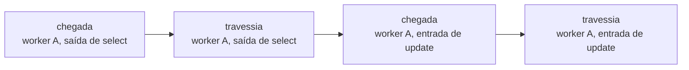
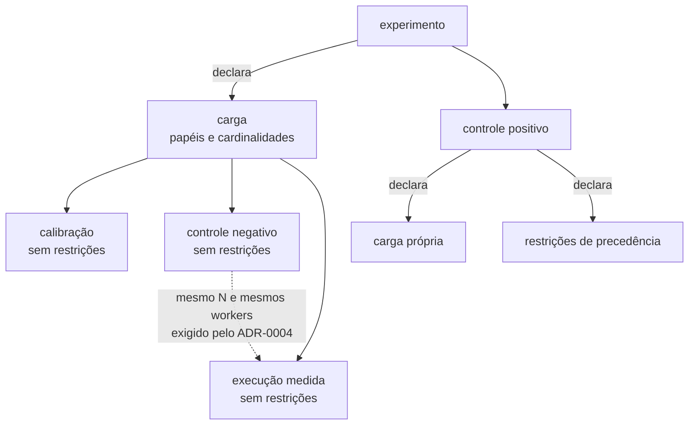
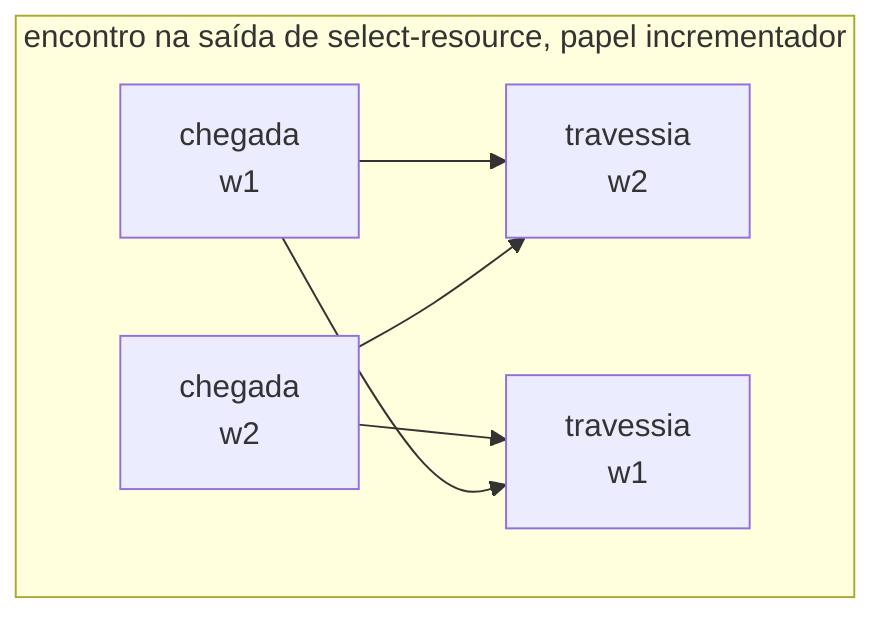
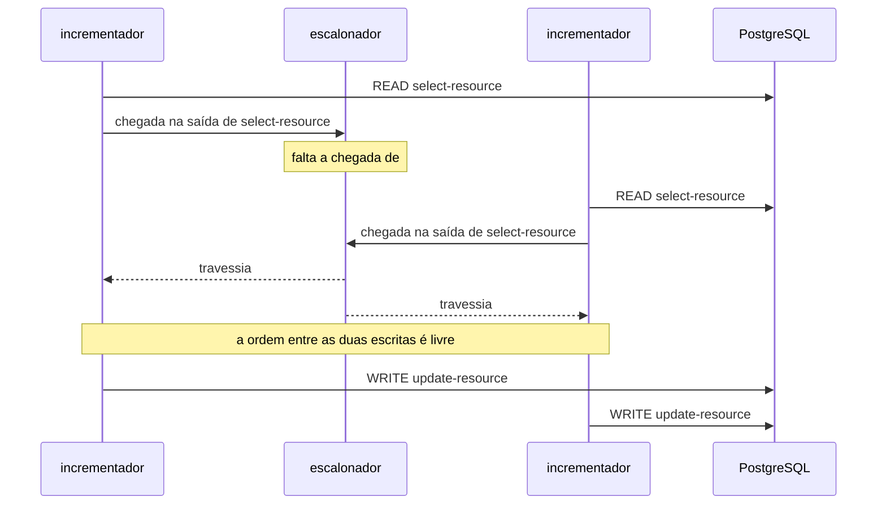
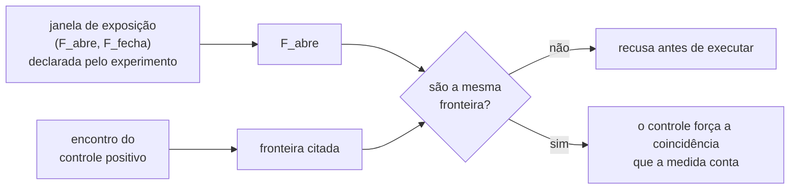

# ADR-0003: A linguagem do agendamento — como uma barreira é declarada

- **Estado:** Aceito
- **Data:** 2026-07-31
- **Aceito em:** 2026-08-01
- **Etapa do roadmap:** 1
- **Relacionado:** depende do ADR-0001, que fixou o endereço da fronteira e registrou
  esta ausência na seção `## O que este ADR não decide`. Depende do ADR-0004, que fixou o
  estatuto do agendamento como execução de controle positivo, e que era o bloqueio da
  aceitação deste documento. **Subsume** a expressão "sobre a mesma configuração" do
  ADR-0004 sem substituí-lo, pela convenção emendada em 2026-07-31
  ([`README.md`](README.md#substituição-e-subsunção-são-coisas-diferentes)). Precede a
  forma do escalonador, que consome o que ele decidiu.
- **Questões que este ADR encaminha:** [`Q-0003-1`](../questions/Q-0003-1.md),
  [`Q-0003-2`](../questions/Q-0003-2.md), [`Q-0003-3`](../questions/Q-0003-3.md) e
  [`Q-0003-8`](../questions/Q-0003-8.md), na seção `## Questões encaminhadas` de
  [`README.md`](README.md).

## Vocabulário

Este documento pressupõe três termos do ADR-0001 e não os redefine: **passo**,
**fronteira** e **tentativa**. O endereço canônico de uma fronteira é a tripla (rótulo do
passo, entrada|saída, seletor de tentativa).

Do ADR-0004, ele pressupõe **execução medida**, **execução de controle** e **janela de
exposição**, e não os redefine.

Termos que este ADR define:

- **evento** — um instante endereçável da execução, sobre o qual o agendamento fala. Uma
  fronteira produz dois eventos por worker: a **chegada** e a **travessia**.
- **chegada** — o instante em que o worker alcança a fronteira e devolve o controle ao
  runtime.
- **travessia** — o instante em que o escalonador libera aquele worker daquela fronteira.
- **papel** — um nome com uma cardinalidade, declarado por quem declara a carga. Todo
  worker pertence a um papel.
- **carga** — a declaração de papéis de uma execução.
- **agendamento** — o conjunto de restrições de precedência de uma execução.
- **encontro** — a forma curta que declara que todos os workers de um ou mais papéis
  esperam uns pelos outros numa fronteira.

O ADR-0001 pressupôs **barreira** como "a instrução `pare nesta fronteira`". Neste
documento, a barreira deixa de ser um termo próprio: o que existe é a restrição de
precedência, e a parada é o efeito dela sobre um worker que chegou cedo demais.

## Contexto

O ADR-0001 fixou que o runtime consulta o escalonador em cada fronteira, e fixou como uma
fronteira é endereçada. Ele parou ali, e registrou a parada:

> A decisão não fixa como uma barreira é declarada — se
> `W1.READ → W2.READ → W1.WRITE → W2.WRITE` é uma lista ordenada de endereços, uma
> máquina de estados, ou outra coisa.

O ADR-0004 trocou quem precisa dessa forma. A execução medida de um experimento roda
**sem agendamento**, e a anomalia reportada emerge da frequência de tentativas
concorrentes. O agendamento passa a existir como **execução de controle positivo**: ela
roda quando uma execução medida termina com zero violações e com coincidências próprias
maiores que zero, e separa "a anomalia é impossível nesta configuração" de "a anomalia é
rara demais para o `N` declarado".

O consumidor mudou; a necessidade não. Sem a linguagem, a execução de controle não é
declarável, e o veredito `exposição insuficiente` não tem como ser produzido. O caminho
que o ADR-0004 desenhou para classificar um zero termina numa intercalação que ninguém
sabe escrever.

**Nenhum experimento do MVP declara agendamento na execução medida.** O E1, o E3, o E4 e
o E5 rodam sob carga. O agendamento entra depois, quando o resultado de um deles é zero
com exposição sobrevivente. Para a atualização perdida e para a leitura das alocações do
E5, a estrutura pedida é a mesma: **todos os participantes atravessam uma fronteira de
leitura antes que qualquer um alcance a escrita.**

Cinco restrições vêm de decisões já tomadas.

**O agendamento é inspecionável antes da primeira execução.** O ADR-0001 descartou a
alternativa B — ganchos inline no código — por este motivo, e não por contaminação: um
método linear só revela seus pontos de pausa executando, e a definição versionada do
experimento não consegue referenciá-los. Uma linguagem de agendamento que só se conheça
em execução reintroduz o defeito pela outra ponta.

**O agendamento é desligável, e desligado é o estado normal.** O ADR-0004 proíbe o
agendamento de produzir o resultado que um experimento reporta. O mesmo experimento roda
nas duas condições, e a diferença entre a execução medida e a execução de controle DEVE
ser o agendamento e nada mais.

**Duas execuções de um experimento têm a carga amarrada uma à outra, e o controle positivo
não é uma delas.** O ADR-0004 exige o mesmo `N`, o mesmo número de workers e a mesma
operação entre o **controle negativo** e a **execução medida**, porque ele compara as
contagens de coincidência das duas. Sobre o controle positivo ele diz apenas "sobre a
mesma configuração", sem nomear o que a expressão alcança.

**Uma DSL que cresce sob pressão foi descartada uma vez.** O ADR-0001 recusou a
alternativa D — a operação inteira como dado interpretado — porque qualquer passo com
lógica exigiria estender a DSL até ela virar uma linguagem de programação pior que Java.
O agendamento é um dado muito menor que a operação, e o argumento não se transporta
inteiro. Ele transporta o sinal de alerta.

**O seletor de tentativa não tem valor padrão.** Todo endereço de fronteira citado por um
agendamento nomeia em qual tentativa ele vale. O ADR-0001 exige a plataforma rejeitar
`AFTER_READ` sem seletor em operação que possa tentar mais de uma vez.

## Problema

**Qual é a forma de declarar um agendamento, tal que a execução de controle positivo do
ADR-0004 seja declarável, o agendamento seja legível antes de executar, e um agendamento
impossível seja recusado em vez de travar a execução?**

As forças em conflito:

- Expressividade. Um agendamento que não descreva a intercalação desejada não serve.
- Concisão sob escala. O E4 varia workers de 2 a 50, e o número de participantes de um
  agendamento é escolha de quem escreve o experimento; uma forma que exija uma linha por
  worker não sobrevive a esse eixo.
- Sub-especificação. Declarar mais ordem do que o veredito exige transforma variação
  legítima em falha do experimento.
- Terminação. Um agendamento que espere por um worker que não chega trava a execução
  inteira, e a trava não distingue erro de agendamento de bug do runtime.
- Legibilidade. O agendamento é artefato pedagógico: quem lê o experimento precisa
  entender a anomalia a partir dele.

## Decisão

O agendamento de uma **execução de controle** é um **conjunto de restrições de precedência
entre eventos**. Uma restrição tem a forma `A antes de B`, onde `A` e `B` são eventos. O
escalonador retém um worker numa fronteira enquanto alguma restrição cujo consequente
seja a travessia daquele worker tiver o antecedente ainda não ocorrido.

### O agendamento fala de eventos, e uma fronteira produz dois

Uma fronteira produz dois eventos por worker: a **chegada** e a **travessia**. A chegada
ocorre quando o worker devolve o controle ao runtime. A travessia ocorre quando o
escalonador o libera.

A relação `chegada antes de travessia`, para o mesmo worker na mesma fronteira, é
estrutural: ela vale sempre, e o agendamento NÃO DEVE declará-la.



### O sujeito de uma restrição é um papel, e o papel tem cardinalidade

Uma carga é uma declaração de papéis. Cada papel tem um nome e uma cardinalidade, e a soma
das cardinalidades é o número de workers da execução. O agendamento cita papéis, e nunca
índices de worker.

Uma restrição sobre um papel de cardinalidade maior que um vale para **cada** worker
daquele papel.

### Quem declara a carga, e quem declara o agendamento

Um experimento tem quatro execuções, e o ADR-0004 nomeia as quatro: a calibração do
ADR-0002, o controle negativo, a execução medida e o controle positivo. Apenas a última
tem agendamento.

O **experimento** declara uma carga, e a calibração, o controle negativo e a execução
medida rodam sobre ela. É a carga que o ADR-0004 exige idêntica entre as duas últimas,
porque a comparação entre as contagens de coincidência delas depende disso.

O **controle positivo** declara uma carga própria, pelas razões da subseção seguinte.

Cada **execução** declara as próprias restrições de precedência. Uma execução cujo
conjunto de restrições é vazio é uma execução sem agendamento, e é o caso das três
primeiras.



### A execução de controle declara a própria carga, com uma passagem por worker

A execução de controle positivo DEVE declarar os próprios papéis. Ela NÃO DEVE herdar os
papéis do experimento.

Cada worker de uma execução de controle executa **uma** execução de operação. A plataforma
DEVE recusar uma execução de controle cuja carga declare mais de uma execução de operação
por worker.

A cardinalidade é livre acima de dois. A execução de controle declara quantos workers usa,
e a plataforma DEVE recusar um controle cuja soma de cardinalidades seja menor que dois.

O controle positivo é uma prova de possibilidade, e não uma medida. Ele responde se a
anomalia é alcançável naquela operação, sob aquela estratégia e sob aquele nível de
isolamento. "A mesma configuração", no ADR-0004, alcança esses três; ela não alcança o
`N` nem o número de workers da execução medida.

### O encontro é a forma curta, e ele se expande em precedências

Um encontro nomeia uma fronteira e um ou mais papéis. Ele NÃO DEVE nomear um número de
participantes: a contagem é a soma das cardinalidades dos papéis citados.

Um encontro entre os workers `w1..wn` na fronteira `F` expande para o conjunto de
restrições `chegada(wi, F) antes de travessia(wj, F)`, para todo par com `i ≠ j`.



A expansão não produz ciclo porque chegada e travessia são eventos distintos. `w1` espera
a **chegada** de `w2`, e não a travessia dele.

### O controle positivo da atualização perdida, declarado

A execução de controle da atualização perdida declara um papel e um encontro. O exemplo
usa cardinalidade dois, que é o mínimo que produz o fenômeno. Um controle que declare
cinco incrementadores escreve o mesmo agendamento, e o encontro passa a reter cinco
workers.

```
execução de controle positivo:
  papéis:
    incrementador, cardinalidade 2

  agendamento:
    encontro na saída de "select-resource", papel incrementador, tentativa 1
```



O controle positivo do E5 difere no rótulo do passo e no papel. A forma do agendamento é a
mesma.

### O que o determinismo garante

O agendamento garante o **veredito**, e não a linha do tempo inteira. Duas execuções de
controle do mesmo experimento com a mesma semente DEVEM produzir o mesmo veredito. Elas
PODEM produzir timelines diferentes nos trechos que nenhuma restrição ordena.

A garantia não alcança a execução medida. Ela roda sem restrição nenhuma, e o veredito
dela é uma taxa que a concorrência real produz — a semente não a fixa.

O controle positivo da atualização perdida declara o mínimo que causa a anomalia: as duas
leituras antes de qualquer escrita. A ordem entre as duas escritas fica livre, porque o
oráculo do ADR-0002 mede o mesmo valor nas duas ordens.

### Uma fronteira não citada é atravessada

O escalonador libera o worker em toda fronteira que nenhuma restrição mencione. O
agendamento é um conjunto de exceções sobre execução livre, e não a descrição da execução
inteira.

### O que a plataforma recusa antes de executar

A plataforma DEVE recusar, sem executar nada:

- um agendamento cujo grafo de precedências contenha ciclo;
- uma restrição que cite um papel não declarado pela execução;
- uma restrição cujo endereço de fronteira não resolva para nenhum passo da operação,
  conforme o ADR-0001;
- um encontro que cite um único papel de cardinalidade um;
- uma execução de controle cuja carga declare mais de uma execução de operação por worker;
- uma execução de controle cuja soma de cardinalidades seja menor que dois;
- um encontro de uma execução de controle positivo que não esteja na fronteira `F_abre` da
  janela de exposição declarada pelo experimento.

A recusa DEVE nomear a restrição culpada.

A última recusa vale apenas quando o experimento declara janela de exposição. O ADR-0004 a
exige de todo experimento cujo veredito PODE ser zero, que é o conjunto inteiro do MVP. Um
fenômeno cuja intercalação não caiba num par de fronteiras — o deadlock do cenário 4 é o
caso — não declara janela, e o encontro dele não é validado contra nada.



### Uma execução sem agendamento continua tendo carga

A execução medida do ADR-0004 não declara restrição de precedência nenhuma, e roda sobre a
carga do experimento. A carga diz quantos workers existem; as restrições dizem em que
ordem eles avançam. As duas declarações são independentes, e a ausência de uma não afeta a
outra.

## Justificativa

**Por que precedência, e não uma sequência total.** O oráculo do ADR-0002 mede o mesmo
resultado nas duas ordens possíveis entre as escritas de dois workers. Uma sequência total
obrigaria o experimento a declarar essa ordem, e uma execução que a contrariasse falharia
por um motivo que o veredito não observa. A precedência declara a causa da anomalia e cala
sobre o resto — e o que ela cala é informação pedagógica, porque separa o que produz o
fenômeno do que apenas acompanha.

**Por que o encontro existe, mesmo sendo redutível.** A expansão de um encontro entre `n`
workers tem `n × (n − 1)` restrições. O E5 com dois workers tem duas; com cinquenta,
teria duas mil e quatrocentas e cinquenta. A forma curta é o que mantém o eixo de escala
do E4 disponível para experimentos com agendamento, e o custo dela é uma tradução de
quatro linhas dentro do escalonador.

**Por que o encontro não nomeia um número de participantes.** Um encontro que declarasse
`3 participantes` num experimento de dois workers seria um agendamento insatisfatível
escrito à mão, e a plataforma precisaria detectá-lo. Derivar a contagem da cardinalidade
dos papéis elimina a classe inteira de erro, em vez de detectá-la.

**Por que a fronteira produz dois eventos.** Sem a distinção entre chegada e travessia, o
encontro entre dois workers expande para `w1 antes de w2` e `w2 antes de w1`, que é um
ciclo — e ciclo é exatamente o que a plataforma recusa. A distinção não é um refinamento
de vocabulário: sem ela, a forma curta e a semântica escolhida não se conectam.

**Por que os dois eventos já existiam.** O ADR-0001 exige que o runtime observe "o
bloqueio e a liberação numa barreira quando eles acontecem". Bloqueio e liberação são
chegada e travessia. A linguagem fala dos eventos que o log de observações já era obrigado
a registrar, e o replay de um agendamento não precisa de dado novo.

**Por que o papel, e não o índice.** `W1` é posição num arranjo que nenhum documento do
repositório declara. O papel é declarado junto da carga, sobrevive à mudança do número de
workers, e diz o que aquele worker faz no fenômeno. Um agendamento escrito com papéis
continua legível quando o experimento cresce.

**Por que a cardinalidade fica no papel, e não na restrição.** O E4 varia workers de 2 a
50 sem tocar no agendamento, porque o número vive num lugar só. Se a contagem estivesse na
restrição, cada variação do eixo exigiria editar o agendamento junto, e os dois PODERIAM
divergir.

**Por que a fronteira não citada é atravessada.** As duas leituras produzem experimentos
diferentes, e nenhuma é neutra. "Para por padrão" faria o agendamento descrever a execução
inteira, e nenhum controle do MVP quer isso: o da atualização perdida cita uma fronteira
das seis que a operação tem. O padrão escolhido é o que torna o agendamento curto o
bastante para ser lido.

**Por que a carga do experimento é uma só.** O ADR-0004 exige que o controle negativo e a
execução medida declarem o mesmo `N` e o mesmo número de workers, porque ele compara as
contagens de coincidência das duas. Uma carga declarada duas vezes pode divergir; uma
carga declarada uma vez, não. A exigência vira propriedade da estrutura, e deixa de
depender de alguém conferir dois números.

**Por que as restrições ficam na execução.** Elas não entram naquela comparação, e três
das quatro execuções não têm nenhuma. Pendurá-las no experimento obrigaria cada execução a
dizer se usa ou não o agendamento declarado acima dela; pendurá-las na execução faz a
ausência ser o conjunto vazio, que é o caso comum e não precisa de marca.

**Por que o controle positivo não herda a carga da execução medida.** Ele é uma prova de
possibilidade. A pergunta que ele responde é "esta estratégia impede a anomalia por
construção?", e a resposta não muda com o número de workers: se a intercalação mais
favorável ao fenômeno não o produz com dois workers, ela não o produz com cinquenta.
Herdar a carga importaria o problema que a herança não resolve — dez workers atravessando
a mesma fronteira cem vezes cada não tornam a prova mais forte, e obrigam a linguagem a
dizer em qual das cem passagens o encontro dispara.

**Por que uma execução de operação por worker.** É a restrição que mantém o encontro
inequívoco. Com uma passagem, o endereço da fronteira identifica um evento por worker, e o
seletor de tentativa do ADR-0001 basta para desambiguar o retry. Com duas ou mais, o
endereço passa a identificar um conjunto de eventos, e a linguagem precisaria de um
segundo eixo de seleção que ela não tem. A restrição não custa expressividade ao controle:
a anomalia que ele prova acontece dentro de uma passagem.

**Por que a cardinalidade do controle é livre acima de dois.** Dois workers é o mínimo que
produz uma coincidência, e a plataforma recusa menos que isso por aritmética. Acima do
mínimo o número é escolha de quem escreve o experimento, e o encontro já sobrevive à
variação — é a mesma propriedade que mantém o eixo de escala do E4 disponível. Fixar o
controle em dois trocaria uma recusa aritmética por uma proibição sem motivo técnico.

**Por que o encontro é validado contra a janela, e não derivado dela.** As duas falam do
mesmo par de instantes, e a derivação eliminaria a divergência de vez. Ela custaria caro:
um encontro derivado só existe onde existe janela, e a janela é um par de fronteiras da
mesma operação. O deadlock do cenário 4 é uma ordem cruzada entre fronteiras
diferentes, e nenhuma janela o descreve — é o argumento que derrubou a
alternativa C, e derivar o encontro o reintroduziria pela porta dos fundos. A validação
fecha a mesma lacuna sem fechar a linguagem: onde há janela, o encontro DEVE cair em
`F_abre`; onde não há, a liberdade continua.

**Por que a recusa acontece antes de executar.** Uma execução travada é indistinguível de
um bug do runtime, e o laboratório perde o poder de afirmar qualquer coisa sobre o que
mediu. Recusar pelo texto cobre a parte do problema que não depende do resultado da
execução; a parte que depende dele está encaminhada.

## Consequências

### Positivas

- Os controles positivos da atualização perdida e do E5 cabem em uma linha de agendamento
  cada, e a linha diz o que causa a anomalia.
- Uma execução de controle sobrevive à variação do próprio número de workers. Subir a
  cardinalidade de dois para cinquenta não altera uma linha do agendamento.
- A classe de agendamento insatisfatível por contagem errada deixa de existir. Ela não é
  detectada; ela não é escrita.
- O deadlock do cenário 4 é declarável sem estender a linguagem. Ele é um par de
  precedências cruzadas entre travessias de fronteiras diferentes.
- O log de observações não ganha evento novo. Chegada e travessia são o bloqueio e a
  liberação que o ADR-0001 já exige registrar.
- A pergunta "em qual passagem o encontro dispara" deixa de existir. Com uma execução de
  operação por worker, o endereço da fronteira identifica um evento por worker.
- Um controle positivo declarado fora da janela de exposição é recusado antes de executar.
  A divergência entre as duas declarações deixa de produzir veredito.
- A execução medida não precisa de marca própria para dizer que não tem agendamento. Ela
  é a execução cujo conjunto de restrições é vazio.
- A carga e o agendamento são declarações independentes. Uma execução sem restrição
  nenhuma não é um caso especial da linguagem, e sim o conjunto vazio dela.

### Negativas

- **Existem duas notações para a mesma coisa.** Quem lê um experimento precisa saber que o
  encontro é a expansão de um conjunto de precedências, e a leitura de um agendamento
  misto exige as duas.
- **A detecção de ciclo passa a ser código do laboratório.** Ela precisa estar correta
  para que a recusa signifique alguma coisa, e ninguém pediu para estudar detecção de
  ciclo.
- **A timeline de uma execução de controle varia entre execuções.** Duas execuções do
  mesmo controle produzem o mesmo veredito e desenhos diferentes na metade final, e quem
  compara dois relatórios lado a lado precisa saber disso.
- **O experimento ganha uma declaração que antes não tinha.** Os papéis são escritos
  mesmo nas execuções que não têm agendamento nenhum, e a execução medida é a mais comum
  delas.
- **A expansão do encontro é quadrática.** Um encontro entre cinquenta workers vira dois
  mil e quatrocentos e cinquenta pares dentro do escalonador, e o custo disso no caminho
  quente do grupo D não foi medido.
- **O experimento passa a declarar duas cargas.** A da execução medida e a do controle
  positivo são escritas à mão, em lugares diferentes, e a plataforma não verifica se as
  duas descrevem o mesmo fenômeno. Um controle com dois workers ao lado de uma medida com
  cinquenta é aceito sem comentário.
- **A prova de possibilidade depende de quem escreve saber quantos participantes o
  fenômeno exige.** Um fenômeno que só apareça com três workers recebe veredito negativo
  num controle de dois, e o veredito `protegido` sai errado sem que nada falhe.
- **Os dois relatórios de um mesmo experimento descrevem cargas diferentes.** Quem lê o
  controle positivo ao lado da execução medida precisa saber que o número de workers e o
  `N` não coincidem, e que apenas a operação, a estratégia e o isolamento coincidem.
- **A validação do encontro depende de uma declaração de outro documento.** Um experimento
  sem janela de exposição declarada perde a guarda inteira, e nada aqui obriga a janela a
  existir — a obrigação é do ADR-0004, e ela alcança só o experimento cujo veredito PODE
  ser zero.

### Neutras

- O agendamento passa a ser um artefato de uma execução, e não da operação. A definição de
  operação continua sem saber que está sendo medida, e a regra 6 do `arquivo/0006`
  continua verde.
- A palavra "barreira" perde o estatuto de termo próprio. O que existe é a restrição, e a
  parada é o efeito dela.
- A expressão "sobre a mesma configuração", da seção `### A barreira é o controle
  positivo` do ADR-0004, ganha alcance nomeado: a operação, a estratégia e o nível de
  isolamento. Este ADR **subsume** aquela regra, e não a substitui — ela continua valendo
  sem mudança para tudo que decide se o controle positivo roda, que é a condição sobre
  violações e coincidências próprias da execução medida. O que este documento acrescenta é
  a carga sobre a qual ele roda, que aquela regra não nomeava.

## Trade-offs

- O benefício **o controle declara apenas a ordem que causa a anomalia** foi aceito em
  troca do custo **a timeline dele varia entre execuções, e só o veredito é estável**.
- O benefício **o controle do E5 cabe em uma linha e sobrevive à variação do número de
  workers** foi aceito em troca do custo **existem duas notações para a mesma restrição, e
  quem lê precisa das duas**.
- O benefício **um agendamento impossível por contagem errada deixa de ser escrevível**
  foi aceito em troca do custo **a contagem some do agendamento, e quem o lê precisa
  consultar a declaração de papéis para saber quantos workers esperam**.
- O benefício **o deadlock é declarável sem estender a linguagem** foi aceito em troca do
  custo **a detecção de ciclo vira código crítico do laboratório**.
- O benefício **o agendamento sobrevive à edição do número de workers** foi aceito em
  troca do custo **toda execução declara papéis, inclusive as que não têm agendamento**.
- O benefício **o encontro permanece inequívoco sem um segundo eixo de endereçamento** foi
  aceito em troca do custo **a execução de controle não roda sob a carga da execução
  medida, e o experimento passa a declarar duas cargas que ninguém compara**.
- O benefício **a divergência entre o encontro e a janela de exposição deixa de produzir
  veredito** foi aceito em troca do custo **a validação existe apenas onde há janela, e o
  fenômeno sem janela declarada continua sem guarda nenhuma**.
- O benefício **uma carga declarada uma vez não diverge de si mesma** foi aceito em troca
  do custo **o agendamento e os papéis passam a viver em níveis diferentes, e quem lê um
  experimento consulta os dois para saber o que roda**.

## Alternativas consideradas

### Alternativa A — sequência total de liberações

O agendamento é uma lista ordenada de pares (worker, endereço de fronteira). O
escalonador mantém um cursor sobre a lista. Um worker atravessa a fronteira em que parou
se, e somente se, o cursor apontar para ele.

O controle positivo da atualização perdida ficaria assim:

```
1. W1 na saída de "select-resource", tentativa 1
2. W2 na saída de "select-resource", tentativa 1
3. W1 na saída de "update-resource", tentativa 1
4. W2 na saída de "update-resource", tentativa 1
```

**Descartada.** É a notação que o briefing e o plano já usam, e a que qualquer leitor
entende sem aprender nada. O escalonador que a executa guarda um inteiro, contra um grafo
na decisão escolhida. O argumento de legibilidade é legítimo.

Ela perde por sobre-especificar. Os itens 3 e 4 fixam uma ordem entre as escritas que o
oráculo do ADR-0002 não observa: nas duas ordens o `value_final` é o mesmo e `perdidas`
vale um. Uma execução que contrariasse a lista falharia sem que nada de errado tivesse
acontecido. Ela também não sobrevive ao eixo de escala: um agendamento sobre cinquenta
workers tem cem linhas escritas à mão, e cada uma nomeia um índice que nenhum documento
declara.

### Alternativa B — apenas restrições de precedência, sem forma curta

O agendamento é o conjunto de restrições, e o encontro não existe. Quem quiser um
encontro escreve os pares.

**Descartada.** Ela tem uma notação só, e o repositório tem uma convenção contra dois
nomes para o mesmo conceito. O argumento é legítimo, e a decisão escolhida paga esse
custo de propósito.

Ela perde pela aritmética da expansão. O E5 com dois workers custa duas restrições; com
cinquenta, duas mil e quatrocentas e cinquenta escritas à mão. O eixo de escala do E4
ficaria fechado para qualquer experimento com agendamento, e a exigência de concisão sob
escala do Problema não seria atendida.

### Alternativa C — apenas encontro, sem precedência explícita

O agendamento é um conjunto de encontros. Cada encontro nomeia uma fronteira e os papéis
que esperam ali. Não existe restrição entre fronteiras diferentes.

**Descartada.** Ela cobre os dois controles positivos do MVP com uma construção só,
recusa agendamento impossível por aritmética, e dispensa a detecção de ciclo inteira. Para
o escopo de hoje, ela é suficiente — e essa suficiência é um argumento real.

Ela perde por fechar o grupo A antes de ele terminar. O cenário 4 é deadlock, e a
intercalação que o produz é uma ordem cruzada entre fronteiras diferentes: `A` trava `X`
antes de `B` travar `X`, e `B` trava `Y` antes de `A` travar `Y`. Nenhum encontro declara
isso. Adotar a alternativa C significaria trocar a linguagem quando o deadlock entrar, e a
troca invalidaria os agendamentos versionados escritos até lá.

### Alternativa D — script imperativo do escalonador

O agendamento é código que dirige a execução: `espere(W1 na saída de select);
libere(W2); espere(W2 na saída de select); libere(W1)`.

**Descartada.** Expressa qualquer intercalação, inclusive as que as outras três não
alcançam, e não precisa de mecanismo novo para o próximo fenômeno.

Ela reproduz o defeito que derrubou a alternativa B do ADR-0001. Um script só revela os
pontos em que para quando executa, e o Experiment Designer da UI não consegue oferecê-los
antes. Ela também move a estrutura de controle para dentro do agendamento, que é a forma
do argumento que derrubou a alternativa D do ADR-0001, deslocada um nível.

### Alternativa E — o controle positivo herda a carga da execução medida

A execução de controle roda com os mesmos papéis e o mesmo `N` da execução medida. O
encontro dispara na primeira passagem de cada worker, ou em todas.

**Descartada.** É a leitura literal de "sobre a mesma configuração", no ADR-0004, e ela
tem um argumento real: o controle e a medida passam a ser comparáveis linha a linha, e
nenhum leitor precisa saber que as cargas diferem. A declaração de carga do experimento
também ficaria única.

Ela perde por exigir um eixo de endereçamento que a linguagem não tem. Um worker que
executa cem operações atravessa a mesma fronteira cem vezes, e o endereço do ADR-0001
identifica as cem. Disparar na primeira deixa noventa e nove passagens livres dentro de
uma execução que existe para forçar uma ordem, e a violação observada PODE ter vindo de
qualquer uma delas — o controle deixaria de provar o que existe para provar. Disparar em
todas transforma a execução em rodadas sincronizadas, e o primeiro worker a esgotar seu
quinhão trava as rodadas seguintes, que é a [`Q-0003-1`](../questions/Q-0003-1.md)
promovida de acidente a caminho normal.

### Alternativa F — derivar o encontro da janela de exposição

O controle positivo deixa de ser escrito. A plataforma o gera a partir do par
`(F_abre, F_fecha)` que o ADR-0004 já obriga o experimento a declarar: um encontro em
`F_abre`, com os papéis do controle.

**Descartada.** Ela elimina a divergência entre as duas declarações em vez de detectá-la,
que é a forma que este ADR já preferiu uma vez, ao derivar a contagem do encontro da
cardinalidade dos papéis. Quem escreve o experimento passaria a declarar a janela e nada
mais.

Ela perde por fechar a linguagem no mesmo ponto em que a alternativa C a fechava. Um
encontro derivado só existe onde existe janela, e a janela é um par de fronteiras da mesma
operação. O deadlock do cenário 4 é uma ordem cruzada entre fronteiras diferentes, e
nenhum par o descreve. Adotar a derivação significaria reescrever a
linguagem quando o deadlock entrasse, e a reescrita invalidaria os controles versionados
escritos até lá.

### Alternativa G — um seletor de passagem ao lado do seletor de tentativa

O endereço de fronteira ganha um quarto componente: a enésima execução de operação daquele
worker dentro da execução do experimento. O encontro passa a declarar em quais passagens
dispara, e o controle positivo pode herdar a carga da execução medida.

**Descartada.** É a solução completa do problema que a alternativa E não resolve, e a
única que permitiria um agendamento sobre uma execução de carga alta. O dia em que um
fenômeno precisar disso, é esta a saída.

Ela perde pelo custo cobrado agora contra o uso previsto agora. Nenhum experimento do MVP
precisa de um agendamento sobre carga alta, porque o controle positivo é prova de
possibilidade. O quarto componente entraria em **todo** endereço de fronteira do
repositório, inclusive nos que o ADR-0001 já reconhece como verbosos: a seção
`## Consequências` daquele documento registra o terceiro componente como custo aceito a
contragosto. É a DSL que cresce sob pressão, cujo sinal de alerta a seção `## Contexto`
deste ADR registra.

## Quando esta decisão deixa de valer

Reveja esta decisão quando um experimento precisar de uma restrição que dependa de um
valor lido em execução. O sinal concreto: um agendamento que queira dizer "libere o
segundo worker apenas se o primeiro tiver lido `version = 1`". Precedência entre eventos
ordena instantes e não inspeciona dados, e uma linguagem que passe a inspecioná-los é
outra decisão.

Reveja a recusa por ciclo quando ela reprovar um agendamento que uma execução mostre
satisfatível. Esse sinal significa que o grafo construído pela expansão não representa a
espera real, e a tradução do encontro é a suspeita principal.

Reveja a expansão quadrática do encontro quando ela aparecer no perfil de um experimento
do grupo D ao lado do trabalho do passo. O sinal é comparativo: a mesma curva de saturação
medida com um encontro de cinquenta participantes e com nenhum, separando-se além do ruído
da medição.

Reveja a regra de uma execução de operação por worker quando um controle positivo precisar
de duas passagens do mesmo worker para exibir o fenômeno. O sinal concreto: uma
intercalação cuja declaração cite duas vezes a mesma fronteira do mesmo papel. A
alternativa G é a saída, e ela cobra um quarto componente em todo endereço do repositório.

Reveja a carga própria do controle positivo quando um veredito `protegido` for contrariado
por uma execução medida da mesma estratégia com mais workers. Esse sinal significa que a
prova de possibilidade com carga menor respondeu por uma configuração que ela não
alcançava, e a herança da carga volta à mesa.
