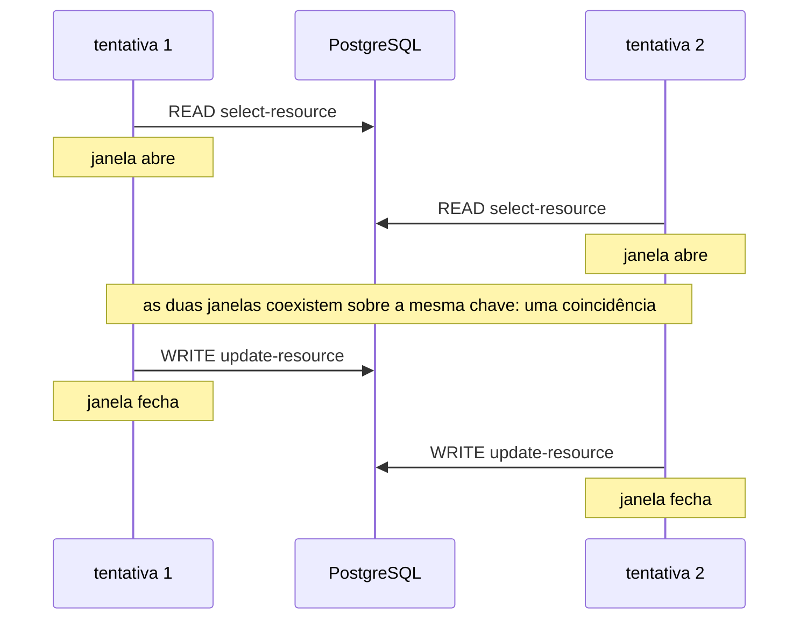
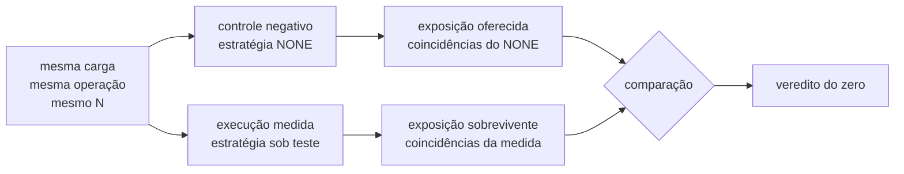
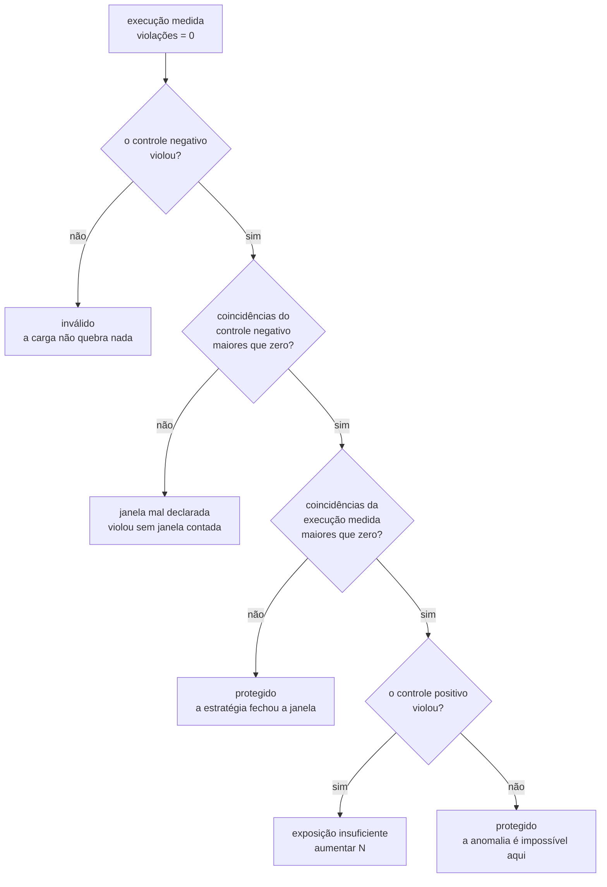
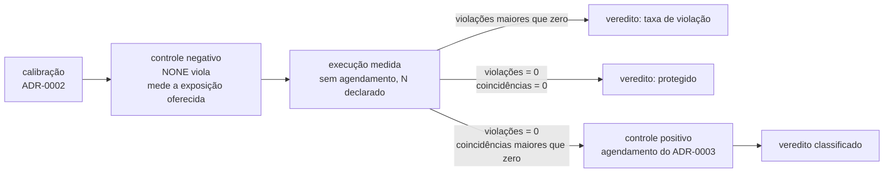

# ADR-0004: O estatuto da barreira e o diagnóstico da não ocorrência

- **Estado:** Aceito
- **Data:** 2026-08-01
- **Etapa do roadmap:** 1
- **Relacionado:** depende do ADR-0001, que fixou o passo e escreveu a cláusula de
  honestidade, e do ADR-0002, que fixou o oráculo exato e a execução de calibração.
  Bloqueia o ADR-0003, cuja questão 4 aponta para cá. **Subsume** a cláusula de
  honestidade do ADR-0001 sem substituí-lo, pela convenção emendada em 2026-07-31
  ([`README.md`](README.md#substituição-e-subsunção-são-coisas-diferentes)).
  Enunciado da proposta em
  [`README.md`](README.md#a-anomalia-por-frequência-uma-proposta-que-muda-o-estatuto-da-barreira).
- **Questões que este ADR encaminha:** [`Q-0004-2`](../questions/Q-0004-2.md) a
  [`Q-0004-5`](../questions/Q-0004-5.md) e [`Q-0004-8`](../questions/Q-0004-8.md), na
  seção `## Questões encaminhadas` de [`README.md`](README.md).

## Vocabulário

Este documento pressupõe **passo**, **fronteira** e **tentativa** do ADR-0001, e
**agendamento** do ADR-0003. Ele define cinco termos.

- **execução medida** — a execução cujo resultado o experimento reporta.
- **tentativa lançada** — uma tentativa que o runtime iniciou. Ela termina em commit ou
  em aborto, e apenas a primeira saída conta como `commits`.
- **janela de exposição** — o intervalo, dentro de uma tentativa, em que a anomalia é
  possível. O experimento a declara como um par ordenado de fronteiras da operação.
- **coincidência** — um par de tentativas cujas janelas de exposição se sobrepõem no
  tempo.
- **execução de controle** — uma execução que não é reportada como resultado, e que
  existe para interpretar o resultado de uma execução medida.

## Contexto

O plano do laboratório separou o E1 do E2 por estatuto epistêmico. O E1 roda cem
incrementos com dez workers sem agendamento, e prova que o laboratório **detecta**. O E2
roda dois workers com a intercalação `W1.READ → W2.READ → W1.WRITE → W2.WRITE` imposta
pelo escalonador, e prova que o laboratório **constrói**.

A seção 4 do plano registra a aresta `25 → 1` com este argumento: "o lost update precisa
ser demonstrado, não sorteado. Sem barreiras, o experimento produz *às vezes perde* — que
é a mesma frase que o engenheiro já dizia antes de abrir o laboratório."

O argumento tem um ponto cego, e ele fica visível quando o experimento não produz a
anomalia. O E2 sempre produz, porque o escalonador a impõe. O E1 produz ou não, e o plano
cobre um lado dessa incerteza: "este experimento precisa falhar. Se `value == 100`, a
carga é insuficiente e nenhum resultado posterior significa nada." A regra vale para o
grupo de controle, cuja estratégia é `NONE`. Ela não diz nada sobre o E3, onde
`ATOMIC_UPDATE`, `OPTIMISTIC` e `PESSIMISTIC` **devem** chegar a cem.

O E3 é o experimento que compara estratégias, e o resultado dele para três das quatro é
um zero. Nada no repositório diz o que um zero significa.

Quatro restrições vêm de decisões já tomadas.

**O oráculo do ADR-0002 é uma contagem, não um predicado.**
`perdidas = commits − (value_final − value_inicial)`, onde `commits` conta passagens pela
fronteira `AFTER_COMMIT`. Uma contagem tem denominador, e portanto tem taxa.

**Toda execução medida exige calibração antes.** O ADR-0002 exige uma execução com uma
estratégia sem perda, em que `commits` iguale `value_final − value_inicial`.

**A cláusula de honestidade do ADR-0001 é normativa e está `Aceito`.** "Toda anomalia
reproduzida com barreiras DEVE aparecer **também** sem barreiras, sob carga alta. Uma
anomalia que apareça só com barreiras indica que o runtime fabricou o fenômeno, e o
experimento não vale."

**O runtime observa cada fronteira no instante em que o evento ocorre.** O ADR-0001 exige
o registro por passo, com o número da tentativa. O log de observações já contém os
instantes de que uma medida de sobreposição precisa.

## Problema

**O que um experimento afirma quando não observa a anomalia?**

Hoje a resposta é o silêncio. Um relatório com zero violações tem quatro leituras, e o
laboratório não separa nenhuma:

1. a anomalia é impossível naquela configuração — a estratégia protege;
2. a anomalia é possível e a janela nunca abriu, porque a carga não gerou concorrência;
3. a anomalia é possível, a janela abriu, e nenhuma execução caiu dentro dela;
4. a anomalia ocorreu e o oráculo não a viu, porque ele lê o estado final parado.

A primeira leitura é o resultado que o experimento busca. As outras três são defeitos do
instrumento com a mesma aparência no relatório.

As forças em conflito:

- Fidelidade. Um resultado produzido por intercalação imposta descreve o escalonador do
  laboratório, e não o comportamento do sistema sob carga.
- Poder de afirmação. Um resultado que só diz "não vi" não sustenta a comparação entre
  estratégias que o E3 existe para fazer.
- Terminação. Uma busca pela anomalia que rode até encontrá-la não termina quando a
  anomalia é impossível.
- Custo de execução. O laboratório nasce entregando, e cada execução ocupa tempo de
  pipeline.
- Honestidade do instrumento. Um número que pareça uma medida sem ser uma medida é pior
  que a ausência do número.

## Decisão

A execução medida de um experimento roda **sem agendamento**. A anomalia emerge da
frequência de tentativas concorrentes. O agendamento NÃO DEVE produzir o resultado que um
experimento reporta.

### O veredito de uma execução medida é uma taxa

Uma execução medida produz três contagens, e nenhuma delas substitui as outras:

- **tentativas lançadas**, o `N` que o experimento declara antes de executar;
- **commits**, as passagens pela fronteira `AFTER_COMMIT`, definidas pelo ADR-0002;
- **violações**, a saída do oráculo do ADR-0002.

O veredito é a **taxa de violação**, `violações / commits`. O relatório DEVE exibir as
três contagens, e NÃO DEVE exibir apenas a razão entre duas delas.

O relatório DEVE exibir também a **taxa de aborto**, `(N − commits) / N`. Uma estratégia
que protege abortando paga o custo nesse número, e a taxa de violação sozinha não o
mostra.

Quando `violações = 0`, o relatório DEVE declarar o limite superior da taxa a 95% de
confiança, que fica em torno de `3 / commits`. O limite é calculado sobre `commits`, e
NÃO DEVE ser calculado sobre `N`: uma tentativa abortada nunca poderia violar, e
incluí-la no denominador afirmaria mais do que a execução observou.

### O experimento declara o número de tentativas antes de executar

Uma execução medida DEVE declarar `N` antes de começar. Ela NÃO DEVE parar na primeira
violação, e NÃO DEVE prosseguir além de `N` porque nenhuma violação apareceu. As duas
paradas condicionais tornam `N` função do resultado, e a taxa deixa de medir o sistema.

### O experimento declara uma janela de exposição

Um experimento cujo veredito PODE ser zero DEVE declarar uma **janela de exposição**: um
par ordenado de fronteiras da operação, `(F_abre, F_fecha)`. A janela de uma tentativa é
o intervalo entre o instante em que ela atravessa `F_abre` e o instante em que ela alcança
`F_fecha`.

Para a atualização perdida, a janela vai da fronteira de saída de `select-resource` até a
fronteira de entrada de `update-resource`. Duas tentativas cujas janelas se sobrepõem
leram o mesmo valor antes que qualquer uma gravasse.

### A plataforma conta coincidências

O runtime DEVE contar, ao fim de uma execução medida, o número de pares distintos de
tentativas cujas janelas de exposição se sobrepõem. A contagem é derivada do log de
observações, e o sistema sob teste NÃO DEVE participar dela.

A contagem de coincidências mede a **oportunidade**. A contagem de violações mede a
**consequência**. Um relatório DEVE trazer as duas.

O runtime DEVE contar coincidências em **toda** execução, medida ou de controle. A
contagem do controle negativo mede a exposição que a carga **oferece**, porque ali
nenhuma estratégia interfere. A contagem da execução medida mede a exposição que
**sobra** depois que a estratégia agiu.

A distinção entre as duas é o que classifica um zero. Uma estratégia que serializa as
tentativas — `SELECT ... FOR UPDATE` é o caso — fecha a janela por construção, e produz
zero coincidências protegendo. Sem a contagem do controle negativo, esse zero é
indistinguível de uma carga que nunca gerou concorrência.

As duas contagens só são comparáveis quando as duas execuções declaram a mesma carga: o
mesmo `N`, o mesmo número de workers e a mesma operação. A plataforma NÃO DEVE comparar
contagens de execuções cuja carga declarada diferir.

### A janela é qualificada por uma chave de contenção

Duas janelas sobrepostas no tempo formam coincidência apenas quando disputam o mesmo
alvo. O passo DEVE reportar uma **chave de contenção** entre os fatos que ele já devolve
ao runtime, e o runtime a registra sem interpretá-la, do mesmo jeito que registra
`version` e `rowsAffected`.

Um par de tentativas com janelas sobrepostas e chaves de contenção diferentes NÃO DEVE
ser contado como coincidência.

A chave é opaca ao runtime. A comparação entre duas chaves é igualdade por valor, pelo
critério que o ADR-0002 fixou para valores ligados num traço de SQL.

### O zero é classificado, e a classificação tem quatro valores

Quando `violações = 0`, a plataforma DEVE classificar o resultado em um de quatro
veredictos. As condições DEVEM ser avaliadas na ordem da tabela, e o primeiro caso que
casar produz o veredito. A ordem é normativa: duas condições PODEM casar ao mesmo tempo,
e a de cima descreve um defeito que torna a de baixo ilegível.

| Ordem | Condição                                                               | Veredito                 |
|-------|------------------------------------------------------------------------|--------------------------|
| 1     | o controle negativo não viola                                          | `inválido`               |
| 2     | o controle negativo viola, e as coincidências dele são zero            | `janela mal declarada`   |
| 3     | as coincidências da execução medida são zero                           | `protegido`              |
| 4     | as coincidências são maiores que zero, e o controle positivo viola     | `exposição insuficiente` |
| 5     | as coincidências são maiores que zero, e o controle positivo não viola | `protegido`              |

`inválido`, `janela mal declarada` e `exposição insuficiente` NÃO DEVEM ser reportados
como evidência de proteção. `protegido` é o único veredito que sustenta a comparação
entre estratégias.

A ordem 2 é a guarda da declaração. Uma violação exige que a janela real tenha aberto, e
o controle negativo viola por definição. Se a contagem de coincidências dele der zero, o
par `(F_abre, F_fecha)` declarado pelo experimento não delimita a janela em que a
anomalia acontece. O número está errado, e todo veredito derivado dele também.

A ordem 3 dispensa o controle positivo. A carga ofereceu exposição, a estratégia a
eliminou, e a eliminação **é** a proteção — não há o que desempatar. É o caso de
`SELECT ... FOR UPDATE`, e é também o caso em que o controle positivo não poderia ser
executado: a intercalação que ele impõe exige uma leitura concorrente que o lock impede.

### A barreira é o controle positivo

O agendamento definido pelo ADR-0003 passa a existir como **execução de controle**. Ela
roda quando uma execução medida termina com `violações = 0` e com coincidências
**próprias** maiores que zero, sobre a mesma configuração, com a intercalação que causa a
anomalia declarada.

A condição sobre as coincidências próprias é o que impede o controle positivo de rodar
onde ele travaria. Uma estratégia que eliminou a exposição chega ao veredito `protegido`
pela ordem 3 da tabela, sem que a barreira seja executada.

Uma execução de controle NÃO DEVE ser reportada como resultado do experimento. Ela
responde uma pergunta sobre o resultado, e não produz resultado.

O ciclo completo de uma execução:

### O E2 deixa de ser um experimento do MVP

O E2 é a execução de controle positivo do E1 e do E3, e não uma linha própria na lista de
experimentos. O MVP passa de cinco experimentos para quatro. O plano do laboratório,
seções 6 e 7, DEVE ser atualizado no mesmo commit em que este ADR for aceito.

### A alta resolução deixa de ser opcional para quem PODE reportar zero

Uma operação em baixa resolução é uma sequência de um passo, sem fronteiras internas.
Nela, `(F_abre, F_fecha)` não tem onde ser ancorado, e a contagem de coincidências não
existe. Um experimento cujo veredito PODE ser zero DEVE rodar em alta resolução.

O eixo de resolução do ADR-0001 continua valendo. O que muda é qual braço serve a quê: a
alta resolução deixa de servir à barreira e passa a servir à medida de exposição.

## Justificativa

**Por que a taxa, e não o booleano.** O oráculo do ADR-0002 já produz uma contagem, e um
booleano descarta informação que a contagem tem. Duas execuções com uma e com trezentas
atualizações perdidas dizem coisas diferentes sobre a mesma estratégia, e o booleano as
iguala. A comparação entre estratégias do E3 é uma comparação de magnitude.

**Por que a exposição precisa de contagem própria.** A consequência sozinha não distingue
"não aconteceu" de "não pôde acontecer". Contar a oportunidade separa as duas com um
número derivado do log que o ADR-0001 já obriga a existir, e sem tocar no sistema sob
teste. É a diferença entre um experimento que afirma e um que se cala.

**Por que a exposição de referência vem do controle negativo.** A contagem da execução
medida mede a exposição depois que a estratégia agiu, e uma estratégia correta age
reduzindo exatamente esse número. Ler esse zero como falha de carga condenaria a
estratégia mais protetora ao veredito que descreve um experimento quebrado. O braço
`NONE` roda a mesma carga sem proteção nenhuma, e por isso ele responde o que a carga
oferece — a pergunta que a execução medida, por construção, não pode responder sobre si
mesma.

**Por que o veredito `sem exposição` desapareceu.** Ele nomeava a carga que nunca abriu
a janela, e o controle negativo já detecta esse caso: uma carga que não gera concorrência
não faz `NONE` violar, e o resultado é `inválido` antes de qualquer contagem. O que
ocupou o lugar vago é `janela mal declarada`, que nomeia um defeito que nenhum veredito
anterior separava — o experimento declarou o par de fronteiras errado, e a contagem de
coincidências ficou cega sem que nada falhasse.

**Por que três contagens, e não uma razão.** `N` e `commits` divergem exatamente quando
a estratégia aborta, e abortar é o mecanismo de proteção da estratégia otimista. Uma
tabela comparativa com um denominador só apagaria o custo dessa proteção: dois braços com
taxa de violação zero, um deles descartando metade do trabalho, ocupariam células
idênticas. A taxa de aborto é o preço, e o E3 existe para pôr preço e benefício lado a
lado.

**Por que a chave de contenção é um fato reportado, e não um dado extraído.** A chave vive
dentro do corpo do passo, e o ADR-0001 proíbe o runtime de inspecionar esse corpo. O mesmo
ADR já abre o caminho de saída: o passo reporta um conjunto de fatos, e o runtime os
registra sem interpretá-los. A chave entra por esse caminho, e nenhuma proibição é
contornada. A alternativa seria o runtime ler o SQL para descobrir qual linha a tentativa
disputa — que é a alternativa D do ADR-0001 voltando pela porta dos fundos.

**Por que a janela é declarada, e não inferida.** O runtime não inspeciona o corpo do
passo — é a decisão do ADR-0001, e ela impede inferir onde a anomalia é possível.
Declarar o par de fronteiras mantém o conhecimento do fenômeno no experimento, que é
onde ele já está: quem escreve o experimento sabe que a atualização perdida mora entre a
leitura e a escrita.

**Por que a barreira sobrevive como controle.** Um zero com exposição alta tem duas
causas, e nenhuma contagem as separa: a anomalia é impossível, ou ela é rara demais para
`N`. A intercalação forçada responde por construção — ela produz a anomalia se a anomalia
existir. É o espelho exato do controle negativo que o repositório já exige: um exige que
`NONE` falhe, o outro exige que a intercalação que causa o fenômeno o produza.

**Por que o controle não é reportado.** O argumento da aresta `25 → 1` continua correto
sobre o que ele afirma: um resultado produzido por intercalação imposta descreve o
escalonador. A decisão não o contradiz; ela retira do resultado o que aquele argumento
critica, e mantém a intercalação onde ela não contamina — do lado da interpretação.

**Por que a cláusula de honestidade do ADR-0001 continua satisfeita.** A cláusula exige
que toda anomalia reproduzida com barreiras apareça também sem elas. Sob esta decisão, a
anomalia reportada é **sempre** produzida sem barreiras, e a exigência fica atendida por
construção. A falha que a cláusula existe para pegar — o runtime fabricando o fenômeno
pelo agendamento — deixa de ser alcançável pelo caminho que ela vigiava. A questão 1
registra o que sobra dessa relação.

**Por que `N` é declarado antes.** Parar na primeira violação produz uma taxa cujo
numerador é sempre um. Rodar até violar produz uma execução que não termina quando a
estratégia protege — que é o caso do E3 em três dos quatro braços. Nas duas paradas, `N`
passa a ser função do resultado, e a razão deixa de estimar a taxa do sistema.

**Por que o limite superior aparece no relatório.** Sem ele, "zero violações em cem
tentativas" e "zero violações em um milhão" ocupam a mesma linha da tabela comparativa e
afirmam a mesma coisa. Com ele, os dois relatórios dizem números diferentes, e a
diferença é a força da afirmação.

**Por que a alta resolução vira obrigatória para quem PODE reportar zero.** A medida de
exposição depende de fronteira interna, e a baixa resolução não tem nenhuma. A exigência
não é uma preferência de estilo: um experimento em baixa resolução com veredito zero é
um número sem diagnóstico possível.

## Consequências

### Positivas

- Um resultado zero passa a afirmar alguma coisa. `protegido` sustenta a tabela
  comparativa do E3, que hoje registraria três zeros indistinguíveis de três falhas de
  carga.
- A comparação entre estratégias ganha magnitude. `NONE` com trezentas perdas e `NONE`
  com uma perda deixam de ocupar a mesma célula.
- O laboratório mede o que o engenheiro vive. A anomalia aparece pela frequência, que é
  o modo pelo qual ela aparece em produção.
- A contagem de coincidências não custa instrumento novo. Ela é derivada do log de
  observações que o ADR-0001 já exige, e o sistema sob teste continua sem saber que está
  sendo medido.
- O passo do ADR-0001 ganha uma segunda justificativa. Ele deixa de depender apenas da
  barreira, cujo estatuto esta decisão rebaixa.
- O MVP encolhe de cinco experimentos para quatro, e o que sai é o experimento cujo
  resultado era garantido por construção.
- A falha de carga vira um veredito nomeado em vez de um zero silencioso. `inválido` e
  `janela mal declarada` dizem ao autor do experimento o que consertar.
- A estratégia que protege serializando recebe o veredito que descreve o que ela faz. Um
  zero de coincidências deixa de ser suspeita de carga fraca quando o controle negativo
  mostrou que a carga expunha.
- A declaração da janela de exposição ganha uma verificação que ninguém precisa lembrar
  de rodar. O controle negativo viola e conta coincidências ao mesmo tempo, e a
  divergência entre os dois números denuncia o par de fronteiras errado.
- O custo da proteção aparece no relatório. A taxa de aborto separa a estratégia que
  evita a anomalia da que a evita descartando trabalho.

### Negativas

- **Toda execução com resultado zero e exposição sobrevivente custa duas execuções.** O
  controle positivo roda depois, sobre a mesma configuração. A estratégia que zera as
  coincidências escapa desse custo, e a que apenas reduz a probabilidade, não.
- **A exposição de referência exige que duas execuções declarem a mesma carga.** A
  comparação entre a contagem do controle negativo e a da execução medida só significa
  algo sob `N`, número de workers e operação idênticos. A plataforma verifica a igualdade
  do que foi declarado, e não a do que aconteceu: dois runners com carga de máquina
  diferente produzem contagens diferentes com a mesma declaração.
- **O experimento ganha uma declaração nova e obrigatória.** A janela de exposição é um
  par de fronteiras que alguém escreve à mão, e uma janela declarada errada produz uma
  contagem de coincidências errada — que classifica o zero errado, sem erro nenhum.
- **A contagem de coincidências depende de um fato que o passo reporta.** Um passo que
  não reporte a chave de contenção produz uma contagem que o runtime não sabe estar
  errada, e o zero é classificado a partir dela. Ver a questão 2.
- **A contagem de coincidências compara instantes entre threads.** Ela depende de o log
  de observações carregar um instante comparável entre workers, e nenhum documento do
  repositório decidiu qual relógio produz esse instante. Ver a questão 3.
- **O veredito ganha um terceiro formato.** A fila previa booleano e curva. Taxa com
  limite de confiança tem um número e uma incerteza, e a incerteza precisa caber no
  relatório e na comparação entre execuções.
- **A execução medida é probabilística dentro de um pipeline que precisa ficar verde.**
  Um `N` pequeno produz falha intermitente; um `N` grande ocupa tempo de execução. A
  tensão 2 do plano chama a falha intermitente de o pior resultado possível num
  instrumento de medida. Ver a questão 4.
- **O laboratório perde o experimento que provava que ele constrói a anomalia.** O E2
  vira controle, e o controle não é reportado. A capacidade continua existindo; a linha
  no relatório que a exibia, não.
- **Um experimento em baixa resolução deixa de poder reportar zero.** O braço
  `@Transactional`, que o ADR-0001 manteve como o código que um engenheiro escreveria,
  serve apenas a experimentos cujo veredito é uma violação observada.

### Neutras

- O ADR-0003 continua valendo inteiro. O que muda é quem consome o agendamento: a
  execução de controle, e não a execução medida.
- A calibração do ADR-0002 não muda de forma. Ela ganha dois parentes na mesma família, e
  a família passa a ter nome.
- O controle negativo muda de papel sem mudar de forma. Ele já era exigido, e já rodava
  `NONE` sobre a mesma carga. O que muda é que a contagem de coincidências dele passa a
  ser lida, em vez de descartada.
- O número de tentativas passa a ser entrada declarada do experimento, ao lado da
  semente. Ele já era um número escolhido por alguém; a mudança é que agora ele é
  escrito antes.

## Trade-offs

- O benefício **um resultado zero passa a afirmar `protegido` em vez de calar** foi
  aceito em troca do custo **uma execução com resultado zero e exposição sobrevivente
  custa uma segunda execução**.
- O benefício **a estratégia que fecha a janela é lida como protegida, e não como
  experimento quebrado** foi aceito em troca do custo **a exposição de referência passa a
  vir de outra execução, e a comparação depende de uma igualdade de carga que a
  plataforma verifica na declaração, não no que ocorreu**.
- O benefício **o custo da proteção por aborto aparece no relatório** foi aceito em troca
  do custo **a tabela comparativa do E3 passa a ter cinco colunas de números, e quem a lê
  precisa saber qual delas responde qual pergunta**.
- O benefício **a plataforma separa "não aconteceu" de "não pôde acontecer"** foi aceito
  em troca do custo **todo experimento declara uma janela de exposição, e uma janela
  errada classifica o zero errado sem produzir erro**.
- O benefício **o resultado reportado descreve o sistema sob carga, e não o escalonador
  do laboratório** foi aceito em troca do custo **o experimento que provava que a
  plataforma constrói a anomalia sai da lista de experimentos**.
- O benefício **duas execuções com magnitudes diferentes deixam de ocupar a mesma célula
  da tabela** foi aceito em troca do custo **o veredito ganha um terceiro formato, e a
  comparação entre execuções precisa lidar com incerteza**.
- O benefício **`N` declarado antes faz a taxa estimar o sistema** foi aceito em troca do
  custo **a execução não para ao encontrar a violação, e paga `N` tentativas mesmo quando
  a primeira já respondeu a pergunta**.
- O benefício **a medida de exposição não toca no sistema sob teste** foi aceito em troca
  do custo **ela exige alta resolução, e o braço `@Transactional` deixa de poder reportar
  zero**.
- O benefício **a coincidência distingue tentativas que disputam o mesmo alvo das que
  apenas coexistem no tempo** foi aceito em troca do custo **a chave de contenção vira
  responsabilidade de quem escreve a operação, e o runtime não enxerga quando ela
  falta**.

## Alternativas consideradas

### Alternativa A — remover a barreira do laboratório

O agendamento sai, o ADR-0003 é descontinuado ainda `Proposto`, e o E2 deixa de existir.
A plataforma afirma apenas o que observou, e um zero é reportado como zero.

**Descartada.** Ela tem o argumento mais forte a favor entre as quatro: uma máquina a
menos, um ADR a menos, e nenhuma dúvida sobre qual execução produziu o resultado. A
detecção de ciclo do ADR-0003, que vira código crítico sem que ninguém tenha pedido para
estudar detecção de ciclo, também desaparece.

Ela perde porque deixa a pergunta do Problema sem resposta. Com a barreira fora, a única
ferramenta contra um zero é aumentar `N`, e aumentar `N` nunca distingue "a anomalia é
impossível" de "a anomalia é rara". As três estratégias corretas do E3 produziriam zeros
que o laboratório não conseguiria diferenciar de uma carga fraca — que é exatamente o
defeito que a regra do grupo de controle existe para impedir do outro lado. Ela também
descarta a exigência do cenário 25, marcada como particularmente importante no briefing,
sem substituí-la por nada.

### Alternativa B — manter a barreira como produtora e acrescentar a frequência

O E2 continua reportando o resultado que a intercalação imposta produz. A execução por
frequência entra como experimento adicional.

**Descartada.** É a alternativa que preserva tudo que já foi aceito, e não exige emenda
nenhuma ao plano. O E2 continua sendo a demonstração visual que o briefing pede.

Ela perde por não atender o pedido que originou esta decisão. O resultado reportado
continua vindo de uma intercalação fabricada, e o zero da execução por frequência
continua sem interpretação. As duas execuções produziriam dois relatórios sobre o mesmo
fenômeno sem nenhuma regra que os relacione — e a regra que os relaciona é a decisão que
está sendo tomada aqui.

### Alternativa C — frequência e barreira como eixos coiguais

Os dois viram resoluções do experimento, do mesmo jeito que o ADR-0001 fez com alta e
baixa resolução da operação. Todo experimento roda nos dois braços.

**Descartada.** A simetria com o eixo de resolução do ADR-0001 é um argumento real: o
repositório já tem um eixo dessa forma, e um segundo eixo com a mesma mecânica custa
pouco a quem já entendeu o primeiro.

Ela perde por não dizer de onde vem o veredito. O eixo de resolução do ADR-0001 tem uma
regra que o fecha — a cláusula de honestidade exige que os dois braços concordem, e a
prova de equivalência verifica que são a mesma operação. Aqui os dois braços **não**
concordam por construção: a intercalação imposta produz a anomalia sempre, e a execução
por frequência produz às vezes. Um eixo cujos dois braços discordam sempre precisa de uma
regra de precedência, e essa regra é a decisão escolhida, escrita de outro jeito.

### Alternativa D — repetição adaptativa, sem métrica de exposição e sem controle

A execução aumenta `N` até observar a anomalia ou até esgotar um orçamento de tempo. O
zero passa a vir acompanhado do `N` alcançado.

**Descartada.** Ela não exige instrumento novo nenhum, e é a resposta que aparece
primeiro quando alguém pensa no problema. O `N` alcançado até carrega informação: um zero
em um milhão de tentativas afirma mais que um zero em cem.

Ela perde em dois pontos. O primeiro é a terminação: quando a estratégia protege, o laço
roda até o orçamento acabar, e o orçamento passa a ser o número que o relatório reporta —
uma medida da máquina, não do sistema. O segundo é que gastar orçamento não distingue
"a janela nunca abriu" de "a janela abriu e nada aconteceu". Um pool de conexões que
serialize os workers produz um zero com orçamento esgotado, e o relatório o exibe como
evidência de proteção.

### Alternativa E — decidir se a anomalia é possível por análise, sem executar

Um verificador de entrelaçamentos analisa a operação e responde se a anomalia é
alcançável naquela configuração, sem rodar carga nenhuma.

**Descartada.** Ela responderia a pergunta do Problema de forma exata, e não por
amostragem — que é mais do que a decisão escolhida entrega.

Ela perde pelo mesmo argumento que derrubou a alternativa D do ADR-0001. Analisar a
operação exige interpretar o SQL e modelar o comportamento do PostgreSQL sob cada nível
de isolamento. O objeto de estudo passaria a ser o modelo, e o E5 existe justamente para
mostrar que a intuição sobre o modelo está errada: uma proteção presente e inerte é
invisível para quem raciocina sobre a anotação em vez de executar.

### Alternativa F — o controle positivo desempata todo resultado zero

A exposição continua sendo contada apenas na execução medida, e o caminho de coincidências
zero passa a consultar a barreira antes de concluir. Um zero com exposição zero deixaria de
ser lido como carga fraca, porque a barreira responderia por construção.

**Descartada.** Ela resolve o problema com um instrumento que a decisão já tem, sem
introduzir a comparação entre duas execuções que a escolha exige. Nenhuma declaração nova
recai sobre quem escreve o experimento.

Ela perde por não ser executável no caso que a motivou. A barreira impõe uma intercalação
que o lock pessimista torna inalcançável: o escalonador espera `W2.READ`, e `W2.READ` está
bloqueado no lock que `W1` segura. O controle positivo trava exatamente na estratégia cujo
zero ele existiria para classificar, e o protocolo de desistência que decidiria o desfecho
pertence à decisão do escalonador, que ainda não foi tomada. A alternativa também cobra o
custo da segunda execução em todo resultado zero, e não apenas nos que restam ambíguos.

### Alternativa G — um denominador único para a taxa

A taxa de violação divide sempre pelo mesmo número: ou pelas coincidências, e passa a
responder "dado que a janela abriu, com que frequência a anomalia ocorreu"; ou por `N`, e
as quatro estratégias do E3 dividem pelo mesmo valor declarado.

**Descartada.** As duas produzem uma tabela comparativa com uma coluna a menos, e a
divisão por `N` torna as células comparáveis por construção — que é a propriedade que uma
tabela de comparação quer.

Dividir pelas coincidências perde a comparabilidade entre configurações: duas execuções
com exposições diferentes produzem razões que não se relacionam, e a estratégia que zera
as coincidências produz uma razão indefinida. Dividir por `N` conta populações diferentes
no numerador e no denominador, porque uma tentativa abortada nunca poderia violar — e
apaga do relatório o custo da proteção otimista, que é metade do que o E3 existe para
mostrar.

## Quando esta decisão deixa de valer

Reveja esta decisão quando um fenômeno tiver janela de exposição que um par de fronteiras
da mesma operação não expresse. O sinal concreto está no grupo E: a posse por lease abre
uma janela que começa numa operação e termina num relógio, e nenhum par de fronteiras a
delimita.

Reveja a contagem de coincidências quando ela ficar alta e a taxa de violação ficar zero
num fenômeno que o controle positivo prove possível, de forma repetida. Esse sinal
significa que a janela declarada não é a janela real, e a declaração vira a suspeita
principal.

Reveja a exigência de declarar `N` antes quando o custo de `N` tentativas no pipeline
passar do tempo que a entrega contínua tolera, medido e não estimado. Nesse ponto a
escolha entre falha intermitente e execução longa precisa ser feita de novo, com o número
na mesa.

Reveja a exposição de referência quando duas execuções com a mesma carga declarada
produzirem contagens de coincidências que diferem por ordem de grandeza. O sinal
significa que a igualdade declarada não implica a igualdade observada, e o veredito
`protegido` da ordem 3 passa a depender de uma comparação sem base.

## Patches aplicados

Nenhum patch aplicado.

O regime de patch está em [`README.md`](README.md#a-revogação-da-imutabilidade-decidida-em-2026-08-07).
Um patch conserta citação, caminho ou erro material; ele NÃO DEVE alterar a decisão nem o
argumento que a sustentava.
