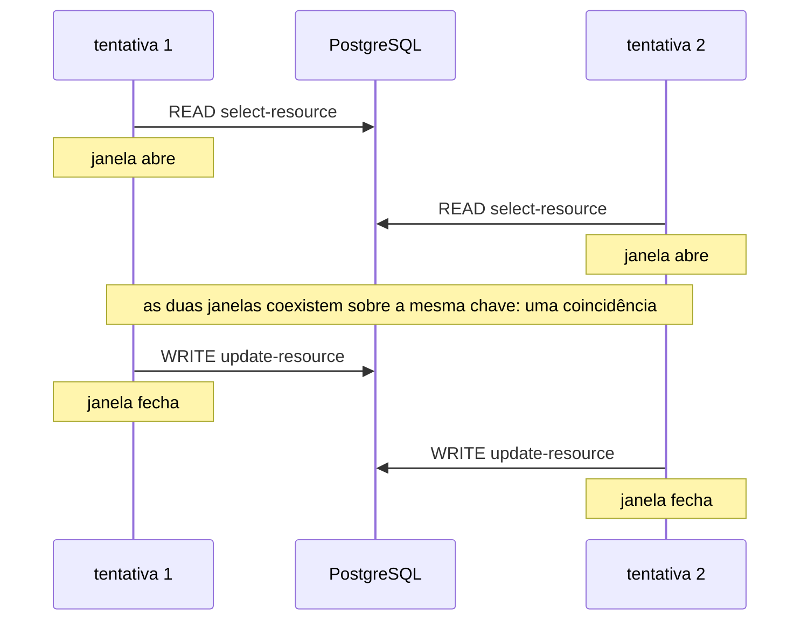
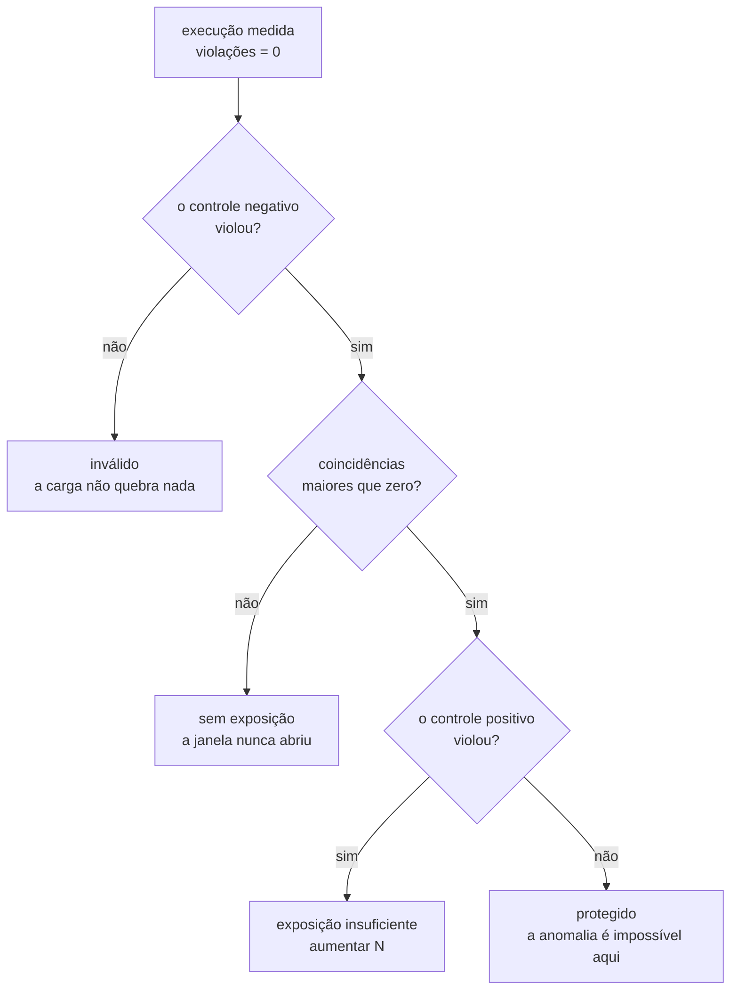
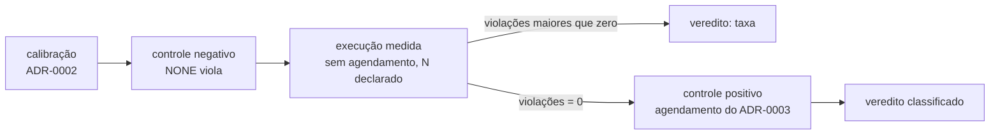

# ADR-0004: O estatuto da barreira e o diagnóstico da não ocorrência

- **Estado:** Proposto
- **Data:** 2026-07-31
- **Etapa do roadmap:** 1
- **Relacionado:** depende do ADR-0001, que fixou o passo e escreveu a cláusula de
  honestidade, e do ADR-0002, que fixou o oráculo exato e a execução de calibração.
  Bloqueia o ADR-0003, cuja questão 4 aponta para cá. **Subsume** a cláusula de
  honestidade do ADR-0001 sem substituí-lo, pela convenção emendada em 2026-07-31
  ([`README.md`](README.md#substituição-e-subsunção-são-coisas-diferentes)).
  Enunciado da proposta em
  [`README.md`](README.md#a-anomalia-por-frequência-uma-proposta-que-muda-o-estatuto-da-barreira).

## Vocabulário

Este documento pressupõe **passo**, **fronteira** e **tentativa** do ADR-0001, e
**agendamento** do ADR-0003. Ele define quatro termos.

- **execução medida** — a execução cujo resultado o experimento reporta.
- **janela de exposição** — o intervalo, dentro de uma tentativa, em que a anomalia é
  possível. O experimento a declara como um par ordenado de fronteiras da operação.
- **coincidência** — um par de tentativas cujas janelas de exposição se sobrepõem no
  tempo.
- **execução de controle** — uma execução que não é reportada como resultado, e que
  existe para interpretar o resultado de uma execução medida.

## Contexto

O plano do laboratório separou o E1 do E2 por estatuto epistêmico. O E1 roda cem
incrementos com dez workers sem agendamento, e prova que o laboratório **detecta**. O E2
roda dois workers com a intercalação `W1.READ → W2.READ → W1.WRITE → W2.WRITE` imposta
pelo escalonador, e prova que o laboratório **constrói**.

A seção 4 do plano registra a aresta `25 → 1` com este argumento: "o lost update precisa
ser demonstrado, não sorteado. Sem barreiras, o experimento produz *às vezes perde* — que
é a mesma frase que o engenheiro já dizia antes de abrir o laboratório."

O argumento tem um ponto cego, e ele fica visível quando o experimento não produz a
anomalia. O E2 sempre produz, porque o escalonador a impõe. O E1 produz ou não, e o plano
cobre um lado dessa incerteza: "este experimento precisa falhar. Se `value == 100`, a
carga é insuficiente e nenhum resultado posterior significa nada." A regra vale para o
grupo de controle, cuja estratégia é `NONE`. Ela não diz nada sobre o E3, onde
`ATOMIC_UPDATE`, `OPTIMISTIC` e `PESSIMISTIC` **devem** chegar a cem.

O E3 é o experimento que compara estratégias, e o resultado dele para três das quatro é
um zero. Nada no repositório diz o que um zero significa.

Quatro restrições vêm de decisões já tomadas.

**O oráculo do ADR-0002 é uma contagem, não um predicado.**
`perdidas = commits − (value_final − value_inicial)`, onde `commits` conta passagens pela
fronteira `AFTER_COMMIT`. Uma contagem tem denominador, e portanto tem taxa.

**Toda execução medida exige calibração antes.** O ADR-0002 exige uma execução com uma
estratégia sem perda, em que `commits` iguale `value_final − value_inicial`.

**A cláusula de honestidade do ADR-0001 é normativa e está `Aceito`.** "Toda anomalia
reproduzida com barreiras DEVE aparecer **também** sem barreiras, sob carga alta. Uma
anomalia que apareça só com barreiras indica que o runtime fabricou o fenômeno, e o
experimento não vale."

**O runtime observa cada fronteira no instante em que o evento ocorre.** O ADR-0001 exige
o registro por passo, com o número da tentativa. O log de observações já contém os
instantes de que uma medida de sobreposição precisa.

## Problema

**O que um experimento afirma quando não observa a anomalia?**

Hoje a resposta é o silêncio. Um relatório com zero violações tem quatro leituras, e o
laboratório não separa nenhuma:

1. a anomalia é impossível naquela configuração — a estratégia protege;
2. a anomalia é possível e a janela nunca abriu, porque a carga não gerou concorrência;
3. a anomalia é possível, a janela abriu, e nenhuma execução caiu dentro dela;
4. a anomalia ocorreu e o oráculo não a viu, porque ele lê o estado final parado.

A primeira leitura é o resultado que o experimento busca. As outras três são defeitos do
instrumento com a mesma aparência no relatório.

As forças em conflito:

- Fidelidade. Um resultado produzido por intercalação imposta descreve o escalonador do
  laboratório, e não o comportamento do sistema sob carga.
- Poder de afirmação. Um resultado que só diz "não vi" não sustenta a comparação entre
  estratégias que o E3 existe para fazer.
- Terminação. Uma busca pela anomalia que rode até encontrá-la não termina quando a
  anomalia é impossível.
- Custo de execução. O laboratório nasce entregando, e cada execução ocupa tempo de
  pipeline.
- Honestidade do instrumento. Um número que pareça uma medida sem ser uma medida é pior
  que a ausência do número.

## Decisão

A execução medida de um experimento roda **sem agendamento**. A anomalia emerge da
frequência de tentativas concorrentes. O agendamento NÃO DEVE produzir o resultado que um
experimento reporta.

### O veredito de uma execução medida é uma taxa

O veredito é o par `violações / tentativas`, onde `tentativas` é a contagem de `commits`
definida pelo ADR-0002. O relatório DEVE exibir os dois números, e NÃO DEVE exibir apenas
a razão entre eles.

Quando `violações = 0`, o relatório DEVE declarar o limite superior da taxa a 95% de
confiança, que para `N` tentativas sem violação fica em torno de `3/N`.

### O experimento declara o número de tentativas antes de executar

Uma execução medida DEVE declarar `N` antes de começar. Ela NÃO DEVE parar na primeira
violação, e NÃO DEVE prosseguir além de `N` porque nenhuma violação apareceu. As duas
paradas condicionais tornam `N` função do resultado, e a taxa deixa de medir o sistema.

### O experimento declara uma janela de exposição

Um experimento cujo veredito PODE ser zero DEVE declarar uma **janela de exposição**: um
par ordenado de fronteiras da operação, `(F_abre, F_fecha)`. A janela de uma tentativa é
o intervalo entre o instante em que ela atravessa `F_abre` e o instante em que ela alcança
`F_fecha`.

Para a atualização perdida, a janela vai da fronteira de saída de `select-resource` até a
fronteira de entrada de `update-resource`. Duas tentativas cujas janelas se sobrepõem
leram o mesmo valor antes que qualquer uma gravasse.

### A plataforma conta coincidências

O runtime DEVE contar, ao fim de uma execução medida, o número de pares distintos de
tentativas cujas janelas de exposição se sobrepõem. A contagem é derivada do log de
observações, e o sistema sob teste NÃO DEVE participar dela.

A contagem de coincidências mede a **oportunidade**. A contagem de violações mede a
**consequência**. Um relatório DEVE trazer as duas.

### A janela é qualificada por uma chave de contenção

Duas janelas sobrepostas no tempo formam coincidência apenas quando disputam o mesmo
alvo. O passo DEVE reportar uma **chave de contenção** entre os fatos que ele já devolve
ao runtime, e o runtime a registra sem interpretá-la, do mesmo jeito que registra
`version` e `rowsAffected`.

Um par de tentativas com janelas sobrepostas e chaves de contenção diferentes NÃO DEVE
ser contado como coincidência.

A chave é opaca ao runtime. A comparação entre duas chaves é igualdade por valor, pelo
critério que o ADR-0002 fixou para valores ligados num traço de SQL.

### O zero é classificado, e a classificação tem quatro valores

Quando `violações = 0`, a plataforma DEVE classificar o resultado em um de quatro
veredictos, a partir da contagem de coincidências e de uma execução de controle:

| Coincidências | Controle positivo | Veredito                    |
|---------------|-------------------|-----------------------------|
| zero          | não executado     | `sem exposição`             |
| maior que 0   | viola             | `exposição insuficiente`    |
| maior que 0   | não viola         | `protegido`                 |
| qualquer      | —                 | `inválido`, se o controle negativo não violar |

`sem exposição` e `exposição insuficiente` NÃO DEVEM ser reportados como evidência de
proteção. `protegido` é o único veredito que sustenta a comparação entre estratégias.

### A barreira é o controle positivo

O agendamento definido pelo ADR-0003 passa a existir como **execução de controle**. Ela
roda quando uma execução medida termina com `violações = 0` e `coincidências > 0`, sobre
a mesma configuração, com a intercalação que causa a anomalia declarada.

Uma execução de controle NÃO DEVE ser reportada como resultado do experimento. Ela
responde uma pergunta sobre o resultado, e não produz resultado.

O ciclo completo de uma execução:

### O E2 deixa de ser um experimento do MVP

O E2 é a execução de controle positivo do E1 e do E3, e não uma linha própria na lista de
experimentos. O MVP passa de cinco experimentos para quatro. O plano do laboratório,
seções 6 e 7, DEVE ser atualizado no mesmo commit em que este ADR for aceito.

### A alta resolução deixa de ser opcional para quem PODE reportar zero

Uma operação em baixa resolução é uma sequência de um passo, sem fronteiras internas.
Nela, `(F_abre, F_fecha)` não tem onde ser ancorado, e a contagem de coincidências não
existe. Um experimento cujo veredito PODE ser zero DEVE rodar em alta resolução.

O eixo de resolução do ADR-0001 continua valendo. O que muda é qual braço serve a quê: a
alta resolução deixa de servir à barreira e passa a servir à medida de exposição.

## Justificativa

**Por que a taxa, e não o booleano.** O oráculo do ADR-0002 já produz uma contagem, e um
booleano descarta informação que a contagem tem. Duas execuções com uma e com trezentas
atualizações perdidas dizem coisas diferentes sobre a mesma estratégia, e o booleano as
iguala. A comparação entre estratégias do E3 é uma comparação de magnitude.

**Por que a exposição precisa de contagem própria.** A consequência sozinha não distingue
"não aconteceu" de "não pôde acontecer". Contar a oportunidade separa as duas com um
número derivado do log que o ADR-0001 já obriga a existir, e sem tocar no sistema sob
teste. É a diferença entre um experimento que afirma e um que se cala.

**Por que a chave de contenção é um fato reportado, e não um dado extraído.** A chave vive
dentro do corpo do passo, e o ADR-0001 proíbe o runtime de inspecionar esse corpo. O mesmo
ADR já abre o caminho de saída: o passo reporta um conjunto de fatos, e o runtime os
registra sem interpretá-los. A chave entra por esse caminho, e nenhuma proibição é
contornada. A alternativa seria o runtime ler o SQL para descobrir qual linha a tentativa
disputa — que é a alternativa D do ADR-0001 voltando pela porta dos fundos.

**Por que a janela é declarada, e não inferida.** O runtime não inspeciona o corpo do
passo — é a decisão do ADR-0001, e ela impede inferir onde a anomalia é possível.
Declarar o par de fronteiras mantém o conhecimento do fenômeno no experimento, que é
onde ele já está: quem escreve o experimento sabe que a atualização perdida mora entre a
leitura e a escrita.

**Por que a barreira sobrevive como controle.** Um zero com exposição alta tem duas
causas, e nenhuma contagem as separa: a anomalia é impossível, ou ela é rara demais para
`N`. A intercalação forçada responde por construção — ela produz a anomalia se a anomalia
existir. É o espelho exato do controle negativo que o repositório já exige: um exige que
`NONE` falhe, o outro exige que a intercalação que causa o fenômeno o produza.

**Por que o controle não é reportado.** O argumento da aresta `25 → 1` continua correto
sobre o que ele afirma: um resultado produzido por intercalação imposta descreve o
escalonador. A decisão não o contradiz; ela retira do resultado o que aquele argumento
critica, e mantém a intercalação onde ela não contamina — do lado da interpretação.

**Por que a cláusula de honestidade do ADR-0001 continua satisfeita.** A cláusula exige
que toda anomalia reproduzida com barreiras apareça também sem elas. Sob esta decisão, a
anomalia reportada é **sempre** produzida sem barreiras, e a exigência fica atendida por
construção. A falha que a cláusula existe para pegar — o runtime fabricando o fenômeno
pelo agendamento — deixa de ser alcançável pelo caminho que ela vigiava. A questão 1
registra o que sobra dessa relação.

**Por que `N` é declarado antes.** Parar na primeira violação produz uma taxa cujo
numerador é sempre um. Rodar até violar produz uma execução que não termina quando a
estratégia protege — que é o caso do E3 em três dos quatro braços. Nas duas paradas, `N`
passa a ser função do resultado, e a razão deixa de estimar a taxa do sistema.

**Por que o limite superior aparece no relatório.** Sem ele, "zero violações em cem
tentativas" e "zero violações em um milhão" ocupam a mesma linha da tabela comparativa e
afirmam a mesma coisa. Com ele, os dois relatórios dizem números diferentes, e a
diferença é a força da afirmação.

**Por que a alta resolução vira obrigatória para quem PODE reportar zero.** A medida de
exposição depende de fronteira interna, e a baixa resolução não tem nenhuma. A exigência
não é uma preferência de estilo: um experimento em baixa resolução com veredito zero é
um número sem diagnóstico possível.

## Consequências

### Positivas

- Um resultado zero passa a afirmar alguma coisa. `protegido` sustenta a tabela
  comparativa do E3, que hoje registraria três zeros indistinguíveis de três falhas de
  carga.
- A comparação entre estratégias ganha magnitude. `NONE` com trezentas perdas e `NONE`
  com uma perda deixam de ocupar a mesma célula.
- O laboratório mede o que o engenheiro vive. A anomalia aparece pela frequência, que é
  o modo pelo qual ela aparece em produção.
- A contagem de coincidências não custa instrumento novo. Ela é derivada do log de
  observações que o ADR-0001 já exige, e o sistema sob teste continua sem saber que está
  sendo medido.
- O passo do ADR-0001 ganha uma segunda justificativa. Ele deixa de depender apenas da
  barreira, cujo estatuto esta decisão rebaixa.
- O MVP encolhe de cinco experimentos para quatro, e o que sai é o experimento cujo
  resultado era garantido por construção.
- A falha de carga vira um veredito nomeado em vez de um zero silencioso. `sem exposição`
  e `inválido` dizem ao autor do experimento o que consertar.

### Negativas

- **Toda execução com resultado zero custa duas execuções.** O controle positivo roda
  depois, sobre a mesma configuração. No E3, três dos quatro braços caem nesse caso.
- **O experimento ganha uma declaração nova e obrigatória.** A janela de exposição é um
  par de fronteiras que alguém escreve à mão, e uma janela declarada errada produz uma
  contagem de coincidências errada — que classifica o zero errado, sem erro nenhum.
- **A contagem de coincidências depende de um fato que o passo reporta.** Um passo que
  não reporte a chave de contenção produz uma contagem que o runtime não sabe estar
  errada, e o zero é classificado a partir dela. Ver a questão 2.
- **A contagem de coincidências compara instantes entre threads.** Ela depende de o log
  de observações carregar um instante comparável entre workers, e nenhum documento do
  repositório decidiu qual relógio produz esse instante. Ver a questão 3.
- **O veredito ganha um terceiro formato.** A fila previa booleano e curva. Taxa com
  limite de confiança tem um número e uma incerteza, e a incerteza precisa caber no
  relatório e na comparação entre execuções.
- **A execução medida é probabilística dentro de um pipeline que precisa ficar verde.**
  Um `N` pequeno produz falha intermitente; um `N` grande ocupa tempo de execução. A
  tensão 2 do plano chama a falha intermitente de o pior resultado possível num
  instrumento de medida. Ver a questão 4.
- **O laboratório perde o experimento que provava que ele constrói a anomalia.** O E2
  vira controle, e o controle não é reportado. A capacidade continua existindo; a linha
  no relatório que a exibia, não.
- **Um experimento em baixa resolução deixa de poder reportar zero.** O braço
  `@Transactional`, que o ADR-0001 manteve como o código que um engenheiro escreveria,
  serve apenas a experimentos cujo veredito é uma violação observada.

### Neutras

- O ADR-0003 continua valendo inteiro. O que muda é quem consome o agendamento: a
  execução de controle, e não a execução medida.
- A calibração e o controle negativo do ADR-0002 não mudam de forma. Eles ganham um
  terceiro parente na mesma família, e a família passa a ter nome.
- O número de tentativas passa a ser entrada declarada do experimento, ao lado da
  semente. Ele já era um número escolhido por alguém; a mudança é que agora ele é
  escrito antes.

## Trade-offs

- O benefício **um resultado zero passa a afirmar `protegido` em vez de calar** foi
  aceito em troca do custo **toda execução com resultado zero custa uma segunda
  execução**.
- O benefício **a plataforma separa "não aconteceu" de "não pôde acontecer"** foi aceito
  em troca do custo **todo experimento declara uma janela de exposição, e uma janela
  errada classifica o zero errado sem produzir erro**.
- O benefício **o resultado reportado descreve o sistema sob carga, e não o escalonador
  do laboratório** foi aceito em troca do custo **o experimento que provava que a
  plataforma constrói a anomalia sai da lista de experimentos**.
- O benefício **duas execuções com magnitudes diferentes deixam de ocupar a mesma célula
  da tabela** foi aceito em troca do custo **o veredito ganha um terceiro formato, e a
  comparação entre execuções precisa lidar com incerteza**.
- O benefício **`N` declarado antes faz a taxa estimar o sistema** foi aceito em troca do
  custo **a execução não para ao encontrar a violação, e paga `N` tentativas mesmo quando
  a primeira já respondeu a pergunta**.
- O benefício **a medida de exposição não toca no sistema sob teste** foi aceito em troca
  do custo **ela exige alta resolução, e o braço `@Transactional` deixa de poder reportar
  zero**.
- O benefício **a coincidência distingue tentativas que disputam o mesmo alvo das que
  apenas coexistem no tempo** foi aceito em troca do custo **a chave de contenção vira
  responsabilidade de quem escreve a operação, e o runtime não enxerga quando ela
  falta**.

## Alternativas consideradas

### Alternativa A — remover a barreira do laboratório

O agendamento sai, o ADR-0003 é descontinuado ainda `Proposto`, e o E2 deixa de existir.
A plataforma afirma apenas o que observou, e um zero é reportado como zero.

**Descartada.** Ela tem o argumento mais forte a favor entre as quatro: uma máquina a
menos, um ADR a menos, e nenhuma dúvida sobre qual execução produziu o resultado. A
detecção de ciclo do ADR-0003, que vira código crítico sem que ninguém tenha pedido para
estudar detecção de ciclo, também desaparece.

Ela perde porque deixa a pergunta do Problema sem resposta. Com a barreira fora, a única
ferramenta contra um zero é aumentar `N`, e aumentar `N` nunca distingue "a anomalia é
impossível" de "a anomalia é rara". As três estratégias corretas do E3 produziriam zeros
que o laboratório não conseguiria diferenciar de uma carga fraca — que é exatamente o
defeito que a regra do grupo de controle existe para impedir do outro lado. Ela também
descarta a exigência do cenário 25, marcada como particularmente importante no briefing,
sem substituí-la por nada.

### Alternativa B — manter a barreira como produtora e acrescentar a frequência

O E2 continua reportando o resultado que a intercalação imposta produz. A execução por
frequência entra como experimento adicional.

**Descartada.** É a alternativa que preserva tudo que já foi aceito, e não exige emenda
nenhuma ao plano. O E2 continua sendo a demonstração visual que o briefing pede.

Ela perde por não atender o pedido que originou esta decisão. O resultado reportado
continua vindo de uma intercalação fabricada, e o zero da execução por frequência
continua sem interpretação. As duas execuções produziriam dois relatórios sobre o mesmo
fenômeno sem nenhuma regra que os relacione — e a regra que os relaciona é a decisão que
está sendo tomada aqui.

### Alternativa C — frequência e barreira como eixos coiguais

Os dois viram resoluções do experimento, do mesmo jeito que o ADR-0001 fez com alta e
baixa resolução da operação. Todo experimento roda nos dois braços.

**Descartada.** A simetria com o eixo de resolução do ADR-0001 é um argumento real: o
repositório já tem um eixo dessa forma, e um segundo eixo com a mesma mecânica custa
pouco a quem já entendeu o primeiro.

Ela perde por não dizer de onde vem o veredito. O eixo de resolução do ADR-0001 tem uma
regra que o fecha — a cláusula de honestidade exige que os dois braços concordem, e a
prova de equivalência verifica que são a mesma operação. Aqui os dois braços **não**
concordam por construção: a intercalação imposta produz a anomalia sempre, e a execução
por frequência produz às vezes. Um eixo cujos dois braços discordam sempre precisa de uma
regra de precedência, e essa regra é a decisão escolhida, escrita de outro jeito.

### Alternativa D — repetição adaptativa, sem métrica de exposição e sem controle

A execução aumenta `N` até observar a anomalia ou até esgotar um orçamento de tempo. O
zero passa a vir acompanhado do `N` alcançado.

**Descartada.** Ela não exige instrumento novo nenhum, e é a resposta que aparece
primeiro quando alguém pensa no problema. O `N` alcançado até carrega informação: um zero
em um milhão de tentativas afirma mais que um zero em cem.

Ela perde em dois pontos. O primeiro é a terminação: quando a estratégia protege, o laço
roda até o orçamento acabar, e o orçamento passa a ser o número que o relatório reporta —
uma medida da máquina, não do sistema. O segundo é que gastar orçamento não distingue
"a janela nunca abriu" de "a janela abriu e nada aconteceu". Um pool de conexões que
serialize os workers produz um zero com orçamento esgotado, e o relatório o exibe como
evidência de proteção.

### Alternativa E — decidir se a anomalia é possível por análise, sem executar

Um verificador de entrelaçamentos analisa a operação e responde se a anomalia é
alcançável naquela configuração, sem rodar carga nenhuma.

**Descartada.** Ela responderia a pergunta do Problema de forma exata, e não por
amostragem — que é mais do que a decisão escolhida entrega.

Ela perde pelo mesmo argumento que derrubou a alternativa D do ADR-0001. Analisar a
operação exige interpretar o SQL e modelar o comportamento do PostgreSQL sob cada nível
de isolamento. O objeto de estudo passaria a ser o modelo, e o E5 existe justamente para
mostrar que a intuição sobre o modelo está errada: uma proteção presente e inerte é
invisível para quem raciocina sobre a anotação em vez de executar.

## Quando esta decisão deixa de valer

Reveja esta decisão quando um fenômeno tiver janela de exposição que um par de fronteiras
da mesma operação não expresse. O sinal concreto está no grupo E: a posse por lease abre
uma janela que começa numa operação e termina num relógio, e nenhum par de fronteiras a
delimita.

Reveja a contagem de coincidências quando ela ficar alta e a taxa de violação ficar zero
num fenômeno que o controle positivo prove possível, de forma repetida. Esse sinal
significa que a janela declarada não é a janela real, e a declaração vira a suspeita
principal.

Reveja a exigência de declarar `N` antes quando o custo de `N` tentativas no pipeline
passar do tempo que a entrega contínua tolera, medido e não estimado. Nesse ponto a
escolha entre falha intermitente e execução longa precisa ser feita de novo, com o número
na mesa.

## Questões em aberto

| # | Questão                                                                        | Status      |
|---|--------------------------------------------------------------------------------|-------------|
| 1 | A cláusula de honestidade do ADR-0001 muda de sentido, e um ADR aceito não é editado | resolvida |
| 2 | Nada obriga o passo a reportar a chave de contenção                            | encaminhado |
| 3 | Comparar janelas exige um instante comparável entre workers                    | encaminhado |
| 4 | A regra de parada colide com a exigência de nascer entregando                  | encaminhado |
| 5 | O terceiro formato de veredito precisa caber ao lado dos dois já previstos     | encaminhado |

### 1. A cláusula de honestidade do ADR-0001 muda de sentido, e um ADR aceito não é editado

**Resolvida em 2026-07-31 pela emenda à convenção**, em [`README.md`](README.md), seção
`### Substituição e subsunção são coisas diferentes`. Este ADR **subsume** a cláusula de
honestidade do ADR-0001 sem substituí-lo. As três exigências da emenda ficam atendidas
assim: a regra subsumida é a frase citada abaixo, da seção `### A cláusula de honestidade`
do ADR-0001; ela continua valendo sem mudança quando as coincidências são iguais a zero; e
nenhum caso deste ADR a contradiz, porque o caso que ela não enxergava — coincidências
maiores que zero — ela nunca tratou de propósito.

O enunciado abaixo permanece porque ele registra o que estava em jogo antes da emenda.

A cláusula diz: "Uma anomalia que apareça só com barreiras indica que o runtime fabricou o
fenômeno, e o experimento não vale."

Sob esta decisão, "aparece só com barreiras" é um estado diagnóstico com dois valores
distintos. Com coincidências iguais a zero, a leitura da cláusula continua correta: a
carga nunca abriu a janela, e a barreira a abriu — o runtime fabricou. Com coincidências
maiores que zero, a mesma frase descreve o veredito `exposição insuficiente`, e o
experimento **vale**: ele afirma que a anomalia é possível e rara, e a resposta é aumentar
`N`.

A `## Justificativa` deste ADR argumenta que a cláusula continua satisfeita, porque a
anomalia reportada é sempre produzida sem barreiras. O argumento cobre a exigência da
cláusula e não cobre o veredito dela. A frase do ADR-0001 invalida um experimento que esta
decisão considera válido.

A convenção do repositório proíbe editar um ADR aceito. Duas saídas existem, e nenhuma é
barata. Marcar o ADR-0001 como `Substituído por ADR-0004` descartaria junto a decisão do
passo, que este ADR preserva e reforça. Deixar as duas frases convivendo entrega ao leitor
futuro duas regras que discordam sobre o mesmo caso, sem dizer qual vale.

Uma terceira saída apareceu no debate e foi a escolhida: ler a cláusula do ADR-0001 como
**subsumida** por este ADR. Ela não existia na convenção, e a convenção foi emendada para
admiti-la, com as três exigências que a separam de uma edição disfarçada.

### 2. Nada obriga o passo a reportar a chave de contenção

Status: **encaminhado**. Destino: **arquitetura mínima e guardas executáveis**, que já
carrega `Q-0002-1` e a análise estática exigida pela camada 2 do ADR-0001. A guarda é da
mesma família: verificar uma propriedade das classes do sistema sob teste que nenhum teste
verifica hoje.

A seção `## Decisão` resolveu a metade que era decisão deste ADR. Duas janelas sobrepostas
no tempo formam coincidência apenas quando as chaves de contenção coincidem, e a chave
chega ao Lab Plane como um fato reportado pelo passo — o caminho que o ADR-0001 já abriu
para `version` e `rowsAffected`.

O que sobra é a obrigação. Um passo que não reporte a chave produz uma contagem de
coincidências que o runtime aceita sem saber que está errada, e o zero é classificado a
partir dela. O resultado é um veredito `sem exposição` num experimento em que a janela
abriu, ou o inverso, sem que teste nenhum falhe.

Sem a chave, a contagem seria pior fora do MVP. Os cinco experimentos operam sobre um
`Resource` único, e toda sobreposição temporal é sobreposição sobre a mesma linha. Um
experimento com cem recursos e dez workers produz sobreposição o tempo todo, e quase
nenhuma delas é oportunidade de anomalia. A chave existe para essa configuração; a guarda
existe para o dia em que alguém a escrever e esquecer de reportá-la.

A forma da guarda tem uma dificuldade que a decisão de destino precisa enfrentar. A
exigência não vale para todo passo: ela vale para os passos que delimitam uma janela de
exposição declarada por algum experimento. Uma regra que exija a chave de todo passo
reprova código correto; uma regra que a exija de nenhum não pega o esquecimento. O
ligamento entre a declaração da janela e o corpo do passo é onde a guarda precisa olhar, e
esse ligamento vive no experimento, não na classe.

### 3. Comparar janelas exige um instante comparável entre workers

Status: **encaminhado**. Destino: **o log de observações**, que a fila descreve como o
substrato da timeline e do replay.

A contagem de coincidências compara intervalos produzidos por threads diferentes. A
comparação exige que os instantes registrados por dois workers sejam ordenáveis entre si,
e não apenas dentro de cada worker.

O repositório exige que o tempo seja injetável, e `Q-0002-1` registra que essa exigência
ainda não é regra executável. Nenhum documento diz qual relógio o log usa, nem se ele é
monotônico, nem qual é a resolução dele. Duas janelas que se sobreponham por menos que a
resolução do relógio contam como disjuntas, e a contagem de coincidências subestima.

A questão pertence ao log de observações porque a resposta é uma propriedade do registro,
e não desta decisão. Esta decisão consome o instante; ela não escolhe de onde ele vem.

### 4. A regra de parada colide com a exigência de nascer entregando

Status: **encaminhado**. Destino: **entrega contínua no homelab desde o dia zero**.

`N` declarado antes resolve o viés da taxa e cria um custo de tempo. Um `N` alto ocupa o
runner do GitHub Actions; um `N` baixo produz um experimento que passa numa execução e
falha na seguinte, sem que nada tenha mudado.

O laboratório é entregue por um pipeline que precisa ficar verde, e a ADR 0017 do homelab
fixa runner hospedado. Nenhum dos dois repositórios decidiu se um experimento roda no
pipeline, se ele roda sob demanda, ou se o pipeline executa uma versão reduzida com `N`
menor — que seria uma terceira execução, com um terceiro significado.

A tensão 2 do plano é a mesma vista de outro lado: um limiar mal calibrado produz falha
intermitente, "o pior resultado possível num instrumento de medida". Aqui o limiar é `N`.

### 5. O terceiro formato de veredito precisa caber ao lado dos dois já previstos

Status: **encaminhado**. Destino: **os dois formatos de veredito**, já na fila, que passa
a tratar três.

A fila prevê booleano para os grupos A, B, C e E, e curva para o grupo D. Esta decisão
acrescenta taxa com limite de confiança, e o acréscimo não é um caso particular de nenhum
dos dois. Uma taxa tem um número e uma incerteza; um booleano não tem nenhum dos dois, e
uma curva tem uma série.

`Q-0002-3` já acrescentava um eixo àquela decisão — pontual contra contínuo no tempo. Com
esta questão, aquele ADR passa a resolver três eixos ao mesmo tempo, e PODE precisar ser
dividido.

A comparação entre execuções depende disso. A tabela do E3 põe quatro estratégias lado a
lado, e sob esta decisão três delas trazem taxa zero com limites de confiança diferentes.
Como essa tabela é lida, e o que ela permite concluir, não é decisão deste ADR.
