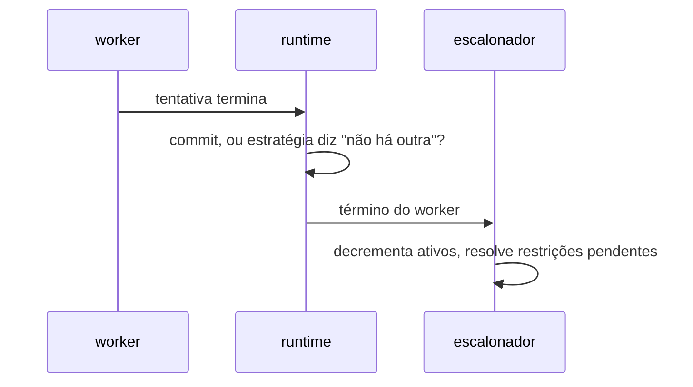

# ADR-0005: A forma do escalonador — estado, decisão e protocolo de desistência

- **Estado:** Proposto
- **Data:** 2026-08-01
- **Etapa do roadmap:** 1
- **Relacionado:** depende do ADR-0001 (escalonador pressuposto), do ADR-0002 (oráculo)
  e do ADR-0003 (chegada, travessia, agendamento). **Subsume** a tabela de classificação
  do ADR-0004, sem substituí-lo, pela convenção emendada em 2026-07-31 ([
  `README.md`](README.md#substituição-e-subsunção-são-coisas-diferentes)).
- **Questões que este ADR resolve:** `Q-0001-4`, `Q-0002-2`, `Q-0003-1`, `Q-0003-2`.

## Vocabulário

Este documento pressupõe **passo**, **fronteira** e **tentativa** do ADR-0001;
**chegada**, **travessia**, **papel**, **carga**, **agendamento** e **encontro** do
ADR-0003; **execução medida**, **execução de controle** e **janela de exposição** do
ADR-0004. Ele define dois termos.

- **término** — o instante em que um worker para de tentar uma execução de operação. Por
  commit final, por resposta negativa da estratégia a "há outra tentativa?", ou por
  falha não recuperada por ela.
- **desistência** — o efeito do término de um worker sobre uma restrição pendente cujo
  antecedente é uma chegada dele que não vai mais ocorrer.

## Contexto

O ADR-0001 fixou que o runtime consulta o escalonador em cada fronteira e registrou a
ausência: "a decisão não fixa como o escalonador decide, que estado ele guarda, nem como
um worker que morreu o notifica" (`0001-o-passo-como-unidade-de-execucao.md:327-330`). O
ADR-0003 definiu a linguagem do agendamento sem definir quem a executa. O ADR-0004
definiu que o oráculo lê o banco depois do último término, sem dizer quem observa esse
instante (`README.md:598-609`).

Duas responsabilidades caem no mesmo componente. Toda execução precisa de um sinal de
"todos os workers terminaram" antes que o oráculo leia. Só a execução de controle
positivo, com agendamento do ADR-0003, resolve restrições de precedência.

Um worker que termina — por falha injetada ou por sucesso — antes de produzir a chegada
que uma restrição espera trava os workers que aguardam essa chegada. O sintoma é
idêntico ao de um bug do runtime.

## Problema

**Que estado o escalonador guarda, como ele sabe que um worker terminou, e o que
acontece com uma restrição cujo antecedente não vai mais ocorrer?**

Forças em conflito:

- Determinismo. O término precisa ser observado no instante em que ocorre, como o
  ADR-0001 exige para todo evento.
- Terminação. Uma restrição sem antecedente não pode travar a execução para sempre.
- Reuso. O mesmo mecanismo precisa servir a execuções sem agendamento.
- Nomeação. Uma execução que desiste não é o mesmo caso que os cinco já classificados
  pelo ADR-0004.

## Decisão

O escalonador mantém, por execução, um contador de workers ativos e um conjunto de
restrições de precedência pendentes. O conjunto é vazio fora da execução de controle.

O runtime relata dois eventos ao escalonador: a **chegada** de um worker numa fronteira,
como o ADR-0001 já exige, e o **término** de um worker, evento novo desta decisão.

### O contador de ativos sinaliza o fim da execução

Quando o contador chega a zero, o escalonador sinaliza "execução terminada". É este
sinal que o oráculo do ADR-0002 aguarda antes de ler o banco. `Q-0002-2` fecha aqui: o
escalonador declara, o oráculo espera.

### O término resolve a desistência

Ao receber o término de um worker, o escalonador verifica toda restrição pendente cujo
antecedente cite aquele worker numa fronteira que ele não alcançou. Se existir, a
restrição não pode mais ser satisfeita — **desistência** — e quem espera por ela é
liberado.

A desistência cobre os dois casos das questões encaminhadas. Um worker morto por falha
injetada nunca chega — `Q-0001-4`. Um worker que comete na tentativa 1 nunca produz a
chegada agendada para a tentativa 2 — `Q-0003-2`. Os dois terminam pelo mesmo evento.

### O veredito nomeia a desistência

Uma execução de controle com desistência produz o sexto valor da tabela de classificação
do ADR-0004
(`0004-o-estatuto-da-barreira-e-o-diagnostico-da-nao-ocorrencia.md:211-217`), nomeado
`agendamento não cumprido`. Os cinco valores daquele ADR continuam válidos sem alteração
para o caso que eles cobrem — uma execução de controle que termina sem desistência.
`agendamento não cumprido` cobre o caso que aquele ADR não previu: a execução de
controle que não termina o próprio agendamento.

`agendamento não cumprido` NÃO DEVE ser lido como `exposição insuficiente`. O primeiro
diz que o controle não terminou. O segundo diz que ele terminou sem violar.

## Justificativa

**Por que dois eventos, e não um.** Chegada diz que o worker está numa fronteira agora;
término diz que ele não vai chegar a mais nenhuma. Fundir os dois exigiria que toda
chegada soubesse se é a última — resposta que só a estratégia dá.

**Por que o contador de ativos serve toda execução.** `Q-0002-2` não depende de
agendamento. Reaproveitar o evento de término evita um segundo mecanismo para a mesma
pergunta.

**Por que a desistência é imediata, e não por timeout.** Timeout mede tempo de parede,
proibido fora de um adaptador de relógio. O término já é um evento do próprio runtime.

**Por que a desistência é veredito novo, e não `inválido`.** `inválido` é a carga que
não expôs nada. `agendamento não cumprido` é a carga que expôs, mas cujo controle não
terminou o próprio agendamento. Confundir os dois esconderia a causa do relatório.

## Consequências

### Positivas

- O oráculo ganha um instante único para ler o banco, derivado do mesmo evento que
  resolve desistência.
- Um worker morto por falha injetada não trava mais a execução de controle.
- `Q-0003-2` deixa de ser hipotético: `OPTIMISTIC` no E3 e no E4 usa o mesmo mecanismo.
- A tabela de veredito do ADR-0004 ganha o caso que faltava, sem reabrir os cinco
  aceitos.

### Negativas

- **O runtime ganha um segundo evento a emitir, além da chegada.**
- **A desistência não distingue worker morto de worker rápido.** Os dois produzem o
  mesmo veredito, e só a timeline separa os dois casos.
- **`agendamento não cumprido` é um sexto caso que ninguém debateu antes de hoje.**

### Neutras

- O escalonador passa a ser componente com estado por execução, e não apenas função pura
  consultada em cada fronteira.

## Trade-offs

- O benefício **desistência determinística, sem relógio** foi aceito em troca do custo
  **um segundo evento em toda tentativa**.
- O benefício **um mecanismo só serve agendamento e término** foi aceito em troca do
  custo **o escalonador guardar estado, e não ser mais uma função pura**.
- O benefício **a tabela do ADR-0004 ganha o caso que faltava** foi aceito em troca do
  custo **um sexto veredito que ninguém debateu quando o quinto foi aceito**.

## Alternativas consideradas

### Alternativa B — máquina de estados formal por execução

Cada execução de controle tem uma FSM com estados nomeados por restrição, verificável
isoladamente.

**Descartada.** Dá mais rigor de prova. Perde por custo: o MVP só exercita controle
positivo com dois workers e uma restrição por vez. Uma FSM por restrição é código que
ninguém precisa provar antes de o E5 crescer além disso.

### Alternativa C — escalonador passivo, worker consulta por sondagem

O worker pergunta periodicamente "posso atravessar?", em vez de o escalonador empurrar a
decisão.

**Descartada.** É mais simples, sem canal de notificação. Perde porque contradiz a
exigência do ADR-0001 de observar cada evento no instante em que ocorre — a sondagem
introduz um atraso não determinístico entre o evento e a reação a ele.

## Quando esta decisão deixa de valer

Reveja esta decisão quando um controle precisar de várias restrições pendentes ao mesmo
tempo, em escala que o mapa simples não navegue sem uma FSM — o E5 com mais de dois
papéis, por exemplo.

## Questões em aberto

| # | Questão                                                                | Status |
|---|------------------------------------------------------------------------|--------|
| 1 | O critério de "falha não recuperada pela estratégia" não está definido | aberto |
| 2 | O acesso concorrente ao estado do escalonador não foi especificado     | aberto |

### 1. O critério de "falha não recuperada pela estratégia" não está definido

A política de quando uma estratégia trata uma exceção como motivo de retry pertence ao
ADR de estratégias de concorrência, ainda não escrito. Este ADR presume essa resposta;
não a define.

### 2. O acesso concorrente ao estado do escalonador não foi especificado

Cada worker roda na própria thread (ADR-0001). O contador de ativos e o mapa de
restrições são estado compartilhado entre threads, e este ADR não fixa o mecanismo de
exclusão. A proibição de `synchronized` alcança o sistema sob teste, não o Lab Plane — a
forma exata do escalonador não foi escolhida.
