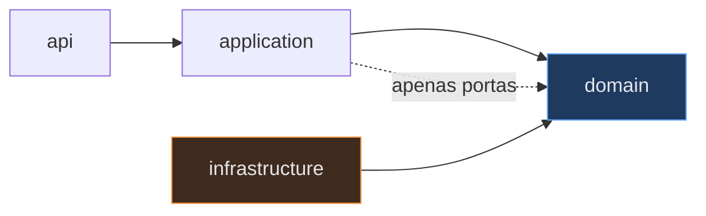

# ADR-0006: Arquitetura hexagonal com ArchUnit como guarda executável

- **Estado:** Proposto
- **Data:** 2026-07-26
- **Etapa do roadmap:** 1
- **Relacionado:** ADR-0003, ADR-0004, ADR-0005

## Contexto

O ADR-0005 coloca todos os módulos num reactor Maven único. Isso remove a barreira
física entre serviços: qualquer classe pode importar qualquer outra e a build
continua verde.

O ADR-0003 exige que estratégias de concorrência sejam trocáveis por configuração.
Isso só funciona se o domínio depender de uma interface, nunca de uma implementação.

O ADR-0004 exige que toda aleatoriedade venha de uma fonte semeada. Uma chamada
esquecida a `Math.random()` quebra a reprodutibilidade em silêncio.

## Problema

Regras de arquitetura escritas em documento não são cumpridas. Elas são cumpridas na
primeira semana e violadas na terceira, quando a pressa aparece e ninguém lembra da
regra.

Um documento de arquitetura descreve a intenção. O código descreve o fato. Quando os
dois divergem, o código vence.

A pergunta é: como fazer uma regra de arquitetura falhar a build?

## Decisão

### Camadas

Cada serviço tem quatro camadas, com dependência em uma direção só.

```
api            → controllers, DTOs de entrada e saída, tradução HTTP
application    → casos de uso, orquestração, transação
domain         → agregados, invariante, portas (interfaces)
infrastructure → adaptadores: JPA, mensageria, HTTP externo, relógio
```

Direção da dependência:



O `domain` não aponta para ninguém. Ele é o centro. `infrastructure` implementa as
portas declaradas em `domain`, e a inversão de dependência acontece na composição
(Spring), não no código de domínio.

### O domínio é Java puro

O pacote `domain` não importa Spring, JPA, Jackson, nem nada de framework. A
invariante do ADR-0001 é testável com um `new` e um `assert`, sem contexto de
aplicação, sem banco, em milissegundos.

Isso não é purismo. É consequência direta do ADR-0004: um experimento precisa
comparar estratégias, e a estratégia só pode ser trocada se o domínio não souber qual
está em uso.

### As regras são testes ArchUnit

As regras rodam com `mvn test`. Uma violação quebra a build.

| # | Regra | Motivo |
|---|---|---|
| 1 | `..domain..` não importa `org.springframework..` | domínio testável sem framework |
| 2 | `..domain..` não importa `jakarta.persistence..` | domínio independente de persistência |
| 3 | `..domain..` não importa `..infrastructure..` | inversão de dependência |
| 4 | `..resource..` não importa `..allocation..` (e vice-versa) | serviço não importa serviço — substitui a barreira perdida no ADR-0005 |
| 5 | `shared..` não importa nada de `..services..` | o compartilhado não conhece o específico |
| 6 | Lab Plane não é importado pelo Control Plane | o instrumento não contamina o sistema sob teste |
| 7 | Ninguém usa `java.util.Random`, `Math.random`, `ThreadLocalRandom` fora de `shared..random..` | reprodutibilidade do ADR-0004 |
| 8 | Ninguém usa `Instant.now()`, `LocalDateTime.now()`, `System.currentTimeMillis()` fora de um adaptador de relógio | o tempo é injetável; ver ADR-0002, origem Lease Expiry |
| 9 | Classes `@Entity` só existem em `..infrastructure..` | agregado de domínio ≠ entidade de persistência |

### A regra 8 merece destaque

O ADR-0002 define o relógio como uma **origem de escrita**. Se o tempo não for
injetável, dois cenários ficam impossíveis de testar: expiração de lease e clock
skew entre nós.

Proibir `Instant.now()` parece exagero. Não é: é o que permite adiantar o relógio de
um nó em 300 ms num experimento e observar o resultado.

## Questões em aberto

### 1. As regras 4, 5, 6 e 7 dependem de um padrão de pacote que ainda não existe

As regras estão escritas em padrões (`..resource..`, `shared..`, `shared..random..`),
mas o pacote raiz Java ainda não foi escolhido — nenhum `pom.xml` existe. Enquanto o
padrão não for fixado, as regras não são exprimíveis em código.

Duas dependem de mais que nomenclatura:

- **Regra 4** (`..resource..` não importa `..allocation..`) exige que o nome do
  serviço apareça no pacote de forma inequívoca. Um pacote genérico como
  `...lab.service.domain` torna a regra impossível de escrever.
- **Regra 6** (Control Plane não importa Lab Plane) exige que o plano seja
  identificável. Ou o pacote o carrega, ou o teste precisa listar as classes uma a
  uma — e uma lista manual apodrece. Ver a questão 1 do ADR-0005.

### 2. A regra 8 precisa de um adaptador de relógio antes de existir

A regra proíbe `Instant.now()` fora de "um adaptador de relógio". Esse adaptador não
foi especificado: onde ele vive, qual é sua interface, e como um experimento adianta
o relógio de um nó sem adiantar o dos outros.

Sem isso, a regra 8 é inaplicável — ela proibiria o uso sem oferecer o substituto.

### 3. A regra 6 colide com o que o Chaos Service precisa fazer

A regra 6 diz que o Control Plane nunca importa o Lab Plane. O ADR-0004 diz que o
Chaos Service duplica, reordena e atrasa mensagens com probabilidade semeada. As duas
frases só coexistem se o caos for injetado **fora** do processo do Control Plane, e
nenhum ADR decidiu onde.

Os lugares possíveis, com o custo de cada um:

- **Interceptor dentro do serviço** — um `MessagePostProcessor` ou um wrapper do
  `RabbitTemplate` que consulta o Chaos Service. É o mais fácil de escrever e o mais
  fiel à semente, porque a decisão de duplicar nasce no mesmo processo que gerou o
  evento. **Viola a regra 6 de forma direta:** o código do sistema sob teste passa a
  conter código do instrumento, e um bug do instrumento vira um resultado de
  consistência.
- **Proxy no caminho do broker** — o Chaos Service consome de uma exchange e republica
  em outra, aplicando reordenação e duplicata. Preserva a regra 6, mas insere um salto
  de rede a mais em todo evento, e o próprio proxy vira uma fonte de latência que entra
  na medida de convergência do ADR-0004.
- **Falha na camada de rede (Toxiproxy ou equivalente)** — o Control Plane não sabe que
  o caos existe. Preserva a regra 6 integralmente, mas só produz atraso, partição e
  queda de conexão. **Não produz duplicata nem reordenação semântica**, que são
  exatamente os dois casos que o Grupo 2 do ADR-0003 precisa exercitar.

Nenhuma das três é gratuita. A primeira compra fidelidade com contaminação; a segunda
compra isolamento com latência; a terceira compra pureza perdendo os cenários que
importam. A escolha provavelmente é uma combinação, e ela precisa estar escrita antes
da Etapa 3 — que é quando `IDEMPOTENCY_KEY`, `UNIQUE_CONSTRAINT` e `SEQUENCE_GUARD`
passam a depender do caos para ter o que filtrar.

Esta questão pertence a um ADR próprio do Chaos Service, ainda não numerado. Ela fica
registrada aqui porque é a **regra 6 deste ADR** que ela contradiz.

## Consequências

### Positivas

- A arquitetura para de depender de disciplina. Uma violação falha a build no mesmo
  commit em que foi introduzida.
- As regras 7 e 8 protegem propriedades do laboratório que nenhum teste funcional
  detectaria. Um `Math.random()` esquecido não quebra nenhum teste — só a
  reprodutibilidade, meses depois.
- A regra 4 recupera a barreira que o monorepo removeu. Sem ela, o ADR-0005 é uma
  decisão ruim.
- Testes de domínio rodam em milissegundos, sem Testcontainers. Isso muda o ritmo de
  desenvolvimento da Etapa 1.

### Negativas

- Separar agregado de domínio de entidade JPA (regra 9) exige mapeamento manual entre
  os dois. Isso é código repetitivo e sem graça.

  Este é o custo real e recorrente desta decisão. É aceito porque a alternativa — uma
  classe que é agregado e entidade ao mesmo tempo — faz o comportamento de lazy
  loading e de cache de primeiro nível vazar para dentro da lógica de invariante,
  exatamente onde o laboratório precisa de clareza total.

- Regras ArchUnit produzem mensagens de erro ruins quando violadas por engano. Cada
  regra precisa de um `because(...)` explicando o motivo, senão vira obstáculo
  incompreensível.
- Proibir `Instant.now()` incomoda em código trivial, como um log. A regra permite
  exceções declaradas explicitamente, e cada exceção precisa de comentário.

### Neutras

- Spring Modulith é usado apenas para verificação de módulos e documentação, não como
  mecanismo de comunicação interna. Eventos entre serviços são de verdade, pelo
  broker.

## Alternativas consideradas

### Alternativa A — arquitetura em camadas convencional (controller/service/repository)

O padrão majoritário em Spring Boot.

**Descartada.** A entidade JPA vira o modelo de domínio, e a lógica de invariante
fica misturada com o comportamento do ORM. Trocar a estratégia de concorrência
(ADR-0003) exigiria alterar a entidade. O laboratório perderia sua funcionalidade
central.

### Alternativa B — hexagonal sem ArchUnit

Documentar as regras e confiar em revisão.

**Descartada.** Não existe revisão neste projeto — é um laboratório de uma pessoa.
Sem verificação automática, a regra 4 seria violada na primeira vez que fosse
conveniente importar uma classe do serviço vizinho.

### Alternativa C — módulos Maven separados por camada

Um módulo Maven para `domain`, outro para `infrastructure`, com dependência declarada
no `pom.xml`.

**Considerada com seriedade, descartada por custo.** É a forma mais forte de impor a
regra: uma violação vira erro de compilação, não erro de teste. Mas multiplica o
número de módulos por quatro (vinte módulos para cinco serviços), e cada módulo tem
seu `pom.xml` para manter.

ArchUnit dá 90% do benefício por 10% do custo. A diferença — falhar na compilação em
vez de falhar no teste — não vale dezesseis `pom.xml` adicionais.

## Quando esta decisão deixa de valer

Reveja a regra 9 (separação agregado/entidade) se o mapeamento manual consumir mais
tempo que a lógica de invariante que ele protege. O sinal concreto: um agregado cujo
mapeador tem mais linhas que o próprio agregado, sem que o agregado tenha
comportamento.
