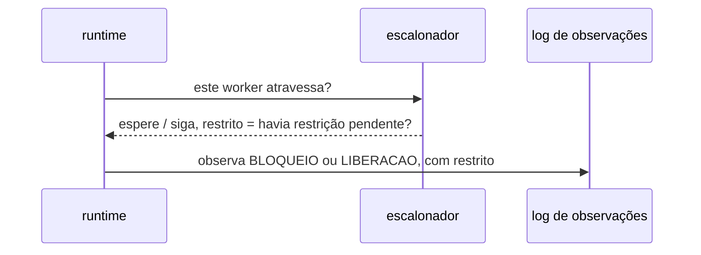

# ADR-0007: O log de observações — forma, ordem e onde vive

- **Estado:** Aceito
- **Data:** 2026-08-04
- **Etapa do roadmap:** 1
- **Relacionado:** depende do ADR-0001 (fronteira e observação), do ADR-0003
  (determinismo do veredito, não da timeline) e do ADR-0005 (protocolo do escalonador).
  Não substitui nem subsume nenhum ADR aceito.
- **Fecha parcialmente:** [`Q-0003-3`](../questions/Q-0003-3.md) — só a metade sobre
  execução de controle.
- **Reencaminha:** [`Q-0001-1`](../questions/Q-0001-1.md) para Experiment, e a metade
  medida de `Q-0003-3` para os dois formatos de veredito.

- **Última atualização:** 2026-08-12, pela emenda do ADR-0017; a emenda do ADR-0016 é de
  2026-08-11.
- **Alterado por:**
  [ADR-0016](0016-o-streaming-e-o-replay-do-log-de-observacoes.md) — emenda, em
  ## Decisão. O **registro persistido no `lab-journal`** ganha dois campos que o evento
  não tinha — o cursor monotônico por execução e o instante de persistência —, e mantém,
  sem mudança, o instante de ocorrência que já era o "instante de parede" da seção
  "A forma de um evento". Os seis campos do evento não mudam. As duas emendas saíram da
  mesma escolha da pessoa, de 2026-08-10, dividida em dois artefatos em 2026-08-11.
- **Alterado por:**
  [ADR-0017](0017-a-persistencia-antecipada-do-log-de-observacoes-e-o-buffer-que-a-alimenta.md)
  — emenda, em ## Decisão. A seção "Onde o log vive" passa a valer só para o log do
  **runtime**, em memória; a persistência no `lab-journal` fica autorizada já na etapa 1,
  e não mais adiada à etapa 6. **Quatro seções fora de `## Decisão` caem com ela**, e o
  corpo de todas permanece byte a byte: (a) `### Positivas`, "Nenhuma tecnologia de
  persistência é comprometida antes da etapa 6"; (b) `## Trade-offs`, "o log é perdível
  até a etapa 6" — que passa a valer só para o log do runtime; (c)
  `### Persistir o log agora, em vez de adiar`, cuja alternativa descartada volta a valer
  em forma emendada, com o consumidor do broker persistindo fora da transação medida e a
  contenção no banco virando disputa de I/O; e (d)
  `## Quando esta decisão deixa de valer`, cujo gatilho — a etapa 6 derrubar o processo —
  disparou antes, na etapa 1, e por outro motivo.

## Contexto

O ADR-0001 fixou três tipos de evento observados no instante em que ocorrem — resultado
de passo, bloqueio e liberação numa barreira, falha injetada
(`0001-o-passo-como-unidade-de-execucao.md:245-251`) — e definiu a timeline como
"a projeção direta do log de observações" (`0001-...md:450-451`). A forma do log decide
o que a timeline mostra.

O ADR-0003 garante o veredito, não a timeline inteira: duas execuções de controle com a
mesma semente PODEM produzir timelines diferentes nos trechos sem restrição
(`0003-a-linguagem-do-agendamento.md:262-264`). O ADR-0005 fixou que o escalonador só
responde "espere" quando existe restrição pendente para aquela fronteira
(`0005-a-forma-do-escalonador.md:60-75`) — essa informação já existe nele antes desta
decisão.

O plano fixou onde o log vive no MVP: em memória, persistido só no fim da execução, com
persistência durável adiada para a etapa 6 (`plano-do-laboratorio.md:589-592,610`).

Duas questões pendentes apontam para esta decisão: [`Q-0001-1`](../questions/Q-0001-1.md)
(identidade de versão de operação, a serviço do replay) e
[`Q-0003-3`](../questions/Q-0003-3.md) (critério de igualdade entre execuções). Nenhum
contrato existe para o log — um esquema só é criado quando a interface cruza uma
fronteira de processo, e esta ainda não cruza (`contracts/README.md`).

## Problema

**Qual é a forma de um evento do log, tal que ela baste para projetar a timeline hoje e
para distinguir o evento que uma barreira ordenou do evento que ocorreu livre?**

Forças em conflito:

- O log DEVE separar evento restrito de evento livre sem mecanismo paralelo de
  rastreamento — o escalonador já sabe a resposta no instante da consulta.
- O log NÃO DEVE prometer mais ordem entre workers do que o ADR-0003 garante.
- A forma precisa acomodar os três tipos de evento do ADR-0001 sem estrutura duplicada
  por tipo, porque timeline e relatório leem o mesmo log.
- A persistência durável já foi adiada para a etapa 6; este ADR NÃO DEVE antecipá-la.
- A identidade de versão de operação (`Q-0001-1`) serve ao replay, que depende de
  Experiment — decisão que ainda não existe (fila, posição 8).

## Decisão

### A forma de um evento

Um evento do log é um registro imutável com: **tentativa** (ADR-0001), **worker**,
**endereço de fronteira** completo (ADR-0001), **tipo** (`RESULTADO_DE_PASSO`,
`BLOQUEIO`, `LIBERACAO`, `FALHA_INJETADA`), **instante de parede**, e **fatos brutos** —
presentes só em `RESULTADO_DE_PASSO`, payload opaco que o runtime não interpreta.

Eventos `BLOQUEIO` e `LIBERACAO` carregam **restrito**, booleano: verdadeiro quando o
escalonador tinha restrição pendente para aquela fronteira, falso quando o worker só
consultou e seguiu.

### A ordem garantida

Dentro de um mesmo worker, a ordem de emissão é a ordem de execução — sequencial por
construção. Entre workers, o log só garante ordem para o par que um evento com
`restrito = verdadeiro` produz: a liberação está causalmente depois do evento que a
autorizou. Para o resto, o instante de parede é metadado de exibição — a timeline NÃO
DEVE ser lida como prova de precedência fora dos pares restritos.

### Onde o log vive

Sequência apensável, em memória, uma por execução, populada pelo runtime no instante de
cada evento. Persistência durável continua fora de escopo — gatilho na etapa 6.

### O critério de igualdade entre execuções de controle

Duas execuções de controle do mesmo experimento, com a mesma semente, são equivalentes
quando o veredito coincide e a subsequência de eventos com `restrito = verdadeiro`
coincide, em tipo e endereço de fronteira, na mesma ordem. Eventos com `restrito = falso`
e o instante de parede são ignorados na comparação.

### Duas questões mudam de destino na fila

`Q-0001-1`, identidade de versão de operação, é propriedade da definição de uma operação,
não do registro de eventos de uma tentativa — ela é reencaminhada para Experiment (fila,
posição 8), que já reúne [`Q-0002-4`](../questions/Q-0002-4.md) e
[`Q-0003-8`](../questions/Q-0003-8.md) sobre o que uma execução declara antes de rodar. A
candidata líder do debate original de `Q-0001-1` — SHA do commit no registro do resultado
— continua válida no novo destino; só o lugar da decisão muda.

A metade de `Q-0003-3` sobre execução de controle está resolvida acima. A metade sobre
execução medida — o que significa reproduzir a mesma taxa — é pergunta sobre o formato de
veredito do ADR-0004, e é reencaminhada para os dois formatos de veredito (fila, posição
9), onde já vivem [`Q-0004-5`](../questions/Q-0004-5.md) e
[`Q-0004-8`](../questions/Q-0004-8.md) sobre o mesmo formato.

## Justificativa

**`restrito` não é mecanismo novo.** O ADR-0005 já faz o escalonador responder "espere"
só quando há restrição pendente. Perguntar isso no mesmo instante da consulta não
adiciona estado nem canal novo.

**A ordem não é total.** Prometer ordem total por instante de parede contrariaria o
ADR-0003, que já aceita timelines diferentes em trechos não restringidos.

**O critério de igualdade ignora eventos livres.** Um evento livre não foi ordenado por
ninguém — comparar sua posição reprovaria execuções corretas, pelo motivo que já
derrubou a Alternativa A do ADR-0003.

**A identidade de versão de operação não entra aqui.** Ela descreve a definição da
operação, não o que aconteceu numa tentativa — por isso muda de destino, e não é
decidida por este ADR.

## Consequências

### Positivas

- A timeline tem fonte única e não interpretada, pronta para o cenário 25 do MVP.
- `Q-0003-3` deixa de bloquear execução de controle: existe critério verificável.
- Nenhuma tecnologia de persistência é comprometida antes da etapa 6.

### Negativas

- Todo `BLOQUEIO`/`LIBERACAO` carrega um campo a mais, lido do escalonador em toda
  consulta.
- O critério de igualdade não cobre execução medida.
- O replay determinístico completo segue sem mecanismo de identidade de operação.

### Neutras

- O log ganha vocabulário de tipos de evento que decisões futuras citam por nome.

## Trade-offs

- O benefício **estrutura mínima para timeline e critério de controle** foi aceito em
  troca do custo **identidade de versão e igualdade medida seguem sem resposta**.
- O benefício **nenhuma persistência decidida antes da hora** foi aceito em troca do
  custo **o log é perdível até a etapa 6**.

## Alternativas consideradas

### Evento como payload livre, sem tipo declarado

**Descartada.** Exigiria heurística sobre o conteúdo para separar restrito de livre — o
mesmo custo de inferir estrutura a partir de texto solto que o ADR-0001 já evitou.

### Ordenação total por instante de parede como garantia de precedência

**Descartada.** Prometeria mais que o ADR-0003 garante — execuções de controle corretas
"divergiriam" por ruído de agendamento de thread da JVM, não por mudança real.

### Resolver `Q-0001-1` agora com o SHA do commit

Tem a favor: dado automático, sem manutenção, e a ADR 0017 do homelab já usa o SHA como
tag. **Descartada por ora** — colocaria identidade de operação no log de execução, e não
na definição dela.

### Persistir o log agora, em vez de adiar

**Descartada.** O plano já fixou o motivo — contenção no banco — e o gatilho — etapa 6.

## Quando esta decisão deixa de valer

Quando a etapa 6 introduzir um experimento que derruba o processo, "log em memória,
perdido se o processo morrer" deixa de ser aceitável. Quando o Experiment fixar como uma
operação é versionada, a identidade de `Q-0001-1` é decidível lá — este ADR NÃO DEVE ser
reaberto para isso.

## Patches aplicados

Nenhum patch aplicado.

O regime de patch está em [`README.md`](README.md#a-revogação-da-imutabilidade-decidida-em-2026-08-07).
Um patch conserta citação, caminho ou erro material; ele NÃO DEVE alterar a decisão nem o
argumento que a sustentava.
