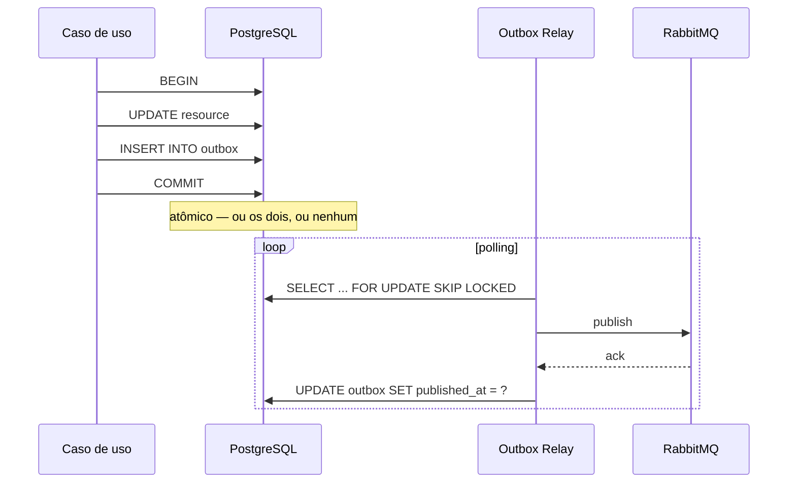

# ADR-0007: Transactional Outbox e Inbox como base de integração

- **Estado:** Proposto
- **Data:** 2026-07-26
- **Etapa do roadmap:** 2 (Outbox) e 3 (Inbox)
- **Relacionado:** ADR-0002, ADR-0003, ADR-0008

## Contexto

Os serviços do laboratório precisam publicar eventos quando o estado muda. Um serviço
grava no PostgreSQL e publica no RabbitMQ.

O banco e o broker são dois sistemas distintos. Eles não compartilham transação.

## Problema

Este é o **dual-write problem**. Não existe forma de gravar no banco e publicar no
broker atomicamente sem coordenação distribuída.

As duas ordens ingênuas falham:

```mermaid
flowchart TB
    subgraph A["Ordem 1 — grava, depois publica"]
        A1[BEGIN] --> A2[UPDATE resource]
        A2 --> A3[COMMIT]
        A3 --> A4["publish evento"]
        A4 -.->|processo morre aqui| A5["❌ estado mudou<br/>evento nunca publicado"]
    end

    subgraph B["Ordem 2 — publica, depois grava"]
        B1["publish evento"] --> B2[BEGIN]
        B2 --> B3[UPDATE resource]
        B3 --> B4[COMMIT]
        B4 -.->|transação falha| B5["❌ evento publicado<br/>estado nunca mudou"]
    end

    style A5 fill:#4c1d1d,stroke:#f87171,color:#e5e7eb
    style B5 fill:#4c1d1d,stroke:#f87171,color:#e5e7eb
```



A ordem 1 perde eventos. A ordem 2 inventa eventos. Perder é ruim; inventar é pior —
o consumidor age sobre um fato que não aconteceu.

Uma transação XA (two-phase commit) resolveria, mas o RabbitMQ não a suporta de forma
prática, e o custo de disponibilidade do 2PC é alto: o coordenador é ponto único e
uma falha durante o `prepare` bloqueia participantes.

## Decisão

O laboratório usa **Transactional Outbox** na publicação e **Inbox** no consumo.

### Outbox

O evento é gravado numa tabela `outbox`, **na mesma transação** que altera o estado.
Uma escrita, um sistema, uma transação. O dual-write desaparece.



Um processo separado — o **relay** — lê a tabela e publica. Ele usa
`SELECT ... FOR UPDATE SKIP LOCKED` para permitir várias réplicas sem que duas peguem
a mesma linha.

**O relay entrega at-least-once, nunca exactly-once.** Entre o `publish` e o
`UPDATE outbox` existe uma janela. Se o processo morrer nela, o evento é publicado de
novo na próxima rodada. Esta janela não pode ser fechada — só compensada no consumidor.

### Inbox

O consumidor grava o `eventId` numa tabela `inbox` antes de processar, na mesma
transação do efeito. Se o `eventId` já existir, o evento é descartado.

```
at-least-once delivery  +  idempotent processing
= efeito observável de exactly-once
```

**Exactly-once fim a fim não existe.** O que existe é entrega repetida com efeito
único. Essa distinção é o centro do tema, e o laboratório a torna visível: a métrica
`inbox.duplicates.discarded` mostra quantas vezes o mesmo evento chegou.

### Deduplicação não é ordenação

Estes são dois problemas diferentes, e confundi-los é o erro mais comum da área.

| | Pergunta | Mecanismo | Resolve |
|---|---|---|---|
| **Deduplicação** | Já processei este `eventId`? | tabela `inbox` | evento repetido |
| **Ordenação** | Este fato é mais novo que o estado atual? | `SEQUENCE_GUARD` (ADR-0003) | evento fora de ordem |

O Inbox descarta um heartbeat duplicado. Ele **não** descarta um heartbeat antigo que
chegou depois de um recente — o `eventId` é diferente, então passa. Ver ADR-0002,
origem Agent.

### Envelope de evento

Todo evento carrega os campos definidos no ADR-0005, em `shared/`:

| Campo | Uso |
|---|---|
| `eventId` | chave de deduplicação no Inbox |
| `aggregateId` | chave de partição; roteamento |
| `aggregateVersion` | ordenação por agregado |
| `correlationId` | agrupa tudo que pertence a um mesmo fluxo de negócio |
| `causationId` | o `eventId` do evento que causou este — forma a árvore causal |
| `traceId` | liga o evento ao trace do OpenTelemetry |
| `occurredAt` | quando o fato aconteceu (relógio da origem, não confiável) |
| `producer` | quem publicou |
| `payload` | o fato |

`correlationId` e `causationId` juntos permitem reconstruir a árvore de causa de
qualquer efeito. Isso é o que o frontend da Etapa 7 desenha.

## Consequências

### Positivas

- Nenhum evento é perdido e nenhum é inventado. A garantia é estrutural, não
  dependente de retry bem configurado.
- O relay em múltiplas réplicas conecta metade dos temas do laboratório: sem
  proteção há publicação duplicada; as saídas são `FOR UPDATE SKIP LOCKED`, eleição
  de líder (`SINGLE_WRITER`) ou partição por hash (`PARTITION_KEY`) — as mesmas
  estratégias do ADR-0003, agora aplicadas ao próprio laboratório.
- A tabela `outbox` é o registro auditável do que o serviço decidiu publicar,
  independente do broker.

### Negativas

- **Latência adicional.** O evento só sai no próximo ciclo de polling. Com intervalo
  de 200 ms, a latência mediana adicionada é 100 ms. Isso é visível no laboratório e
  deve ser medido, não escondido.
- **A tabela `outbox` cresce.** Ela precisa de expurgo. Um expurgo agressivo demais
  apaga a evidência que um experimento precisaria. Este conflito é real e será
  documentado quando a política de retenção for definida.
- **A tabela `inbox` também cresce**, e o crescimento é pior: ela não pode ser
  expurgada livremente. Apagar um `eventId` reabre a janela de duplicação para
  aquele evento. A janela de retenção precisa ser maior que o prazo máximo de
  retentativa do produtor.
- Duas tabelas de infraestrutura por serviço, mais um processo de fundo por serviço.
  O custo operacional é real.

### Neutras

- O polling pode ser substituído por Change Data Capture (Debezium lendo o WAL). O
  laboratório usa polling por ser mais simples de operar e por tornar o mecanismo
  visível. CDC é um tema legítimo para uma etapa futura.

## Alternativas consideradas

### Alternativa A — publicar direto, com retry

Publicar no broker após o commit, com retentativa em caso de falha.

**Descartada.** O retry não resolve o caso em que o processo morre. O evento é
perdido em silêncio, e nenhuma métrica revela isso — o serviço não sabe que devia ter
publicado.

### Alternativa B — Transação XA (two-phase commit)

Coordenar banco e broker numa transação distribuída.

**Descartada.** O RabbitMQ não suporta XA de forma prática. Além disso, o 2PC troca
o problema de consistência por um problema de disponibilidade: uma falha do
coordenador entre o `prepare` e o `commit` deixa participantes bloqueados,
segurando locks.

Vale registrar: o 2PC **resolve** o dual-write. Ele não é errado. Ele é caro. A
indústria abandonou o 2PC entre serviços porque a indisponibilidade que ele introduz
custa mais que a consistência eventual que o Outbox aceita.

### Alternativa C — Listen-to-Yourself

O serviço publica o evento primeiro e só altera o próprio estado ao consumi-lo de
volta.

**Descartada, mas com respeito.** É uma solução elegante: existe uma escrita só, e o
estado deriva do fluxo de eventos. O problema é o efeito no cliente síncrono do
Operator (ADR-0002): a resposta HTTP não pode confirmar a alocação, porque no momento
da resposta o estado ainda não mudou. O laboratório precisa do caminho síncrono para
estudar `lost update` com resposta imediata.

### Alternativa D — Change Data Capture com Debezium

Ler o WAL do PostgreSQL e publicar as mudanças.

**Adiada.** É mais eficiente que polling e elimina a latência do ciclo. Mas exige
Kafka Connect e configuração de replicação lógica, e o mecanismo fica escondido
dentro do Debezium — o oposto do que o laboratório quer na Etapa 2. Bom candidato a
uma etapa posterior, comparando as duas abordagens sob o mesmo experimento.

## Quando esta decisão deixa de valer

Reveja o polling se a latência adicionada dominar as medições de convergência. O
sinal concreto: um experimento cujo resultado muda ao alterar apenas o intervalo de
polling do relay. Isso indica que o instrumento está medindo a si mesmo.
