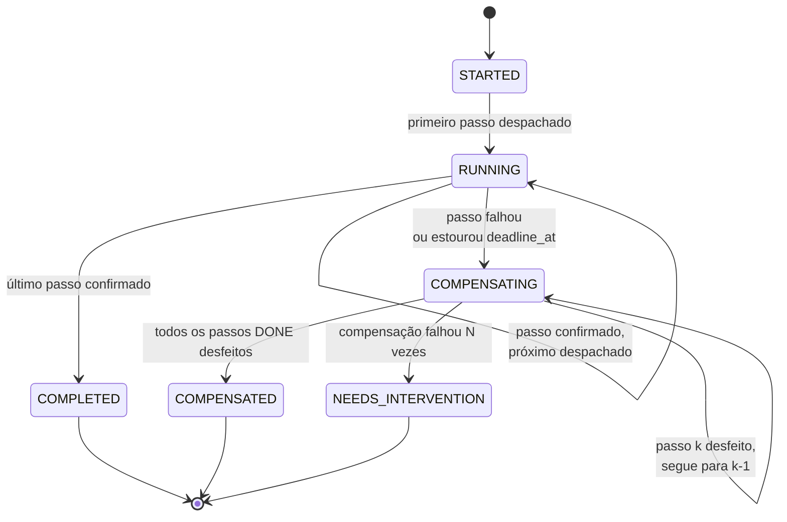
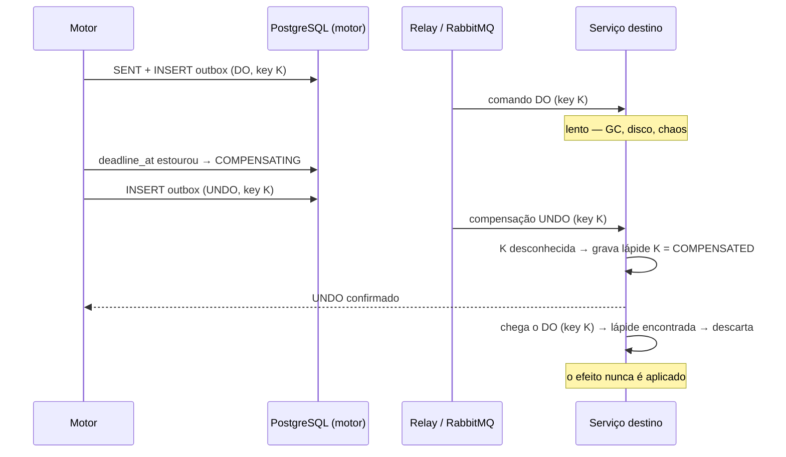

# ADR-0008: Motor de workflow próprio com profundidade máxima 2

- **Estado:** Proposto
- **Data:** 2026-07-26
- **Etapa do roadmap:** 5
- **Relacionado:** ADR-0001, ADR-0002, ADR-0003, ADR-0004, ADR-0006, ADR-0007,
  ADR-0009, ADR-0011

## Contexto

A Etapa 5 do roadmap traz saga e compensação. O ADR-0001 já registra por que isso
não cabe antes: *"um único agregado limita os cenários de consistência entre
agregados. A saga precisa de mais de um recurso para ser interessante"*.

Uma saga sobre um recurso só é uma transação local com passos extras. O caso
instrutivo exige **dois recursos**: reservar capacidade no primeiro, reservar no
segundo, e o segundo falhar depois de o primeiro já estar comprometido. A partir
daí não existe rollback — existe compensação, que é uma escrita nova, com todos os
problemas de qualquer escrita nova.

O laboratório já tem as peças que uma saga consome. O ADR-0007 dá o Outbox e o
Inbox, e estabelece que tudo opera sob *at-least-once*. O ADR-0003 dá as
estratégias de filtragem do Grupo 2. O ADR-0002 dá o estado `OVERCOMMITTED` e a
origem Lease Expiry. O que falta é o mecanismo que encadeia os passos e decide
quando desfazer.

## Problema

A escolha default da indústria é adotar um motor maduro: Temporal, Camunda/Zeebe,
Netflix Conductor ou Spring Statemachine. Essa escolha é quase sempre certa em
produção. Aqui ela colide com o objetivo do repositório.

Três forças estão em conflito.

**Força 1 — o laboratório existe para observar o mecanismo, não para usá-lo.** As
perguntas da Etapa 5 são: onde o estado da saga é persistido, em qual transação
ele comita, como a compensação é reentregue, o que sobra no banco se o processo
morrer entre dois passos. Um motor de terceiros responde todas essas perguntas
por dentro. Adotá-lo é apagar o objeto de estudo.

**Força 2 — um motor maduro é correto, e correção atrapalha aqui.** Temporal
garante execução durável com *event sourcing* do histórico e replay determinístico.
Isso é excelente em produção e péssimo num laboratório que precisa que a coisa
**quebre de formas instrutivas**. Um motor que nunca perde um passo nunca ensina
o que acontece quando um passo se perde.

**Força 3 — um motor próprio terá bugs, e um bug do motor vira um falso resultado
de consistência.** Este é exatamente o risco que a separação Lab Plane / Control
Plane (ADR-0006, regra 6) existe para evitar. Se o motor perde um passo por defeito
próprio, o relatório do ADR-0004 registra uma alocação órfã — indistinguível, à
primeira vista, de uma falha de consistência real.

A pergunta é: como ter um motor de workflow observável até o nível da transação,
sem que os defeitos dele contaminem a medida?

## Decisão

O laboratório usa um **motor de workflow próprio**, com **profundidade máxima 2**,
persistido em PostgreSQL e integrado ao Outbox do ADR-0007.

O motor faz três coisas e nada mais: encadeia passos, persiste o ponto em que
está, e dispara compensações na ordem inversa. Ele não decide capacidade, não lê
`resource.available` e não conhece a invariante do ADR-0001.

### O motor pertence ao Control Plane

O motor é **sistema sob teste**, não instrumento. Duas razões, e a primeira é
estrutural.

A regra 6 do ADR-0006 proíbe o Control Plane de importar o Lab Plane. O motor
executa escritas de negócio dentro das transações dos serviços do Control Plane.
Se ele vivesse no Lab Plane, o Control Plane precisaria importá-lo — a regra 6
seria violada na primeira linha de código.

A segunda razão é de propósito. *Onde o estado da saga comita* é a pergunta da
Etapa 5. Uma pergunta não pode ser respondida por um componente declarado fora do
escopo da medida.

### Como um bug do motor é distinguido de um bug de consistência

A pertinência ao Control Plane cria a dívida que a Força 3 descreve. Três
mecanismos a pagam, em ordem de força decrescente.

**1. O motor não pode violar a invariante, por construção.** O motor nunca avalia
`Σ alocações ≤ capacity`. Ele despacha um passo e registra o resultado. A
invariante é verificada exclusivamente dentro do passo, pela estratégia do
ADR-0003, na transação do serviço destino. Consequência: um defeito do motor
produz passo perdido, passo duplicado ou compensação não executada — e esses
aparecem como **alocação órfã** ou como **saga que não converge**, nunca como
`safety.violations`. O eixo de safety do ADR-0002 fica fora do alcance do motor.

Isso pede uma décima regra ArchUnit (ADR-0006): o pacote do motor não importa o
domínio de negócio. Ele manipula envelopes, chaves e estados de passo.

**2. O motor tem invariante própria, verificável por SQL, independente da do
domínio.** Quatro asserções:

```sql
-- toda saga COMPLETED tem todos os passos em DONE
-- toda saga COMPENSATED não tem nenhum passo em DONE
-- nenhum passo em SENT sem linha correspondente no outbox
-- nenhuma instância com depth > 2   (também garantido por CHECK)
```

O resultado agrega em `engine.violations`. Um experimento com
`engine.violations > 0` é **inválido**, não reprovado: ele não produz resultado de
consistência nenhum. É a mesma lógica do grupo de controle `NONE` no ADR-0003 —
um instrumento que falha na própria verificação não mede.

**3. A saga de calibração.** Toda execução da Etapa 5 roda antes uma saga
degenerada: um passo só, compensação inócua, sobre um cenário cujo veredito o
ADR-0003 já fixou (`MATERIALIZED` + `ATOMIC_UPDATE`, esperado: protege). Se o
caminho direto e o caminho pela saga degenerada discordarem, a diferença é o
motor.

Os três mecanismos são mitigação, não prova. Um bug no motor que perca passos
*com a mesma distribuição* do que o experimento está medindo passaria pelos três.
Isso é registrado como consequência negativa, não como risco resolvido.

### Profundidade máxima 2

Profundidade é contada **por instância**, em tempo de execução, não por definição.

| Profundidade | O que é | Permitido |
|---|---|---|
| 1 | saga raiz, iniciada por uma origem de escrita do ADR-0002 | sim |
| 2 | saga iniciada por um **passo** de uma saga de profundidade 1 | sim |
| 3 | saga iniciada por um passo de uma saga de profundidade 2 | **não** |

O limite é **estrutural, não convencional**. A coluna `depth` carrega um
`CHECK (depth BETWEEN 1 AND 2)`, e o motor recusa iniciar filha quando
`parent.depth = 2`. A recusa é uma falha de passo como qualquer outra: ela dispara
a compensação da saga pai. O limite não depende de disciplina de quem escreve a
definição.

**Por que o limite existe.** Profundidade ilimitada é onde motores próprios
morrem. Ela traz, de uma vez: detecção de ciclo, propagação de compensação por uma
árvore, ordem de compensação entre irmãos, e o caso em que um neto falha depois de
um tio já ter comitado. Cada um desses é um trabalho de motor, não um trabalho de
laboratório.

**Por que 2 e não 1.** O nível 2 é onde aparece o fato que o nível 1 não produz: a
saga filha comita em transações próprias, e o pai só descobre o desfecho por
mensagem. O ponto de commit deixa de ser único mesmo dentro de um único fluxo de
negócio.

**Por que não 3.** O valor didático marginal do terceiro nível é baixo. Tudo o que
ele ensinaria — compensação subindo pela árvore, filho falhando depois de o pai já
ter comprometido um irmão — já acontece no segundo nível. O terceiro adiciona
combinatória, não fenômeno.

**A filha é um passo do pai.** O passo do pai fica `DONE` quando a filha alcança
`COMPLETED`. A compensação desse passo é a compensação da filha, executada na
ordem inversa dos passos dela. Uma filha que compensa sozinha **não** reprova o pai
automaticamente: ela reporta falha do passo, e o pai decide.

### O modelo de persistência do estado da saga

```sql
CREATE TABLE saga_instance (
    id             uuid        PRIMARY KEY,
    definition     text        NOT NULL,   -- 'PLACEMENT' | 'EVICTION'
    state          text        NOT NULL,
    depth          smallint    NOT NULL DEFAULT 1,
    parent_id      uuid        NULL REFERENCES saga_instance (id),
    parent_step_no smallint    NULL,
    correlation_id uuid        NOT NULL,   -- envelope do ADR-0007
    causation_id   uuid        NULL,
    input          jsonb       NOT NULL,   -- imutável após a criação
    current_step   smallint    NOT NULL DEFAULT 0,
    deadline_at    timestamptz NOT NULL,   -- prazo do passo corrente
    locked_by      text        NULL,       -- réplica que conduz a instância
    locked_until   timestamptz NULL,
    created_at     timestamptz NOT NULL,
    updated_at     timestamptz NOT NULL,

    CONSTRAINT saga_depth_max_2 CHECK (depth BETWEEN 1 AND 2),
    CONSTRAINT saga_raiz_sem_pai CHECK ((depth = 1) = (parent_id IS NULL))
);

CREATE TABLE saga_step (
    saga_id          uuid        NOT NULL REFERENCES saga_instance (id),
    step_no          smallint    NOT NULL,
    name             text        NOT NULL,
    state            text        NOT NULL,
    idempotency_key  uuid        NOT NULL, -- uuid5(saga_id, step_no, 'DO')
    compensation_key uuid        NOT NULL, -- uuid5(saga_id, step_no, 'UNDO')
    attempt          smallint    NOT NULL DEFAULT 0,
    request          jsonb       NOT NULL,
    result           jsonb       NULL,
    sent_at          timestamptz NULL,
    settled_at       timestamptz NULL,

    PRIMARY KEY (saga_id, step_no)
);

CREATE INDEX saga_pendente ON saga_instance (deadline_at)
 WHERE state NOT IN ('COMPLETED', 'COMPENSATED', 'NEEDS_INTERVENTION');
```

As duas chaves são **determinísticas**, derivadas de `(saga_id, step_no)`. Uma
retentativa produz a mesma chave. É isso que permite ao serviço destino aplicar o
`IDEMPOTENCY_KEY` do Grupo 2 (ADR-0003) sem coordenação adicional.

#### A saga comita na mesma transação que o passo de negócio?

Depende do passo, e a resposta honesta é uma tabela, não um sim ou um não.

| Momento | O que comita junto | Janela de perda |
|---|---|---|
| passo **local** (mesmo schema do orquestrador) | transição do passo **+** escrita de negócio, uma transação | nenhuma |
| passo **remoto** — despacho | transição `PENDING → SENT` **+** `INSERT INTO outbox` | nenhuma |
| passo **remoto** — efeito | commit no serviço destino, fora da transação do motor | **sim** |
| passo **remoto** — resposta | `INSERT INTO inbox` **+** `SENT → DONE` | nenhuma |

A janela é a terceira linha, e ela **não pode ser fechada**. É o resultado do
ADR-0007 aplicado à saga: o efeito remoto está comprometido e o motor ainda não
sabe. Fechá-la exigiria 2PC entre o orquestrador e o serviço destino, que o
ADR-0007 já descartou.

O que existe é compensação, em três camadas: a resposta é *at-least-once* e será
reentregue; a varredura de recuperação reenvia o passo com a **mesma**
`idempotency_key`, e o destino descarta; e, em último caso, a reserva expira por
`expires_at`.

**Regra dura: o motor nunca faz I/O remoto dentro de uma transação.** O único
sistema que ele toca com a transação aberta é o próprio PostgreSQL. Toda saída é
uma linha no `outbox`.

### `expires_at` — este é o ADR da dívida do ADR-0002

O ADR-0002 registra que a origem Lease Expiry exige `expires_at` em `allocation`,
campo que o ADR-0001 não tem, e que *"quando a Etapa 5 chegar, um ADR novo adiciona
`expires_at`"*. **Este é esse ADR.** O campo entra aqui porque a saga o exige por
conta própria: uma reserva do passo 1 que fique pendente para sempre é capacidade
perdida sem dono.

```sql
ALTER TABLE allocation ADD COLUMN expires_at timestamptz NULL;
-- status: RESERVED | ACTIVE | RELEASED | EXPIRED
```

Duas consequências sobre o ADR-0001, ambas declaradas aqui:

1. **A invariante conta reservas.** `Σ(alocações ativas)` passa a significar
   `status IN ('RESERVED', 'ACTIVE')`. Uma reserva que não contasse não protegeria
   nada, e o passo 1 da saga seria decorativo.
2. **O ADR-0001 é substituído por este ADR** no que diz respeito ao schema de
   `allocation` e à definição de "alocação ativa". O restante do ADR-0001 —
   invariante única, os dois `capacityModel` — continua em vigor.

O ADR-0002 prevê a alternativa de o campo entrar direto no ADR-0001 caso ele ainda
esteja `Proposto`. Essa escolha é escrituração e cabe a quem aceitar os dois ADRs;
ela não muda o conteúdo desta decisão.

### A máquina de estados da saga



`NEEDS_INTERVENTION` é terminal e não tem retentativa automática. Uma compensação
que falha em definitivo é um fato real de sagas em produção, e escondê-lo atrás de
retry infinito trocaria um problema visível por um invisível. A métrica
`saga.compensation.failed` é asseverável pelo ADR-0004.

### A compensação é at-least-once, logo precisa ser idempotente

O ADR-0007 estabelece que nada no laboratório é *exactly-once*. A compensação é
uma mensagem como outra qualquer: ela chega repetida.

A regra do laboratório é uma só: **toda compensação é ancorada numa transição de
estado da própria linha que ela desfaz.** O delta, quando existe, é aplicado na
mesma transação e condicionado ao sucesso da transição.

| `capacityModel` | Forma da compensação | Idempotente sozinha |
|---|---|---|
| `DERIVED` | `UPDATE allocation SET status='RELEASED' WHERE id=? AND status='RESERVED'` | sim — 0 linhas na segunda vez |
| `MATERIALIZED` | o mesmo `UPDATE`, **mais** `available = available + n` no mesmo `BEGIN`, só se o `UPDATE` afetou 1 linha | sim, **se e somente se** condicionada |

A forma errada é a compensação escrita como delta puro:

```sql
UPDATE resource SET available = available + 4 WHERE id = ?;  -- sem âncora
```

Ela é o `ATOMIC_UPDATE` do ADR-0003 outra vez: correta sob concorrência, não
idempotente sob reentrega. Nenhum erro é lançado, e `available` diverge das
alocações que existem de fato. Esta célula é um experimento, não um descuido.

A ancoragem é a primeira linha de defesa. A segunda é o `IDEMPOTENCY_KEY` do
Grupo 2, alimentado pela `compensation_key` determinística. As duas coexistem de
propósito: a ancoragem protege dentro do agregado, a chave protege o caminho de
mensagem — e a diferença entre as duas é observável quando uma delas é desligada.

**Limite desta conclusão.** A ancoragem funciona porque todo efeito compensável
deste domínio cria uma linha com `status`. Uma compensação sem âncora — desfazer
um e-mail, um débito em terceiro — não tem essa saída, e o laboratório não a
oferece. A conclusão não generaliza, e dizer isso faz parte do resultado.

### Se o motor cair entre dois passos

Este é o cenário mais instrutivo que o motor produz. Ele tem quatro pontos de
morte distintos.

| Onde o processo morre | O que ficou no banco | Como a recuperação resolve |
|---|---|---|
| antes do commit do passo 1 | nada | a saga não existe; quem a pediu recebe erro |
| depois do commit do despacho, antes de o relay publicar | `SENT` + linha no `outbox` | o relay publica na próxima rodada (ADR-0007) |
| depois do efeito remoto, antes de registrar a resposta | efeito comprometido, saga em `SENT` | a varredura reenvia; a `idempotency_key` absorve |
| durante a compensação | passo em `COMPENSATING` | a varredura reenvia; a compensação é idempotente |

#### Dois relógios, e confundi-los é o bug clássico

| Coluna | Significado | Quem a estoura | Efeito |
|---|---|---|---|
| `locked_until` | arrendamento da réplica que **conduz** a saga | queda do motor | outra réplica assume |
| `deadline_at` | prazo do **passo corrente** | ausência de resposta | o passo falha, a saga compensa |

Um motor que cai estoura o primeiro. Ele **não deve** estourar o segundo por si só
— caso contrário, todo reinício do motor compensaria sagas que estavam saudáveis.

A varredura de recuperação lê as instâncias não terminais com
`FOR UPDATE SKIP LOCKED`, exatamente como o relay do ADR-0007, e pelo mesmo motivo:
várias réplicas, nenhuma pegando a mesma linha. Com múltiplas réplicas na Etapa 5,
`SINGLE_WRITER` e `PARTITION_KEY` (ADR-0003) voltam a valer, agora aplicados ao
próprio motor.

#### O `deadline_at` é absoluto, e isso é deliberado

`deadline_at` é marcado no despacho e **não é estendido** pela recuperação. Se o
motor ficar fora do ar por mais tempo que o prazo do passo, as sagas pendentes
compensam em massa ao voltar.

Isso é assumido de propósito. Uma **indisponibilidade prolongada do orquestrador
converte-se em compensação em massa** — um resultado que times descobrem em
produção e que o laboratório pode produzir sob demanda, com semente fixa
(ADR-0004).

#### A compensação órfã

O `deadline_at` pode estourar enquanto o efeito remoto está em voo. A compensação
chega ao destino **antes** do efeito que ela desfaz.



A lápide não é um mecanismo novo: ela é uma linha na **mesma tabela de chaves já
vistas** que o `IDEMPOTENCY_KEY` do Grupo 2 (ADR-0003) já usa, gravada pela
compensação em vez de pelo efeito. O custo é o mesmo do Inbox no ADR-0007: a
tabela não pode ser expurgada antes do prazo máximo de retentativa do produtor.

Sem lápide, o destino teria duas saídas ruins: rejeitar a compensação de algo que
não conhece, deixando o efeito órfão quando ele chegar; ou aceitá-la em silêncio,
com o mesmo resultado. A lápide é a única que fecha a corrida.

### A saga que o laboratório roda de fato

`PlacementSaga` — colocar uma carga que precisa de **4 unidades de compute** e
**2 unidades de storage**. Dois recursos do ADR-0001, portanto duas fronteiras
transacionais.

| # | Passo | Efeito | Compensação |
|---|---|---|---|
| 1 | `RESERVE_COMPUTE` | `allocation` de 4 no recurso de compute, `RESERVED`, `expires_at = now + 30s` | `RELEASE_COMPUTE` — `RESERVED → RELEASED` |
| 2 | `ENSURE_STORAGE_CAPACITY` | se o recurso de storage está `OVERCOMMITTED` (ADR-0002), inicia a saga filha `EvictionSaga`; senão conclui direto | **nenhuma** — despejo de lease vencido não se desfaz |
| 3 | `RESERVE_STORAGE` | `allocation` de 2 no recurso de storage, `RESERVED` | `RELEASE_STORAGE` — `RESERVED → RELEASED` |
| 4 | `CONFIRM_PLACEMENT` | as duas alocações vão para `ACTIVE`, `expires_at = NULL` | **nenhuma — pivô** |

`EvictionSaga` (profundidade 2, iniciada pelo passo 2):

| # | Passo | Efeito | Compensação |
|---|---|---|---|
| 1 | `SELECT_VICTIMS` | lista alocações `RESERVED` com `expires_at < now` | nenhuma — leitura |
| 2 | `RELEASE_VICTIMS` | `RESERVED → EXPIRED` nas vítimas | nenhuma — pivô |

**A profundidade 3 é recusada aqui.** Se `RELEASE_VICTIMS` precisasse notificar o
dono de cada alocação despejada por uma saga própria, o motor recusa. A
notificação vira um passo local com retentativa, ou não existe.

Três fenômenos caem desta definição sem nenhum artifício:

- **O passo 3 falha depois do passo 1 comitado.** É o caso que justifica a saga.
- **O passo 2 é irreversível no meio da saga.** Uma falha no passo 3 compensa 1,
  mas o despejo do passo 2 fica. A saga não restaura o estado inicial — ela alcança
  um estado consistente diferente, e essa distinção costuma ser aprendida tarde.
- **A recuperação corre contra o `expires_at`.** Se o motor cai entre 3 e 4 por 30
  segundos, o Lease Expiry (ADR-0002) expira as reservas enquanto a varredura tenta
  retomar. Duas escritas legítimas sobre a mesma linha, com donos diferentes e
  relógios diferentes. É a origem Lease Expiry produzida pelo próprio motor.

### O que este ADR não decide

**Como cada passo é executado.** O despacho, a retentativa, o transporte e o modelo
de execução do passo são competência do **ADR-0009** (dois executores plugáveis).
Este ADR entrega ao executor um passo com `request`, `idempotency_key` e prazo, e
espera de volta sucesso ou falha. A troca de executor não altera nada aqui.

## Questões em aberto

### 1. O motor depende do ADR-0011, e a dependência muda o modelo de persistência

Este ADR fala em "passo local" e "passo remoto", mas **não decide** quais são
quais. Isso depende de quantos serviços existem e de quem é dono de `resource` e de
`allocation` — competência exclusiva do ADR-0011.

Os dois desfechos produzem motores diferentes:

- **Se o orquestrador é dono da tabela do primeiro passo**, o passo 1 é local: a
  transição da saga e a escrita de negócio comitam juntas, sem janela. A tabela
  `saga_instance` vive no schema desse serviço.
- **Se todo passo é remoto**, a linha "passo local" da tabela de commit some. Todo
  passo passa pelo `outbox`, toda resposta pelo `inbox`, e o motor vira um serviço
  que só conversa por mensagem. É mais uniforme e mais lento, e a janela do efeito
  remoto passa a existir desde o passo 1.

A favor de esperar o ADR-0011: escolher agora seria decidir decomposição por
tabela lateral. Contra: a Etapa 5 não começa sem essa resposta.

Há um agravante já registrado no `README.md` dos ADRs: a questão 3 do ADR-0003
observa que as quatro estratégias da Etapa 1 pressupõem transação local. Se o
ADR-0011 separar `resource` de `allocation` desde o início, a saga deixa de ser um
tema da Etapa 5 e vira pré-requisito da Etapa 1.

### 2. A saga é uma quinta origem de escrita?

O ADR-0002 fixa quatro origens e diz que uma quinta só entra se produzir um modo de
falha que as quatro não produzem.

A favor de ser uma quinta origem: a compensação escreve com semântica própria —
uma escrita cuja justificativa é um evento passado do próprio sistema, não um
comando do usuário nem um fato do mundo. E ela tem um modo de falha inédito: a
compensação órfã, que chega antes do efeito.

Contra: a saga é iniciada por um Operator e todos os seus passos são comandos
imperativos. Chamá-la de origem nova duplicaria a origem Operator sem mudar o
transporte nem a semântica de cada escrita isolada.

A decisão importa porque a matriz origem × estratégia do ADR-0003 ganha ou não
ganha uma linha.

### 3. A compensação pode iniciar uma saga filha?

O texto acima trata da profundidade no caminho de avanço. O caminho de compensação
não foi decidido.

A favor de permitir: uma compensação pode ser tão composta quanto o efeito que ela
desfaz. Se o passo 2 iniciou uma filha, desfazê-lo é executar uma saga.

Contra, e o argumento é forte: **uma saga de compensação não tem compensação.** Se
ela falhar no meio, o sistema fica num estado que nenhum mecanismo alcança, e o
único destino é `NEEDS_INTERVENTION` com efeitos parciais. A profundidade 2 no
avanço tem um teto claro; na compensação, o teto vira um buraco.

Uma terceira via: permitir apenas compensação com passos **planos e todos
idempotentes**, sem filha. É o que o exemplo do `PlacementSaga` já faz por acidente
— nenhum passo compensável dele inicia filha.

### 4. `deadline_at` e `expires_at` são dois relógios sobre a mesma reserva

Uma alocação `RESERVED` está sob dois prazos, com donos diferentes: o motor, que
pode decidir compensá-la, e o Lease Expiry (ADR-0002), que pode expirá-la. Nada
garante que os dois concordem, e a regra 8 do ADR-0006 torna os dois relógios
injetáveis e portanto divergíveis de propósito.

A favor de manter os dois: a corrida entre eles é exatamente o cenário da origem
Lease Expiry, agora com um segundo escritor real. É material de experimento.

Contra: dois prazos sobre a mesma linha, sem regra de precedência, produzem um
estado cuja explicação depende de qual relógio disparou primeiro — e o relatório do
ADR-0004 não tem hoje como registrar isso. Sem precedência declarada, o resultado é
ambíguo em vez de instrutivo.

Uma regra candidata: `expires_at` sempre maior que `deadline_at` do passo, por
margem declarada, de modo que o lease seja rede de segurança e nunca o primeiro a
disparar. Isso remove o cenário mais interessante para tornar o instrumento legível
— e essa troca não foi feita.

## Consequências

### Positivas

- O estado da saga é uma tabela SQL que se pode consultar durante o experimento.
  Onde ele comita, quando ele muda e o que sobra depois de uma queda são fatos
  observáveis por `SELECT`, não por documentação de fornecedor.
- O motor reusa o Outbox e o Inbox do ADR-0007 sem nada novo. Uma saga não é um
  mecanismo à parte: é o mesmo mecanismo de integração com uma tabela de estado.
- A varredura de recuperação com `FOR UPDATE SKIP LOCKED` repete o problema do
  relay, e por isso `SINGLE_WRITER` e `PARTITION_KEY` da Etapa 5 (ADR-0003) ganham
  um segundo consumidor sem custo de implementação novo.
- O limite de profundidade é uma `CHECK` constraint. Ele não depende de revisão de
  código nem de convenção, e a violação quebra na escrita.
- A compensação órfã e a compensação em massa por indisponibilidade do motor são
  resultados que a maioria dos times só encontra em produção. Aqui eles são
  reproduzíveis com semente fixa.
- `expires_at` deixa de ser dívida. A origem Lease Expiry passa de "decidida mas
  não implementável" (ADR-0002) para implementável.

### Negativas

- **O motor terá bugs, e os três mecanismos de distinção são mitigação, não
  prova.** Um defeito que perca passos com distribuição parecida com a do fenômeno
  medido passa pelos três. O laboratório fica com um instrumento que precisa ser
  calibrado antes de cada uso, e essa calibração é tempo que não produz
  conhecimento.
- **A profundidade 2 é uma restrição real.** Alguma definição futura vai querer
  três níveis, e a saída será achatar passos no pai — o que aumenta o número de
  passos e piora a legibilidade da definição.
- **Não há linguagem de definição de workflow.** Uma saga é código Java com uma
  lista de passos. Não existe BPMN, não existe editor visual, não existe
  versionamento de definição com migração de instâncias em voo. Alterar uma
  definição com sagas rodando é um problema sem resposta neste ADR.
- **A tabela `saga_instance` cresce e tem o mesmo conflito de expurgo do `outbox`
  (ADR-0007):** apagar cedo demais destrói a evidência de um experimento.
- **Duas tabelas e um processo de fundo a mais por serviço orquestrador**, somados
  aos do ADR-0007. O custo operacional do laboratório sobe outra vez.
- O laboratório não aprende a operar Temporal ou Camunda. Isso é conhecimento de
  mercado que fica de fora, e é uma perda real.

### Neutras

- O motor é código do Control Plane, sujeito às mesmas regras do ADR-0006 que
  qualquer serviço: hexagonal, sem `Instant.now()` fora do adaptador de relógio,
  sem `Random` fora de `shared..random..`.
- Adotar um motor maduro continua possível depois. As definições de saga são
  poucas e o modelo de passo com compensação é o mesmo em qualquer motor. A
  migração custaria dias, não meses.

## Alternativas consideradas

### Alternativa A — Temporal

Execução durável com histórico versionado e replay determinístico do workflow. O
código do workflow é escrito como código sequencial e o motor garante que ele
sobreviva a quedas.

**Descartada.** Temporal resolve exatamente o que a Etapa 5 existe para observar. O
estado do workflow vive no cluster do Temporal, o commit acontece dentro do
serviço dele, e a reentrega é problema dele. O laboratório perderia as quatro
perguntas de uma vez.

Há um agravante prático: o replay determinístico proíbe que o código do workflow
tenha não determinismo — que é justamente o que o `seed` do ADR-0004 injeta de
propósito. As duas premissas se cancelam.

E há o custo de infraestrutura: cluster próprio, banco próprio (Cassandra ou
PostgreSQL), workers e uma UI. Isso domina o homelab da Etapa 10 e o tempo de
aprendizado, para operar um componente que o laboratório não estuda.

### Alternativa B — Camunda 8 / Zeebe

Orquestração por BPMN, com um broker distribuído próprio, particionado e
replicado por Raft.

**Descartada.** O peso operacional é o maior das quatro: Zeebe broker, gateway,
Elasticsearch para exportação, Operate para visualização. É mais infraestrutura que
todo o resto do laboratório somado.

Vale registrar o que se perde: o BPMN é uma linguagem de definição legítima, e um
diagrama executável seria excelente material didático. Não compensa. O objeto de
estudo é o commit da saga, não a notação dela.

### Alternativa C — Netflix Conductor

Orquestração declarativa em JSON, com um servidor e um banco próprios. Mais leve
que Temporal e que Zeebe.

**Descartada.** É a alternativa mais próxima de viável — a definição em JSON até
combina com o `Experiment` do ADR-0004. Mas o problema central permanece: o estado
da tarefa vive no Conductor, e a semântica de reentrega e de compensação é
implementada lá dentro. A redução de peso operacional não recupera nada da
observabilidade perdida.

### Alternativa D — Spring Statemachine

Uma máquina de estados na própria JVM, sem infraestrutura nova, integrada ao
Spring que o laboratório já usa.

**Descartada.** É a alternativa mais barata e a que mais engana. Spring Statemachine
modela transições; ele **não** resolve durabilidade, recuperação após queda,
reentrega, prazo por passo nem compensação. Tudo o que este ADR decide continuaria
por escrever — só que espalhado entre a configuração da máquina e o código de
persistência, em vez de concentrado numa tabela.

O resultado seria um motor próprio com uma dependência extra, e com o estado da
saga menos visível do que numa tabela escrita à mão.

### Alternativa E — coreografia, sem orquestrador

Nenhum motor. Cada serviço reage a eventos dos outros e publica os seus. A saga
existe apenas como o encadeamento emergente dos consumidores.

**Descartada, e com respeito.** É a alternativa mais fiel à filosofia de eventos do
ADR-0007, não adiciona componente nenhum, e reusa Outbox e Inbox tais como estão.

O motivo do descarte é o objetivo do laboratório, não a qualidade da ideia:
**na coreografia não existe um lugar onde o estado da saga esteja.** Ele é a soma
distribuída dos estados dos participantes. Sem esse lugar, três perguntas da Etapa 5
ficam sem sujeito — onde o estado comita, o que a recuperação varre, quem decide
compensar. A compensação vira uma cadeia de eventos de reversão sem dono, e o
progresso da saga só é observável reconstruindo a árvore causal do ADR-0007.

Registre-se o custo: o laboratório fica sem o experimento *orquestração versus
coreografia*, que é legítimo. Ele cabe numa etapa posterior, com ADR próprio, agora
que existe o orquestrador para servir de termo de comparação.

### Alternativa F — motor próprio, sem limite de profundidade

O mesmo motor deste ADR, sem a `CHECK` constraint.

**Descartada.** Profundidade ilimitada traz detecção de ciclo, ordem de compensação
entre irmãos e propagação de falha por uma árvore. Cada um é um bug de motor à
espera, e cada bug de motor é um falso resultado de consistência — o custo que a
Força 3 descreve, multiplicado.

O ganho é pequeno: nenhum dos fenômenos da Etapa 5 exige o terceiro nível. A
`CHECK` custa uma linha e remove uma classe inteira de defeito.

## Quando esta decisão deixa de valer

Reveja esta decisão se o motor passar a produzir mais ruído que sinal. O sinal
concreto: **três experimentos seguidos cujo veredito precisou ser descartado por
`engine.violations > 0`**. Nesse ponto o motor deixou de ser objeto de estudo e
virou fonte de erro, e adotar Temporal — aceitando perder a visibilidade — passa a
ser a troca correta.

Reveja a profundidade máxima 2 se duas definições distintas precisarem achatar
passos no pai para caber no limite. Uma é acidente de modelagem; duas indicam que o
limite está cortando fenômeno, e não apenas combinatória.

Reveja a decisão inteira se o ADR-0011 concluir que o laboratório tem um serviço
só. Sem fronteira de serviço não há saga: sobra uma transação local com passos, e o
motor vira custo sem retorno.
