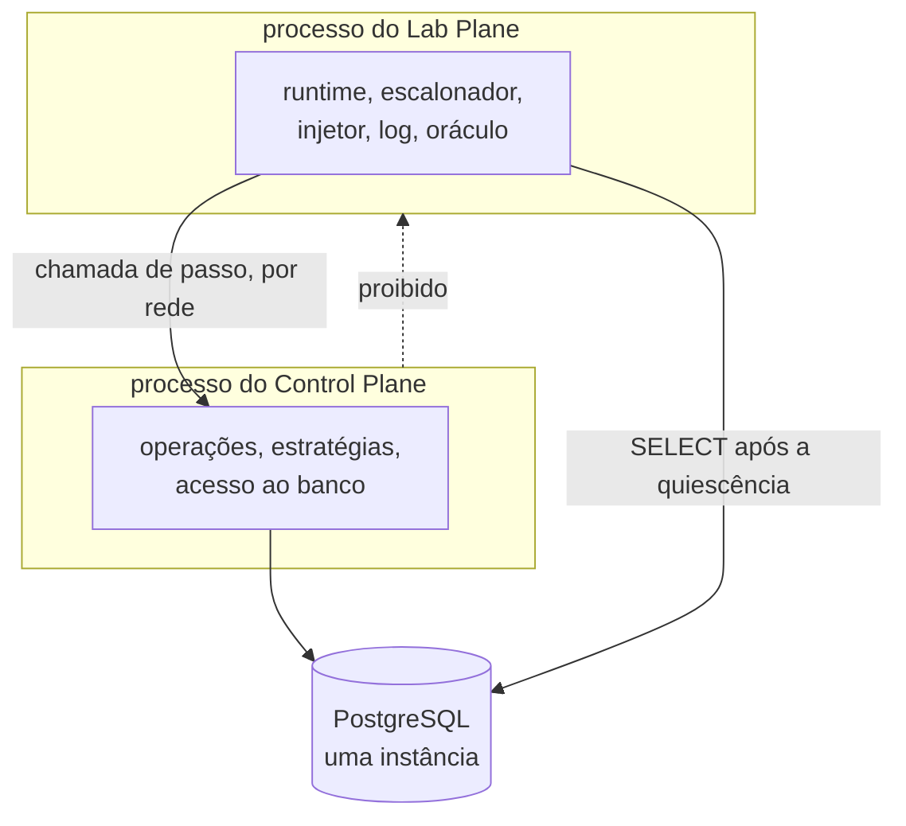

# ADR-0008: Os dois planos em processos separados, desde o dia zero

- **Estado:** Aceito
- **Data:** 2026-08-04
- **Etapa do roadmap:** 1
- **Relacionado:** [ADR-0001](0001-o-passo-como-unidade-de-execucao.md),
  [ADR-0002](0002-o-dominio-minimo-e-os-dois-oraculos.md) e
  [ADR-0005](0005-a-forma-do-escalonador.md). Fecha `D-ARQ-05` e `D-ARQ-06` de
  [`decisoes-pendentes.md`](../architecture/decisoes-pendentes.md), e `D-ARQ-01` por
  consequência.

- **Última atualização:** 2026-08-05
- **Alterado por:** [ADR-0009](0009-a-classificacao-do-dual-write-e-a-regiao-de-pacote.md)
  — emenda; a região de pacote `dev.da0hn.lab.controlplane` (seção "Decisão", tabela de
  pacotes, `:70`) passa a `dev.da0hn.lab.sut`.

## Contexto

A árvore versionada não tem `pom.xml` nem classe Java, e o pacote raiz nunca foi
escolhido.

O Control Plane é o sistema sob teste; o Lab Plane é o instrumento que o mede. O plano
fixa o MVP num processo só, com os dois planos na mesma JVM, e prevê o segundo processo
apenas na etapa 4, quando o experimento `JVM_LOCK` ficar vermelho com duas instâncias
(`../architecture/arquitetura-alvo.md:29-34`).

Na mesma JVM os dois planos compartilham destino. Uma pausa de GC, um pool esgotado ou
um vazamento no instrumento perturba o sistema medido, e o relatório não distingue isso
de contenção real no banco. Nenhum documento do repositório tinha escrito esse
argumento.

O usuário declarou uma restrição de infraestrutura: o homelab terá **uma** instância de
PostgreSQL.

## Problema

Onde vive a fronteira entre os dois planos, e em que idioma o artefato é escrito?

- Um defeito do instrumento que atravesse a fronteira vira falso resultado de
  consistência.
- Uma fronteira de processo entra na medida: o runtime consulta escalonador e injetor em
  cada fronteira entre passos.
- Toda guarda de [`Q-0002-1`](../questions/Q-0002-1.md) é expressa em padrão de pacote,
  e um padrão ambíguo torna a regra inexprimível.
- O domínio está em inglês por ADR aceito; o glossário está em português.

## Decisão

**O Control Plane e o Lab Plane rodam em processos separados, desde o dia zero.** O Lab
Plane hospeda runtime, escalonador, injetor de falha, log e oráculo; o Control Plane
hospeda as operações, as estratégias e o acesso ao banco. A chamada de passo atravessa a
rede, do Lab Plane para o Control Plane. O Control Plane NÃO DEVE chamar o Lab Plane.

O pacote raiz é `dev.da0hn.lab`, e o primeiro segmento depois da raiz nomeia a região.

| Pacote                       | Região                             |
|------------------------------|------------------------------------|
| `dev.da0hn.lab.shared`       | contratos vistos pelos dois planos |
| `dev.da0hn.lab.labplane`     | o instrumento                      |
| `dev.da0hn.lab.controlplane` | o sistema sob teste                |
| `dev.da0hn.lab.application`  | composição e ponto de entrada      |

**Todo identificador é escrito em inglês, sem exceção**: pacote, tipo, método, campo e
nome de coluna.

A explicação do glossário permanece em **português**, e
[`../CONTEXT.md`](../CONTEXT.md) passa a nomear cada termo em inglês, com a
correspondência para o termo português usado nos ADRs aceitos.

## Justificativa

**Por que processos separados.** É a única fronteira que não depende de disciplina — não
existe import a escrever nem teste a lembrar de rodar — e a única que separa destino. Um
vazamento no Lab Plane deixa de perturbar a medida, e essa é a falha que o instrumento
não sabe distinguir de contenção real.

**Por que a região no primeiro segmento do pacote.** As guardas de `Q-0002-1` recortam o
Control Plane: `synchronized` é proibido ali e permitido no escalonador. Sem a região no
nome do pacote, esse recorte depende de uma lista de classes escrita à mão — a falha
registrada na questão 1 do `arquivo/0006`
(`arquivo/0006-hexagonal-com-archunit.md:98-111`).

**Por que inglês em todo identificador.** `Resource`, `Allocation`, `value` e `capacity`
já estão fixados em inglês pelo ADR-0002 (`:87-99`). Um código que misturasse `Passo`
com `Resource` daria dois idiomas ao mesmo arquivo.

## Consequências

### Positivas

- O instrumento deixa de compartilhar destino com o medido: pausa de GC, pool esgotado e
  vazamento no Lab Plane não entram na medida.
- A direção proibida do ADR-0001 (`:93-95`) deixa de depender de verificação: não existe
  import a escrever entre os dois planos.
- A etapa 4 deixa de exigir a abertura de uma fronteira num código que não a previu.
- O padrão de pacote torna as guardas de `Q-0002-1` exprimíveis sem lista manual.

### Negativas

- **A latência da rede entra na medida de todo experimento.** O runtime consulta
  escalonador e injetor em **cada** fronteira entre passos, e o E1 do MVP emite entre
  900 e 1500 observações (`../architecture/decisoes-pendentes.md:254-255`).
- **`D-ARQ-01` fica decidida por consequência.** A decomposição deixa de esperar o
  gatilho da etapa 4, contra a recomendação de
  [`arquitetura-alvo.md`](../architecture/arquitetura-alvo.md), que exige a separação
  provocada por um experimento vermelho.
- **O escopo transacional precisa sobreviver entre chamadas.** Uma tentativa roda numa
  transação, numa conexão. Com o runtime noutro processo, a transação fica aberta no
  Control Plane enquanto o Lab Plane decide a fronteira. Como esse mecanismo é declarado
  **não foi decidido**, e é pergunta em aberto em `decisoes-pendentes.md`.
- **`D-DAT-06` fica sem forma.** Ele recomenda instância separada para o log durável da
  etapa 6, e o homelab terá uma instância só.
- O dia zero passa a publicar dois artefatos executáveis, e o `deploy/` nasce com dois
  `Deployment`.

### Neutras

- **A contradição C1 não dispara.** Os workers continuam num processo só, o do Lab
  Plane, e o contador de workers ativos do ADR-0005 (`:60-61`) sobrevive.
- A escolha entre schema separado e dois bancos na mesma instância **não foi feita**, e
  ela não decide contaminação da medida: dois schemas do mesmo cluster compartilham
  buffer pool, WAL, checkpointer, autovacuum e a tabela de locks
  (`../architecture/modelo-de-dados.md:154-158`). Ela decide permissão e espaço de
  nomes, e é pergunta em aberto.

## Trade-offs

- O benefício **o instrumento deixa de compartilhar destino com o sistema medido** foi
  aceito em troca do custo **a latência da rede entra na medida de todo experimento**.
- O benefício **a fronteira entre os planos deixa de ser contornável** foi aceito em
  troca do custo **`D-ARQ-01` fica decidida sem o gatilho experimental que o plano
  exigia**.
- O benefício **identificadores em inglês, alinhados ao domínio do ADR-0002** foi aceito
  em troca do custo **o glossário passa a manter um de/para entre o português e o
  inglês**.

## Alternativas consideradas

### Spring Modulith, com os dois planos numa JVM

**Descartada.** O argumento a favor é real: o módulo é declarado onde ele vive, a
verificação cabe numa linha de teste, e o modelo gera documentação viva. Perde porque a
fronteira permanece convenção dentro de um `ClassLoader` só — os dois planos seguem
compartilhando heap, GC e pool.

### Maven multi-módulo, com os dois planos numa JVM

**Descartada.** É a fronteira mais forte dentro de um processo: a direção proibida vira
erro de compilação, que nenhuma configuração de teste esquecida contorna, e custa quatro
`pom.xml` mais o raiz, e não os dezesseis do `arquivo/0006`. Perde porque o compilador
não separa destino em execução, e é o destino compartilhado que contamina a medida.

### Somente ArchUnit, módulo único

**Descartada.** Um artefato, uma ferramenta, nenhuma dependência nova. Perde porque a
fronteira passa a depender de padrões de pacote escritos à mão em cada teste, sem modelo
que declare o que é um módulo — e ela também não separa destino.

### Identificadores em português

**Descartada.** Um conceito teria um nome só, escrito igual no ADR e no código, que é
regra explícita deste repositório. Perde porque `Resource` e `Allocation` já estão em
inglês por ADR aceito, e renomeá-los exigiria um ADR que substituísse o ADR-0002.

### Pacote sem segmento de região

**Descartada.** Nomes mais curtos, com a região expressa apenas na estrutura do build.
Perde porque reintroduz a falha da questão 1 do `arquivo/0006`: a regra de fronteira
volta a depender de uma lista de classes que apodrece.

## Quando esta decisão deixa de valer

- **A latência da rede aparecer no perfil de um experimento do grupo D como parcela
  comparável ao trabalho do passo.** O sinal é comparativo: a mesma curva de saturação,
  nas duas topologias, separando-se além do ruído.
- **O mecanismo que mantém a transação aberta entre chamadas exigir que o Control Plane
  chame o Lab Plane.** A direção de dependência do ADR-0001 não sobreviveria à fronteira
  de rede, e a topologia muda antes do mecanismo.

## Adendo de 2026-08-05 — as afirmações citadas de `docs/architecture/`

A pasta foi dissolvida pela decisão `D-4`, e as quatro referências abaixo deixaram de
resolver. O corpo acima **não foi tocado**: este adendo incorpora a afirmação que cada
uma sustentava, para que este ADR se sustente sem elas.

Os caminhos abaixo estão escritos por extenso de propósito. Na forma `arquivo:linha` o
verificador de citações os leria como citações reais e acusaria defeito inexistente.

- `decisoes-pendentes.md`, linhas 254-255, em `## Consequências` — o E1 do MVP emite
  entre 900 e 1500 observações por execução.
- `arquitetura-alvo.md`, linhas 29-34, em `## Contexto` — o plano fixa o MVP como uma
  aplicação Spring Boot, um PostgreSQL, uma interface web servida por ela, nenhum broker
  e nenhum segundo processo. A decomposição em serviços é provocada por experimento
  vermelho e nunca agendada; o gatilho é `JVM_LOCK` falhar com duas instâncias, na
  etapa 4.
- `arquitetura-alvo.md`, por link em `## Consequências` — a mesma afirmação: aquele
  documento recomendava esperar o experimento vermelho, e este ADR decide contra ela.
- `modelo-de-dados.md`, linhas 154-158, em `## Consequências` — um schema separado
  **não** isola contenção. Dois schemas do mesmo banco compartilham buffer pool, WAL,
  checkpointer, autovacuum e a tabela de locks; schema é espaço de nomes, e a fronteira
  de contenção é a instância.

A primeira já estava quebrada antes desta decisão: as linhas 254 e 255 deixaram de
trazer aquele parágrafo quando o arquivo de origem cresceu, em 2026-08-05. O número que
ela afirmava continua verdadeiro.
