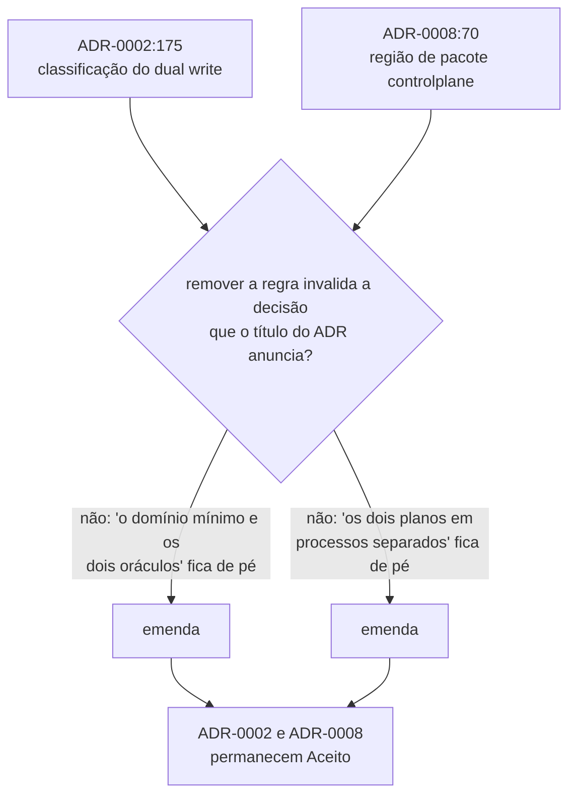

# ADR-0009: A classificação do dual write e a região de pacote do sistema sob teste

- **Estado:** Aceito
- **Data:** 2026-08-05
- **Etapa do roadmap:** 1 e 6
- **Relacionado:** emenda o [ADR-0002](0002-o-dominio-minimo-e-os-dois-oraculos.md) e o
  [ADR-0008](0008-os-dois-planos-em-processos-separados.md). O caminho de emenda foi
  decidido em `docs/adr/arquivo/proposta-2026-08-03/decisoes-pendentes.md`, seção `A1`
  (linhas 1769-1802).

- **Última atualização:** 2026-08-05, pelo adendo no fim deste arquivo.

## Contexto

O plano do laboratório classifica o dual write no grupo C, escrita parcial, ao lado de
producer failure, Outbox e Inbox (`docs/plano-do-laboratorio.md:200-207`). O ADR-0002,
`Aceito` desde 2026-07-29, chama o mesmo fenômeno de "o fenômeno do grupo B que a
etapa 6 estuda" (`docs/adr/0002-o-dominio-minimo-e-os-dois-oraculos.md:175`). A
divergência está registrada como `C4` em
`docs/architecture/decisoes-pendentes.md:109-112`, e nenhum documento a resolveu até
aqui.

`D-DOM-02` aposentou o termo `Control Plane` em 2026-08-04 e renomeou o plano medido
para `system under test` (`docs/CONTEXT.md:64` e `:193`). O ADR-0008, `Aceito` no mesmo
dia, fixa a tabela de regiões de pacote com a linha `dev.da0hn.lab.controlplane`
(`docs/adr/0008-os-dois-planos-em-processos-separados.md:70`) — o pacote continua
carregando o termo que o glossário já não usa. A divergência está registrada como `C7`
em `docs/architecture/decisoes-pendentes.md:140-169`.

Os dois ADRs afetados são `Aceito`, e o corpo de um ADR `Aceito` NÃO DEVE ser editado
(`docs/adr/README.md:153` e `:174`). Em 2026-08-05 o processo de ADR ganhou um
terceiro caminho de alteração — a **emenda** — porque nem substituição nem subsunção
descrevem o caso das duas regras: cada uma é acessória à decisão principal do ADR que
a carrega, e removê-la não invalida essa decisão
(`docs/architecture/decisoes-pendentes.md:1769-1802`, seção `A1`).

## Problema

- Qual grupo classifica o dual write, dado que o plano e um ADR aceito divergem?
- Qual nome substitui `controlplane` na região de pacote, dado que o termo que ele
  carrega foi aposentado?
- Por qual caminho os dois ADRs afetados são alterados, dado que nem substituição nem
  subsunção se aplicam a uma regra acessória contradita?

## Decisão

**O dual write pertence ao grupo C, escrita parcial.** A classificação do ADR-0002
como grupo B (`0002-...md:175`) deixa de valer. O texto do ADR-0002 permanece
intocado — o cabeçalho dele passa a registrar a mudança, conforme
`## Consequências` abaixo.

**A região de pacote do sistema sob teste passa a ser `dev.da0hn.lab.sut`.** As
outras três linhas da tabela do ADR-0008 (`0008-...md:66-71`) NÃO mudam.

| Pacote                       | Região                             |
|------------------------------|------------------------------------|
| `dev.da0hn.lab.shared`       | contratos vistos pelos dois planos |
| `dev.da0hn.lab.labplane`     | o instrumento                      |
| `dev.da0hn.lab.sut`          | o sistema sob teste                |
| `dev.da0hn.lab.application`  | composição e ponto de entrada      |

A proibição da sigla `SUT` em `docs/CONTEXT.md:180` vale para **prosa**, e NÃO DEVE
ser lida como proibição de identificador de código — decidido em
`docs/architecture/decisoes-pendentes.md`, seção `A5` (linhas 1865-1879).

**Os dois ADRs alterados são emendados, e permanecem `Aceito`.** ADR-0002 e ADR-0008
recebem, no cabeçalho, `Última atualização: 2026-08-05` e uma linha `Alterado por`
que nomeia este ADR, a regra alterada e a seção de origem, pela mecânica de
`docs/adr/README.md`, seção "O rastro de alterações, emendado em 2026-08-04". O
corpo dos dois — tudo a partir da primeira seção `##` — não é tocado.

O teste que decide entre emenda e substituição, aplicado às duas regras:

## Justificativa

**Por que grupo C.** A classificação dos cinco grupos do repositório é pela fonte de
não determinismo, não pela tecnologia (`docs/AGENTS.md:85`). No dual write uma
escrita acontece e a outra não, entre dois destinos que não commitam juntos — isso é
escrita parcial. O grupo B do plano é entrega: duplicata, reordenação, atraso, perda
(`docs/plano-do-laboratorio.md:191-192`), e nenhuma dessas descreve uma escrita que
nunca saiu do primeiro destino.

**Por que `dev.da0hn.lab.sut`.** O glossário já define `system under test` por
extenso (`docs/CONTEXT.md:177-184`), e a sigla é padrão na literatura de teste. O
segmento fica dentro da convenção Java de nome de pacote curto, sem o precedente de
segmento composto que as alternativas descartadas exigiriam.

**Por que emenda, e não substituição ou subsunção.** A substituição marcaria
`Estado: Substituído por ADR-0009` no ADR-0008 e no ADR-0002 — mas a decisão de
dois processos separados e a decisão do domínio mínimo continuam de pé, sem
contradição alguma. A subsunção exige que a regra antiga continue válida no caso
que ela enxergava (`docs/adr/README.md:169-172`), e nenhuma das duas continua: o
nome do pacote muda, e o grupo do dual write muda. A emenda é o caminho cuja
definição encaixa essa combinação: contradiz uma regra acessória, sem contradizer
a decisão principal (`docs/architecture/decisoes-pendentes.md:1771-1779`).

## Consequências

### Positivas

- Um único fenômeno tem um único grupo. Quem lê o ADR-0002 e o plano do
  laboratório para de encontrar textos contraditórios sobre o dual write.
- Nenhum pacote do sistema sob teste carrega um termo que o glossário marca como
  `aposentado`.
- O processo de ADR ganha um terceiro caminho nomeado, e ele evita duas armadilhas
  que os dois caminhos antigos criariam: `Estado: Substituído` sobre uma decisão
  que continua em vigor, e `Alterado por: subsunção` sobre uma regra que não
  sobrevive.

### Negativas

- Corrigir um rótulo de grupo, isolado, não atende aos quatro critérios de ADR de
  `docs/adr/README.md:13-18` — não tem alternativa plausível própria nem
  trade-off. O custo de juntá-lo à parte 2 é aceito e nomeado em
  `docs/architecture/decisoes-pendentes.md:235-237`: separar as duas produziria
  um documento para uma linha.
- A emenda acrescenta um terceiro rótulo ao campo `Alterado por`. Quem já conhece
  `substituição` e `subsunção` precisa aprender a distinção antes de ler o
  cabeçalho de um ADR emendado.
- Todo ADR futuro que corrija um detalhe sem derrubar a decisão principal de
  outro ADR precisa escolher entre três caminhos, e não dois.

### Neutras

- O rastro de alterações retroativo aos oito ADRs aceitos
  (`docs/adr/README.md:226-231`) continua pendente para os demais casos; este
  ADR aplica o rastro só aos dois que altera.

## Trade-offs

- O benefício **um fenômeno com um grupo só** foi aceito em troca do custo **um
  ADR que só corrige rótulo não atenderia sozinho aos quatro critérios da
  série** — resolvido compartilhando o documento com a parte 2.
- O benefício **nenhum pacote carrega termo aposentado** foi aceito em troca do
  custo **o glossário precisa declarar, à parte, que a proibição de `SUT` não
  alcança identificador de código**
  (`docs/architecture/decisoes-pendentes.md:1865-1879`).
- O benefício **o cabeçalho de um ADR emendado diz exatamente o que mudou e
  onde** foi aceito em troca do custo **o processo de ADR passa a ter três
  caminhos de alteração, em vez de dois**.

## Alternativas consideradas

### Manter o dual write no grupo B, e corrigir o plano

**Descartada.** O ADR-0002 é `Aceito`, e seu corpo não pode ser editado. Ainda que
pudesse, a regra de classificação do repositório é pela causa — escrita parcial
descreve o dual write, entrega não (`docs/AGENTS.md:85`).

### `dev.da0hn.lab.systemundertest`

**Descartada.** O argumento a favor é a fidelidade total ao termo do glossário.
Perde porque cria o precedente de um segmento composto de quinze caracteres, sem
separador, que nenhuma convenção do repositório trata
(`docs/architecture/decisoes-pendentes.md:243`).

### `dev.da0hn.lab.subject`

**Descartada.** É mais curto que `systemundertest` e evita a sigla. Perde porque
cria um terceiro nome para o conceito que `D-DOM-02` acabou de unificar em dois —
o termo em português e `system under test` — violando "um conceito tem um nome"
(`docs/adr/README.md:32`).

### Manter `controlplane`

**Descartada.** Nenhum custo de migração de código, porque nenhum código existe
ainda. Perde porque viola a mesma regra de forma visível em todo `import`: o
pacote nomearia o plano pelo termo que o glossário já não usa.

### Substituição pela letra da regra atual

**Descartada.** É a leitura literal de `docs/adr/README.md:171-172`: "se
contradisser, é substituição". Perde porque o `Estado` do ADR-0008 passaria a
dizer que a decisão dos dois processos separados saiu de vigor, e ela não saiu.

### Alargar a subsunção para cobrir regra acessória contradita

**Descartada.** Evitaria criar um terceiro caminho. Perde porque `Alterado por:
subsunção` deixaria de dizer se a regra antiga ainda vale — a informação que o
campo existe para carregar
(`docs/architecture/decisoes-pendentes.md:1797-1800`).

### Errata no índice de ADRs

**Descartada.** É a correção mais barata. Perde porque quem lê um ADR isolado,
sem passar pelo índice, continua lendo a afirmação errada
(`docs/architecture/decisoes-pendentes.md:230-233`).

### Estender o campo `Alterado por` para correção factual

**Descartada.** Reaproveita um campo já existente. Perde porque emenda uma regra
de processo aceita no dia anterior e faz o cabeçalho carregar dois tipos de
coisa diferentes sob o mesmo rótulo.

## Quando esta decisão deixa de valer

Reveja a classificação do dual write se um sexto grupo for criado para fenômenos
de escrita entre dois destinos coordenados por uma única transação lógica,
distinto de escrita parcial sobre um destino só. Nenhum documento do repositório
propõe esse sexto grupo hoje.

Reveja o nome do pacote se `system under test` for aposentado por um ADR de
vocabulário futuro. O sinal é o mesmo que produziu esta decisão: um termo do
código sobrevivendo à aposentadoria do termo do glossário que o originou.

## Adendo de 2026-08-05 — as afirmações citadas de `decisoes-pendentes.md`

Aquele arquivo saiu de `docs/architecture/` pela decisão `D-4`, e as nove citações
abaixo deixaram de resolver. O corpo acima **não foi tocado**: este adendo incorpora a
afirmação que cada uma sustentava.

- `:109-112` — `C4`: o plano põe o dual write no grupo C e o ADR-0002 no grupo B.
- `:140-169` — `C7`: o ADR-0008 fixou pacote com o termo que `D-DOM-02` aposentou.
- `:1769-1802` — `A1`: a emenda serve a regra acessória, com fronteira objetiva.
- `:1771-1779` — a emenda contradiz regra acessória, e não a decisão principal.
- `:235-237` — separar as duas partes produziria um documento para uma linha.
- `:1865-1879` — o glossário precisa declarar à parte que `SUT` é permitido em código.
- `:243` — `systemundertest` perde por ser segmento composto de quinze caracteres.
- `:1797-1800` — alargar a subsunção perde: `Alterado por` deixaria de dizer se vale.
- `:230-233` — a errata no índice perde: quem lê o ADR isolado lê a afirmação errada.

`A1` a `A5` foram aplicadas em 2026-08-05, em
[`README.md`](README.md#a-emenda-terceira-forma-ao-lado-da-substituição-e-da-subsunção)
e em [`../CONTEXT.md`](../CONTEXT.md#a-sigla-sut-no-código-decidida-em-2026-08-05).
