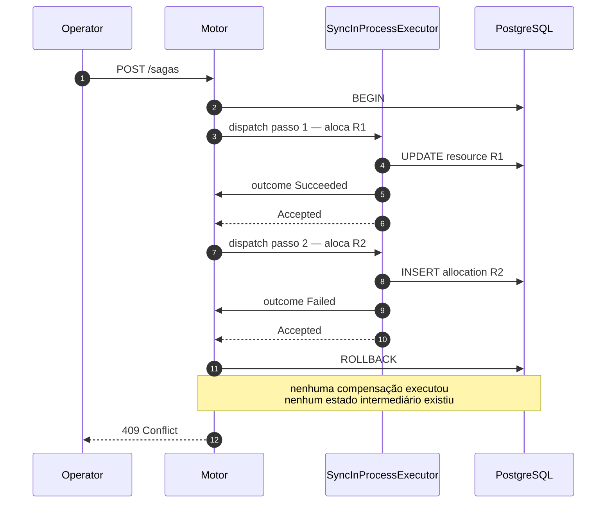
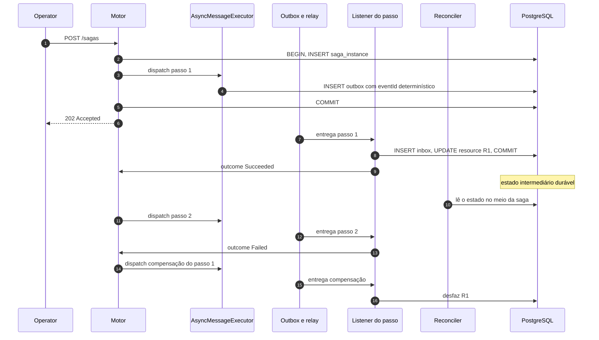

# ADR-0009: Dois executores plugáveis para o motor de workflow

- **Estado:** Proposto
- **Data:** 2026-07-26
- **Etapa do roadmap:** 5
- **Relacionado:** ADR-0002, ADR-0003, ADR-0004, ADR-0006, ADR-0007, ADR-0008, ADR-0011, ADR-0012

## Contexto

O ADR-0008 define o motor de workflow: o modelo da saga, o estado persistido, a
profundidade máxima 2, a compensação e a recuperação após falha. Ele decide **o que**
um passo significa e **quando** o passo seguinte pode começar.

Ele não decide **como** o passo é executado. Chamar um método na mesma thread e
publicar uma mensagem que outro processo consome levam ao mesmo lugar no diagrama de
estados. Não levam ao mesmo lugar no mundo real.

O ADR-0003 já resolveu um problema da mesma forma para a concorrência: a estratégia é
uma porta no domínio, os mecanismos são adaptadores na infraestrutura, e a escolha é um
dado de configuração. Isso permite comparar dois mecanismos sob carga idêntica, no
mesmo processo, com a mesma semente.

O ADR-0007 estabelece que toda integração por mensagem no laboratório é
*at-least-once*, com latência mediana adicional de 100 ms imposta pelo polling do
relay. O ADR-0004 estabelece que um experimento compara duas configurações sob a mesma
semente, e que a variável trocada precisa ser explícita.

## Problema

Uma saga escrita e testada num único processo, com os passos encadeados por chamada de
método, **passa**. Ela passa porque a transação do banco esconde toda falha parcial: se
o segundo passo falhar, o primeiro nunca existiu.

Quando a mesma saga é reescrita com os passos ligados por mensagem, ela quebra. Quebra
por reentrega, por reordenação, por estado intermediário visível a terceiros e por
falha do processo entre dois passos. Nenhuma dessas falhas foi introduzida pela lógica
da saga. Todas foram introduzidas pelo modo de executá-la.

As forças em conflito:

- O modo síncrono é o único em que a saga é depurável de ponta a ponta.
- O modo assíncrono é o único fiel ao que o laboratório existe para estudar.
- Comparar os dois exige que a saga, a carga e a semente sejam **as mesmas**. Se o
  código da saga mudar junto com o modo de execução, a comparação não vale.
- O modo síncrono produz um resultado verde. Um grupo de controle que passa é mais
  perigoso que um grupo de controle que falha.

A pergunta é: como tornar o modo de execução de um passo um **dado de configuração**, e
não uma característica do código da saga?

## Decisão

O motor de workflow conhece uma única porta, `StepExecutor`. O laboratório implementa
**dois adaptadores**, escolhidos por configuração.

| Executor | Como o passo roda | Papel |
|---|---|---|
| `SYNC_IN_PROCESS` | chamada direta, mesma thread, mesma transação | **grupo de controle** |
| `ASYNC_MESSAGE` | evento gravado no Outbox, consumido por um listener | modo realista |

O par foi avaliado antes de ser adotado, e é o par reservado no índice. Ele é o certo
por um motivo específico: os dois executam **a mesma definição de saga, byte por
byte**. Nenhuma outra dupla candidata mantém isso. Trocar orquestração por coreografia
troca o modelo de estado da saga, não o modo de executar um passo — e sagas diferentes
não são comparáveis (ver Alternativa E). A objeção legítima ao par escolhido é o
oposto: ele troca variáveis demais de uma vez. Isso está registrado na questão 2.

`SYNC_IN_PROCESS` cumpre para o motor de workflow o mesmo papel que `NONE` cumpre para
as estratégias de concorrência do ADR-0003 — com uma diferença que precisa ser dita em
voz alta e está na seção "A armadilha".

### A porta

A porta vive no `domain`, em Java puro. Ela não importa Spring, não importa JPA e não
menciona transporte (regras 1, 2 e 3 do ADR-0006).

```
domain/workflow/
  StepExecutor          (porta — interface)
  StepExecutorType      (enum: SYNC_IN_PROCESS | ASYNC_MESSAGE)
  StepInvocation        (record — o pedido de execução)
  Dispatch              (sealed: Accepted | Rejected)
  StepOutcome           (sealed: Succeeded | Failed — vocabulário do ADR-0008)
infrastructure/workflow/
  SyncInProcessExecutor (adaptador)
  AsyncMessageExecutor  (adaptador — publica pelo Outbox do ADR-0007)
```

```java
public interface StepExecutor {
    Dispatch dispatch(StepInvocation invocation);
}

public record StepInvocation(
    SagaId sagaId,
    StepId stepId,
    StepKind kind,            // ACTION | COMPENSATION
    int attempt,              // contado pelo motor, nunca pelo executor
    Payload payload,
    CorrelationId correlationId,
    Instant deadline          // vem do relógio injetado — regra 8 do ADR-0006
) {}
```

### O executor nunca devolve o resultado do passo

Esta é a regra central deste ADR, e tudo o mais decorre dela.

`dispatch` devolve `Accepted` ou `Rejected`. `Accepted` significa "o pedido foi aceito e
o resultado chegará depois". `Rejected` significa "não foi possível sequer despachar" —
broker indisponível, fila cheia, passo desconhecido.

O resultado do passo **sempre** volta ao motor pela mesma via: uma porta de entrada do
motor (`StepOutcomeSink` no vocabulário do ADR-0008), que recebe `Succeeded` ou
`Failed`. No executor síncrono essa chamada acontece na mesma thread, antes de
`dispatch` retornar. No assíncrono acontece minutos depois, em outro processo.

O motor não sabe qual dos dois aconteceu. Se `dispatch` devolvesse o resultado no modo
síncrono e `Accepted` no assíncrono, o motor teria um `if` sobre o tipo de executor — e
a partir desse `if` as duas execuções deixariam de ser a mesma saga. A comparação
morreria ali.

### Exceção

Uma exceção que escapa de `dispatch` **não é falha de negócio do passo**. Falha de
negócio é um `StepOutcome.Failed`, entregue pela via de retorno.

Qualquer exceção que escape é tratada pelo motor como `Rejected(DISPATCH_FAILED)`. A
saga permanece no mesmo estado e o passo é reagendado pelo motor. Nada é compensado: do
ponto de vista do motor, o passo não começou.

Essa premissa é verdadeira no executor assíncrono, em que despachar é inserir uma linha
na `outbox` dentro da transação que já estava aberta. Ela é **falsa** no executor
síncrono, em que a exceção pode ter escapado no meio do efeito. A assimetria é real e
está na tabela comparativa.

### Idempotência do despacho

Todo despacho tem uma identidade determinística, derivada de
`(sagaId, stepId, kind, attempt)`. Nenhum `UUID.randomUUID()` participa dela — isso é
exigência direta do ADR-0004.

No executor assíncrono essa identidade **é** o `eventId` do envelope do ADR-0007.
Consequência: um despacho repetido após crash produz o mesmo `eventId`, e o Inbox o
descarta. O executor não implementa deduplicação própria; ele herda a do ADR-0007.

### Onde a escolha do executor vive

As três candidatas têm consequências diferentes, e nenhuma sozinha resolve.

| Candidata | Argumento a favor | Por que não basta |
|---|---|---|
| Atributo do `Resource` | simetria com o ADR-0003 | uma saga toca N recursos; N executores para um fluxo não é resolvível |
| Atributo da definição da saga | o executor governa um fluxo, não um dado | comparar exigiria duas definições — e aí a saga não é a mesma |
| Atributo do `Experiment` | é lá que a variável trocada deve estar | o motor não consulta um experimento a cada passo |

A decisão é em **dois níveis**, com vinculação única:

1. A definição da saga declara um `defaultExecutor`. É o que vale fora de experimento.
2. O `Experiment` do ADR-0004 declara `executor`, que **sobrescreve** o padrão para
   toda instância de saga iniciada durante aquela execução.
3. A escolha é resolvida **uma vez**, no instante em que a instância de saga é criada,
   e gravada na própria instância (`saga_instance.executor`). Dali em diante ela é
   imutável para aquela instância.

O passo 3 não é detalhe. Ele existe por três motivos:

- **Recuperação.** O ADR-0008 exige que uma saga interrompida seja retomada. Uma saga
  iniciada em modo síncrono e retomada em modo assíncrono não é a mesma saga, e o
  resultado do experimento seria lixo.
- **Atribuição.** O relatório do ADR-0004 precisa dizer qual executor produziu qual
  número. Sem o campo na instância, não há como atribuir.
- **Coexistência.** Duas instâncias com executores diferentes rodam no mesmo processo,
  ao mesmo tempo, sob a mesma carga. É exatamente o que o ADR-0003 exige para que uma
  comparação seja válida, e é o que elimina a variável "o ambiente estava diferente".

O executor **não** é atributo do `Resource`. A estratégia de concorrência é propriedade
do dado protegido; o executor é propriedade do fluxo que atravessa vários dados. Colar
o executor no recurso reproduz o defeito da Alternativa C do ADR-0003: dois valores
concorrentes para a mesma decisão, e um resultado sem significado.

```json
{
  "name": "reconciler-enxerga-saga-pela-metade",
  "hypothesis": "Sob ASYNC_MESSAGE o Reconciler observa o estado intermediário de uma saga em voo e corrige um drift que não existe; sob SYNC_IN_PROCESS isso é impossível",
  "seed": 42,
  "saga": { "definition": "allocate-two-resources", "executor": "ASYNC_MESSAGE" },
  "load": { "operators": 10, "reconcilerPeriodMs": 500, "durationSeconds": 60, "rps": 200 },
  "chaos": { "duplicateProbability": 0.1 },
  "assertions": ["safety.violations == 0", "saga.compensation.executed > 0"]
}
```

### O que muda entre os dois, além da latência

Esta tabela é o conteúdo do ADR. A latência é a diferença menos interessante.

| Propriedade | `SYNC_IN_PROCESS` | `ASYNC_MESSAGE` |
|---|---|---|
| Atomicidade entre passos | garantida — os passos partilham a transação | inexistente — cada passo comita sozinho |
| Falha parcial | impossível dentro da transação | é o caso normal |
| Ordem dos passos | ordem do programa | ordem de entrega; reordenação possível |
| Entrega | exatamente uma vez, trivialmente | *at-least-once* (ADR-0007) |
| Efeito único | consequência da chamada de método | só com Inbox e passo idempotente |
| Estado intermediário | invisível — ninguém lê o não comitado | durável e visível a qualquer leitor |
| Crash entre dois passos | a saga inteira desaparece no rollback | a saga sobrevive e é retomada |
| Compensação | quase nunca executa — o rollback resolve | executa sempre que um passo tardio falha |
| Exceção no despacho | pode ter deixado efeito parcial | não deixa — a `outbox` está na transação |
| Deadline do passo | não interrompível; medido depois do fato | agendado; o passo pode nem ter começado |
| Resultado tardio de passo abandonado | impossível | possível — é o passo zumbi |
| Backpressure | natural, a thread bloqueia | a fila cresce; precisa ser medido |
| Superfície para o Chaos Service | quase nenhuma — não há mensagem entre passos | total |
| Profundidade 2 (ADR-0008) | limite de pilha de chamadas | dado no estado persistido |
| Latência por passo | microssegundos | ≥ 100 ms de mediana pelo relay |
| Depuração | um breakpoint atravessa a saga inteira | um breakpoint pega um passo; o resto é trace |

### A mesma saga, sob os dois executores

A saga `allocate-two-resources` aloca em `R1`, depois em `R2`, e compensa `R1` se `R2`
falhar.





### O experimento que só existe porque os dois coexistem

Mesma definição de saga. Mesma semente 42. Mesma carga: 10 operators, 200 rps, 60
segundos. Mesmo caos: `duplicateProbability: 0.1`. Um Reconciler (ADR-0002) roda a cada
500 ms. Só o campo `executor` muda entre as duas execuções.

| Métrica | `SYNC_IN_PROCESS` | `ASYNC_MESSAGE` | Por quê |
|---|---|---|---|
| `saga.compensation.executed` | 0 | centenas | no síncrono o rollback pré-empta a compensação |
| `inbox.duplicates.discarded` | 0 | > 0 | não há mensagem entre passos no síncrono |
| `chaos.events.injected` | ~0 | alto | o caos não tem o que duplicar no síncrono |
| Drift entre `available` e a soma | ausente | presente | ver abaixo |
| `reconciler.corrections` | ~0 | alto | o Reconciler vê a saga pela metade |

Três causas distintas, todas atribuíveis apenas ao executor:

**A duplicata reencontra um passo não idempotente.** O passo 1 usa `ATOMIC_UPDATE`. O
ADR-0003 é explícito: `ATOMIC_UPDATE` é atômico e **não** é idempotente. No executor
síncrono não existe mensagem entre os passos, então a única duplicata possível é a do
comando de entrada, filtrada pelo `Idempotency-Key` do Operator. No assíncrono, o passo
1 é uma mensagem, ela é reentregue, e o decremento acontece duas vezes. `available`
deixa de corresponder às alocações que existem de fato. Nenhuma exceção é lançada.

**O Reconciler observa um estado que não deveria existir.** Entre o passo 1 e o passo 2
existe uma janela em que `R1` já está comprometido por uma saga que vai ser compensada.
No executor síncrono essa janela está dentro de uma transação aberta e é invisível. No
assíncrono ela está comitada. O Reconciler lê, conclui que há drift, e escreve por cima
do estado de uma saga em voo. Duas origens de escrita do ADR-0002 colidem — e a colisão
só existe porque o executor tornou o meio da saga durável.

**O crash tem efeito oposto nos dois.** Matando o processo entre os dois passos: no
síncrono a transação faz rollback e a saga nunca existiu, o que **melhora** o resultado
de safety; no assíncrono o passo 1 está comitado, a saga é retomada, e se o crash caiu
na janela entre o `publish` e o `UPDATE outbox` (ADR-0007), o passo 2 roda duas vezes.

Sem os dois executores, cada um desses três resultados seria uma anedota sobre "sistema
assíncrono é mais difícil". Com os dois, cada um é um número comparado contra um
controle sob a mesma semente.

### A armadilha do executor síncrono

O ADR-0001 nomeou a **proteção presente e inerte**: o `@Version` está lá, o
desenvolvedor acredita estar protegido, nenhuma exceção é lançada, e a invariante
quebra. Este ADR nomeia o parente próximo.

> **Compensação presente e inerte.** Sob `SYNC_IN_PROCESS`, o código de compensação
> existe, está registrado na definição da saga, tem teste unitário que passa — e nunca
> executa. O rollback do banco chega primeiro. A compensação é código morto que parece
> vivo.

O dano aparece quando o executor vira `ASYNC_MESSAGE`. A compensação roda pela primeira
vez, e roda contra um passo que ela nunca compensou de verdade: não é idempotente,
compensa um efeito que pode não ter sido aplicado, e pode chegar fora de ordem em
relação ao passo que a causou.

A diferença em relação ao ADR-0003 é o que torna esta armadilha pior. `NONE` **falha**,
ruidosamente, e ninguém o confunde com uma solução. `SYNC_IN_PROCESS` **passa**. Um
grupo de controle verde é convidativo, e o convite é para a conclusão errada: "a saga
está correta".

Por isso duas regras são obrigatórias, e não recomendações:

- Todo experimento que declara uma saga é executado sob **os dois** executores. Um
  relatório com uma execução só é incompleto.
- A execução assíncrona precisa asseverar `saga.compensation.executed > 0`. Se for
  zero, o experimento não teve carga nem caos suficientes, e o verde da execução
  síncrona não significa nada. É o mesmo raciocínio da obrigatoriedade de `NONE` no
  ADR-0003, aplicado ao contrário: lá o controle precisa falhar, aqui o experimento
  precisa exercitar.

Um corolário desagradável e concreto: um experimento que declara `chaos` não vazio com
`executor: SYNC_IN_PROCESS` é, em silêncio, um experimento **sem caos**. O relatório
registra `chaos.events.injected`, e um valor próximo de zero com caos declarado é
sinalizado como anomalia do instrumento, não como resultado.

### Timeout e retry: onde fica a fronteira

A fronteira é ambígua por natureza, então é traçada por competência, não por
mecanismo.

| Competência | Dono | Motivo |
|---|---|---|
| Política de retentativa: quantas, com qual backoff | motor (ADR-0008) | é estado da saga; precisa sobreviver ao crash |
| Contador `attempt` | motor | é o que torna a comparação honesta |
| Deadline de negócio do passo | motor | é a mesma para os dois executores |
| Decidir desistir e compensar | motor | é transição de estado da saga |
| Ack, nack e reconexão de um despacho | executor | é transporte |
| Reentrega técnica do *at-least-once* | executor | é consequência do ADR-0007 |
| Deduplicação da reentrega | executor, via Inbox | é do ADR-0007, não do motor |

A regra de leitura das métricas, que resolve a confusão na prática:

> A retentativa que aparece em `saga.step.attempts` é **sempre** do motor. A reentrega
> que aparece em `inbox.duplicates.discarded` é **sempre** do executor. Os dois
> contadores nunca se misturam.

A consequência técnica: uma reentrega carrega o **mesmo** `attempt` do despacho
original, porque o `attempt` faz parte da identidade determinística do despacho. Só o
motor incrementa `attempt`. Uma reentrega, portanto, não é uma tentativa nova — é a
mesma tentativa chegando duas vezes, e o Inbox a descarta.

O deadline é assimétrico e a assimetria é declarada:

- `ASYNC_MESSAGE` — o motor arma um temporizador sobre o relógio injetado (regra 8 do
  ADR-0006). Vencido o prazo, o passo é abandonado e a saga compensa. Se o resultado
  chegar depois, ele é descartado e contado em `saga.step.outcome.late`. Este é o
  **passo zumbi**, e é uma família de falha inteira.
- `SYNC_IN_PROCESS` — não há o que interromper com segurança no meio de uma transação.
  O deadline vira uma verificação depois do fato: o executor registra
  `saga.step.overran = true` e segue. Nenhum passo zumbi é produzido, jamais.

Ou seja: o executor síncrono não consegue produzir a família de falha mais cara da
Etapa 5. Isso não é defeito dele. É a razão de ele ser o controle.

## Questões em aberto

### 1. Se a saga atravessar serviços, `SYNC_IN_PROCESS` deixa de existir

O executor síncrono depende de duas coisas que só existem dentro de um processo: uma
pilha de chamadas e uma transação local. Se o ADR-0011 colocar `resource` e
`allocation` em serviços distintos, a saga atravessa uma fronteira de rede e este ADR
perde metade da sua decisão.

Os dois lados:

- **Manter a saga dentro de um serviço** preserva o grupo de controle, mas produz a
  saga menos interessante do laboratório. Uma saga que não atravessa fronteira
  transacional não precisa de compensação — precisa de `ROLLBACK`.
- **Aceitar a saga entre serviços** produz o cenário realista, mas deixa a Etapa 5 com
  um executor só, sem controle, exatamente onde o controle é mais necessário.

Existe um meio-termo que não foi decidido: um executor síncrono **entre processos**,
que chama o serviço vizinho por HTTP e bloqueia esperando a resposta. Ele preserva a
ordem e a pilha, mas perde a transação partilhada. Ele não é o `SYNC_IN_PROCESS` deste
ADR — é um terceiro executor, com propriedades próprias, e chamá-lo pelo mesmo nome
falsificaria a tabela comparativa.

**Esta questão bloqueia a Etapa 5.** Ela depende do ADR-0011 e não pode ser respondida
aqui.

### 2. O par escolhido troca variáveis demais de uma vez

O laboratório prega trocar uma variável por experimento. Este ADR troca pelo menos
seis ao mesmo tempo: atomicidade, ordem, semântica de entrega, visibilidade do estado
intermediário, durabilidade sob crash e latência.

Quando um resultado diferir entre os dois executores, atribuí-lo a uma causa exigirá
raciocínio, não medida. O experimento do Reconciler descrito acima só é interpretável
porque as três causas foram separadas à mão.

Um terceiro executor intermediário resolveria — `ASYNC_LOCAL`: mesmo processo, mesma
JVM, despacho após o commit, fila em memória. Ele perde a atomicidade entre passos mas
mantém a ordem, mantém entrega única e não envolve broker. Isolaria "perda de
atomicidade" de "*at-least-once*".

Contra: ele introduz uma variável nova em vez de eliminar uma — uma fila em memória não
sobrevive ao crash, então o despacho pode ser **perdido**, algo que nenhum dos dois
executores decididos faz. E é um terceiro adaptador para manter.

Uma variante mais barata do mesmo remédio: permitir que o `SYNC_IN_PROCESS` rode cada
passo em sua própria transação, controlado por um sinalizador. Isso separa "mesma
thread" de "mesma transação" sem adicionar adaptador. Contra: destrói a propriedade que
define o executor síncrono como controle, e cria duas variantes de controle.

### 3. A porta de retorno pertence a este ADR ou ao ADR-0008?

Este ADR decide que o resultado do passo volta por uma porta de entrada do motor, e não
pelo retorno de `dispatch`. Mas quem **declara** essa porta não está decidido.

- **No ADR-0008.** O motor é dono do seu ponto de entrada, e a porta é parte do modelo
  de estado da saga. Este ADR só a consumiria.
- **Neste ADR.** A porta só existe por causa da assimetria entre os dois executores. Um
  motor com executor único não precisaria dela.

A escolha errada produz uma dependência circular entre os dois ADRs, ou uma interface
órfã que nenhum dos dois mantém.

### 4. O `Experiment` do ADR-0004 ainda não tem vocabulário de saga

O JSON do ADR-0004 declara `resource`, não `saga`. Adicionar `executor` exige decidir
onde ele mora, e o ADR-0004 está `Proposto`.

- **Dentro de um bloco `saga`** é mais correto: uma execução pode envolver mais de uma
  definição de saga, cada uma com seu executor. Custo: acopla o ADR-0004 ao vocabulário
  do ADR-0008.
- **Como campo de topo `executor`** é mais simples de escrever e de ler no relatório.
  Custo: finge que uma execução tem um executor só, e essa mentira aparece no dia em
  que um experimento comparar duas sagas.

### 5. Um deadline que significa duas coisas ainda é o mesmo deadline?

No executor assíncrono o deadline interrompe. No síncrono ele apenas registra. O mesmo
campo, com o mesmo nome, produz comportamentos diferentes conforme o executor — que é
exatamente o tipo de divergência que este ADR tenta evitar em todos os outros pontos.

- **Simetrizar:** rodar cada passo síncrono num executor de threads com `Future.get`
  sob prazo. Contra: sair da thread significa sair da transação, e a transação
  partilhada é a única razão de o executor síncrono existir.
- **Aceitar a assimetria:** documentá-la e usar nomes distintos nas métricas
  (`overran` versus `timedOut`). Contra: quem ler o relatório vai comparar os dois
  números de qualquer forma.

## Consequências

### Positivas

- Trocar o modo de execução é mudar um campo. Nenhuma build nova, nenhum branch, e a
  definição da saga permanece idêntica entre as duas execuções.
- Duas instâncias de saga com executores diferentes coexistem no mesmo processo, sob a
  mesma carga e a mesma semente. Isso remove a variável "o ambiente estava diferente",
  que é a mesma razão pela qual o ADR-0003 tornou a estratégia um dado.
- A Etapa 5 pode começar pelo executor síncrono. O motor do ADR-0008 fica correto e
  depurável antes de a mensageria entrar, e a passagem para assíncrono vira um
  experimento em vez de uma reescrita.
- A regra "o executor nunca devolve o resultado do passo" força o motor a ser
  assíncrono no desenho desde o primeiro dia, mesmo quando o executor é síncrono. Um
  motor escrito com retorno direto nunca sobreviveria à troca.
- A tabela comparativa vira suíte de asserções. Cada linha em que o síncrono garante
  algo que o assíncrono não garante é um experimento com resultado esperado
  divergente. Uma linha em que os dois concordam é um experimento sem carga.

### Negativas

- **Dois caminhos de execução para manter e testar.** Um defeito que só aparece num
  deles custa o dobro para localizar, porque a primeira pergunta passa a ser "é do
  executor?".
- **A ilusão de correção é criada de propósito.** O executor síncrono existe para
  produzir um verde enganoso. Isso é caro em disciplina: sem as duas regras
  obrigatórias da seção "A armadilha", ele vira uma armadilha de verdade em vez de um
  instrumento.
- **O caos quase não alcança o executor síncrono.** Metade do trabalho do ADR-0012 fica
  inerte sob `SYNC_IN_PROCESS`, e isso precisa ser visível no relatório em vez de
  silencioso.
- **A porta obriga um salto de indireção em todo passo.** Ler o motor deixa de mostrar
  o que o passo faz. Este custo é o mesmo que o ADR-0003 aceitou, e pela mesma razão:
  o laboratório troca legibilidade local por comparabilidade.

### Neutras

- O executor assíncrono não inventa mecanismo: ele publica pelo Outbox e consome com
  Inbox, ambos do ADR-0007. Ele é um usuário da infraestrutura da Etapa 2, não uma
  infraestrutura nova.
- `SYNC_IN_PROCESS` não é um modo de produção nem um estado provisório. Ele é
  instrumento, exatamente como `NONE`. Removê-lo "quando o sistema amadurecer" seria
  remover o controle do experimento.

## Alternativas consideradas

### Alternativa A — um executor só, o assíncrono

Ir direto ao modo realista. Toda saga é executada por mensagem, desde o primeiro dia.

**Descartada.** Sem grupo de controle, nenhuma diferença observada pode ser atribuída
ao modo de execução — só se pode afirmar que a saga assíncrona falha, nunca que ela
falha *por ser* assíncrona. Além disso, a Etapa 5 começaria sem nenhum caminho
depurável, e um defeito do motor do ADR-0008 seria indistinguível de um defeito de
entrega do ADR-0007.

### Alternativa B — executor escolhido por perfil do Spring

Um perfil por executor, escolhido na inicialização do serviço.

**Descartada.** É o mesmo defeito da Alternativa B do ADR-0003. Impede que os dois
executores coexistam numa mesma execução, então toda comparação exigiria duas
execuções, em momentos diferentes, sob condições de máquina diferentes. Pior aqui do
que no ADR-0003: a saga assíncrona é sensível à carga do broker, que é justamente a
variável que duas execuções separadas não conseguem manter igual.

### Alternativa C — executor escolhido por requisição, num cabeçalho HTTP

O cliente decide o modo de execução a cada chamada que inicia uma saga.

**Descartada.** O ADR-0003 descartou o equivalente porque a estratégia é propriedade do
dado, não da chamada. Aqui o argumento é mais forte: uma saga tem vários passos e
sobrevive à requisição que a criou. Um cabeçalho não alcança o passo 2, não alcança a
compensação e não alcança a retomada após crash. A instância ficaria sem executor
definido no exato momento em que o executor mais importa.

### Alternativa D — executor como atributo do `Resource`

Simetria literal com o ADR-0003: o recurso declara como as sagas que o tocam executam.

**Descartada.** Uma saga toca vários recursos por definição — é essa a razão de ela
existir (ADR-0001, última consequência negativa). Dois recursos com executores
diferentes no mesmo fluxo não produzem uma resposta: produzem um empate sem regra de
desempate. A estratégia de concorrência protege uma linha e por isso cabe na linha; o
executor governa um fluxo e por isso precisa morar no fluxo.

### Alternativa E — o par certo é orquestração contra coreografia

Em vez de síncrono contra assíncrono, comparar um motor central que dirige os passos
contra passos que reagem a eventos uns dos outros, sem motor.

**Descartada.** É outro eixo, e é competência do ADR-0008, que decide o motor. O par
também falharia no requisito central: na coreografia não existe definição de saga
central, então não existe "a mesma saga" para submeter aos dois modos. A comparação
mediria duas modelagens diferentes, e nenhuma conclusão poderia ser atribuída ao modo
de execução. O par escolhido é o único em que a definição da saga é literalmente o
mesmo artefato nos dois lados.

## Quando esta decisão deixa de valer

Os dois executores existem para **discordar**. No dia em que pararem de discordar, um
deles é redundante.

O sinal concreto: um experimento cujo relatório é idêntico sob os dois executores —
mesmas asserções, mesmo `saga.compensation.executed`, mesmo
`inbox.duplicates.discarded`. Isso significa que a carga não exercita a saga, ou que a
saga não tem passo que possa falhar. Nos dois casos o problema é o experimento, e ele
precisa ser corrigido antes de se concluir qualquer coisa sobre o executor.

O segundo sinal derruba a decisão por fora: se o ADR-0011 colocar os passos da saga em
serviços distintos, `SYNC_IN_PROCESS` deixa de ser implementável e este ADR precisa ser
substituído, não corrigido. Ver a questão 1.
