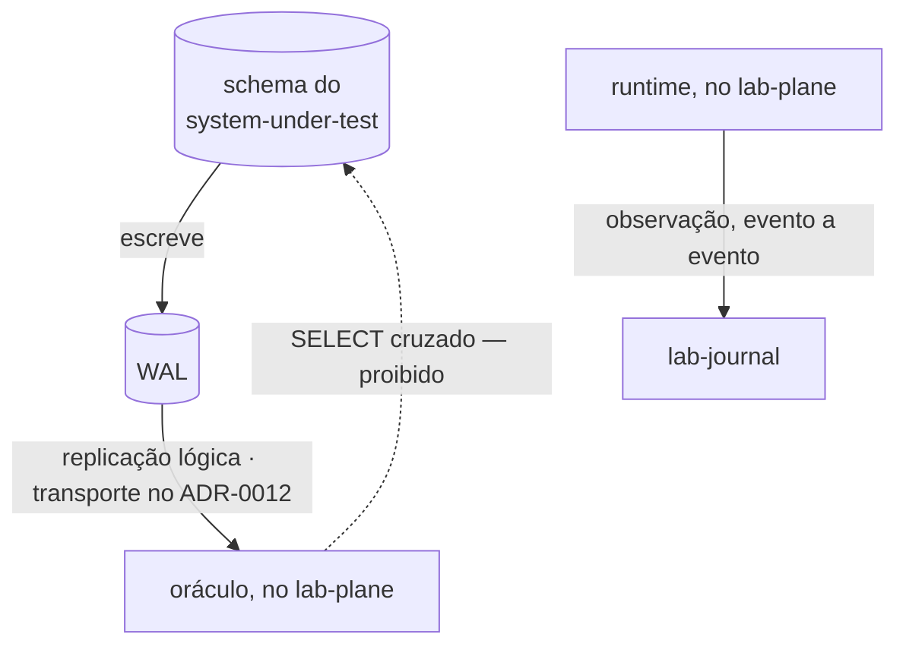

# ADR-0010: A fronteira de schema e o CDC como fonte do veredito

- **Estado:** Aceito
- **Data:** 2026-08-06
- **Etapa do roadmap:** 1 e 3
- **Relacionado:** emenda o [ADR-0002](0002-o-dominio-minimo-e-os-dois-oraculos.md) e o
  [ADR-0008](0008-os-dois-planos-em-processos-separados.md), que recebem `Última
  atualização` e `Alterado por` no mesmo commit. Depende do
  [ADR-0001](0001-o-passo-como-unidade-de-execucao.md), que fixa `AFTER_COMMIT`.

## Contexto

Três serviços têm cada um o próprio schema, sem acesso cruzado: os três papéis recebem
`CREATE` no banco `lab` (`local/postgres-init.sql:14`), e o schema `public` é revogado
de todos (`local/postgres-init.sql:22`).

O ADR-0008 declara, no diagrama da
[seção Decisão](0008-os-dois-planos-em-processos-separados.md#decisão), a aresta
`SELECT após a quiescência` do Lab Plane direto ao PostgreSQL do system under test. O
oráculo exato do [ADR-0002](0002-o-dominio-minimo-e-os-dois-oraculos.md) é `perdidas =
commits − (value_final − value_inicial)`, lidos do banco antes do primeiro worker e
depois do último
([`0002-o-dominio-minimo-e-os-dois-oraculos.md`](0002-o-dominio-minimo-e-os-dois-oraculos.md#o-oráculo-exato)),
sem derivar estado de um log
([`0002-o-dominio-minimo-e-os-dois-oraculos.md`](0002-o-dominio-minimo-e-os-dois-oraculos.md#o-oráculo-lê-o-banco-e-não-deve-ler-o-log-de-observações)).
O oráculo de capacidade lê a mesma forma, com `SELECT sum(amount)`
([`0002-o-dominio-minimo-e-os-dois-oraculos.md`](0002-o-dominio-minimo-e-os-dois-oraculos.md#o-oráculo-do-predicado)).

O CDC já entrava no laboratório num papel menor: conferia o resultado do `SELECT`, sem
substituí-lo, e o registro da época proíbe textualmente que ele vire fonte — "o CDC NÃO
DEVE virar fonte do veredito"
([`decisoes-pendentes.md`](arquivo/proposta-2026-08-03/decisoes-pendentes.md#decidido-em-2026-08-05-o-cdc-entra-com-wal_level--logical-permanente)).
**Esta decisão reverte essa proibição.** `wal_level=logical` (`compose.yaml:16`) e o
atributo `REPLICATION` (`local/postgres-init.sql:18`) já antecipam esta decisão na
árvore, e os comentários que os acompanham já citam `E-18`.

## Problema

- Um schema por serviço, sem acesso cruzado, e o oráculo só produz número lendo
  `resource` depois da quiescência: as duas regras não convivem sem que uma ceda.
- Replicação lógica consome o WAL, sem `SELECT` numa tabela alheia — dentro ou fora da
  proibição de schema?
- O oráculo de capacidade soma eventos de `INSERT` para obter `Σ amount`. O ADR-0002
  proíbe apenas derivar "o estado final do log de observações do runtime"; que essa
  proibição alcance um stream de CDC é leitura do registro arquivado
  ([`decisoes-pendentes.md`](arquivo/proposta-2026-08-03/decisoes-pendentes.md#decidido-em-2026-08-05-o-cdc-entra-com-wal_level--logical-permanente)),
  não do próprio ADR. Ela alcançaria também uma leitura direta do último evento, sem
  somar?
- Se as observações de passo viajam ao vivo até o `lab-journal`, essa travessia entra na
  janela que o experimento mede.

## Decisão

**Um serviço NÃO DEVE acessar o schema de outro, sem exceção.** A regra de processos
separados do ADR-0008 permanece; muda como o oráculo obtém o número.

**O oráculo NÃO DEVE fazer `SELECT` no schema do `system-under-test`. Ele DEVE ler o WAL
por replicação lógica.** `value_inicial` passa a ser o valor do `INSERT` que cria o
estado inicial da execução. `value_final` passa a ser o último valor de
`resource.value` visto no stream. Nenhum dos dois vem mais de um `SELECT`.

**As observações de passo DEVEM atravessar para o `lab-journal` ao vivo, evento por
evento.**

## Justificativa

**Por que a replicação lógica não viola a letra da regra de schema.** Replicação consome
o WAL — artefato do servidor, comum ao cluster — sem emitir `SELECT` contra tabela de
schema. É a única leitura do estado do system under test que sobra sem exceção. A
chamada HTTP e o `GRANT` cruzado, descartados, têm parágrafo próprio adiante.

**Por que emenda, e não substituição.** O critério de
[`README.md`](README.md#a-emenda-terceira-forma-ao-lado-da-substituição-e-da-subsunção)
diz que a regra emendada NÃO DEVE ser a que dá título ao ADR, **nem a que está na seção
`## Decisão`**. As duas regras aqui estão dentro de `## Decisão` — a leitura literal
bloquearia a emenda. O precedente é o
[ADR-0009](0009-a-classificacao-do-dual-write-e-a-regiao-de-pacote.md), que emendou,
pelo mesmo mecanismo, uma regra dentro de `## Decisão` destes dois ADRs, e segue
`Aceito`. Se a cláusula exclui qualquer regra sob `## Decisão`, ou só a que dá título,
ninguém decidiu: `Pergunta em aberto`.

## Consequências

### Positivas

- A fronteira de schema do dia zero fica sem exceção nenhuma; nenhum serviço precisa de
  `GRANT` no schema de outro.
- `value_inicial` e `value_final` passam a vir da mesma fonte: o estado inicial é
  inserido antes de cada execução, e não pressuposto, e o CDC captura esse `INSERT`
  ([`decisoes-pendentes.md`](arquivo/proposta-2026-08-03/decisoes-pendentes.md#o20-fecha-o-estado-inicial-é-criado-dentro-da-janela-de-captura)).
- A guarda contra atraso do CDC sobrevive, agora checando a completude de uma só fonte,
  não mais comparando duas
  ([`decisoes-pendentes.md`](arquivo/proposta-2026-08-03/decisoes-pendentes.md#o19-fecha-o-oráculo-espera-o-cdc-com-limite-declarado)).

### Negativas

- **A detecção cruzada acaba.** O rótulo `fontes divergentes`
  ([`decisoes-pendentes.md`](arquivo/proposta-2026-08-03/decisoes-pendentes.md#o14-fecha-o-rótulo-é-fontes-divergentes))
  media duas fontes que discordam. Com o CDC como fonte única, não sobra segunda leitura
  com que comparar; o consolidado que o system under test publica confere, mas não é
  independente dele.
- **A fonte do oráculo de capacidade fica sem decisão. `Pergunta em aberto`
  ([`E-37`](fila-de-decisoes.md#e-37--o-que-a-proibição-de-derivar-estado-de-stream-alcança)).**
  `Σ amount ≤ capacity` exige somar `INSERT`. O ADR-0002 proíbe derivar "o estado final
  do log de observações do runtime"; estender isso a um stream de CDC é leitura do
  registro arquivado
  ([`decisoes-pendentes.md`](arquivo/proposta-2026-08-03/decisoes-pendentes.md#decidido-em-2026-08-05-o-cdc-entra-com-wal_level--logical-permanente)),
  não do ADR-0002. O E5 depende deste oráculo, e nenhuma fonte lhe foi dada.
- **Se a proibição alcança também a leitura direta não está decidido. `Pergunta em
  aberto`
  ([`E-37`](fila-de-decisoes.md#e-37--o-que-a-proibição-de-derivar-estado-de-stream-alcança)).**
  `value_inicial` vem do `INSERT` do estado inicial; `value_final`, do último evento do
  stream — nenhum dos dois soma, diferente da reconstrução que o predicado exige. `O20`
  já trata a leitura direta de `value_inicial` como aceitável, sem declarar se ela
  escapa da proibição do ADR-0002.
- **A emissão ao vivo entra na janela medida, sem alternativa escolhida. `Pergunta em
  aberto`.** O ADR-0008 já registra que a latência de rede entra na medida de todo
  experimento, com 900 a 1500 observações por execução
  ([`0008-os-dois-planos-em-processos-separados.md`](0008-os-dois-planos-em-processos-separados.md#negativas)).
  Uma saída não escolhida: buffer local com remetente próprio, ao custo de perdê-lo
  quando o `lab-plane` cai de propósito.

### Neutras

- O transporte entre o WAL e o oráculo — conector, broker, filtro por execução — já foi
  decidido na fila (`E-12`, `E-28`, `E-29`) e fica para o ADR-0012, que depende deste
  ([`fila-de-decisoes.md`](fila-de-decisoes.md#e-12-fecha-no-broker-e-o-lsn-é-o-que-torna-a-escolha-defensável)).
- Hoje só `wal_level=logical` e `REPLICATION` existem; o oráculo não, e o CDC está
  provisionado mas não consumido
  ([`fila-de-decisoes.md`](fila-de-decisoes.md#o-que-o-esqueleto-prova-e-o-que-ele-não-prova)).
  O CDC deixa de ser infraestrutura da etapa 5, e entra no dia zero
  ([`fila-de-decisoes.md`](fila-de-decisoes.md#o-que-e-18-preserva-e-o-que-ela-desmonta)).
  `commits` segue contagem interna do `lab-plane`.

## Trade-offs

- O benefício **fronteira de schema sem exceção nenhuma** foi aceito em troca do custo
  **a detecção cruzada por segunda fonte independente deixa de existir**.
- O benefício **replicação lógica sem abrir exceção à regra de schema** foi aceito em
  troca do custo **a fonte do oráculo de capacidade fica sem mecanismo declarado**.

## Alternativas consideradas

### Manter o `SELECT` cruzado

**Descartada.** Nenhuma peça nova. Perde porque é exceção explícita à regra de schema,
aberta no primeiro serviço — porta por onde outras exceções entram.

### Chamada HTTP ao próprio system under test

**Descartada.** O argumento a favor é real: nenhuma infraestrutura além do que ele já
expõe. Perde porque o instrumento passaria a depender dele para medi-lo — um filtro
errado ou uma transação aberta nele viraria resultado de consistência, a confusão que o
ADR-0008 existe para impedir.

### `GRANT` de leitura ao `lab_plane`

**Descartada.** Sintaticamente diferente do `SELECT` cruzado, mas o mesmo acesso direto.
É o `SELECT` cruzado com outro nome.

## Quando esta decisão deixa de valer

Reveja se a fonte da capacidade não encontrar mecanismo compatível com CDC, e a única
saída restante for reabrir a leitura direta do schema.

Reveja também se a falha injetada de propósito no `lab-plane` produzir estouro do limite
de espera do CDC na maioria das execuções: aguardar o LSN não sobreviveria à própria
falha que o laboratório estuda.
