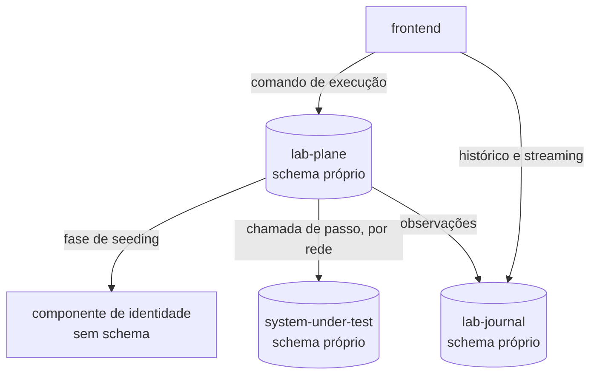
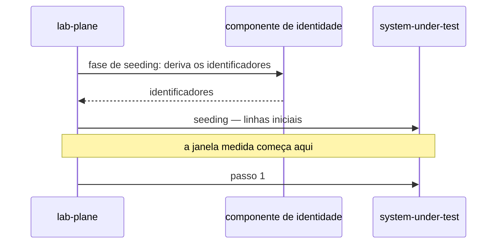

# ADR-0011: A topologia de serviços e o caderno de laboratório fora do Git

- **Estado:** Aceito
- **Data:** 2026-08-06
- **Etapa do roadmap:** 1
- **Relacionado:** emenda o [ADR-0008](0008-os-dois-planos-em-processos-separados.md) —
  a regra sobre o que o Lab Plane hospeda, nomeada em `## Justificativa` — que recebe
  `Última atualização` e `Alterado por` no mesmo commit. Depende do
  [ADR-0009](0009-a-classificacao-do-dual-write-e-a-regiao-de-pacote.md) (região
  `dev.da0hn.lab.sut`) e do
  [ADR-0010](0010-a-fronteira-de-schema-e-o-cdc-como-fonte-do-veredito.md) (schema por
  serviço, já aplicável aos três com estado).

- **Última atualização:** 2026-08-12, pela emenda do ADR-0017; a emenda do ADR-0014 é de
  2026-08-11.
- **Alterado por:**
  [ADR-0014](0014-o-broker-na-travessia-da-observacao-e-o-cursor-monotonico-do-replay.md)
  — emenda; a aresta `LP -->|" observações "| LJ` do diagrama "Comando no `lab-plane`,
  leitura no `lab-journal`, sem BFF", em ## Decisão, passa pelo broker.
- **Alterado por:**
  [ADR-0017](0017-a-persistencia-antecipada-do-log-de-observacoes-e-o-buffer-que-a-alimenta.md)
  — emenda; a `Pergunta em aberto` das `### Negativas` sobre o que o "resultado" do
  `lab-journal` inclui fica resolvida: inclui o log de observações evento a evento,
  persistido desde a etapa 1.

## Contexto

O ADR-0008 fixou dois planos em dois processos, com a chamada de passo atravessando a
rede de um para o outro
([`0008-...md#decisão`](0008-os-dois-planos-em-processos-separados.md#decisão)), e uma
tabela de pacotes nomeando a região de cada um
(`0008-os-dois-planos-em-processos-separados.md:77-82`).

O `pom.xml` raiz lista quatro módulos Maven — `shared`, `lab-plane`, `lab-journal` e
`system-under-test` — (`pom.xml:27-32`); os três últimos são executáveis, `shared` é
biblioteca
([raiz do `AGENTS.md`](../../AGENTS.md#os-quatro-serviços-e-a-regra-que-os-separa)). O
`compose.yaml` sobe quatro serviços: os três anteriores e o `frontend`
(`compose.yaml:44-99`). O `javadoc` de `LabJournalApplication` registra que
`dev.da0hn.lab.journal` não consta do ADR-0008
(`lab-journal/src/main/java/dev/da0hn/lab/application/journal/LabJournalApplication.java:9-11`);
`## Decisão` fecha essa lacuna.

O plano original mantinha `experiments/` e `docs/experiments/` no Git — a frase "juntos,
o histórico vira um caderno de laboratório" vinha do `AGENTS.md`, e a linha `E-17` a
declarou sem valor
([`../fila-de-decisoes.md`](../fila-de-decisoes.md#a-quarta-rodada-em-2026-08-06-uma-contradição-com-adr-aceito)) —,
e nenhuma das duas pastas existe.

O ADR-0002 decide quem deriva o identificador: ele DEVE ser "gerado no código do sistema
sob teste, a partir da semente do experimento", sob o título "atribuída pela aplicação"
([ADR-0002](0002-o-dominio-minimo-e-os-dois-oraculos.md#a-identidade-das-entidades-é-atribuída-pela-aplicação))
— `## Justificativa` explica por que o componente de identidade não contradiz essa
regra.

## Problema

- O ADR-0008 descreve dois processos; a regra de fronteira precisa valer sobre os
  serviços que a árvore tem hoje.
- Onde vivem a definição de um experimento e o resultado, agora que
  `experiments/`/`docs/experiments/` deixaram de ser destino?
- O frontend comanda uma execução e lê histórico e streaming — um serviço a mais se
  justifica?
- Quem hospeda a regra que deriva a identidade da semente, sem entrar na janela medida?

## Decisão

### Cinco serviços, e o "quatro" do `AGENTS.md` deixa de valer

O laboratório passa a ser composto por `lab-plane`, `lab-journal`, `system-under-test`,
`frontend` e um componente de identidade, descrito adiante. A contagem de "quatro
serviços" do
[raiz do `AGENTS.md`](../../AGENTS.md#os-quatro-serviços-e-a-regra-que-os-separa) deixa
de valer.

### Schema próprio para quem grava estado

Só três dos cinco têm papel no PostgreSQL — `lab_plane`, `lab_journal` e `sut`
(`local/postgres-init.sql:8-14`) — com schema próprio, nomeado pelo Flyway de cada
serviço. O `frontend` e o componente de identidade não gravam estado no banco do
laboratório.

| Serviço                  | Pacote (região)          | Schema                                                                 |
|--------------------------|--------------------------|------------------------------------------------------------------------|
| `lab-plane`              | `dev.da0hn.lab.labplane` | `lab_plane` (`lab-plane/src/main/resources/application.yml:16-17`)     |
| `lab-journal`            | `dev.da0hn.lab.journal`  | `lab_journal` (`lab-journal/src/main/resources/application.yml:15-16`) |
| `system-under-test`      | `dev.da0hn.lab.sut`      | `sut` (`system-under-test/src/main/resources/application.yml:21-22`)   |
| `frontend`               | —                        | —                                                                      |
| componente de identidade | não decidido             | —                                                                      |

`dev.da0hn.lab.sut` vem do ADR-0009
(`system-under-test/src/main/java/dev/da0hn/lab/application/sut/SystemUnderTestApplication.java:15`);
`dev.da0hn.lab.journal` estava pendente no `javadoc` citado no Contexto, e esta tabela a
declara
(`lab-journal/src/main/java/dev/da0hn/lab/application/journal/LabJournalApplication.java:14`).
**Nenhum serviço acessa o schema de outro**, regra que o ADR-0010 já fixa para os três
com estado
([`0010-...md#decisão`](0010-a-fronteira-de-schema-e-o-cdc-como-fonte-do-veredito.md#decisão)),
aplicada aqui à topologia.

### Comando no `lab-plane`, leitura no `lab-journal`, sem BFF

O frontend NÃO DEVE falar com um back-end único: manda comando ao `lab-plane`, lê
histórico e streaming do `lab-journal`, sem `Backend For Frontend` — decisão em
[`../fila-de-decisoes.md`](../fila-de-decisoes.md#a-sexta-rodada-em-2026-08-06-o-cdc-vira-fonte-do-veredito).

### O caderno de laboratório sai do Git

A definição de um experimento e o resultado dela DEVEM viver no banco do `lab-journal`,
pacote `dev.da0hn.lab.journal`, declarados pela pessoa via frontend. Nem `experiments/`
nem `docs/experiments/` são criados — mesma rodada citada no Contexto (`E-17`).

### O componente de identidade

Um componente próprio — nem o domínio medido, nem o `lab-plane` — deriva o identificador
de um recurso a partir da semente. Ele roda como serviço separado, atrás de uma chamada
de rede, e essa chamada DEVE acontecer na fase de seeding de cada execução, antes de a
janela medida abrir.

## Justificativa

**Serviço próprio para o histórico, sem BFF.** Quem mede não pode compartilhar destino
com quem é medido
([`0008-...md#justificativa`](0008-os-dois-planos-em-processos-separados.md#justificativa)),
e o mesmo vale um nível abaixo: o histórico vive em serviço próprio, e o roteamento do
frontend já é o CQRS que a topologia impõe. O raiz do
[`AGENTS.md`](../../AGENTS.md#regras-estruturais-que-valem-sempre) proíbe tecnologia que
entre por estar disponível, e `nginx.conf`/Vite já roteiam
(`frontend/nginx.conf:13-28`, `frontend/vite.config.ts:15-18`).

**Por que a contagem de "quatro" deixa de valer.** `E-15` fechou em quatro antes de
`E-11`/`E-24` criarem o quinto — sequência, não inconsistência da fila:

| Linha  | Fechou em                                                                                       | Resultado                                   |
|--------|-------------------------------------------------------------------------------------------------|---------------------------------------------|
| `E-15` | [quinta rodada, grupo I](../fila-de-decisoes.md#a-quinta-rodada-em-2026-08-06-o-cdc-conferido)  | quatro serviços no dia zero                 |
| `E-11` | [segunda rodada, grupo II](../fila-de-decisoes.md#a-segunda-rodada-do-grupo-ii-em-2026-08-06)   | componente de identidade: onde a regra mora |
| `E-24` | [terceira rodada, grupo II](../fila-de-decisoes.md#a-terceira-rodada-do-grupo-ii-em-2026-08-06) | componente de identidade: serviço próprio   |

**Por que emenda o ADR-0008, e não o substitui.** O critério de
[`README.md`](README.md#a-emenda-terceira-forma-ao-lado-da-substituição-e-da-subsunção)
diz: a regra emendada NÃO DEVE ser a que dá título ao ADR, nem a que está em
`## Decisão`. A regra recortada está em `## Decisão` do ADR-0008 — "O Lab Plane hospeda
runtime, escalonador, injetor de falha, log e oráculo"
(`0008-os-dois-planos-em-processos-separados.md:55-56`) —, e o log passa a viver no
`lab-journal`. A leitura literal bloquearia esta emenda, como a do ADR-0010:

| Leitura                                                                                | Consequência                                  |
|----------------------------------------------------------------------------------------|-----------------------------------------------|
| literal — nenhuma regra de `## Decisão` pode ser emendada                              | bloqueia esta emenda e a do ADR-0010          |
| pelo precedente — ADR-0009 e ADR-0010 emendaram regra acessória dentro de `## Decisão` | esta emenda é válida, como as duas anteriores |

O precedente são
o [ADR-0009](0009-a-classificacao-do-dual-write-e-a-regiao-de-pacote.md) e o
[ADR-0010](0010-a-fronteira-de-schema-e-o-cdc-como-fonte-do-veredito.md#justificativa),
que emendaram regra em `## Decisão` deste ADR-0008 e seguem `Aceito`. Se a cláusula
exclui toda regra em `## Decisão`, ou só a que dá título, ninguém decidiu: `Pergunta em
aberto`.

**O componente de identidade não contradiz o ADR-0002.** O `DEVE` de "gerado no código
do sistema sob teste" vive sob o título "atribuída pela **aplicação**", e as duas frases
seguintes da mesma seção vedam só `SERIAL`, `IDENTITY`, `nextval` e valor padrão do banco
([ADR-0002](0002-o-dominio-minimo-e-os-dois-oraculos.md#a-identidade-das-entidades-é-atribuída-pela-aplicação)):
a regra protege a aplicação decidir a identidade, não o banco. O componente continua
aplicação, derivando de forma determinística da semente — o que o ADR-0002 proíbe é o
banco atribuir o número.

**O histórico sai do Git.** Entre o arquivo versionado, revisável em PR, e o Experiment
Designer no frontend, que dispensa editar Markdown, o segundo venceu; o custo — perda de
diff, de revisão e de sobrevivência a um banco recriado — está nomeado na mesma linha da
fila citada no Contexto.

**O componente de identidade é serviço próprio, não biblioteca.** A proposta recomendava
que o domínio medido derivasse o identificador, ciente da semente
([`../fila-de-decisoes.md`](../fila-de-decisoes.md#e-11-mudou-de-terreno-o-instrumento-já-publica-identidade-no-sistema-medido)).
A decisão foi contra essa recomendação, aceitando o custo de um contexto inteiro por uma
regra de uma linha em troca de contrato testável
([`../fila-de-decisoes.md`](../fila-de-decisoes.md#e-11-fecha-no-componente-próprio-e-abre-e-24-no-mesmo-ato)).
Rodar separado dispensa escolher entre os dois planos
([`../fila-de-decisoes.md`](../fila-de-decisoes.md#e-24--a-alternativa-c-isola-a-regra-e-não-decide-quem-a-invoca)).
A latência, objeção restante, some se a chamada ocorrer na fase de seeding — nenhum dos
quatro experimentos hoje especificados pede identidade nova durante os passos
([`../fila-de-decisoes.md`](../fila-de-decisoes.md#e-24-fecha-no-serviço-próprio-e-a-latência-sai-da-janela-se-a-derivação-for-antes)).

## Consequências

### Positivas

- A fronteira de schema do ADR-0010 já alcança os três com estado; esta decisão a
  aplica.
- O histórico ganha fonte única, e nenhum serviço novo entra só para rotear o frontend.
- A latência de derivar identidade fica fora da janela medida, enquanto nenhum
  experimento a pedir durante os passos.

### Negativas

- Um resultado deixa de aparecer em diff, de ser revisado em PR e de sobreviver a um
  banco recriado.
- O mapa de rotas do frontend precisa ser declarado três vezes — Vite, `nginx.conf`, o
  recurso do cluster —, e divergir só aparece em produção
  (`frontend/vite.config.ts:4-10`).
- **O componente de identidade não tem nome, módulo nem entrada na árvore. `Pergunta em
  aberto`.** O `pom.xml` lista quatro módulos, e nenhum é ele (`pom.xml:27-32`).
- **Se o "resultado" do `lab-journal` inclui o log de observações evento a evento, ou só
  o relatório agregado, não foi distinguido. `Pergunta em aberto`.** O ADR-0007 adia a
  persistência do log à etapa 6
  (`0007-o-log-de-observacoes-forma-ordem-e-onde-vive.md#onde-o-log-vive`); se alcançado,
  esta decisão antecipa esse gatilho.

### Neutras

- A tabela de pacotes estende, e não substitui, a do ADR-0008
  (`0008-os-dois-planos-em-processos-separados.md:77-82`): `dev.da0hn.lab.shared` e
  `dev.da0hn.lab.application` continuam valendo.
- O raiz do `AGENTS.md` é alinhado no mesmo commit, como `E-13` já fez
  ([`../fila-de-decisoes.md`](../fila-de-decisoes.md#e-13-fecha-por-papel-do-valor-e-o-agentsmd-muda-no-mesmo-commit)).

## Trade-offs

- O benefício **fonte única para definição e resultado** foi aceito em troca do custo
  **perda de diff, de revisão em PR e de sobrevivência a um banco recriado**.
- O benefício **identidade isolada em contrato testável, fora da janela medida** foi
  aceito em troca do custo **um serviço a mais, sem nome nem módulo, que reabre se um
  experimento exigir identidade durante os passos**.
- O benefício **nenhum serviço novo entre o frontend e os dois destinos** foi aceito em
  troca do custo **o mapa de rotas é declarado em três lugares que podem divergir**.

## Alternativas consideradas

### `experiments/` e `docs/experiments/` versionados no Git

**Descartada.** A favor: aparece em diff, é revisável em PR e sobrevive a um banco
recriado. Perde porque o Experiment Designer no frontend venceu esse argumento.

### Histórico de execução dentro do `lab-plane`

**Descartada.** A favor: nenhum serviço novo, nenhuma chamada de rede a mais. Perde pelo
argumento do ADR-0008 — o instrumento que mede guardaria o que mediu
([`0008-...md#justificativa`](0008-os-dois-planos-em-processos-separados.md#justificativa)).

### Um `Backend For Frontend` entre o frontend e os dois serviços

**Descartada.** A favor: um único destino. Perde porque nenhuma limitação concreta o
exige — `nginx.conf` e o Vite já roteiam, mesma rodada citada em `## Decisão` (`E-20`).

### `audit` ou `ledger` como nome do serviço de histórico

**Descartada.** A favor: nomes correntes. Perdem por carregar conotação que o serviço
não tem — `audit`, conformidade; `ledger`, contábil — enquanto `lab-journal` mantém a
metáfora já usada.

### Identidade embutida, no domínio medido ou no `lab-plane`

**Descartada.** A favor da primeira, a recomendação original: evita um serviço a mais;
perde por exigir que o domínio receba a semente e hospede a regra. A favor da segunda: a
regra fica num só lugar; perde porque o instrumento decidiria a identidade do sistema
medido, papel isolado num componente próprio.

## Quando esta decisão deixa de valer

Revise a posição do componente de identidade se algum experimento futuro exigir
identificador novo durante os passos — a latência de rede volta a entrar na medida.

## Patches aplicados

O regime de patch está em [`README.md`](README.md#a-revogação-da-imutabilidade-decidida-em-2026-08-07).
Um patch conserta citação, caminho ou erro material; ele NÃO DEVE alterar a decisão nem o
argumento que a sustentava.

| Data       | Seção do corpo     | O que mudou                                                                                                                 | Por quê                                                                                                                                                                                                                               |
|------------|--------------------|-----------------------------------------------------------------------------------------------------------------------------|---------------------------------------------------------------------------------------------------------------------------------------------------------------------------------------------------------------------------------------|
| 2026-08-11 | `## Contexto`      | `0002-o-dominio-minimo-e-os-dois-oraculos.md:138-139` virou âncora `#a-identidade-das-entidades-é-atribuída-pela-aplicação` | a frase citada entre aspas — "gerado no código do sistema sob teste, a partir da semente do experimento" — vive em `:152-153`, sob o título que o próprio parágrafo nomeia. O intervalo caía na descrição de `allocate`, noutra seção |
| 2026-08-11 | `## Justificativa` | `0002-...md:136` e `0002-...md:139-140` viraram uma âncora só, `#a-identidade-das-entidades-é-atribuída-pela-aplicação`     | as duas citações apontavam para o título e para as duas frases seguintes **da mesma seção**; nenhuma delas alcançava mais o alvo, e a seção inteira responde pelas duas                                                               |
