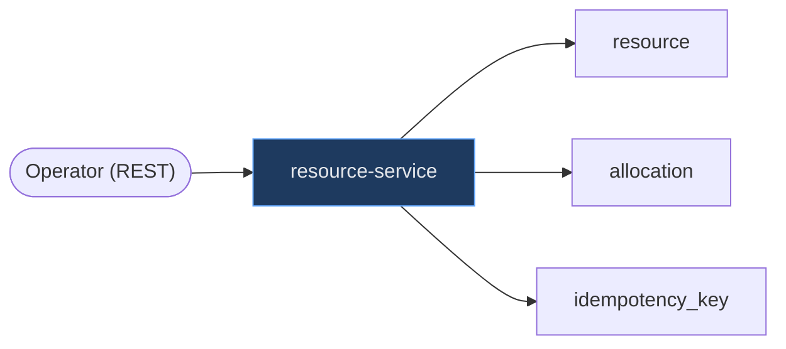
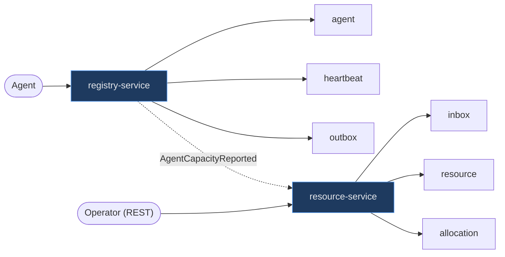
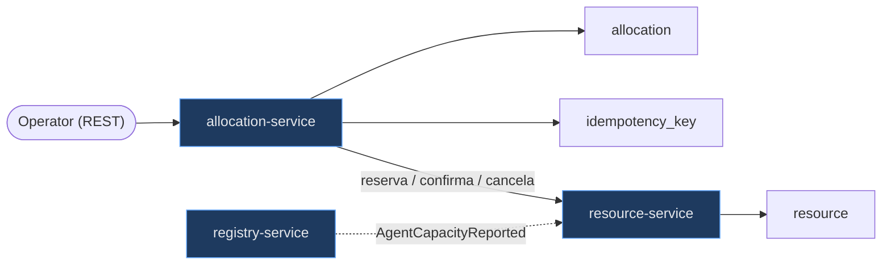

# ADR-0011: Decomposição em serviços e fronteiras transacionais

- **Estado:** Proposto
- **Data:** 2026-07-26
- **Etapa do roadmap:** 0
- **Relacionado:** ADR-0001, ADR-0002, ADR-0003, ADR-0004, ADR-0005, ADR-0006, ADR-0007

## Contexto

O ADR-0001 define dois agregados, `resource` e `allocation`, e uma invariante que só
pode ser verificada lendo os dois. O ADR-0002 define quatro origens de escrita sobre
esse mesmo estado. O ADR-0005 decide que cada serviço tem seu próprio schema e que
nenhum serviço lê a tabela de outro — restrição imposta pelo banco, com usuário
próprio e permissão negada nos schemas alheios.

O esqueleto do repositório criou cinco diretórios em `services/`: `resource-service`,
`allocation-service`, `registry-service`, `chaos-service` e `experiment-service`.
Todos vazios. **Esse número nunca foi decidido por nenhum ADR.** Ele aparece na
árvore do ADR-0005 como um dado herdado, e a própria questão 3 daquele ADR registra
que a passagem de "dois agregados e quatro origens" para "cinco serviços" não está
escrita em lugar nenhum.

Nenhum `pom.xml` existe. Nenhum schema existe. Nenhuma linha de Java existe. A
mudança ainda é gratuita.

## Problema

A fronteira de serviço é a fronteira transacional. Essa frase é a origem do
conflito.

**Força 1 — o ADR-0001 exige uma transação única.** A invariante é verificada lendo
`allocation` (ou o contador em `resource`), comparando com `resource.capacity` e
escrevendo. No modelo `DERIVED`, a leitura é um `SELECT sum(amount) FROM allocation`
e a escrita é um `INSERT` em `allocation`, com `resource.capacity` como limite. Os
dois agregados aparecem na mesma transação.

**Força 2 — o ADR-0005 proíbe exatamente isso.** Se `resource` e `allocation`
pertencem a serviços diferentes, eles estão em schemas diferentes, com usuários
diferentes, e a consulta acima é impossível por construção.

**Força 3 — as quatro estratégias da Etapa 1 são mecanismos de um banco só.**
`NONE`, `ATOMIC_UPDATE`, `OPTIMISTIC` e `PESSIMISTIC` (ADR-0003) protegem porque
leitura e escrita acontecem na mesma transação, no mesmo PostgreSQL. A questão 3 do
ADR-0003 registra que essas quatro ficam inaplicáveis se a decomposição separar os
agregados, e declara que isso **bloqueia a Etapa 1 inteira**.

**Força 4 — o laboratório existe para estudar sistemas distribuídos.** Um arranjo
que nunca distribui a invariante nunca responde à pergunta central: quanto custa
distribuí-la.

Três perguntas precisam de resposta, e a primeira é a que trava as outras:

- `resource` e `allocation` pertencem ao mesmo serviço? Quando?
- Quantos serviços existem, e por quê esse número?
- Qual serviço é dono de qual tabela, expõe qual contrato e publica qual evento?

## Decisão

### O que justifica uma fronteira de serviço neste laboratório

Os motivos usuais para separar um serviço não valem aqui. O ADR-0005 já registrou o
fato: uma pessoa mantém tudo, num reactor único, sem consumidor externo e sem ciclo
de release independente. Autonomia de time, escala independente e cadência de deploy
não são argumentos disponíveis.

Restam três, e todo serviço deste laboratório é justificado por pelo menos um:

1. **A fronteira cria um fenômeno que o laboratório precisa medir.** Uma transação a
   menos é um objeto de estudo: saga, compensação, consistência eventual visível.
2. **A fronteira protege a medida.** A regra 6 do ADR-0006 mantém o instrumento fora
   do sistema sob teste.
3. **A fronteira dá ao Outbox e ao Inbox um produtor e um consumidor distintos.** Sem
   isso o ADR-0007 não é testável nos próprios termos: um Inbox que deduplica os
   eventos do próprio serviço é um caso degenerado.

Uma fronteira que não atende a nenhum dos três é custo operacional puro.

### Cinco serviços, um por critério aplicado

| Serviço | Plano | Critério | Nasce na Etapa |
|---|---|---|---|
| `resource-service` | Control | é o sistema — dono da invariante | 1 |
| `registry-service` | Control | 3 — produtor externo para o Inbox | 2 |
| `chaos-service` | Lab | 2 — instrumento fora do sistema | 3 |
| `experiment-service` | Lab | 2 — instrumento fora do sistema | 4 |
| `allocation-service` | Control | 1 — distribui a invariante | 5 |

O número cinco não é escolhido: ele é o resultado de aplicar os três critérios. Nenhum
serviço existe por simetria.

### `resource` e `allocation` pertencem ao mesmo serviço até a Etapa 5

Esta é a decisão que desbloqueia as outras. Nas Etapas 1 a 4, `resource-service` é
dono dos **dois** agregados, no mesmo schema, sob a mesma transação. A invariante do
ADR-0001 é verificada por ACID, como escrita.

Na Etapa 5, junto com a saga (ADR-0008) e o Lease Expiry (ADR-0002), a tabela
`allocation` **muda de dono**. Ela passa para `allocation-service`, num schema
próprio, e a invariante passa a atravessar uma fronteira de rede. O laboratório mede
então a diferença entre os dois arranjos, com o mesmo experimento e a mesma semente.

Isto é a opção C da questão 3 do ADR-0005. O argumento é o do grupo de controle, o
mesmo que o ADR-0003 usa para tornar a estratégia `NONE` obrigatória: **não é
possível medir o custo de distribuir a invariante sem ter o resultado não distribuído
para comparar.**

### A fronteira transacional

Nas Etapas 1 a 4 existe **uma** transação que toca a invariante, e ela é local:

```sql
-- schema: resource   (usuário: resource_svc)
resource         { id, capacity, available, version, status, capacity_model,
                   concurrency_strategy }
allocation       { id, resource_id, amount, status }   -- FK real para resource(id)
idempotency_key  { key, request_hash, response, created_at }
```

Consequências diretas para a Etapa 1:

- As quatro estratégias do ADR-0003 são aplicáveis como escritas. A questão 3 daquele
  ADR está respondida, e a Etapa 1 está desbloqueada.
- A coluna `DERIVED` da matriz do ADR-0003 é executável. Isso importa mais do que
  parece: **write skew é um fenômeno de banco único.** Ele exige duas transações
  concorrentes lendo o mesmo conjunto sob um nível de isolamento fraco. Entre dois
  bancos não existe write skew — existe um fato defasado, que é outro bug, mais fraco
  e menos instrutivo.
- O experimento `DERIVED` + `OPTIMISTIC`, a *proteção presente e inerte* que o
  ADR-0001 chama de resultado mais valioso do laboratório, é executável na Etapa 1.
- A chave estrangeira `allocation.resource_id → resource.id` existe de verdade. O
  banco garante integridade referencial. Isso é um privilégio temporário, e o
  laboratório deve saber a data em que o perde.

### Propriedade de tabelas

| Tabela | Dono nas Etapas 1–4 | Dono na Etapa 5+ | Nasce na Etapa |
|---|---|---|---|
| `resource` | `resource-service` | `resource-service` | 1 |
| `allocation` | `resource-service` | **`allocation-service`** | 1 |
| `idempotency_key` | `resource-service` | um por serviço que aceita comando | 1 |
| `outbox` | `resource-service`, `registry-service` | mais `allocation-service` | 2 |
| `inbox` | `resource-service` | mais `allocation-service` | 3 |
| `agent` | `registry-service` | `registry-service` | 2 |
| `heartbeat` | `registry-service` | `registry-service` | 2 |
| `experiment_run` | `experiment-service` | `experiment-service` | 4 |

Quatro regras fecham a tabela:

- **`outbox` e `inbox` não são tabelas compartilhadas.** Cada serviço tem as suas, no
  próprio schema. O ADR-0007 exige que o evento seja gravado na mesma transação que
  altera o estado; uma tabela comum reintroduziria o dual-write que o padrão existe
  para eliminar.
- **`idempotency_key` pertence ao serviço que recebe o comando.** As chaves não são
  compartilhadas entre serviços. Na Etapa 5, `allocation-service` passa a ter a sua,
  porque passa a receber o comando do Operator; `resource-service` mantém a sua,
  porque a etapa de reserva da saga também é retentável.
- **`idempotency_key` e `inbox` não são a mesma tabela**, embora sejam o mesmo
  mecanismo em transportes diferentes. Os espaços de chave são distintos: um é
  fornecido pelo cliente HTTP, o outro é o `eventId` gerado pelo produtor. Uni-los
  criaria colisão entre dois domínios de chave sem dono comum.
- **`chaos-service` não tem schema.** Seu estado é o gerador pseudoaleatório semeado e
  a configuração. Se o ADR-0012 escolher um mecanismo que exija persistência — um
  proxy que reordena precisa de buffer — a tabela é dele, no schema dele, e nunca em
  schema do Control Plane.

### A fronteira em três momentos

Etapa 1 — uma fronteira, um serviço, uma transação:



Etapa 3 — duas fronteiras no Control Plane, invariante ainda local:



Etapa 5 — a invariante atravessa a fronteira:



A partir daqui, `Σ(alocações ativas)` vive num banco e `capacity` vive em outro. A
invariante do ADR-0001 deixa de ser verificável por uma consulta.

### Contratos REST

| Serviço | Endpoint | Etapa | Origem (ADR-0002) |
|---|---|---|---|
| `resource-service` | `POST /resources` | 1 | operação de setup |
| `resource-service` | `GET /resources/{id}` | 1 | leitura |
| `resource-service` | `POST /resources/{id}/allocations` | 1–4 | Operator |
| `resource-service` | `DELETE /allocations/{id}` | 1–4 | Operator |
| `resource-service` | `POST /resources/{id}/reservations` | 5 | passo compensável da saga |
| `resource-service` | `POST /reservations/{id}/confirm` \| `/cancel` | 5 | passo compensável da saga |
| `registry-service` | `POST /agents` | 2 | registro |
| `registry-service` | `POST /agents/{id}/heartbeats` | 2 | Agent |
| `registry-service` | `GET /agents/{id}` | 2 | leitura |
| `allocation-service` | `POST /allocations` | 5 | Operator |
| `allocation-service` | `DELETE /allocations/{id}` | 5 | Operator |
| `experiment-service` | `POST /experiments/{name}/runs` | 4 | Lab Plane |
| `chaos-service` | `PUT /chaos/plan` | 3 | Lab Plane |

Os endpoints com `Idempotency-Key` obrigatório são os do Operator, conforme o
ADR-0002.

### Eventos

| Evento | Produtor | Consumidor | Etapa |
|---|---|---|---|
| `AgentCapacityReported` | `registry-service` | `resource-service` | 2 publica, 3 consome |
| `ResourceCapacityChanged` | `resource-service` | `experiment-service` | 2 |
| `ResourceOvercommitted` | `resource-service` | `experiment-service` | 2 |
| `ResourceRecovered` | `resource-service` | `experiment-service` | 2 |
| `AllocationGranted` | `resource-service` (1–4) → `allocation-service` (5+) | `experiment-service` | 2 |
| `AllocationRejected` | `resource-service` (1–4) → `allocation-service` (5+) | `experiment-service` | 2 |
| `CapacityReserved` \| `ReservationCancelled` | `resource-service` | `allocation-service` | 5 |
| `AllocationCompensated` | `allocation-service` | `experiment-service` | 5 |
| `AllocationExpired` | `allocation-service` | `resource-service` | 5 |

O Lab Plane consome eventos do Control Plane e **nunca publica eventos de domínio
nele**. A seta de volta do diagrama do `README.md` é observação, não dependência.

### Onde ficam o Reconciler e o Lease Expiry

As quatro origens do ADR-0002 não são serviços. Elas são casos de uso, e cada uma vive
no serviço que é dono do dado que ela escreve.

- **Operator** — `resource-service` nas Etapas 1–4; `allocation-service` a partir da 5.
- **Agent** — entra por `registry-service` e é aplicado por `resource-service`.
- **Reconciler** — `resource-service`, sempre. Ele é o agente da convergência da
  invariante, e a invariante mora com `resource`. A partir da Etapa 5 sua leitura do
  conjunto de alocações vira remota, e a janela de write skew dele passa a ter o
  tamanho de um salto de rede. Isso não é defeito: é o resultado que a Etapa 5 existe
  para medir.
- **Lease Expiry** — `allocation-service`, Etapa 5. Ele expira alocações, é dono de
  `expires_at`, e só existe depois que a tabela mudou de dono.

### O nome `allocation-service` engana, e o esqueleto é corrigido

Se `resource-service` é dono de `resource` **e** `allocation` nas Etapas 1 a 4, então
um diretório chamado `allocation-service` não é dono de nada durante quatro etapas. O
nome afirma uma propriedade que não existe.

A correção é não criar o diretório antes da hora. **`services/` contém apenas serviços
que existem.** Um diretório ausente não faz afirmação nenhuma; um diretório vazio com
nome de dono faz uma afirmação falsa. Isso custa remover quatro diretórios vazios do
esqueleto atual, e devolve ao reactor Maven uma lista de módulos que corresponde ao
que está implementado.

`resource-service` mantém o nome. Ele é dono dos dois agregados na fase transitória e
de exatamente um no estado final. O nome é correto no fim e impreciso no meio, e a
imprecisão está registrada aqui. A alternativa, `capacity-service`, seria correta nas
duas fases, mas trocaria uma imprecisão temporária por um nome que não corresponde ao
agregado do ADR-0001.

Quando `allocation-service` nascer, na Etapa 5, ele será dono de `allocation`. O nome
nasce verdadeiro.

### O que muda na regra 4 do ADR-0006

A regra 4 diz: `..resource..` não importa `..allocation..` (e vice-versa), com o
motivo *"serviço não importa serviço"*. A regra foi escrita supondo que `resource` e
`allocation` fossem serviços. Sob esta decisão, nas Etapas 1 a 4 eles são dois
agregados dentro do mesmo serviço — e a regra, como está escrita, tem dois destinos,
ambos ruins:

- Lida sobre **pacotes de agregado**, ela proíbe o caso de uso de ler `allocation` para
  verificar a invariante. Ela quebraria a build no primeiro commit da Etapa 1. A regra
  seria **falsa**.
- Lida sobre **serviços**, na Etapa 1 ela não tem sujeito: existe um serviço só no
  Control Plane. Ela passaria verde sem verificar nada. A regra seria **vazia** — e uma
  regra vazia que passa verde é pior que uma vermelha, porque produz confiança falsa.

A regra 4 é reescrita em duas, e o motivo original é preservado:

| # | Regra reescrita | Torna-se não vazia |
|---|---|---|
| 4a | Nenhum pacote de serviço importa o pacote de outro serviço, expresso sobre a **raiz do módulo** (`..resourceservice..` ↛ `..registryservice..`), nunca sobre nome de agregado | Etapa 2 |
| 4b | Nenhum agregado importa outro agregado. `..domain.resource..` e `..domain.allocation..` não se conhecem; a composição acontece na camada `application` | Etapa 1 |

A regra 4b é a que faz trabalho na Etapa 1. Ela é o que mantém a costura da Etapa 5
barata: se os dois agregados nunca se importarem, mover um deles para outro serviço é
mover um pacote e trocar uma chamada de método por uma chamada remota. Se eles se
importarem livremente, a migração vira reescrita.

Enquanto a regra 4a for vazia — Etapa 1 inteira — o teste precisa dizer isso no
`because(...)`. Uma regra vazia declarada é informação; uma regra vazia silenciosa é
mentira.

Esta decisão também estreita a questão 1 do ADR-0006: o padrão de pacote precisa
carregar o nome do **módulo de serviço**, não o nome do agregado. O parent POM herda
essa restrição.

## Questões em aberto

### 1. Como o Lab Plane verifica uma asserção sobre o estado final

O ADR-0004 diz que as asserções são consultas sobre o estado final. O ADR-0005 diz
que nenhum serviço lê a tabela de outro. O `experiment-service` precisa das duas
coisas ao mesmo tempo, e elas não coexistem.

**A favor de um usuário de banco somente-leitura para o Lab Plane:** é a leitura mais
verdadeira que existe. Ela vê o que está gravado, não o que o serviço diz estar
gravado, e continua funcionando quando o serviço sob teste está degradado — que é
justamente quando o veredito importa. O custo é que o instrumento passa a depender do
schema interno do Control Plane, e uma migração de coluna quebra o experimento.

**A favor de um endpoint de verificação no Control Plane:** preserva a regra do
ADR-0005 e o schema fica livre para mudar. O custo é grave: o sistema sob teste passa
a conter código que só existe para o instrumento, o que raspa na regra 6 do ADR-0006,
e o veredito sobre um sistema quebrado passa a ser lido **pelo próprio sistema
quebrado**. Se o serviço estiver inacessível, o experimento não conclui "violou" nem
"não violou" — ele não conclui nada.

Nenhuma das duas é gratuita. A decisão não pertence a este ADR, mas a lacuna nasce
dele: ao fixar quem é dono de qual schema, este ADR torna a pergunta respondível e
obrigatória. Ela precisa estar fechada antes da Etapa 4.

### 2. Um `agent` corresponde a um `resource`?

Nenhum ADR decide a cardinalidade. O ADR-0002 diz que o Agent reporta a capacidade
total de um **nó**; o ADR-0001 diz que a capacidade pertence a um **recurso**. A
tradução entre os dois não está escrita.

**A favor de 1:1:** o relato do Agent substitui `resource.capacity` diretamente, o
`SEQUENCE_GUARD` opera por agregado, e `registry-service` publica um evento por
heartbeat sem agregar nada. É o arranjo mais simples e o que este ADR pressupõe nas
tabelas acima.

**A favor de N:1:** vários nós compondo um recurso é o caso realista, e ele cria um
segundo modelo `DERIVED` — agora sobre capacidade, não sobre alocação — com janela de
write skew própria. Isso mudaria a propriedade de tabelas: ou `registry-service` passa
a agregar antes de publicar, ou `resource-service` ganha uma tabela `node_capacity`
própria, alimentada por evento.

A escolha altera este ADR. Ela fica aberta porque nenhum ADR anterior a decidiu, e
inventá-la aqui seria decidir modelagem de domínio numa decisão sobre fronteiras.

### 3. O arranjo não distribuído continua executável depois da Etapa 5?

**A favor de manter:** um grupo de controle só vale enquanto puder ser reexecutado. Um
relatório antigo em `docs/experiments/` responde à pergunta que foi feita naquele dia,
não a uma pergunta nova. Se a Etapa 6 levantar uma hipótese sobre o custo da fronteira,
a comparação exige rodar os dois arranjos de novo, com a mesma semente.

**Contra:** manter dois arranjos vivos é manter dois caminhos de escrita para a mesma
invariante. O ADR-0003 já paga por nove estratégias e dois `capacityModel`; um terceiro
eixo triplica a matriz e multiplica o custo de manutenção sem produzir experimento
novo. A opção barata é uma tag no Git no commit anterior à divisão, que preserva a
capacidade de reexecutar ao custo de um `checkout` e de um banco recriado.

Nenhuma das duas foi escolhida. A decisão só precisa existir no fim da Etapa 4.

### 4. `experiment` precisa mesmo de tabela?

A propriedade está decidida: se existir, a tabela é do `experiment-service`, no schema
dele. A existência não está.

**A favor:** as asserções de liveness do ADR-0002 (`convergence.seconds < N`) e a
amostragem de defasagem que o ADR-0013 vai exigir dependem de amostras com marca de
tempo, coletadas durante a execução. Amostra é dado, não arquivo.

**Contra:** o ADR-0004 já decidiu que a definição é um arquivo JSON versionado e o
relatório é um Markdown versionado. Dar um banco ao instrumento cria um segundo sistema
com problema de consistência próprio dentro do Lab Plane, e um bug ali vira um
resultado de consistência falso.

Isto pertence ao ADR-0004 ou ao ADR-0013, não a este. Fica registrado porque a tabela
de propriedade acima lista `experiment_run` de forma condicional.

## Consequências

### Positivas

- A Etapa 1 está desbloqueada. A questão 3 do ADR-0003 e a questão 3 do ADR-0005
  estão respondidas, e a colisão declarada no `README.md` dos ADRs deixa de existir.
- A Etapa 1 tem **um serviço só**. Nenhum broker, nenhum Outbox, nenhuma serialização
  de mensagem entre o experimento e o resultado. O laboratório mede concorrência sem
  medir infraestrutura junto.
- A matriz `capacityModel` × estratégia do ADR-0003 é executável por inteiro na Etapa
  1, incluindo a célula `DERIVED` + `OPTIMISTIC`.
- O laboratório ganha um grupo de controle para a fronteira, e não só para a
  estratégia. A pergunta "quanto custa distribuir a invariante" passa a ter resposta
  numérica, com a mesma semente dos dois lados.
- O número de módulos do reactor Maven cresce com o roadmap, não de uma vez. O parent
  POM da Etapa 0 declara um módulo de serviço, não cinco.
- A regra 4b protege a costura da Etapa 5 desde o primeiro commit, sem custo de
  runtime.

### Negativas

- **Em algum momento a fronteira muda, e isso é caro.** O custo está detalhado abaixo,
  em *O que exatamente muda na Etapa 5*. Ele é o preço desta decisão e não é pequeno.
- A integridade referencial entre `allocation` e `resource` é garantida pelo banco nas
  Etapas 1–4 e deixa de ser na Etapa 5. Testes escritos contra essa garantia precisam
  ser reescritos.
- Durante quatro etapas o Control Plane tem no máximo dois serviços. Quem olhar o
  repositório na Etapa 3 verá menos "sistema distribuído" do que o nome do projeto
  promete. Isso é deliberado, e é o tipo de coisa que precisa estar escrita para não
  ser confundida com atraso.
- A regra 4 do ADR-0006 precisa ser reescrita antes de ser implementada. O ADR-0006
  está `Proposto`, então a correção é barata — mas ela é obrigatória, e um ADR aceito
  com a regra 4 original ficaria com uma regra falsa ou vazia.
- O `experiment-service` só nasce na Etapa 4. Até lá, a carga da Etapa 1 vem de JUnit
  com Testcontainers, como o próprio ADR-0004 já prevê na Alternativa A. Os resultados
  da Etapa 1 não são relatórios versionados; são testes.

### Neutras

- Cinco diretórios vazios saem do esqueleto e voltam um por etapa. A árvore do
  `README.md` e a do ADR-0005 passam a descrever um estado futuro, não o atual, e isso
  precisa estar dito onde elas aparecem.
- A separação Control Plane / Lab Plane não muda. Este ADR decide quantos serviços há
  em cada plano, não onde a linha entre eles passa.
- As quatro origens do ADR-0002 continuam sendo casos de uso, não serviços. Nada neste
  ADR contradiz a consequência neutra daquele ADR: *"as quatro origens escrevem no
  mesmo agregado; elas não exigem serviços separados"*.

### O que exatamente muda na Etapa 5

Esta subseção existe porque a opção adotada esconde seu custo no futuro. Ele é
enumerado aqui para não ser descoberto como surpresa.

| Dimensão | Antes (Etapas 1–4) | Depois (Etapa 5) |
|---|---|---|
| **Schema** | `allocation` no schema `resource`, com FK real | `allocation` no schema `allocation`; `resource_id` vira referência não verificada |
| **Transação** | uma transação local verifica a invariante | reserva + confirmação, com compensação; duas transações locais e nenhuma global |
| **Estratégias** | as quatro protegem a invariante | as quatro continuam corretas **sobre `resource`** e deixam de proteger o fim a fim |
| **`capacityModel: DERIVED`** | `SELECT sum(amount)` no mesmo banco | a soma vive em outro serviço; o modelo exige projeção ou consulta remota |
| **Contrato** | `POST /resources/{id}/allocations` | `POST /allocations` mais `POST /resources/{id}/reservations` |
| **Idempotência** | uma `idempotency_key` | uma por serviço que aceita comando retentável |
| **ArchUnit** | regra 4a vazia para `resource`↔`allocation` | regra 4a passa a ter sujeito |
| **Teste** | Testcontainers com um PostgreSQL | dois schemas, um broker, e o Inbox no caminho |
| **Reconciler** | leitura local do conjunto de alocações | leitura remota; janela de skew do tamanho de um salto de rede |

A frase mais importante da tabela é a da linha *Estratégias*. As quatro estratégias
não ficam inaplicáveis: elas continuam protegendo perfeitamente o passo local e param
de proteger o resultado global. Um `OPTIMISTIC` verde numa saga vermelha é a segunda
*proteção presente e inerte* do laboratório, e ela só é observável se a primeira já
tiver sido medida.

**A migração é reversível?** Em código e em dados, sim. O monorepo torna a divisão um
commit atômico (ADR-0005), e o `git revert` desfaz. Os dados são descartáveis: a
plataforma local é Docker Compose (ADR-0010), os volumes são recriados, e nenhum dado
de produção existe. Não há consumidor externo para coordenar.

O que **não** é reversível é o registro experimental. Os relatórios produzidos antes
da divisão descrevem um sistema que deixou de existir. Isso não é perda — é
exatamente o papel de um grupo de controle: ele é preservado como artefato, não como
código em execução. A questão em aberto 3 registra a dúvida sobre manter o arranjo
antigo também executável.

**Quando muda:** na Etapa 5, junto com a saga e o Lease Expiry, nunca antes. Antecipar
a divisão sem a saga produziria um sistema que quebra a invariante sem ter como
convergir.

## Alternativas consideradas

### Alternativa A — um dono para os dois agregados, permanentemente

`resource-service` é dono de `resource` e `allocation` para sempre. A invariante nunca
é distribuída. `allocation-service` nunca existe, e o Control Plane fica com dois
serviços.

**Descartada.** É a alternativa mais barata e a que mais entrega na Etapa 1 — este ADR
adota o comportamento dela nas Etapas 1 a 4, e por isso ela não é um espantalho. O que
a derruba é o que ela impede no fim.

Dois dos seis temas que o ADR-0001 lista como dependentes do domínio ficam sem sujeito:
*saga e compensação* e *consistência eventual visível ao usuário*. O motor de workflow
do ADR-0008 não teria o que orquestrar — uma saga sobre um único banco é uma transação
com passos extras. O ADR-0001 já registra o problema na própria lista de consequências
negativas: *"um único agregado limita os cenários de consistência entre agregados; a
saga precisa de mais de um recurso para ser interessante"*.

Pior: ela deixa sem resposta a pergunta que motiva o laboratório inteiro. "Quanto custa
distribuir uma invariante" não é respondível por um sistema que nunca a distribuiu.

### Alternativa B — dois donos desde a Etapa 1

`resource-service` e `allocation-service` nascem juntos, com schemas separados. A
invariante é distribuída desde o primeiro commit, e a Etapa 1 já usa saga.

**Descartada.** Esta alternativa tem um argumento legítimo, e ele é o mais forte contra
a decisão adotada: **ela evita uma migração de fronteira no meio do projeto.** Mover
uma tabela de schema, reescrever um contrato e refazer a suíte de testes com o sistema
já em andamento é a categoria de trabalho que costuma custar mais que a decisão
original e que, em projetos reais, simplesmente não é feita — a fronteira errada fica
para sempre. A opção B paga esse custo no dia zero, quando ele é zero, porque não há
dado, não há contrato publicado e não há teste escrito. É o argumento correto na
maioria dos projetos.

Ele perde aqui por três motivos, em ordem de peso.

**Primeiro, ela apaga a coluna `DERIVED` do ADR-0003.** Write skew exige duas
transações concorrentes lendo o mesmo conjunto no mesmo banco. Entre dois serviços não
existe write skew; existe leitura defasada, que é outro fenômeno. Com a divisão no dia
zero, o experimento `DERIVED` + `OPTIMISTIC` — que o ADR-0001 chama de resultado mais
valioso do laboratório — deixa de ser executável. Não é adiado: é apagado.

**Segundo, ela força a Etapa 5 na Etapa 1.** A questão 3 do ADR-0003 já descreve o
efeito: `NONE`, `ATOMIC_UPDATE`, `OPTIMISTIC` e `PESSIMISTIC` são mecanismos de um
banco só, e a Etapa 1 passaria a exigir saga com compensação. Saga sem Outbox (Etapa
2), sem Inbox (Etapa 3) e sem observabilidade (Etapa 4) é um mecanismo que falha de
formas que ninguém consegue explicar. O ADR-0001 usou exatamente este argumento para
descartar o modelo `DERIVED` puro: *"força `SERIALIZABLE` com retry já na Etapa 1 —
antes de o laboratório ter observabilidade para entender o que o retry está fazendo"*.

**Terceiro, o custo que ela evita é pequeno neste repositório.** A migração que ela
teme é cara quando existe dado de produção, consumidor externo e deploy coordenado.
Aqui não existe nenhum dos três: o ADR-0005 garante commit atômico no monorepo, o
ADR-0010 garante ambiente descartável, e a regra 4b garante que os dois agregados nunca
se importem. A opção B paga um custo **certo e grande** — perder o grupo de controle e
a coluna `DERIVED` — para evitar um risco que as próprias decisões do laboratório já
tornaram barato.

Um quarto argumento a favor de B merece ser respondido: *um laboratório de consistência
distribuída que passa quatro etapas num serviço só não está estudando o que promete*.
Isso não procede. Nas Etapas 2 e 3 o Control Plane já tem dois serviços, um broker
real, Outbox, Inbox, deduplicação e ordenação. A parte distribuída está lá. O que **não**
está distribuído é uma invariante, de propósito, porque ela é o controle.

### Alternativa C — separação gradual (adotada)

Um dono nas Etapas 1 a 4, com a invariante local; a divisão em dois serviços chega na
Etapa 5, junto com a saga e o Lease Expiry. O laboratório mede a diferença entre os
dois arranjos com o mesmo experimento e a mesma semente.

**Adotada.** Ela é a única das três que produz as duas medidas. A opção A produz só a
não distribuída; a opção B produz só a distribuída; C produz o par, que é a única
forma de responder a uma pergunta comparativa.

O custo dela está enumerado na seção *O que exatamente muda na Etapa 5*, e é real: uma
migração de schema, uma mudança de contrato, uma reescrita de testes de integração e a
perda da chave estrangeira. A migração é reversível em código e em dados, e
irreversível apenas no sentido de que o arranjo antigo passa a existir como artefato
versionado, não como sistema em execução.

C também é a única que respeita a ordem do roadmap sem inventar etapa: cada serviço
nasce na etapa em que o fenômeno que ele produz passa a ser mensurável.

### Alternativa D — um único serviço, sempre

Um monólito modular. Todos os agregados, todas as origens, um schema, um deploy.
Módulos verificados pelo Spring Modulith.

**Descartada.** Ela remove o assunto do laboratório. Sem duas fronteiras, o Outbox do
ADR-0007 publica para si mesmo, o Inbox deduplica os próprios eventos, e o dual-write
problem — que é o problema central da Etapa 2 — deixa de existir, porque banco e broker
param de ser dois sistemas que precisam concordar sobre alguma coisa.

Vale registrar o que ela acertaria: para *estudar concorrência sobre uma invariante*,
que é a Etapa 1 inteira, um serviço basta. Este ADR concorda com ela até a Etapa 4, e
só diverge sobre o fim.

### Alternativa E — um serviço por origem de escrita

Sete serviços: os cinco atuais mais `reconciler-service` e `lease-service`, cada origem
do ADR-0002 com seu próprio deploy.

**Descartada.** Nenhuma das duas fronteiras extras atende a qualquer dos três critérios,
e uma delas destrói um fenômeno.

O `write skew` do Reconciler (ADR-0002) depende de ele ler o conjunto de alocações e
escrever o recurso **no mesmo banco**, com a condição deixando de valer entre as duas
operações. Movido para fora, o Reconciler passa a ler por API e escrever por API: o bug
deixa de ser write skew e vira leitura defasada. A origem perde a falha característica
que justifica sua existência no ADR-0002.

O `lease-service` teria o problema oposto — ele seria um processo sem estado próprio,
escrevendo na tabela de outro serviço, o que o ADR-0005 proíbe. Ele existiria apenas
como um agendador remoto, que é infraestrutura, não fronteira.

Sete serviços custariam sete schemas, sete `outbox`, sete processos de relay e sete
containers no Compose, em troca de zero fenômeno novo.

### Alternativa F — três serviços, com o Lab Plane unificado

`chaos-service` e `experiment-service` fundidos num único `lab-service`, mais
`resource-service` e `registry-service`.

**Descartada.** Os dois componentes do Lab Plane têm posições opostas em relação ao
fluxo de dados. O Chaos fica **no caminho** das mensagens, sujeito à latência que ele
próprio introduz e candidato a ser derrubado durante o experimento; o `experiment-service`
fica **fora** do caminho, orquestrando e coletando o veredito. Fundi-los significa que
derrubar o injetor de falha derruba também quem escreve o relatório — e o experimento
termina sem resultado justamente na execução em que o resultado seria interessante.

A questão 3 do ADR-0006 reforça: o mecanismo de interceptação do Chaos ainda não foi
escolhido (ADR-0012), e uma das opções em cima da mesa é um proxy de broker. Um proxy é
um componente de rede com ciclo de vida próprio. Ele não cabe dentro do executor de
asserções.

## Quando esta decisão deixa de valer

**Sinal para a divisão da Etapa 5 (opção C):** um experimento executado depois da
divisão cujo resultado não difere, além do ruído de medida, do mesmo experimento
executado antes, com a mesma semente e a mesma carga. Isso significaria que a fronteira
não custou nada. Uma fronteira que não custa nada não ensina nada, e ela deve ser
desfeita — não mantida por simetria com arquiteturas de referência.

**Sinal para o número de serviços:** um serviço cujo schema não tem tabela e cujo
contrato não tem endpoint depois de duas etapas de existência. Ele é um diretório com
`pom.xml`, não um serviço, e o custo dele já supera o retorno.

**Sinal para a propriedade de `allocation`:** se, ao chegar na Etapa 5, o motor de
workflow do ADR-0008 já tiver produzido cenários de saga suficientes usando apenas
`resource` e `registry-service`, a divisão perde o motivo. O sinal concreto: três
experimentos de compensação escritos e executados sem que nenhum deles precise que
`allocation` esteja em outro banco.
