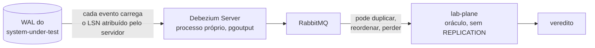

# ADR-0012: O broker no caminho do veredito, e a dispensa que ele exigiu

- **Estado:** Aceito
- **Data:** 2026-08-06
- **Etapa do roadmap:** 1 e 5 — o broker antecipa a etapa 5, por decisão explícita de
  estudo.
- **Relacionado:** Depende do
  [ADR-0010](0010-a-fronteira-de-schema-e-o-cdc-como-fonte-do-veredito.md), que deixou o
  mecanismo de transporte entre o WAL e o oráculo como decisão própria.

## Contexto

O [ADR-0010](0010-a-fronteira-de-schema-e-o-cdc-como-fonte-do-veredito.md) fixou que o
oráculo do `lab-plane` lê o WAL do `system-under-test` por replicação lógica, e não faz
`SELECT` cruzado, na
[seção `Decisão`](0010-a-fronteira-de-schema-e-o-cdc-como-fonte-do-veredito.md#decisão)
daquele ADR. O diagrama de lá liga o WAL ao oráculo por uma aresta rotulada
`replicação lógica · transporte no ADR-0012`: ele não registra consumo direto nem
qualquer outro desenho, e delega o mecanismo — conector, broker, filtro por execução —
a esta decisão, na
[seção `Neutras`](0010-a-fronteira-de-schema-e-o-cdc-como-fonte-do-veredito.md#neutras).

Os pré-requisitos do CDC existem só no contêiner de desenvolvimento, que existe para
reproduzir a Camada 6 na máquina de quem desenvolve e nunca para ser entregue
(`compose.yaml:1-3`); na Camada 6, nenhum foi conferido. `wal_level=logical` está no
comando do `postgres` (`compose.yaml:14-20`), e `REPLICATION` já está no papel
`cdc_connector` (`local/postgres-init.sql:20-24`), dedicado ao conector — não ao
`lab-plane`, que esta decisão tira da leitura direta do WAL. **Nem o broker nem o
conector de CDC existem na árvore hoje.** O `compose.yaml` sobe cinco serviços —
`postgres`, `lab-plane`, `lab-journal`, `system-under-test` e `frontend` — e nenhum
deles é broker nem conector (`compose.yaml:9-100`).

A [raiz do `AGENTS.md`](../../AGENTS.md#regras-estruturais-que-valem-sempre) fixa que
nenhuma tecnologia entra por estar disponível: cada uma entra quando um experimento não
puder ser executado sem ela.

## Problema

- O oráculo precisa de um transporte entre o WAL e o `lab-plane`; o ADR-0010 remeteu o
  transporte a esta decisão, apontando `E-12`, `E-28` e `E-29` como origem da escolha.
- Um instrumento que transporta o próprio veredito por um broker corre o risco de
  sofrer os mesmos fenômenos que estuda, sem distinguir achado de artefato.
- O broker é reservado para a etapa 5. Pô-lo no caminho do veredito hoje antecipa essa
  etapa, e a regra de tecnologia do `AGENTS.md` proíbe entrada por conveniência.

## Decisão

O **Debezium Server**, em processo próprio — e não como biblioteca embarcada no
`lab-plane` —, lê o WAL do `system-under-test` pelo plugin **`pgoutput`** e publica os
eventos no **RabbitMQ**, o broker que o
[roadmap incremental](../plano-do-laboratorio.md#5-roadmap-incremental) reserva para a
etapa 5; o `lab-plane` consome de lá. O broker roda como **instância única**.



Todo evento que atravessa esse caminho DEVE preservar o LSN que o servidor PostgreSQL
lhe atribuiu antes de qualquer transporte existir. O `lab-plane` DEVE usar esse LSN
para ordenar, desduplicar e detectar buraco na sequência antes de calcular o veredito.

O filtro por execução acontece **no consumidor**, dentro do `lab-plane`, e não no
broker. O consumidor DEVE contar todo evento que descarta. Um evento descartado cujo
discriminador pertence a uma execução já concluída é higiene, e não invalida nada; um
evento cujo discriminador pertence a uma execução **ainda ativa** DEVE invalidar essa
execução, porque outra escrita fora do alcance do escalonador determinístico corrompeu
a intercalação declarada. Distinguir os dois casos exige saber quais discriminadores
estão ativos; o `lab-plane` DEVE rodar em **réplica única**.

## Justificativa

Uma mensagem de negócio publicada por um sistema não tem identidade natural nem ordem
total: duas publicações do mesmo comando parecem eventos distintos, e a ordem de
chegada é a única ordem que existe. É por isso que um broker no caminho de uma
mensagem de negócio sofre exatamente os fenômenos que o grupo B estuda, sem defesa
nenhuma.

Um evento de CDC é diferente. O LSN é único, monotônico, e o servidor PostgreSQL o
atribui **antes de qualquer transporte existir** — o conector, o broker e o consumidor
só manipulam um valor que já nasceu com identidade e ordem.

| Fenômeno    | O que o LSN permite                                          |
|-------------|--------------------------------------------------------------|
| duplicata   | descartar o evento já visto, pelo LSN                        |
| reordenação | ordenar os eventos pelo LSN antes de calcular o veredito     |
| perda       | detectar o buraco na sequência de LSN e invalidar o veredito |

A terceira linha sustenta a decisão inteira: sem o LSN, um evento perdido vira uma
perda contabilizada a mais, com cara de certo. Com ele, o consumidor sabe que não
sabe — desde que o LSN sobreviva ao transporte inteiro.

O filtro por execução fica no consumidor, e não no broker, porque o broker é a peça
que os experimentos do grupo B sabotam: um filtro dependente dele herdaria o mesmo
modo de falha que o laboratório estuda.

Esse argumento neutraliza a objeção técnica ao broker; não neutraliza a regra de
tecnologia do `AGENTS.md`.

A [matriz de integrações](../architecture/integrations.md#matriz) trata o RabbitMQ como
hipótese da etapa 5; a linha é reescrita como fato no mesmo commit deste ADR:

| Documento                      | Linha | Estava                                  | Passa a ser                  |
|--------------------------------|-------|-----------------------------------------|------------------------------|
| `architecture/integrations.md` | 32    | hipótese: "entra na etapa 5, não antes" | fato: dia zero, por este ADR |

## Consequências

### Positivas

- A fronteira de schema do ADR-0010 permanece sem exceção: o broker recebe e entrega
  eventos de CDC, e nenhum serviço volta a fazer `SELECT` no schema de outro. A
  credencial de `REPLICATION` fica isolada no Debezium Server, fora do processo que
  produz o veredito.
- O veredito ganha defesa contra duplicata, reordenação e perda de mensagem que um
  transporte de mensagem comum não teria, pela propriedade do LSN.

### Negativas

- **Pergunta em aberto, e ela é a mais séria do ADR.** O argumento do LSN pressupõe que
  ele sobrevive ao transporte inteiro, e isso não está provado. O envelope do Debezium
  para PostgreSQL carrega o LSN dentro do bloco `source`, e a transformação
  `ExtractNewRecordState` descarta esse bloco por completo, restando apenas
  `add.fields` como forma de reinserir campos escolhidos:

  ```mermaid
  flowchart LR
      W[("WAL")]
      E["envelope Debezium<br/>source.lsn presente"]
      U["ExtractNewRecordState<br/>descarta o bloco source"]
      S["sink RabbitMQ"]
      C["lab-plane"]
      W --> E
      E -->|" sem unwrap "| S
      E -.->|" com unwrap, sem add.fields "| U
      U -->|" LSN perdido aqui "| S
      S --> C
  ```

  [`E-32`](../fila-de-decisoes.md#e-32-fecha-na-cadeia-inteira-e-o-teste-ganha-uma-segunda-asserção)
  já decidiu a forma do teste: três contêineres — PostgreSQL com `wal_level=logical`
  por comando explícito, Debezium Server e RabbitMQ —, escrevendo e comparando o LSN
  lido com `pg_current_wal_lsn()`. **O teste não existe.** Até existir, o argumento
  repousa sobre uma promessa de terceiro:

  ```mermaid
  flowchart LR
      T["teste de aceitação"]
      PG[("PostgreSQL<br/>wal_level=logical<br/>por comando explícito")]
      DS["Debezium Server"]
      RB["RabbitMQ"]
      T -->|" escreve, e anota<br/>pg_current_wal_lsn() "| PG
      PG --> DS
      DS --> RB
      RB -->|" lê o evento "| T
      T -->|" compara os dois LSN "| T
  ```

- O broker se torna dependência do caminho crítico do veredito: sem ele de pé, o
  `lab-plane` não recebe evento nenhum. É um modo de falha novo, ausente no consumo
  direto.
- A regra do `AGENTS.md` de que nenhuma tecnologia entra por estar disponível foi
  **dispensada, e não satisfeita**: o broker entra por decisão explícita de estudo,
  antecipando a etapa 5
  ([`AGENTS.md`, seção de regras estruturais](../../AGENTS.md#regras-estruturais-que-valem-sempre)).
  **Uma dispensa registrada não é precedente**: a próxima tecnologia proposta precisa
  da mesma justificativa explícita.
- **A instância de broker é a mesma que os experimentos do grupo B sabotam**, e o
  custo foi aceito. Isso abre uma cadeia causal nova, ausente no consumo direto:

  ```mermaid
  flowchart TD
      E["experimento do grupo B<br/>enche o broker"]
      D["Debezium Server<br/>não consegue publicar"]
      S["replication slot<br/>para de avançar"]
      W["WAL retido, sem teto"]
      V["disco do banco<br/>compartilhado do homelab"]
      E --> D --> S --> W --> V
  ```

  No homelab, o PostgreSQL vem da Camada 6, compartilhada com outras cargas
  (`compose.yaml:1-3`), num "banco com vizinhos" que já obriga o relatório de todo
  experimento a registrar isso
  ([`../fila-de-decisoes.md`](../fila-de-decisoes.md#e-5-decidida-contra-a-recomendação-e-o-que-ela-arrasta)).
  Um experimento de fila cheia passa a poder encher o disco desse banco. **Pergunta em
  aberto.** A mitigação natural, `max_slot_wal_keep_size`, é parâmetro de cluster e
  continua sem decisão.
- **A réplica única do `lab-plane` deixa de ser preferência e vira condição** para o
  veredito ser confiável. Com duas réplicas, cada uma vê o backlog da outra, e nenhuma
  sabe dizer qual das duas causas produziu o descarte.
- **Pergunta em aberto**
  ([`E-31`](../fila-de-decisoes.md#e-31-não-fecha-e-o-que-a-impede-é-uma-exigência-que-a-fila-não-enunciava)).
  Onde vive a configuração do Debezium Server não está decidido; até decidir, ele
  passará a existir só no `compose.yaml` de desenvolvimento — o veredito não poderá ser
  produzido no homelab. Rodar no cluster exige mudar o `homelab-infrastructure`, e não
  só este repositório.
- **Pergunta em aberto**
  ([`E-35`](../fila-de-decisoes.md#e-35--onde-o-lab-plane-guarda-quais-execuções-estão-ativas)).
  Onde o `lab-plane` guarda quais discriminadores estão ativos não está decidido. Em
  memória, um reinício apaga a resposta, e a execução seguinte descarta às cegas.
- O `REPLICATION` vai para `cdc_connector` (`local/postgres-init.sql:20-24`), e não
  para o `lab-plane`: mantê-lo lá devolveria a credencial de leitura do WAL ao processo
  que produz o veredito.

| Papel           | `REPLICATION` | Por quê                                          |
|-----------------|---------------|--------------------------------------------------|
| `cdc_connector` | concedido     | só ele lê o WAL, fora do processo do veredito    |
| `sut`           | descartado    | amplia o que a falha da etapa 6 no `sut` alcança |

  Custa um papel a mais: no homelab, é mudança no `homelab-infrastructure`, não só
  neste repositório.

### Neutras

- **Pergunta em aberto**
  ([`E-34`](../fila-de-decisoes.md#e-34--qual-dos-dois-sinks-de-rabbitmq-e-o-que-ele-amarra)).
  Qual mecanismo do RabbitMQ recebe os eventos — a fila clássica sobre AMQP 0-9-1 ou o
  stream com semântica de offset e retenção. A escolha amarra qual fenômeno de
  saturação o grupo B consegue reproduzir, porque uma fila que enche não é a mesma
  coisa que um stream com retenção configurada.

## Trade-offs

- O benefício **o veredito ganha defesa contra duplicata, reordenação e perda pelo
  LSN** foi aceito em troca do custo **o broker vira um modo de falha a mais no
  instrumento, na mesma instância que o grupo B sabota**.
- O benefício **antecipar o estudo do transporte por broker antes da etapa 5** foi
  aceito em troca do custo **a regra de "nenhuma tecnologia entra por estar
  disponível" foi dispensada, e a dispensa fica registrada como não sendo
  precedente**.

## Alternativas consideradas

### Consumo direto do WAL, sem broker no caminho

**Descartada.** Seria a leitura mínima compatível com a fronteira de schema do
ADR-0010: sem intermediário, sem modo de falha adicional e sem dispensar a regra de
tecnologia — mas o ADR-0010 não a registra como desenho seu; ele remeteu o transporte
a esta decisão. Perde porque não expõe o transporte do veredito a duplicata, perda e
reordenação — exatamente os fenômenos que a etapa 5 estuda, e que esta decisão antecipa
de propósito.

### Debezium Embedded, como biblioteca dentro do `lab-plane`

**Descartada.** O argumento a favor é real: um processo a menos para entregar e
operar. Perde porque embarcar o conector poria a credencial de `REPLICATION` no mesmo
processo que produz o veredito — a regra de fronteira do ADR-0010, um nível abaixo.

### Debezium clássico, sobre Kafka Connect

**Descartada.** Traria consigo um sistema de orquestração de conectores inteiro que
nenhuma decisão pediu, com o próprio ciclo de vida e armazenamento de `offset` —
tecnologia entrando por estar disponível dentro do ecossistema Debezium, não porque um
experimento a exija.

### `wal2json`, como plugin de decodificação lógica

**Descartada.** O argumento a favor é um formato de saída em JSON legível, contra o
binário do `pgoutput`. Perde porque é extensão: instalá-la significa alterar o
PostgreSQL compartilhado do homelab. O `pgoutput` é embutido desde a versão 10, e não
exige instalar extensão. **Pergunta em aberto.** `wal_level=logical` é exigido pelas
duas, e só está confirmado no contêiner de desenvolvimento (`compose.yaml:16`);
habilitá-lo na Camada 6, se preciso, toca o banco compartilhado de qualquer forma — o
que ainda separa as duas candidatas é só a instalação da extensão.

## Quando esta decisão deixa de valer

Revise esta decisão se um teste demonstrar que o LSN não sobrevive ao transporte entre
o WAL e o consumidor no `lab-plane`: nesse caso o argumento que torna a escolha
defensável deixa de valer, e o consumo direto passa a ser a única saída sem exceção à
regra de schema do ADR-0010.

Revise também quando a etapa 5 chegar: um experimento que sabote o broker vai
invalidar o veredito de toda execução, e não apenas de algumas, porque o objeto de
estudo e o instrumento competem pela mesma peça — e a decisão de instância única
precisará ser reaberta.

## Patches aplicados

Nenhum patch aplicado.

O regime de patch está em [`README.md`](README.md#a-revogação-da-imutabilidade-decidida-em-2026-08-07).
Um patch conserta citação, caminho ou erro material; ele NÃO DEVE alterar a decisão nem o
argumento que a sustentava.
