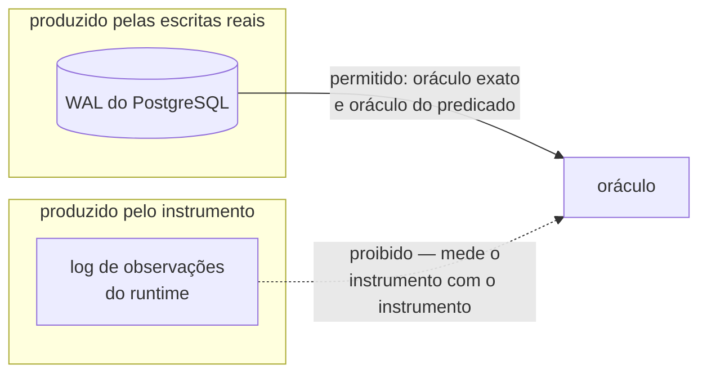
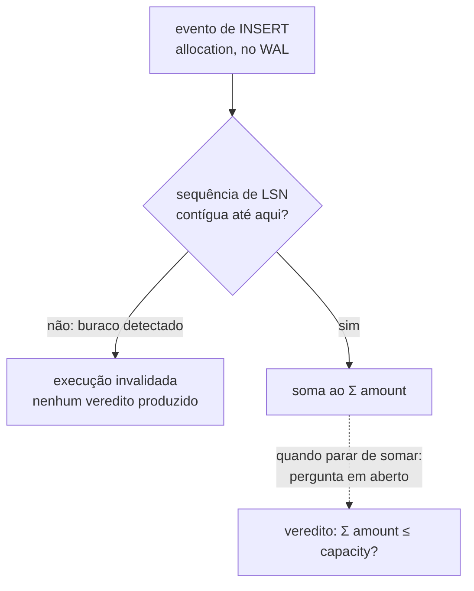

# ADR-0013: A proveniência da fonte como critério da proibição do oráculo

- **Estado:** Aceito
- **Data:** 2026-08-09
- **Etapa do roadmap:** 1 e 3
- **Relacionado:** subsume o
  [ADR-0002](0002-o-dominio-minimo-e-os-dois-oraculos.md#o-oráculo-lê-o-banco-e-não-deve-ler-o-log-de-observações),
  na seção "O oráculo lê o banco, e NÃO DEVE ler o log de observações": a regra ali
  continua valendo sem mudança para o log de observações do runtime, e esta decisão
  recorta o alcance da proibição para critério de proveniência. Depende também do
  [ADR-0010](0010-a-fronteira-de-schema-e-o-cdc-como-fonte-do-veredito.md), que aplicou o
  WAL ao oráculo exato e deixou a fonte do predicado sem decisão, na linha
  [`E-37`](../fila-de-decisoes.md#e-37--o-que-a-proibição-de-derivar-estado-de-stream-alcança).
  Usa a detecção de buraco de LSN do
  [ADR-0012](0012-o-broker-no-caminho-do-veredito-e-a-dispensa-que-ele-exigiu.md#decisão).

- **Última atualização:** 2026-08-10, pelo patch registrado no fim deste arquivo.

## Contexto

O [ADR-0002](0002-o-dominio-minimo-e-os-dois-oraculos.md#o-oráculo-lê-o-banco-e-não-deve-ler-o-log-de-observações)
proíbe os dois oráculos de derivar o estado final "do log de observações do runtime". O
[ADR-0010](0010-a-fronteira-de-schema-e-o-cdc-como-fonte-do-veredito.md#decisão) aplicou
essa regra ao oráculo exato: `value_initial` e `value_final` deixaram de vir de um
`SELECT` cruzado e passaram a vir do WAL, por replicação lógica. O mesmo ADR, na seção
[`Negativas`](0010-a-fronteira-de-schema-e-o-cdc-como-fonte-do-veredito.md#negativas),
registrou que a fonte do oráculo do predicado — `Σ amount` — **ficou sem decisão**, na
linha [`E-37`](../fila-de-decisoes.md#e-37--o-que-a-proibição-de-derivar-estado-de-stream-alcança)
da fila. Até este ADR, o
[card de proteção inerte](../features/deteccao-de-protecao-inerte/feature-card.md#regras-de-negócio)
carregava a mesma lacuna nas regras `R3` e `R5`, e o E5 não rodava enquanto ela não
fechasse.

A apuração de 2026-08-09, na segunda metade de
[`E-37`](../fila-de-decisoes.md#e-37--o-que-a-proibição-de-derivar-estado-de-stream-alcança),
achou que o enunciado original da linha descrevia a proibição errada — como proibição de
**reconstruir um total a partir de uma sequência**, quando a letra do ADR nomeia uma
**fonte**: "Nenhum dos dois deriva o estado final do log de observações do runtime". O
WAL não é escrito pelo Lab Plane; é escrito pelo servidor PostgreSQL a partir das
escritas reais do sistema medido.

## Problema

- A proibição do ADR-0002 nomeia uma fonte ("log de observações do runtime"). Se ela
  alcança também o WAL, lido por replicação lógica, não estava decidido.
- O oráculo exato lê o **último** evento de `resource.value`, sem somar. O oráculo do
  predicado precisaria **somar** eventos de `INSERT` para obter `Σ amount`. As duas
  operações têm sensibilidades diferentes a evento perdido.
- O E5 dependia inteiramente desta resposta: sem fonte para `Σ amount`, `R3`/`R5` do card
  de proteção inerte não tinham mecanismo, e o experimento não rodava.

## Decisão

A proibição do [ADR-0002](0002-o-dominio-minimo-e-os-dois-oraculos.md#o-oráculo-lê-o-banco-e-não-deve-ler-o-log-de-observações)
alcança **fonte produzida pelo instrumento**, e nada além disso. O critério é de
**proveniência**, e não de operação: o que está proibido é alimentar o oráculo com o log
de observações do runtime, porque isso mede o instrumento com o instrumento.

Três consequências diretas:

1. O WAL do PostgreSQL é **fonte legítima** para os dois oráculos. Ele é escrito pelo
   servidor a partir das escritas reais do sistema medido, e não pelo Lab Plane.
2. O oráculo do predicado obtém `Σ amount` do WAL, somando os eventos de `INSERT` de
   `allocation`. Somar eventos não é o que a proibição descreve.
3. O oráculo **DEVE** conferir a contiguidade da sequência de LSN antes de calcular a
   soma. Um buraco na sequência **DEVE** invalidar a execução, e **NÃO DEVE** produzir
   veredito. Esta guarda é parte do oráculo, e não acessório: sem ela a decisão não vale.

## Justificativa

A letra da proibição nomeia uma fonte, não uma operação: "Nenhum dos dois deriva o
estado final do log de observações do runtime"
([ADR-0002, O oráculo lê o banco](0002-o-dominio-minimo-e-os-dois-oraculos.md#o-oráculo-lê-o-banco-e-não-deve-ler-o-log-de-observações)).
O critério que a sustenta está no mesmo ADR: "o banco é o sistema sob teste, e é o único
lugar onde a resposta é independente do instrumento"
([ADR-0002, Justificativa](0002-o-dominio-minimo-e-os-dois-oraculos.md#justificativa)). O
WAL satisfaz esse critério pela mesma razão que o `SELECT` direto satisfazia antes do
ADR-0010: quem o escreve é o servidor, a partir da transação real, e não o Lab Plane. A
[alternativa E daquele ADR](0002-o-dominio-minimo-e-os-dois-oraculos.md#alternativa-e--o-oráculo-derivado-do-log-de-observações)
foi descartada porque "o oráculo passaria a medir o instrumento com o instrumento" — risco
que o WAL, por proveniência, não carrega.

Os dois oráculos têm sensibilidades diferentes a perda de evento, e isso sustenta a
guarda do item 3. Ler o último valor exige apenas **recência**, já coberta pela espera
do LSN do commit final decidida em
[`O19`](arquivo/proposta-2026-08-03/decisoes-pendentes.md#o19-fecha-o-oráculo-espera-o-cdc-com-limite-declarado).
Somar exige **completude**: um `INSERT` perdido no transporte reduz `Σ amount`, e o
veredito sairia verde sobre um banco que violou o limite — falso negativo silencioso. A
recência não sofre disso, porque um evento perdido no meio do stream não muda qual foi o
**último** valor visto. A guarda de contiguidade de LSN, que o
[ADR-0012](0012-o-broker-no-caminho-do-veredito-e-a-dispensa-que-ele-exigiu.md#decisão)
já usa para detectar buraco antes de calcular o veredito, repõe a completude que o
`SELECT sum` garantia pela visão transacional da consulta — a mesma completude que o
item 3 de [`## Decisão`](#decisão) deste ADR exige antes de somar.

## Consequências

### Positivas

- O [E5](../features/deteccao-de-protecao-inerte/feature-card.md) volta a ter oráculo, e
  `R3`/`R5` do
  [card de proteção inerte](../features/deteccao-de-protecao-inerte/feature-card.md#regras-de-negócio)
  ganham mecanismo.
- Um único critério de permissão de fonte — proveniência —, sem distinção artificial
  entre ler o último valor e somar um conjunto.
- Nenhuma exceção nova à fronteira de schema do ADR-0010.

### Negativas

- A completude do stream passa a ser responsabilidade do instrumento, e não mais do
  PostgreSQL.
- **Pergunta em aberto.** Se a execução invalidada por buraco de LSN recebe o rótulo
  **fonte atrasada** — estabelecido no
  [glossário](../CONTEXT.md#os-dois-rótulos-do-instrumento-decididos-em-2026-08-05) para
  o estouro do limite de espera — ou um rótulo distinto, não foi decidido
  ([`E-37`, fecho](../fila-de-decisoes.md#e-37-fecha-na-proveniência-e-a-contiguidade-deixa-de-ser-opcional)).
  São falhas diferentes, e confundi-las num relatório afirma duas coisas com uma só
  palavra.
- **Pergunta em aberto.** Onde a conferência de contiguidade vive no código não foi
  decidido
  ([`E-37`, fecho](../fila-de-decisoes.md#e-37-fecha-na-proveniência-e-a-contiguidade-deixa-de-ser-opcional)).
  Não há código de oráculo na árvore hoje.
- **Pergunta em aberto.** Se a espera pelo LSN do commit final, decidida em `O19` para o
  oráculo exato, alcança também o oráculo do predicado não foi decidido
  ([`E-37`, fecho](../fila-de-decisoes.md#e-37-fecha-na-proveniência-e-a-contiguidade-deixa-de-ser-opcional)).
  Sem condição de término para a soma, `Σ amount` PODE ser lido cedo demais e sair
  parcial — o mesmo falso negativo que a guarda de contiguidade evita, por outra porta.
- A guarda de contiguidade de LSN pressupõe que o LSN sobrevive ao transporte inteiro,
  entre o WAL e o oráculo. Essa premissa está registrada como a pergunta em aberto mais
  séria do
  [ADR-0012](0012-o-broker-no-caminho-do-veredito-e-a-dispensa-que-ele-exigiu.md#negativas):
  o teste que a provaria não existe. Esta decisão herda essa pendência, porque o item 3
  da `## Decisão` depende inteiramente da guarda.

### Neutras

- O oráculo exato não muda: `value_initial` e `value_final` continuam vindo do `INSERT`
  do estado inicial e do último evento de `resource.value`, como o
  [ADR-0010](0010-a-fronteira-de-schema-e-o-cdc-como-fonte-do-veredito.md#decisão) já
  decidiu.

## Trade-offs

- O benefício **o E5 fica executável, com fonte única e sem exceção à fronteira de
  schema** foi aceito em troca do custo **a completude do stream passa a ser
  responsabilidade do instrumento, garantida pela guarda de contiguidade, e não mais pela
  visão transacional do PostgreSQL**.

## Alternativas consideradas

### Proveniência sem guarda obrigatória

Contiguidade de LSN vira recomendação, e não condição.

**Descartada.** Deixa vivo um falso negativo silencioso: um `INSERT` perdido no
transporte reduz `Σ amount`, e o veredito sai verde sobre um banco que violou o limite.
Num instrumento de medida, um número errado com aparência de certo é o pior resultado
possível.

### Toda reconstrução de estado a partir de sequência de eventos é proibida

A proibição do ADR-0002 alcança qualquer soma sobre um stream, e não apenas o log de
observações.

**Descartada.** Deixaria o E5 sem oráculo por tempo indeterminado: o
[ADR-0010](0010-a-fronteira-de-schema-e-o-cdc-como-fonte-do-veredito.md#decisão) já
proibiu o `SELECT` cruzado de schema, e não sobraria fonte para `Σ amount`. `R3`/`R5` do
[card de proteção inerte](../features/deteccao-de-protecao-inerte/feature-card.md#regras-de-negócio)
ficariam sem mecanismo.

### O sistema medido materializar a soma numa coluna

`allocate` passaria a manter `Σ amount` numa coluna do próprio `Resource`, atualizada a
cada `INSERT`.

**Descartada.** Não é viável: contraria `R1` do
[card de proteção inerte](../features/deteccao-de-protecao-inerte/feature-card.md#regras-de-negócio)
e a seção [`## Decisão`](0002-o-dominio-minimo-e-os-dois-oraculos.md#decisão) do
ADR-0002, que fixam `Σ amount` como verdade derivada, não como contador na linha do
recurso.

## Quando esta decisão deixa de valer

Reveja esta decisão se a guarda de contiguidade invalidar a maioria das execuções do E5,
e não apenas uma minoria isolada. Isso indicaria que buraco de LSN é a norma do
transporte, e não a exceção, reabrindo a discussão que o custo desta decisão nomeia.

## Patches aplicados

O regime de patch está em [`README.md`](README.md#a-revogação-da-imutabilidade-decidida-em-2026-08-07).
Um patch conserta citação, caminho ou erro material; ele NÃO DEVE alterar a decisão nem o
argumento que a sustentava.

| Data       | Seção do corpo                     | O que mudou                                                                                                                                                                                                                                                                                                                                                                           | Por quê                                                                                                                                                                                                                                                                                                                                                                                                                                                                                                                                                    |
|------------|------------------------------------|---------------------------------------------------------------------------------------------------------------------------------------------------------------------------------------------------------------------------------------------------------------------------------------------------------------------------------------------------------------------------------------|------------------------------------------------------------------------------------------------------------------------------------------------------------------------------------------------------------------------------------------------------------------------------------------------------------------------------------------------------------------------------------------------------------------------------------------------------------------------------------------------------------------------------------------------------------|
| 2026-08-10 | `## Justificativa`                 | a citação ao fecho de `E-37` na fila virou referência ao item 3 de `## Decisão` deste próprio ADR                                                                                                                                                                                                                                                                                     | documentos estáveis deixam de citar a fila de decisões, que cresce, funde e poda linha a linha; o argumento e a decisão não mudaram                                                                                                                                                                                                                                                                                                                                                                                                                        |
| 2026-08-14 | `## Contexto` e `## Consequências` | os identificadores da fórmula do oráculo exato passam a ser grafados em inglês, sem que nenhum número, relação ou argumento mude: `perdidas` vira `lost_operations`, `value_inicial` vira `value_initial` e `sucessos` vira `successes`; `value_final` já se grafava assim. As palavras "atualizações perdidas" e "operações perdidas", que são prosa e não identificador, permanecem | decidido pela pessoa em 2026-08-14, para que a grafia case com as propostas de modelo de dados e com a regra de que todo identificador deste laboratório é escrito em inglês, de `D-ARQ-06`. A grafia portuguesa sobrevive em `adr/arquivo/`, que nunca é editado, e por isso a uniformidade não é alcançável. **A alteração excede o limite ordinário do patch**, que NÃO DEVE alcançar `## Decisão`, a justificativa, a alternativa descartada nem a consequência — ela foi autorizada explicitamente, e fica registrada aqui em vez de ficar sem rastro |
