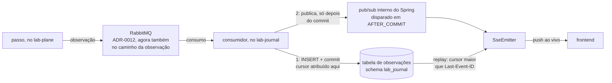
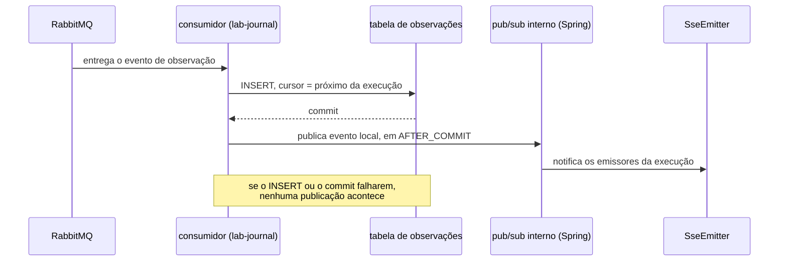
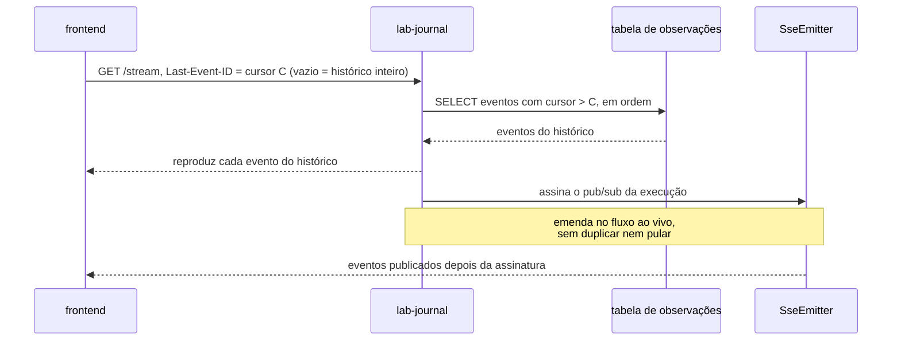

# ADR-0014: O broker na travessia da observação, e o cursor monotônico do replay

- **Estado:** Aceito
- **Data:** 2026-08-10
- **Etapa do roadmap:** 1 — reaproveita o broker que o ADR-0012 já trouxe ao dia zero.
- **Relacionado:** emenda o [ADR-0007](0007-o-log-de-observacoes-forma-ordem-e-onde-vive.md),
  o [ADR-0010](0010-a-fronteira-de-schema-e-o-cdc-como-fonte-do-veredito.md) e o
  [ADR-0011](0011-a-topologia-de-servicos-e-o-caderno-de-laboratorio-fora-do-git.md), que
  recebem `Última atualização` e `Alterado por` no mesmo commit. Depende do
  [ADR-0012](0012-o-broker-no-caminho-do-veredito-e-a-dispensa-que-ele-exigiu.md), dono do
  RabbitMQ que esta decisão passa a reutilizar.

## Contexto

O [ADR-0010](0010-a-fronteira-de-schema-e-o-cdc-como-fonte-do-veredito.md#decisão) exige
que as observações atravessem "ao vivo, evento por evento", sem fixar **como**; as
[negativas](0010-a-fronteira-de-schema-e-o-cdc-como-fonte-do-veredito.md#negativas)
nomeiam buffer local com remetente próprio como saída nunca escolhida.

O [ADR-0007](0007-o-log-de-observacoes-forma-ordem-e-onde-vive.md#a-forma-de-um-evento)
fixa a forma de um evento — tentativa, worker, fronteira, tipo, instante de parede,
fatos brutos — e a
[ordem garantida](0007-o-log-de-observacoes-forma-ordem-e-onde-vive.md#a-ordem-garantida):
só o par `restrito = verdadeiro` tem precedência causal.

O [ADR-0008](0008-os-dois-planos-em-processos-separados.md#negativas) conta a travessia
de rede na medida, e o E1 emite entre 900 e 1500 observações por execução. O
[ADR-0011](0011-a-topologia-de-servicos-e-o-caderno-de-laboratorio-fora-do-git.md#comando-no-lab-plane-leitura-no-lab-journal-sem-bff)
decidiu que o frontend lê histórico e streaming do `lab-journal`, sem BFF, sem decidir o
transporte até lá.

O [ADR-0012](0012-o-broker-no-caminho-do-veredito-e-a-dispensa-que-ele-exigiu.md#decisão)
pôs o RabbitMQ no caminho do veredito, consumindo CDC com LSN — identidade que mensagem
de negócio comum não tem. O
[`AGENTS.md`](../../AGENTS.md#regras-estruturais-que-valem-sempre) proíbe tecnologia por
conveniência, e a dispensa concedida ao ADR-0012 "não é precedente: a próxima também
precisa ser explícita".

[`Q-0004-3`](../questions/Q-0004-3.md), pendente, registra que nenhum documento diz qual
relógio o log usa, se é monotônico, nem a resolução.

## Problema

**Como o evento de observação sai do passo, chega à tela em tempo real, e ainda permite
reconstruir o histórico inteiro de uma execução — sem duplicar mecanismo, sem relógio não
provado, e sem que uma queda proposital do `lab-plane` apague o que já ocorreu?**

Forças em conflito:

- O ADR-0010 exige travessia ao vivo, evento por evento, sem fixar o transporte.
- A travessia síncrona de 900 a 1500 observações por execução soma-se à janela medida.
- A etapa 6 mata o processo do `lab-plane` de propósito; um buffer local não esvaziado
  desaparece com ele.
- O `lab-journal` precisa notificar ao vivo e, na reconexão, responder sem repetir nem
  pular evento.
- O critério de ordem do replay não pode se apoiar num relógio não documentado —
  `Q-0004-3`.
- Reaproveitar o broker exige a mesma dispensa explícita que ele já exigiu uma vez.

## Decisão

### O evento sai do passo pelo broker

O evento de observação DEVE sair do passo pelo **broker** — o RabbitMQ do
[ADR-0012](0012-o-broker-no-caminho-do-veredito-e-a-dispensa-que-ele-exigiu.md#decisão),
que hoje serve só ao caminho do veredito e passa a servir também ao da observação.
Nenhum transporte novo entra na árvore.

### No `lab-journal`, a ordem é serial: persiste, depois emite

O consumidor DEVE persistir o evento — `INSERT` e commit — **antes** de emiti-lo.
Persistência e emissão NÃO DEVEM acontecer em paralelo.

### O push ao vivo é o pub/sub interno do Spring, em `AFTER_COMMIT`

O `lab-journal` DEVE notificar os clientes conectados pelo pub/sub interno do Spring,
disparado em `AFTER_COMMIT`. Uma persistência que falhar simplesmente NÃO publica.

### O replay por cursor é o único mecanismo, com ou sem histórico completo

O stream SSE DEVE aceitar `Last-Event-ID`: reproduz os eventos com cursor maior que o
declarado, na ordem do cursor, e emenda no fluxo ao vivo a partir daí. **Recuperar todo o
histórico é o mesmo mecanismo**, com cursor vazio — a plataforma NÃO DEVE expor um
segundo endpoint para isso.

### O cursor é campo próprio, monotônico por execução

O cursor DEVE ser um campo próprio do registro persistido no `lab-journal`, monotônico
por execução, e NÃO DEVE ser um timestamp.

### Dois instantes, nenhum deles é ordem

O registro de um evento DEVE carregar dois instantes: o de **ocorrência**, atribuído no
`lab-plane` — o "instante de parede" do
[ADR-0007](0007-o-log-de-observacoes-forma-ordem-e-onde-vive.md#a-forma-de-um-evento) —,
e o de **persistência**, atribuído no `lab-journal`. A diferença mede o custo da
travessia. **O cursor NÃO DEVE ser lido como precedência causal**: é ordem de chegada, e
recebe o mesmo tratamento que o ADR-0007 já dá ao instante de parede fora dos pares
`restrito = verdadeiro` — metadado de exibição, não prova de ordem.

## Justificativa

**Por que o broker.** A travessia síncrona mantém as 900 a 1500 observações do E1 dentro
da janela medida. O buffer local sem broker falha na etapa que o laboratório existe para
estudar: a etapa 6 mata o `lab-plane` de propósito, e um buffer não esvaziado desaparece
com ele — o instrumento perdendo dado em silêncio, a confusão que a separação de planos
existe para impedir
([ADR-0008, Justificativa](0008-os-dois-planos-em-processos-separados.md#justificativa)).
O broker sobrevive à queda do `lab-plane` por construção, e é a única das três opções sem
esse modo de falha; por isso a dispensa já concedida ao ADR-0012 é concedida de novo
aqui, explicitamente.

**Por que persistir antes de emitir.** Emitir em paralelo é dual write, grupo C
([ADR-0009, Decisão](0009-a-classificacao-do-dual-write-e-a-regiao-de-pacote.md#decisão)),
reproduzido **dentro do instrumento**. Persistir antes elimina o estado em que a tela
mostra um evento que o banco não tem — e por isso a não resiliência do pub/sub interno do
Spring não é risco aqui: um push perdido é recuperado pelo mesmo replay que serve ao
histórico; no arranjo paralelo, o mesmo pub/sub falho seria fatal. Pela mesma razão,
histórico e replay usam um mecanismo só: dois algoritmos para "cursor maior que X"
divergiriam na fronteira entre o persistido e o que ainda chega.

**Por que o cursor não é timestamp, nem precedência.** `Q-0004-3` registra que nenhum
documento diz qual relógio o log usa, se é monotônico, nem sua resolução; duas
observações que colidam dentro dela empatariam, pulando ou repetindo entrada no replay. O
[`AGENTS.md`](../../AGENTS.md#regras-estruturais-que-valem-sempre) reforça a desconfiança
sobre ler o relógio direto, mas sua letra nomeia três papéis — veredito, escalonamento,
identidade da semente — e o cursor de replay não é nenhum deles; o argumento aqui é
inteiramente o de `Q-0004-3`. O cursor mede **chegada**, não **ocorrência**: tentativas
concorrentes podem chegar ao broker fora da ordem em que ocorreram, e tratá-lo como
precedência repetiria o erro que o ADR-0007 já evitou para o instante de parede.

**Por que emenda, e não substituição.** Nenhuma das duas regras alteradas dá título ao
ADR de origem, nem é a decisão principal dele. A do ADR-0010 continua exigindo travessia
ao vivo — muda só o transporte. A do ADR-0007 continua com os seis campos originais — o
registro ganha dois ao chegar no `lab-journal`. O precedente é o dos ADRs 0009, 0010 e
0011, que emendaram regra dentro de `## Decisão` pelo mesmo critério e seguem `Aceito`.

## Consequências

### Positivas

- A travessia de 900 a 1500 observações sai do caminho bloqueante, e nenhuma tecnologia
  nova entra na árvore: o RabbitMQ já existe pelo ADR-0012.
- Um único mecanismo — replay por cursor — serve ao histórico completo e à reconexão, e
  a ordem persiste-depois-emite elimina o dual write dentro do próprio instrumento.
- O cursor não herda a incerteza de um relógio cuja monotonicidade nunca foi provada.

### Negativas

- O broker vira dependência também da observação: sem ele de pé, a tela para de
  atualizar.
- **Pergunta em aberto.** De onde a contagem de coincidências do
  [ADR-0004](0004-o-estatuto-da-barreira-e-o-diagnostico-da-nao-ocorrencia.md#a-plataforma-conta-coincidências)
  lê os dados — deste log, ou de estrutura própria. Se ler o log e uma observação se
  perder em trânsito, a contagem cai a zero e a ordem 3 da
  [classificação do zero](0004-o-estatuto-da-barreira-e-o-diagnostico-da-nao-ocorrencia.md#o-zero-é-classificado-e-a-classificação-tem-quatro-valores)
  produziria `protegido` sobre banco violado — falso negativo silencioso.
- **Pergunta em aberto.** De onde vem o instante de ocorrência, e se é monotônico —
  `Q-0004-3`, que esta decisão não fecha.
- **Pergunta em aberto.** A forma concreta do registro — coluna, tipo, migração — não foi
  decidida aqui.
- **Pergunta em aberto.** A contrapressão entre broker e `lab-journal`, para o consumidor
  lento, não foi decidida.
- O broker PODE duplicar, reordenar ou perder mensagem, por diagrama do próprio
  [ADR-0012](0012-o-broker-no-caminho-do-veredito-e-a-dispensa-que-ele-exigiu.md#decisão).
  A observação não carrega LSN, e nenhuma deduplicação foi decidida.

### Neutras

- O `lab-journal` mantém schema próprio, sem acesso direto de outro serviço — a
  fronteira do [ADR-0010](0010-a-fronteira-de-schema-e-o-cdc-como-fonte-do-veredito.md#decisão)
  não muda.

## Trade-offs

- O benefício **a travessia de 900 a 1500 observações sai do caminho síncrono** foi
  aceito em troca do custo **uma segunda dispensa da regra de tecnologia, e o broker vira
  ponto único de falha também para a observação**.
- O benefício **um único mecanismo serve ao histórico completo e ao replay incremental,
  e a ordem persiste-depois-emite elimina o dual write** foi aceito em troca do custo **a
  contrapressão entre broker e `lab-journal`, e o cursor apontando para evento
  inexistente, seguem sem resposta decidida**.
- O benefício **o cursor não depende de relógio não provado** foi aceito em troca do
  custo **a forma concreta do registro ainda não existe**.

## Alternativas consideradas

### Ao vivo bloqueante, como o ADR-0010 deixava implícito

**Descartada.** É o que já valia: a observação atravessa direto, sem transporte
declarado. Perde por manter as 900 a 1500 travessias do E1 dentro da janela medida
([ADR-0008, Negativas](0008-os-dois-planos-em-processos-separados.md#negativas)).

### Buffer local volátil, com um remetente por worker

**Descartada.** A favor: nenhum processo novo. Perde pelo argumento da Justificativa: o
buraco que a etapa 6 abre não é sinalizado — a saída que o
[ADR-0010, Negativas](0010-a-fronteira-de-schema-e-o-cdc-como-fonte-do-veredito.md#negativas)
já registrava como não escolhida.

### SSE e persistência em paralelo

**Descartada.** A favor: a tela atualizaria sem esperar o commit. Perde pelo mesmo
argumento do dual write, grupo C
([ADR-0009, Decisão](0009-a-classificacao-do-dual-write-e-a-regiao-de-pacote.md#decisão)),
dado na Justificativa.

## Quando esta decisão deixa de valer

Revise se o `lab-journal` passar a rodar em mais de uma instância: um `SseEmitter` de uma
instância não vê o evento publicado pelo pub/sub interno de outra, que é local ao
processo. O replay por cursor cobre a lacuna só na reconexão, com atraso.

Revise também se a contrapressão do broker produzir descarte de observação sob carga: o
cursor deixaria de provar completude, exigindo um equivalente à guarda de contiguidade
que o
[ADR-0013](0013-a-proveniencia-da-fonte-como-criterio-da-proibicao-do-oraculo.md#decisão)
já exige para o WAL.

## O que este ADR desfaz fora de si

Esta decisão torna desatualizados os arquivos abaixo, fora do próprio corpo.

| Documento                                                                                                                                                                                             | O que muda                                                                                                                     |
|--------------------------------------------------------------------------------------------------------------------------------------------------------------------------------------------------------|----------------------------------------------------------------------------------------------------------------------------------|
| [ADR-0007, A forma de um evento](0007-o-log-de-observacoes-forma-ordem-e-onde-vive.md#a-forma-de-um-evento)                                                                                             | ganha o cursor e os dois instantes como campos do evento; emenda registrada no cabeçalho                                         |
| [ADR-0010, Decisão](0010-a-fronteira-de-schema-e-o-cdc-como-fonte-do-veredito.md#decisão)                                                                                                                | a regra "ao vivo, evento por evento" ganha mecanismo — o broker; emenda registrada no cabeçalho                                   |
| [ADR-0011, Comando no `lab-plane`...](0011-a-topologia-de-servicos-e-o-caderno-de-laboratorio-fora-do-git.md#comando-no-lab-plane-leitura-no-lab-journal-sem-bff)                                       | a aresta direta `LP -->\|" observações "\| LJ` do diagrama passa pelo broker; emenda registrada no cabeçalho                        |
| [`integrations.md`, Matriz](../architecture/integrations.md#matriz)                                                                                                                                      | a linha `lab-plane` → `lab-journal` e as duas linhas do RabbitMQ passam a descrever este caminho; `Q-INT-2` passa a resolvida     |
| [feature-card.md, R12](../features/observacao-passo-a-passo/feature-card.md#regras-de-negócio)                                                                                                          | regra `pendente` de Feature Card, não ADR aceito; nomeia o broker e troca a evidência para este ADR                              |

## Patches aplicados

Nenhum patch aplicado.

O regime de patch está em [`README.md`](README.md#a-revogação-da-imutabilidade-decidida-em-2026-08-07).
Um patch conserta citação, caminho ou erro material; ele NÃO DEVE alterar a decisão nem o
argumento que a sustentava.
