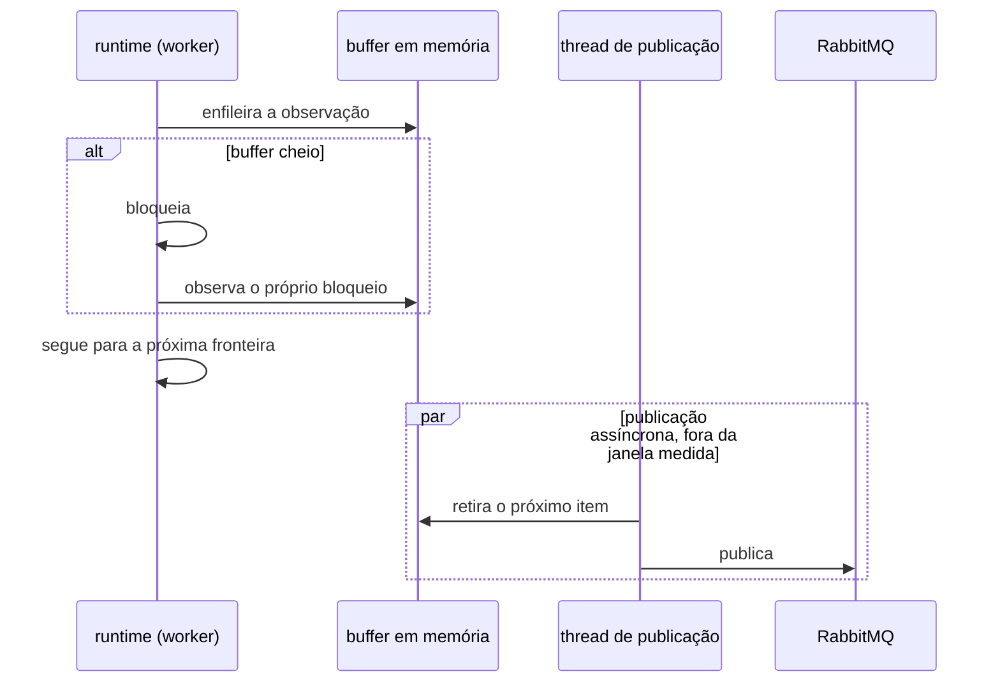
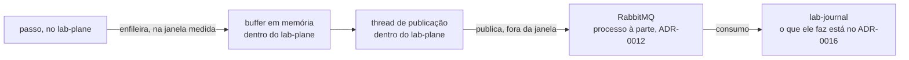

# ADR-0014: A travessia da observação — o broker, o buffer e o bloqueio registrado

- **Estado:** Aceito
- **Data:** 2026-08-10
- **Etapa do roadmap:** 1 — reaproveita o broker que o ADR-0012 já trouxe ao dia zero.
- **Relacionado:** emenda o
  [ADR-0007](0007-o-log-de-observacoes-forma-ordem-e-onde-vive.md) — a seção "Onde o log
  vive" —, o [ADR-0010](0010-a-fronteira-de-schema-e-o-cdc-como-fonte-do-veredito.md) e o
  [ADR-0011](0011-a-topologia-de-servicos-e-o-caderno-de-laboratorio-fora-do-git.md), que
  recebem `Última atualização` e `Alterado por` no mesmo commit. Depende do
  [ADR-0012](0012-o-broker-no-caminho-do-veredito-e-a-dispensa-que-ele-exigiu.md), dono do
  RabbitMQ que esta decisão passa a reutilizar. O que o `lab-journal` faz com o evento
  depois de recebê-lo — persistir, emitir, e o replay por cursor — é decisão irmã, no
  [ADR-0016](0016-o-streaming-e-o-replay-do-log-de-observacoes.md): as duas nasceram da
  mesma escolha, em 2026-08-10, e foram divididas em dois artefatos em 2026-08-11.
- **Nome do arquivo:** ele mantém o sufixo `-e-o-cursor-monotonico-do-replay`, que
  descrevia a decisão antes da divisão. O título acima é o que vale, e o cursor está no
  ADR-0016. Renomear o arquivo quebraria **mais de trinta ocorrências do nome, em treze
  arquivos** — ordem de grandeza, e nunca contagem: **este campo não fixa valor
  pontual**, porque o valor muda a cada citação escrita ou apagada, inclusive por esta
  edição, e um número exato aqui envelhece no commit seguinte sem avisar ninguém. Meça
  antes de confiar, com os dois comandos abaixo, e conte a **árvore de trabalho**, e não
  só o que já está sob versionamento — medir por `git ls-files` num commit que cria um
  ADR novo perde as ocorrências dele.

  ```
  grep -ro '0014-o-broker-na-travessia-da-observacao-e-o-cursor-monotonico-do-replay.md' --include=*.md .
  python scripts/check_citations.py --root . --quem-cita docs/adr/0014-o-broker-na-travessia-da-observacao-e-o-cursor-monotonico-do-replay.md
  ```

  **Os dois medem coisas diferentes, e por isso não batem — nem deveriam.** O `grep -ro`
  conta **ocorrência da string**, e não linha (`docs/contracts/README.md` tem duas na
  mesma), e alcança link com âncora e link sem. O `--quem-cita` só enxerga citação
  **ancorada** — a que traz o `#` e o slug do heading depois do nome do arquivo —,
  agrupada por heading citado, e é cego a link sem âncora e a menção em prosa. **É a
  contagem do `grep` que mede o que uma renomeação quebra**; a do `--quem-cita` mede o
  que apagar um heading quebra. A divergência entre nome e título é o custo aceito no
  lugar da renomeação.
- **Mais do que as duas subseções abaixo entrou em `## Decisão` neste mesmo commit**, e
  não estava aqui quando este ADR foi aceito, em `a5d5777`.
  [A persistência no `lab-journal` começa na etapa 1](#a-persistência-no-lab-journal-começa-na-etapa-1-e-não-mais-na-6)
  e
  [O runtime publica por um buffer em memória](#o-runtime-publica-por-um-buffer-em-memória-numa-thread-separada)
  são as duas subseções inteiras. Além delas entrou um parágrafo normativo dentro da
  subseção pré-existente
  [O evento sai do passo pelo broker](#o-evento-sai-do-passo-pelo-broker) — "fica
  **dispensada, e não satisfeita**" —, que em `a5d5777` só existia como argumento em
  `## Justificativa`. Em
  [`## Alternativas consideradas`](#alternativas-consideradas), as duas primeiras
  subseções de `a5d5777` se fundiram numa só — "Sem broker: ao vivo bloqueante, ou
  buffer local com remetente próprio" —, que ganhou um parágrafo de `Pergunta em aberto`
  novo, e três subseções inteiras entraram: "Descartar a observação quando o buffer
  enche", "Publish sem confirmação, ou com publisher confirms, sem buffer" e "Emendar o
  ADR-0012 para alargar a dispensa dele". Em
  [`## Justificativa`](#justificativa), dois parágrafos são inteiramente novos — "Por
  que dispensa, e não satisfação da regra" e "Por que antecipar a persistência" —, e os
  dois que sobreviveram foram reescritos: "Por que o broker" virou "Por que broker,
  buffer assíncrono e bloqueio", e "Por que emenda" ganhou a correção da linha
  [`E-63`](fila-de-decisoes.md#e-63--a-emenda-e-o-título-citado-por-trecho).
  Em [`### Negativas`](#negativas), três bullets entraram — a perda do buffer não
  esvaziado antes de o `lab-plane` morrer, o I/O que a persistência soma ao PostgreSQL
  único, e o tipo do evento de bloqueio
  ([`E-61`](fila-de-decisoes.md#e-61--que-tipo-o-evento-de-bloqueio-de-buffer-carrega))
  —, e o **sexto** bullet, o de `Perguntas em aberto`, foi reescrito: ele funde num
  bullet só as perguntas que `a5d5777` trazia soltas, perde as duas que a divisão levou
  ao ADR-0016 — o instante de ocorrência e a forma concreta do registro — e **ganha uma
  lacuna que o ADR aceito não registrava, a capacidade do buffer**. Ela é a origem
  declarada de `P9` no
  [example mapping](../features/observacao-passo-a-passo/example-mapping.md#perguntas-em-aberto)
  e da linha do
  [card](../features/observacao-passo-a-passo/feature-card.md#riscos-e-decisões-pendentes),
  que citam [`### Negativas`](#negativas) por âncora.
  `## Contexto`, `## Problema`, `### Positivas`, `## Trade-offs` e
  `## Quando esta decisão deixa de valer` foram reescritos — consequência declarada da
  divisão, e nenhum deles introduz regra nova por si. Com as duas subseções entrou
  também um alvo de emenda que o ADR aceito não tinha —
  ["Onde o log vive"](0007-o-log-de-observacoes-forma-ordem-e-onde-vive.md#onde-o-log-vive),
  do ADR-0007 —, e ele **troca** o alvo de `a5d5777`, em vez de somar-se a ele: naquele
  commit o `Alterado por` do ADR-0007 nomeava só "A forma de um evento", que a divisão
  passou ao [ADR-0016](0016-o-streaming-e-o-replay-do-log-de-observacoes.md). Com esse
  alvo entraram na tabela de
  [`## O que este ADR desfaz fora de si`](#o-que-este-adr-desfaz-fora-de-si) as quatro
  linhas das seções do ADR-0007 que caem junto. **Qual forma do lifecycle cobre essa
  entrada não está decidido**, e este campo não a nomeia: a divisão foi criada para a
  subtração declarada, e a pergunta está aberta na linha
  [`E-62`](fila-de-decisoes.md#e-62--que-forma-cobre-a-entrada-de-decisão-nova-num-adr-aceito).
- **Última atualização:** 2026-08-11
- **Alterado por:**
  [ADR-0016](0016-o-streaming-e-o-replay-do-log-de-observacoes.md) — **divisão**, a sexta
  forma, decidida em 2026-08-11
  ([`README.md`](README.md#a-divisão-de-um-adr-aceito-decidida-em-2026-08-11)). Cinco
  subseções de `## Decisão` saíram deste corpo e vivem no ADR-0016, vigentes: "No
  `lab-journal`, a ordem é serial: persiste, depois emite"; "O push ao vivo é o pub/sub
  interno do Spring, em `AFTER_COMMIT`"; "O replay por cursor é o único mecanismo, com ou
  sem histórico completo"; "O cursor é campo próprio, monotônico por execução"; e "Dois
  instantes, nenhum deles é ordem". Com elas saíram os trechos de `## Justificativa`,
  `## Trade-offs` e `## Alternativas consideradas` que as sustentavam, e o título perdeu
  a parte que as nomeava — o nome do arquivo, não. **O título também ganhou, e a regra da
  divisão não prevê isso.** Ela autoriza a subtração — "o título dele PODE **perder** a
  parte que nomeava o que saiu"
  ([`README.md`](README.md#a-divisão-de-um-adr-aceito-decidida-em-2026-08-11)) —, e em
  `a5d5777` o título era "O broker na travessia da observação, e o cursor monotônico do
  replay": além de perder o cursor, o de hoje **ganhou** "o buffer e o bloqueio
  registrado", que nomeia exatamente as duas subseções que **entraram**. Este campo
  declara o ganho e **não nomeia forma para ele**, pelo mesmo motivo do bullet acima: a
  pergunta está aberta na linha
  [`E-62`](fila-de-decisoes.md#e-62--que-forma-cobre-a-entrada-de-decisão-nova-num-adr-aceito).
  **Os dois ADRs continuam `Aceito`**: nada aqui foi contradito, e nada saiu de vigor.

## Contexto

O [ADR-0010](0010-a-fronteira-de-schema-e-o-cdc-como-fonte-do-veredito.md#decisão) exige
que as observações atravessem "ao vivo, evento por evento", sem fixar **como**; as
[negativas](0010-a-fronteira-de-schema-e-o-cdc-como-fonte-do-veredito.md#negativas)
nomeiam "buffer local com remetente próprio" como saída nunca escolhida. O
[ADR-0007](0007-o-log-de-observacoes-forma-ordem-e-onde-vive.md#onde-o-log-vive) põe o log
em memória e adia a persistência durável para a etapa 6.

As [negativas do ADR-0008](0008-os-dois-planos-em-processos-separados.md#negativas) põem
a latência da rede na medida pelas consultas ao escalonador e ao injetor, nas 900 a 1500
fronteiras do E1; a emissão da observação só virou travessia de rede depois, pelo
[ADR-0010](0010-a-fronteira-de-schema-e-o-cdc-como-fonte-do-veredito.md#decisão). O
[ADR-0011](0011-a-topologia-de-servicos-e-o-caderno-de-laboratorio-fora-do-git.md#comando-no-lab-plane-leitura-no-lab-journal-sem-bff)
desenha a aresta da observação indo direto do `lab-plane` ao `lab-journal`. O
[ADR-0012](0012-o-broker-no-caminho-do-veredito-e-a-dispensa-que-ele-exigiu.md#decisão)
pôs o RabbitMQ no caminho do veredito, consumindo CDC **com LSN** — identidade que
mensagem de negócio comum não tem; as
[negativas dele](0012-o-broker-no-caminho-do-veredito-e-a-dispensa-que-ele-exigiu.md#negativas)
registram que a dispensa exigida foi "dispensada, e não satisfeita", e que ela não é
precedente ([`AGENTS.md`](../../AGENTS.md#regras-estruturais-que-valem-sempre)).

## Problema

**Como a observação sai do passo e chega ao `lab-journal` sem entrar na janela medida, e
sem que uma queda proposital do `lab-plane` apague o que ocorreu?**

Forças em conflito:

- O ADR-0010 exige travessia ao vivo, evento por evento, sem fixar o transporte.
- A travessia síncrona entra na janela medida, uma por fronteira: 900 a 1500 no E1.
- A etapa 6 mata o `lab-plane`, e o que não saiu do processo morre com ele.
- Uma observação perdida sem sinal envenena o veredito.
- Reaproveitar o broker exige dispensa explícita: a do ADR-0012 não é precedente.

## Decisão

### O evento sai do passo pelo broker

O evento de observação DEVE sair do passo pelo **broker** — o RabbitMQ do
[ADR-0012](0012-o-broker-no-caminho-do-veredito-e-a-dispensa-que-ele-exigiu.md#decisão),
que passa a servir também à observação.

A regra de que nenhuma tecnologia entra por estar disponível
([`AGENTS.md`](../../AGENTS.md#regras-estruturais-que-valem-sempre)) fica **dispensada,
e não satisfeita**, para o uso do broker no caminho da observação. A dispensa é desta
decisão: ela NÃO alcança outra tecnologia, e NÃO muda o alcance da dispensa do ADR-0012.

### A persistência no `lab-journal` começa na etapa 1, e não mais na 6

Esta decisão emenda
["Onde o log vive"](0007-o-log-de-observacoes-forma-ordem-e-onde-vive.md#onde-o-log-vive)
do ADR-0007: a regra passa a valer só para o log do **runtime**. A persistência no
`lab-journal` fica autorizada na etapa 1.

### O runtime publica por um buffer em memória, numa thread separada

O runtime DEVE enfileirar a observação num buffer em memória, sem esperar a rede; thread
separada publica cada item no broker. Só o enfileiramento — escrita local — permanece na
janela medida.

Quando o buffer enche, o runtime DEVE bloquear até haver espaço, e DEVE registrar o
bloqueio como evento do log: a observação NÃO DEVE se perder em silêncio. Um veredito sob
bloqueio PODE ser descartado por quem lê o relatório.





## Justificativa

**Por que broker, buffer assíncrono e bloqueio.** Só o broker sobrevive por construção à
queda da etapa 6 — ele é outro processo, e o que chegou lá não morre com o `lab-plane` —,
e só o buffer assíncrono tira a travessia da janela medida do E1, evitando que a rede mude
a intercalação real dos workers: perturbação do instrumento indistinguível de contenção
real, a falha nomeada em
[ADR-0008, Justificativa](0008-os-dois-planos-em-processos-separados.md#justificativa).
Bloquear e registrar torna visível a contaminação que o descarte esconderia.

**Por que dispensa, e não satisfação da regra.** A regra manda a tecnologia entrar quando
um experimento **não puder** ser executado sem ela, e o E1 pode: ao vivo bloqueante é o
desenho vigente, e roda. O que o broker compra é medida não contaminada — razão de
qualidade, não de impossibilidade —, e por isso o ato é da mesma espécie que o
[ADR-0012](0012-o-broker-no-caminho-do-veredito-e-a-dispensa-que-ele-exigiu.md#negativas)
classificou como "dispensada, e não satisfeita". Por que escrever a dispensa em vez de
alargar a do ADR-0012 está nas
[alternativas](#emendar-o-adr-0012-para-alargar-a-dispensa-dele).

**Por que antecipar a persistência.** O descarte da alternativa
["Persistir o log agora, em vez de adiar"](0007-o-log-de-observacoes-forma-ordem-e-onde-vive.md#persistir-o-log-agora-em-vez-de-adiar)
era por contenção no banco; ela só mudou de forma — quem persiste é o consumidor do
broker, fora da transação medida, e resta a disputa de I/O das Negativas. Sem antecipar,
a etapa 6 levaria junto o único registro da execução.

**Por que emenda, e não substituição.** A do ADR-0010 muda só o transporte, sem dar
título nem ser decisão principal. A do ADR-0011 põe o broker numa aresta do diagrama, sem
tocar título nem topologia. A de onde o log vive muda só o gatilho da persistência —
etapa 6 vira etapa 1 —, e o resto permanece; mas o título do ADR-0007 é "...forma, ordem
e onde vive": a regra o nomeia. Se um trecho conta como dar título, ninguém decidiu:
`Pergunta em aberto`, na linha
[`E-63`](fila-de-decisoes.md#e-63--a-emenda-e-o-título-citado-por-trecho). O precedente
são os ADRs 0009, 0010 e 0011, que emendaram regra dentro de `## Decisão` e seguem
`Aceito`; dois deles, 0010 e 0011, registraram a mesma tensão como `Pergunta em aberto`,
sem decidi-la. O ADR-0012 **não** é emendado: nada nele restringe o broker ao veredito.

## Consequências

### Positivas

- A travessia do E1 sai do bloqueante sem tecnologia nova: o RabbitMQ já existe.
- O log sobrevive à queda da etapa 6, a partir do ponto em que o evento chega ao broker.
- O bloqueio sob pressão é evento do log, e não silêncio: quem lê o relatório sabe que
  houve contaminação.

### Negativas

- **O broker vira dependência da execução medida, e não só da tela.** Broker indisponível
  enche o buffer e trava todo worker: a execução para. A cadeia está nas
  [negativas do ADR-0012](0012-o-broker-no-caminho-do-veredito-e-a-dispensa-que-ele-exigiu.md#negativas),
  onde um experimento do grupo B enche o broker — o objeto de estudo alcançando o
  instrumento.
- **O buffer se perde se o `lab-plane` morrer antes de a thread esvaziá-lo**, como o
  ADR-0007 aceita para o log do runtime
  ([Onde o log vive](0007-o-log-de-observacoes-forma-ordem-e-onde-vive.md#onde-o-log-vive));
  a persistência a jusante **não** repõe o que nunca chegou, e a perda não é sinalizada.
- **A persistência no `lab-journal` soma I/O ao mesmo PostgreSQL do
  `system-under-test`** (`compose.yaml:11-90`); sem lock nem transação disputada na janela
  medida, mas o host sente a escrita.
- O broker PODE duplicar, reordenar ou perder mensagem, pelo
  [ADR-0012](0012-o-broker-no-caminho-do-veredito-e-a-dispensa-que-ele-exigiu.md#decisão),
  e a observação não carrega LSN.
- **O evento de bloqueio do buffer não tem tipo, e o conjunto de tipos da
  [forma de um evento](0007-o-log-de-observacoes-forma-ordem-e-onde-vive.md#a-forma-de-um-evento)
  é fechado** — o `BLOQUEIO` de lá é o do escalonador, com o campo `restrito`. A lacuna é
  a linha [`E-61`](fila-de-decisoes.md#e-61--que-tipo-o-evento-de-bloqueio-de-buffer-carrega),
  e sem ela quem lê o log não distingue os dois bloqueios.
- **Perguntas em aberto.** De onde a contagem de coincidências do
  [ADR-0004](0004-o-estatuto-da-barreira-e-o-diagnostico-da-nao-ocorrencia.md#a-plataforma-conta-coincidências)
  lê os dados — se daqui, perda em trânsito zera a contagem e a ordem 3 da
  [classificação do zero](0004-o-estatuto-da-barreira-e-o-diagnostico-da-nao-ocorrencia.md#o-zero-é-classificado-e-a-classificação-tem-quatro-valores)
  produz `protegido` sobre banco violado; a capacidade do buffer; a deduplicação da
  observação; e a contrapressão entre o broker e o `lab-journal`.

### Neutras

- O `lab-journal` mantém schema próprio, sem acesso cruzado — a fronteira do
  [ADR-0010](0010-a-fronteira-de-schema-e-o-cdc-como-fonte-do-veredito.md#decisão)
  não muda.

## Trade-offs

- O benefício **broker e buffer tiram a travessia do síncrono** foi aceito em troca do
  custo **segunda dispensa, ponto único de falha e buffer perdível**.
- O benefício **o bloqueio nunca é silencioso** foi aceito em troca do custo **o
  instrumento poder parar a execução medida, quando o broker some**.
- O benefício **persistência já na etapa 1** foi aceito em troca do custo **mais I/O no
  PostgreSQL único**.

## Alternativas consideradas

### Sem broker: ao vivo bloqueante, ou buffer local com remetente próprio

**Descartadas as duas.** Ao vivo bloqueante já valia — a observação atravessa direto, sem
transporte declarado —, e mantém na janela medida as 900 a 1500 travessias do E1
([ADR-0008, Negativas](0008-os-dois-planos-em-processos-separados.md#negativas)).

O buffer local **com remetente próprio** —
[ADR-0010, Negativas](0010-a-fronteira-de-schema-e-o-cdc-como-fonte-do-veredito.md#negativas)
já o registrava como saída não escolhida — tem a favor não trazer processo novo. **O que o
separa do desenho adotado é onde o evento para:** o remetente próprio cai junto com o
`lab-plane` na etapa 6; o broker é outro processo, e o que chegou lá sobrevive. O que
**não** saiu do `lab-plane` se perde nos dois desenhos, e essa perda é Negativa **desta**
decisão também.

**Pergunta em aberto:** nem a capacidade do buffer nem a vazão da thread foram fixadas, e
sem elas não há como medir quanto de uma execução se perde numa queda — em nenhum dos dois
desenhos.

### Descartar a observação quando o buffer enche

**Descartada.** A favor: o worker **nunca** bloqueia, e sob carga alta é o único desenho
em que o instrumento não muda a intercalação que mede — tirar a travessia do caminho
bloqueante fica completo, e não parcial. Perde porque a perda é **silenciosa**: um log
com buraco é indistinguível de um log correto. É o mesmo falso negativo silencioso que o
[ADR-0013](0013-a-proveniencia-da-fonte-como-criterio-da-proibicao-do-oraculo.md#decisão)
recusa para o oráculo do predicado. Bloquear e registrar troca perturbação invisível por
perturbação declarada: um veredito sob bloqueio PODE ser descartado por quem lê o
relatório, e um veredito sobre log truncado não.

### Publish sem confirmação, ou com publisher confirms, sem buffer

**Descartada.** Sem confirmação elimina o round-trip; com publisher confirms, nada se
perde entre `lab-plane` e broker. As duas mantêm a escrita de socket na janela medida:
**reduzem** a travessia, nunca a tiram.

### Emendar o ADR-0012 para alargar a dispensa dele

**Descartada.** A favor: nenhuma dispensa nova a escrever — o RabbitMQ já entrou na árvore
por aquela decisão, e alargar o alcance dela cabe numa emenda. Perde porque **uma dispensa
registrada não é precedente**
([`AGENTS.md`](../../AGENTS.md#regras-estruturais-que-valem-sempre)): alargar a primeira
apagaria o fato de que a segunda foi debatida por si, e quem lesse o ADR-0012 acharia uma
dispensa de dois caminhos sem o argumento do segundo.

## Quando esta decisão deixa de valer

Revise se um experimento saturar ou derrubar o broker de propósito: o bloqueio converte
indisponibilidade de transporte em **parada da execução medida**, e o instrumento passa a
ser interrompido pelo que existe para observar.

Revise também se a contrapressão do broker descartar mensagem sob carga: a garantia de
que nenhuma observação se perde em silêncio cai, e o descarte que esta decisão recusou
volta pela porta dos fundos.

## O que este ADR desfaz fora de si

Esta decisão desatualiza os arquivos abaixo, fora do próprio corpo.

| Documento                                                                                                                                                         | O que muda                                                                                                                                                                                                                                                                                                                                                                                                                                                                                                                                                                                                                                                                                        |
|-------------------------------------------------------------------------------------------------------------------------------------------------------------------|---------------------------------------------------------------------------------------------------------------------------------------------------------------------------------------------------------------------------------------------------------------------------------------------------------------------------------------------------------------------------------------------------------------------------------------------------------------------------------------------------------------------------------------------------------------------------------------------------------------------------------------------------------------------------------------------------|
| [ADR-0007, Onde o log vive](0007-o-log-de-observacoes-forma-ordem-e-onde-vive.md#onde-o-log-vive)                                                                 | passa a valer só para o log do runtime, em memória; a persistência no `lab-journal` fica autorizada já na etapa 1, não mais adiada à etapa 6; emenda registrada no cabeçalho                                                                                                                                                                                                                                                                                                                                                                                                                                                                                                                      |
| [ADR-0007, Positivas](0007-o-log-de-observacoes-forma-ordem-e-onde-vive.md#positivas)                                                                             | "Nenhuma tecnologia de persistência é comprometida antes da etapa 6" deixa de ser verdadeira: a persistência no `lab-journal` está autorizada desde a etapa 1; o corpo do ADR aceito não é editado, e o `Alterado por` do cabeçalho passa a nomear esta seção                                                                                                                                                                                                                                                                                                                                                                                                                                     |
| [ADR-0007, Trade-offs](0007-o-log-de-observacoes-forma-ordem-e-onde-vive.md#trade-offs)                                                                           | "o log é perdível até a etapa 6" deixa de valer para o log persistido, e continua valendo só para o log do runtime, em memória; o corpo não é editado, e o cabeçalho nomeia esta seção                                                                                                                                                                                                                                                                                                                                                                                                                                                                                                            |
| [ADR-0007, Persistir o log agora, em vez de adiar](0007-o-log-de-observacoes-forma-ordem-e-onde-vive.md#persistir-o-log-agora-em-vez-de-adiar)                    | a alternativa descartada volta a valer, em forma emendada: quem persiste é o consumidor do broker, fora da transação medida; o motivo do descarte — contenção no banco — muda de forma e não desaparece, e vira a disputa de I/O das `### Negativas` deste ADR; o corpo não é editado, e o cabeçalho nomeia esta seção                                                                                                                                                                                                                                                                                                                                                                            |
| [ADR-0007, Quando esta decisão deixa de valer](0007-o-log-de-observacoes-forma-ordem-e-onde-vive.md#quando-esta-decisão-deixa-de-valer)                           | o gatilho "quando a etapa 6 introduzir um experimento que derruba o processo" disparou antes, na etapa 1, e por outro motivo — a travessia da observação, e não a queda do processo; o corpo não é editado, e o cabeçalho nomeia esta seção                                                                                                                                                                                                                                                                                                                                                                                                                                                       |
| [ADR-0010, Decisão](0010-a-fronteira-de-schema-e-o-cdc-como-fonte-do-veredito.md#decisão)                                                                         | a regra "ao vivo, evento por evento" ganha mecanismo — o broker —, e a aresta `RT -->\|" observação, evento a evento "\| LJ` do mesmo diagrama passa a representar esse caminho; emenda registrada no cabeçalho                                                                                                                                                                                                                                                                                                                                                                                                                                                                                   |
| [ADR-0010, Negativas](0010-a-fronteira-de-schema-e-o-cdc-como-fonte-do-veredito.md#negativas)                                                                     | a Pergunta em aberto sobre a emissão ao vivo entrar na janela medida fica resolvida — o buffer assíncrono tira a travessia do caminho bloqueante; emenda registrada no cabeçalho                                                                                                                                                                                                                                                                                                                                                                                                                                                                                                                  |
| [ADR-0011, Comando no `lab-plane`...](0011-a-topologia-de-servicos-e-o-caderno-de-laboratorio-fora-do-git.md#comando-no-lab-plane-leitura-no-lab-journal-sem-bff) | a aresta direta `LP -->\|" observações "\| LJ` do diagrama passa pelo broker; emenda registrada no cabeçalho                                                                                                                                                                                                                                                                                                                                                                                                                                                                                                                                                                                      |
| [ADR-0011, Negativas](0011-a-topologia-de-servicos-e-o-caderno-de-laboratorio-fora-do-git.md#negativas)                                                           | a Pergunta em aberto sobre o que o "resultado" do `lab-journal` inclui fica resolvida — inclui o log evento a evento, persistido desde a etapa 1; emenda registrada no cabeçalho                                                                                                                                                                                                                                                                                                                                                                                                                                                                                                                  |
| [`AGENTS.md`, Regras estruturais](../../AGENTS.md#regras-estruturais-que-valem-sempre)                                                                            | "A regra foi dispensada uma vez" fica falsa: esta decisão concede a segunda dispensa, para o mesmo broker no caminho da observação; a frase passa a contar duas, e o guardrail de que dispensa não é precedente permanece                                                                                                                                                                                                                                                                                                                                                                                                                                                                         |
| [plano, 9. Decisões deliberadamente adiadas](../plano-do-laboratorio.md#9-decisões-deliberadamente-adiadas)                                                       | "A regra foi dispensada uma vez, em 2026-08-06" fica falsa pelo mesmo motivo; e a linha da tabela de adiamentos sobre onde o log de observações é persistido sai do adiado, porque o gatilho da etapa 6 foi antecipado para a etapa 1                                                                                                                                                                                                                                                                                                                                                                                                                                                             |
| [plano, Quatro restrições que o MVP precisa impor](../plano-do-laboratorio.md#quatro-restrições-que-o-mvp-precisa-impor-desde-o-início)                           | a restrição "o log de observações não escreve no banco sob teste" **cai como o plano a justifica** — "gravar observações no mesmo PostgreSQL adiciona contenção à medida", e é exatamente esse I/O que as `### Negativas` deste ADR admitem; o que resta em pé é a fronteira de **schema** do ADR-0010, que o log não cruza. O parágrafo ganha lápide, e não é reescrito                                                                                                                                                                                                                                                                                                                          |
| [`integrations.md`, Matriz](../architecture/integrations.md#matriz)                                                                                               | a linha `lab-plane` → `lab-journal` **sai** da matriz, substituída por duas linhas novas, `lab-plane` → RabbitMQ e RabbitMQ → `lab-journal`. As duas linhas de RabbitMQ que já existiam — `Debezium Server` → RabbitMQ e RabbitMQ → `lab-plane` — não mudam                                                                                                                                                                                                                                                                                                                                                                                                                                       |
| [`integrations.md`, A topologia decidida](../architecture/integrations.md#a-topologia-decidida-e-o-que-falta-dela)                                                | o diagrama passa a citar também este ADR; o rótulo do nó `RB` diz que o broker está agora no caminho da observação, e a aresta direta `LP -->\|" observação "\| LJ` vira `LP → RB` e `RB → LJ`                                                                                                                                                                                                                                                                                                                                                                                                                                                                                                    |
| [`contracts/README.md`, Estado](../contracts/README.md#estado-nenhum-contrato-existe)                                                                             | a tabela de contratos ganha a fronteira assíncrona `lab-plane` → RabbitMQ → `lab-journal`, decidida e não formalizada; e a abertura da página, que em `a5d5777` dizia que a ausência de contrato "continua verdadeira depois dos ADRs 0010 a **0012**", passa a alcançar também esta decisão                                                                                                                                                                                                                                                                                                                                                                                                      |
| [feature-card.md, R12, diagrama e prosa](../features/observacao-passo-a-passo/feature-card.md#regras-de-negócio)                                                  | regra `pendente` de Feature Card, e não ADR aceito; `R12` nomeia o broker e ganha a evidência deste ADR ao lado da do ADR-0010; a aresta direta `RT ->> LJ` do diagrama de "Atores e gatilho" passa a atravessar o buffer e o broker; a prosa de "Integrações e contratos afetados" muda; e **quatro** linhas de "Riscos e decisões pendentes" mudam por esta decisão — a do buffer assíncrono, renomeada e reescrita; a de `Q-0004-3`, a contagem, reescrita; a da capacidade do buffer em memória, **nova**; e a do tipo do evento de bloqueio do buffer, **nova**, citando [`### Negativas`](#negativas) e [`E-61`](fila-de-decisoes.md#e-61--que-tipo-o-evento-de-bloqueio-de-buffer-carrega) |
| [example mapping de observação passo a passo](../features/observacao-passo-a-passo/example-mapping.md#perguntas-em-aberto)                                        | a tabela de "Perguntas em aberto" ganha **duas**, novas: `P9`, sobre a capacidade do buffer em memória que decide com que frequência um worker bloqueia sob carga alta; e `P10`, sobre o tipo do evento de bloqueio, que o conjunto fechado de tipos do ADR-0007 não nomeia. A origem das duas são as `### Negativas` deste ADR, que registram as duas lacunas sem fechá-las; a de `P10` também cita [`E-61`](fila-de-decisoes.md#e-61--que-tipo-o-evento-de-bloqueio-de-buffer-carrega)                                                                                                                                                                                                          |
| [`features/README.md`, índice e "Por que quatro cards, e não cinco"](../features/README.md#índice)                                                                | a tabela ganha a linha `streaming-e-replay-do-log-de-observacoes`, com origem este ADR — o quinto card, sobre o que o `lab-journal` faz com o evento depois de recebê-lo —; a partir daqui a tabela tem cinco cards, e o heading "Por que quatro cards, e não cinco" fica falso, porque segue argumentando contra um quinto que este ADR acabou de criar. O conserto do heading — que vira `Os cards não são um por experimento` — e o da prosa da seção são registrados no [`desfaz` do ADR-0016](0016-o-streaming-e-o-replay-do-log-de-observacoes.md#o-que-este-adr-desfaz-fora-de-si), que reatribui a origem deste card a si                                                                 |
| [fila de decisões, fecho de `E-36`](fila-de-decisoes.md#e-36-fecha-no-broker-com-persistência-antes-da-emissão-escolhida-em-2026-08-10)                           | o fecho dizia que usar o broker na observação "amplia o alcance daquela dispensa" do ADR-0012, e esta decisão faz o oposto: concede dispensa própria e não toca o ADR-0012. O fecho passa a registrar também a segunda escolha da pessoa — buffer, thread e bloqueio —, a alternativa descartada do descarte silencioso, e o artefato que a redação produziu. A segunda escolha ganha **diagrama próprio** naquela seção, e o `sequenceDiagram` que já estava lá passa a ser datado como o da **primeira** escolha — nele o passo publica direto no broker, que é o trecho que a segunda desfez ao interpor o buffer e a thread                                                                   |

## Patches aplicados

Nenhum patch aplicado.

O regime de patch está em [`README.md`](README.md#a-revogação-da-imutabilidade-decidida-em-2026-08-07).
Um patch conserta citação, caminho ou erro material; ele NÃO DEVE alterar a decisão nem o
argumento que a sustentava.
