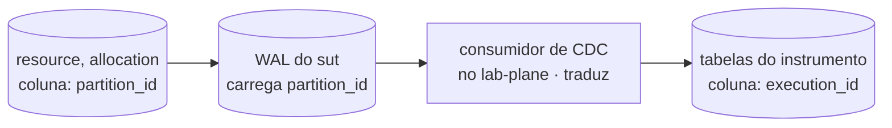
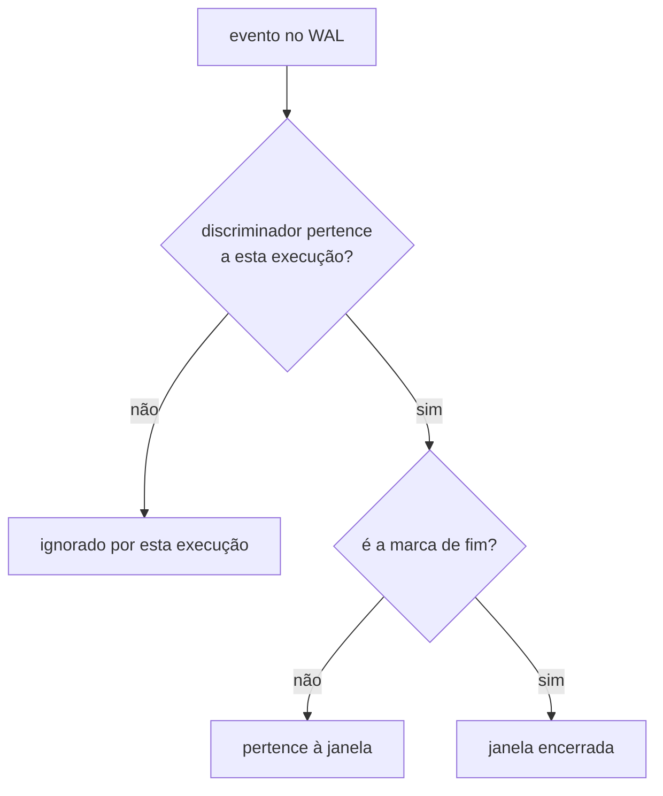

# ADR-0015: A chave, o discriminador de execução e as colunas de tempo

- **Estado:** Aceito
- **Data:** 2026-08-11 — data da síntese das sete linhas de origem, e não de nenhuma
  delas. Elas fecharam entre 2026-08-06 (`E-9`, `E-10`, `E-22`, `E-23`, `E-25`, `E-27`) e
  2026-08-11 (`E-26`, só a metade CRUD, pelo
  [fecho de `E-53`](../fila-de-decisoes.md#e-53-fecha-em-created_atupdated_at-e-metade-de-e-26-continua-aberta)).
- **Última atualização:** 2026-08-12, por patch — ver `## Patches aplicados`
- **Etapa do roadmap:** 1 e 3
- **Relacionado:** Depende do
  [ADR-0002](0002-o-dominio-minimo-e-os-dois-oraculos.md#decisão) e do
  [ADR-0010](0010-a-fronteira-de-schema-e-o-cdc-como-fonte-do-veredito.md#decisão). Usa o
  discriminador do filtro do
  [ADR-0012](0012-o-broker-no-caminho-do-veredito-e-a-dispensa-que-ele-exigiu.md#decisão)
  e o alcance por papel do valor do
  [ADR-0013](0013-a-proveniencia-da-fonte-como-criterio-da-proibicao-do-oraculo.md#decisão).
  **Emenda o [ADR-0002](0002-o-dominio-minimo-e-os-dois-oraculos.md)**, que recebe `Última
  atualização` e `Alterado por` no mesmo commit — ver `## Justificativa`.
- **Divergência de artefato, resolvida em 2026-08-11:** a
  [triagem de 2026-08-06](plano-de-escrita-do-lote-e.md#o-que-a-redução-cortou-e-para-onde-cada-coisa-foi)
  mandou este tema para "a migração `V2` e o card"; a pessoa escolheu uma
  terceira via, em
  [`E-55`](../fila-de-decisoes.md#e-55-fecha-na-divisão-entre-o-adr-e-um-documento-de-arquitetura-escolhida-em-2026-08-11).

## Contexto

O [ADR-0002](0002-o-dominio-minimo-e-os-dois-oraculos.md#decisão) fixa duas entidades sem
tipo de coluna nem restrição declarada — `Resource(id, value, capacity)` e
`Allocation(id, resource_id, amount)`, com `id` `bigint` derivado da semente por ordinal
([`fila`](../fila-de-decisoes.md#a-primeira-rodada-do-grupo-ii-em-2026-08-06)). Nenhuma
migração cria as duas tabelas: as `V1` só criam o schema, lacuna em
[`Q-INT-5`](../architecture/integrations.md#perguntas-em-aberto).

Duas execuções da mesma semente produzem os mesmos valores de `id`, e colidem sem coluna
que as distinga. A saída arquivada é pôr o discriminador na chave primária, ao custo de
vocabulário do instrumento no esquema medido
([`modelo-de-dados.md`](arquivo/proposta-2026-08-03/modelo-de-dados.md#d-dat-05--reset-entre-execuções)).
O [ADR-0012](0012-o-broker-no-caminho-do-veredito-e-a-dispensa-que-ele-exigiu.md#decisão)
já usa esse discriminador no filtro, sem dizer onde ele mora no esquema.

Sete perguntas ficaram pendentes antes do `CREATE TABLE`: ordem da chave, chave
estrangeira, índice, nome da coluna em cada lado, colunas de tempo nos dois lados, e quem
preenche o valor de cada uma.

## Problema

- `allocation.resource_id` referencia `resource.id` sem constraint; uma chave estrangeira
  captura o erro, mas trava um lock que colide com uma estratégia sob teste, e o predicate
  lock do `SERIALIZABLE` depende de índice sobre a coluna.
- O sistema medido não pode carregar a palavra "execução", e o instrumento já usa esse
  vocabulário — um nome só para a coluna força um dos dois lados a ceder.
- `created_at`/`updated_at` PODEM virar token de versão disfarçado, e a regra pedagógica
  proíbe dar de graça o que uma estratégia otimista deveria construir.
- O instrumento tem o mesmo par de perguntas, e mais uma: como a janela que essas colunas
  demarcam se relaciona à ordem que o oráculo usa, o LSN do WAL.

## Decisão

Este ADR decide o que **restringe a medição**: quais colunas existem, quem PODE lê-las, de
onde vem o valor delas e como a janela se delimita. A **forma** das tabelas — chave, ordem
das colunas, índice e tipo — é de [`schemas/`](../architecture/schemas/README.md), dono único
dela desde 2026-08-11.

### O nome assimétrico do discriminador, e a tradução num ponto único

A coluna do discriminador entra em `resource` e `allocation`, e cada schema usa o nome que
já é seu — `partition_id` no sistema medido, `execution_id` no instrumento. **Nenhuma
constraint liga os dois nomes**, e nenhuma poderia: um schema não lê o outro, pelo
[ADR-0010](0010-a-fronteira-de-schema-e-o-cdc-como-fonte-do-veredito.md#decisão). A
tradução vive num ponto único, o consumidor do stream de CDC dentro do `lab-plane`, e é
ali que ela **DEVE** estar escrita e testada.

### Sem chave estrangeira em `allocation.resource_id`

`allocation.resource_id` **NÃO DEVE** ter chave estrangeira para `resource.id`. Sem ela, a
linha órfã passa a ser **verificada** em vez de impedida. **Onde essa verificação vive é
`Pergunta em aberto`**, dona de
[`E-9`, metade aberta](../fila-de-decisoes.md#e-9-fecha-a-escolha-e-abre-uma-pendência-que-e-18-criou).

A forma do índice aditivo é de
[`schemas/sut.md`](../architecture/schemas/sut.md#o-que-o-diagrama-do-sut-não-desenha); o que este ADR
exige é o resto: o **plano de execução efetivo DEVE ser registrado no relatório do braço
`SERIALIZABLE` do E5**, sob pena de o número medido não ser interpretável.

### As colunas de tempo, e a fonte do relógio por papel do valor

`resource` e `allocation` ganham `created_at` e `updated_at`, e o valor vem da aplicação,
pelo adaptador de relógio injetável, decidido no fecho de
[`E-27`](../fila-de-decisoes.md#e-27-fecha-na-aplicação-e-o-ddl-das-duas-tabelas-medidas-deixa-de-ter-lacuna).
Uma estratégia de concorrência **NÃO DEVE** ler `updated_at`, e essa regra é de
[`E-25`](../fila-de-decisoes.md#e-25--timestamps-nas-tabelas-medidas), não do fecho de `E-27`.
A forma delas vive em
[`schemas/sut.md`](../architecture/schemas/sut.md#o-que-o-diagrama-do-sut-não-desenha).

No lado do instrumento — `lab_plane` ou `lab_journal`, `Pergunta em aberto` de
[`E-57`](../fila-de-decisoes.md#e-57--a-definição-de-experimento-tem-dois-donos-declarados)
—, sem tabela desenhada aqui, quatro colunas têm fonte decidida por papel:

| Coluna                                                 | Relógio              | Motivo                                                                                                                                     |
|--------------------------------------------------------|----------------------|--------------------------------------------------------------------------------------------------------------------------------------------|
| `executed_at`, `concluded_at`                          | adaptador de relógio | PODEM entrar no papel **veredito**, se o formato curva do grupo D usá-las                                                                  |
| `created_at`, `updated_at` da definição de experimento | banco                | metadado de CRUD, decidido por [`E-53`, fecho](../fila-de-decisoes.md#e-53-fecha-em-created_atupdated_at-e-metade-de-e-26-continua-aberta) |

### A janela medida não se correlaciona ao stream por tempo

A janela de uma execução é delimitada por **evento dentro do próprio stream**, e o relógio
do instrumento **NÃO DEVE** ser comparado ao LSN do WAL. Pertence à execução todo evento
cujo discriminador for o dela, o mesmo critério do filtro de CDC
([`E-33`, fecho](../fila-de-decisoes.md#e-33-fecha-na-distinção-e-ela-transforma-uma-recomendação-de-e-3-em-requisito)).
Ela termina quando o oráculo reconhece a marca de fim que o sistema medido escreve fora
dela ([`E-47`, fecho](../fila-de-decisoes.md#e-47-fecha-na-sentinela-escolhida-em-2026-08-10)),
e nenhuma marca de início é necessária.

Hoje `executed_at`/`concluded_at` são **rótulo de exibição**, e não prova de início ou fim
— o papel do instante de parede no
[ADR-0007](0007-o-log-de-observacoes-forma-ordem-e-onde-vive.md#a-ordem-garantida).

## Justificativa

Cada peça responde a um custo dentro da janela medida, e não a um ganho de desempenho:

| Decisão                                                       | Por que essa, e não outra                                                                                                                                                                                         | Evidência                                                                                                                                                                                                                                                                  |
|---------------------------------------------------------------|-------------------------------------------------------------------------------------------------------------------------------------------------------------------------------------------------------------------|----------------------------------------------------------------------------------------------------------------------------------------------------------------------------------------------------------------------------------------------------------------------------|
| sem chave estrangeira                                         | `FOR KEY SHARE`, que o `INSERT` com FK adquire, colide com o `FOR UPDATE` de `PESSIMISTIC`; o bloqueio seria atribuído à estratégia, não ao esquema                                                               | [`modelo-de-dados.md`, D-DAT-02](arquivo/proposta-2026-08-03/modelo-de-dados.md#d-dat-02--chave-estrangeira-de-allocationresource_id)                                                                                                                                      |
| plano efetivo no relatório do braço `SERIALIZABLE`            | sem o índice aditivo, o aborto `40001` viria da varredura sequencial e do lock de relação; sem o plano publicado, ninguém distingue uma causa da outra ao ler o número                                            | [`modelo-de-dados.md`, D-DAT-03](arquivo/proposta-2026-08-03/modelo-de-dados.md#d-dat-03--índice-sobre-allocationresource_id)                                                                                                                                              |
| nome assimétrico do discriminador                             | o sistema medido não pode carregar "execução"; nomear cada lado com o vocabulário que já é seu paga esse custo pela metade, sem impor salto mental às próprias tabelas do instrumento                             | [`E-23`, fecho](../fila-de-decisoes.md#e-23-fecha-em-nomes-assimétricos-um-por-lado-da-fronteira)                                                                                                                                                                          |
| valor de tempo vindo da aplicação, no lado medido             | `DEFAULT now()` usa o relógio do servidor e colapsa linhas da mesma transação no mesmo instante; um trigger corrige o instante, mas roda dentro da janela exata em que o E1 mede o lost update                    | [`E-27`, fecho](../fila-de-decisoes.md#e-27-fecha-na-aplicação-e-o-ddl-das-duas-tabelas-medidas-deixa-de-ter-lacuna)                                                                                                                                                       |
| `updated_at` fora de alcance de estratégia                    | a coluna é metadado de auditoria; lê-la equivaleria a introduzir, pela porta dos fundos, o token de versão que a regra pedagógica reserva ao `OPTIMISTIC`                                                         | [`E-25`](../fila-de-decisoes.md#e-25--timestamps-nas-tabelas-medidas), que é dona da proibição e do argumento pedagógico; o fecho de [`E-27`](../fila-de-decisoes.md#e-27-fecha-na-aplicação-e-o-ddl-das-duas-tabelas-medidas-deixa-de-ter-lacuna) decide só quem preenche |
| `executed_at`/`concluded_at` vêm do adaptador, por precaução  | PODEM entrar no papel **veredito** se sustentarem o formato curva do grupo D — a regra vale pelo papel do valor, não pelo plano que o produz, e por isso a fonte já é o adaptador antes de qualquer curva existir | [ADR-0013](0013-a-proveniencia-da-fonte-como-criterio-da-proibicao-do-oraculo.md#decisão)                                                                                                                                                                                  |
| `created_at`/`updated_at` da definição vêm do banco           | são metadado de CRUD sobre uma definição declarada via frontend — fora dos três papéis que a regra estrutural alcança                                                                                             | [`E-53`, fecho](../fila-de-decisoes.md#e-53-fecha-em-created_atupdated_at-e-metade-de-e-26-continua-aberta)                                                                                                                                                                |
| janela por discriminador e sentinela, não por LSN nem relógio | nenhum mecanismo novo entra: o discriminador já particiona o stream, e a marca de fim já dá condição de término à soma do oráculo do predicado                                                                    | [`E-33`, fecho](../fila-de-decisoes.md#e-33-fecha-na-distinção-e-ela-transforma-uma-recomendação-de-e-3-em-requisito) e [`E-47`, fecho](../fila-de-decisoes.md#e-47-fecha-na-sentinela-escolhida-em-2026-08-10)                                                            |

**Por que a forma da tabela saiu deste ADR.** O corpo de um ADR aceito só muda por
cerimônia de
[lifecycle](README.md#a-revogação-da-imutabilidade-decidida-em-2026-08-07), e o esquema
muda antes disso: `version` entra quando `OPTIMISTIC` nascer, pelo
[ADR-0006](0006-a-forma-da-estrategia-de-concorrencia.md#decisão). O argumento completo
está no fecho de
[`E-55`](../fila-de-decisoes.md#e-55-fecha-na-divisão-entre-o-adr-e-um-documento-de-arquitetura-escolhida-em-2026-08-11).

**Por que emenda, e não substituição.** Este ADR acrescenta colunas às duas tabelas que o
ADR-0002 fixou com "nenhuma outra coluna entra no MVP"
([Decisão](0002-o-dominio-minimo-e-os-dois-oraculos.md#decisão)) e "duas tabelas e cinco
colunas" ([Positivas](0002-o-dominio-minimo-e-os-dois-oraculos.md#positivas)) — o domínio
continua duas entidades, sem coluna de negócio nova. O critério de
[`README.md`](README.md#a-emenda-terceira-forma-ao-lado-da-substituição-e-da-subsunção)
excluiria isso na leitura literal; o precedente são o
[ADR-0009](0009-a-classificacao-do-dual-write-e-a-regiao-de-pacote.md) e o
[ADR-0010](0010-a-fronteira-de-schema-e-o-cdc-como-fonte-do-veredito.md#justificativa).
**A forma foi escolhida por precedente, e não pela pessoa**: a lacuna é
[`E-58`](../fila-de-decisoes.md#e-58--a-forma-da-alteração-do-adr-0002-por-este-adr-não-foi-nomeada).

## Consequências

### Positivas

- Chave, ordem de coluna, ausência de FK, ausência de `DEFAULT`/trigger e índice deixam
  de estar em aberto: o que faltava nesses pontos está fechado entre este ADR e
  [`schemas/sut.md`](../architecture/schemas/sut.md#o-schema-do-sistema-medido-sut). O
  `CREATE TABLE` continua bloqueado pelo tipo SQL de `value`, `capacity` e `amount`,
  dono de [`E-56`](../fila-de-decisoes.md#e-56--o-tipo-sql-de-value-capacity-e-amount-nunca-foi-decidido).
- O E5 ganha a exigência que torna o número dele interpretável: o plano efetivo ao lado do
  veredito do braço `SERIALIZABLE`.
- A janela se correlaciona ao veredito sem sincronizar relógio nem consultar o banco
  medido, saídas que a fronteira do ADR-0010 encareceria ou proibiria.
- A forma do esquema muda sem cerimônia de lifecycle, e este ADR não envelhece com ela.

### Negativas

- **Pergunta em aberto**, dona de
  [`E-9`, metade aberta](../fila-de-decisoes.md#e-9-fecha-a-escolha-e-abre-uma-pendência-que-e-18-criou):
  onde a órfã de `allocation.resource_id` é verificada não está decidido.
- O nome assimétrico exige que o consumidor de CDC saiba que `partition_id` e
  `execution_id` são o mesmo valor; nenhuma constraint declara a ligação.
- **Pergunta em aberto.** Se um experimento do grupo E ler `updated_at` como insumo de
  clock skew, a regra de que nenhuma estratégia a lê convive com essa leitura.
- Toda escrita medida depende do adaptador de relógio por colunas que nenhum oráculo lê.
- Nenhuma tabela foi desenhada para o instrumento por este ADR.
- Restrição e forma vivem em dois arquivos, e quem escreve a migração precisa dos dois.

### Neutras

Os dois oráculos não mudam: `value_final`, `value_inicial` e `Σ amount` seguem vindo do
WAL, pelos ADRs
[0010](0010-a-fronteira-de-schema-e-o-cdc-como-fonte-do-veredito.md#decisão) e
[0013](0013-a-proveniencia-da-fonte-como-criterio-da-proibicao-do-oraculo.md#decisão).

## Trade-offs

- **O `PESSIMISTIC` medir o fenômeno, e não o lock da constraint**, em troca de **a órfã
  exigir verificação, num lugar que ninguém decidiu**.
- **O sistema medido nunca carregar vocabulário do instrumento**, em troca de **uma
  ligação entre os dois nomes que só o consumidor de CDC conhece**.
- **O instante gravado nunca vir de relógio fora do experimento**, em troca de **toda
  escrita medida depender do adaptador**.
- **A janela dispensar relógio e LSN sincronizados**, em troca de **ela depender da marca
  de fim: sem ela, não sai veredito**.

## Alternativas consideradas

### Chave estrangeira composta em `allocation.resource_id`

**Descartada.** Captura um erro de programação no primeiro `INSERT` errado, sem custo de
código. Perde porque o `FOR KEY SHARE` que a FK adquire conflita com o
`FOR UPDATE` de `PESSIMISTIC` dentro da janela medida: a comparação entre estratégias
mediria o esquema.

### Um único nome para o discriminador, dos dois lados

**Descartada.** Um nome só dispensa a tradução e elimina a ligação não declarada. Perde
porque chamar a coluna de `execution_id` também no sistema medido contradiz, na palavra
exata, a exigência de que ele não saiba que está sendo medido.

### `DEFAULT now()`, `DEFAULT clock_timestamp()` ou trigger `BEFORE UPDATE`

**Descartadas.** As três dispensam a aplicação de preencher a coluna, e nenhuma escrita
esqueceria o valor. Perdem porque usam o relógio do servidor, fora do adaptador; a
primeira ainda colapsa linhas da mesma transação, e o trigger roda dentro da janela exata
em que o E1 mede o lost update.

### Correlacionar a janela ao WAL por LSN, ou por relógio sincronizado

**Descartadas as duas.** Ancorar por LSN nos dois extremos daria uma fronteira exata, na
mesma ordem que o oráculo já usa, e exigiria o `lab-plane` consultar o banco medido,
corroendo a fronteira do
[ADR-0010](0010-a-fronteira-de-schema-e-o-cdc-como-fonte-do-veredito.md#decisão).
Sincronizar relógios por NTP reproduziria, dentro do instrumento, o clock skew que o grupo
E existe para estudar.

## Quando esta decisão deixa de valer

Reveja o nome assimétrico se um segundo consumidor do stream de CDC precisar da mesma
tradução: duas implementações da mesma ligação não declarada pedem código comum.

Reveja a proibição de `updated_at` se um experimento do grupo E precisar dela como insumo
de clock skew.

Reveja a fonte de `executed_at`/`concluded_at` se a pessoa confirmar alcance diferente do
recorte registrado no fecho de
[`E-53`](../fila-de-decisoes.md#e-53-fecha-em-created_atupdated_at-e-metade-de-e-26-continua-aberta).

## O que este ADR desfaz fora de si

| Documento                                                                                                                                                                                                                                                                     | O que fica desatualizado                                                                                                                                                                                                                                                                                                                                                                                                                                                                                                                                                                                                                                                                                                                                                                                                                                                                                                                                                                                                                                                                                                                                                                                                                                                                                                                                                                                                                                                                                                                                                                                                                                                                                                                                                                                                                                                                                                                                                                                                                                                                                                                                                                                                                                                                                                                                                                                                                                                                                                                                                                |
|-------------------------------------------------------------------------------------------------------------------------------------------------------------------------------------------------------------------------------------------------------------------------------|-----------------------------------------------------------------------------------------------------------------------------------------------------------------------------------------------------------------------------------------------------------------------------------------------------------------------------------------------------------------------------------------------------------------------------------------------------------------------------------------------------------------------------------------------------------------------------------------------------------------------------------------------------------------------------------------------------------------------------------------------------------------------------------------------------------------------------------------------------------------------------------------------------------------------------------------------------------------------------------------------------------------------------------------------------------------------------------------------------------------------------------------------------------------------------------------------------------------------------------------------------------------------------------------------------------------------------------------------------------------------------------------------------------------------------------------------------------------------------------------------------------------------------------------------------------------------------------------------------------------------------------------------------------------------------------------------------------------------------------------------------------------------------------------------------------------------------------------------------------------------------------------------------------------------------------------------------------------------------------------------------------------------------------------------------------------------------------------------------------------------------------------------------------------------------------------------------------------------------------------------------------------------------------------------------------------------------------------------------------------------------------------------------------------------------------------------------------------------------------------------------------------------------------------------------------------------------------------|
| [`schemas/`](../architecture/schemas/README.md)                                                                                                                                                                                                                               | Nasce no mesmo commit, pela divisão de 2026-08-11. Ele é o dono único da forma dos dois schemas, e este ADR **NÃO DEVE** repetir chave, ordem de coluna, índice nem tipo.                                                                                                                                                                                                                                                                                                                                                                                                                                                                                                                                                                                                                                                                                                                                                                                                                                                                                                                                                                                                                                                                                                                                                                                                                                                                                                                                                                                                                                                                                                                                                                                                                                                                                                                                                                                                                                                                                                                                                                                                                                                                                                                                                                                                                                                                                                                                                                                                               |
| [`integrations.md`, `Q-INT-5`](../architecture/integrations.md#perguntas-em-aberto)                                                                                                                                                                                           | Corrigido no mesmo commit: a linha passa de "permanece aberta" a "parcialmente resolvida", cita `esquemas.md` como dono da forma e mantém em aberto a verificação de órfãs (`E-9`). Na [matriz](../architecture/integrations.md#matriz), a célula `Contrato` da linha `system-under-test → PostgreSQL, schema sut` volta a **declarar ausência**, porque `esquemas.md` não é contrato — a regra é do [`contracts/README.md`](../contracts/README.md#o-ddl-de-um-serviço-não-é-contrato), e a própria página o declara de si. O ponteiro para `esquemas.md` fica só na coluna `Evidência`.                                                                                                                                                                                                                                                                                                                                                                                                                                                                                                                                                                                                                                                                                                                                                                                                                                                                                                                                                                                                                                                                                                                                                                                                                                                                                                                                                                                                                                                                                                                                                                                                                                                                                                                                                                                                                                                                                                                                                                                               |
| [`docs/contracts/README.md`](../contracts/README.md#o-ddl-de-um-serviço-não-é-contrato)                                                                                                                                                                                       | Corrigido no mesmo commit: "dependem das decisões de modelo de dados que ainda não fecharam" deixa de valer, e o modelo de dados passa a ter dois donos declarados; a regra central do arquivo — o DDL de um serviço não é contrato — não muda.                                                                                                                                                                                                                                                                                                                                                                                                                                                                                                                                                                                                                                                                                                                                                                                                                                                                                                                                                                                                                                                                                                                                                                                                                                                                                                                                                                                                                                                                                                                                                                                                                                                                                                                                                                                                                                                                                                                                                                                                                                                                                                                                                                                                                                                                                                                                         |
| [`deteccao-de-atualizacao-perdida`](../features/deteccao-de-atualizacao-perdida/feature-card.md#integrações-e-contratos-afetados), Feature Card                                                                                                                               | Corrigido no mesmo commit: "não existe DDL nem contrato de esquema" some, substituída por remissão a `esquemas.md` como dono da forma; `R19` acrescenta a proibição de uma estratégia ler `updated_at`, e `R1`/`R16` são reconciliadas com as colunas novas. O card **não** recebe forma de tabela.                                                                                                                                                                                                                                                                                                                                                                                                                                                                                                                                                                                                                                                                                                                                                                                                                                                                                                                                                                                                                                                                                                                                                                                                                                                                                                                                                                                                                                                                                                                                                                                                                                                                                                                                                                                                                                                                                                                                                                                                                                                                                                                                                                                                                                                                                     |
| [`deteccao-de-atualizacao-perdida`](../features/deteccao-de-atualizacao-perdida/feature-card.md#riscos-e-decisões-pendentes), Feature Card                                                                                                                                    | Corrigido no mesmo commit: a linha de `Q-0002-4` na tabela de riscos afirmava que `R4` faz o identificador da semente colidir com as linhas da execução anterior — essa colisão específica deixou de ocorrer, pelo efeito que [`schemas/sut.md`](../architecture/schemas/sut.md#o-que-o-diagrama-do-sut-não-desenha) fixa, e a célula passa a nomear o que continua em aberto: quem limpa, e quando.                                                                                                                                                                                                                                                                                                                                                                                                                                                                                                                                                                                                                                                                                                                                                                                                                                                                                                                                                                                                                                                                                                                                                                                                                                                                                                                                                                                                                                                                                                                                                                                                                                                                                                                                                                                                                                                                                                                                                                                                                                                                                                                                                                                    |
| [`Q-0002-4`](../questions/Q-0002-4.md)                                                                                                                                                                                                                                        | Desatualizado pela decisão, e corrigido no mesmo commit: o argumento que eliminava a candidata "recurso novo por execução" partia da colisão de `id` entre duas execuções da mesma semente — a premissa cai porque duas execuções da mesma semente deixam de colidir. O efeito é de [`schemas/sut.md`](../architecture/schemas/sut.md#o-que-o-diagrama-do-sut-não-desenha), dono da forma que sustenta isso, e este ADR **NÃO DEVE** repeti-la. A questão ganha nota apontando a eliminação para revisão, sem decidir a nova resposta; o `Status` continua `pendente`.                                                                                                                                                                                                                                                                                                                                                                                                                                                                                                                                                                                                                                                                                                                                                                                                                                                                                                                                                                                                                                                                                                                                                                                                                                                                                                                                                                                                                                                                                                                                                                                                                                                                                                                                                                                                                                                                                                                                                                                                                  |
| [`deteccao-de-protecao-inerte`](../features/deteccao-de-protecao-inerte/feature-card.md#integrações-e-contratos-afetados), Feature Card                                                                                                                                       | Corrigido no mesmo commit: "não existe DDL nem contrato de esquema" some; `R10` acrescenta a ausência de chave estrangeira, e `R11` a exigência do plano efetivo no relatório do braço `SERIALIZABLE` — regras separadas porque uma não decorre da outra. O card **não** recebe forma de tabela nem desenho de índice.                                                                                                                                                                                                                                                                                                                                                                                                                                                                                                                                                                                                                                                                                                                                                                                                                                                                                                                                                                                                                                                                                                                                                                                                                                                                                                                                                                                                                                                                                                                                                                                                                                                                                                                                                                                                                                                                                                                                                                                                                                                                                                                                                                                                                                                                  |
| [`deteccao-de-atualizacao-perdida`, Example Mapping](../features/deteccao-de-atualizacao-perdida/example-mapping.md#updated_at-existe-no-esquema-e-nenhuma-estratégia-pode-lê-la)                                                                                             | Corrigido no mesmo commit: "nenhum ADR as carrega" vira "o ADR-0015 passou a ser o dono normativo"; a seção passa a ser ilustração dele, não fonte.                                                                                                                                                                                                                                                                                                                                                                                                                                                                                                                                                                                                                                                                                                                                                                                                                                                                                                                                                                                                                                                                                                                                                                                                                                                                                                                                                                                                                                                                                                                                                                                                                                                                                                                                                                                                                                                                                                                                                                                                                                                                                                                                                                                                                                                                                                                                                                                                                                     |
| [`deteccao-de-protecao-inerte`, Example Mapping](../features/deteccao-de-protecao-inerte/example-mapping.md#r3-e-r4--o-oráculo-do-predicado)                                                                                                                                  | Corrigido no mesmo commit: "Como o oráculo obtém aquele 12 não tem resposta hoje" vira "tem resposta desde o ADR-0013". A ausência de chave estrangeira **não** participa dessa soma, e entra em parágrafo à parte, pelo `40001` atribuível.                                                                                                                                                                                                                                                                                                                                                                                                                                                                                                                                                                                                                                                                                                                                                                                                                                                                                                                                                                                                                                                                                                                                                                                                                                                                                                                                                                                                                                                                                                                                                                                                                                                                                                                                                                                                                                                                                                                                                                                                                                                                                                                                                                                                                                                                                                                                            |
| [`execucao-de-experimento`, Example Mapping](../features/execucao-de-experimento/example-mapping.md#as-duas-fontes-de-tempo-da-execução-e-o-relógio-que-produz-cada-uma)                                                                                                      | Corrigido no mesmo commit: afirmava que os quatro campos do instrumento vêm do adaptador injetável, "nunca de `DEFAULT now()`". **A pessoa decidiu, em 2026-08-11, que `created_at`/`updated_at` da definição vêm do banco.** Que `executed_at`/`concluded_at` continuam no adaptador é recorte do [fecho de `E-53`](../fila-de-decisoes.md#e-53-fecha-em-created_atupdated_at-e-metade-de-e-26-continua-aberta), **revisável pela pessoa**, e a confirmação segue como pendência.                                                                                                                                                                                                                                                                                                                                                                                                                                                                                                                                                                                                                                                                                                                                                                                                                                                                                                                                                                                                                                                                                                                                                                                                                                                                                                                                                                                                                                                                                                                                                                                                                                                                                                                                                                                                                                                                                                                                                                                                                                                                                                      |
| [`observacao-passo-a-passo`](../features/observacao-passo-a-passo/feature-card.md#integrações-e-contratos-afetados), Feature Card                                                                                                                                             | Corrigido no mesmo commit: "o esquema existe apenas como prosa no ADR-0002" some; a seção passa a citar `esquemas.md` e a migração ainda não escrita.                                                                                                                                                                                                                                                                                                                                                                                                                                                                                                                                                                                                                                                                                                                                                                                                                                                                                                                                                                                                                                                                                                                                                                                                                                                                                                                                                                                                                                                                                                                                                                                                                                                                                                                                                                                                                                                                                                                                                                                                                                                                                                                                                                                                                                                                                                                                                                                                                                   |
| [`plano-de-escrita-do-lote-e.md`, seção `## ADR-0015`](plano-de-escrita-do-lote-e.md#adr-0015--a-chave-o-discriminador-de-execução-e-as-colunas-de-tempo)                                                                                                                     | Corrigido no mesmo commit: a subseção `### O DDL que a decisão produz` é **apagada**, porque o esquema deixou de ser documentado por DDL e ninguém a citava antes deste commit — a regra do próprio arquivo é "onde ninguém cita, a narrativa é apagada". "Nenhum card afirma DDL hoje" ganha o resultado da conferência que a própria seção mandava fazer. A [triagem de 2026-08-06](plano-de-escrita-do-lote-e.md#o-que-a-redução-cortou-e-para-onde-cada-coisa-foi) **não** é reescrita — a seção `## Estado` ganha, no mesmo commit, um aviso de que ela retrata 2026-08-06 e não hoje, porque este ADR já a contradiz. A subseção `### A decisão` **também** foi reescrita neste commit: ela carregava a forma da tabela em prosa — chave, índice, tipo das colunas de tempo — e passa a ser retrato datado de 2026-08-06 com ponteiro para `esquemas.md`, dono único da forma desde 2026-08-11.                                                                                                                                                                                                                                                                                                                                                                                                                                                                                                                                                                                                                                                                                                                                                                                                                                                                                                                                                                                                                                                                                                                                                                                                                                                                                                                                                                                                                                                                                                                                                                                                                                                                                   |
| [`docs/features/README.md`, índice](../features/README.md#índice)                                                                                                                                                                                                             | Corrigido no mesmo commit: a coluna `Regras` de `deteccao-de-atualizacao-perdida` passa de 18 para 19, e a de `deteccao-de-protecao-inerte` de 8 para 11 — `R10` e `R11` vêm deste ADR (a segunda por divisão de uma regra que empacotava duas exigências), e a contagem anterior já estava defasada de `R9`. As regras novas nascem `pendente`.                                                                                                                                                                                                                                                                                                                                                                                                                                                                                                                                                                                                                                                                                                                                                                                                                                                                                                                                                                                                                                                                                                                                                                                                                                                                                                                                                                                                                                                                                                                                                                                                                                                                                                                                                                                                                                                                                                                                                                                                                                                                                                                                                                                                                                        |
| os comentários das duas `V1`: [`V1__criar_schema_do_sut.sql`](../../system-under-test/src/main/resources/db/migration/V1__criar_schema_do_sut.sql) e [`V1__criar_schema_do_lab_plane.sql`](../../lab-plane/src/main/resources/db/migration/V1__criar_schema_do_lab_plane.sql) | Desatualizados por esta decisão, e **não corrigidos neste commit**: os dois remetem o modelo de dados às decisões `E-8` a `E-13`, o que deixou de descrever o estado. Esta célula **parafraseia** os dois comentários, e não os reproduz — uma frase literal aqui só se conserta por patch, e encareceria as saídas de [`E-82`](../fila-de-decisoes.md#e-82--os-comentários-das-duas-v1-ficaram-defasados-e-reescrevê-los-esbarra-em-e-81), onde a defasagem, os citantes e as três alternativas estão. A frase do lado do instrumento é reproduzida entre aspas pelo fecho de [`E-35`](../fila-de-decisoes.md#e-35-fecha-em-tabela-no-lab_plane-escolhida-em-2026-08-10), e reescrevê-la a quebra em silêncio.                                                                                                                                                                                                                                                                                                                                                                                                                                                                                                                                                                                                                                                                                                                                                                                                                                                                                                                                                                                                                                                                                                                                                                                                                                                                                                                                                                                                                                                                                                                                                                                                                                                                                                                                                                                                                                                                         |
| os comentários de Flyway das duas `application.yml`: [`system-under-test`](../../system-under-test/src/main/resources/application.yml) e [`lab-plane`](../../lab-plane/src/main/resources/application.yml)                                                                    | Carregavam a mesma referência desatualizada a `E-8` a `E-13`, mas nenhum documento os cita entre aspas — o bloqueio que `E-81` registra para as duas `V1` não os alcança. Corrigidos diretamente no mesmo commit, mantendo três linhas de comentário: o do sistema medido passa a apontar para `esquemas.md` como dono da forma, e o do instrumento nomeia `E-35`/`E-50` como donos da tabela de execuções ativas, ainda sem forma. `schemas:`/`default-schema:`/`create-schemas: true` não se deslocam, e nenhuma citação por linha em [`0011-...md`, schema por serviço](0011-a-topologia-de-servicos-e-o-caderno-de-laboratorio-fora-do-git.md#schema-próprio-para-quem-grava-estado) ou em [`integrations.md`, matriz](../architecture/integrations.md#matriz) precisa mudar.                                                                                                                                                                                                                                                                                                                                                                                                                                                                                                                                                                                                                                                                                                                                                                                                                                                                                                                                                                                                                                                                                                                                                                                                                                                                                                                                                                                                                                                                                                                                                                                                                                                                                                                                                                                                       |
| [`docs/adr/README.md`, índice](README.md#índice)                                                                                                                                                                                                                              | Corrigido no mesmo commit: um ADR novo exige linha no índice. Nada mais do arquivo é tocado.                                                                                                                                                                                                                                                                                                                                                                                                                                                                                                                                                                                                                                                                                                                                                                                                                                                                                                                                                                                                                                                                                                                                                                                                                                                                                                                                                                                                                                                                                                                                                                                                                                                                                                                                                                                                                                                                                                                                                                                                                                                                                                                                                                                                                                                                                                                                                                                                                                                                                            |
| [`docs/README.md`, precedência](../README.md#precedência-de-consulta)                                                                                                                                                                                                         | Corrigido no mesmo commit: um documento novo exige linha de roteamento, e `architecture/` deixa de conter só a matriz.                                                                                                                                                                                                                                                                                                                                                                                                                                                                                                                                                                                                                                                                                                                                                                                                                                                                                                                                                                                                                                                                                                                                                                                                                                                                                                                                                                                                                                                                                                                                                                                                                                                                                                                                                                                                                                                                                                                                                                                                                                                                                                                                                                                                                                                                                                                                                                                                                                                                  |
| [`docs/CONTEXT.md`, o domínio medido](../CONTEXT.md#o-domínio-medido)                                                                                                                                                                                                         | Corrigido no mesmo commit: as entradas `Resource` e `Allocation` fechavam a lista de colunas como `estabelecido` — "nenhuma outra coluna no MVP" —, e este ADR acrescenta `partition_id`, `created_at` e `updated_at`. As duas param de fechar a lista e remetem a [`schemas/sut.md`](../architecture/schemas/sut.md#o-schema-do-sistema-medido-sut), dono da forma. O reparo é imediato pelo precedente do fecho de [`E-44`](../fila-de-decisoes.md#e-44-fecha-em-reparo-imediato-escolhida-em-2026-08-10). As citações por linha `:88-93`, `:91` e `:437-440` **não** foram tocadas: aquele mesmo fecho as nomeia como dívida não reparada, e consertá-las aqui misturaria duas decisões num commit.                                                                                                                                                                                                                                                                                                                                                                                                                                                                                                                                                                                                                                                                                                                                                                                                                                                                                                                                                                                                                                                                                                                                                                                                                                                                                                                                                                                                                                                                                                                                                                                                                                                                                                                                                                                                                                                                                  |
| as citações **por linha** ao [`0002-o-dominio-minimo-e-os-dois-oraculos.md`](0002-o-dominio-minimo-e-os-dois-oraculos.md), em **seis** arquivos                                                                                                                               | Deslocadas em **dez** linhas por este commit, e **não** consertadas nele. São **vinte e quatro** citações em seis arquivos, com **vinte e nove** intervalos, contadas nas três formas que o repositório usa — `0002-…md:`, `ADR-0002:` e a curta `0002:` — e **fora de `docs/adr/arquivo/`**, que carrega mais três dezenas ao mesmo alvo, igualmente deslocadas, mas nunca é editado e é isento por `scripts/check_citations.py`. Sem essa qualificação a contagem não se reproduz. **`docs/CONTEXT.md`**, quinze citações e vinte intervalos, porque cinco delas carregam dois disjuntos: `:20-22,98`, `:23-25,98-100`, `:28-29,248-264`, `:186-190,556-574` e `:91` com `:437-440`; e mais `:88-93`, `:118-119`, `:120-121`, `:128-130`, `:135-141`, `:141-148`, `:171-173`, `:178-184`, `:186-190` e `:344-349`. **[`0006`](0006-a-forma-da-estrategia-de-concorrencia.md)**, duas — `:94-95` e `:344-349`. **[`0009`](0009-a-classificacao-do-dual-write-e-a-regiao-de-pacote.md)**, duas — `:175` duas vezes, a segunda dentro de um bloco Mermaid. **[`0011`](0011-a-topologia-de-servicos-e-o-caderno-de-laboratorio-fora-do-git.md)**, três — `:136`, `:138-139` e `:139-140`. **[`README.md`, rastro de alterações](README.md#o-rastro-de-alterações-emendado-em-2026-08-04)**, uma — `:95-96`. E **[`../fila-de-decisoes.md`, `D-DOM-05`](../fila-de-decisoes.md#d-dom-05--se-verdict-vira-quatro-termos)**, uma — `:186-190`, **em prosa**, e não dentro de bloco Mermaid. **O tratamento é de três tipos, e nenhum é "consertar aqui".** As **sete** de `0006`, `0009` e `0011` vivem em corpo de ADR aceito e só saem por **patch** registrado em cada um, que a pessoa não ordenou. As **quinze** de `docs/CONTEXT.md` continuam a dívida do fecho de [`E-44`](../fila-de-decisoes.md#e-44-fecha-em-reparo-imediato-escolhida-em-2026-08-10) — e duas delas, `:20-22` e `:23-25`, são piores que as outras, porque apontam para a entrada `Alterado por: ADR-0010` do cabeçalho, **reescrita neste commit**. As **duas** últimas, de `README.md` e desta fila, são **editáveis** e não cabem em nenhum dos dois regimes: consertá-las exige escolher o alvo, que é decisão, e por isso abriram [`E-68`](../fila-de-decisoes.md#e-68--duas-citações-por-linha-ao-adr-0002-são-editáveis-e-ninguém-decidiu-o-alvo). Uma varredura feita **depois** deste commit encontra vinte e seis, e não vinte e quatro: as duas a mais são as próprias citações quebradas, reproduzidas entre crases dentro de `E-68` como assunto dela — não são citação de evidência, e não contam. |
| [`AGENTS.md` da raiz](../../AGENTS.md#convenções-gerais-de-escrita)                                                                                                                                                                                                           | Corrigido no mesmo commit: a lista de tipos de diagrama nomeava só `sequenceDiagram` e `flowchart`, e `esquemas.md` usa `erDiagram`.                                                                                                                                                                                                                                                                                                                                                                                                                                                                                                                                                                                                                                                                                                                                                                                                                                                                                                                                                                                                                                                                                                                                                                                                                                                                                                                                                                                                                                                                                                                                                                                                                                                                                                                                                                                                                                                                                                                                                                                                                                                                                                                                                                                                                                                                                                                                                                                                                                                    |
| [`docs/AGENTS.md`](../AGENTS.md#convenções-de-escrita)                                                                                                                                                                                                                        | Corrigido no mesmo commit: a mesma lista, copiada aqui por "valem aqui sem alteração", também nomeava só `sequenceDiagram` e `flowchart`; ganhou `erDiagram`.                                                                                                                                                                                                                                                                                                                                                                                                                                                                                                                                                                                                                                                                                                                                                                                                                                                                                                                                                                                                                                                                                                                                                                                                                                                                                                                                                                                                                                                                                                                                                                                                                                                                                                                                                                                                                                                                                                                                                                                                                                                                                                                                                                                                                                                                                                                                                                                                                           |
| [`../fila-de-decisoes.md`](../fila-de-decisoes.md#a-triagem-contra-os-quatro-critérios) — tema "a chave, o discriminador e as colunas de tempo": `E-9`, `E-10`, `E-22`, `E-23`, `E-25` a `E-27`                                                                               | Este ADR nasce dessas sete linhas, e três delas passam a ter dono em `esquemas.md`. A poda que a fila reserva a "quando o ADR nasce" não aconteceu neste commit, e **quem a executar não pode remover duas delas por inteiro**: [`E-9`](../fila-de-decisoes.md#e-9-fecha-a-escolha-e-abre-uma-pendência-que-e-18-criou) deixa em aberto onde vive a verificação de órfãs, e `E-26` fecha só a metade CRUD. Só a parte fechada de cada uma é podável.                                                                                                                                                                                                                                                                                                                                                                                                                                                                                                                                                                                                                                                                                                                                                                                                                                                                                                                                                                                                                                                                                                                                                                                                                                                                                                                                                                                                                                                                                                                                                                                                                                                                                                                                                                                                                                                                                                                                                                                                                                                                                                                                    |
| [`0002-o-dominio-minimo-e-os-dois-oraculos.md`](0002-o-dominio-minimo-e-os-dois-oraculos.md)                                                                                                                                                                                  | Emendado no mesmo commit: recebe `Última atualização` e uma linha `Alterado por`. A forma da alteração não foi nomeada pela pessoa, e a lacuna está aberta em [`E-58`](../fila-de-decisoes.md#e-58--a-forma-da-alteração-do-adr-0002-por-este-adr-não-foi-nomeada). O cabeçalho novo empurrou o corpo inteiro **dez** linhas abaixo, e a citação por linha `:156-157`, que outra entrada do próprio cabeçalho fazia a "O oráculo exato", virou âncora. Ela **já era imprecisa antes deste commit** — `:156-157` eram a cerca e a fórmula, e a regra citada estava em `:161` —, e o deslocamento a levou ainda para outra seção; o conserto está em [`## Patches aplicados`](0002-o-dominio-minimo-e-os-dois-oraculos.md#patches-aplicados) do ADR-0002.                                                                                                                                                                                                                                                                                                                                                                                                                                                                                                                                                                                                                                                                                                                                                                                                                                                                                                                                                                                                                                                                                                                                                                                                                                                                                                                                                                                                                                                                                                                                                                                                                                                                                                                                                                                                                                 |

## Patches aplicados

- **2026-08-12** — duas citações a identificadores da fila que a renumeração de
  [`E-73`](../fila-de-decisoes.md#e-73-fecha-em-renumerar-o-par-mais-novo-escolhida-em-2026-08-12)
  moveu. Na tabela de `## O que este ADR desfaz fora de si`, a citação a `E-63` passa a
  apontar para `E-82`, e a menção em prosa a `E-62` passa a `E-81` — as duas linhas eram
  as mais novas de um par de identificadores colididos, e nenhuma das duas mudou de
  conteúdo. O patch troca o endereço e o nome, e não toca na decisão, na justificativa,
  na alternativa descartada nem no trade-off que a célula sustenta.

- **2026-08-12** — as **seis** citações à forma dos dois schemas, que apontavam para
  `../architecture/esquemas.md`. O fecho de
  [`E-78`](../fila-de-decisoes.md#e-78--o-esquemasmd-vira-pasta-com-um-arquivo-por-serviço)
  trocou aquele arquivo por uma pasta com um arquivo por serviço, e **não deixou
  lápide** — um dono único que aponta para o dono real seria o segundo lugar onde a
  forma vive, que é o defeito que `E-55` fechou. Quatro citações a
  `#o-que-o-diagrama-do-sut-não-desenha` e duas a `#o-schema-do-sistema-medido-sut`
  passam a `../architecture/schemas/sut.md`, com a mesma âncora; a remissão sem âncora
  passa a `../architecture/schemas/README.md`. O texto dos links acompanha o nome novo.
  **As menções em prosa da tabela de `## O que este ADR desfaz fora de si` não foram
  tocadas**: elas narram o que o commit de 2026-08-11 fez, quando o arquivo existia com
  aquele nome, e reescrevê-las apagaria o que a data registra. O patch troca endereço e
  nome, e não toca decisão, justificativa, alternativa descartada nem trade-off.

O regime de patch está em [`README.md`](README.md#a-revogação-da-imutabilidade-decidida-em-2026-08-07).
Um patch conserta citação, caminho ou erro material; ele NÃO DEVE alterar a decisão nem o
argumento que a sustentava.
