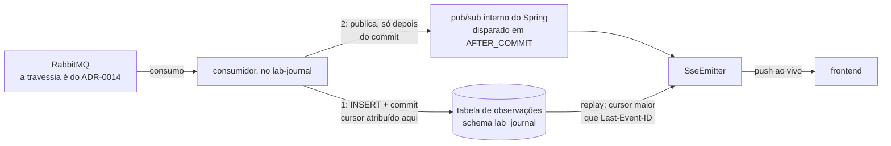
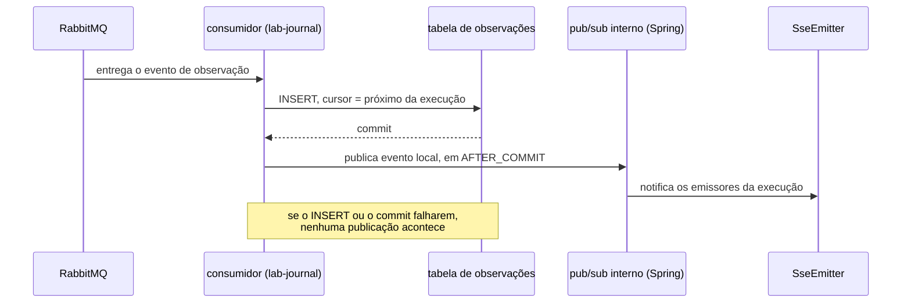
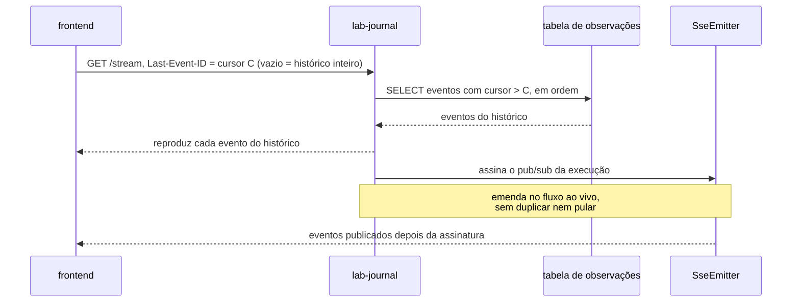

# ADR-0016: O streaming e o replay do log de observações

- **Estado:** Aceito
- **Data:** 2026-08-10
- **Etapa do roadmap:** 1 — o log passa a ser persistido desde a etapa 1 pelo ADR-0014, e
  a tela precisa lê-lo.
- **Relacionado:** emenda o
  [ADR-0007](0007-o-log-de-observacoes-forma-ordem-e-onde-vive.md) — a seção "A forma de
  um evento" —, que recebe `Última atualização` e `Alterado por` no mesmo commit. Depende
  do [ADR-0014](0014-o-broker-na-travessia-da-observacao-e-o-cursor-monotonico-do-replay.md),
  que entrega o evento ao `lab-journal` pelo broker, e do
  [ADR-0011](0011-a-topologia-de-servicos-e-o-caderno-de-laboratorio-fora-do-git.md), que
  decidiu que o frontend lê o `lab-journal` sem BFF. As duas decisões nasceram da mesma
  escolha, em 2026-08-10. **Divide** o ADR-0014, pela sexta forma do lifecycle, decidida em
  2026-08-11 ([`README.md`](README.md#a-divisão-de-um-adr-aceito-decidida-em-2026-08-11)):
  cinco subseções de `## Decisão` daquele ADR — a ordem serial, o push em `AFTER_COMMIT`, o
  replay por cursor, o cursor como campo próprio e os dois instantes — saíram do corpo dele
  e vivem aqui, vigentes, junto dos trechos de `## Justificativa`, `## Trade-offs` e
  `## Alternativas consideradas` que as sustentavam. **Os dois continuam `Aceito`**, e o
  ADR-0014 recebe `Última atualização` e `Alterado por` no mesmo commit.

## Contexto

O [ADR-0014](0014-o-broker-na-travessia-da-observacao-e-o-cursor-monotonico-do-replay.md#decisão)
entrega a observação ao `lab-journal` pelo broker, e autoriza a persistência já na etapa
1; ele não decide o que o `lab-journal` faz com o evento depois de recebê-lo. O
[ADR-0011](0011-a-topologia-de-servicos-e-o-caderno-de-laboratorio-fora-do-git.md#comando-no-lab-plane-leitura-no-lab-journal-sem-bff)
decidiu que o frontend lê o `lab-journal` sem BFF, sem fixar o transporte, e a
[matriz de integrações](../architecture/integrations.md#perguntas-em-aberto) registrava
isso em `Q-INT-2`. O `frontend/nginx.conf:18-28` já desliga buffer e cache de resposta,
pressupondo SSE, sem que nenhum ADR o tivesse decidido.

O [ADR-0007](0007-o-log-de-observacoes-forma-ordem-e-onde-vive.md#a-forma-de-um-evento)
fixa a forma de um evento — seis campos, entre eles o **instante de parede** —, e a
[ordem garantida](0007-o-log-de-observacoes-forma-ordem-e-onde-vive.md#a-ordem-garantida):
só o par com `restrito = verdadeiro` carrega precedência causal, e fora dele o instante de
parede é metadado de exibição. [`Q-0004-3`](../questions/Q-0004-3.md), pendente, registra
que nenhum documento diz qual relógio o log usa, se ele é monotônico, nem a resolução dele.

## Problema

**Como a execução aparece na tela ao vivo e ainda permite reconstruir o histórico
inteiro, sem duplicar mecanismo, sem repetir nem pular evento na reconexão, e sem apoiar a
ordem num relógio que ninguém provou?**

Forças em conflito:

- O `lab-journal` precisa notificar ao vivo e, na reconexão, não repetir nem pular evento.
- Recuperar o histórico e reconectar no meio são a mesma pergunta, e dois mecanismos
  distintos divergiriam entre si.
- A ordem do replay não pode se apoiar num relógio não documentado — `Q-0004-3`.
- Persistir e emitir em paralelo seriam duas escritas sem transação comum, dentro do
  instrumento que estuda exatamente isso.
- O evento chega pelo broker, que PODE duplicar, reordenar ou perder mensagem.

## Decisão

### No `lab-journal`, a ordem é serial: persiste, depois emite

O consumidor DEVE persistir o evento — `INSERT` e commit — **antes** de emiti-lo, e NÃO
DEVE fazer as duas coisas em paralelo.

### O push ao vivo é o pub/sub interno do Spring, em `AFTER_COMMIT`

O `lab-journal` DEVE notificar os clientes conectados pelo pub/sub interno do Spring, em
`AFTER_COMMIT`. Persistência que falhar NÃO publica.

### O replay por cursor é o único mecanismo, com ou sem histórico completo

O stream SSE DEVE aceitar `Last-Event-ID`: reproduz os eventos com cursor maior que o
declarado, na ordem do cursor, e emenda no fluxo ao vivo a partir daí. **Recuperar o
histórico é o mesmo mecanismo**, com cursor vazio — a plataforma NÃO DEVE expor um
segundo endpoint para isso.

### O cursor é campo próprio, monotônico por execução

O cursor DEVE ser um campo próprio do registro persistido no `lab-journal`, monotônico
por execução, e NÃO DEVE ser um timestamp.

### Dois instantes, nenhum deles é ordem

O registro de um evento DEVE carregar dois instantes: **ocorrência**, atribuído no
`lab-plane` — o "instante de parede" do
[ADR-0007](0007-o-log-de-observacoes-forma-ordem-e-onde-vive.md#a-forma-de-um-evento) —, e
**persistência**, atribuído no `lab-journal`. **O cursor NÃO DEVE ser lido como
precedência causal**: é ordem de chegada, e metadado de exibição, como o instante de
parede fora dos pares `restrito = verdadeiro`.

## Justificativa

**Por que persistir antes de emitir.** Emitir em paralelo seriam duas escritas
independentes sem transação comum — dual write, grupo C
([ADR-0009, Decisão](0009-a-classificacao-do-dual-write-e-a-regiao-de-pacote.md#decisão))
—, o próprio item do briefing que a etapa 6 existe para estudar, reproduzido dentro do
instrumento que deveria só observá-lo. Persistir antes também evita a tela mostrar evento
que o banco não tem, e neutraliza a fragilidade conhecida do pub/sub do Spring: um push
perdido é recuperado pelo replay. **A assimetria é o que decide entre as duas ordens**: no
arranjo paralelo, a mesma fragilidade do pub/sub seria fatal, porque sem persistência antes
da emissão um push perdido não teria replay nenhum que o recuperasse, e o evento
desapareceria sem deixar rastro.

**Por que um mecanismo só.** Histórico e reconexão fazem a mesma pergunta — "o que veio
depois do cursor C?" —, e o histórico é o caso `C` vazio. Dois endpoints divergiriam na
fronteira entre o que já foi persistido e o que ainda chega, que é justamente onde
duplicar ou pular evento acontece.

**Por que o cursor não é um timestamp.** Pelo que
[`Q-0004-3`](../questions/Q-0004-3.md) registra, e o `## Contexto` cita: dois eventos
dentro da mesma resolução colidiriam, e um cursor que colide pula ou repete evento no
replay, em silêncio.
**A regra de relógio injetável do
[`AGENTS.md`](../../AGENTS.md#regras-estruturais-que-valem-sempre) não alcança o cursor**,
e é por isso que ela não decide esta questão: ela alcança o valor que entra em veredito,
em escalonamento ou em identidade derivada da semente, e o cursor não é nenhum dos três. O
argumento contra o timestamp é só o de `Q-0004-3`.

**Por que dois instantes, e para que serve o segundo.** A **diferença entre eles mede o
custo da travessia** — o intervalo entre o passo atribuir o instante de ocorrência, no
`lab-plane`, e o `lab-journal` gravar o de persistência. É a única medida que o registro
oferece do buffer, do broker e do consumidor somados, e sem o segundo instante ela não
existe: o de ocorrência sozinho diz quando o fato aconteceu, e nada sobre quanto ele
demorou a chegar. O argumento estava na subseção "Dois instantes" do ADR-0014 aceito
(`a5d5777:144`), e a divisão o trouxe para cá com a regra que ele sustenta.

**Por que o cursor não é ordem.** Ele mede **chegada**, não **ocorrência**: lido como
precedência causal, repetiria o erro que o ADR-0007 já evitou para o instante de parede,
fora dos pares restritos. O broker PODE reordenar, e a ordem de chegada não é a ordem dos
fatos.

**Por que emenda, e não substituição.** A regra alterada do ADR-0007 — a forma de um
evento — mantém os seis campos originais: é o **registro persistido no `lab-journal`**
que ganha o cursor e o instante de persistência, e o instante de ocorrência já existia
ali, como instante de parede. O título do ADR-0007, porém, é "...**forma**, ordem e onde
vive": a palavra que nomeia a regra emendada está nele. Se um trecho conta como dar
título, ninguém decidiu — mesma pergunta da linha
[`E-63`](fila-de-decisoes.md#e-63--a-emenda-e-o-título-citado-por-trecho), aberta também
para a emenda irmã do ADR-0014. O precedente são os ADRs 0009, 0010 e 0011, que emendaram
regra dentro de `## Decisão` pelo mesmo critério e seguem `Aceito`; dois deles, 0010 e
0011, registraram a mesma tensão como `Pergunta em aberto`, sem decidi-la.

## Consequências

### Positivas

- Um mecanismo único serve histórico, reconexão e acompanhamento ao vivo; a fronteira
  entre replay e fluxo é interna a ele, e não entre dois endpoints.
- A ordem persiste-depois-emite elimina o dual write dentro do instrumento.
- O cursor não herda a incerteza de um relógio nunca provado monotônico.

### Negativas

- **A forma concreta do registro está em aberto** — nome e tipo da coluna do cursor, a
  migração que a cria, e o formato JSON de cada evento no stream.
- **O instante de ocorrência e a monotonicidade dele seguem sem decisão**
  ([`Q-0004-3`](../questions/Q-0004-3.md), pendente): esta decisão tira o relógio da
  **ordem**, e não do registro.
- **A contrapressão entre o broker e o `lab-journal` não foi decidida.** Um consumidor
  lento acumula ou descarta sem política escrita, e o cursor não distingue "não houve
  evento" de "o evento não chegou".
- O pub/sub do Spring é local ao processo: com mais de uma instância do `lab-journal`, um
  `SseEmitter` não vê o que outra publicou.
- **Comportamento não decidido:** o que o stream faz quando o `Last-Event-ID` aponta para
  um cursor que não existe, e como ele sinaliza que uma execução terminou.
- **Pergunta em aberto: o transporte foi fixado sem alternativa descartada.** Esta
  decisão escolhe o SSE, e o **WebSocket** não foi descartado com motivo escrito — a
  linha do plano que ela fecha oferecia os dois nomes, na letra, em
  [9. Decisões deliberadamente adiadas](../plano-do-laboratorio.md#9-decisões-deliberadamente-adiadas),
  e `## Alternativas consideradas` não o registra. O único apoio é o
  `frontend/nginx.conf:18-28` já pressupor SSE, e **isso é disponibilidade** — o
  argumento que a regra estrutural do
  [`AGENTS.md`](../../AGENTS.md#regras-estruturais-que-valem-sempre) recusa. A lacuna é a
  linha
  [`E-67`](fila-de-decisoes.md#e-67--o-transporte-da-emissão-ao-vivo-foi-fixado-sem-alternativa-descartada).

### Neutras

- A dispensa da regra de tecnologia pertence ao
  [ADR-0014](0014-o-broker-na-travessia-da-observacao-e-o-cursor-monotonico-do-replay.md#o-evento-sai-do-passo-pelo-broker)
  e **não** é herdada aqui: nada nela alcança o transporte desta decisão.

## Trade-offs

- O benefício **um mecanismo para histórico e replay, sem dual write** foi aceito em troca
  do custo **a tela esperar o commit antes de mostrar o evento**.
- O benefício **cursor sem relógio não provado** foi aceito em troca do custo **forma
  concreta do registro em aberto**.
- O benefício **replay a partir do banco** foi aceito em troca do custo **depender de o
  evento ter chegado: o que se perdeu antes do `lab-journal` não é reposto por cursor
  nenhum**.

## Alternativas consideradas

### SSE e persistência em paralelo

**Descartada.** A favor: a tela atualizaria sem esperar o commit, e o push deixaria de
carregar a latência do banco. Perde pelo argumento do dual write, grupo C
([ADR-0009, Decisão](0009-a-classificacao-do-dual-write-e-a-regiao-de-pacote.md#decisão)):
são duas escritas independentes sem transação comum, e a tela passaria a poder mostrar um
evento que o banco não tem — sem que exista, depois, como distinguir os dois casos.

### Replay por histórico completo, em endpoint próprio

**Descartada.** A favor: um `GET` que devolve a execução inteira de uma vez é mais simples
de escrever, de paginar e de testar que um stream que reproduz e depois emenda no vivo, e
quem só revisa uma execução encerrada não precisaria de SSE nenhum. Perde porque os dois
mecanismos respondem à mesma pergunta — "o que veio depois do cursor `C`?" — por caminhos
distintos, e a divergência aparece exatamente na fronteira entre o que já foi persistido e
o que ainda chega: o cliente que baixa o histórico e **depois** abre o stream não tem como
saber o que foi publicado entre as duas chamadas, e recebe evento duplicado ou pula evento
conforme a ordem em que elas caírem. O replay por cursor não tem essa fronteira, porque
reproduzir e emendar acontecem dentro da mesma conexão.

### Ordenar o replay pelo instante do evento

**Descartada.** A favor: nenhum campo novo, e o instante de parede já existe na forma do
evento do ADR-0007. Perde por [`Q-0004-3`](../questions/Q-0004-3.md), pelo mesmo
argumento da `## Justificativa`: dois eventos podem colidir, e um cursor que colide pula
ou repete evento, sem sinalizar. Ordenar por um valor de tempo
também prometeria precedência entre workers, que o
[ADR-0007](0007-o-log-de-observacoes-forma-ordem-e-onde-vive.md#a-ordem-garantida)
recusa fora dos pares restritos.

## Quando esta decisão deixa de valer

Revise se o `lab-journal` rodar em mais de uma instância: `SseEmitter` não vê evento
publicado pelo pub/sub de outra, local ao processo — o replay cobre a lacuna só na
reconexão, com atraso.

Revise também se a contrapressão do broker descartar observação sob carga: o cursor
deixaria de provar completude, exigindo guarda de contiguidade como a que o
[ADR-0013](0013-a-proveniencia-da-fonte-como-criterio-da-proibicao-do-oraculo.md#decisão)
já exige para o WAL.

## O que este ADR desfaz fora de si

Esta decisão desatualiza os arquivos abaixo, fora do próprio corpo.

| Documento                                                                                                                                       | O que muda                                                                                                                                                                                                                                                                                                                                                                                                                                                                                                                                                                                                                                                                                                                                                                                                                                                                                                                                                                                                                                                                                                                                                                                                                                                                                                                                                                                                                                                                                                                                                                                                                                                                                                                                                                                                                                                                                                                                                                                                                               |
|-------------------------------------------------------------------------------------------------------------------------------------------------|------------------------------------------------------------------------------------------------------------------------------------------------------------------------------------------------------------------------------------------------------------------------------------------------------------------------------------------------------------------------------------------------------------------------------------------------------------------------------------------------------------------------------------------------------------------------------------------------------------------------------------------------------------------------------------------------------------------------------------------------------------------------------------------------------------------------------------------------------------------------------------------------------------------------------------------------------------------------------------------------------------------------------------------------------------------------------------------------------------------------------------------------------------------------------------------------------------------------------------------------------------------------------------------------------------------------------------------------------------------------------------------------------------------------------------------------------------------------------------------------------------------------------------------------------------------------------------------------------------------------------------------------------------------------------------------------------------------------------------------------------------------------------------------------------------------------------------------------------------------------------------------------------------------------------------------------------------------------------------------------------------------------------------------|
| [ADR-0014](0014-o-broker-na-travessia-da-observacao-e-o-cursor-monotonico-do-replay.md#decisão)                                                 | **cinco subseções de `## Decisão` saem do corpo dele e passam a viver aqui** — a ordem serial no `lab-journal`, o push em `AFTER_COMMIT`, o replay por cursor, o cursor como campo próprio e os dois instantes —, e com elas os trechos de `## Justificativa`, `## Trade-offs` e `## Alternativas consideradas` que as sustentavam; o título perde a parte que as nomeava, e o nome do arquivo não. É a **divisão**, a sexta forma ([`README.md`](README.md#a-divisão-de-um-adr-aceito-decidida-em-2026-08-11)): os dois ADRs seguem `Aceito`, e o rastro entra no cabeçalho do ADR-0014 no mesmo commit. **A divisão não é tudo o que aconteceu com aquele corpo:** no mesmo commit ele **ganhou** conteúdo que não estava nele em `a5d5777`, cuja extensão completa — para não haver uma terceira contagem do mesmo fato — está na linha [`E-62`](fila-de-decisoes.md#e-62--que-forma-cobre-a-entrada-de-decisão-nova-num-adr-aceito), que também decide qual forma do lifecycle cobre essa entrada                                                                                                                                                                                                                                                                                                                                                                                                                                                                                                                                                                                                                                                                                                                                                                                                                                                                                                                                                                                                                                    |
| [`README.md` de ADR, as formas de alterar um aceito](README.md#a-revogação-da-imutabilidade-decidida-em-2026-08-07)                             | esta decisão edita o `README.md` em **cinco lugares**, e a lista abaixo é fechada. **Primeiro**, a seção nova [A divisão de um ADR aceito](README.md#a-divisão-de-um-adr-aceito-decidida-em-2026-08-11): a lista de formas deixa de ser de cinco, e a **divisão** entra como sexta, porque esta decisão dividiu o ADR-0014 e nenhuma das cinco a cobria. **Segundo**, o diagrama Mermaid de [A revogação da imutabilidade](README.md#a-revogação-da-imutabilidade-decidida-em-2026-08-07) ganha um terceiro ramo, para a divisão, que deixa de estar sob "o erro está na escolha" — o diagrama passa a ter uma pergunta neutra, "por quê?", e três respostas. **Terceiro**, o [índice](README.md#índice) ganha a linha deste ADR, e o título do ADR-0014 muda na linha dele. **Quarto**, [As quatro formas antigas continuam valendo](README.md#as-quatro-formas-antigas-continuam-valendo) ganha um parágrafo novo — "O título continua fato, e a divisão não o altera" — e troca "Substituição, subsunção, emenda e adendo" por "Substituição, subsunção, emenda, adendo e divisão". **Quinto**, a lápide [A anomalia por frequência](README.md#a-anomalia-por-frequência-uma-proposta-que-muda-o-estatuto-da-barreira) **perde a enumeração que carregava** e passa a remeter ao lifecycle: ela dizia "só admite emenda, substituição, subsunção ou errata", e com seis formas a sentença deixaria de restringir qualquer coisa, além de virar a terceira cópia da lista dentro do mesmo arquivo. **A errata não foi abolida** — ela continua viva na regra de [`adr-lifecycle.md`](../../.claude/skills/adr/references/adr-lifecycle.md#a-seção--patches-aplicados-obrigatória-desde-2026-08-07) e nos cabeçalhos dos ADRs [0005](0005-a-forma-do-escalonador.md) e [0006](0006-a-forma-da-estrategia-de-concorrencia.md), ambos `Aceito` —, e por isso ela não podia ser trocada pela divisão dentro daquela frase. A tabela de formas da skill **não entra nesta contagem**: ela é outro arquivo, e tem linha própria nesta tabela |
| [ADR-0007, A forma de um evento](0007-o-log-de-observacoes-forma-ordem-e-onde-vive.md#a-forma-de-um-evento)                                     | o registro persistido no `lab-journal` ganha dois campos que o evento não tinha — o cursor e o instante de persistência; o instante de ocorrência já existia, como o "instante de parede", e os seis campos do evento não mudam; emenda registrada no cabeçalho do ADR-0007                                                                                                                                                                                                                                                                                                                                                                                                                                                                                                                                                                                                                                                                                                                                                                                                                                                                                                                                                                                                                                                                                                                                                                                                                                                                                                                                                                                                                                                                                                                                                                                                                                                                                                                                                              |
| [`integrations.md`, Matriz](../architecture/integrations.md#matriz)                                                                             | a linha `frontend` → `lab-journal` por SSE já nomeava `Last-Event-ID` e o replay por cursor desde `a5d5777` — a única mudança é a citação, de ADR-0014 para este ADR; o mesmo vale para a linha RabbitMQ → `lab-journal`, que já citava a regra persiste-depois-emite e troca só o ADR citado                                                                                                                                                                                                                                                                                                                                                                                                                                                                                                                                                                                                                                                                                                                                                                                                                                                                                                                                                                                                                                                                                                                                                                                                                                                                                                                                                                                                                                                                                                                                                                                                                                                                                                                                            |
| [`integrations.md`, Perguntas em aberto](../architecture/integrations.md#perguntas-em-aberto)                                                   | `Q-INT-2` já estava **resolvida** desde `a5d5777`, pelo mesmo mecanismo — a única mudança é a citação, de ADR-0014 para este ADR. O parágrafo sobre [`Q-0022`](../questions/Q-0022.md) é reescrito: ela continua `pendente`, e o destino dela passa a ser a linha `E-59` da fila — a redação anterior achava que o ADR tirava a premissa da objeção sem nomeá-la, e esta reconhece que não a nomeia                                                                                                                                                                                                                                                                                                                                                                                                                                                                                                                                                                                                                                                                                                                                                                                                                                                                                                                                                                                                                                                                                                                                                                                                                                                                                                                                                                                                                                                                                                                                                                                                                                      |
| [`integrations.md`, A topologia decidida](../architecture/integrations.md#a-topologia-decidida-e-o-que-falta-dela)                              | a prosa acima do diagrama enumera os ADRs que fixaram o que falta, e passa a incluir este: duas arestas de lá são desta decisão — RabbitMQ → `lab-journal`, que persiste antes de emitir, e `lab-journal` → `frontend`, o SSE com replay por cursor                                                                                                                                                                                                                                                                                                                                                                                                                                                                                                                                                                                                                                                                                                                                                                                                                                                                                                                                                                                                                                                                                                                                                                                                                                                                                                                                                                                                                                                                                                                                                                                                                                                                                                                                                                                      |
| [`contracts/README.md`, Estado](../contracts/README.md#estado-nenhum-contrato-existe)                                                           | a linha do OpenAPI entre o frontend e o `lab-journal` passa a citar este ADR como quem decide o transporte SSE, que antes só existia como configuração de nginx; a linha do AsyncAPI `lab-plane` → RabbitMQ → `lab-journal` passa a atribuir a **forma concreta do registro** a este ADR, e não ao ADR-0014, cujas `### Negativas` cobrem a contrapressão e não a forma; e a abertura da página, que o ADR-0014 já levara de "0010 a 0012" para "0010 a 0014", passa a nomear também este                                                                                                                                                                                                                                                                                                                                                                                                                                                                                                                                                                                                                                                                                                                                                                                                                                                                                                                                                                                                                                                                                                                                                                                                                                                                                                                                                                                                                                                                                                                                                |
| [`features/README.md`, índice](../features/README.md#índice)                                                                                    | a linha do card `streaming-e-replay-do-log-de-observacoes` já existia na tabela desde `a5d5777`, com origem ADR-0014 — foi aquele ADR, ao ser aceito, que criou o quinto card. Esta decisão troca só a célula `Origem` para este ADR. O heading "Por que quatro cards, e não cinco" já estava falso desde `a5d5777`, pelo mesmo motivo — a tabela já tinha cinco cards, e o heading seguia argumentando contra um quinto que já existia. O conserto do heading, que vira "[Os cards não são um por experimento](../features/README.md#os-cards-não-são-um-por-experimento)", e a reescrita do corpo — que dizia "Um card cobre um **oráculo**", e agora reconhece que dos cinco cards só dois nascem de oráculo — são registrados **aqui**, e o `desfaz` do ADR-0014 remete a esta linha em vez de repeti-la                                                                                                                                                                                                                                                                                                                                                                                                                                                                                                                                                                                                                                                                                                                                                                                                                                                                                                                                                                                                                                                                                                                                                                                                                             |
| [card de streaming e replay](../features/streaming-e-replay-do-log-de-observacoes/feature-card.md)                                              | o card nasce com origem neste ADR; **cinco** das seis regras — `R1`, `R2`, `R3`, `R5` e `R6` — citam este ADR, e não o ADR-0014, e `R4` é proposta do próprio card, sem ADR aceito que decida o sinal de encerramento; a prosa de "Integrações e contratos afetados" e duas linhas de "Riscos e decisões pendentes" também citam este ADR                                                                                                                                                                                                                                                                                                                                                                                                                                                                                                                                                                                                                                                                                                                                                                                                                                                                                                                                                                                                                                                                                                                                                                                                                                                                                                                                                                                                                                                                                                                                                                                                                                                                                                |
| [example mapping de streaming e replay](../features/streaming-e-replay-do-log-de-observacoes/example-mapping.md)                                | a abertura dizia "As regras vêm do `ADR-0014`", e passa a nomear este ADR; a origem de `P3`, em "Perguntas em aberto", e o gatilho do formato JSON, em "Adiado de propósito", trocam o ADR-0014 por este                                                                                                                                                                                                                                                                                                                                                                                                                                                                                                                                                                                                                                                                                                                                                                                                                                                                                                                                                                                                                                                                                                                                                                                                                                                                                                                                                                                                                                                                                                                                                                                                                                                                                                                                                                                                                                 |
| [card de observação passo a passo](../features/observacao-passo-a-passo/feature-card.md#integrações-e-contratos-afetados)                       | a forma concreta do registro persistido, na prosa de "Integrações e contratos afetados", passa a ser pergunta em aberto **deste** ADR, e não do ADR-0014; e a linha de "Riscos e decisões pendentes" sobre o instante de ocorrência de `Q-0004-3` é **nova**, aberta por esta decisão e citando-a                                                                                                                                                                                                                                                                                                                                                                                                                                                                                                                                                                                                                                                                                                                                                                                                                                                                                                                                                                                                                                                                                                                                                                                                                                                                                                                                                                                                                                                                                                                                                                                                                                                                                                                                        |
| [plano, 9. Decisões deliberadamente adiadas](../plano-do-laboratorio.md#9-decisões-deliberadamente-adiadas)                                     | a linha "Mecanismo de streaming para a UI" da tabela de adiamentos sai do adiado e passa a citar este ADR. Ela **nunca citou o ADR-0014**: até `a5d5777` o gatilho dela era "a primeira execução longa o suficiente para não caber num polling", sem ADR nenhum, e o mecanismo foi decidido **antes** de esse gatilho disparar — a célula não troca uma citação, ela põe a primeira. A linha sobre onde o log é persistido é do ADR-0014, e não desta decisão                                                                                                                                                                                                                                                                                                                                                                                                                                                                                                                                                                                                                                                                                                                                                                                                                                                                                                                                                                                                                                                                                                                                                                                                                                                                                                                                                                                                                                                                                                                                                                            |
| [fila de decisões, fecho de `E-36`](fila-de-decisoes.md#e-36-fecha-no-broker-com-persistência-antes-da-emissão-escolhida-em-2026-08-10)         | o fecho registra que a linha gerou **dois** artefatos, e não um: a travessia no ADR-0014 e o streaming com replay aqui                                                                                                                                                                                                                                                                                                                                                                                                                                                                                                                                                                                                                                                                                                                                                                                                                                                                                                                                                                                                                                                                                                                                                                                                                                                                                                                                                                                                                                                                                                                                                                                                                                                                                                                                                                                                                                                                                                                   |
| [`.claude/agents/feature-writer.md`, Quando o prompt nomear ADR](../../.claude/agents/feature-writer.md#quando-o-prompt-nomear-adr)             | "Cinco formas o alteram" passa a "Seis formas o alteram"; a tabela de formas ganha a linha da **divisão**, e o bullet "As quatro primeiras exigem um ADR novo" passa a "As cinco primeiras", com "substituir, subsumir e emendar" virando "substituir, subsumir, emendar e dividir"                                                                                                                                                                                                                                                                                                                                                                                                                                                                                                                                                                                                                                                                                                                                                                                                                                                                                                                                                                                                                                                                                                                                                                                                                                                                                                                                                                                                                                                                                                                                                                                                                                                                                                                                                      |
| [`.claude/agents/feature-reviewer.md`, Verifique, nesta ordem](../../.claude/agents/feature-reviewer.md#verifique-nesta-ordem)                  | "cinco formas alteram um ADR aceito" passa a "seis formas alteram um ADR aceito", com **divisão** na lista ao lado de substituição, subsunção, emenda, adendo e patch                                                                                                                                                                                                                                                                                                                                                                                                                                                                                                                                                                                                                                                                                                                                                                                                                                                                                                                                                                                                                                                                                                                                                                                                                                                                                                                                                                                                                                                                                                                                                                                                                                                                                                                                                                                                                                                                    |
| [`.claude/skills/adr/SKILL.md`, Siga o ciclo de vida](../../.claude/skills/adr/SKILL.md#siga-o-ciclo-de-vida)                                   | "Cinco formas" passa a "Seis formas", com a **divisão** entrando na enumeração; "As quatro primeiras exigem um ADR novo" passa a "As cinco primeiras"                                                                                                                                                                                                                                                                                                                                                                                                                                                                                                                                                                                                                                                                                                                                                                                                                                                                                                                                                                                                                                                                                                                                                                                                                                                                                                                                                                                                                                                                                                                                                                                                                                                                                                                                                                                                                                                                                    |
| [`.claude/skills/adr/references/adr-lifecycle.md`, Depois de aceito](../../.claude/skills/adr/references/adr-lifecycle.md#depois-de-aceito)     | a tabela de formas ganha a **sexta** linha, a divisão, depois do patch; o bullet que dizia "As quatro primeiras exigem um ADR novo" passa a nomear as formas uma a uma — "Substituição, subsunção, emenda, adendo e divisão exigem um ADR novo" —, e não fala em "cinco primeiras"; "O rastro de alterações" passa a citar a divisão ao lado de substituição, subsunção, emenda e adendo; e o ADR dividido ganha regra própria — perde as subseções cedidas, e nada do que saiu deixa de vigorar                                                                                                                                                                                                                                                                                                                                                                                                                                                                                                                                                                                                                                                                                                                                                                                                                                                                                                                                                                                                                                                                                                                                                                                                                                                                                                                                                                                                                                                                                                                                         |
| [`.claude/skills/adr/references/adr.md`, cabeçalho do template](../../.claude/skills/adr/references/adr.md#adr-nnnn-título-curto-no-imperativo) | **não foi tocado por esta decisão** — reservado à sessão principal, que tem alteração própria pendente nele. O arquivo já está desatualizado por outro motivo: o campo `Alterado por` do cabeçalho do template enumera substituição, subsunção, emenda e adendo como os únicos valores, lista fechada que o próprio `Alterado por` do ADR-0014 já viola ao dizer `— **divisão**`                                                                                                                                                                                                                                                                                                                                                                                                                                                                                                                                                                                                                                                                                                                                                                                                                                                                                                                                                                                                                                                                                                                                                                                                                                                                                                                                                                                                                                                                                                                                                                                                                                                         |
| [`docs/AGENTS.md`, O que nunca é editado](../AGENTS.md#o-que-nunca-é-editado)                                                                   | "Cinco formas alteram um ADR aceito" passa a "Seis formas alteram um ADR aceito", com a **divisão** entrando ao lado de substituição, subsunção, emenda, adendo e patch; o link ganha a seção nova de [A divisão de um ADR aceito](README.md#a-divisão-de-um-adr-aceito-decidida-em-2026-08-11)                                                                                                                                                                                                                                                                                                                                                                                                                                                                                                                                                                                                                                                                                                                                                                                                                                                                                                                                                                                                                                                                                                                                                                                                                                                                                                                                                                                                                                                                                                                                                                                                                                                                                                                                          |
| [`.claude/skills/feature-planning/SKILL.md`, Classifique a mudança](../../.claude/skills/feature-planning/SKILL.md#classifique-a-mudança)       | "cinco formas o alteram" passa a "seis formas o alteram", com a mesma seção nova citada ao lado do roteador em `adr-lifecycle.md`                                                                                                                                                                                                                                                                                                                                                                                                                                                                                                                                                                                                                                                                                                                                                                                                                                                                                                                                                                                                                                                                                                                                                                                                                                                                                                                                                                                                                                                                                                                                                                                                                                                                                                                                                                                                                                                                                                        |

## Patches aplicados

Nenhum patch aplicado.

O regime de patch está em [`README.md`](README.md#a-revogação-da-imutabilidade-decidida-em-2026-08-07).
Um patch conserta citação, caminho ou erro material; ele NÃO DEVE alterar a decisão nem o
argumento que a sustentava.
