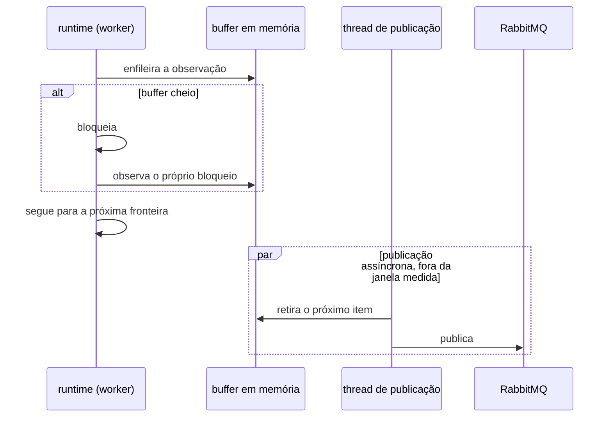
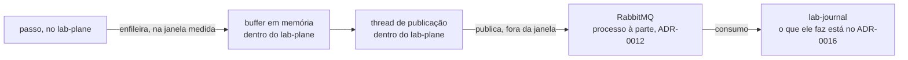

# ADR-0017: A persistência antecipada do log de observações, e o buffer que a alimenta

- **Estado:** Aceito
- **Data:** 2026-08-12
- **Última atualização:** 2026-08-12, por patch — ver `## Patches aplicados`
- **Etapa do roadmap:** 1 — antecipa para a etapa 1 uma persistência que o ADR-0007 havia
  adiado para a etapa 6.
- **Relacionado:** emenda o
  [ADR-0007](0007-o-log-de-observacoes-forma-ordem-e-onde-vive.md) — a seção "Onde o log
  vive" —, o [ADR-0010](0010-a-fronteira-de-schema-e-o-cdc-como-fonte-do-veredito.md) — a
  seção "Negativas" — e o
  [ADR-0011](0011-a-topologia-de-servicos-e-o-caderno-de-laboratorio-fora-do-git.md) — a
  seção "Negativas" —, que recebem `Última atualização` e `Alterado por` no mesmo commit.
  Depende do
  [ADR-0014](0014-o-broker-na-travessia-da-observacao-e-o-cursor-monotonico-do-replay.md),
  dono do broker que carrega o evento até o `lab-journal`. **Divide** o ADR-0014, pela
  sexta forma do lifecycle, aplicada uma segunda vez
  ([`README.md`](README.md#a-divisão-de-um-adr-aceito-decidida-em-2026-08-11)): duas
  subseções de `## Decisão` — "A persistência no `lab-journal` começa na etapa 1, e não
  mais na 6" e "O runtime publica por um buffer em memória, numa thread separada" — mais
  um parágrafo normativo sobre a dispensa da regra de tecnologia, que havia entrado dentro
  de "O evento sai do passo pelo broker" — saíram do corpo do ADR-0014 e vivem aqui,
  vigentes, junto do argumento de `## Justificativa`, `## Consequências`, `## Trade-offs`
  e `## Alternativas consideradas` que os sustentava. **Os dois continuam `Aceito`**, e o
  ADR-0014 recebe `Última atualização` e `Alterado por` no mesmo commit.
- **Origem da divisão:** as duas subseções e o parágrafo normativo tinham entrado no
  corpo do ADR-0014 depois de aceito, em `a5d5777`, sem forma do lifecycle que os
  autorizasse — proibido desde 2026-08-11 pela regra
  [Um ADR aceito não recebe decisão nova](README.md#um-adr-aceito-não-recebe-decisão-nova-decidido-em-2026-08-11).
  A linha
  [`E-64`](../fila-de-decisoes.md#e-64-fecha-em-desfazer-por-divisão-escolhida-em-2026-08-12)
  da fila escolheu desfazer por divisão: o conteúdo não sai de vigor, nasce aqui.

## Contexto

O [ADR-0007](0007-o-log-de-observacoes-forma-ordem-e-onde-vive.md#onde-o-log-vive) pôs o
log de observações em memória, uma sequência apensável por execução, e adiou a
persistência durável para a etapa 6 — o motivo era contenção no PostgreSQL único, e o
[plano](../plano-do-laboratorio.md#quatro-restrições-que-o-mvp-precisa-impor-desde-o-início)
registrava a mesma restrição.

O
[ADR-0014](0014-o-broker-na-travessia-da-observacao-e-o-cursor-monotonico-do-replay.md#o-evento-sai-do-passo-pelo-broker)
decidiu que o evento de observação sai do passo pelo broker, sem decidir quando o
`lab-journal` persiste o que recebe, nem como o `lab-plane` publica sem entrar na janela
medida. A etapa 6 mata o `lab-plane` de propósito
([`AGENTS.md`](../../AGENTS.md#regras-estruturais-que-valem-sempre)), e o que não saiu do
processo antes da queda se perde com ele.

## Problema

**Quando o `lab-journal` persiste a observação, e como o `lab-plane` publica no broker
sem que a travessia de rede entre na janela medida?**

Forças em conflito:

- O log em memória, adiado para a etapa 6, perde tudo se a etapa 6 matar o processo antes
  de a persistência existir.
- Publicar no broker de forma síncrona, dentro do passo, soma uma travessia de rede a
  cada uma das 900 a 1500 fronteiras do E1.
- Uma perda de observação sob pressão não pode ficar silenciosa, sob pena de veredito
  contaminado sem sinal.
- Usar o broker para o buffer também exige a mesma dispensa explícita que o ADR-0014 já
  concedeu para o transporte.

## Decisão

### A persistência no `lab-journal` começa na etapa 1, e não mais na 6

Esta decisão emenda
["Onde o log vive"](0007-o-log-de-observacoes-forma-ordem-e-onde-vive.md#onde-o-log-vive)
do ADR-0007: a regra passa a valer só para o log do **runtime**, em memória. A
persistência no `lab-journal` fica autorizada já na etapa 1.

### O runtime publica por um buffer em memória, numa thread separada

O runtime DEVE enfileirar a observação num buffer em memória, sem esperar a rede; thread
separada publica cada item no broker. Só o enfileiramento — escrita local — permanece na
janela medida.

Quando o buffer enche, o runtime DEVE bloquear até haver espaço, e DEVE registrar o
bloqueio como evento do log: a observação NÃO DEVE se perder em silêncio. Um veredito sob
bloqueio PODE ser descartado por quem lê o relatório.

### A dispensa da regra de tecnologia por conveniência alcança este uso do broker também

A regra de que nenhuma tecnologia entra por estar disponível
([`AGENTS.md`](../../AGENTS.md#regras-estruturais-que-valem-sempre)) fica **dispensada, e
não satisfeita**, para o uso do broker no caminho da observação. A dispensa é desta
decisão: ela NÃO alcança outra tecnologia, e NÃO muda o alcance da dispensa do ADR-0012.

## Justificativa

**Por que antecipar a persistência.** O descarte da alternativa
["Persistir o log agora, em vez de adiar"](0007-o-log-de-observacoes-forma-ordem-e-onde-vive.md#persistir-o-log-agora-em-vez-de-adiar)
era por contenção no banco; ela só mudou de forma — quem persiste é o consumidor do
broker, fora da transação medida, e resta a disputa de I/O das Negativas. Sem antecipar,
a etapa 6 levaria junto o único registro da execução.

**Por que o buffer assíncrono, e por que bloquear e registrar.** O buffer assíncrono tira
a travessia da janela medida do E1, evitando que a rede mude a intercalação real dos
workers: perturbação do instrumento indistinguível de contenção real, a falha nomeada em
[ADR-0008, Justificativa](0008-os-dois-planos-em-processos-separados.md#justificativa).
Bloquear e registrar torna visível a contaminação que o descarte esconderia.

**Por que dispensa, e não satisfação da regra.** A regra manda a tecnologia entrar quando
um experimento **não puder** ser executado sem ela, e o E1 pode: ao vivo bloqueante é o
desenho vigente, e roda. O que o broker compra é medida não contaminada — razão de
qualidade, não de impossibilidade —, e por isso o ato é da mesma espécie que o
[ADR-0012](0012-o-broker-no-caminho-do-veredito-e-a-dispensa-que-ele-exigiu.md#negativas)
classificou como "dispensada, e não satisfeita". Por que escrever a dispensa em vez de
alargar a do ADR-0012 está nas
[alternativas](#emendar-o-adr-0012-para-alargar-a-dispensa-dele).

**Por que emenda, e não substituição.** A regra alterada muda só o gatilho da
persistência — etapa 6 vira etapa 1 —, e o resto de
["Onde o log vive"](0007-o-log-de-observacoes-forma-ordem-e-onde-vive.md#onde-o-log-vive)
permanece; mas o título do ADR-0007 é "...forma, ordem e onde vive": a regra o nomeia. Se
um trecho conta como dar título, ninguém decidiu: `Pergunta em aberto`, na linha
[`E-63`](../fila-de-decisoes.md#e-63--a-emenda-e-o-título-citado-por-trecho). O precedente
são os ADRs 0009, 0010 e 0011, que emendaram regra dentro de `## Decisão` e seguem
`Aceito`; dois deles, 0010 e 0011, registraram a mesma tensão como `Pergunta em aberto`,
sem decidi-la.

## Consequências

### Positivas

- O log sobrevive à queda proposital da etapa 6, a partir do ponto em que o evento chega
  ao broker: a persistência deixa de esperar o fim da execução.
- O bloqueio sob pressão é evento do log, e não silêncio: quem lê o relatório sabe que
  houve contaminação.

### Negativas

- **Broker indisponível enche o buffer e trava todo worker: a execução para.** A cadeia
  está nas
  [negativas do ADR-0012](0012-o-broker-no-caminho-do-veredito-e-a-dispensa-que-ele-exigiu.md#negativas),
  onde um experimento do grupo B enche o broker — o objeto de estudo alcançando o
  instrumento.
- **O buffer se perde se o `lab-plane` morrer antes de a thread esvaziá-lo**, como o
  ADR-0007 já aceitava para o log do runtime
  ([Onde o log vive](0007-o-log-de-observacoes-forma-ordem-e-onde-vive.md#onde-o-log-vive));
  a persistência a jusante **não** repõe o que nunca chegou, e a perda não é sinalizada.
- **A persistência no `lab-journal` soma I/O ao mesmo PostgreSQL do
  `system-under-test`** (`compose.yaml:11-90`); sem lock nem transação disputada na janela
  medida, mas o host sente a escrita.
- **Nem a capacidade do buffer em memória nem a vazão da thread de publicação foram
  fixadas.** A capacidade decide com que frequência um worker bloqueia sob carga alta; a
  vazão decide quanto do buffer sobra por esvaziar a cada instante. Sem as duas não há
  como medir quanto de uma execução se perde numa queda, e nenhum valor foi escolhido
  para nenhuma delas.
- **O evento de bloqueio do buffer não tem tipo, e o conjunto de tipos da
  [forma de um evento](0007-o-log-de-observacoes-forma-ordem-e-onde-vive.md#a-forma-de-um-evento)
  é fechado** — o `BLOQUEIO` de lá é o do escalonador, com o campo `restrito`. A lacuna é
  a linha
  [`E-61`](../fila-de-decisoes.md#e-61--que-tipo-o-evento-de-bloqueio-de-buffer-carrega),
  e sem ela quem lê o log não distingue os dois bloqueios.

### Neutras

- A escolha do broker como transporte, e a dispensa que o ADR-0014 escreveu para esse
  uso, pertencem àquele ADR
  ([Justificativa](0014-o-broker-na-travessia-da-observacao-e-o-cursor-monotonico-do-replay.md#justificativa))
  e não são redecididas aqui. **Se a dispensa desta decisão é uma terceira, ou é aquela
  realocada pela divisão, não está decidido**: o texto dela declara o mesmo escopo — "o
  uso do broker no caminho da observação" —, e o parágrafo chegou aqui movido, e não
  reescrito. A lacuna é a linha
  [`E-84`](../fila-de-decisoes.md#e-84--a-dispensa-do-adr-0017-é-terceira-ou-é-a-segunda-realocada)
  da fila, e nem esta seção nem o `AGENTS.md` antecipam a resposta.

## Trade-offs

- O benefício **o bloqueio nunca é silencioso** foi aceito em troca do custo **o
  instrumento poder parar a execução medida, quando o broker some**.
- O benefício **persistência já na etapa 1** foi aceito em troca do custo **mais I/O no
  PostgreSQL único**.

## Alternativas consideradas

### Descartar a observação quando o buffer enche

**Descartada.** A favor: o worker **nunca** bloqueia, e sob carga alta é o único desenho
em que o instrumento não muda a intercalação que mede — tirar a travessia do caminho
bloqueante fica completo, e não parcial. Perde porque a perda é **silenciosa**: um log
com buraco é indistinguível de um log correto. É o mesmo falso negativo silencioso que o
[ADR-0013](0013-a-proveniencia-da-fonte-como-criterio-da-proibicao-do-oraculo.md#decisão)
recusa para o oráculo do predicado. Bloquear e registrar troca perturbação invisível por
perturbação declarada: um veredito sob bloqueio PODE ser descartado por quem lê o
relatório, e um veredito sobre log truncado não.

### Publish sem confirmação, ou com publisher confirms, sem buffer

**Descartada.** Sem confirmação elimina o round-trip; com publisher confirms, nada se
perde entre `lab-plane` e broker. As duas mantêm a escrita de socket na janela medida:
**reduzem** a travessia, nunca a tiram.

### Emendar o ADR-0012 para alargar a dispensa dele

**Descartada.** A favor: nenhuma dispensa nova a escrever — o RabbitMQ já entrou na árvore
por aquela decisão, e alargar o alcance dela cabe numa emenda. Perde porque **uma dispensa
registrada não é precedente**
([`AGENTS.md`](../../AGENTS.md#regras-estruturais-que-valem-sempre)): alargar a primeira
apagaria o fato de que a segunda foi debatida por si, e quem lesse o ADR-0012 acharia uma
dispensa de dois caminhos sem o argumento do segundo.

## Quando esta decisão deixa de valer

Revise se um experimento saturar ou derrubar o broker de propósito: o bloqueio converte
indisponibilidade de transporte em **parada da execução medida**, e o instrumento passa a
ser interrompido pelo que existe para observar.

Revise também se a contrapressão do broker descartar mensagem sob carga: a garantia de
que nenhuma observação se perde em silêncio cai, e o descarte que esta decisão recusou
volta pela porta dos fundos.

## O que este ADR desfaz fora de si

Esta decisão desatualiza os arquivos abaixo, fora do próprio corpo.

| Documento                                                                                                                                      | O que muda                                                                                                                                                                                                                                                                                                                                                                                                                                                                                                                                                                                                                                                                                                                                                                                                                                       |
|------------------------------------------------------------------------------------------------------------------------------------------------|--------------------------------------------------------------------------------------------------------------------------------------------------------------------------------------------------------------------------------------------------------------------------------------------------------------------------------------------------------------------------------------------------------------------------------------------------------------------------------------------------------------------------------------------------------------------------------------------------------------------------------------------------------------------------------------------------------------------------------------------------------------------------------------------------------------------------------------------------|
| [ADR-0014](0014-o-broker-na-travessia-da-observacao-e-o-cursor-monotonico-do-replay.md#decisão)                                                | **duas subseções de `## Decisão` saem do corpo dele e passam a viver aqui** — "A persistência no `lab-journal` começa na etapa 1, e não mais na 6" e "O runtime publica por um buffer em memória, numa thread separada" —, mais um parágrafo normativo que havia entrado dentro de "O evento sai do passo pelo broker"; com eles saem os trechos de `## Justificativa`, `## Consequências`, `## Trade-offs` e `## Alternativas consideradas` que os sustentavam. É a **divisão**, a sexta forma, aplicada uma segunda vez ([`README.md`](README.md#a-divisão-de-um-adr-aceito-decidida-em-2026-08-11)): os dois ADRs seguem `Aceito`, e o rastro entra no cabeçalho do ADR-0014 no mesmo commit. O título do ADR-0014 já não nomeava o que sai daqui — ele perdeu essa parte na primeira divisão, para o ADR-0016 —, e por isso não muda de novo |
| [`README.md` de ADR, a divisão de um ADR aceito](README.md#a-divisão-de-um-adr-aceito-decidida-em-2026-08-11)                                  | três passagens que descreviam o caso do ADR-0014 como aberto ganham lápide: a que dizia "o cabeçalho do ADR-0014 declara o fato da entrada e não nomeia forma alguma... segue aberto na linha `E-64`" passa a registrar que `E-64` fechou em 2026-08-12; "o caso que originou a regra continua aberto, e ela não o resolve retroativamente" recebe o mesmo tratamento; e "a aplicação retroativa ao ADR-0014 está bloqueada" por `E-64` passa ao pretérito — o bloqueio é o que esta decisão destrava; e a passagem que dizia que o cabeçalho do ADR-0014 "não declara mais o fato de uma entrada sem forma" é corrigida — ele declara, agora como história, e é esse registro que prova que a entrada existiu e foi desfeita                                                                                                                    |
| [ADR-0016, Etapa do roadmap e Contexto](0016-o-streaming-e-o-replay-do-log-de-observacoes.md#contexto)                                         | dois pontos do corpo dele atribuíam ao ADR-0014 a persistência desde a etapa 1 — o campo `Etapa do roadmap` do cabeçalho, e uma frase de `## Contexto`; os dois passam a nomear este ADR. **Patch**, e não emenda: a decisão do ADR-0016 sobre streaming e replay não muda, só a atribuição de quem autoriza a persistência antecipada; registrado em `## Patches aplicados` daquele arquivo                                                                                                                                                                                                                                                                                                                                                                                                                                                     |
| [`AGENTS.md`, Regras estruturais](../../AGENTS.md#regras-estruturais-que-valem-sempre)                                                         | a contagem de dispensas da regra de tecnologia **não** sobe para três por causa desta decisão: o escopo declarado na subseção de dispensa daqui é o mesmo da segunda — "o uso do broker no caminho da observação" —, e se ela é dispensa nova ou é a segunda realocada pela divisão não está decidido. O bullet passa a contar duas, a registrar a terceira como escrita e não contada, e a apontar para a linha [`E-84`](../fila-de-decisoes.md#e-84--a-dispensa-do-adr-0017-é-terceira-ou-é-a-segunda-realocada)                                                                                                                                                                                                                                                                                                                               |
| [ADR-0007, Onde o log vive](0007-o-log-de-observacoes-forma-ordem-e-onde-vive.md#onde-o-log-vive)                                              | passa a valer só para o log do runtime, em memória; a persistência no `lab-journal` fica autorizada já na etapa 1, não mais adiada à etapa 6; emenda registrada no cabeçalho                                                                                                                                                                                                                                                                                                                                                                                                                                                                                                                                                                                                                                                                     |
| [ADR-0007, Positivas](0007-o-log-de-observacoes-forma-ordem-e-onde-vive.md#positivas)                                                          | "Nenhuma tecnologia de persistência é comprometida antes da etapa 6" deixa de ser verdadeira; o corpo do ADR aceito não é editado, e o cabeçalho nomeia esta seção                                                                                                                                                                                                                                                                                                                                                                                                                                                                                                                                                                                                                                                                               |
| [ADR-0007, Trade-offs](0007-o-log-de-observacoes-forma-ordem-e-onde-vive.md#trade-offs)                                                        | "o log é perdível até a etapa 6" deixa de valer para o log persistido, e continua valendo só para o log do runtime, em memória; o corpo não é editado, e o cabeçalho nomeia esta seção                                                                                                                                                                                                                                                                                                                                                                                                                                                                                                                                                                                                                                                           |
| [ADR-0007, Persistir o log agora, em vez de adiar](0007-o-log-de-observacoes-forma-ordem-e-onde-vive.md#persistir-o-log-agora-em-vez-de-adiar) | a alternativa descartada volta a valer, em forma emendada: quem persiste é o consumidor do broker, fora da transação medida; o motivo do descarte — contenção no banco — muda de forma e vira a disputa de I/O das `### Negativas` deste ADR; o corpo não é editado, e o cabeçalho nomeia esta seção                                                                                                                                                                                                                                                                                                                                                                                                                                                                                                                                             |
| [ADR-0007, Quando esta decisão deixa de valer](0007-o-log-de-observacoes-forma-ordem-e-onde-vive.md#quando-esta-decisão-deixa-de-valer)        | o gatilho "quando a etapa 6 introduzir um experimento que derruba o processo" disparou antes, na etapa 1, e por outro motivo — a travessia da observação, e não a queda do processo; o corpo não é editado, e o cabeçalho nomeia esta seção                                                                                                                                                                                                                                                                                                                                                                                                                                                                                                                                                                                                      |
| [ADR-0010, Negativas](0010-a-fronteira-de-schema-e-o-cdc-como-fonte-do-veredito.md#negativas)                                                  | a `Pergunta em aberto` sobre a emissão ao vivo entrar na janela medida fica resolvida — o buffer assíncrono tira a travessia do caminho bloqueante; emenda registrada no cabeçalho                                                                                                                                                                                                                                                                                                                                                                                                                                                                                                                                                                                                                                                               |
| [ADR-0011, Negativas](0011-a-topologia-de-servicos-e-o-caderno-de-laboratorio-fora-do-git.md#negativas)                                        | a `Pergunta em aberto` sobre o que o "resultado" do `lab-journal` inclui fica resolvida — inclui o log evento a evento, persistido desde a etapa 1; emenda registrada no cabeçalho                                                                                                                                                                                                                                                                                                                                                                                                                                                                                                                                                                                                                                                               |
| [plano, Quatro restrições que o MVP precisa impor](../plano-do-laboratorio.md#quatro-restrições-que-o-mvp-precisa-impor-desde-o-início)        | a restrição "o log de observações não escreve no banco sob teste" cai como o plano a justifica — "gravar observações no mesmo PostgreSQL adiciona contenção à medida", e é exatamente esse I/O que as `### Negativas` deste ADR admitem. O que resta em pé é a fronteira de **schema** do ADR-0010, que o log não cruza. O parágrafo ganha lápide, e não é reescrito                                                                                                                                                                                                                                                                                                                                                                                                                                                                             |
| [plano, 9. Decisões deliberadamente adiadas](../plano-do-laboratorio.md#9-decisões-deliberadamente-adiadas)                                    | a linha sobre onde o log de observações é persistido sai do adiado, porque o gatilho da etapa 6 foi antecipado para a etapa 1; e a citação da segunda dispensa naquela seção, que apontava para "O evento sai do passo pelo broker" do ADR-0014, passa a apontar para `## Justificativa` — a subseção antiga já não carrega a dispensa depois da restauração                                                                                                                                                                                                                                                                                                                                                                                                                                                                                     |
| [feature-card.md, Integrações e Riscos](../features/observacao-passo-a-passo/feature-card.md#integrações-e-contratos-afetados)                 | a prosa sobre o buffer assíncrono e a thread de publicação passa a citar este ADR; e **três** linhas de "Riscos e decisões pendentes" passam a citar este ADR, e não mais o ADR-0014 — a do buffer assíncrono tirando a emissão do caminho bloqueante, a da capacidade do buffer e a do tipo do evento de bloqueio                                                                                                                                                                                                                                                                                                                                                                                                                                                                                                                               |
| [example mapping de observação passo a passo](../features/observacao-passo-a-passo/example-mapping.md#perguntas-em-aberto)                     | `P9`, sobre a capacidade do buffer, e `P10`, sobre o tipo do evento de bloqueio, passam a citar este ADR, e não mais o ADR-0014                                                                                                                                                                                                                                                                                                                                                                                                                                                                                                                                                                                                                                                                                                                  |
| [fila de decisões, `E-61`](../fila-de-decisoes.md#e-61--que-tipo-o-evento-de-bloqueio-de-buffer-carrega)                                       | a citação ao ADR que registra a lacuna passa do ADR-0014 para este ADR                                                                                                                                                                                                                                                                                                                                                                                                                                                                                                                                                                                                                                                                                                                                                                           |
| [fila de decisões, `E-63`](../fila-de-decisoes.md#e-63--a-emenda-e-o-título-citado-por-trecho)                                                 | a tensão entre a emenda a "Onde o log vive" e o título do ADR-0007 passa a ser deste ADR, e não mais do ADR-0014, porque a emenda em si mudou de dono                                                                                                                                                                                                                                                                                                                                                                                                                                                                                                                                                                                                                                                                                            |
| [fila de decisões, fecho de `E-36`](../fila-de-decisoes.md#e-36-fecha-no-broker-com-persistência-antes-da-emissão-escolhida-em-2026-08-10)     | a frase que atribuía ao ADR-0014 o registro da perda do buffer como consequência negativa passa a nomear este ADR; e a frase que contava "**dois** artefatos, e não um" passa a contar três, porque o conteúdo que a linha decidiu vive hoje também neste ADR                                                                                                                                                                                                                                                                                                                                                                                                                                                                                                                                                                                    |
| [`contracts/README.md`, Estado](../contracts/README.md#estado-nenhum-contrato-existe)                                                          | a linha do AsyncAPI `lab-plane` → RabbitMQ → `lab-journal` atribuía a dispensa ao ADR-0014 pela âncora de "O evento sai do passo pelo broker", que depois da restauração já não a carrega; a citação passa a `## Justificativa` daquele ADR                                                                                                                                                                                                                                                                                                                                                                                                                                                                                                                                                                                                      |
| [fila de decisões, fecho de `E-66`](../fila-de-decisoes.md#e-66-fecha-em-o-argumento-desce-do-cabeçalho-para-o-corpo-escolhida-em-2026-08-12)  | "A aplicação retroativa ao ADR-0014 está bloqueada" deixa de valer: o fecho de `E-64` a destravou, e o bullet "Nome do arquivo" saiu de argumento para livro-razão. O parágrafo e o nó do diagrama passam ao pretérito, e apontam para `E-83`, que é onde o destino do argumento continua aberto                                                                                                                                                                                                                                                                                                                                                                                                                                                                                                                                                 |
| [feature-card.md, Regras de negócio](../features/observacao-passo-a-passo/feature-card.md#regras-de-negócio)                                   | A `R12` dizia que as observações atravessam "ao vivo, evento por evento", e citava só `0014-...#o-evento-sai-do-passo-pelo-broker` — subseção que a divisão esvaziou do buffer e da thread. Corrigido em 2026-08-12: a regra passa a descrever o enfileiramento no buffer e a publicação por thread separada, e a evidência passa a citar também `#o-runtime-publica-por-um-buffer-em-memória-numa-thread-separada` deste ADR. A proibição de acumular até o fim da execução permanece, porque o buffer é drenado durante a execução, e não ao término dela.                                                                                                                                                                                                                                                                                     |

## Patches aplicados

- **2026-08-12 — `## O que este ADR desfaz fora de si`.** A tabela nomeava o card de
  [observação passo a passo](../features/observacao-passo-a-passo/feature-card.md#integrações-e-contratos-afetados)
  em `## Integrações e contratos afetados` e em `## Riscos e decisões pendentes`, e
  **omitia `## Regras de negócio`**, onde a `R12` daquele card cita a subseção que esta
  divisão
  esvaziou. A linha que faltava foi acrescentada. O patch **não** altera decisão nem
  argumento: ele completa o inventário do que a divisão desatualizou, e o defeito é o
  material de sempre — uma âncora que resolve e deixou de sustentar a afirmação, da
  classe que
  [`E-81`](../fila-de-decisoes.md#e-81--a-citação-entre-aspas-não-tem-verificador-e-ela-quebra-em-silêncio)
  registra como invisível ao `check_citations.py`.

O regime de patch está em [`README.md`](README.md#a-revogação-da-imutabilidade-decidida-em-2026-08-07).
Um patch conserta citação, caminho ou erro material; ele NÃO DEVE alterar a decisão nem o
argumento que a sustentava.
