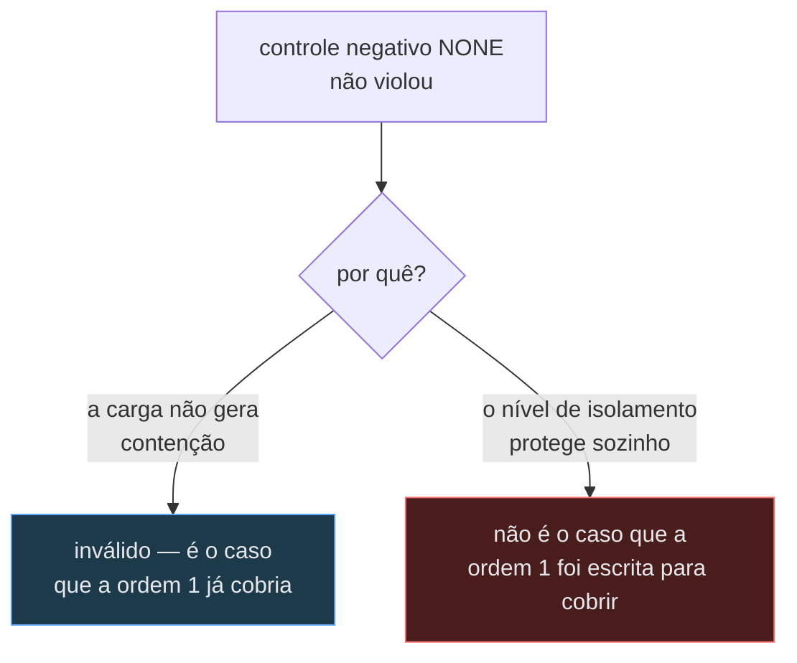
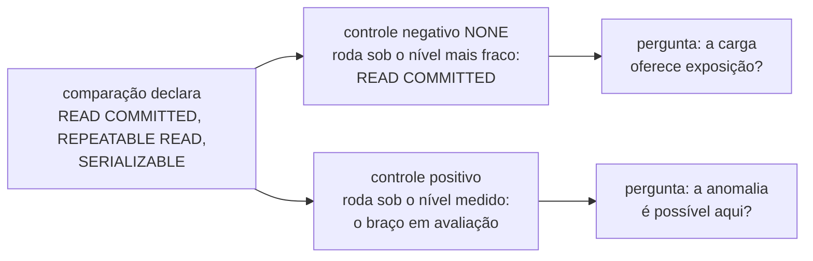
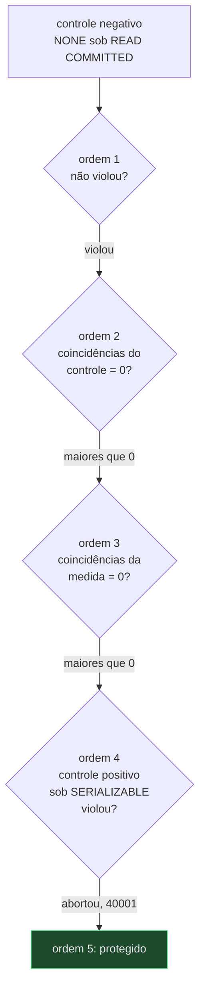

# ADR-0018: Cada controle roda sob o seu próprio nível

- **Estado:** Aceito
- **Data:** 2026-08-12
- **Etapa do roadmap:** 3 — a comparação entre níveis de isolamento é do E5, na etapa 3
  do roadmap incremental
  ([plano, seção 5](../plano-do-laboratorio.md#5-roadmap-incremental)).
- **Relacionado:** decide uma pergunta que o
  [ADR-0004](0004-o-estatuto-da-barreira-e-o-diagnostico-da-nao-ocorrencia.md#o-zero-é-classificado-e-a-classificação-tem-quatro-valores),
  `Aceito`, nunca respondeu — a tabela foi escrita antes de o nível virar eixo comparado,
  e permanece byte a byte. Depende do
  [ADR-0002](0002-o-dominio-minimo-e-os-dois-oraculos.md#o-que-este-adr-não-decide), que
  recusa por escrito decidir onde o nível de isolamento é declarado. O eixo do nível
  separado do eixo da estratégia vem do
  [fecho de `E-87`](../fila-de-decisoes.md#e-87-fecha-em-card-novo-para-a-comparação-entre-níveis-de-isolamento-escolhida-em-2026-08-12).
  Resolve `P6` do Example Mapping de
  [`comparacao-entre-niveis-de-isolamento`](../features/comparacao-entre-niveis-de-isolamento/example-mapping.md#perguntas-em-aberto).
  Enunciado da proposta em
  [`../fila-de-decisoes.md`, `E-89`](../fila-de-decisoes.md#e-89--a-classificação-do-zero-quando-o-nível-de-isolamento-é-o-eixo-variado).

## Contexto

O experimento `write-skew-inert-protection` (E5) ganhou um eixo novo: a capacidade
[`comparacao-entre-niveis-de-isolamento`](../features/comparacao-entre-niveis-de-isolamento/feature-card.md),
aceita pelo fecho de
[`E-87`](../fila-de-decisoes.md#e-87-fecha-em-card-novo-para-a-comparação-entre-níveis-de-isolamento-escolhida-em-2026-08-12),
roda o mesmo experimento sob `READ COMMITTED`, `REPEATABLE READ` e `SERIALIZABLE`, e
compara os três vereditos. Antes dela, cada execução do E5 rodava sob um único nível,
fixo.

O [ADR-0004](0004-o-estatuto-da-barreira-e-o-diagnostico-da-nao-ocorrencia.md), `Aceito`,
classifica um veredito de zero violações em quatro rótulos, avaliados
[na ordem de uma tabela de cinco condições](0004-o-estatuto-da-barreira-e-o-diagnostico-da-nao-ocorrencia.md#o-zero-é-classificado-e-a-classificação-tem-quatro-valores).
A ordem 1 diz: se o controle negativo — a estratégia `NONE` — não viola, o veredito é
`inválido`, e `inválido` NÃO DEVE ser reportado como evidência de proteção. Na escrita da
tabela, só a carga sem contenção fazia `NONE` não violar.

Sob `SERIALIZABLE`, `NONE` também não viola — porque o próprio nível protege a
invariante, sem ação da estratégia de concorrência da aplicação, como o enunciado de
[`E-89`](../fila-de-decisoes.md#e-89--a-classificação-do-zero-quando-o-nível-de-isolamento-é-o-eixo-variado)
e o `Exemplo 7.4` de
[`deteccao-de-protecao-inerte`](../features/deteccao-de-protecao-inerte/example-mapping.md#r7--o-nível-de-isolamento-como-eixo)
registram. Aplicada ao pé da letra, a ordem 1 classificaria o braço `SERIALIZABLE` como
`inválido`, o mesmo rótulo de uma carga fraca demais para expor qualquer coisa. As duas
situações produzem o mesmo zero e pedem vereditos opostos.

O dado que separaria as duas causas já existe: o ADR-0004
[manda contar coincidências em toda execução](0004-o-estatuto-da-barreira-e-o-diagnostico-da-nao-ocorrencia.md#a-plataforma-conta-coincidências),
medida ou de controle, e a ordem 2 já consulta as do controle negativo para separar
violação de janela mal declarada. Sob `SERIALIZABLE` essa contagem é maior que zero — o
nível não bloqueia, só aborta no commit, e as janelas continuam se sobrepondo.

A lacuna foi registrada em
[`../fila-de-decisoes.md`, `E-89`](../fila-de-decisoes.md#e-89--a-classificação-do-zero-quando-o-nível-de-isolamento-é-o-eixo-variado)
como `P6` do Example Mapping de `comparacao-entre-niveis-de-isolamento`, e o
[ADR-0002](0002-o-dominio-minimo-e-os-dois-oraculos.md#o-que-este-adr-não-decide) já
havia recusado, por escrito, decidir onde o nível de isolamento é declarado — pergunta
que segue aberta, e não é o que este ADR responde.

## Problema

**Sob qual nível de isolamento cada controle roda, quando o próprio nível de isolamento é
o eixo que o experimento compara?**

Forças em conflito:

- Honestidade do veredito. Um zero de proteção NÃO DEVE ser rotulado como defeito do
  instrumento, e vice-versa.
- Imutabilidade do ADR-0004. A tabela está `Aceito`, e decisão nova sobre o mesmo tema
  NÃO DEVE alterar o corpo dela, pela regra de
  [`README.md`, Um ADR aceito não recebe decisão nova](README.md#um-adr-aceito-não-recebe-decisão-nova-decidido-em-2026-08-11).
- Comparabilidade. Os três braços precisam do mesmo relatório, sem regra de classificação
  diferente entre eles.
- O que cada controle pergunta. O negativo mede o que a carga oferece; o positivo, o que
  o par (nível, estratégia) permite — perguntas que um nível único obscurece.

## Decisão

O controle negativo de uma execução medida DEVE rodar sob o nível de isolamento mais
fraco entre os declarados pela comparação. O controle positivo DEVE rodar sob o nível
medido no braço em avaliação. A tabela de classificação do
[ADR-0004](0004-o-estatuto-da-barreira-e-o-diagnostico-da-nao-ocorrencia.md#o-zero-é-classificado-e-a-classificação-tem-quatro-valores)
permanece byte a byte: nenhuma condição, nenhuma ordem e nenhum rótulo dela muda.

Nesta capacidade, "proteger" é o veredito `protegido` da tabela do
[ADR-0004](0004-o-estatuto-da-barreira-e-o-diagnostico-da-nao-ocorrencia.md#o-zero-é-classificado-e-a-classificação-tem-quatro-valores).
Um nível que não produz `protegido` não é reportado como proteção, ainda que a invariante
sobreviva por outro motivo.

O nível de isolamento NÃO DEVE entrar na carga declarada que a
[comparabilidade entre contagens](0004-o-estatuto-da-barreira-e-o-diagnostico-da-nao-ocorrencia.md#a-plataforma-conta-coincidências)
exige. Continuam exigidos o mesmo `N`, workers e operação, nada além disso.

Aplicada ao braço `SERIALIZABLE`, a decisão produz o traço abaixo, o mesmo que o
[fecho de `E-89`](../fila-de-decisoes.md#e-89-fecha-em-cada-controle-roda-sob-o-seu-próprio-nível-escolhida-em-2026-08-12)
já descreve para esse braço: o controle negativo, sob `READ COMMITTED`, viola — a ordem 1
não dispara. As coincidências dele são maiores que zero — a ordem 2 não dispara.
`SERIALIZABLE` é SSI e não bloqueia: as janelas continuam se sobrepondo, e as
coincidências da medida também são maiores que zero — a ordem 3 não dispara. O controle
positivo, sob `SERIALIZABLE`, aborta com SQLSTATE `40001` em vez de violar — a ordem 4
não dispara. Sobra a ordem 5: `protegido`, nesse braço.

## Justificativa

**Por que os dois controles rodam sob níveis diferentes.** Eles respondem perguntas
diferentes: o negativo mede a exposição que a carga oferece — propriedade da carga, não
do nível —, e rodá-lo sob o nível medido misturaria "a carga expõe?" com "o nível
protege?", tirando o `NONE` de controle. O positivo mede se a anomalia é possível no par
(nível, estratégia) avaliado.

**Por que o nível mais fraco, e não um nível fixo arbitrário.** A
[ordem 1](0004-o-estatuto-da-barreira-e-o-diagnostico-da-nao-ocorrencia.md#o-zero-é-classificado-e-a-classificação-tem-quatro-valores)
do ADR-0004 já testa se o controle negativo violou — esta decisão fixa sob qual nível ele
roda, não se violará. Por definição — a ordem que "Quando esta decisão deixa de valer",
abaixo, explicita —, o nível mais fraco contribui com o mínimo de proteção do próprio
banco, e isola melhor "a carga expõe?" de "o nível protege?": um nível mais forte
arriscaria reintroduzir a mesma ambiguidade que esta decisão resolve — o nível, e não a
carga, produzindo o zero.

**Por que a tabela do ADR-0004 fica intacta.** O dado que separa as duas causas do zero —
as coincidências do controle negativo — já existia, e a ordem 2 já o consultava; a lacuna
nunca esteve na tabela, e sim na declaração de sob qual nível cada execução roda. Por isso
esta decisão não é emenda, subsunção, substituição nem divisão do ADR-0004, e sim decisão
nova sobre tema que ele nunca cobriu — o lugar dela é ADR próprio, pela regra de
[`README.md`, Um ADR aceito não recebe decisão nova](README.md#um-adr-aceito-não-recebe-decisão-nova-decidido-em-2026-08-11).

**Por que o nível não entra na carga declarada.** A regra de comparabilidade do
[ADR-0004](0004-o-estatuto-da-barreira-e-o-diagnostico-da-nao-ocorrencia.md#a-plataforma-conta-coincidências)
impede comparar contagens de execuções que não rodaram a mesma coisa. O nível não muda
`N`, workers nem operação — muda o que o PostgreSQL faz com o mesmo SQL, exatamente o que
a capacidade quer variar. Incluí-lo faria cada braço declarar carga diferente, proibindo
a própria comparação que a capacidade existe para fazer.

## Consequências

### Positivas

- Pelo traço da `## Decisão`, o braço `SERIALIZABLE` da comparação passa a produzir
  `protegido`, e não `inválido`.
- A tabela do ADR-0004 permanece intacta; a decisão não abre um segundo vocabulário de
  veredito ao lado dela, e generaliza para qualquer experimento futuro cujo eixo
  comparado seja o nível, sem decisão por experimento.

### Negativas

- O controle negativo de um braço `SERIALIZABLE` roda sob nível diferente do medido, e a
  exposição de referência deixa de compartilhar o nível da execução que interpreta — o
  [ADR-0004](0004-o-estatuto-da-barreira-e-o-diagnostico-da-nao-ocorrencia.md#a-plataforma-conta-coincidências)
  já aceitava esse custo para a **estratégia**; esta decisão o estende ao nível.
- A regra pressupõe um "nível mais fraco" bem definido entre os declarados.
  `READ UNCOMMITTED` é declarável no PostgreSQL, mas o servidor o trata como
  `READ COMMITTED`: nenhum nível declarável hoje produz comportamento mais fraco que
  `READ COMMITTED`, e um que produzisse exigiria revisar a definição.

### Neutras

- Um experimento que não varia o nível não é alcançado: os dois controles continuam
  rodando sob o único nível declarado, como já rodavam. `R12` de
  `execucao-de-experimento` continua correta sem edição — esta decisão fixa um dado de
  entrada da classificação, não a classificação em si.

## Trade-offs

- Ganha-se **o braço `SERIALIZABLE` afirmando `protegido`, e a tabela do ADR-0004 byte a
  byte**; custa-se **o controle negativo deixar de compartilhar o nível da execução
  medida, e a regra viver num ADR à parte** — quem lê só o ADR-0004 não vê por que
  `SERIALIZABLE` deixa de ser `inválido`.

## Alternativas consideradas

### Alternativa A — o nível entra na carga, e cada braço tem controle negativo próprio sob o mesmo nível

O controle negativo de cada braço roda sob o nível daquele braço, e o nível de isolamento
passa a integrar a carga declarada, ao lado de `N`, workers e operação.

**Descartada.** Trata os três braços de forma simétrica — mais simples que a assimetria
escolhida —, mas sob `SERIALIZABLE` `NONE` também não viola, como o
[enunciado de `E-89`](../fila-de-decisoes.md#e-89--a-classificação-do-zero-quando-o-nível-de-isolamento-é-o-eixo-variado)
registra: o braço volta a cair na ordem 1 como `inválido`, e a alternativa reproduz o
problema, não o resolve, exigindo um segundo vocabulário de veredito para "protegido"
fora da tabela do ADR-0004.

### Alternativa B — qualificar a ordem 1 pelas coincidências do controle negativo

A ordem 1 passa a exigir duas condições — "o controle negativo não viola **e** as
coincidências dele são zero" — para produzir `inválido`. Não violou mas coincidências
maiores que zero segue adiante.

**Descartada.** Resolveria o problema sem ADR novo, com o mesmo dado que a Justificativa
aponta. Perde porque qualificar a ordem 1 **é** editar a decisão do ADR-0004 — de "não
violou" para "não violou e sem coincidências" —, e isso não cabe em patch: patch conserta
citação, caminho ou erro material, e NÃO DEVE alterar a decisão. A saída escolhida
alcança o mesmo resultado sem tocar em condição nenhuma da tabela.

### Alternativa C — lacuna aceita, "protege" em prosa e `protegido` como veredito conceitualmente distintos

O card de comparação usa "protege" sem amarrá-la ao `protegido` do ADR-0004: os dois
convivem como conceitos próximos, mas formalmente distintos, e a decisão de uni-los fica
adiada.

**Descartada.** Custa zero decisão, e adia o problema: produz dois sentidos para a mesma
raiz — "proteger" — no mesmo repositório, sem nada no relatório que diga qual está em uso.
Um relatório que lê "protegido" não saberia se é o veredito formal do ADR-0004 ou a
descrição informal do card.

## Quando esta decisão deixa de valer

Reveja esta decisão quando a comparação passar a incluir um nível mais fraco que
`READ COMMITTED`, ou quando dois níveis empatarem por "mais fraco" sem ordem total
conhecida — o PostgreSQL hoje ordena os três em
`READ COMMITTED < REPEATABLE READ < SERIALIZABLE`.

Reveja também se o controle negativo, sob o nível mais fraco, deixar de violar de forma
repetida numa carga que já expôs sob outro nível — sinal de que o nível mais fraco deixou
de garantir o que esta decisão pressupõe.

## O que este ADR desfaz fora de si

| Documento                                                                                                                                                                                                                                                                                                                                                                                                         | O que fica desatualizado                                                                                                                                                                                                                                                         |
|-------------------------------------------------------------------------------------------------------------------------------------------------------------------------------------------------------------------------------------------------------------------------------------------------------------------------------------------------------------------------------------------------------------------|----------------------------------------------------------------------------------------------------------------------------------------------------------------------------------------------------------------------------------------------------------------------------------|
| [`comparacao-entre-niveis-de-isolamento`, Example Mapping](../features/comparacao-entre-niveis-de-isolamento/example-mapping.md#perguntas-em-aberto)                                                                                                                                                                                                                                                              | Corrigido no mesmo commit: `P6` ganha referência a este ADR, com o enunciado mantido.                                                                                                                                                                                            |
| [`comparacao-entre-niveis-de-isolamento`, Example Mapping](../features/comparacao-entre-niveis-de-isolamento/example-mapping.md#exemplos-concretos)                                                                                                                                                                                                                                                               | Corrigido no mesmo commit: a linha `R1, contraexemplo` deixa de dizer que o braço `SERIALIZABLE` não conclui proteção — desde este ADR, ele conclui `protegido` pela ordem 5.                                                                                                    |
| [`comparacao-entre-niveis-de-isolamento`, Feature Card](../features/comparacao-entre-niveis-de-isolamento/feature-card.md#riscos-e-decisões-pendentes)                                                                                                                                                                                                                                                            | Corrigido no mesmo commit: o item resolvido passa a nomear o que foi resolvido — "'protege' é o `protegido` do `ADR-0004`" —, em vez de só apontar para este ADR sem dizer o quê, e o rótulo deixa claro que ele já não é pendente, para não se confundir com os itens ao redor. |
| [`comparacao-entre-niveis-de-isolamento`, Feature Card](../features/comparacao-entre-niveis-de-isolamento/feature-card.md#links)                                                                                                                                                                                                                                                                                  | Corrigido no mesmo commit: a entrada do `ADR-0004` deixa de dizer "a classificação que `P6` questiona" — `P6` está resolvida, não questionando —; e ganha entrada própria para este ADR.                                                                                         |
| [`comparacao-entre-niveis-de-isolamento`, Feature Card](../features/comparacao-entre-niveis-de-isolamento/feature-card.md#problema-e-resultado-esperado), [#integrações-e-contratos-afetados](../features/comparacao-entre-niveis-de-isolamento/feature-card.md#integrações-e-contratos-afetados) e [#critérios-de-pronto](../features/comparacao-entre-niveis-de-isolamento/feature-card.md#critérios-de-pronto) | Reformulados no mesmo commit, dentro do orçamento de 5.500 caracteres: mantêm a cláusula causal de `OPTIMISTIC` sob `READ COMMITTED`, "nenhum contrato formaliza isso hoje" e "não um rótulo único que colapse os dois eixos" — nenhum fato, regra ou citação se perde.          |
| [`execucao-de-experimento`, Feature Card](../features/execucao-de-experimento/feature-card.md#regras-de-negócio)                                                                                                                                                                                                                                                                                                  | Corrigido no mesmo commit: duas regras novas, `R16` e `R17`, nascem `pendente` — sob qual nível cada controle roda quando o nível é o eixo comparado, e que o nível não entra na carga declarada de `R11`. `R1` a `R15` não são tocadas.                                         |
| [`execucao-de-experimento`, Feature Card](../features/execucao-de-experimento/feature-card.md#fora-de-escopo)                                                                                                                                                                                                                                                                                                     | Corrigido no mesmo commit: a frase passa a dizer, sem ambiguidade, que sob qual nível cada controle roda é deste ADR — o que já estava decidido —, distinguindo isso de onde o nível é declarado e de como a execução o leva à conexão, que continuam sem decisão.               |
| [`docs/features/README.md`, índice](../features/README.md#índice)                                                                                                                                                                                                                                                                                                                                                 | Corrigido no mesmo commit: a coluna `Regras` de `execucao-de-experimento` passa de 15 para 17, com as duas novas `pendente`; a nota sobre a contagem de regras aprovadas é ajustada de propósito.                                                                                |
| [`docs/adr/README.md`, índice](README.md#índice)                                                                                                                                                                                                                                                                                                                                                                  | Corrigido no mesmo commit: um ADR novo exige linha no índice. Nada mais do arquivo é tocado.                                                                                                                                                                                     |
| [`../fila-de-decisoes.md`, fecho de `E-89`](../fila-de-decisoes.md#e-89-fecha-em-cada-controle-roda-sob-o-seu-próprio-nível-escolhida-em-2026-08-12)                                                                                                                                                                                                                                                              | Corrigido no mesmo commit: ganha uma frase apontando para este ADR, para quem chega pela fila encontrar o artefato. O texto que a pessoa fechou não é alterado.                                                                                                                  |

O [ADR-0004](0004-o-estatuto-da-barreira-e-o-diagnostico-da-nao-ocorrencia.md) **não**
entra nesta lista: a tabela de classificação do zero permanece correta como está escrita,
porque o que faltava era um dado de entrada que ela nunca declarou, não uma condição,
ordem ou rótulo dela.

## Patches aplicados

Nenhum patch aplicado.

O regime de patch está em [`README.md`](README.md#a-revogação-da-imutabilidade-decidida-em-2026-08-07).
Um patch conserta citação, caminho ou erro material; ele NÃO DEVE alterar a decisão nem o
argumento que a sustentava.
