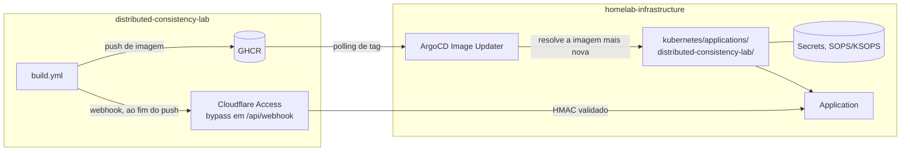
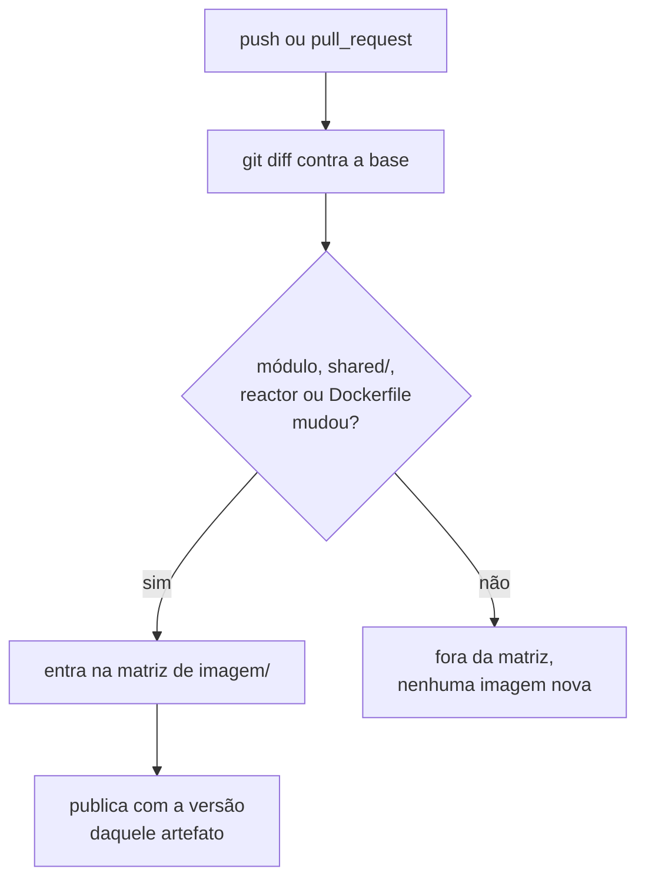
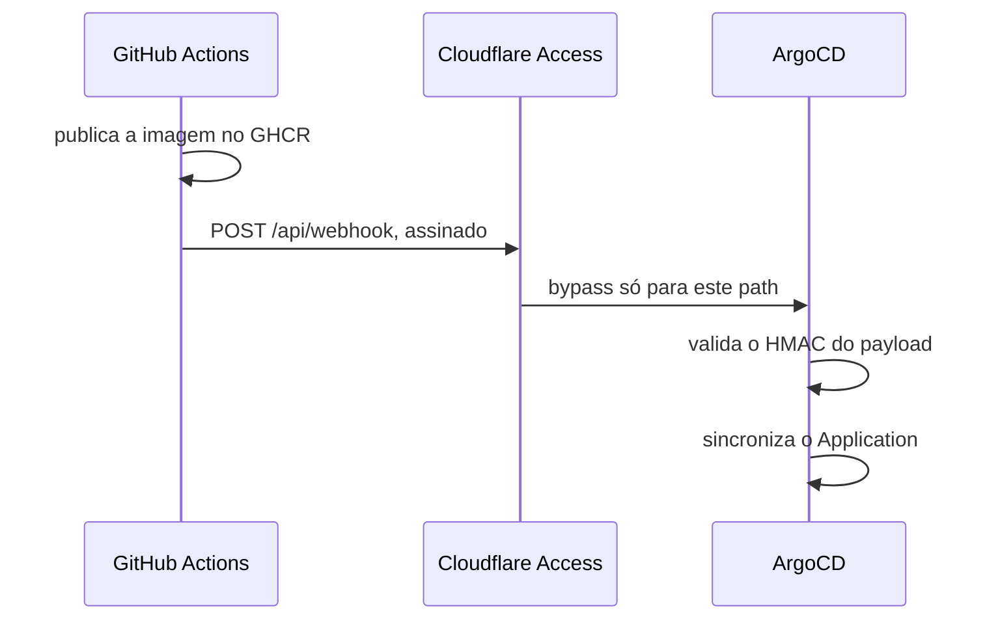

# ADR-0019: A entrega sai do `deploy/`, e a imagem ganha tag semântica

- **Estado:** Aceito
- **Data:** 2026-08-13
- **Etapa do roadmap:** 1 — a exigência de nascer entregando segue valendo desde o
  primeiro módulo compilável.
- **Relacionado:** [ADR-0008](0008-os-dois-planos-em-processos-separados.md), que esta
  decisão **emenda** (ver "O que este ADR desfaz fora de si"), e
  [ADR-0011](0011-a-topologia-de-servicos-e-o-caderno-de-laboratorio-fora-do-git.md), cuja
  topologia é a que o `Application` do ArgoCD relata em `ComparisonError`; opera sobre o
  `cdc_connector` do
  [ADR-0012](0012-o-broker-no-caminho-do-veredito-e-a-dispensa-que-ele-exigiu.md#decisão)
  sem alterá-lo, e passa a honrar seu `DEVE` de réplica única alhures (ver Decisão).

## Contexto

O pipeline publica imagem desde `E-1`, decidida em 2026-08-06
([`../fila-de-decisoes.md`](../fila-de-decisoes.md#as-decisões-do-grupo-i-em-2026-08-06)):
`mvn verify`, o build do frontend e, só depois, imagens no GHCR. `E-4` — o que o pipeline
executa — segue **aberta**, sem fecho registrado; o comportamento atual só coincide com a
recomendação lá escrita, e essa coincidência não é decisão. A tag era o SHA do commit,
guardrail do
[`AGENTS.md`](../../AGENTS.md#este-repositório-é-entregue-no-homelab). O `deploy/` que
apontaria as imagens para o cluster nunca nasceu: `E-3` ficou **adiada**, e o
`Application` do ArgoCD segue em `ComparisonError`
([`architecture/integrations.md`](../architecture/integrations.md#matriz)).

`E-21`, pular o build do módulo que não mudou, ficou presa à mesma adiada: faltava
número de tempo de build, e um módulo pulado deixaria `ghcr.io/.../<módulo>:<sha>`
inexistente para todo manifesto que o referenciasse.

O contrato de entrega vive na ADR 0017 do
[`homelab-infrastructure`](https://github.com/da0hn/homelab-infrastructure/blob/master/docs/adr/0017-cicd-das-aplicacoes-no-github-actions.md),
aceita dois dias antes do replanejamento que descartou a arquitetura descrita: GHCR com
tag de SHA, `deploy/` no monorepo com bump por `kustomize edit set image` e
`GITHUB_TOKEN`, sync só por polling.

## Problema

- Onde os manifests podem viver sem que a reorganização frequente da árvore deste
  repositório vire remoção de workload, com o ArgoCD rodando `prune: true`?
- Como continuar dizendo qual imagem produziu qual resultado se pular o módulo intocado
  deixa de garantir que os quatro artefatos compartilhem tag?
- Como o ArgoCD aprende de uma imagem nova sem o polling de ~3 min, sem abrir um endpoint
  fora do perímetro do Cloudflare Access?
- Como o cluster ganha replicação lógica para o CDC sem duplicar o PostgreSQL
  compartilhado que `E-5` já fixou?

## Decisão

### Os manifests vivem no `homelab-infrastructure`, e `deploy/` não nasce aqui

Os manifests vivem no
[`homelab-infrastructure`](https://github.com/da0hn/homelab-infrastructure), em
`kubernetes/applications/distributed-consistency-lab/`, junto dos Secrets cifrados por
SOPS/KSOPS. Este repositório **não** cria `deploy/`: a ausência vira decisão, não lacuna.
Fecha
[`E-3`](../fila-de-decisoes.md#e-3-fecha-em-manifests-no-homelab-infrastructure-escolhida-em-2026-08-13)
por escolha, e não por adiamento.

### A tag da imagem é a versão do artefato, mais o número do build

A tag passa a ser `X.Y.Z-<build>`. `X.Y.Z` vem do `pom.xml` do reactor, e do
`frontend/package.json` para o quarto artefato (`.github/workflows/build.yml:123-134`);
`<build>` é `github.run_number`, monotônico e nunca repetido
(`.github/workflows/build.yml:215-220`, tag em `:266`, label em `:271`). O SHA passa a
viver no label OCI `org.opencontainers.image.revision`, e não na tag.

### O build pula o módulo intocado, com matriz montada a partir do diff

O job `mudancas` monta a matriz a partir do `git diff` contra a base do push/PR
(`.github/workflows/build.yml:136-146`), e um módulo fora da lista não entra na matriz do
job `imagem` (`.github/workflows/build.yml:190-201`). `shared/`, o reactor, o `Dockerfile`
e o próprio workflow alcançam os três executáveis Java — mudar qualquer um reconstrói os
três. Sem base de comparação utilizável, a matriz nasce completa. Fecha
[`E-21`](../fila-de-decisoes.md#e-21-fecha-em-pular-com-matriz-dinâmica-montada-do-diff-escolhida-em-2026-08-13).

### O ArgoCD é notificado por webhook, atrás de um bypass de path no Cloudflare Access

O GitHub notifica o ArgoCD por webhook ao fim do `push`. O Cloudflare Access que protege
o ArgoCD ganha um bypass restrito a `/api/webhook`, validado pelo HMAC do próprio webhook
— o bypass não abre o resto do painel. O recurso de exposição é `IngressRoute` do
Traefik, já usado noutro serviço do `homelab-infrastructure`:
[`kubernetes/messaging/rabbitmq/ingressroute.yaml`](https://github.com/da0hn/homelab-infrastructure/blob/master/kubernetes/messaging/rabbitmq/ingressroute.yaml).

### O PostgreSQL compartilhado da Camada 6 ganha replicação lógica

O cluster CNPG compartilhado ganha `wal_level=logical`, `max_replication_slots`,
`max_wal_senders` e um role com `REPLICATION`, mantendo `E-5` intacta — o mesmo cluster
do Keycloak e das demais cargas da Camada 6
([`E-5`](../fila-de-decisoes.md#e-5-decidida-contra-a-recomendação-e-o-que-ela-arrasta)). O
custo é aceito por escrito: o cluster reinicia, e toda carga passa a escrever WAL
maior.

### A réplica única do `lab-plane` passa a ser critério de aceite na issue #2

O `DEVE` de réplica única do **`lab-plane`**, e só dele, do
[ADR-0012, Decisão](0012-o-broker-no-caminho-do-veredito-e-a-dispensa-que-ele-exigiu.md#decisão)
perde, sem `deploy/` aqui, o lugar onde era honrado, e vira critério de aceite —
`replicas: 1` normativo, não dimensionamento — na
[issue #2](https://github.com/da0hn/homelab-infrastructure/issues/2#issuecomment-5275342462).
A pendência sem solução é a que o
[`AGENTS.md`](../../AGENTS.md#este-repositório-é-entregue-no-homelab) já nomeia: um
experimento que sobe deliberadamente uma segunda instância roda sob `selfHeal`, sem
solução decidida — `Pergunta em aberto` em `E-95`.

### O `selfHeal` permanece, e a folga vai para a probe de liveness

`selfHeal: true` continua ligado. A liveness verifica só que o processo responde, com
folga acima da maior latência que um experimento do grupo D pode produzir. **Nenhum
experimento do grupo D foi executado**, e por isso não há número medido para a folga —
resolve a metade do kubelet.

## Justificativa

**Risco, não fato:** `deploy/` aqui expunha a árvore a remoção de workload pelo
`prune: true` do ArgoCD a cada reorganização — `deploy/` já sumiu uma vez, mas por
limpeza de árvore deste repositório, no commit `e1c88ae`, e o `Application` nunca saiu de
`ComparisonError` para sincronizar workload nenhum
([`plano-do-laboratorio.md`, "O acoplamento já existe, e não é hipotético"](../plano-do-laboratorio.md#o-acoplamento-já-existe-e-não-é-hipotético)).
Manifests e Secrets juntos fecham a distância que a ADR 0017 abriu.

A tag por módulo e o pular do build intocado decorrem uma da outra: sem ela, pular um
módulo deixaria sua tag inexistente para todo manifesto que a referenciasse. Com o Image
Updater resolvendo cada imagem pela própria tag mais recente, nada exige que as quatro
compartilhem versão. O Image Updater não entra pela regra de tecnologia por conveniência
deste repositório: ele é instalado e justificado do lado do `homelab-infrastructure`
([issue #3](https://github.com/da0hn/homelab-infrastructure/issues/3)), e não por decisão
daqui.

O webhook substitui o polling de ~3 min do ArgoCD, o padrão de `timeout.reconciliation`
sem override
([`homelab-infrastructure`, Feature 01](https://github.com/da0hn/homelab-infrastructure/blob/master/docs/features/01-bootstrap-gitops.md)),
sem abrir o perímetro do Cloudflare Access: o bypass é restrito a um path, validado por
HMAC — a mesma defesa que a ADR 0017 do homelab já usa noutros serviços.

A replicação lógica no compartilhado é o único jeito de o CDC alcançar o WAL sem duplicar
a instância de `E-5`.

O `selfHeal` não decorre do problema acima: é resposta a um risco que a fila registra sem
resolver. A escolha é aceitar a lacuna pela metade, e não deixar as duas sem decisão.

## Consequências

### Positivas

- A árvore pode ser reorganizada sem novo risco de remoção de workload por `prune: true`
  — condicionado ao fecho da issue #2; até lá o `Application` ainda aponta para cá.
- Uma imagem publicada continua permitindo dizer qual resultado produziu —
  `run_number` é monotônico e não se repete, a mesma garantia que o SHA dava.
- O build deixa de gastar runner com módulo que um commit não tocou.
- O rollout deixa de esperar o polling do ArgoCD.

### Negativas

- Uma aplicação passa a ser descrita em dois repositórios; mudar a infraestrutura de
  entrega exige tocar os dois — custo que o resto da Camada 8 já paga.
- O cluster CNPG compartilhado reinicia para ligar `wal_level=logical`, e toda carga que
  ele hospeda passa a escrever WAL maior, sem ter pedido.
- O `Application` segue em `ComparisonError` até os manifests existirem lá —
  [issue #2](https://github.com/da0hn/homelab-infrastructure/issues/2).
- A folga da probe de liveness não tem número medido: nenhum experimento do grupo D
  rodou até hoje.

### Neutras

- O gargalo de latência muda de dono: do polling do ArgoCD (~3 min) para o do Image
  Updater, ainda não medido.
- `IngressRoute` do Traefik confirma pergunta que `entrega-continua.md` deixava não
  verificada; não decide nada novo.

## Trade-offs

- **A reorganização deixa de arriscar o cluster**, em troca de **a aplicação viver em
  dois repositórios**.
- **Build mais barato, por módulo**, em troca de **SHA virar versão, com o SHA num
  label**.
- **Rollout sem esperar ~3 min**, em troca de **um path exposto no Cloudflare Access,
  restrito e validado por HMAC**.
- **CDC alcança o WAL sem cluster dedicado**, em troca de **reinício, e WAL maior para
  cargas que não pediram**.

## Alternativas consideradas

### `deploy/` neste repositório, com bump por `kustomize edit set image`

**Descartada.** Item 3 da ADR 0017 do homelab: job único, fora da matriz, commitando o
bump com o `GITHUB_TOKEN`. Perde porque o `prune: true` alcança este repositório, que se
reorganiza com frequência — uma limpeza removeria workload do cluster.

### Manifests no homelab, com bump automatizado por este repositório

**Descartada**, em duas variantes. Bump direto pelo CI exigiria deploy key **read-write
da infraestrutura inteira**, como secret em repositório público — o que a ADR 0017 do
homelab já rejeita por escrito. `repository_dispatch` para bump no homelab encadeia dois
workflows em dois repositórios, e o rastreio de falha atravessa os dois.

### Manter o SHA como tag, e publicar também uma tag semântica para o mesmo digest

**Descartada.** Não habilita pular o módulo intocado: a tag de SHA precisaria existir
para os quatro, mesmo os que o commit não tocou, já que um manifesto que a referenciasse
exigiria as quatro na mesma versão.

### Matriz dinâmica com retag do SHA anterior

**Descartada.** Alternativa 1 de `E-21`. Depende de localizar o SHA anterior de cada
módulo, o que depende de retenção de imagem no GHCR — dependência que a escolhida não
tem.

### Não pular o build de módulo nenhum

**Descartada.** Recomendação de `E-21`, por falta de número. O número existe agora,
medido por `gh run view`: `lab-plane` levou 2m49s com cache frio em 2026-08-07, contra
24s com cache quente em 2026-08-11. Rodar os quatro builds sempre gasta runner sem
necessidade quando um commit toca um módulo só.

### Ajustar ou manter o `timeout.reconciliation` do ArgoCD, sem webhook

**Descartada.** Item 6 da ADR 0017 do homelab. Reduzir o parâmetro aumentaria a carga de
reconciliação em todo `Application` do cluster; mantê-lo soma ~3 min de rollout ao custo
de cada execução medida — custo que o resto da Camada 8 aceita e este laboratório deixa
de precisar aceitar.

### PostgreSQL dedicado ao namespace do laboratório

**Descartada.** Alternativa 2 de `D-ARQ-11`, já fechada no compartilhado por `E-5`.
Reabri-la significaria reabrir `E-5`, que esta decisão mantém intacta.

## Quando esta decisão deixa de valer

Revise o webhook se o Image Updater produzir latência maior que os ~3 min que
substitui. Revise a probe quando o primeiro experimento do grupo D rodar.

## O que este ADR desfaz fora de si

| Documento                                                                                                                              | O que muda                                                                                                            |
|----------------------------------------------------------------------------------------------------------------------------------------|-----------------------------------------------------------------------------------------------------------------------|
| [ADR-0008](0008-os-dois-planos-em-processos-separados.md#negativas)                                                                    | **emenda**: "o `deploy/` nasce com dois `Deployment`" (`### Negativas`) deixa de valer — `deploy/` não nasce aqui     |
| [`AGENTS.md`](../../AGENTS.md#este-repositório-é-entregue-no-homelab)                                                                  | a tag deixa de ser o SHA; `deploy/` deixa de estar "aberta na fila" e passa a nunca nascer aqui, por decisão          |
| [`architecture/integrations.md`](../architecture/integrations.md#matriz)                                                               | a seção de entrega e as linhas da matriz que descreviam `deploy/`, o bump e o `ComparisonError` sem decisão associada |
| [`adr/fila-de-decisoes.md`](../fila-de-decisoes.md#o-que-esta-fila-enfileira)                                                          | recebe o fecho de `E-3` e de `E-21`, cada um citando este ADR                                                         |
| [`features/distincao-entre-higiene-e-invalidacao/feature-card.md`](../features/distincao-entre-higiene-e-invalidacao/feature-card.md)  | `E-3` deixa de estar aberta; R5 ganha onde a réplica única é honrada                                                  |
| [`.../distincao-entre-higiene-e-invalidacao/example-mapping.md`](../features/distincao-entre-higiene-e-invalidacao/example-mapping.md) | P5 e o "Adiado de propósito" de `E-3` disparam; o gatilho fechou                                                      |
| [`contracts/README.md`](../contracts/README.md#o-que-existe-hoje-no-lugar-de-contrato)                                                 | a linha de manifests de entrega passa a citar este ADR como decisão, e não coincidência                               |

Só o ADR-0008 é alterado, e só por emenda (linha acima): nada aqui contradiz, generaliza,
ajusta ou substitui regra de outro ADR aceito. A ADR 0017 do `homelab-infrastructure`,
linkada no `## Contexto`, tem os itens 2, 3 e 6 contrariados; vive em outro repositório,
fora do lifecycle desta série, e o alinhamento é rastreado pelas issues
[#1](https://github.com/da0hn/homelab-infrastructure/issues/1) a
[#6](https://github.com/da0hn/homelab-infrastructure/issues/6) de lá.

## Patches aplicados

Nenhum patch aplicado.

O regime de patch está em [`README.md`](README.md#a-revogação-da-imutabilidade-decidida-em-2026-08-07).
Um patch conserta citação, caminho ou erro material; ele NÃO DEVE alterar a decisão nem o
argumento que a sustentava.
