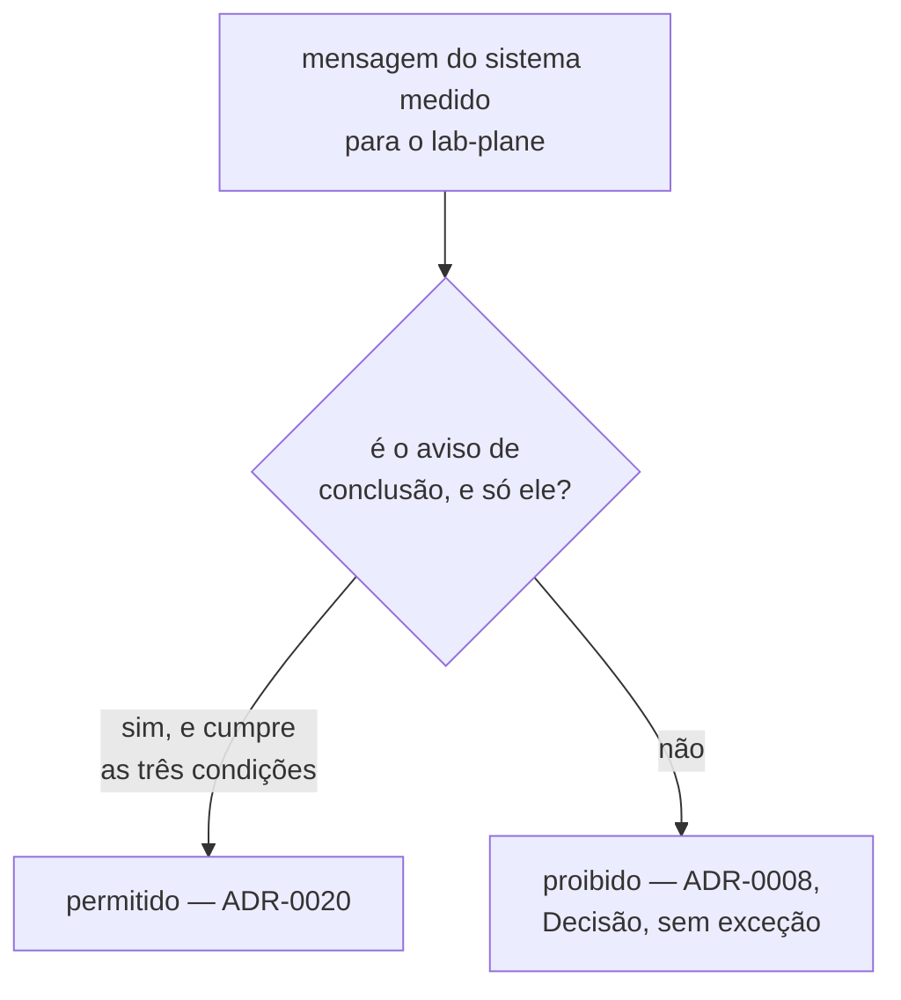

# ADR-0020: O aviso de conclusão, e a subsunção da proibição do ADR-0008

- **Estado:** Aceito
- **Data:** 2026-08-14
- **Etapa do roadmap:** 1 e 3 — mesma etapa do
  [ADR-0010](0010-a-fronteira-de-schema-e-o-cdc-como-fonte-do-veredito.md), que fixa o
  WAL como fonte do veredito; o aviso de conclusão sustenta a guarda contra a falha
  desse transporte, tanto para o oráculo exato quanto para o oráculo do predicado.
- **Relacionado:** subsume o
  [ADR-0008](0008-os-dois-planos-em-processos-separados.md#decisão), na seção
  "Decisão": a frase "O Control Plane NÃO DEVE chamar o Lab Plane" continua valendo sem
  mudança para a chamada de passo, e esta decisão recorta o alcance da proibição para
  admitir o aviso de conclusão. Sustenta a `R4` de
  [deteccao-de-divergencia-entre-fontes](../features/deteccao-de-divergencia-entre-fontes/feature-card.md#regras-de-negócio).

## Contexto

O [ADR-0008](0008-os-dois-planos-em-processos-separados.md#decisão) fixa, na seção
"Decisão", sem qualificar: "O Control Plane NÃO DEVE chamar o Lab Plane." O
"## Contexto" do mesmo ADR define o Control Plane como o sistema sob teste
([ADR-0008, Contexto](0008-os-dois-planos-em-processos-separados.md#contexto)). O
diagrama da mesma seção desenha essa aresta com o rótulo `proibido`.

O card
[deteccao-de-divergencia-entre-fontes](../features/deteccao-de-divergencia-entre-fontes/feature-card.md)
precisa que o sistema medido avise o `lab-plane` de que uma execução terminou, por
callback HTTP disparado e esquecido, fora da janela medida — `R4` do card
([deteccao-de-divergencia-entre-fontes, Regras de
negócio](../features/deteccao-de-divergencia-entre-fontes/feature-card.md#regras-de-negócio)),
no sentido que a letra do ADR-0008 proíbe. O próprio card registrou essa tensão
([deteccao-de-divergencia-entre-fontes, example-mapping, A tensão com o
ADR-0008](../features/deteccao-de-divergencia-entre-fontes/example-mapping.md#a-tensão-com-o-adr-0008)),
porque um card NÃO PODE contradizer ADR aceito, e este ADR é a resposta a ela.

A "Justificativa" do ADR-0008 argumenta por que processos separados, por que a região
no primeiro segmento do pacote e por que inglês em todo identificador — nunca por que o
sentido inverso é proibido
([ADR-0008, Justificativa](0008-os-dois-planos-em-processos-separados.md#justificativa)).
Dois trechos fora dela sustentam a proibição. O primeiro, em "Consequências" /
"Positivas": "A direção proibida do ADR-0001 (`:93-95`) deixa de depender de
verificação: não existe import a escrever entre os dois planos."
([ADR-0008, Consequências](0008-os-dois-planos-em-processos-separados.md#positivas)). O
segundo, em "Quando esta decisão deixa de valer": "O mecanismo que mantém a transação
aberta entre chamadas exigir que o Control Plane chame o Lab Plane. A direção de
dependência do ADR-0001 não sobreviveria à fronteira de rede, e a topologia muda antes
do mecanismo."
([ADR-0008, Quando esta decisão deixa de
valer](0008-os-dois-planos-em-processos-separados.md#quando-esta-decisão-deixa-de-valer)).

E o [ADR-0001](0001-o-passo-como-unidade-de-execucao.md#decisão), na seção "Decisão",
decide isto: "O runtime chama o passo. O passo NÃO DEVE chamar o runtime."
([ADR-0001, Decisão](0001-o-passo-como-unidade-de-execucao.md#decisão)).

## Problema

- A proibição do ADR-0008 está escrita sem qualificação — "O Control Plane NÃO DEVE
  chamar o Lab Plane" — e alcançaria, pela letra, qualquer mensagem nesse sentido.
- Os dois fundamentos registrados para ela — em "Consequências" e em "Quando esta
  decisão deixa de valer", citados acima — apontam para a mesma regra sobre o
  mecanismo de passo
  ([ADR-0001, Decisão](0001-o-passo-como-unidade-de-execucao.md#decisão)).
- O aviso de conclusão que `R4` exige não é chamada de passo: não entrega resultado,
  não devolve controle ao runtime, e nenhuma fronteira o consulta.
- Um card NÃO PODE contradizer ADR aceito; sem separar os dois casos, a capacidade fica
  bloqueada por uma proibição cujo fundamento não a alcança.

## Decisão

**A proibição do ADR-0008 continua valendo por inteiro para a chamada de passo, e para
toda mensagem do sistema medido para o `lab-plane` que não seja o aviso de conclusão.**
O sistema medido PODE avisar a conclusão de uma execução por um callback HTTP,
disparado e esquecido, fora da janela medida — e só isso.

Três condições delimitam a permissão, e a violação de qualquer uma devolve a mensagem à
proibição original:

1. O aviso NÃO DEVE carregar resultado, veredito ou qualquer dado de domínio. Ele
   apenas informa que uma execução terminou.
2. O aviso NÃO DEVE retornar valor ao sistema medido, nem bloqueá-lo à espera de
   resposta — ele é disparado e esquecido.
3. A impossibilidade de entregar o aviso NÃO DEVE alterar nada no sistema medido. Uma
   entrega que falha é apenas ausência de sinal para o `lab-plane`, nunca uma condição
   que o sistema medido observa ou à qual reage.

Qualquer outra mensagem do sistema medido para o `lab-plane` — com resultado, resposta
a uma pergunta do instrumento, ou que altere uma operação — continua proibida pela
letra do ADR-0008, sem exceção.

O diagrama de "Decisão" do ADR-0008 marca a aresta Control Plane → Lab Plane como
`proibido`; este ADR não o redesenha, e a leitura combinada dos dois é: `proibido`,
exceto o aviso de conclusão nas três condições acima.

## Justificativa

**A cadeia de evidência que sustenta a subsunção.** O ADR-0008 não argumenta a
proibição em seção própria — os dois trechos citados no Contexto, em "Consequências" e
em "Quando esta decisão deixa de valer", são o que a sustenta, e os dois apontam para a
mesma regra do
[ADR-0001, Decisão](0001-o-passo-como-unidade-de-execucao.md#decisão): "o runtime
chama o passo" e "o passo NÃO DEVE chamar o runtime" — uma regra sobre o **mecanismo de
execução de um passo dentro de uma tentativa**, e não sobre toda comunicação possível
entre os dois processos.

A proibição do ADR-0008 é a generalização dessa regra, escrita sem a qualificação que a
origem carregava. "O passo NÃO DEVE chamar o runtime" virou "o Control Plane NÃO DEVE
chamar o Lab Plane" quando os dois planos passaram a rodar em processos separados —
generalização correta para a chamada de passo, cuja verificabilidade o ADR-0008 queria
garantir sem import a escrever. O aviso de conclusão não é essa chamada: nenhuma
fronteira de passo o invoca, ele não devolve controle a uma sequência de passos em
curso, e não carrega fato que o runtime interprete como resultado de um passo — existe
**depois** de a janela medida encerrar, fora de qualquer tentativa em andamento. Por
isso o recorte não contradiz o primeiro fundamento: o risco que ele nomeia é o sistema
medido participar da execução de um passo como se fosse o runtime, e o aviso não
participa de passo nenhum — é emitido depois que todos os passos já terminaram.

**Por que o segundo fundamento reforça a subsunção, e não a derruba.** O gatilho que
ele nomeia é específico — manter a transação aberta entre chamadas —, o mesmo mecanismo
de passo do ADR-0001, e não qualquer mensagem no sentido inverso. O aviso não mantém
transação aberta, e existe depois de a janela medida encerrar, fora de tentativa
alguma: não é o gatilho que o bullet descreve, e o remédio que ele prescreve — mudar a
topologia antes do mecanismo — está amarrado a esse gatilho. O bullet aponta de novo
para a direção de dependência do ADR-0001: os **dois** fundamentos apontam para a mesma
regra sobre passo, e a cadeia fica mais forte.

**As três exigências da subsunção**
([`README.md`, Substituição e
subsunção](README.md#substituição-e-subsunção-são-coisas-diferentes)):

- **A regra subsumida está citada pelo texto e pela seção de origem.** "O Control Plane
  NÃO DEVE chamar o Lab Plane", no `## Decisão` do ADR-0008
  ([ADR-0008, Decisão](0008-os-dois-planos-em-processos-separados.md#decisão)).
- **O caso em que ela continua valendo sem mudança está dito.** A chamada de passo, e
  toda mensagem que não seja o aviso de conclusão nas três condições de "Decisão" —
  nenhuma muda de estatuto.
- **Ela não é contradita em caso nenhum.** Os dois fundamentos, lidos pela cadeia
  acima, apontam para o mecanismo de passo do ADR-0001. O aviso de conclusão não é esse
  mecanismo, e por isso não contradiz **a regra antiga**, e não apenas o motivo dela —
  a distinção importa porque o `README.md` registra como descartada a alternativa de
  "alargar a subsunção trocando a terceira exigência por 'não contradiz a decisão
  principal'"
  ([`README.md`, A emenda](README.md#a-emenda-terceira-forma-ao-lado-da-substituição-e-da-subsunção)),
  porque isso apagaria a informação que `Alterado por: subsunção` existe para carregar
  — se a regra antiga ainda vale. Este ADR não se apoia nessa alternativa: ele separa
  "casos que ela tratava como um só", a definição literal da subsunção na mesma página
  ([`README.md`, Substituição e
  subsunção](README.md#substituição-e-subsunção-são-coisas-diferentes)), sem reescrever
  a proibição em si.

Por que emenda e substituição não servem — com o argumento a favor de cada uma antes do
motivo técnico da recusa — está em "Alternativas consideradas".

## Consequências

### Positivas

- `R4` de
  [deteccao-de-divergencia-entre-fontes](../features/deteccao-de-divergencia-entre-fontes/feature-card.md#regras-de-negócio)
  deixa de contradizer ADR aceito, e o card passa a citar este ADR em vez de registrar a
  tensão como pendência.
- A proibição do ADR-0008 continua fazendo o trabalho para o qual foi escrita: nenhum
  import passa a existir entre os dois planos, e a chamada de passo continua vedada.
- A cadeia entre a proibição do ADR-0008 e o ADR-0001 fica escrita pela primeira vez —
  o ADR-0008 nunca a explicitou fora de frases dispersas.

### Negativas

- **A proibição do ADR-0008 deixa de ser absoluta.** Toda mensagem nova exige o mesmo
  teste que este ADR aplicou — se é mecanismo de passo ou não —, em vez de uma leitura
  direta da letra.
- O ADR-0008 acumula uma quinta linha em `Alterado por`, e quem o lê precisa também
  deste ADR para saber o alcance exato da proibição hoje.
- **Pergunta em aberto.** Se a permissão deveria alcançar mensagens além do aviso de
  conclusão — por exemplo, um segundo aviso informando um erro irrecuperável do próprio
  experimento — não foi decidido. O escopo é estreito de propósito: só o aviso de
  conclusão, nas três condições de "Decisão". Alargamento exige decisão própria da
  pessoa, e este ADR não a antecipa.

### Neutras

- A leitura da aresta `proibido` do diagrama do ADR-0008 passa a exigir este ADR
  também; o diagrama em si não é redesenhado.

## Trade-offs

- O benefício **`R4` deixa de contradizer ADR aceito, com fundamento na própria cadeia
  de evidência do ADR-0008** foi aceito em troca do custo **a proibição do ADR-0008
  deixa de ser lida numa frase só, e passa a exigir a leitura deste ADR também**.

## Alternativas consideradas

### Emendar o ADR-0008

**Descartada.** A favor: emenda é vocabulário mais leve, com o mesmo efeito prático.
Perde porque a regra a mudar é a própria frase de `## Decisão`, e a emenda **NÃO DEVE**
tocar nela
([`README.md`, A emenda](README.md#a-emenda-terceira-forma-ao-lado-da-substituição-e-da-subsunção)).

### Substituir o ADR-0008

**Descartada.** A favor: `Estado: Substituído` avisa, numa palavra só, que algo mudou.
Perde porque a decisão de processos separados continua de pé — `Substituído` diria que
saiu de vigor, e não saiu; só uma exceção estreita foi aberta a uma frase dela.

### Alargar a permissão para qualquer mensagem do sistema medido ao `lab-plane`

**Descartada.** A favor: uma regra única, sem o teste caso a caso que este ADR
introduz. Perde porque não há decisão da pessoa autorizando esse alcance — alargar em
silêncio inventaria decisão, e o card registrava a tensão como pendência, não como
pedido de permissão ampla.

### Deixar a contradição registrada só no card, sem ADR

**Descartada.** A favor: nenhum documento novo. Perde porque um card NÃO PODE
contradizer ADR aceito
([`AGENTS.md`, ao trabalhar aqui](../../AGENTS.md#ao-trabalhar-aqui)); o caminho é um
ADR — que recorte a proibição, ou a mantenha e obrigue `R4` a mudar de desenho.

### O aviso trafegar pelo broker em vez de HTTP

**Descartada.** A favor: nenhuma chamada direta, e o sentido proibido sumiria da
topologia sem tocar em ADR aceito. Perde porque o sistema medido ganharia dependência
de broker por propósito experimental — tensiona a exigência de ele ser ingênuo — e a
regra de tecnologia por conveniência exigiria dispensa nova, escrita por inteiro
([`AGENTS.md`, Regras estruturais que valem sempre](../../AGENTS.md#regras-estruturais-que-valem-sempre)).

### O `lab-plane` descobrir o fim da execução por conta própria

**Descartada.** A favor: o sistema medido não saberia que está sendo medido. Perde
porque sondar dentro da janela medida é o que `R1` e `R5` do card proíbem
([deteccao-de-divergencia-entre-fontes, Regras de
negócio](../features/deteccao-de-divergencia-entre-fontes/feature-card.md#regras-de-negócio)),
e sem sonda não há gatilho para a comparação.

### O aviso sair do desenho, e o card ser alinhado ao ADR-0008

**Descartada.** A favor: nenhuma decisão aceita seria tocada. Perde porque a
comparação perderia o gatilho, e `R1` voltaria a não ter quando disparar.

### Adendo, divisão ou patch no ADR-0008

**Descartadas.** A favor das três: nenhuma exige numerar um ADR novo. O adendo perde
porque "NÃO DEVE contradizer o corpo"
([`README.md`, O adendo](README.md#o-adendo-quarta-forma-e-a-única-que-acrescenta-seção)),
e qualificar a proibição contradiz. A divisão perde porque o que sai por ela vale "com
o mesmo conteúdo normativo"
([`README.md`, A divisão de um ADR
aceito](README.md#a-divisão-de-um-adr-aceito-decidida-em-2026-08-11)), e aqui o
conteúdo normativo é o que muda. O patch perde porque "NÃO DEVE alterar o que foi
decidido"
([`README.md`, O que é patch, e o que não
é](README.md#o-que-é-patch-e-o-que-não-é)).

## Quando esta decisão deixa de valer

Revise esta decisão se uma mensagem do sistema medido para o `lab-plane`, além do aviso
de conclusão, precisar existir — uma regra de negócio nova, aprovada por pessoa,
exigindo que o sistema medido notifique o instrumento de algo além de "esta execução
terminou". O escopo estreito para de bastar, e a extensão exige um ADR próprio, nunca
uma leitura alargada deste.

## O que este ADR desfaz fora de si

| Documento                                                                                                                                                            | O que muda                                                                                                                                                                                                                                                                                                                                                                          |
|----------------------------------------------------------------------------------------------------------------------------------------------------------------------|-------------------------------------------------------------------------------------------------------------------------------------------------------------------------------------------------------------------------------------------------------------------------------------------------------------------------------------------------------------------------------------|
| [ADR-0008](0008-os-dois-planos-em-processos-separados.md#decisão)                                                                                                    | **subsunção**, registrada em `## Decisão` e `## Justificativa` deste ADR: "O Control Plane NÃO DEVE chamar o Lab Plane" continua valendo por inteiro para a chamada de passo, e passa a admitir o aviso de conclusão nas três condições da seção "Decisão" deste ADR. Rastro no cabeçalho, `Última atualização` e `Alterado por`, no mesmo commit.                                  |
| [`features/deteccao-de-divergencia-entre-fontes/feature-card.md`](../features/deteccao-de-divergencia-entre-fontes/feature-card.md#integrações-e-contratos-afetados) | "Integrações e contratos afetados" passa a citar este ADR como o que resolveu a tensão com `R4`. "Riscos e decisões pendentes" perde o bullet que registrava essa tensão, sem citação nova — a tensão deixou de ser risco. "Links" troca a nota do ADR-0008, de "tensionado por R4" para "tensão com R4 resolvida pelo ADR-0020", e ganha uma linha própria para este ADR.          |
| [`features/deteccao-de-divergencia-entre-fontes/example-mapping.md`](../features/deteccao-de-divergencia-entre-fontes/example-mapping.md#a-tensão-com-o-adr-0008)    | a pergunta sobre a tensão com o ADR-0008 sai de "Perguntas em aberto"; o conteúdo dela passa para a nova subseção "A tensão com o ADR-0008", em "Alternativas descartadas nas decisões de 2026-08-14", com o desfecho; "Adiado de propósito" e "O que não virou cenário, e por quê" passam a contar três lacunas, não quatro.                                                       |
| [`architecture/integrations.md`](../architecture/integrations.md#matriz)                                                                                             | a linha `system-under-test` → `lab-plane` deixa de descrever a decisão como "tensiona a letra do ADR-0008, sem resolução", e passa a citar este ADR como o que a permitiu. A linha `lab-plane` → `system-under-test` da chamada de passo, cujo mecanismo já dizia "sentido inverso proibido", ganha a ressalva "exceto o aviso de conclusão", e a evidência passa a citar este ADR. |

## Patches aplicados

Nenhum patch aplicado.

O regime de patch está em [`README.md`](README.md#a-revogação-da-imutabilidade-decidida-em-2026-08-07).
Um patch conserta citação, caminho ou erro material; ele NÃO DEVE alterar a decisão nem o
argumento que a sustentava.
