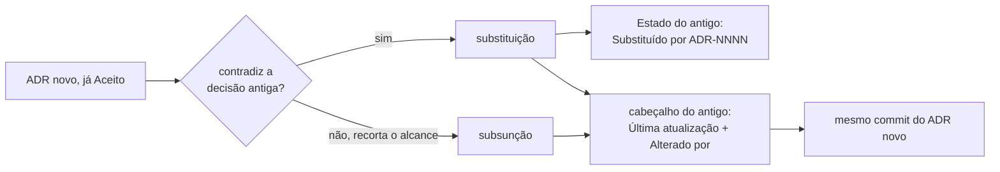
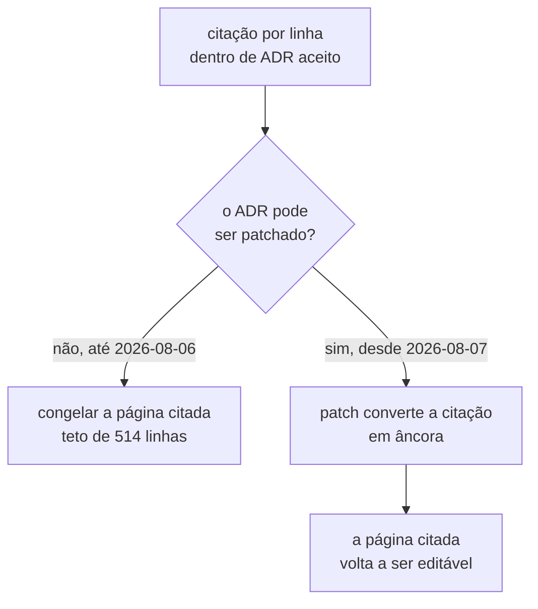
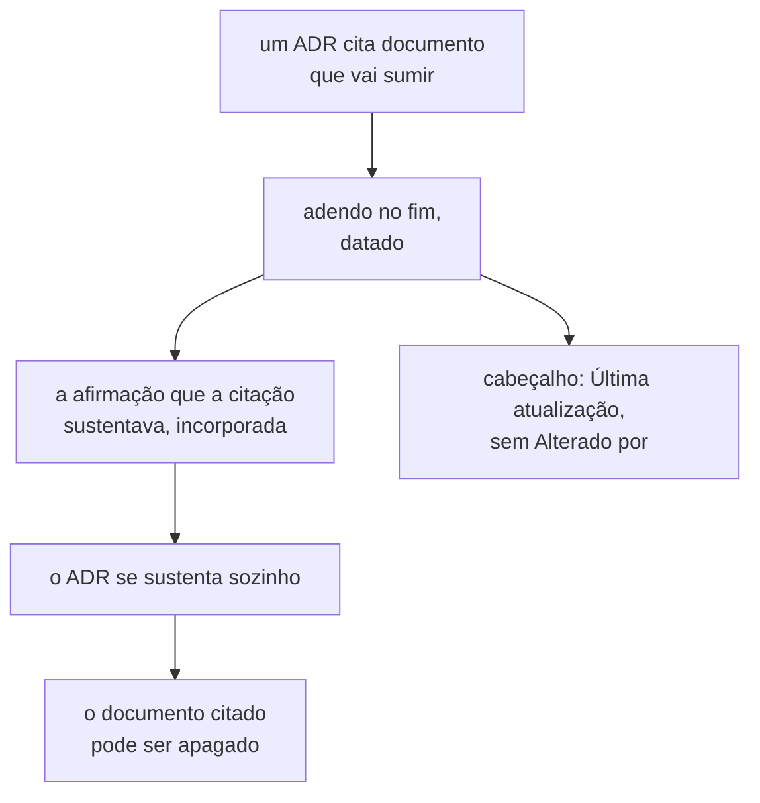
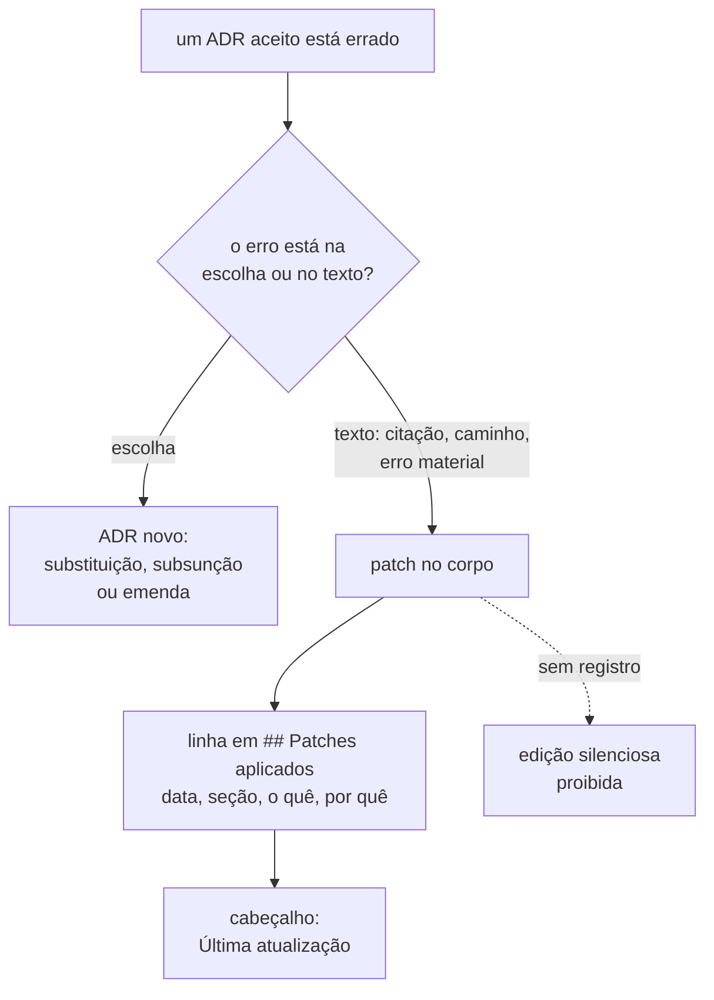

# Architecture Decision Records

Decisões de arquitetura do Distributed Systems Experiment Lab.

## O que é um ADR

Um ADR registra uma decisão de arquitetura e o motivo dela. Um ADR não é documentação de
código. O código mostra *o que* o sistema faz. O ADR mostra *por que* o sistema é assim,
e **o que foi descartado e por quê**.

Escreva o ADR **antes** de implementar. Um ADR escrito depois vira justificativa.

## Uma decisão merece ADR quando

- possui alternativas plausíveis;
- tem impacto arquitetural duradouro;
- cria restrições futuras;
- representa um trade-off importante.

Decisão trivial não vira ADR. Escolher o nome de uma variável, a versão de patch de uma
biblioteca ou o formato de um log não atende a nenhum dos quatro critérios.

## Convenções

- Numeração sequencial de quatro dígitos. Nunca reutilize um número **dentro da série
  corrente**.
- Nome do arquivo: `NNNN-titulo-em-kebab-case.md`. O template oficial está em
  [`.claude/skills/adr/references/adr.md`](../../.claude/skills/adr/references/adr.md).
- Idioma: português do Brasil, com acentuação correta. Frases de 10 a 20 palavras. Voz
  ativa. Uma ideia por frase. Linhas quebradas manualmente em ~88 colunas.
- Um conceito tem **um** nome. Escolhido "passo", nunca alterne para "etapa", "estágio"
  ou "fase" no parágrafo seguinte.
- `## Decisão` carrega só o **quê**. O porquê vive em `## Justificativa`, e a comparação
  vive em `## Alternativas consideradas`. Quem lê anos depois precisa distinguir o que
  está em vigor do argumento que o sustentava na época.
- `## Trade-offs` é obrigatório, no formato "o benefício **X** foi aceito em troca do
  custo **Y**". Positivas e Negativas dizem o que aconteceu; o par diz o que foi trocado
  pelo quê.
- Requisito normativo usa RFC 2119 traduzida, em caixa alta: `DEVE`, `NÃO DEVE`,
  `DEVERIA`, `NÃO DEVERIA`, `PODE`. Nunca como ênfase. Um requisito escrito assim pode
  virar teste; escrito como prosa descritiva, não pode. `DEVE` marca o que a plataforma
  rejeita ou impede; `DEVERIA` marca a recomendação que alguém PODE contrariar com
  motivo.
- Palavras proibidas sem número ou fato que as sustente: `talvez`, `provavelmente`,
  `geralmente`, `normalmente`, `aproximadamente`, `adequado`, `corretamente`,
  `rapidamente`, `eficiente`, `simples`, `robusto`. Explique o motivo em vez de
  qualificar com advérbio.
- Substitua pronome ambíguo ("ele", "ela", "isso") pelo substantivo, sempre que houver
  risco de dúvida.
- A seção `## Alternativas consideradas` costuma valer mais que a `## Decisão`. Cada
  alternativa leva um parágrafo começando com `**Descartada.**` e um motivo **técnico**.
  Não construa espantalhos: se a alternativa tem argumento legítimo a favor, reconheça-o
  e mostre por que perde.
- Todo fluxo apresentado no ADR vai **também** como diagrama Mermaid, num bloco
  `mermaid` junto do parágrafo que o descreve. Use `sequenceDiagram` para troca de
  chamadas e ordem no tempo, e `flowchart` para topologia e hierarquia. A prosa e o
  diagrama descrevem o mesmo fluxo, e quem lê escolhe por onde entrar. Excalidraw serve
  ao desenho que o Mermaid não expressa; exporte para `.excalidraw.svg` ao lado do ADR,
  porque o SVG renderiza no GitHub e continua editável. Diagrama que não acrescenta nada
  à prosa fica de fora.
- **Limite de 12.000 caracteres de prosa. Diagrama, bloco de código e tabela não entram
  na contagem.** Os três são densos em caracteres e pobres em prosa: um `flowchart` de
  dez nós custa mais que a seção que ele ilustra. Contá-los punia exatamente o que estas
  convenções exigem — todo fluxo vai **também** como Mermaid, e toda afirmação leva
  evidência —, e o corte acabava saindo do diagrama ou da citação. O limite mede prosa,
  que é o único lugar onde encher linguiça é possível. Quem conta é
  [`check_artifact_limits.py`](../../.claude/skills/feature-planning/scripts/check_artifact_limits.py);
  rode-o em vez de estimar. **O corte sai da prosa, nunca da evidência** — um ADR que só
  cabe removendo citação cobre mais de uma decisão, e o caminho é dividi-lo.
- **A seção `## Patches aplicados` não entra na contagem**, desde 2026-08-07: nada dali
  para baixo é medido. Ela é livro-razão de manutenção, e não argumento. Sem a isenção,
  torná-la obrigatória estouraria o limite de todo ADR que estivesse perto dele — os
  ADRs 0011 e 0012 passaram de cerca de 11.990 para 12.265 caracteres só por ganhá-la —,
  e a única saída seria encolher a prosa de um ADR aceito, que é exatamente o que um
  patch NÃO DEVE fazer. O limite empurraria para a reescrita do argumento.
- `## Quando esta decisão deixa de valer` precisa de um sinal concreto e observável, não
  de uma intenção vaga.
- Sem emojis. Sem linguagem de marketing. Nada de "a melhor solução", "a solução ideal"
  ou "a abordagem moderna" — troque opinião por fato observável.

Antes de apresentar um ADR, verifique: existe **uma** decisão só? O problema está claro?
A justificativa está separada da decisão? As alternativas têm motivo de rejeição? Os
trade-offs estão explícitos? As consequências trazem custos **e** benefícios? Sobrou
palavra vaga ou linguagem opinativa? O texto continua compreensível sem conhecimento
prévio?

## Duas séries, e como citá-las

A numeração foi reiniciada em 2026-07-28. Existem duas séries no repositório, e um mesmo
número aparece nas duas com significados diferentes.

| Forma de citar | Onde vive                       | O que é                   |
|----------------|---------------------------------|---------------------------|
| `ADR-0001`     | `docs/adr/`                     | **série corrente**        |
| `arquivo/0001` | [`docs/adr/arquivo/`](arquivo/) | primeira série, arquivada |

Use sempre o prefixo `arquivo/` ao citar a série antiga. Sem ele, a referência é
ambígua.

O motivo do arquivamento e o que sobreviveu estão em
[`arquivo/README.md`](arquivo/README.md) e em
[`../plano-do-laboratorio.md`](../plano-do-laboratorio.md), seção 10.

## Estados

| Estado          | Significado                                           |
|-----------------|-------------------------------------------------------|
| `Proposto`      | A decisão está em discussão.                          |
| `Aceito`        | A decisão está em vigor.                              |
| `Substituído`   | Um ADR mais recente substitui esta decisão.           |
| `Descontinuado` | A decisão não se aplica mais. Nenhum ADR a substitui. |

## Índice

| ADR                                                                            | Título                                                                  | Estado   |
|--------------------------------------------------------------------------------|-------------------------------------------------------------------------|----------|
| [0001](0001-o-passo-como-unidade-de-execucao.md)                               | O passo como unidade de execução, observação e injeção de falha         | `Aceito` |
| [0002](0002-o-dominio-minimo-e-os-dois-oraculos.md)                            | O domínio mínimo: contador com oráculo exato e predicado de capacidade  | `Aceito` |
| [0003](0003-a-linguagem-do-agendamento.md)                                     | A linguagem do agendamento: como uma barreira é declarada               | `Aceito` |
| [0004](0004-o-estatuto-da-barreira-e-o-diagnostico-da-nao-ocorrencia.md)       | O estatuto da barreira e o diagnóstico da não ocorrência                | `Aceito` |
| [0005](0005-a-forma-do-escalonador.md)                                         | A forma do escalonador: estado, decisão e protocolo de desistência      | `Aceito` |
| [0006](0006-a-forma-da-estrategia-de-concorrencia.md)                          | A forma da estratégia de concorrência: contrato plugável e calibração   | `Aceito` |
| [0007](0007-o-log-de-observacoes-forma-ordem-e-onde-vive.md)                   | O log de observações: forma, ordem e onde vive                          | `Aceito` |
| [0008](0008-os-dois-planos-em-processos-separados.md)                          | Os dois planos em processos separados, desde o dia zero                 | `Aceito` |
| [0009](0009-a-classificacao-do-dual-write-e-a-regiao-de-pacote.md)             | A classificação do dual write e a região de pacote do sistema sob teste | `Aceito` |
| [0010](0010-a-fronteira-de-schema-e-o-cdc-como-fonte-do-veredito.md)           | A fronteira de schema e o CDC como fonte do veredito                    | `Aceito` |
| [0011](0011-a-topologia-de-servicos-e-o-caderno-de-laboratorio-fora-do-git.md) | A topologia de serviços e o caderno de laboratório fora do Git          | `Aceito` |
| [0012](0012-o-broker-no-caminho-do-veredito-e-a-dispensa-que-ele-exigiu.md)    | O broker no caminho do veredito, e a dispensa que ele exigiu            | `Aceito` |
| [0013](0013-a-proveniencia-da-fonte-como-criterio-da-proibicao-do-oraculo.md)  | A proveniência da fonte como critério da proibição do oráculo           | `Aceito` |
| [0015](0015-a-chave-o-discriminador-de-execucao-e-as-colunas-de-tempo.md)      | A chave, o discriminador de execução e as colunas de tempo              | `Aceito` |

O planejamento está em [`../plano-do-laboratorio.md`](../plano-do-laboratorio.md). Ele
**não decide nada** — é a análise que define quais decisões precisam ser tomadas e em
que ordem.

## Processo de debate

**Desde 2026-08-04, um ADR nasce `Aceito`.** Ele registra decisão já tomada pela pessoa,
durante o planejamento, e não decisão em debate. Escrever ADR deixou de ser obrigatório:
a escolha que não atende aos quatro critérios acima gera artefato de
[`../features/`](../features/README.md), e nenhum ADR. O processo está em
[`../specification-process.md`](../specification-process.md), seção "A decisão vem antes
do artefato".

O debate passou a acontecer na **fila de decisões**, antes de existir documento. As duas
subseções abaixo descrevem o caminho `Proposto`, que continua disponível e deixou de ser
o padrão.

Os ADRs são debatidos **um por um**. Nenhum é aceito por omissão, e nenhum é aceito sem
aprovação explícita.

O contexto da conversa é limpo a cada ADR refinado. Por isso vale uma regra dura:

> **Nada que importa pode existir apenas na conversa.**

Toda objeção levantada durante o debate é escrita na seção `## Questões em aberto` do
próprio ADR, **no mesmo turno em que é levantada**, antes de responder ou perguntar
qualquer outra coisa. Uma objeção que fica só no chat desaparece no próximo compact, em
silêncio.

Um ADR está pronto para ser aceito quando nenhuma questão dele tem status `aberto` ou
`aberto (crítico)`. Questão com status `encaminhado` não bloqueia a aceitação — ela
pertence a outro ADR já identificado na fila. Questão com status `resolvida` também não
bloqueia: ela foi fechada durante o debate, e a subseção dela diz onde.

Ao aceitar, a seção `## Questões em aberto` é removida. O que foi decidido passa para
`## Decisão` ou `## Consequências`. Cada questão com status `encaminhado` é transportada
para um arquivo em [`docs/questions/`](../questions/README.md), **inteira e no mesmo
commit da
aceitação**. Um ADR NÃO DEVE ser aceito enquanto suas questões encaminhadas não
estiverem transportadas: o enunciado se perde, e a linha da fila que o citava fica
pendurada.

**A imutabilidade do corpo de um ADR aceito foi revogada em 2026-08-07.** Um ADR aceito
PODE receber **patch**, e todo patch é registrado na seção `## Patches aplicados` do
próprio arquivo. A regra está em
[A revogação da imutabilidade](#a-revogação-da-imutabilidade-decidida-em-2026-08-07).

Um ADR aceito continua não sendo **apagado**, e patch não muda **decisão**. Para mudar a
decisão, escreva um ADR novo e marque o antigo como `Substituído por ADR-NNNN`.

### Substituição e subsunção são coisas diferentes

Um ADR novo que **contradiga** a decisão de um aceito o substitui. O antigo recebe
`Substituído por ADR-NNNN`, e o que ele decidiu sai de vigor.

Um ADR novo PODE, em vez disso, **subsumir** uma regra de um aceito. A subsunção
acontece quando a regra antiga continua correta no caso que ela enxergava, e o ADR novo
separa casos que ela tratava como um só. O ADR antigo permanece `Aceito`, e a regra
continua valendo com o alcance que o ADR novo lhe der.

Três exigências separam a subsunção da edição disfarçada:

- o ADR que subsume DEVE citar a regra subsumida pelo texto e pela seção de origem;
- ele DEVE dizer em que caso a regra antiga continua valendo sem mudança;
- ele NÃO DEVE contradizer a regra antiga em caso nenhum. Se contradisser, é
  substituição, e a substituição é o caminho.

O **corpo** do ADR antigo NÃO DEVE ser reescrito pela subsunção. Quem o lê isolado lê o
que se decidiu na época. Corpo é tudo a partir da primeira seção `##`: contexto,
problema, decisão, justificativa, consequências, trade-offs e alternativas. Desde
2026-08-07 esse corpo PODE receber **patch**, que é outra coisa: patch conserta citação,
caminho ou erro material, e NÃO DEVE alterar o que foi decidido nem o argumento que o
sustentava.

Registrado em 2026-07-31, para resolver a questão 1 do ADR-0004.

### O rastro de alterações, emendado em 2026-08-04

Até 2026-08-04 nada era escrito no ADR antigo. O custo estava registrado nesta mesma
seção: "a leitura de um ADR aceito deixa de bastar por si. Uma regra dele PODE ter
alcance recortado por um documento posterior que ele não cita, porque não existia quando
ele foi escrito." O índice desta página lista títulos, e um título não diz qual regra de
qual ADR foi recortada.

**Instrução do usuário, adotada em 2026-08-04: o ADR alterado passa a apontar para quem
o alterou.** Vale nos dois casos — substituição e subsunção — e alcança também o ADR
cuja regra teve o alcance recortado sem ser contradita.

O que muda é o **cabeçalho**, e apenas ele. Dois campos entram, logo depois de
`Aceito em:`:

```markdown
- **Última atualização:** AAAA-MM-DD
- **Alterado por:** [ADR-NNNN](NNNN-titulo.md) — substituição | subsunção; qual regra,
  com a seção de origem.
```

Quatro regras governam o rastro:

- O ADR que altera DEVE escrever os dois campos no ADR alterado, **no mesmo commit** em
  que nasce. Um rastro escrito depois é rastro que alguém esqueceu de escrever.
- `Última atualização` NÃO DEVE ser confundida com `Data`. `Data` é quando a decisão foi
  tomada e nunca muda; `Última atualização` é quando o rastro foi acrescentado.
- Um ADR alterado mais de uma vez acumula linhas em `Alterado por`, em ordem
  cronológica. A linha antiga NÃO DEVE ser removida quando a nova entra.
- O campo cita **qual regra** foi alterada e **de qual seção**. "Alterado por ADR-0004"
  sozinho não resolve o problema que o campo existe para resolver.

Na substituição, o campo `Estado` continua recebendo `Substituído por ADR-NNNN`, como
antes. Os dois campos novos entram junto, e não no lugar dele.



#### A aplicação retroativa aos oito ADRs está pendente

Decidido em 2026-08-04: o rastro **é** aplicado aos ADRs já aceitos, e a auditoria roda
em turno próprio. O motivo de separá-la é que ela exige leitura cuidadosa dos oito
arquivos, e o risco de inventar uma subsunção que ninguém declarou é maior que o custo
de esperar.

Quatro relações já têm evidência no repositório e são o ponto de partida da auditoria.
A lista **não** é exaustiva: é o que se sabe hoje, e não o resultado da leitura.

| ADR alterado | Alterado por | O que muda                                                              |
|--------------|--------------|-------------------------------------------------------------------------|
| ADR-0001     | ADR-0003     | `barreira` perde o estatuto de termo (`0001:36`, `0003:43-45`)          |
| ADR-0001     | ADR-0004     | a cláusula de honestidade é subsumida (`0001:280-286`, `0004:345-351`)  |
| ADR-0002     | ADR-0006     | a delegação da coluna `version` é cumprida (`0002:95-96`, `0006:56-58`) |
| ADR-0004     | ADR-0005     | um sexto rótulo entra na classificação do zero (`0005:96-107`)          |

**Pergunta em aberto.** O ADR-0008 alterou algum ADR aceito? Ele contradiz a premissa
"mesma JVM" que estava na posição 10 desta fila e no `AGENTS.md` da raiz — dois textos
que não são ADR. Se ele também recortou uma regra de um ADR aceito, isso não foi
verificado, e a auditoria precisa responder antes de o rastro dele ser escrito.

### A lição que a primeira série deixou

Os documentos `arquivo/0008` a `arquivo/0013` foram rascunhados **de uma vez, em
paralelo**. Escritos sem se ver, produziram três contradições entre si: duas reescritas
concorrentes da mesma tabela de regras, dois nomes para o mesmo deslocamento de relógio,
e uma métrica com dois significados.

Nenhum dos seis chegou a ser debatido. O custo de escrever seis ADRs em lote foi
inteiramente perdido.

**Um ADR por vez. Nenhum rascunho antecipado.**

## Fila de decisões

**A fila vive em [`fila-de-decisoes.md`](fila-de-decisoes.md) desde 2026-08-05.** Esta
seção é uma lápide, na forma que a decisão `C-2` fixou: ela nomeia o destino do que
estava aqui, e não some.

**Por que ela saiu.** É a decisão `B-1`, registrada em
[`arquivo/proposta-2026-08-03/decisoes-pendentes.md`](arquivo/proposta-2026-08-03/decisoes-pendentes.md).
Existiam duas filas do mesmo tipo de coisa — esta e os blocos `D-*` daquele arquivo — e
enquanto foram duas, uma decisão PODE ter sido tomada numa e reaberta na outra. Esta
página já era índice, convenção, histórico e processo de debate; a fila era a quinta
coisa, e a única que cresce sem parar.

| O que estava nesta seção            | Onde está agora                                                                      |
|-------------------------------------|--------------------------------------------------------------------------------------|
| as onze decisões derivadas do plano | [as decisões derivadas do plano](fila-de-decisoes.md#as-decisões-derivadas-do-plano) |
| citar pelo nome, e não pela posição | [como citar uma linha](fila-de-decisoes.md#como-citar-uma-linha-desta-fila)          |
| as três subseções de comentário     | os três títulos abaixo, preservados                                                  |

**Os três títulos abaixo continuam existindo**, porque citações vindas de ADRs
**aceitos** apontam para esta página. O motivo original era mais forte: o corpo de um ADR
aceito não podia ser corrigido, e apagar um título quebrava a citação sem conserto
possível. Desde a revogação de 2026-08-07 o conserto existe — apagar um título quebra a
citação, e o patch a conserta no ADR que a carrega. O título continua de pé porque mover
o alvo antes de consertar a origem é a ordem errada, e não porque a origem seja
intocável.

### A ordem da arquitetura mínima e da entrega contínua está sob tensão

**Movida** para
[`fila-de-decisoes.md`](fila-de-decisoes.md#a-ordem-da-arquitetura-mínima-e-da-entrega-contínua-está-sob-tensão).

### O nível de isolamento não tem lugar nesta fila

**Movida** para
[`fila-de-decisoes.md`](fila-de-decisoes.md#o-nível-de-isolamento-não-tem-lugar-nesta-fila).

### A anomalia por frequência: uma proposta que muda o estatuto da barreira

**Movida** para
[`fila-de-decisoes.md`](fila-de-decisoes.md#a-anomalia-por-frequência-uma-proposta-que-muda-o-estatuto-da-barreira).
Este título permanece porque o cabeçalho do
[ADR-0004](0004-o-estatuto-da-barreira-e-o-diagnostico-da-nao-ocorrencia.md) o cita por
âncora, e o cabeçalho de um ADR aceito só admite emenda, substituição, subsunção ou
errata.


## Questões encaminhadas

Uma questão com status `encaminhado` pertence a outro ADR já identificado na fila. Ao
aceitar o ADR de origem, o enunciado dela é transportado — **inteiro, não resumido, no
mesmo commit da aceitação** — para um arquivo próprio em
[`docs/questions/`](../questions/README.md). Um ADR NÃO DEVE ser aceito enquanto suas
questões encaminhadas não estiverem transportadas: o enunciado se perde, e a linha da
fila que o citava fica pendurada.

O formato do identificador `Q-NNNN-K`, o ciclo de vida `pendente` → `resolvida por
ADR-NNNN` e o índice completo — enunciado, origem, destino na fila e status de cada
questão — vivem em [`docs/questions/README.md`](../questions/README.md).

## A emenda e o adendo, decididos em 2026-08-05

Duas formas novas de alteração entram no processo. As duas nasceram do mesmo problema:
um ADR aceito que precisa mudar sem que o corpo dele seja tocado.

### Esta página tem um teto de 514 linhas, e ele não é escolha

**O teto foi levantado em 2026-08-07, e esta seção é a lápide dele.** O título permanece
porque outro documento o cita por âncora.

**O que o teto era.** Oito citações por número de linha apontavam para cá, todas vindas
de ADRs aceitos: seis no
[ADR-0009](0009-a-classificacao-do-dual-write-e-a-regiao-de-pacote.md), e duas que
apontavam **além do fim** desta página, pelo ADR-0005 e pelo ADR-0006. As duas últimas
quebraram quando a página encolheu de 908 para 517 linhas, em 2026-08-03. Se a página
voltasse a crescer, elas voltariam a resolver para o texto que estivesse ali — e o
verificador ficaria **verde no momento exato em que o dano acontece**, porque ele detecta
linha além do fim, e não linha que resolve para o texto errado.

**Por que ele deixou de existir.** O teto não protegia as citações: ele congelava esta
página para não ter de consertar oito ADRs que ninguém podia consertar. Revogada a
imutabilidade, as oito foram patchadas em 2026-08-07 — as seis do ADR-0009 viraram
âncora, e as duas quebradas passaram a apontar para
[`Q-0002-2`](../questions/Q-0002-2.md) e [`Q-0001-2`](../questions/Q-0001-2.md), que são
os arquivos para onde as seções citadas foram extraídas. Nenhuma citação por número de
linha aponta mais para esta página, e o comprimento dela deixou de ser perigoso.



**Regra.** Uma citação por número de linha para documento editável é defeito a patchar,
e não motivo para congelar o alvo. Converta-a em âncora GFM no ADR que a carrega, e
registre o patch.

### A emenda, terceira forma ao lado da substituição e da subsunção

Um ADR novo que contradiga uma regra **acessória** de um ADR aceito, sem contradizer a
decisão principal dele, o **emenda**. O ADR antigo permanece `Aceito` e recebe `Última
atualização` e `Alterado por: ADR-NNNN — emenda; qual regra, com a seção de origem`,
pela mecânica da seção "O rastro de alterações, emendado em 2026-08-04".

**A fronteira é objetiva, e não julgamento.** A regra emendada **NÃO DEVE** ser a que dá
título ao ADR, nem a que está na seção `## Decisão`. Qualquer outra afirmação normativa
dele **PODE** ser emendada.

Descartadas três alternativas. A substituição pela letra da regra atual — "se
contradisser, é substituição" —, porque o `Estado` do ADR-0008 passaria a dizer que a
decisão dos dois planos em processos separados saiu de vigor, e ela não saiu. Alargar a
subsunção trocando a terceira exigência por "não contradiz a decisão principal", porque
`Alterado por: subsunção` deixaria de dizer se a regra antiga ainda vale — que é a
informação que o campo existe para carregar. E tirar a renomeação do ADR novo, porque a
contradição continuaria aberta dentro de um ADR aceito.

### O adendo, quarta forma, e a única que acrescenta seção

As três primeiras alteram o **cabeçalho**. O adendo acrescenta uma **seção no fim** do
ADR aceito, e é a única forma que toca o arquivo abaixo do cabeçalho.

**Ele não é edição do corpo.** A proibição existe porque a edição apaga o que se pensava
naquela data. Uma seção acrescentada no fim não apaga nada: o corpo original permanece
byte a byte, e a citação original continua no lugar em que foi escrita.

**Quando usar.** Quando um ADR aceito cita um documento que vai deixar de existir. O
adendo incorpora **a afirmação que a citação sustentava**, e não o parágrafo de origem —
o ADR passa a se sustentar sozinho, e o documento citado pode ser apagado.

Quatro regras governam o adendo:

- O título DEVE ser `## Adendo de AAAA-MM-DD — <o que ele incorpora>`, e ele DEVE ser a
  última seção do arquivo **antes** de `## Patches aplicados`, que desde 2026-08-07 é a
  seção final de todo ADR.
- O adendo NÃO DEVE contradizer o corpo. Se contradisser, o caminho é emenda ou
  substituição, e não adendo.
- Ele DEVE dizer qual citação do corpo ele torna dispensável, pelo texto da citação.
- O cabeçalho recebe `Última atualização`, e `Alterado por` **não** — nenhum ADR o
  alterou, e o campo mentiria sobre a origem.



### O ADR de vocabulário, decidido junto

`D-DOM-01` a `D-DOM-04` são registradas num ADR de vocabulário, e não uma a uma. O
glossário [`../CONTEXT.md`](../CONTEXT.md) continua sendo a fonte operacional, e passa a
citá-lo.

**O motivo é que o glossário já exige um ADR e não o tem.** Ele define o estado
`aposentado` como "existiu em ADR aceito e foi retirado da linguagem por outro ADR", e
marca `Control Plane` como aposentado por `D-DOM-02` — que é linha de fila, e não ADR.
Sem o ADR, o glossário permanece falso contra a própria definição de estado, e o campo
`Alterado por` dos ADRs alcançados não tem `ADR-NNNN` para receber.

Custo aceito e nomeado: quatro decisões num ADR, contra "um ADR por decisão". As quatro
partilham tema, e separá-las faria o critério nomear casos em vez de enunciar regra.

## A revogação da imutabilidade, decidida em 2026-08-07

**O corpo de um ADR aceito PODE ser corrigido por patch.** A regra de que ele nunca era
editado foi revogada nesta data, por decisão explícita da pessoa. O motivo é operacional
e está medido no próprio repositório: a regra custava mais do que protegia.

**O que ela custava.** Um teto de 514 linhas nesta página, que existia só para não
deslocar citação de ADR. Catorze entradas em
[`citations-baseline.txt`](../../scripts/citations-baseline.txt), cada uma um defeito
declarado insolúvel. Uma errata no cabeçalho de dois ADRs para dizer que uma citação
apontava para o lugar errado, sem poder consertá-la. Um adendo inventado para incorporar
afirmação que uma citação quebrada sustentava. E, na fila de decisões, lápides mantidas
em headings que ninguém podia deixar de citar.

**O que a regra protegia, e como isso continua protegido.** Ela impedia que a decisão de
ontem fosse reescrita para parecer a de hoje. O patch preserva essa proteção por outra
via: ele é registrado, datado e limitado a texto que não carrega decisão.

### O que é patch, e o que não é

| PODE ser patch                                  | NÃO DEVE ser patch                          |
|-------------------------------------------------|----------------------------------------------|
| citação quebrada, ou por linha em alvo editável | a decisão, na seção `## Decisão`             |
| caminho de arquivo que foi movido ou arquivado  | a justificativa que sustentava a decisão     |
| âncora, link e nome de seção citada             | alternativa descartada, ou o motivo dela     |
| erro material: número trocado, termo grafado mal | trade-off, consequência ou escopo            |

**A fronteira é objetiva.** Se a correção muda o que alguém leria como escolha, ela não é
patch: é emenda, subsunção ou substituição, e o caminho é um ADR novo. Na dúvida, o
caminho é o ADR novo.

### A seção `## Patches aplicados`

**Todo ADR carrega essa seção, e ela é a última do arquivo** — depois de qualquer adendo.
Um ADR sem patch a carrega mesmo assim, com a frase `Nenhum patch aplicado.`, porque uma
seção ausente não distingue "não houve patch" de "houve patch e ninguém registrou".

Quatro regras governam o registro:

- Cada linha DEVE dizer a **data**, a **seção do corpo** alterada, **o que mudou** e **por
  quê**. "Corrigido link" não resolve o problema que o registro existe para resolver.
- Um patch NÃO DEVE ser aplicado sem a linha correspondente, **no mesmo commit**. Patch
  sem registro é edição silenciosa, que é exatamente o que a regra revogada impedia.
- O cabeçalho recebe `Última atualização`. `Alterado por` **não** — nenhum ADR alterou
  este, e o campo mentiria sobre a origem.
- Uma linha registrada NÃO DEVE ser removida por um patch posterior.



### As quatro formas antigas continuam valendo

Substituição, subsunção, emenda e adendo tratam de **decisão e alcance**. O patch trata de
**texto**. Nenhuma substitui a outra, e um ADR PODE receber as duas coisas em datas
diferentes. O que mudou é que a correção de texto deixou de exigir uma dessas quatro
formas para ser possível.
