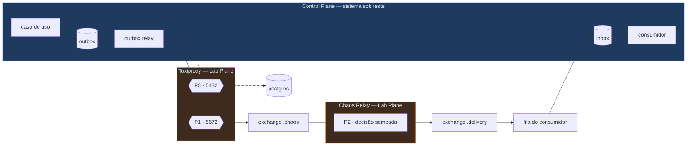

# ADR-0012: Onde o Chaos Service intercepta sem contaminar

- **Estado:** Proposto
- **Data:** 2026-07-26
- **Etapa do roadmap:** 3
- **Relacionado:** ADR-0002, ADR-0003, ADR-0004, ADR-0006, ADR-0007, ADR-0011

## Contexto

O ADR-0004 exige que o Chaos Service duplique, reordene e atrase mensagens com
probabilidade semeada. O campo `seed` alimenta toda fonte de aleatoriedade do
laboratório, e o campo `chaos` declara as probabilidades.

A regra 6 do ADR-0006 diz que o Control Plane nunca importa o Lab Plane. O README da
raiz repete a separação: o instrumento não contamina o sistema sob teste.

O Grupo 2 do ADR-0003 (`IDEMPOTENCY_KEY`, `UNIQUE_CONSTRAINT`, `SEQUENCE_GUARD`)
entra na Etapa 3. As três estratégias só têm o que filtrar se alguém produzir duplicata
e reordenação de verdade. Sem caos, os três adaptadores rodam sobre um fluxo limpo e
todo experimento passa por ausência de estímulo.

O ADR-0007 define o caminho real de uma mensagem: o caso de uso grava na `outbox`
na mesma transação do estado; o relay lê por polling e publica no RabbitMQ; o consumidor
grava o `eventId` na `inbox` antes de processar. A entrega é *at-least-once* por
construção, e o envelope carrega `eventId`, `aggregateId`,
`aggregateVersion`, `correlationId`, `causationId`, `producer` e `occurredAt`.

A questão 3 do ADR-0006 registrou a colisão e listou três lugares possíveis de
interceptação. Nenhum foi escolhido.

## Problema

As duas frases — "o caos duplica e reordena mensagens" e "o Control Plane não importa o
Lab Plane" — só coexistem se o caos for injetado fora do processo do Control Plane.
Onde, exatamente, nunca foi decidido.

As forças em conflito:

- Interceptar dentro do processo é fiel à semente e viola a regra 6 de frente.
- Interceptar no broker preserva a regra 6 e insere um salto de rede que entra na medida
  de `convergence.seconds` do ADR-0004.
- Interceptar na rede preserva a regra 6 inteira e não produz duplicata nem reordenação
  semântica — os dois casos que o Grupo 2 do ADR-0003 precisa.
- A semente precisa atravessar uma fronteira de processo. Um gerador sequencial num
  processo separado consome números na ordem de chegada das mensagens, e essa ordem não
  é determinística.
- O instrumento precisa medir sem ser medido. O proxy adiciona latência à mesma grandeza
  que o experimento afirma medir.

## Decisão

Nenhum mecanismo único produz todas as famílias de falha. O laboratório usa **três
mecanismos, com fronteira declarada por família**, e nenhum deles é código do Lab Plane
rodando dentro do Control Plane.

| Mecanismo | Onde vive | Plano |
|---|---|---|
| **Chaos Relay** | processo próprio, entre duas exchanges do RabbitMQ | Lab Plane |
| **Toxiproxy** | processo próprio, na frente do socket TCP | Lab Plane |
| **Adaptador de relógio** | dentro do serviço, lendo uma propriedade | Control Plane |

O terceiro é a exceção aparente e não é uma. Ele já é exigido pela regra 8 do ADR-0006,
existe independente do caos, e recebe um número — não código do Lab Plane. A seção *A
regra 6 não é reescrita* trata disso.

### Qual mecanismo produz qual falha

| Família de falha | Mecanismo | Por quê este e não outro |
|---|---|---|
| Duplicata de evento | Chaos Relay | Duplicar exige entender o envelope e reemitir a mensagem inteira. A rede duplica pacote TCP, e o kernel remonta o fluxo — o consumidor nunca vê duas mensagens. |
| Duplicata de comando (Operator) | Toxiproxy + retentativa do gerador de carga | O caminho do Operator é REST síncrono e não passa pelo broker. A duplicata real nasce de um timeout: o cliente não sabe se o comando chegou. O toxic produz o timeout; o gerador de carga repete a chamada com o mesmo `Idempotency-Key`. |
| Reordenação | Chaos Relay, por atraso diferencial | Reordenar é uma relação entre mensagens, não uma propriedade de uma. O TCP entrega em ordem por definição, então a rede não reordena o que já ordenou. |
| Atraso de mensagem | Chaos Relay | Precisa ser por mensagem e por escopo. Um atraso de rede atinge tudo que passa pelo socket, inclusive o tráfego que o experimento quer limpo. |
| Perda de mensagem | Chaos Relay, descartando com `ack` | Perda seletiva por escopo. A rede só derruba a conexão inteira, o que é partição, não perda. |
| Partição de rede | Toxiproxy | É ausência de conectividade. O relay não consegue simulá-la: do ponto de vista do serviço, o relay *é* o broker. Um relay que finge estar fora do ar não é um broker fora do ar. |
| Queda de conexão | Toxiproxy | Idem. Precisa acontecer no socket para que o cliente AMQP e o pool JDBC exerçam a própria lógica de reconexão. |
| Lentidão de banco | Toxiproxy na porta 5432 | Não passa pelo broker em ponto nenhum. Alonga a janela entre o `SELECT ... FOR UPDATE` e o `COMMIT`, que é onde as estratégias do Grupo 1 do ADR-0003 falham. |
| Clock skew | Adaptador de relógio (regra 8 do ADR-0006) | Tempo não é transporte. Nenhum proxy altera o `Instant` que um processo lê. |

### O caminho de uma mensagem



Três pontos de interceptação, com competências que não se sobrepõem:

- **P1 — Toxiproxy no socket.** Partição, queda de conexão, latência de transporte. O
  Control Plane não sabe que ele existe: ele aponta para um host e uma porta.
- **P2 — Chaos Relay entre exchanges.** Duplicata, reordenação, atraso por mensagem,
  perda seletiva. É o único ponto que entende o envelope do ADR-0007.
- **P3 — Toxiproxy no PostgreSQL.** Lentidão de banco, queda de conexão do pool.

O produtor publica sempre em `<dominio>.chaos`. O consumidor sempre lê de uma fila
ligada a `<dominio>.delivery`. Nenhum serviço do Control Plane conhece as duas exchanges
como "antes e depois do caos" — para ele, uma é a saída e a outra é a entrada, e a
topologia é configuração da plataforma.

### O salto do relay é permanente, não condicional

O Chaos Relay está no caminho de **toda** execução, inclusive das que declaram
`chaos: {}`. Ele nunca é removido da topologia.

Isto é deliberado e é a peça que salva a medida. Se o caminho mudasse conforme a
configuração de caos, a execução de calibração percorreria uma topologia diferente da
execução sob caos, e a diferença entre as duas mediria o salto de rede, não o caos. Com
o salto sempre presente, ele é uma constante aditiva nas duas execuções e some na
comparação.

Um relay desarmado faz uma coisa só: republica. Ele não desserializa o `payload`, não
consulta banco e não espera. Lê os cabeçalhos do envelope, calcula o hash da decisão e
reemite.

### A semente atravessa a fronteira de processo

Este é o ponto mais difícil desta decisão, e ele tem duas partes.

**Como o `seed` chega.** O `chaos-service` expõe uma API de controle. Antes de iniciar a
carga, o `experiment-service` envia o plano de caos completo — o `seed` e o bloco `chaos`
do JSON — e recebe um `chaosPlanId`. A carga só começa depois do armamento confirmado.
As duas pontas são Lab Plane, então a regra 6 não é tocada. O
`seed` **não** viaja no envelope de evento: contaminar o contrato do ADR-0007 com um
campo do instrumento é a mesma violação que a regra 6 proíbe, feita por dados em vez de
por `import`.

**Como a decisão permanece determinística.** Um gerador sequencial não serve. Se o relay
chamar `rng.nextDouble()` a cada mensagem que chega, a n-ésima chamada corresponde a uma
mensagem diferente em cada execução, porque a ordem de chegada depende de escalonamento
e de latência de rede. A reprodutibilidade morreria na primeira execução com dois
produtores.

A decisão de caos é uma **função pura da mensagem**, não um sorteio sequencial:

```
chaveDeCaos = producer | aggregateId | aggregateVersion | eventType
u(tipo)     = normaliza( HMAC-SHA256( seed, chaveDeCaos | tipo ) )  ∈ [0,1)

duplica  se  u("duplicate") < duplicate.probability
descarta se  u("drop")      < drop.probability
atrasoMs     = interpola( u("delay"), delay.millis[0], delay.millis[1] )
```

Três propriedades caem disso, e as três são necessárias:

- **Independência da ordem de chegada.** A decisão sobre uma mensagem não depende de
  nenhuma outra mensagem. Chegar primeiro ou último não muda nada.
- **Independência do número de réplicas.** Duas instâncias do relay decidem igual sobre
  a mesma mensagem, sem estado compartilhado e sem coordenação. Isso importa porque o
  relay não pode virar o gargalo que ele mesmo mede.
- **Estabilidade entre execuções.** A chave usa coordenadas lógicas do envelope, não o
  `eventId`. A versão 7 do agregado X é a versão 7 do agregado X em toda execução. O
  `eventId` é um identificador de instância de entrega e mudaria a cada rodada.

### Reordenação é atraso diferencial, não embaralhamento

O relay **não** mantém um buffer de mensagens para trocá-las de lugar. Duas razões, e a
segunda é decisiva:

1. Um buffer exige uma janela, e o tamanho da janela vira um parâmetro escondido que
   nenhum experimento declara.
2. Embaralhar um buffer é uma decisão sobre um conjunto, e o conjunto é formado pela
   ordem de chegada. Isso reintroduz exatamente a dependência de ordem que a função pura
   acima eliminou.

Cada mensagem recebe um atraso derivado da própria chave. Mensagens com atraso maior
ficam para trás. A reordenação emerge, com fidelidade semântica total do ponto de vista
do consumidor: um heartbeat antigo chega depois de um recente, que é o cenário do
ADR-0002 e o motivo de `SEQUENCE_GUARD` existir.

A honestidade que isto exige está no ADR-0004 e continua valendo: o `seed` torna a
**decisão** de caos determinística, não o **efeito**. Duas mensagens emitidas com 5 ms
de intervalo e atrasos de 10 ms e 400 ms trocam de ordem; as mesmas mensagens emitidas
com 500 ms de intervalo não trocam. O relatório registra a decisão aplicada por
mensagem, e é isso que permite reexecutar e comparar.

### A contaminação da medida é medida

O relay adiciona latência. O ADR-0004 mede `convergence.seconds`. Três mecanismos
separam o instrumento do sistema:

**Primeiro: a execução de calibração é obrigatória.** Todo experimento com `chaos`
não vazio exige uma execução pareada com `chaos: {}`, mesmo `seed`, mesma `load`, mesma
topologia. O relatório do ADR-0004 registra as duas. A execução de calibração não é
opcional nem é um experimento à parte: ela é a linha de base da execução principal e
vive no mesmo relatório.

**Segundo: o limiar de liveness é derivado da linha de base.** O `N` de
`convergence.seconds < N` não é um número escolhido à mão. Ele é
`p99(linha de base) × fator`, com o fator declarado no experimento. Isso responde
diretamente à questão 1 do ADR-0004, que pergunta como `N` é calibrado sem produzir
falha intermitente.

**Terceiro: o relay exporta o próprio custo.** A métrica
`chaos.relay.transit.millis` mede o tempo entre o consumo em `.chaos` e a republicação
em `.delivery`, sem contar o atraso injetado de propósito. Se
`p99(chaos.relay.transit)` passar de **10%** de `convergence.seconds`, o relatório marca
o resultado como **dominado pelo instrumento** e o veredito de liveness não vale. Isto é
a mesma guarda que o ADR-0007 declara para o polling do relay de Outbox, aplicada ao Lab
Plane.

### O contrato de configuração

O bloco `chaos` do ADR-0004 — `{ reorderProbability, duplicateProbability, delayMs }`
— **não é suficiente**. Três defeitos:

- **Não tem escopo.** Ele se aplica a tudo. Um experimento que precise reordenar só o
  heartbeat do Agent, mantendo o caminho do Operator limpo, não é exprimível. Sem isso,
  nenhuma comparação por origem de escrita do ADR-0002 é possível.
- **Falta metade das famílias.** Perda, partição, lentidão de banco e clock skew não têm
  campo. As quatro são necessárias na Etapa 3.
- **`reorderProbability` nomeia um efeito, não um mecanismo.** Não existe reordenar uma
  mensagem sozinha. A reordenação vem do atraso, e o campo precisa dizer isso.

O contrato completo:

```json
"chaos": {
  "message": [
    {
      "scope": {
        "producer": "registry-service",
        "eventType": "AgentCapacityReported",
        "exchange": "resource.chaos",
        "aggregateId": "*"
      },
      "duplicate": { "probability": 0.10, "copies": [1, 2] },
      "delay":     { "probability": 0.30, "millis": [50, 800] },
      "drop":      { "probability": 0.01 }
    }
  ],
  "network": [
    { "target": "postgres.resource", "latencyMillis": 40 },
    { "target": "rabbitmq", "partition": { "atSecond": 20, "forSeconds": 5 } }
  ],
  "clockSkew": [
    { "process": "registry-service", "offsetMillis": 300 }
  ]
}
```

| Campo | Significado |
|---|---|
| `message[]` | Regras aplicadas pelo Chaos Relay. Avaliadas em ordem; a primeira cujo `scope` casa vence. Nenhuma regra casando significa republicar intacto. |
| `scope` | Predicado sobre campos do envelope do ADR-0007 e sobre a exchange. Campo ausente ou `"*"` casa com tudo. |
| `duplicate.copies` | Faixa de cópias extras. Duplicar não é sempre duplicar uma vez — `UNIQUE_CONSTRAINT` precisa ver a terceira cópia. |
| `delay.probability` | Fração das mensagens do escopo que sofrem atraso. É daqui que a reordenação nasce. |
| `delay.millis` | Faixa do atraso, interpolada pelo hash. Uma faixa larga produz reordenação; uma faixa estreita produz só latência. |
| `drop.probability` | Descarte com `ack`, sem redelivery. Perda definitiva. |
| `network[]` | Toxics do Toxiproxy. `latencyMillis` é um degrau fixo, sem jitter. `partition` é uma janela agendada em segundos desde o início da carga. |
| `clockSkew[]` | Deslocamento aplicado ao adaptador de relógio de um processo, em milissegundos. |

**Como um cenário é escopado.** Por predicado sobre o envelope, nunca por "todos os
eventos". Um experimento do ADR-0003 que compare `SEQUENCE_GUARD` contra `OPTIMISTIC`
escopa o caos ao `producer` e ao `eventType` do heartbeat, e deixa o resto do fluxo sem
regra. É isso que garante que a diferença de resultado venha da estratégia e não de caos
derramado sobre o caminho errado.

O escopo por **origem de escrita do ADR-0002** funciona hoje por coincidência: cada
origem tem um `eventType` próprio. Ele não é expresso diretamente, porque o envelope não
carrega a origem. Ver a questão 3.

### Toxiproxy roda sem jitter

Toxiproxy não aceita a semente do laboratório. Seu toxic de latência tem jitter próprio,
com gerador próprio, fora do alcance do `seed`.

O laboratório configura todo toxic com jitter zero. O Toxiproxy produz apenas funções
degrau: latência fixa, conexão aberta ou fechada, em janelas agendadas. Toda variação
semeada vive no Chaos Relay, que é código do laboratório e obedece à regra 7 do
ADR-0006.

O agendamento das janelas de partição é calculado pelo `experiment-service` a partir do
`seed`, e enviado ao Toxiproxy como uma lista de instantes absolutos. O Toxiproxy não
sorteia nada — ele executa um roteiro.

### A regra 6 não é reescrita. Ela é reforçada

Nenhuma parte do caos vive dentro do processo do Control Plane como **código**. O Chaos
Relay e o Toxiproxy são processos separados. O adaptador de relógio é a única peça
dentro do serviço, e ela não é do Lab Plane: a regra 8 do ADR-0006 já a exige para a
origem Lease Expiry do ADR-0002, ela existiria sem nenhum caos, e o que o caos lhe
entrega é um inteiro numa propriedade de configuração.

Mas "configuração" é a brecha óbvia pela qual a regra 6 vira letra morta. Uma
propriedade `lab.chaos.duplicate-probability` lida por um `MessagePostProcessor` do
Control Plane cumpriria a regra 6 ao pé da letra e a violaria por completo. A regra
passa a ter três partes:

| # | Regra | O que ela impede |
|---|---|---|
| **6a** | Nenhuma classe do Control Plane depende de classe do Lab Plane. | A violação direta. É a regra 6 atual, sem mudança. |
| **6b** | Nenhum `pom.xml` do Control Plane declara dependência de módulo do Lab Plane. | A violação por classpath, antes de existir um `import`. Falha em `mvn validate`, não em teste. |
| **6c** | Nenhuma classe do Control Plane referencia uma propriedade sob o prefixo `lab.`, nem tem `Chaos` no nome. | A violação por configuração, que é como esta regra morreria. |

A 6c precisa que o adaptador de relógio leia uma propriedade que **não** esteja sob
`lab.`. Ele lê `clock.offset-millis`, no espaço de configuração do próprio serviço. O
nome importa: um deslocamento de relógio é um parâmetro operacional legítimo — deriva de
NTP existe fora de qualquer laboratório — e o adaptador não sabe por que o valor é

300. Ele soma e devolve. Nenhum código do Control Plane contém a palavra caos.

A 6a e a 6b são verificáveis hoje, na forma de padrão de pacote e de leitura do POM. A
6c precisa de um padrão de pacote que identifique o Control Plane, que é a mesma
dependência que a questão 1 do ADR-0006 e a questão 2 do ADR-0005 já registram.

## Questões em aberto

### 1. A chave de caos é estável por mensagem, não por execução

A função pura resolve a ordem de chegada. Ela não resolve o conjunto.
`producer | aggregateId | aggregateVersion | eventType` é estável para uma mensagem
lógica dada, mas **qual** mensagem lógica existe depende da execução: sob concorrência
real, o agregado X pode alcançar a versão 7 com um payload numa rodada e com outro na
rodada seguinte, ou não alcançá-la.

- **A favor de aceitar:** o ADR-0004 já declara que a reprodutibilidade é parcial e que
  o relatório registra quantas tentativas foram necessárias. A chave derivada é
  estritamente melhor que um gerador sequencial, e a alternativa perfeita exigiria
  serializar a carga — o que destruiria o objeto de estudo.
- **Contra:** experimentos com carga alta e muitos agregados podem divergir o bastante
  para que a mesma semente produza distribuições de caos diferentes. Se isso acontecer,
  a comparação entre estratégias do ADR-0003 volta a ter a variável
  "condições diferentes" que ela existe para eliminar.

Não há decisão. Uma medição resolveria: rodar a mesma definição com a mesma semente dez
vezes e comparar a distribuição de decisões aplicadas. Essa medição não pode ser feita
antes de existir código.

### 2. Um plano de caos por ambiente bloqueia execução paralela

O `chaosPlanId` é armado no `chaos-service` antes da carga. O relay não tem como saber a
qual experimento uma mensagem pertence: o envelope não carrega o
`chaosPlanId`, e colocá-lo lá seria contaminar o contrato do ADR-0007.

A consequência é que **um ambiente executa um experimento por vez**. Uma bateria de
comparação de nove estratégias vira nove execuções sequenciais.

- **A favor:** executar dois experimentos em paralelo no mesmo ambiente já seria
  suspeito por outro motivo — eles disputariam CPU, banco e broker, e a contenção
  entraria em `convergence.seconds` sem aparecer em nenhum campo.
- **Contra:** a serialização torna caras as matrizes do ADR-0003. A matriz
  `capacityModel` × estratégia tem doze células.

Uma saída seria escopar o plano por prefixo de `correlationId`, já que o
`experiment-service` estampa o `correlationId` da carga que gera. Ela não fecha:
eventos de Lease Expiry e do Reconciler nascem de processos de fundo do Control Plane,
sem `correlationId` de experimento. Fica registrado sem decisão.

### 3. O envelope não expressa a origem de escrita do ADR-0002

O `scope` casa por `producer` e `eventType`. A origem de escrita do ADR-0002 — Operator,
Agent, Reconciler, Lease Expiry — não é campo do envelope do ADR-0007.

Hoje funciona porque cada origem tem `eventType` distinto. Se duas origens do mesmo
serviço passarem a publicar o mesmo tipo de evento, o escopo por origem deixa de ser
exprimível e um experimento não consegue mais isolar uma origem.

A correção seria um campo `origin` no envelope. Isso é uma alteração no ADR-0007, e este
ADR não a decide.

### 4. Metade desta decisão depende do ADR-0011

O Chaos Relay intercepta eventos entre serviços. Quantos caminhos de evento existem na
Etapa 3, e quais, é competência exclusiva do ADR-0011.

Se a decomposição colocar `resource` e `allocation` no mesmo serviço — a opção A da
questão 3 do ADR-0005 —, o único fluxo de evento da Etapa 3 é o heartbeat do Agent, e o
Chaos Relay tem um escopo só para operar. `UNIQUE_CONSTRAINT` e `SEQUENCE_GUARD`
seguem exercitáveis; `IDEMPOTENCY_KEY` passa a depender inteiramente do caminho REST do
Operator, ou seja, do Toxiproxy e do gerador de carga, não do relay.

Se a decomposição separar os dois agregados, aparecem caminhos de evento entre eles, e o
relay ganha escopos que este ADR não pode enumerar hoje.

A decisão sobre os mecanismos não muda. A tabela de escopos de cada experimento depende
do ADR-0011.

### 5. Descarte com `ack` ou com `nack`?

A decisão acima escolheu `ack`: a mensagem descartada some para sempre. A alternativa é
`nack` com `requeue`, que devolve a mensagem ao broker.

- **A favor de `ack`:** produz perda de verdade, que é o cenário que exercita a DLQ e o
  comportamento do sistema diante de um fato que nunca chegou.
- **Contra:** `ack` e `drop` fazem do Chaos Relay um ponto onde o *at-least-once* do
  ADR-0007 deixa de valer. O laboratório passa a ter uma garantia estrutural que o
  instrumento quebra de propósito, e um leitor do relatório pode confundir perda
  injetada com perda por bug.
- **A favor de `nack`:** transformaria perda em redelivery, ou seja, em duplicata — que
  é uma família que o relay já produz por outro caminho, com controle melhor.

A mitigação parcial já está na decisão: o relatório registra toda mensagem descartada
com sua chave de caos. Isso distingue perda injetada de perda real, mas depois do fato,
não durante.

### 6. O adaptador de relógio ainda não existe

A regra 8 do ADR-0006 proíbe `Instant.now()` fora de um adaptador de relógio, e a
questão 2 daquele ADR registra que o adaptador não foi especificado. A família clock
skew desta decisão depende inteiramente dele.

Falta decidir, entre outras coisas, como um deslocamento é aplicado a **um** processo
quando o mesmo serviço roda em várias réplicas. Uma propriedade por processo resolve com
variável de ambiente por contêiner, mas isso é decisão do ADR-0010, sobre profiles do
Docker Compose, que também não existe.

Até lá, `clockSkew` é um campo declarado e não implementável — a mesma forma de dívida
que o ADR-0002 registrou para `expires_at`.

## Consequências

### Positivas

- A regra 6 do ADR-0006 sobrevive intacta. Nenhuma linha de código do instrumento entra
  no sistema sob teste, e a questão 3 daquele ADR fecha.
- O Grupo 2 do ADR-0003 ganha estímulo real na Etapa 3. `IDEMPOTENCY_KEY` recebe comando
  repetido, `UNIQUE_CONSTRAINT` recebe fato duplicado, `SEQUENCE_GUARD`
  recebe fato fora de ordem — cada um do mecanismo certo.
- A decisão derivada por hash torna o Chaos Relay escalável horizontalmente sem
  coordenação. O instrumento não vira o gargalo que ele mede.
- A latência do instrumento passa a ser um número exportado, com limiar declarado. O
  laboratório deixa de precisar acreditar que a medida é limpa.
- A execução de calibração obrigatória dá ao ADR-0004 a resposta que faltava sobre como
  calibrar o limiar `N` de `convergence.seconds`.
- O Chaos Relay é o único componente que precisa entender o envelope do ADR-0007.
  Toxiproxy e adaptador de relógio não sabem que mensagens existem.

### Negativas

- **Todo evento paga um salto de rede a mais, sempre.** Em execuções sem caos também.
  Este é o custo direto e permanente desta decisão, e ele é aceito porque a
  alternativa — um caminho que muda com a configuração — invalida a linha de base.
- Três mecanismos são três coisas para operar, configurar e depurar. O Toxiproxy é uma
  dependência externa a mais no `docker compose`.
- A topologia do RabbitMQ dobra de tamanho: cada domínio tem uma exchange `.chaos` e uma
  `.delivery`. Um erro de binding produz mensagem que some sem erro, e esse é um modo de
  falha novo, do instrumento, difícil de distinguir de perda injetada.
- Todo experimento com caos custa duas execuções. O tempo de uma bateria dobra.
- A regra 6c proíbe a palavra `Chaos` no Control Plane e o prefixo `lab.` na
  configuração. É uma regra de nomenclatura imposta por build, e regras assim irritam
  quando bloqueiam um nome inocente. Ela precisa de `because(...)` explícito, como o
  ADR-0006 já exige de toda regra.

### Neutras

- O Chaos Relay é um consumidor e produtor comum do RabbitMQ. Ele não usa recurso
  privilegiado do broker e pode ser substituído por outra implementação sem que o
  Control Plane perceba.
- Trocar RabbitMQ por Kafka, como o README prevê, muda a implementação do relay e não
  muda esta decisão. O ponto de interceptação continua sendo entre dois tópicos.
- O Toxiproxy pode ser trocado por `tc netem` ou por Pumba. A escolha é operacional. O
  que esta decisão fixa é que a família de falha de rede vive na camada de rede.

## Alternativas consideradas

### Alternativa A — interceptor dentro do processo do Control Plane

Um `MessagePostProcessor` ou um wrapper do `RabbitTemplate` que consulta o Chaos Service
antes de publicar.

**Descartada.** É a opção mais fácil de escrever e a mais fiel à semente: a decisão de
duplicar nasce no mesmo processo que gerou o evento, e a ordem das decisões acompanha a
ordem de geração, sem o problema de ordem de chegada que a decisão derivada precisou
resolver.

O motivo técnico da recusa não é estético. Um `MessagePostProcessor` do instrumento roda
dentro da mesma transação, do mesmo pool de threads e do mesmo classpath do sistema sob
teste. Um bug nele — um deadlock, uma exceção não tratada, uma alocação que dispara GC —
aparece no relatório como resultado de consistência. O laboratório inteiro existe para
produzir conclusões confiáveis sobre esse sistema, e esta alternativa torna toda
conclusão condicional à correção do instrumento.

Há um segundo motivo, específico do ADR-0007: o interceptor ficaria **antes** da
`outbox` ou **depois** dela. Antes, ele duplicaria a escrita transacional, o que não é
duplicata de mensagem. Depois, ele estaria dentro do relay — que é justamente o
componente cuja janela de *at-least-once* o laboratório quer observar sem alterar.

### Alternativa B — só o proxy no broker, sem Toxiproxy

Concentrar todo o caos no Chaos Relay e não usar falha de rede.

**Descartada.** O relay não consegue produzir partição nem lentidão de banco. Partição é
a ausência de conectividade, e do ponto de vista do serviço o relay é o broker: um relay
que para de responder é um broker fora do ar, não uma rede partida, e o cliente AMQP não
exerce a lógica de reconexão que o experimento quer observar. Lentidão de banco nem
sequer passa pelo broker — ela é a janela entre `SELECT ... FOR UPDATE` e
`COMMIT`, que é exatamente onde `PESSIMISTIC` e `OPTIMISTIC` do ADR-0003 falham.

Sem essas duas famílias, a Etapa 3 mede reentrega e ordenação e não mede mais nada.

### Alternativa C — só falha de rede, sem proxy no broker

Usar apenas Toxiproxy, aceitando o que ele produz.

**Descartada.** É a opção mais pura: o Control Plane não sabe que o caos existe, e
nenhum salto de rede entra na medida de convergência. Mas o TCP entrega em ordem e o
kernel remonta pacotes duplicados. O consumidor nunca vê duas mensagens nem duas
mensagens trocadas de lugar.

Isso deixa `UNIQUE_CONSTRAINT` e `SEQUENCE_GUARD` sem estímulo. As duas estratégias
entrariam na Etapa 3 e passariam todos os experimentos por ausência de causa, que é o
falso negativo mais caro que um instrumento de medida pode produzir — o ADR-0003 já o
nomeia ao exigir `NONE` como grupo de controle.

### Alternativa D — o `seed` viaja no envelope de evento

Adicionar um campo ao envelope do ADR-0007 com o `seed` e o `chaosPlanId`, para que o
relay decida sem armamento prévio.

**Descartada.** Resolveria a questão 2 acima: dois experimentos poderiam rodar em
paralelo, cada mensagem carregando o próprio plano.

O custo é a mesma violação que a regra 6 existe para impedir, cometida por dados em vez
de por `import`. O contrato de mensagem do Control Plane passaria a ter um campo que só
o instrumento usa, e todo serviço do Control Plane teria de preenchê-lo — o que
significa que todo serviço do Control Plane precisaria saber que o caos existe. A regra
6c, proposta acima, proíbe exatamente essa forma de contaminação.

### Alternativa E — reordenação por buffer e embaralhamento

O relay acumula uma janela de mensagens e as republica em ordem sorteada.

**Descartada.** É a forma intuitiva de reordenar e é irreprodutível por construção. O
conteúdo da janela depende de quais mensagens chegaram enquanto ela estava aberta, e
isso depende de latência de rede e de escalonamento. Duas execuções com a mesma semente
embaralhariam conjuntos diferentes.

O atraso diferencial produz o mesmo efeito observável no consumidor — um fato antigo
chegando depois de um recente — com a decisão presa à mensagem, não à janela.

## Quando esta decisão deixa de valer

Reveja esta decisão se o veredito de um experimento mudar ao alterar apenas o número de
réplicas do Chaos Relay. A decisão derivada por hash foi escolhida justamente para que
esse número não importe; se importar, a função pura não está sendo respeitada em algum
ponto, e a reprodutibilidade que este ADR promete não existe.

O segundo sinal, mais lento: `p99(chaos.relay.transit.millis)` passar de 10% de
`convergence.seconds` de forma recorrente. Isso significa que o instrumento passou a
dominar a medida, e o caminho volta a ser o interceptor dentro do processo — com a
contaminação assumida e declarada em cada relatório — ou o laboratório troca RabbitMQ
por um transporte cujo salto extra seja desprezível.
