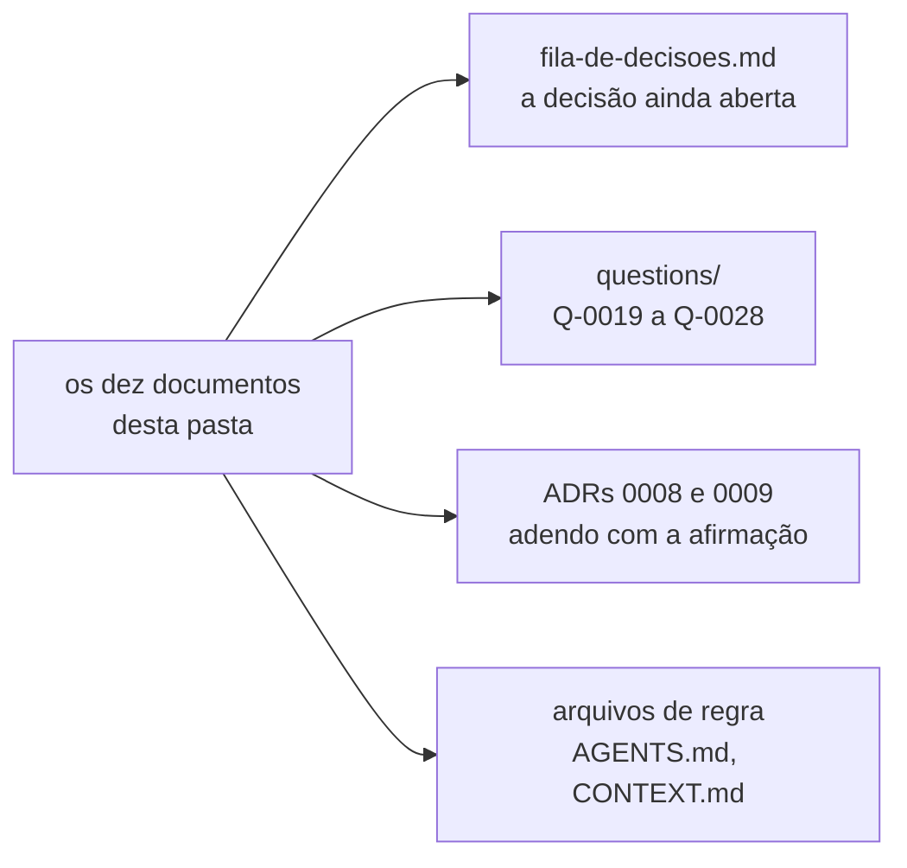

# A rodada de arquitetura de 2026-08-03, arquivada

Os dez documentos desta pasta viveram em `docs/architecture/` até 2026-08-05, quando a
decisão `D-2` os arquivou aqui. **Nenhum deles é ADR**, e nenhum decide nada.

## Por que eles saíram

`docs/architecture/` era a única pasta de `docs/` cujo conteúdo não era nenhum dos seis
artefatos que [`specification-process.md`](../../../specification-process.md) prevê. A
árvore daquele documento sempre declarou que a pasta contém a matriz de integrações — e
nada mais. Estes dez existiam fora do processo escrito, e agora a árvore diz a verdade.

## O que cada um é

| Arquivo                                                         | O que ele é                                            |
|-----------------------------------------------------------------|--------------------------------------------------------|
| [`decisoes-pendentes.md`](decisoes-pendentes.md)                | o índice consolidador, e o registro dos Lotes A a D    |
| [`contra-avaliacao.md`](contra-avaliacao.md)                    | treze objeções contra a rodada, produzidas por agente  |
| [`arquitetura-alvo.md`](arquitetura-alvo.md)                    | proposta: decomposição, tecnologia e gatilhos          |
| [`contratos-de-api.md`](contratos-de-api.md)                    | proposta: esboços de OpenAPI e de eventos              |
| [`entrega-continua.md`](entrega-continua.md)                    | proposta: pipeline, imagem e deploy no homelab         |
| [`interface-web.md`](interface-web.md)                          | proposta: telas, streaming e wireframes                |
| [`mensageria.md`](mensageria.md)                                | proposta: broker, tópicos e a etapa 5                  |
| [`modelo-de-dados.md`](modelo-de-dados.md)                      | proposta: esquema, migração e isolamento               |
| [`modelo-de-dominio.md`](modelo-de-dominio.md)                  | proposta: agregados, vocabulário e fronteiras          |
| [`modulos-e-fronteiras.md`](modulos-e-fronteiras.md)            | proposta: módulos Maven e regras de import             |

## O que sobreviveu, e onde está

Arquivar não é apagar, mas também não é manter vivo. O que continua valendo saiu daqui
antes do arquivamento.

- **A fila de decisões** vive em [`fila-de-decisoes.md`](../../fila-de-decisoes.md). É
  lá que uma linha ainda aberta é debatida e decidida.
- **As dez objeções não conferidas** viraram `Q-0019` a `Q-0028` em
  [`questions/`](../../../questions/README.md), pela decisão `D-3`. Nenhuma foi
  conferida na passagem, e o estado viajou junto.
- **As afirmações que os ADRs 0008 e 0009 citavam daqui** foram incorporadas por
  **adendo** em cada um deles, pela decisão `D-4`. Os dois se sustentam sem esta pasta.
- **As decisões dos Lotes A, B e C** foram aplicadas nos arquivos de regra: o índice de
  ADRs, o glossário, o índice de questões, os dois `AGENTS.md` e o processo de
  especificação.

## Esta pasta não é editada

Vale a regra de [`../README.md`](../README.md) e de
[`../../../AGENTS.md`](../../AGENTS.md): o arquivo morto registra o que se pensava
naquela data, e editá-lo apaga a evidência.

**O verificador de citações isenta esta pasta como origem, desde 2026-08-05.** As
citações que partem daqui apontam para um repositório que mudou, e são inconsertáveis
por construção — acusá-las deixaria o verificador permanentemente vermelho, que é o
mesmo argumento com que `C-7` isentou os quatro ADRs legados. Citação que **aponta
para** esta pasta continua verificada.
