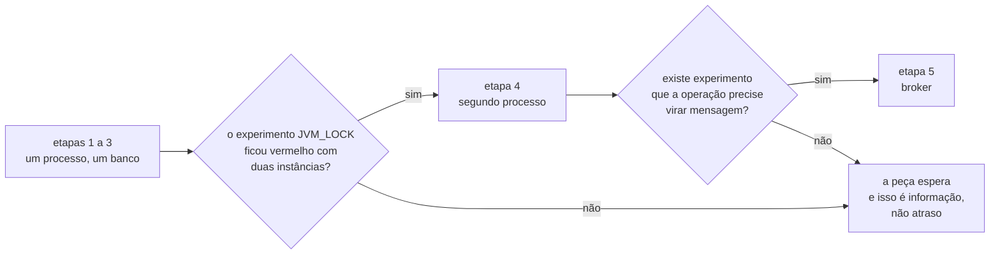
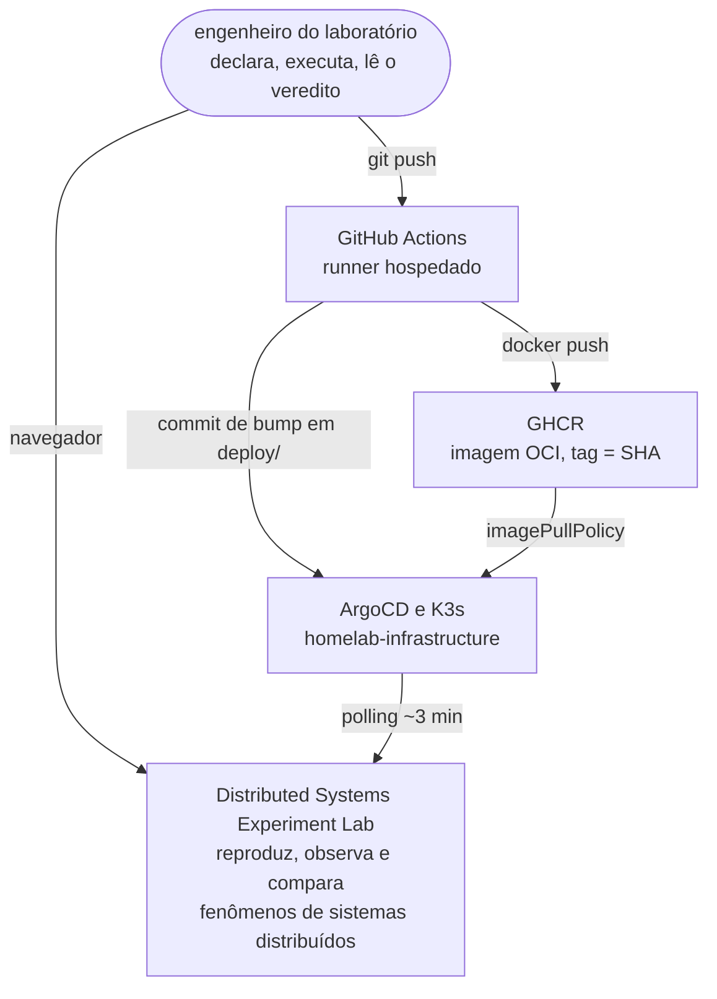
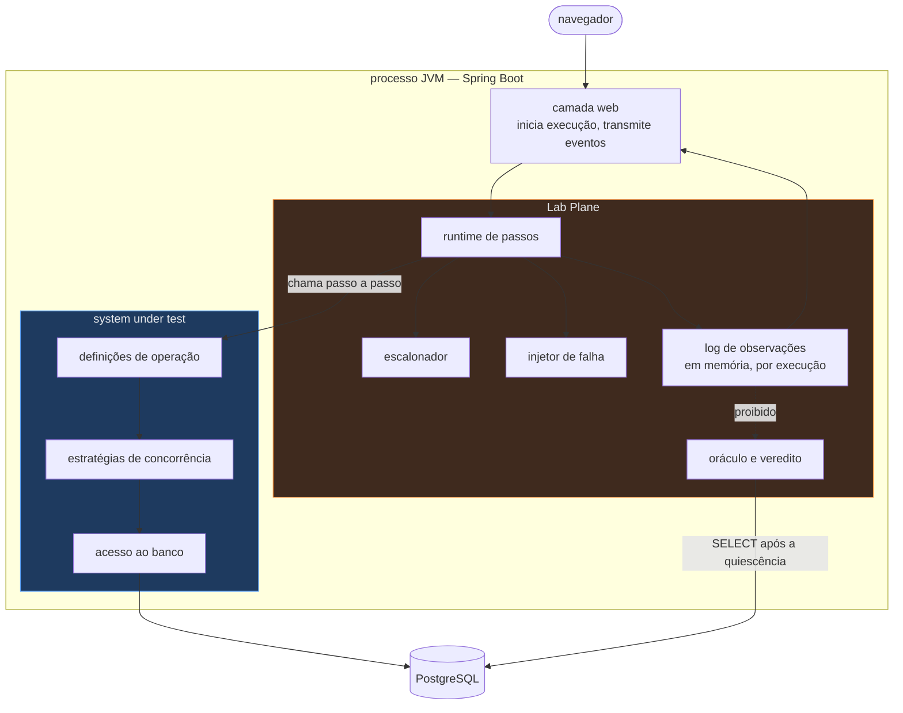
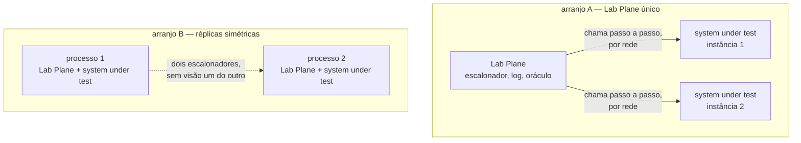
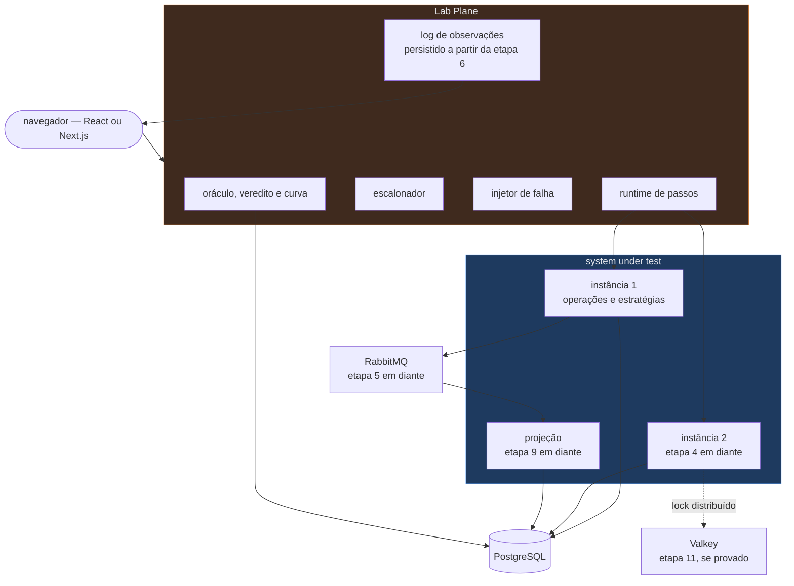

# Arquitetura-alvo e topologia por etapa

- **Estado:** Proposta — requer aprovação humana
- **Data:** 2026-08-03
- **Escopo:** a forma do sistema em cada etapa do roadmap, e o gatilho observável que
  libera cada peça nova.
- **Depende de:** [`ADR-0001`](../../0001-o-passo-como-unidade-de-execucao.md),
  [`ADR-0002`](../../0002-o-dominio-minimo-e-os-dois-oraculos.md),
  [`ADR-0005`](../../0005-a-forma-do-escalonador.md),
  [`ADR-0006`](../../0006-a-forma-da-estrategia-de-concorrencia.md),
  [`ADR-0007`](../../0007-o-log-de-observacoes-forma-ordem-e-onde-vive.md), todos
  `Aceito`.

## O que este documento é, e o que ele não decide

Este documento descreve topologia: quantos processos existem, o que cada um contém, e
qual experimento vermelho autoriza o processo seguinte a nascer. Nada aqui é decisão. As
escolhas que exigem uma pessoa estão isoladas na seção
[Decisões que exigem aprovação humana](#decisões-que-exigem-aprovação-humana).

Quatro assuntos aparecem citados e **não** são especificados aqui: o modelo de domínio
conceitual, as tabelas e migrações, as exchanges e o formato de mensagem, e as telas e
contratos HTTP. Este documento diz onde essas peças vivem, e não o que elas contêm.

## A tensão que este documento não apaga

Duas afirmações verdadeiras apontam para formas diferentes.

O plano fixa o MVP como **uma aplicação Spring Boot, um PostgreSQL, uma interface web
servida pela própria aplicação, nenhum broker e nenhum segundo processo**
(`plano-do-laboratorio.md:531-532`). A decomposição em serviços é provocada por um
experimento vermelho, e nunca agendada: o gatilho nomeado é a estratégia `JVM_LOCK`
falhar com duas instâncias, na etapa 4 (`plano-do-laboratorio.md:36-41`, `312-316`,
`362-364`, `605-618`).

A stack escolhida pelo usuário nomeia microsserviços com Maven em submódulos, ou Spring
Modulith, além de RabbitMQ com CloudEvents, Debezium e um frontend React ou Next.js.
Isso decide o **se**. O roadmap governa o **quando**, e a comparação entre os mecanismos
de módulo está em
[`modulos-e-fronteiras.md`](modulos-e-fronteiras.md#o-mecanismo-de-módulo).

As duas afirmações convivem sob uma regra: uma peça entra quando um experimento não
puder ser executado sem ela (`plano-do-laboratorio.md:620-621`). O que precisa de
aprovação é se essa regra continua valendo agora que a lista de tecnologias já existe —
`D-ARQ-01`.

## Contexto — quem toca o laboratório

O laboratório tem um ator humano e três sistemas externos, e nenhum deles participa de
experimento. O engenheiro declara e executa; o GitHub Actions constrói; o GHCR guarda a
imagem; o ArgoCD do homelab reconcilia o cluster. O Kubernetes hospeda o laboratório e
não é objeto de estudo — nenhum dos 42 fenômenos é reproduzido por um recurso do cluster
(`plano-do-laboratorio.md:822-829`).

Evidência da fronteira de entrega: ADR 0017 do `homelab-infrastructure`, `Aceita`, e
`plano-do-laboratorio.md:757-777`. O detalhamento está em
[`entrega-continua.md`](entrega-continua.md).

## Contêineres do MVP — etapas 1 a 3

Um processo JVM, um PostgreSQL, um navegador. O processo contém os dois planos, e a
interface web é servida por ele (`plano-do-laboratorio.md:531-532`). O log de
observações vive em memória, uma sequência por execução, e a persistência durável está
fora de escopo até a etapa 6
(`../../0007-o-log-de-observacoes-forma-ordem-e-onde-vive.md:86-88`).

Três setas do desenho são normativas e vêm de ADR aceito. O runtime chama o passo, e o
passo não chama o runtime (`../../0001-o-passo-como-unidade-de-execucao.md:93-95`). O
oráculo lê o PostgreSQL e não lê o log de observações
(`../../0002-o-dominio-minimo-e-os-dois-oraculos.md:216-241`). O Lab Plane trata a
estratégia como rótulo opaco e nenhum componente dele ramifica por esse rótulo
(`../../0006-a-forma-da-estrategia-de-concorrencia.md:51-54`).

O que a topologia não mostra é que os dois planos dividem o mesmo `ClassLoader`. Sem
fronteira física, a separação existe apenas se um teste falhar quando ela for violada —
é o assunto de [`modulos-e-fronteiras.md`](modulos-e-fronteiras.md).

## Etapa 4 — o segundo processo, e o que ele quebra

O gatilho é observável e já está escrito: o experimento `JVM_LOCK` passa com uma
instância e falha com duas (`plano-do-laboratorio.md:312-316`, `607`). O ADR-0006 não
avalia `JVM_LOCK` e nomeia esse mesmo sinal como o momento de revisar a forma da
estratégia (`../../0006-a-forma-da-estrategia-de-concorrencia.md:162-166`).

A etapa 4 introduz um problema que nenhum documento do repositório registra hoje. O
escalonador mantém, **por execução**, um contador de workers ativos e um conjunto de
restrições pendentes (`../../0005-a-forma-do-escalonador.md:60-61`), e o contador
zerado é o sinal que o oráculo aguarda antes de ler o banco
(`../../0005-a-forma-do-escalonador.md:77-80`). Esse estado é de memória de um
processo. Com workers em dois processos, ou o Lab Plane fica num processo só e os dois
processos do system under test reportam chegada e término a ele por uma fronteira de
rede, ou passa a haver dois escalonadores sem visão um do outro — e o segundo caso torna
a execução de controle do ADR-0004 indeclarável entre processos.

O arranjo A preserva a direção de dependência do ADR-0001 e transforma a chamada de
passo em chamada remota, o que muda o que a timeline mede. O arranjo B preserva a
chamada local e perde o encontro entre workers de processos diferentes. A escolha é
`D-ARQ-03`, e ela não pode ser feita antes de a etapa 4 ter gatilho.

## Etapa 5 — o broker

O gatilho é o primeiro experimento assíncrono (`plano-do-laboratorio.md:608`). O
RabbitMQ entra aqui, com CloudEvents como formato de mensagem por decisão do usuário.
Exchanges, filas, roteamento e o envelope são escopo de outro documento; a topologia
registra apenas que o broker passa a ser um contêiner externo ao processo, e que ele é a
primeira dependência de rede dentro de um experimento.

O plano registra que Toxiproxy não tem gatilho antes da etapa 5, e que a injeção de
falha na rede não produz duplicata semântica (`plano-do-laboratorio.md:816-820`). A
recomendação sobre a ADR 0017 nesse ponto está em
[`entrega-continua.md`](entrega-continua.md#d-arq-10--toxiproxy-entra-sem-gatilho).

## Etapa 6 e adiante — a falha destrutiva

A etapa 6 pergunta o que acontece se o processo morre entre o commit e o publish
(`plano-do-laboratorio.md:346`). Ela dispara três consequências de topologia, todas já
escritas em outro lugar:

- o log de observações deixa de poder viver só em memória
  (`../../0007-o-log-de-observacoes-forma-ordem-e-onde-vive.md:177-181`);
- onde o log é persistido passa a ser decisão obrigatória
  (`plano-do-laboratorio.md:610`), e o plano já proíbe gravá-lo no banco sob teste
  durante a execução, por contenção (`plano-do-laboratorio.md:589-592`);
- o experimento destrutivo passa a rodar sob um orquestrador que o desfaz
  (`plano-do-laboratorio.md:837-845`). O tratamento e as três candidatas estão em
  [`entrega-continua.md`](entrega-continua.md#d-arq-13--experimento-destrutivo-sob-selfheal-true).

## Etapas 9 a 12 — projeção, curva e posse no tempo

A etapa 9 introduz a amostragem no tempo e uma segunda representação do estado
(`plano-do-laboratorio.md:349`, `206-212`). Isso acrescenta um processo consumidor ou
uma projeção dentro do mesmo processo; qual dos dois não tem gatilho decidido, porque a
forma da amostragem é a lacuna mais antiga do repositório
(`plano-do-laboratorio.md:706-709`).

A etapa 10 traz o veredito por curva, e a 11 traz lease e fencing, que exigem mais de um
processo por definição (`plano-do-laboratorio.md:241-243`). O Valkey entra na etapa 11
**se** um experimento provar que o advisory lock do PostgreSQL não basta
(`plano-do-laboratorio.md:613`). A etapa 12 fecha o replay determinístico e não
acrescenta contêiner.

## Tabela de liberação — peça, etapa, gatilho, evidência

| Peça                                  | Entra na etapa | Gatilho concreto e observável                                                  | Evidência                                                             |
|---------------------------------------|----------------|--------------------------------------------------------------------------------|-----------------------------------------------------------------------|
| aplicação Spring Boot, processo único | 1              | o primeiro experimento do MVP precisa de um runtime que execute passos         | `plano-do-laboratorio.md:531-532`                                     |
| PostgreSQL                            | 1              | o passo executa SQL real, em transação real                                    | `../../0001-o-passo-como-unidade-de-execucao.md:115-117`             |
| interface web servida pela aplicação  | 1              | a timeline do cenário 25 precisa ser exibida durante a execução                | `plano-do-laboratorio.md:531`, `540`                                  |
| imagem OCI, `deploy/` e workflow      | 1              | o serviço nasce entregando; o `Application` do ArgoCD já aponta para `deploy/` | `plano-do-laboratorio.md:757-771`                                     |
| coluna `version` e migração           | 2              | a estratégia `OPTIMISTIC` entra no E3                                          | `../../0006-a-forma-da-estrategia-de-concorrencia.md:56-60`          |
| nível de isolamento como parâmetro    | 3              | o E5 varre `READ COMMITTED`, `REPEATABLE READ` e `SERIALIZABLE`                | `plano-do-laboratorio.md:472-474`                                     |
| segunda instância do processo         | 4              | o experimento `JVM_LOCK` passa com uma instância e falha com duas              | `plano-do-laboratorio.md:312-316`, `607`                              |
| RabbitMQ com CloudEvents              | 5              | o primeiro experimento em que a operação vira mensagem                         | `plano-do-laboratorio.md:345`, `608`                                  |
| persistência durável do log           | 6              | um experimento derruba o processo de propósito                                 | `../../0007-o-log-de-observacoes-forma-ordem-e-onde-vive.md:177-181` |
| segunda representação do estado       | 9              | o experimento precisa medir o que o usuário viu, e não o que ficou gravado     | `plano-do-laboratorio.md:349`                                         |
| Valkey                                | 11             | um experimento prova que o advisory lock do PostgreSQL não basta               | `plano-do-laboratorio.md:613`                                         |
| OpenTelemetry, Prometheus, Grafana    | sem etapa      | um fenômeno que a timeline própria não consiga explicar                        | `plano-do-laboratorio.md:615`                                         |
| Debezium para CDC                     | sem etapa      | **nenhum gatilho nomeado** — ver `Perguntas em aberto`                         | stack do usuário; nenhuma linha do plano                              |
| Toxiproxy                             | sem etapa      | **nenhum gatilho nomeado** — ver `D-ARQ-10` em `entrega-continua.md`           | `plano-do-laboratorio.md:816-820`                                     |
| Kafka, Helm, service mesh             | sem etapa      | nenhum gatilho previsto no roadmap atual                                       | `plano-do-laboratorio.md:616`                                         |

A coluna `Entra na etapa` não é cronograma. A etapa 4 não tem data: ela acontece quando
o experimento fica vermelho, e se ele nunca for escrito a etapa nunca chega
(`plano-do-laboratorio.md:362-364`).

## A arquitetura-alvo ao fim das 12 etapas

O desenho abaixo mostra o estado terminal se **todos** os gatilhos dispararem. Ele não é
um plano de construção: cada caixa fora do bloco do MVP depende de um experimento que
ainda não existe.

Uma propriedade sobrevive às etapas: nenhuma caixa do system under test aponta para
dentro do Lab Plane. Ela é a única invariante estrutural do laboratório, e o mecanismo
que a torna verificável está em [`modulos-e-fronteiras.md`](modulos-e-fronteiras.md).

## Decisões que exigem aprovação humana

| ID         | Decisão                                                   | Alternativas                                                                  | Recomendação                                                     | Por que só uma pessoa decide                                               |
|------------|-----------------------------------------------------------|-------------------------------------------------------------------------------|------------------------------------------------------------------|----------------------------------------------------------------------------|
| `D-ARQ-01` | Seguir o gatilho, ou antecipar a decomposição em serviços | seguir o gatilho; antecipar a decomposição; forma intermediária declarada     | seguir o gatilho                                                 | troca custo de retrabalho por valor pedagógico, e o plano registra os dois |
| `D-ARQ-02` | Onde a interface web é construída e empacotada            | exportação estática dentro da imagem da aplicação; contêiner próprio          | exportação estática enquanto não houver renderização no servidor | fixa o `Dockerfile` e o número de imagens do dia zero                      |
| `D-ARQ-03` | Onde o Lab Plane vive quando existirem dois processos     | Lab Plane único chamando por rede; réplicas simétricas com dois escalonadores | Lab Plane único, decidido quando a etapa 4 tiver gatilho         | muda o que a timeline mede, e o ADR-0005 não previu o caso                 |
| `D-ARQ-04` | O modelo de thread do worker                              | threads de plataforma; threads virtuais                                       | threads de plataforma no MVP                                     | o ADR-0001 delegou a escolha a esta decisão, e ela afeta a medida          |

### `D-ARQ-01` — seguir o gatilho contra antecipar a decomposição

**O problema.** O plano exige que a separação em processos seja provocada por um
experimento vermelho (`plano-do-laboratorio.md:36-41`). A stack escolhida pelo usuário
já nomeia microsserviços com Maven em submódulos. Se a decomposição for antecipada, o
gatilho perde a função; se for adiada, a primeira separação chega com código já escrito
para um processo só.

**Alternativa 1 — seguir o gatilho.** A favor: o experimento da etapa 4 só ensina alguma
coisa se existir o resultado não distribuído para comparar, que é o mesmo argumento de
grupo de controle que o repositório usa em toda parte
(`plano-do-laboratorio.md:312-316`). Contra: quando o gatilho disparar, a fronteira
entre processos precisará ser aberta num código que não a previu, e a conta inclui o
escalonador descrito em `D-ARQ-03`.

**Alternativa 2 — antecipar a decomposição.** A favor: a fronteira nasce com o código,
sem migração posterior, e o `Dockerfile` e o `deploy/` já nascem com a forma final. É
também o que a ADR 0017 do homelab presume ao chamar o laboratório de monorepo de
microsserviços. Contra: contradiz a regra estrutural de que nenhuma tecnologia entra por
estar disponível (`plano-do-laboratorio.md:620-621`), e entrega a solução antes do
problema, que é a regra pedagógica do repositório.

**Alternativa 3 — forma intermediária declarada.** Um processo, com os módulos separados
de tal modo que a extração de um deles seja mecânica. A favor: paga parte do custo da
alternativa 2 sem criar processos que nenhum experimento pede. Contra: "extração
mecânica" não tem critério verificável enquanto ninguém escrever o teste que a mede, e
uma promessa de arquitetura sem teste é a mesma promessa que a regra 6 do `arquivo/0006`
existia para substituir.

**Recomendação.** Seguir o gatilho, com a fronteira de módulo preparada como descrito em
[`modulos-e-fronteiras.md`](modulos-e-fronteiras.md) — que é a alternativa 3 aplicada ao
mecanismo de módulo, e não à contagem de processos.

**Se a escolha for outra.** Antecipar a decomposição muda três documentos ao mesmo
tempo: a tabela de liberação acima perde a linha da etapa 4, o `deploy/` passa a
declarar mais de um `Deployment` no primeiro commit, e a comparação de
`modulos-e-fronteiras.md` fica decidida antes de o gatilho existir.

### `D-ARQ-02` — onde a interface web é construída e empacotada

**O problema.** O plano diz que a interface é servida pela própria aplicação
(`plano-do-laboratorio.md:531`). A stack escolhida nomeia React ou Next.js. Next.js com
renderização no servidor exige um processo Node, que é um segundo contêiner e um segundo
artefato no `Dockerfile`.

**Alternativa 1 — exportação estática dentro da imagem da aplicação.** A favor: um
artefato, uma porta, um `Deployment`, e a frase do plano continua verdadeira. Contra:
descarta renderização no servidor e rotas de API do próprio framework de frontend.

**Alternativa 2 — contêiner próprio para o frontend.** A favor: o frontend ganha ciclo
de build próprio e a escolha de framework fica livre. Contra: o dia zero passa a
publicar duas imagens e o `deploy/` nasce com dois `Deployment`, o que antecipa parte de
`D-ARQ-01` por um motivo que nenhum experimento pediu.

**Recomendação.** Exportação estática dentro da imagem da aplicação, enquanto nenhum
requisito de renderização no servidor for declarado.

**Se a escolha for outra.** O workflow ganha uma segunda matriz de build, e o job
agregador da ADR 0017 passa a depender das duas.

### `D-ARQ-03` — onde o Lab Plane vive quando existirem dois processos

**O problema.** O escalonador guarda estado por execução em memória
(`../../0005-a-forma-do-escalonador.md:60-61`), e o sinal de execução terminada vem do
contador de ativos chegar a zero (`:77-80`). Com workers em dois processos, esse
contador deixa de enxergar todos os workers.

**Alternativa 1 — Lab Plane único, chamando o system under test por rede.** A favor:
preserva a direção de dependência do ADR-0001 e mantém um escalonador só, o que mantém a
execução de controle declarável. Contra: a chamada de passo passa a atravessar a rede, e
a latência dela entra na medida de todo experimento, inclusive nos do grupo D.

**Alternativa 2 — réplicas simétricas, cada uma com o próprio Lab Plane.** A favor: a
chamada de passo continua local e a fidelidade da medida de latência é preservada.
Contra: não existe encontro entre workers de processos diferentes, e a execução de
controle positivo do ADR-0004 deixa de ser declarável na etapa em que ela mais importa.

**Recomendação.** Lab Plane único, decidido quando a etapa 4 ganhar gatilho, e não
antes. Decidir agora fixaria uma forma para um experimento que ainda não foi escrito.

**Se a escolha for outra.** Réplicas simétricas exigem um ADR novo sobre coordenação
entre escalonadores, e o ADR-0005 passa a valer apenas dentro de um processo.

### `D-ARQ-04` — o modelo de thread do worker

**O problema.** O ADR-0001 fixa uma thread por worker, com a transação e a conexão
ligadas a ela do início ao fim do escopo, e delega explicitamente a esta decisão se
essas threads são de plataforma ou virtuais
(`../../0001-o-passo-como-unidade-de-execucao.md:507-515`).

**Alternativa 1 — threads de plataforma.** A favor: o bloqueio numa barreira segura os
locks de linha do PostgreSQL de forma que o ADR-0001 já descreve como desejada, e o
comportamento sob `synchronized` é o que os experimentos do grupo A esperam observar.
Contra: o número de workers fica limitado pelo número de threads que a JVM sustenta, e o
E4 varre de 2 a 50 workers (`plano-do-laboratorio.md:443`).

**Alternativa 2 — threads virtuais.** A favor: 50 workers custam pouco, e experimentos
com centenas de workers no grupo D ficam possíveis sem trocar o modelo. Contra: o
comportamento de bloqueio de uma thread virtual diante de um lock de linha do banco e de
`synchronized` precisa ser medido antes de servir de base a um instrumento — e a regra
estrutural do repositório proíbe `synchronized` no sistema sob teste com exceção da
estratégia `JVM_LOCK`, que é justamente o experimento em que o modelo de thread importa.

**Recomendação.** Threads de plataforma no MVP, com o número de workers do E4 limitado a
50, e revisão quando um experimento do grupo D pedir mais.

**Se a escolha for outra.** Threads virtuais exigem que o experimento `JVM_LOCK` declare
qual primitiva de exclusão ele usa, porque o resultado dele depende disso.

## Perguntas em aberto

**O Debezium não tem gatilho nomeado em nenhum documento.** A stack do usuário o nomeia
para CDC integrado ao RabbitMQ, com a condição "se necessário". Nenhuma linha do plano
ou de ADR aceito descreve um experimento que o exija. Faltou: um fenômeno do roadmap que
a publicação pela aplicação não consiga reproduzir. Enquanto ele não existir, o Debezium
fica como peça sem etapa na tabela de liberação.

**Não está escrito quem hospeda o laboratório durante as etapas 1 a 3.** A ADR 0017
entrega ao cluster, e o MVP roda experimentos que produzem deadlock de propósito. Se a
execução de um experimento acontece no pod entregue, sob demanda pela interface web, ou
numa execução local do engenheiro, nenhum documento diz. Faltou: uma frase em qualquer
documento aceito ligando "execução de experimento" a "ambiente de execução".

**A etapa 9 não distingue projeção no mesmo processo de consumidor separado.** O plano
pede uma projeção, e registra que Event Sourcing e CQRS completos não têm gatilho
(`plano-do-laboratorio.md:618`). Faltou: saber se o experimento de consistência eventual
exige que a projeção esteja em outro processo, ou se a assincronia pelo broker basta.

**O contêiner do PostgreSQL do MVP não tem dono declarado.** Se ele é um contêiner do
`deploy/` deste repositório, um `Cluster` do CNPG da Camada 6, ou um Testcontainers de
pipeline, é a mesma pergunta que `Q-INT-3` faz por outro ângulo. Tratado em
[`entrega-continua.md`](entrega-continua.md#d-arq-11--postgresql-dedicado-contra-compartilhado).

## Adições propostas a `integrations.md`

As linhas abaixo são propostas. **Nenhuma edição foi feita naquele arquivo.**

| Origem                   | Destino                        | Tipo         | Operação/tópico                  | Finalidade                                        | Contrato | Autenticação | Confiabilidade                                  | Evidência                                                                               |
|--------------------------|--------------------------------|--------------|----------------------------------|---------------------------------------------------|----------|--------------|-------------------------------------------------|-----------------------------------------------------------------------------------------|
| navegador                | aplicação do laboratório       | HTTP         | página da interface web          | servir a interface a partir do mesmo artefato     | nenhum   | não decidido | depende de `D-ARQ-02`                           | hipótese — `plano-do-laboratorio.md:531`                                                |
| Lab Plane, instância 1   | system under test, instância 2     | não decidido | chamada de passo entre processos | executar um passo num segundo processo na etapa 4 | nenhum   | não decidido | entra só se `D-ARQ-03` escolher Lab Plane único | hipótese — `plano-do-laboratorio.md:607`; `../../0005-a-forma-do-escalonador.md:60-61` |
| aplicação do laboratório | destino de persistência do log | não decidido | escrita do log de observações    | sobreviver ao processo que o experimento derruba  | nenhum   | não decidido | gatilho: etapa 6                                | hipótese — `../../0007-o-log-de-observacoes-forma-ordem-e-onde-vive.md:177-181`        |

Proposta de pergunta nova naquele arquivo, no formato `Q-INT-N`:

**`Q-INT-6` — o ambiente de execução de um experimento não está declarado.** A entrega
coloca o laboratório no cluster, e nenhum documento diz se um experimento roda ali, no
CI, ou na máquina do engenheiro. As três respostas produzem medidas diferentes para o
mesmo experimento, e a terceira torna o `deploy/` uma vitrine sem uso.
