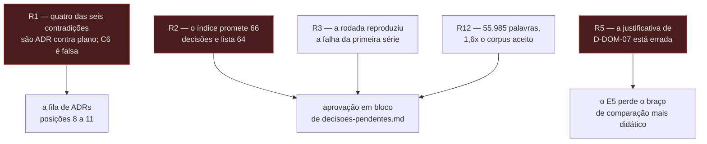

# Contra-avaliação da rodada de arquitetura de 2026-08-03

- **Estado:** Proposta — requer aprovação humana
- **Data:** 2026-08-04
- **Escopo:** registrar as objeções levantadas contra os dez documentos de proposta
  escritos em 2026-08-03, com evidência, e separar o que foi verificado por leitura
  direta do que não foi.
- **Depende de:** os dez arquivos da rodada, e a regra de processo de
  [`../../README.md`](../../README.md).

## Por que este documento existe

A regra de [`../../../AGENTS.md`](../../../AGENTS.md) — "Nada que importa pode existir apenas na
conversa" — vale para objeção tanto quanto para decisão. As objeções abaixo foram
produzidas por um agente adversarial instruído a refutar a rodada inteira, sem buscar
equilíbrio. Elas **não são veredito**: são o material que uma pessoa precisa ter lido
antes de aprovar qualquer linha de [`decisoes-pendentes.md`](decisoes-pendentes.md).

Este documento **não edita nada** da rodada. Ele também não é ADR, pelo mesmo motivo que
nenhum outro documento daquela rodada é.

## Como ler o estado de verificação

Cada objeção carrega um estado. A distinção importa porque um agente que ataca tudo
produz achados fortes e achados retóricos na mesma lista, e o repositório trata
afirmação não confirmada como `Pergunta em aberto`, nunca como fato.

| Estado          | Significado                                                      |
|-----------------|------------------------------------------------------------------|
| `verificado`    | as linhas citadas foram lidas e dizem o que a objeção afirma     |
| `não conferido` | a objeção é plausível e as citações não foram checadas uma a uma |
| `moderado`      | o achado vale, e a formulação do agente foi corrigida aqui       |

---

## R1 — Quatro das seis contradições são erro de categoria, e C6 é falsa

`verificado` para C6; `não conferido` para as demais.

**O que a rodada afirma.** [`decisoes-pendentes.md:42-48`](decisoes-pendentes.md) abre
com "seis contradições dentro de ADRs aceitos" e prescreve: "cada uma exige ADR novo, ou
uma subsunção".

**Por que está errado.** Quatro das seis não são contradições entre ADRs aceitos, e sim
divergências entre um ADR aceito e o `plano-do-laboratorio.md` — que
[`../../README.md`](../../README.md) declara não decidir nada. C1, C2, C4 e C5 têm
essa forma. Quando um ADR posterior diverge do plano, isso não é defeito: é o processo
funcionando. C5 é o caso mais nítido — o plano dizia que o log é persistido no fim da
execução; o ADR-0007, posterior e aceito, decidiu que a persistência é da etapa 6. Não
há o que reconciliar.

**C6 é falsa, e foi verificada linha a linha.** A rodada cita
`../../0002-o-dominio-minimo-e-os-dois-oraculos.md:93` ("Nenhuma outra coluna entra no
MVP") e conclui que o esquema proíbe `version`. Duas linhas adiante, o mesmo ADR resolve
o caso: "O esquema NÃO DEVE carregar uma coluna `version`. Quem a acrescenta é o ADR de
estratégias de concorrência, no mesmo commit em que decidir a política que a lê"
(`:95-96`). O ADR-0006 cumpriu essa delegação (`../../0006-a-forma-da-estrategia-de-concorrencia.md:56-58`). Não existe contradição:
existe delegação explícita, cumprida. O que falta é ferramenta de migração — item de
tarefa (`D-DAT-04`), não defeito em ADR aceito.

**Consequência se aprovado assim.** Seis ADRs novos entram na frente de uma fila de onze
posições, quatro deles para reconciliar um documento que não decide nada, e um para
resolver uma contradição inexistente. As posições que destravam código passam a esperar.

**O que deveria acontecer.** C6 sai da lista. C1 é a única com substância arquitetural,
e já tem destino em `D-ARQ-03`.

---

## R2 — O índice consolidador promete 66 decisões e lista 64

`verificado`.

**O que a rodada afirma.** [`decisoes-pendentes.md:5-7`](decisoes-pendentes.md):
"consolidar, numa fila só, as 66 decisões".

**A contagem.** Os identificadores únicos presentes em `decisoes-pendentes.md` somam
**64**. Os documentos-fonte contêm **66**. Duas decisões existem e não aparecem em bloco
nenhum:

- **`D-ARQ-02`** — onde a interface web é construída e empacotada, com seção própria em
  [`arquitetura-alvo.md`](arquitetura-alvo.md).
- **`D-DOM-11`** — `escalonamento` como bounded context, com seção própria em
  [`modelo-de-dominio.md:628`](modelo-de-dominio.md) e citada no glossário em
  [`../../../CONTEXT.md:571`](../../../CONTEXT.md).

**Consequência.** O índice é o único artefato que alguém leria antes de aprovar. Uma
aprovação "das 66" aprova 64 e deixa duas decisões sem estado.

**Pergunta em aberto.** O agente alega que `D-ARQ-02` é duplicata não declarada de
`D-UI-02`, e que a omissão esconde a duplicata. A alegação é plausível — as duas tratam
de empacotamento do frontend — e **não foi verificada aqui**.

---

## R3 — A rodada reproduziu a falha da primeira série

`verificado` para a regra; `não conferido` para as colisões (b) e (c).

**O que a rodada afirma.** [`decisoes-pendentes.md:22-26`](decisoes-pendentes.md) invoca
a lição do `adr/README.md` como "a razão de esta rodada ter produzido proposta, e não
decisão".

**Por que é frágil.** A regra citada não é "produza proposta em vez de decisão". Ela é
literal em [`../../README.md:181`](../../README.md):

> **Um ADR por vez. Nenhum rascunho antecipado.**

E o diagnóstico imediatamente acima (`:173-179`) nomeia o mecanismo, não o rótulo: os
seis ADRs da primeira série "foram rascunhados de uma vez, em paralelo. Escritos sem se
ver, produziram três contradições entre si", e "o custo de escrever seis ADRs em lote
foi inteiramente perdido". O dano não vem de os documentos se chamarem ADR; vem de serem
escritos sem se ver. Rotular a saída de `Proposta` cumpre a etiqueta e viola o
mecanismo.

**Colisões além da confessada.** A rodada confessa a colisão dos `Q-INT-*`
([`decisoes-pendentes.md`](decisoes-pendentes.md), seção
`## Uma nota sobre os identificadores Q-INT-*`). Três não confessadas:

- **(a) `verificado`** — [`mensageria.md`](mensageria.md) cria `Q-MSG-1` a `Q-MSG-7`, um
  espaço de nomes que nenhum documento do repositório registra. O repositório reconhece
  `Q-INT-N` para integração e `Q-NNNN-K` para questão encaminhada. `Q-MSG-*` não é
  nenhum dos dois, e não é mencionado uma única vez no índice.
- **(b) `não conferido`** — `barreira` é `aposentado` em
  [`../../../CONTEXT.md:220`](../../../CONTEXT.md) e termo vivo e normativo em `D-MSG-11`. Se
  `D-DOM-03` for aprovado, `D-MSG-11` precisa ser reescrito no mesmo turno.
- **(c) `não conferido`** — [`modelo-de-dados.md`](modelo-de-dados.md) fecha `D-DAT-05`
  dizendo que a decisão pertence ao ADR de Experiment; o índice a coloca no Bloco 1,
  "aprove agora", e não no Bloco 3, cuja recomendação é adiar.

---

## R4 — A quarentena do Bloco 3 vaza

`não conferido`.

**O que a rodada afirma.** [`decisoes-pendentes.md`](decisoes-pendentes.md), seção
`## Bloco 3 — pertencem a um ADR já enfileirado`:
"Aprovar qualquer uma destas antecipa um ADR enfileirado, e é a forma mais provável de
esta rodada causar dano."

**Por que é frágil.** A quarentena é sub-inclusiva. `D-DAT-05` (Bloco 1), `D-UI-08` e
`D-UI-10` (Bloco 2) decidem o ciclo de vida de uma execução — exatamente o que a fila
encaminhou para `Experiment`, posição 8 — sem que a palavra apareça na linha. A seção do
botão que dispara quatro execuções, em [`interface-web.md`](interface-web.md), já tem
wireframe, e um wireframe aprovado é mais difícil de reverter que uma linha de tabela.

**O que deveria acontecer.** As três mudam para o Bloco 3. Se o esquema realmente não
puder nascer sem saber quem limpa a tabela, isso é argumento para subir `Experiment` na
fila, não para decidi-lo por fora.

---

## R5 — A justificativa de `D-DOM-07` está errada, e o braço de comparação some

`moderado` — o achado vale; a formulação do agente foi corrigida.

**O que a rodada afirma.** [`decisoes-pendentes.md`](decisoes-pendentes.md), seção
`## Bloco 2 — destravam o E1 e a etapa 1`,
chama "o agregado clássico do DDD é antipadrão aqui" de "a descoberta conceitual da
rodada". A alternativa A de `D-DOM-07` é descartada porque "a fronteira transacional
impõe a invariante, e impor a invariante torna o write skew irreproduzível".

**Por que a justificativa está errada.** Um agregado com `Resource` como raiz e
`Allocation` como membro **não** impede write skew. O padrão carrega a raiz, avalia a
invariante em memória e persiste. Sob `READ COMMITTED`, duas transações concorrentes
carregam a raiz, cada uma vê `Σ = 0`, cada uma valida, cada uma insere. A soma final
estoura e nenhuma exceção é lançada — que é o resultado esperado do E5. Fronteira de
agregado é construção de aplicação: ela não coordena nada entre transações.

**A evidência citada aponta o mesmo mecanismo, contra a tese.** `D-DOM-08` invoca
`../../0002-o-dominio-minimo-e-os-dois-oraculos.md:566-574`. Aquele trecho descarta a
trigger no banco, e o segundo motivo, verificado aqui, é: "uma trigger que soma as
alocações roda dentro da mesma transação e sob o mesmo isolamento, e portanto sofre o
mesmo write skew. Ela não veria a linha da transação concorrente, e deixaria passar
exatamente o caso que deveria pegar" (`:570-573`). O ADR está dizendo que imposição
dentro da transação **não pega** a anomalia. O agregado tem o mesmo defeito, pelo mesmo
motivo.

**Onde a formulação do agente foi moderada.** Ele escreve que a evidência "prova o
contrário do que sustenta". É excessivo: a rodada usa `0002:566-574` por analogia com a
alternativa D, a constraint, que de fato **recusa** a alocação. A analogia é que falha —
uma constraint recusa, um agregado não. A conclusão de `D-DOM-07` pode sobreviver; a
justificativa escrita, não.

**Consequência.** Declarar o agregado antipadrão antes de escrevê-lo e vê-lo falhar
introduz a solução antes do problema, contra a regra pedagógica do `AGENTS.md` da raiz.
O plano já nomeia o fenômeno: proteção presente e inerte.

**O que deveria acontecer.** `D-DOM-07` volta com a alternativa A corretamente
caracterizada, e com uma quarta opção que nunca foi posta na mesa: o agregado canônico
como **braço de comparação do E5**.

---

## R6 — O limiar de SSE de `D-UI-09` foi inventado

`não conferido`.

`contratos-de-api.md` propõe dois limiares — mais de 500 observações, ou duração acima
de 2 segundos — mostra que o E1 cruza o primeiro, e conclui que o gatilho registrado no
plano mudou de "quando a primeira execução for longa" para "desde a primeira execução".

Três camadas de problema. **O número não foi medido**: a justificativa é que 500 eventos
a cerca de 200 bytes cabem em 100 kB, e o esquema do evento não existe. **A conta
apoia-se em fonte não normativa**: o cálculo parte do pseudocódigo de `0001:100-106`,
sobre o qual o `AGENTS.md` da raiz avisa que "o esboço não é normativo". **O gatilho foi
fabricado**: o plano lista o mecanismo de streaming entre as decisões deliberadamente
adiadas, com gatilho "a primeira execução longa o suficiente"; a rodada define sozinha o
que isso significa, escolhe um número que o MVP cruza, e declara o gatilho disparado.

É a mesma manobra que `D-ARQ-01` recusa para microsserviços, com o sinal trocado.

---

## R7 — A doutrina do gatilho é aplicada uma vez e suspensa cinco

`não conferido`.

A recomendação de `D-ARQ-01` — seguir o gatilho em vez de antecipar microsserviços — é a
mais defensável da rodada. O problema é que é a única vez em que a regra "nenhuma
tecnologia entra por estar disponível" foi aplicada contra a preferência instalada.

| Decisão    | Gatilho experimental que a exige               | O que entra mesmo assim      |
|------------|------------------------------------------------|------------------------------|
| `D-DAT-02` | misturar `increment` e `allocate` — não existe | remoção da FK                |
| `D-DAT-04` | nenhum — não há esquema para migrar            | Flyway com SQL versionado    |
| `D-ARQ-05` | nenhum — o import proibido exige código        | Maven multi-módulo, ArchUnit |
| `D-UI-03`  | nenhum — nenhuma tela foi construída           | shadcn/ui sobre Radix        |
| `D-UI-09`  | fabricado, ver R6                              | SSE                          |

**O que deveria acontecer.** Cada linha ganha, no documento-fonte, a frase: "esta
decisão não tem gatilho experimental e entra por conveniência de construção". Se a frase
for constrangedora de escrever, a decisão não deveria ser aprovada agora.

---

## R8 — `D-ARQ-12` não tem jurisdição sobre um ADR de outro repositório

`não conferido`.

A rodada recomenda "emendar a ADR 0017 do homelab para Maven", e
[`entrega-continua.md`](entrega-continua.md) amplia para quatro emendas: Gradle para
Maven, Toxiproxy fora, "monorepo de microsserviços JVM" fora, e a justificativa do
namespace.

A regra de imutabilidade não é capricho local. O `homelab-infrastructure` tem série,
índice e processo de aceitação próprios. Um documento de proposta não versionado daqui
produz, no melhor caso, um **pedido**. Além disso, quatro emendas num identificador
contraria a pergunta que o repositório exige antes de apresentar qualquer decisão:
existe uma decisão só?

E a mais consequente é a menos justificada: Maven contra Gradle não recebe argumento
técnico. A justificativa registrada é de jurisdição — "a escolha foi feita em outro
repositório" — e jurisdição justifica **reabrir** a decisão, não escolher Maven.

---

## R9 — `D-DAT-02` apaga um fenômeno em vez de observá-lo

`não conferido`.

A rodada chama `D-DAT-02` de "a justificativa mais afiada": com chave estrangeira, o
`INSERT` de uma alocação toma `FOR KEY SHARE` na linha do recurso e conflita com o `FOR
UPDATE` do `PESSIMISTIC`.

A mecânica do PostgreSQL está certa; as conclusões não. **Um lock adquirido por
integridade referencial, invisível no código da aplicação, colidindo com um lock
explícito, é matéria-prima de laboratório, não contaminação** — é literalmente "aparece
um bloqueio que ninguém declarou". Além disso, o argumento emprestado não se aplica:
"confundir observar com impedir" derrubou a constraint porque ela **recusa** a alocação;
uma FK não recusa nada, só adquire um lock.

A mitigação recomendada agrava: um teste do Lab Plane verificando alocações órfãs põe
uma garantia de integridade do sistema sob teste dentro do instrumento que o mede.

---

## R10 — `D-MSG-05` decide antes da variável que domina

`não conferido`.

Desligar DLX e limite de entregas até a etapa 8 é pedagogicamente correto e
operacionalmente indefensável no destino de entrega escolhido. O cenário 18 é, por
construção, um laço de reentrega infinita, e o laboratório roda num K3s de homelab sob
`selfHeal: true`, ao lado de outras cargas. Um laço sem limite e sem destino morto num
broker compartilhado cresce até alguém intervir — e intervenção manual é, pelas regras
deste usuário, diagnóstico e não solução.

Existe uma terceira alternativa que o documento não considera: **DLX e limite ligados,
com valores declarados por experimento**, e o cenário 18 rodando com limite alto o
bastante para exibir o laço e finito o bastante para terminar.

Antes de tudo isso, porém: **não está escrito onde um experimento roda**. Se roda na
máquina do engenheiro, o custo de desligar a DLX é zero. Decidir `D-MSG-05` antes dessa
pergunta é decidir sem a variável dominante.

---

## R11 — `D-MSG-10` gasta uma linha de aprovação para ratificar a regra vigente

`não conferido` para a forma; o mérito sobrevive, ver a última seção.

O argumento de que o CDC apaga os pontos `BEFORE_PUBLISH` e `AFTER_PUBLISH` é bom e
novo. O que não sobrevive é o estatuto: [`arquitetura-alvo.md`](arquitetura-alvo.md) já
resolve a mesma questão numa linha de tabela — "Debezium para CDC, sem etapa, nenhum
gatilho nomeado" —, que é o formato usado para Kafka, Helm, service mesh, OpenTelemetry
e Valkey, nenhum dos quais recebeu identificador de decisão. Nenhuma peça sem gatilho
precisa de decisão: a regra do plano já a mantém fora.

---

## R12 — O volume, medido

`verificado`.

| Corpus                                     | Linhas | Palavras   |
|--------------------------------------------|--------|------------|
| Rodada de 2026-08-03 (10 arquivos)         | 7.186  | **55.985** |
| Sete ADRs aceitos mais o plano             | —      | 35.084     |
| Os quatro Feature Cards juntos             | —      | 2.878      |
| Limite de um Feature Card (`../../../AGENTS.md`) | —      | **700**    |

A rodada é **1,6x** todo o corpus decisório acumulado, escrita em um dia, e **19,5x** a
soma dos quatro cards. `mensageria.md` sozinha é mais de treze vezes o limite de um
card.

**Por que o limite não a alcança, e por que isso é o defeito.** O limite de 700 palavras
não é estética. A justificativa está escrita: "Um card acima disso cobre mais de uma
capacidade — divida." É um detector de escopo. `mensageria.md` cobre gatilho de broker,
topologia, envelope, catálogo de eventos, pontos de injeção, garantias de entrega, DLQ,
CDC, esboço de AsyncAPI, onze decisões e duas listas de adições. O detector teria
disparado na terceira. Não disparou porque o documento não se chama Feature Card.

**O que envelhece.** Cada afirmação da rodada é ancorada em `arquivo:linha`. Um único
commit que insira um parágrafo em `plano-do-laboratorio.md` desalinha centenas de
citações de uma vez, e nenhuma delas falha ruidosamente — elas passam a apontar para a
linha errada, em silêncio.

---

## R13 — Decisões em silêncio, termos sem glossário, números sem origem

`não conferido`, exceto onde indicado.

**Decisões que nunca viraram linha da fila.** O espaço de nomes `Q-MSG-*`
(`verificado`). Nove questões de integração novas, `Q-INT-9` a `Q-INT-17`, quase
quadruplicando o backlog. `D-ARQ-02` e `D-DOM-11`, ausentes do índice (`verificado`, ver
R2). Uma condição nova de recusa de relatório, introduzida como cláusula subordinada de
uma recomendação em `D-MSG-11`. Um teste de alocações órfãs que é, na prática, um
terceiro oráculo.

**Termos usados sem entrada no glossário**, embora [`../../../CONTEXT.md`](../../../CONTEXT.md)
tenha sido escrito na mesma rodada: `seam` (usado para definir outro termo, e sem
entrada própria), `Shared Kernel`, `posicao` como identificador de evento, e `modo ordem
garantida`.

**Números sem origem declarada.** Teto de 200.000 eventos no navegador — o texto admite
que é "um número proposto, não medido". Virtualização a partir de 500 linhas. Lotes de
100 ms. 500 observações como limiar de stream. 2 segundos de duração. Cerca de 200 bytes
por observação. 50 workers como limite do MVP. Quatro módulos Maven.

Nenhum é ilegítimo como hipótese. Todos são ilegítimos como o que hoje são: entrada de
uma decisão que pede aprovação humana. Um limiar sem medição é pergunta em aberto.

---

## Auditoria de citações

O agente amostrou 20 referências `arquivo:linha` e relata **9 com defeito** — 4
`errado`, 4 `impreciso`, 1 `inverificável`, taxa de falha de 45%. Quatro dessas
verificações foram refeitas aqui por leitura direta e as quatro conferiam com o relato,
o que sugere que a taxa real pode ser menor que 45% na população inteira. As falhas
relatadas não são periféricas:

| Citação                | Defeito relatado                                                  |
|------------------------|-------------------------------------------------------------------|
| `0002:93` (C6)         | leitura falsa por omissão do contexto imediato — `verificado`     |
| `0006:56-57` (C6)      | a citação confere; o uso dela não — `verificado`                  |
| `D-UI-12` (C5)         | atribuído a `interface-web.md`, que vai só até `D-UI-07`          |
| `0002:566-574`         | usado para sustentar tese que o mecanismo descrito enfraquece     |
| `0001:507-515`         | o ADR delega à arquitetura mínima, não a um documento de proposta |
| `0003:155-167`         | credita ao ADR-0003 o que o próprio texto credita ao ADR-0004     |
| `0001:100-106`         | base numérica tirada de esboço declarado não normativo            |
| `plano:344`            | "dois processos para os workers" é interpretação, não texto       |
| `200 bytes/observação` | sem citação; o esquema do evento não existe                       |

---

## O que sobrevive ao ataque

A lista curta do que o agente tentou derrubar e não conseguiu.

1. **C1 é real, novo e sério.** O contador de workers ativos do ADR-0005 vive na memória
   de um processo, o zero dele é o sinal que o oráculo aguarda, e a etapa 4 introduz uma
   segunda instância. As duas citações foram verificadas e conferem. Nenhum documento do
   repositório registrava isso. O tratamento correto é o que a rodada já dá em
   `D-ARQ-03`: registrar e adiar até a etapa 4 ter gatilho.
2. **O argumento central de `D-MSG-10`.** O CDC apaga os pontos `BEFORE_PUBLISH` e
   `AFTER_PUBLISH`, e o plano nomeia `BEFORE_PUBLISH` como gatilho do formato interno da
   injeção de falha. É melhor que qualquer argumento de custo. A objeção de R11 é ao
   estatuto de "decisão", não ao raciocínio.
3. **A recomendação de `D-ARQ-01`.** Seguir o gatilho contra a stack nomeada é a leitura
   correta do repositório. A objeção de R7 é que ela é a única aplicação da regra na
   rodada, não que esteja errada.
4. **A recusa de desenhar T6.** Num documento de 803 linhas que desenha quatro telas com
   wireframe, a tela cuja decisão de formato está na fila ficou em branco, com o motivo
   escrito. Isso é disciplina, não retórica.
5. **A marcação `Conhecimento externo` em [`mensageria.md`](mensageria.md).** O
   documento separa o que verificou no repositório do que afirma sobre RabbitMQ, AMQP e
   PostgreSQL, e chega a declarar pendências contra si mesmo. Nenhum outro documento faz
   isso, e todos deveriam.
6. **`D-DOM-01` a `D-DOM-04`.** As colisões de `execução`, `controle`, `barreira` e
   `estratégia` entre ADRs aceitos são reais. São quatro decisões baratas, independentes
   da fila, e caras depois de existir código. É o único bloco aprovável como está — com
   a ressalva de R3 (b): aprovar `D-DOM-03` obriga a reescrever `D-MSG-11` no mesmo
   turno.

## Perguntas em aberto

**P1 — A regra "um ADR por vez, nenhum rascunho antecipado" alcança documento de
arquitetura que não é ADR?** O texto de [`../../README.md:181`](../../README.md) não
faz a distinção, e a rodada de 2026-08-03 a assumiu sozinha. Ou a regra vale para todo
documento de arquitetura — e a rodada é reprocessada um assunto por vez — ou ela é
emendada por decisão explícita do usuário.

**P2 — Existe limite de escopo para documento de arquitetura?** O Feature Card tem 700
palavras e uma justificativa que é de escopo, não de estética. Nenhum outro artefato do
repositório tem limite. R12 argumenta que a ausência é o que permitiu um arquivo de dez
assuntos.

**P3 — Quem aprova esta contra-avaliação?** A mesma lacuna que
`specification-process.md` registra para o Feature Card, e que
[`../../../CONTEXT.md`](../../../CONTEXT.md) registra em `P1`, alcança este arquivo.
