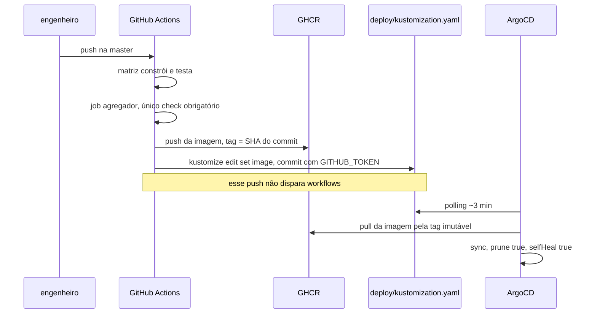

# Entrega contínua no homelab desde o dia zero

- **Estado:** Proposta — requer aprovação humana
- **Data:** 2026-08-03
- **Escopo:** o que ratificar e o que emendar da ADR 0017 do `homelab-infrastructure`, a
  forma do `deploy/` que conserta o `ComparisonError`, e o workflow que empacota o
  primeiro módulo.
- **Depende de:** [`ADR-0002`](../../0002-o-dominio-minimo-e-os-dois-oraculos.md),
  [`ADR-0004`](../../0004-o-estatuto-da-barreira-e-o-diagnostico-da-nao-ocorrencia.md),
  [`ADR-0007`](../../0007-o-log-de-observacoes-forma-ordem-e-onde-vive.md), todos
  `Aceito`. Responde a [`Q-0004-4`](../../../questions/Q-0004-4.md) e trata `Q-INT-3` e
  `Q-INT-4` de [`../../../architecture/integrations.md`](../../../architecture/integrations.md).

## O ponto de partida é um erro em produção

O `Application` do ArgoCD está commitado em
`kubernetes/applications/apps/distributed-consistency-lab.yaml`, aponta para
`path: deploy` deste repositório com `prune: true` e `selfHeal: true`, e esse diretório
foi apagado nos commits `83fcfc9` e `e1c88ae`. O cluster reporta `ComparisonError` para
este app hoje (`../../../architecture/integrations.md:25`, `39-60`; `plano-do-laboratorio.md:757-771`).

O conserto é o primeiro entregável desta decisão, e ele não espera o primeiro módulo
compilável — `D-ARQ-15`.

## A ADR 0017, item a item

A ADR 0017 do `homelab-infrastructure` está `Aceita` desde 2026-07-26 e decide sobre
**este** repositório. O replanejamento daqui é de 2026-07-28, e a premissa que ela usa —
"monorepo público de microsserviços JVM" — descreve a arquitetura arquivada
(`plano-do-laboratorio.md:779-784`). Absorver em silêncio o que ela decide seria o erro
que a regra dura do repositório existe para impedir.

| Item da ADR 0017                                                 | Recomendação aqui  | Motivo                                                                                                     |
|------------------------------------------------------------------|--------------------|------------------------------------------------------------------------------------------------------------|
| CI/CD exclusivamente no GitHub Actions, runner hospedado         | ratificar          | Testcontainers exige daemon Docker, e o repositório é público — o motivo independe da contagem de módulos  |
| imagem no GHCR com `GITHUB_TOKEN` efêmero                        | ratificar          | evita credencial de longa duração como secret em repositório aberto                                        |
| tag da imagem = SHA do commit, nunca `latest`                    | ratificar          | tag mutável faria o ArgoCD reportar `Synced` com outro binário rodando                                     |
| `deploy/` neste repositório, renderizado por Kustomize           | ratificar          | escrever no homelab exigiria deploy key read-write da infraestrutura inteira num repo público              |
| bump de imagem em job único, fora da matriz, com `GITHUB_TOKEN`  | ratificar          | push com esse token não dispara workflows, o que evita recursão de build                                   |
| ArgoCD observa este repositório por HTTPS anônimo                | ratificar          | o repositório é público e não há credencial a casar                                                        |
| sync por polling ~3 min, sem webhook                             | ratificar          | o Cloudflare Access na frente do ArgoCD bloquearia o POST não interativo                                   |
| job agregador como único check obrigatório                       | ratificar          | um check filtrado por `paths:` nunca reporta status e trava o PR para sempre                               |
| Secrets ficam no homelab, referenciados por nome                 | ratificar          | nenhum Secret vai para o repositório público                                                               |
| primeira imagem no GHCR nasce privada, com passo manual          | ratificar          | o sintoma é `ImagePullBackOff`, que se parece com erro de rede — vale registrar antes de acontecer         |
| Ruleset com bypass para o GitHub Actions                         | ratificar com nota | a alternativa descartada lá preserva a proteção de branch; ver `Perguntas em aberto`                       |
| bibliotecas compartilhadas como referência de projeto **Gradle** | **emendar**        | a escolha de build deste repositório foi feita em outro repositório, como detalhe de contexto — `D-ARQ-12` |
| **Toxiproxy** para injetar partição e latência de rede           | **emendar**        | nenhum experimento antes da etapa 5 usa rede, e a rede não produz duplicata semântica — `D-ARQ-10`         |
| "monorepo de microsserviços JVM", "matriz de serviços"           | **emendar**        | o MVP é uma aplicação e um banco; a matriz nasce com um item                                               |
| namespace único porque "eles falam entre si o tempo todo"        | **emendar**        | não há "eles" — há um processo. O namespace continua, com outra justificativa                              |

Quatro emendas, e nenhuma delas contradiz o que a ADR 0017 decidiu sobre **CI/CD**. As
três primeiras corrigem premissas de arquitetura que o replanejamento arquivou dois dias
depois; a quarta corrige uma justificativa, e não o resultado.

## A forma do `deploy/`

**Proposta:**

```
deploy/
├── kustomization.yaml     # images: com a tag bumpada pelo workflow
├── namespace.yaml
├── deployment.yaml        # uma réplica; Secrets referenciados por nome
├── service.yaml
└── httproute.yaml         # tipo do recurso de exposição não verificado
```

Quatro propriedades da forma acima merecem justificativa.

**Uma réplica, e não duas.** Duas réplicas antecipariam a etapa 4 sem gatilho
(`plano-do-laboratorio.md:362-364`), e o `JVM_LOCK` passaria a falhar por acidente de
entrega, e não por experimento. O experimento da etapa 4 precisa que a segunda instância
seja uma decisão declarada.

**Nenhum Secret.** O `Deployment` referencia por nome os Secrets que vivem cifrados com
SOPS/KSOPS no homelab, entregues por um `Application` irmão. É consequência registrada
na ADR 0017 e não muda com a arquitetura.

**O `namespace.yaml` interage com `prune: true`.** Apagar esse arquivo remove o
namespace e tudo dentro dele no próximo sync, inclusive o volume de um PostgreSQL
dedicado. O plano já registra que `prune: true` alcança este repositório e que arrumar
diretórios aqui deixou de ser barato (`plano-do-laboratorio.md:855-858`); com o
namespace declarado aqui, o custo de um engano passa a incluir dado. Se o namespace é
declarado aqui ou no homelab está em `Perguntas em aberto`.

**O recurso de exposição não foi verificado.** A ADR 0017 cita a ADR 0007 do homelab
para TLS wildcard reusado pelos hostnames dos apps. O tipo concreto do recurso —
`Ingress`, `IngressRoute` do Traefik, ou `HTTPRoute` — não foi confirmado neste
levantamento, e o nome de arquivo acima é ilustrativo.

## Artefato, porta e health check

**Proposta:** um artefato, uma imagem OCI, construída a partir do jar executável do
Spring Boot. A porta é `8080`. A imagem inclui a interface web como conteúdo estático,
se `D-ARQ-02` de [`arquitetura-alvo.md`](arquitetura-alvo.md) escolher a exportação
estática.

O `Deployment` precisa de probes, e é aqui que a entrega toca a medida. Um experimento
do grupo D satura o processo de propósito (`plano-do-laboratorio.md:216-224`). Uma probe
de liveness com folga curta reinicia o pod no meio da saturação, e o experimento passa a
medir o kubelet junto com o fenômeno. É a confusão system under test / Lab Plane um
nível abaixo, com outra causa que não a da etapa 6.

**Proposta:** a probe de liveness verifica apenas que o processo responde, com folga
declarada acima da maior latência que um experimento do grupo D pode produzir; a probe
de readiness não depende de carga de experimento. O número da folga não pode ser
proposto aqui, porque nenhum experimento do grupo D foi executado — está em `Perguntas
em aberto`.

## O workflow

Dois caminhos, um em Pull Request e outro na `master`.

No Pull Request, a matriz constrói e testa o que mudou, e um job agregador com `needs`
da matriz e `if: always()` é o **único** check obrigatório. A ADR 0017 já registra o
motivo: um check filtrado por `paths:` nunca reporta status e trava o PR para sempre.
Com um módulo, a matriz nasce com um item — a forma sobrevive, o número muda.

Na `master`, a mesma construção roda, a imagem sobe para o GHCR com a tag igual ao SHA
do commit, e um job único fora da matriz executa `kustomize edit set image` e commita
com o `GITHUB_TOKEN`. Esse push não dispara workflows, o que evita recursão. O ArgoCD
encontra o commit no polling seguinte, em cerca de três minutos.



O que o job de teste executa é decisão aberta, e não detalhe: um experimento é uma
medida, e uma medida que precisa ficar verde deixa de ser medida. É `D-ARQ-14`, e ela
responde [`Q-0004-4`](../../../questions/Q-0004-4.md).

## Decisões que exigem aprovação humana

| ID         | Decisão                                                 | Alternativas                                                                          | Recomendação                                                   | Por que só uma pessoa decide                                               |
|------------|---------------------------------------------------------|---------------------------------------------------------------------------------------|----------------------------------------------------------------|----------------------------------------------------------------------------|
| `D-ARQ-10` | Toxiproxy entra ou não entra                            | emendar a ADR 0017 e retirar; manter e usar na etapa 5; manter sem uso                | emendar e retirar até haver gatilho                            | contraria um documento aceito em outro repositório                         |
| `D-ARQ-11` | PostgreSQL dedicado contra compartilhado com a Camada 6 | dedicado no namespace do laboratório; compartilhado; contêiner no `deploy/`           | dedicado                                                       | troca custo de infraestrutura por validade da medida — `Q-INT-3`           |
| `D-ARQ-12` | Maven contra Gradle                                     | ratificar Gradle; emendar para Maven; deixar em aberto até o primeiro módulo          | emendar para Maven                                             | uma decisão sobre este repositório foi tomada em outro — `Q-INT-4`         |
| `D-ARQ-13` | Experimento destrutivo sob `selfHeal: true`             | fora do cluster; matar a operação; desligar `selfHeal` durante a execução             | matar a operação, com o processo preservado                    | decide se a etapa 6 mede o fenômeno ou o orquestrador                      |
| `D-ARQ-14` | O que o pipeline executa                                | só guardas e provas; experimentos com `N` declarado; experimento reduzido no CI       | só guardas e provas; experimento roda sob demanda              | um experimento no CI transforma um instrumento de medida em teste instável |
| `D-ARQ-15` | A forma do `deploy/` no primeiro commit                 | `deploy/` mínimo agora; esperar o primeiro módulo; remover o `Application` no homelab | `deploy/` mínimo agora, com uma réplica e a imagem já bumpável | o cluster reporta erro hoje, e a escolha decide quanto tempo ele continua  |

### `D-ARQ-10` — Toxiproxy entra sem gatilho

**O problema.** A ADR 0017 nomeia Toxiproxy no contexto, junto de Testcontainers, como
requisito do CI deste laboratório. Nenhum documento daqui o pediu.

**Alternativa 1 — emendar e retirar até haver gatilho.** A favor: nenhum experimento
antes da etapa 5 usa rede entre partes, e o `arquivo/0012` já concluiu que a falha na
rede não produz duplicata nem reordenação semântica, que são os casos do grupo B
(`../../arquivo/0006-hexagonal-com-archunit.md:140-143`). Contra: emendar exige tocar
um documento aceito em outro repositório, com o processo que aquele repositório tiver.

**Alternativa 2 — manter e usar na etapa 5.** A favor: atraso, partição e queda de
conexão são fenômenos reais do grupo B, e o cenário 37 do briefing é descrito como um
botão de latência (`plano-do-laboratorio.md:160-162`). Contra: a decisão de como o canal
é interceptado é da etapa 5 e não foi tomada; fixá-la agora escolhe o mecanismo antes do
experimento.

**Alternativa 3 — manter e não usar.** A favor: nada a emendar. Contra: uma tecnologia
listada e sem uso é exatamente o que a regra estrutural do repositório proíbe.

**Recomendação.** Alternativa 1.

**Se a escolha for outra.** Manter Toxiproxy exige nomear, agora, qual experimento não
roda sem ele — e a resposta muda o roadmap da etapa 5.

### `D-ARQ-11` — PostgreSQL dedicado contra compartilhado

**O problema.** O homelab já tem PostgreSQL na Camada 6, e a economia de reusá-lo é
direta. O laboratório produz deadlock e saturação de propósito
(`plano-do-laboratorio.md:847-853`). É `Q-INT-3`, `pendente`.

**Alternativa 1 — dedicado ao namespace do laboratório.** A favor: a linha de base do
experimento deixa de depender das outras cargas, e as outras cargas deixam de sofrer o
deadlock produzido de propósito. Contra: custa exatamente o que a Camada 6 economizava,
e acrescenta um volume ao namespace que `prune: true` alcança.

**Alternativa 2 — compartilhado, com banco próprio.** A favor: nenhum recurso novo, e o
isolamento por banco e usuário já é prática do homelab. Contra: contenção de conexões,
de CPU e de I/O atravessa a fronteira do banco lógico; um laboratório cuja linha de base
depende dos vizinhos não tem linha de base.

**Alternativa 3 — contêiner declarado no próprio `deploy/`.** A favor: o laboratório
fica autocontido e reconstruível com um `git clone`. Contra: reimplementa o que a Camada
6 já oferece com backup e operação, e o volume passa a depender de manifesto deste
repositório.

**Recomendação.** Alternativa 1, que é a recomendação já registrada no plano.

**Se a escolha for outra.** Compartilhar exige declarar, no relatório de todo
experimento, que a medida foi feita num banco com vizinhos — do contrário dois
relatórios com o mesmo veredito afirmam coisas diferentes.

### `D-ARQ-12` — Maven contra Gradle

**O problema.** A ADR 0017 decide "referência de projeto Gradle" como item 4 da seção
`## Decisão`. O plano deste repositório presume reactor Maven e classifica a colisão
como de governança, e não técnica (`plano-do-laboratorio.md:806-814`). É `Q-INT-4`,
`pendente`.

**Alternativa 1 — ratificar Gradle.** A favor: a decisão já está aceita, o build
incremental e o cache de configuração encurtam o ciclo, e nada no roadmap depende de
Maven. Contra: a escolha foi feita como detalhe de contexto de uma decisão de CI/CD, sem
debate aqui, e o repositório tem uma regra dura contra absorver isso em silêncio.

**Alternativa 2 — emendar para Maven.** A favor: `D-ARQ-05` de
[`modulos-e-fronteiras.md`](modulos-e-fronteiras.md#d-arq-05--o-mecanismo-de-módulo-do-primeiro-artefato)
propõe a fronteira entre regiões como dependência declarada entre módulos, e o
repositório já tem uma decisão arquivada com a forma do reactor
(`../../arquivo/0005-monorepo-com-reactor-unico.md:29-49`). Contra: emendar um
documento aceito em outro repositório tem custo de processo, e o argumento técnico a
favor de Maven não é decisivo — Gradle expressa a mesma fronteira entre módulos.

**Alternativa 3 — deixar em aberto até o primeiro módulo.** A favor: nenhuma escolha
prematura. Contra: o pipeline do dia zero precisa saber o que empacotar, e o plano
registra que o build deixou de ser adiável por isso (`plano-do-laboratorio.md:614`).

**Recomendação.** Alternativa 2. O argumento não é que Gradle seja pior; é que a escolha
precisa ser feita aqui, e o repositório já tem a forma Maven escrita e citada.

**Se a escolha for outra.** Ratificar Gradle exige reescrever a proposta de artefatos de
`D-ARQ-06` em `modulos-e-fronteiras.md`, e a tabela de módulos passa a nomear
`build.gradle.kts` em vez de `pom.xml`. Nada mais muda.

### `D-ARQ-13` — experimento destrutivo sob `selfHeal: true`

**O problema.** A etapa 6 mata o processo de propósito; o kubelet o reinicia e o ArgoCD
reconcilia. O experimento passa a medir o orquestrador junto com o fenômeno
(`plano-do-laboratorio.md:837-845`). O plano nomeia três candidatas e não escolhe
nenhuma.

**Alternativa 1 — rodar experimentos destrutivos fora do cluster.** A favor: o
orquestrador some da medida por completo, e nenhuma configuração precisa mudar. Contra:
o laboratório passa a ter dois ambientes de execução com resultados que ninguém provou
comparáveis, e a entrega no cluster vira vitrine para uma parte do roadmap.

**Alternativa 2 — matar a operação, e não o processo.** A favor: a fronteira
`AFTER_COMMIT` existe exatamente para isso, e o ADR-0001 a descreve como o instante em
que o commit aconteceu e a falha injetada logo depois produz o dual write
(`../../0001-o-passo-como-unidade-de-execucao.md:416-419`). O orquestrador não reage,
porque o processo não morre. Contra: não é o mesmo fenômeno. Um processo que morre perde
o log em memória e as conexões abertas, e o ADR-0007 fixa a etapa 6 como o gatilho da
persistência durável justamente por isso
(`../../0007-o-log-de-observacoes-forma-ordem-e-onde-vive.md:177-181`).

**Alternativa 3 — desligar `selfHeal` durante a execução.** A favor: o processo morre de
verdade e o experimento é fiel. Contra: o Lab Plane passa a escrever no `Application` do
ArgoCD, o que é o instrumento operando a infraestrutura que o hospeda — a mesma confusão
entre planos, agora com credencial de escrita no painel de controle do homelab.

**Recomendação.** Alternativa 2 no primeiro experimento da etapa 6, com a diferença
registrada no relatório, e alternativa 1 reservada para o experimento que exigir a morte
do processo. A escolha não fecha: ela adia a alternativa 1 até existir um experimento
que a alternativa 2 não reproduza.

**Se a escolha for outra.** A alternativa 3 exige decidir quem guarda a credencial de
escrita no ArgoCD, e essa decisão pertence ao `homelab-infrastructure`, não a este
repositório.

### `D-ARQ-14` — o que o pipeline executa

**O problema.** [`Q-0004-4`](../../../questions/Q-0004-4.md) registra que `N` declarado antes
cria um custo de tempo, que um `N` alto ocupa o runner e um `N` baixo produz um
experimento que passa numa execução e falha na seguinte. Nenhum dos dois repositórios
decidiu se um experimento roda no pipeline.

**Alternativa 1 — só guardas e provas.** O pipeline executa as guardas executáveis, a
prova de equivalência de traço de SQL do ADR-0001 e os testes com Testcontainers; nenhum
experimento. A favor: o pipeline permanece determinístico, e o E1 continua **obrigado a
falhar** sem que isso pinte a build de vermelho — um experimento cujo resultado esperado
é a violação inverteria o significado de verde. Contra: uma regressão que só apareça sob
carga concorrente só é vista quando alguém executar o experimento.

**Alternativa 2 — experimentos com `N` declarado no pipeline.** A favor: toda mudança é
medida, e o caderno de laboratório cresce sozinho. Contra: a calibração dobra a duração
de toda execução (`../../0002-o-dominio-minimo-e-os-dois-oraculos.md:445-446`), e um
veredito probabilístico num check obrigatório é falha intermitente por construção — que
a tensão 2 do plano chama do pior resultado possível num instrumento de medida.

**Alternativa 3 — versão reduzida com `N` menor no CI.** A favor: alguma cobertura sob
concorrência, em tempo aceitável. Contra: é uma terceira execução com um terceiro
significado, como a própria `Q-0004-4` observa, e um `N` reduzido muda o limite de
confiança que o ADR-0004 publica.

**Recomendação.** Alternativa 1. O experimento roda sob demanda, e o relatório dele
entra em `docs/experiments/`, que é onde o plano já o coloca.

**Se a escolha for outra.** A alternativa 2 exige que a regra de parada e o `N` sejam
decididos antes do primeiro workflow, o que move `Q-0004-4` para dentro do dia zero.

### `D-ARQ-15` — a forma do `deploy/` no primeiro commit

**O problema.** O cluster reporta `ComparisonError` agora. Consertar exige escolher se o
`deploy/` nasce antes, junto, ou depois do primeiro módulo compilável.

**Alternativa 1 — `deploy/` mínimo agora.** Namespace, `Deployment` de uma réplica,
`Service` e recurso de exposição, com a imagem apontando para uma tag que o primeiro
workflow bumpa. A favor: o erro some no próximo sync, e o `deploy/` nasce junto do
módulo, como a ADR 0017 exige. Contra: entre o commit do `deploy/` e a primeira imagem
publicada, o pod fica em `ImagePullBackOff`, o que troca um erro por outro.

**Alternativa 2 — esperar o primeiro módulo.** A favor: nenhum manifesto aponta para
imagem inexistente. Contra: o erro continua até que a decisão de arquitetura mínima seja
aprovada, e o plano registra que a prioridade dele subiu por causa disso
(`plano-do-laboratorio.md:723-729`).

**Alternativa 3 — remover o `Application` no homelab.** A favor: o erro some hoje, sem
nenhum manifesto aqui. Contra: exige commit no outro repositório e desfaz a ligação que
a ADR 0017 criou; quando o módulo existir, alguém precisa lembrar de recriá-la.

**Recomendação.** Alternativa 1, com o `deploy/` e o primeiro workflow no mesmo commit
que cria o módulo — o que faz o `ImagePullBackOff` durar apenas o tempo do primeiro
build.

**Se a escolha for outra.** A alternativa 3 exige registrar em `../../../architecture/integrations.md` que a
única integração real deixou de existir, e não apenas que ela está quebrada.

## Perguntas em aberto

**O Ruleset com bypass não foi comparado com a branch `deploy` neste repositório.** A
ADR 0017 adota o Ruleset e registra que a alternativa preservaria a proteção de branch
intacta. O plano nota que esse argumento é valorizado aqui
(`plano-do-laboratorio.md:860-864`). Faltou: saber se a `master` deste repositório tem
proteção configurada hoje — o estado vive na interface do GitHub e não pôde ser
verificado a partir da árvore versionada.

**O tipo do recurso de exposição HTTP não foi confirmado.** A ADR 0017 cita TLS wildcard
reusado pelos hostnames dos apps, sem nomear o tipo do recurso. Faltou: ler os manifests
da Camada 7 do `homelab-infrastructure`.

**Quem declara o namespace.** Se `deploy/` o declara, `prune: true` passa a alcançar o
namespace inteiro e o volume de um PostgreSQL dedicado. Se o homelab o declara, este
repositório passa a depender de um recurso que ele não vê. Faltou: a convenção que os
outros `Application` da Camada 8 usam — não há outro hoje.

**A folga da probe de liveness não tem número.** Ela precisa ser maior que a maior
latência que um experimento do grupo D pode produzir, e nenhum experimento do grupo D
foi executado. Faltou: a primeira curva de saturação.

**Não está escrito onde um experimento é executado.** É a mesma lacuna registrada como
`Q-INT-6` em
[`arquitetura-alvo.md`](arquitetura-alvo.md#adições-propostas-a-integrationsmd), e ela
decide o significado de `D-ARQ-14`: um experimento sob demanda precisa de um lugar para
rodar.

## Adições propostas a `integrations.md`

As linhas abaixo são propostas. **Nenhuma edição foi feita naquele arquivo.**

| Origem         | Destino                      | Tipo   | Operação/tópico                  | Finalidade                                 | Contrato  | Autenticação          | Confiabilidade                                               | Evidência                                  |
|----------------|------------------------------|--------|----------------------------------|--------------------------------------------|-----------|-----------------------|--------------------------------------------------------------|--------------------------------------------|
| kubelet do K3s | aplicação do laboratório     | HTTP   | probe de liveness e de readiness | decidir se o pod é reiniciado              | nenhum    | nenhuma               | reinicia o pod durante um experimento do grupo D             | hipótese — esta proposta, seção `Artefato` |
| ArgoCD         | namespace do laboratório     | GitOps | `prune` de recursos removidos    | reconciliar o que o `deploy/` declara      | Kustomize | leitura anônima       | `prune: true` alcança o namespace, se ele for declarado aqui | **fato** — `../../../architecture/integrations.md:25`            |
| GitHub Actions | PostgreSQL do Testcontainers | JDBC   | testes de integração no runner   | executar as provas exigidas por ADR aceito | —         | efêmera, do contêiner | independente do PostgreSQL do cluster                        | hipótese — ADR 0017, contexto, requisito 1 |

Proposta de mudança de estado numa linha existente: quando `D-ARQ-15` for aprovada e o
`deploy/` existir, a primeira linha da matriz deixa de ser **fato quebrado** e passa a
ser **fato**. A frase "A única integração real está quebrada" e o diagrama que a
acompanha saem junto (`../../../architecture/integrations.md:39-60`).

Proposta de encaminhamento: `Q-INT-3` e `Q-INT-4` passam a ter destino nomeado —
`D-ARQ-11` e `D-ARQ-12` deste documento — e continuam `pendente` enquanto ninguém as
aprovar.
